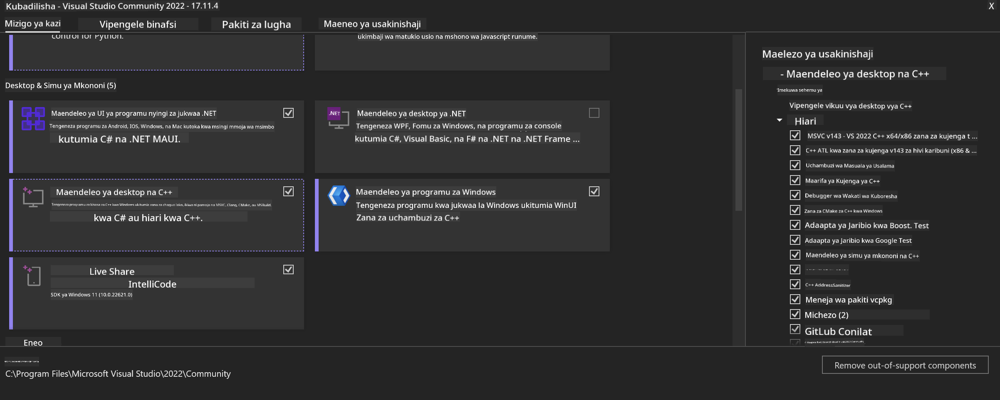
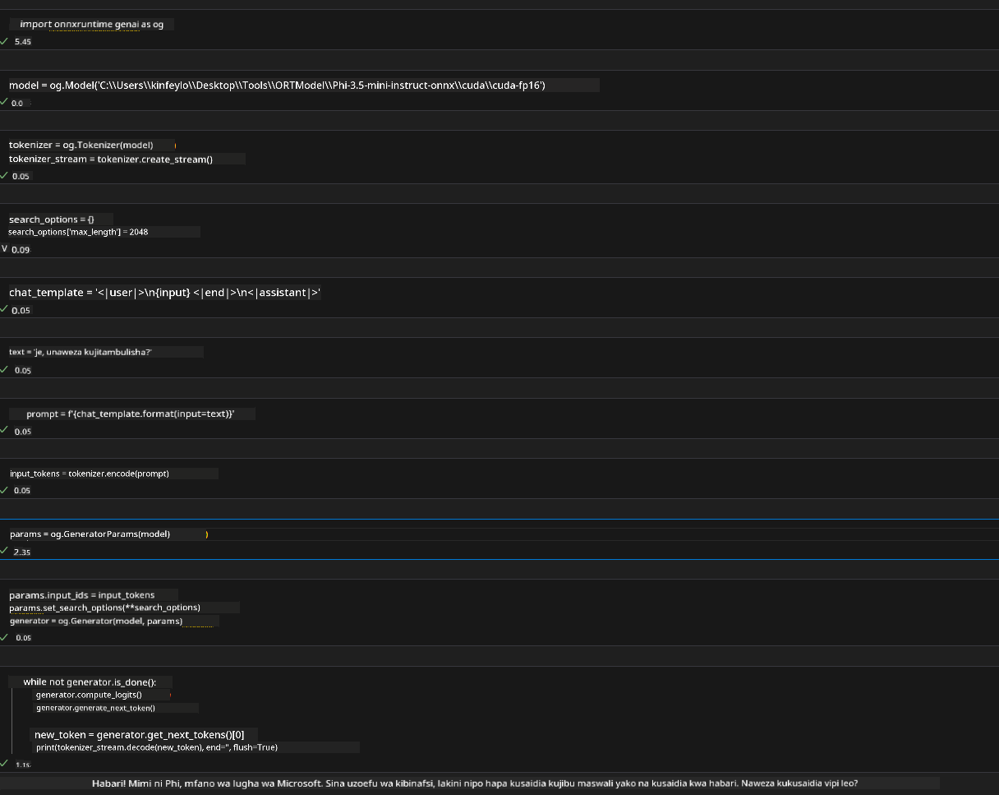
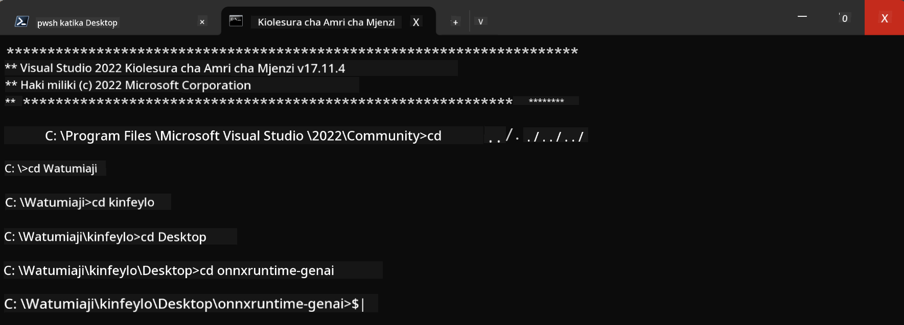

<!--
CO_OP_TRANSLATOR_METADATA:
{
  "original_hash": "b066fc29c1b2129df84e027cb75119ce",
  "translation_date": "2025-05-09T18:45:48+00:00",
  "source_file": "md/02.Application/01.TextAndChat/Phi3/ORTWindowGPUGuideline.md",
  "language_code": "sw"
}
-->
# **Mwongozo wa OnnxRuntime GenAI Windows GPU**

Mwongozo huu unatoa hatua za kusanidi na kutumia ONNX Runtime (ORT) kwa GPUs kwenye Windows. Umebuniwa kusaidia kutumia kasi ya GPU kwa modeli zako, kuboresha utendaji na ufanisi.

Nyaraka hii inatoa mwongozo kuhusu:

- Usanidi wa Mazingira: Maelekezo ya kusakinisha tegemezi muhimu kama CUDA, cuDNN, na ONNX Runtime.
- Usanidi: Jinsi ya kusanidi mazingira na ONNX Runtime kutumia rasilimali za GPU kwa ufanisi.
- Vidokezo vya Uboreshaji: Ushauri wa kuboresha mipangilio ya GPU kwa utendaji bora.

### **1. Python 3.10.x /3.11.8**

   ***Note*** Pendekeza kutumia [miniforge](https://github.com/conda-forge/miniforge/releases/latest/download/Miniforge3-Windows-x86_64.exe) kama mazingira yako ya Python

   ```bash

   conda create -n pydev python==3.11.8

   conda activate pydev

   ```

   ***Reminder*** Ikiwa umeweka maktaba yoyote ya python ONNX, tafadhali ifute

### **2. Sakinisha CMake kwa winget**

   ```bash

   winget install -e --id Kitware.CMake

   ```

### **3. Sakinisha Visual Studio 2022 - Desktop Development with C++**

   ***Note*** Ikiwa hutaki kusanifu unaweza ruka hatua hii



### **4. Sakinisha Dereva wa NVIDIA**

1. **NVIDIA GPU Driver**  [https://www.nvidia.com/en-us/drivers/](https://www.nvidia.com/en-us/drivers/)

2. **NVIDIA CUDA 12.4** [https://developer.nvidia.com/cuda-12-4-0-download-archive](https://developer.nvidia.com/cuda-12-4-0-download-archive)

3. **NVIDIA CUDNN 9.4**  [https://developer.nvidia.com/cudnn-downloads](https://developer.nvidia.com/cudnn-downloads)

***Reminder*** Tafadhali tumia mipangilio ya chaguo-msingi wakati wa usakinishaji

### **5. Weka Mazingira ya NVIDIA**

Nakili faili za NVIDIA CUDNN 9.4 lib, bin, include kwenda NVIDIA CUDA 12.4 lib, bin, include

- nakili faili za *'C:\Program Files\NVIDIA\CUDNN\v9.4\bin\12.6'* kwenda  *'C:\Program Files\NVIDIA GPU Computing Toolkit\CUDA\v12.4\bin'*

- nakili faili za *'C:\Program Files\NVIDIA\CUDNN\v9.4\include\12.6'* kwenda  *'C:\Program Files\NVIDIA GPU Computing Toolkit\CUDA\v12.4\include'*

- nakili faili za *'C:\Program Files\NVIDIA\CUDNN\v9.4\lib\12.6'* kwenda  *'C:\Program Files\NVIDIA GPU Computing Toolkit\CUDA\v12.4\lib\x64'*

### **6. Pakua Phi-3.5-mini-instruct-onnx**

   ```bash

   winget install -e --id Git.Git

   winget install -e --id GitHub.GitLFS

   git lfs install

   git clone https://huggingface.co/microsoft/Phi-3.5-mini-instruct-onnx

   ```

### **7. Endesha InferencePhi35Instruct.ipynb**

   Fungua [Notebook](../../../../../../code/09.UpdateSamples/Aug/ortgpu-phi35-instruct.ipynb) na utekeleze



### **8. Kusanya ORT GenAI GPU**

   ***Note*** 
   
   1. Tafadhali futa zote zinazohusiana na onnx, onnxruntime na onnxruntime-genai kwanza

   ```bash

   pip list 
   
   ```

   Kisha futa maktaba zote za onnxruntime yaani

   ```bash

   pip uninstall onnxruntime

   pip uninstall onnxruntime-genai

   pip uninstall onnxruntume-genai-cuda
   
   ```

   2. Hakiki msaada wa Extension ya Visual Studio 

   Angalia C:\Program Files\NVIDIA GPU Computing Toolkit\CUDA\v12.4\extras kuhakikisha C:\Program Files\NVIDIA GPU Computing Toolkit\CUDA\v12.4\extras\visual_studio_integration ipo. 
   
   Ikiwa haipo angalia folda nyingine za Cuda toolkit driver na nakili folda ya visual_studio_integration pamoja na yaliyomo kwenye C:\Program Files\NVIDIA GPU Computing Toolkit\CUDA\v12.4\extras\visual_studio_integration

   - Ikiwa hutaki kusanifu unaweza ruka hatua hii

   ```bash

   git clone https://github.com/microsoft/onnxruntime-genai

   ```

   - Pakua [https://github.com/microsoft/onnxruntime/releases/download/v1.19.2/onnxruntime-win-x64-gpu-1.19.2.zip](https://github.com/microsoft/onnxruntime/releases/download/v1.19.2/onnxruntime-win-x64-gpu-1.19.2.zip)

   - Fungua onnxruntime-win-x64-gpu-1.19.2.zip, kisha badilisha jina kuwa **ort**, nakili folda ya ort kwenye onnxruntime-genai

   - Tumia Windows Terminal, nenda kwenye Developer Command Prompt for VS 2022 na nenda kwenye onnxruntime-genai



   - Kusanya kwa kutumia mazingira yako ya python

   ```bash

   cd onnxruntime-genai

   python build.py --use_cuda  --cuda_home "C:\Program Files\NVIDIA GPU Computing Toolkit\CUDA\v12.4" --config Release
 

   cd build/Windows/Release/Wheel

   pip install .whl

   ```

**Kiadhibu**:  
Hati hii imetafsiriwa kwa kutumia huduma ya kutafsiri kwa AI [Co-op Translator](https://github.com/Azure/co-op-translator). Ingawa tunajitahidi kwa usahihi, tafadhali fahamu kwamba tafsiri za kiotomatiki zinaweza kuwa na makosa au kasoro. Hati ya asili katika lugha yake ya asili inapaswa kuchukuliwa kama chanzo cha mamlaka. Kwa taarifa muhimu, tafsiri ya kitaalamu ya binadamu inapendekezwa. Hatubebei dhamana kwa kutoelewana au tafsiri potofu zinazotokana na matumizi ya tafsiri hii.