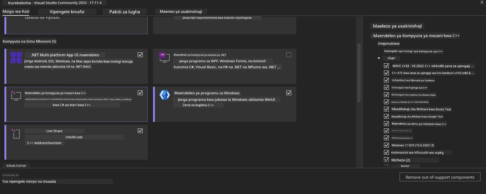
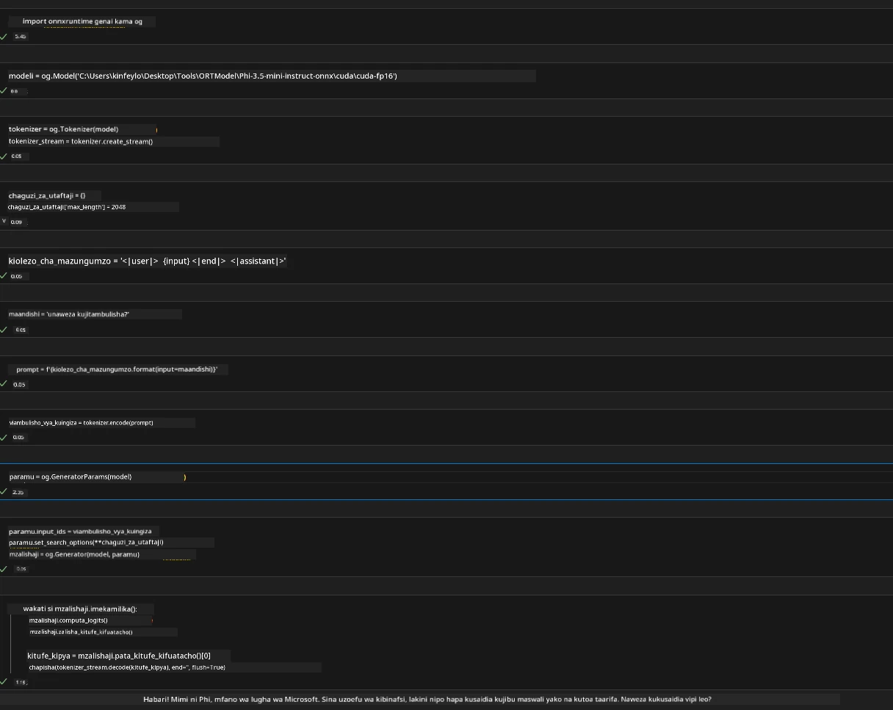
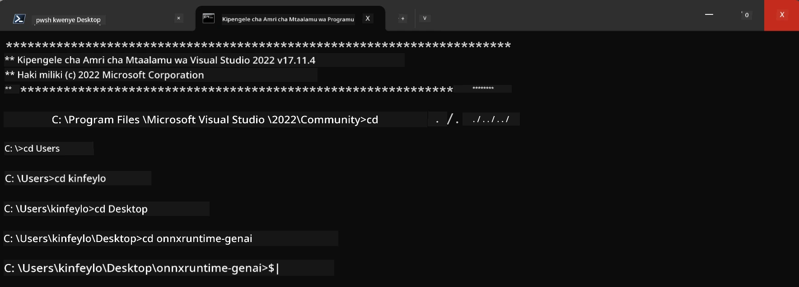

# **Miongozo kwa OnnxRuntime GenAI Windows GPU**

Miongozo hii inatoa hatua za kusanidi na kutumia ONNX Runtime (ORT) na GPUs kwenye Windows. Imeundwa kusaidia kutumia kasi ya GPU kwa mifano yako, kuboresha utendaji na ufanisi.

Hati hii inatoa mwongozo juu ya:

- Usanidi wa Mazingira: Maelekezo juu ya kufunga utegemezi muhimu kama CUDA, cuDNN, na ONNX Runtime.
- Usanidi: Jinsi ya kusanidi mazingira na ONNX Runtime ili kutumia rasilimali za GPU kikamilifu.
- Vidokezo vya Uboreshaji: Ushauri jinsi ya kuboresha mipangilio ya GPU kwa utendaji bora.

### **1. Python 3.10.x /3.11.8**

   ***Kumbuka*** Pendekeza kutumia [miniforge](https://github.com/conda-forge/miniforge/releases/latest/download/Miniforge3-Windows-x86_64.exe) kama mazingira yako ya Python

   ```bash

   conda create -n pydev python==3.11.8

   conda activate pydev

   ```

   ***Kikumbusho*** Ikiwa umesakinisha maktaba yoyote ya python ONNX, tafadhali iondoe

### **2. Sakinisha CMake kwa kutumia winget**


   ```bash

   winget install -e --id Kitware.CMake

   ```

### **3. Sakinisha Visual Studio 2022 - Maendeleo ya Desktop kwa C++**

   ***Kumbuka*** Ikiwa hautaki kukusanya unaweza kuruka hatua hii




### **4. Sakinisha Dereva wa NVIDIA**

1. **Dereva ya GPU ya NVIDIA**  [https://www.nvidia.com/en-us/drivers/](https://www.nvidia.com/en-us/drivers/)

2. **NVIDIA CUDA 12.4** [https://developer.nvidia.com/cuda-12-4-0-download-archive](https://developer.nvidia.com/cuda-12-4-0-download-archive)

3. **NVIDIA CUDNN 9.4**  [https://developer.nvidia.com/cudnn-downloads](https://developer.nvidia.com/cudnn-downloads)

***Kikumbusho*** Tafadhali tumia mipangilio ya chaguo-msingi wakati wa mchakato wa Usakinishaji

### **5. Weka Mazingira ya NVIDIA**

Nakili maktaba za NVIDIA CUDNN 9.4 lib, bin, include kwenda NVIDIA CUDA 12.4 lib, bin, include

- nakili faili *'C:\Program Files\NVIDIA\CUDNN\v9.4\bin\12.6'* kwenda  *'C:\Program Files\NVIDIA GPU Computing Toolkit\CUDA\v12.4\bin*

- nakili faili *'C:\Program Files\NVIDIA\CUDNN\v9.4\include\12.6'* kwenda  *'C:\Program Files\NVIDIA GPU Computing Toolkit\CUDA\v12.4\include*

- nakili faili *'C:\Program Files\NVIDIA\CUDNN\v9.4\lib\12.6'* kwenda  *'C:\Program Files\NVIDIA GPU Computing Toolkit\CUDA\v12.4\lib\x64'*


### **6. Pakua Phi-3.5-mini-instruct-onnx**


   ```bash

   winget install -e --id Git.Git

   winget install -e --id GitHub.GitLFS

   git lfs install

   git clone https://huggingface.co/microsoft/Phi-3.5-mini-instruct-onnx

   ```

### **7. Endesha InferencePhi35Instruct.ipynb**

   Fungua [Notebook](../../../../code/09.UpdateSamples/Aug/ortgpu-phi35-instruct.ipynb) na fanya utekelezaji 





### **8. Kusanya ORT GenAI GPU**


   ***Kumbuka*** 
   
   1. Tafadhali ondoa yote kuhusu onnx na onnxruntime na onnxruntime-genai kwanza

   
   ```bash

   pip list 
   
   ```

   Kisha ondoa maktaba zote za onnxruntime yaani 


   ```bash

   pip uninstall onnxruntime

   pip uninstall onnxruntime-genai

   pip uninstall onnxruntume-genai-cuda
   
   ```

   2. Kagua msaada wa Ongeza ya Visual Studio 

   Kagua C:\Program Files\NVIDIA GPU Computing Toolkit\CUDA\v12.4\extras ili kuhakikisha C:\Program Files\NVIDIA GPU Computing Toolkit\CUDA\v12.4\extras\visual_studio_integration ipo. 
   
   Ikiwa haipatikani angalia folda nyingine za CUDA toolkit dereva na nakili folda ya visual_studio_integration na yaliyomo kwenda C:\Program Files\NVIDIA GPU Computing Toolkit\CUDA\v12.4\extras\visual_studio_integration


   - Ikiwa hautaki kukusanya unaweza kuruka hatua hii


   ```bash

   git clone https://github.com/microsoft/onnxruntime-genai

   ```

   - Pakua [https://github.com/microsoft/onnxruntime/releases/download/v1.19.2/onnxruntime-win-x64-gpu-1.19.2.zip](https://github.com/microsoft/onnxruntime/releases/download/v1.19.2/onnxruntime-win-x64-gpu-1.19.2.zip)

   - Fungua onnxruntime-win-x64-gpu-1.19.2.zip , na uitaje tena kuwa **ort**, nakili folda ya ort kwenye onnxruntime-genai

   - Kutumia Windows Terminal, nenda kwenye Deveopler Command Prompt kwa VS 2022 na uende kwenye onnxruntime-genai 



   - Kusanya kwa mazingira yako ya python

   
   ```bash

   cd onnxruntime-genai

   python build.py --use_cuda  --cuda_home "C:\Program Files\NVIDIA GPU Computing Toolkit\CUDA\v12.4" --config Release
 

   cd build/Windows/Release/Wheel

   pip install .whl

   ```

---

<!-- CO-OP TRANSLATOR DISCLAIMER START -->
**Kionyozo**:
Hati hii imetafsiriwa kwa kutumia huduma ya tafsiri ya AI [Co-op Translator](https://github.com/Azure/co-op-translator). Ingawa tunajitahidi kupata usahihi, tafadhali fahamu kwamba tafsiri za kiotomatiki zinaweza kuwa na makosa au upungufu wa usahihi. Hati ya asili katika lugha yake halisi inapaswa kuchukuliwa kama chanzo cha mamlaka. Kwa taarifa muhimu, tafsiri ya kitaalamu inayofanywa na binadamu inapendekezwa. Hatutojibu kwa kuelewa vibaya au tafsiri potofu zinazotokea kutokana na matumizi ya tafsiri hii.
<!-- CO-OP TRANSLATOR DISCLAIMER END -->