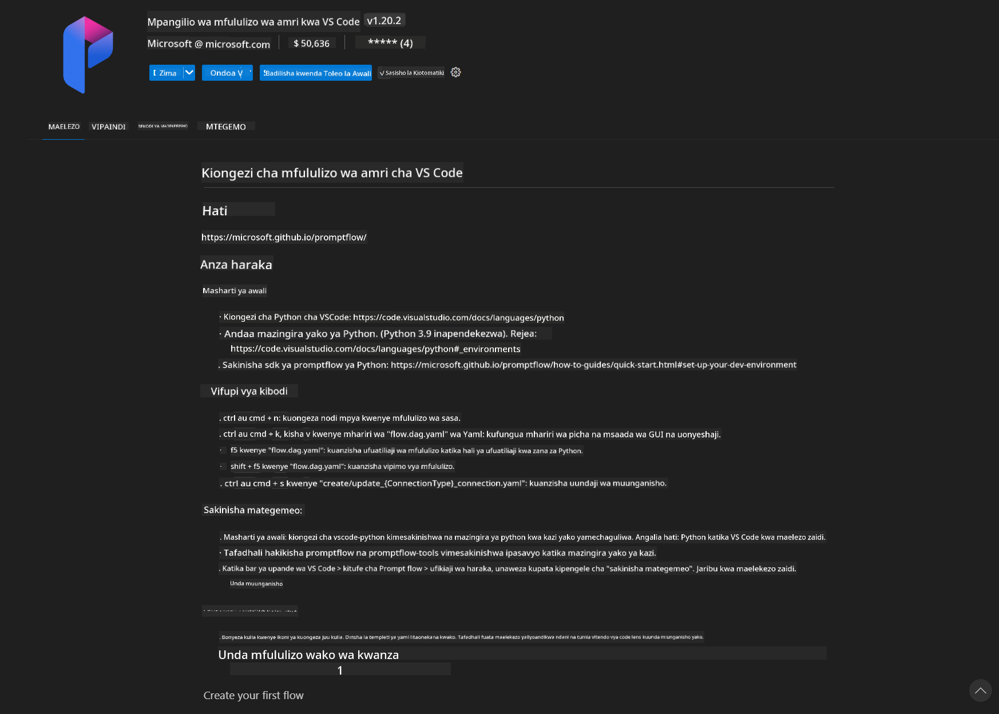
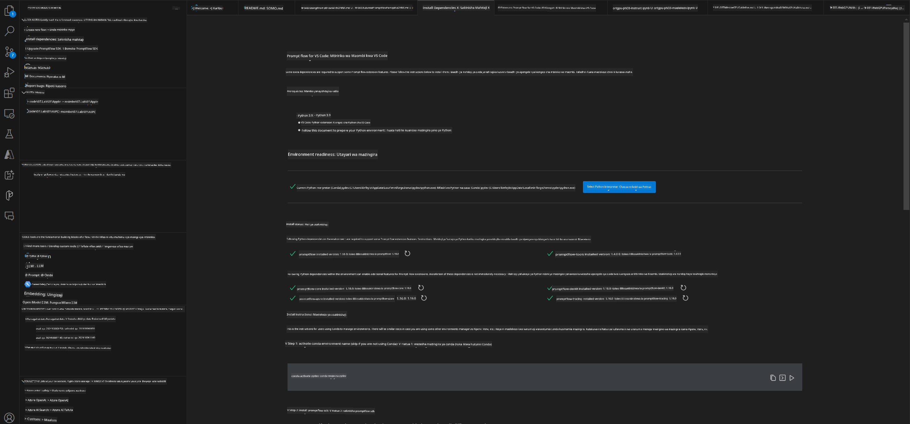
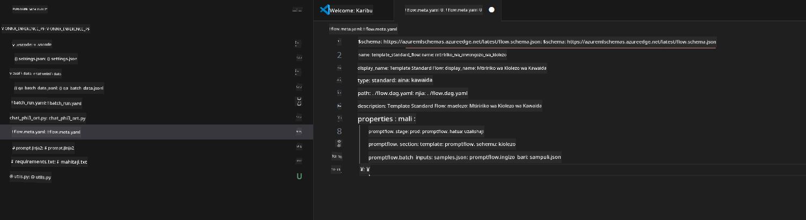
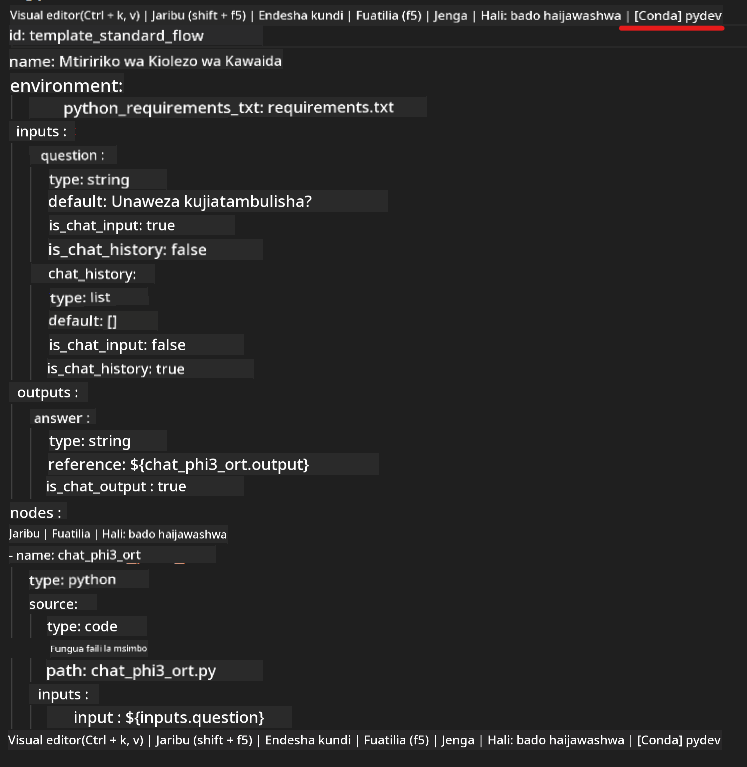
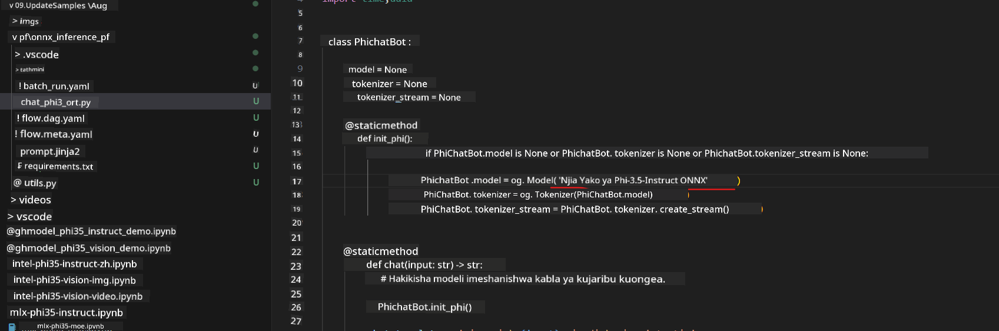
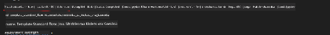
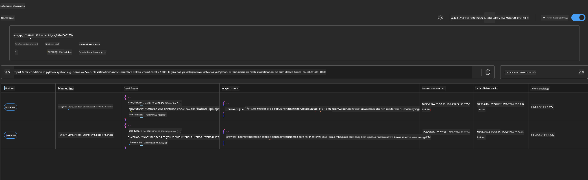

<!--
CO_OP_TRANSLATOR_METADATA:
{
  "original_hash": "92e7dac1e5af0dd7c94170fdaf6860fe",
  "translation_date": "2025-05-09T18:54:33+00:00",
  "source_file": "md/02.Application/01.TextAndChat/Phi3/UsingPromptFlowWithONNX.md",
  "language_code": "sw"
}
-->
# Kutumia Windows GPU kuunda suluhisho la Prompt flow na Phi-3.5-Instruct ONNX

Hati ifuatayo ni mfano wa jinsi ya kutumia PromptFlow na ONNX (Open Neural Network Exchange) kwa ajili ya kuendeleza programu za AI zinazotegemea mifano ya Phi-3.

PromptFlow ni mkusanyiko wa zana za maendeleo zilizoundwa kurahisisha mzunguko mzima wa maendeleo ya programu za AI zinazotumia LLM (Large Language Model), kuanzia mawazo na utayarishaji wa majaribio hadi upimaji na tathmini.

Kwa kuunganisha PromptFlow na ONNX, waendelezaji wanaweza:

- Kuboresha Utendaji wa Mfano: Tumia ONNX kwa ufanisi katika utambuzi na usambazaji wa mfano.
- Kurahisisha Maendeleo: Tumia PromptFlow kusimamia mtiririko wa kazi na kuendesha kazi zinazojirudia kiotomatiki.
- Kuongeza Ushirikiano: Rahisisha ushirikiano kati ya wanachama wa timu kwa kutoa mazingira ya maendeleo yaliyojumlishwa.

**Prompt flow** ni mkusanyiko wa zana za maendeleo zilizoundwa kurahisisha mzunguko mzima wa maendeleo ya programu za AI zinazotumia LLM, kuanzia mawazo, utayarishaji wa majaribio, upimaji, tathmini hadi usambazaji wa uzalishaji na ufuatiliaji. Inafanya uhandisi wa prompt kuwa rahisi zaidi na inakuwezesha kujenga programu za LLM zenye ubora wa uzalishaji.

Prompt flow inaweza kuunganishwa na OpenAI, Azure OpenAI Service, na mifano inayoweza kubadilishwa (Huggingface, LLM/SLM za ndani). Tunatarajia kusambaza mfano wa Phi-3.5 wa ONNX uliopunguzwa kwa matumizi ya ndani. Prompt flow inaweza kutusaidia kupanga biashara yetu vyema na kukamilisha suluhisho za ndani zinazotegemea Phi-3.5. Katika mfano huu, tutachanganya ONNX Runtime GenAI Library ili kukamilisha suluhisho la Prompt flow linalotegemea Windows GPU.

## **Usanidi**

### **ONNX Runtime GenAI kwa Windows GPU**

Soma mwongozo huu kuweka ONNX Runtime GenAI kwa Windows GPU  [bonyeza hapa](./ORTWindowGPUGuideline.md)

### **Sanidi Prompt flow katika VSCode**

1. Sakinisha Prompt flow VS Code Extension



2. Baada ya kusakinisha Prompt flow VS Code Extension, bonyeza extension, kisha chagua **Installation dependencies** fuata mwongozo huu kusakinisha Prompt flow SDK katika mazingira yako



3. Pakua [Sample Code](../../../../../../code/09.UpdateSamples/Aug/pf/onnx_inference_pf) na tumia VS Code kufungua sampuli hii



4. Fungua **flow.dag.yaml** kuchagua mazingira yako ya Python



   Fungua **chat_phi3_ort.py** kubadilisha eneo la mfano wa Phi-3.5-instruct ONNX



5. Endesha prompt flow yako kwa ajili ya majaribio

Fungua **flow.dag.yaml** bonyeza visual editor



baada ya kubonyeza hii, endesha kujaribu


1. Unaweza kuendesha batch katika terminal kuangalia matokeo zaidi


```bash

pf run create --file batch_run.yaml --stream --name 'Your eval qa name'    

```

Unaweza kuangalia matokeo katika kivinjari chako chaguo-msingi




**Kasi ya Kutotegemea**:  
Hati hii imetafsiriwa kwa kutumia huduma ya tafsiri ya AI [Co-op Translator](https://github.com/Azure/co-op-translator). Ingawa tunajitahidi kwa usahihi, tafadhali fahamu kuwa tafsiri za kiotomatiki zinaweza kuwa na makosa au upungufu wa usahihi. Hati asili katika lugha yake ya asili inapaswa kuchukuliwa kama chanzo cha mamlaka. Kwa taarifa muhimu, tafsiri ya kitaalamu na ya binadamu inashauriwa. Hatubeba dhamana kwa kutoelewana au tafsiri potofu zitokanazo na matumizi ya tafsiri hii.