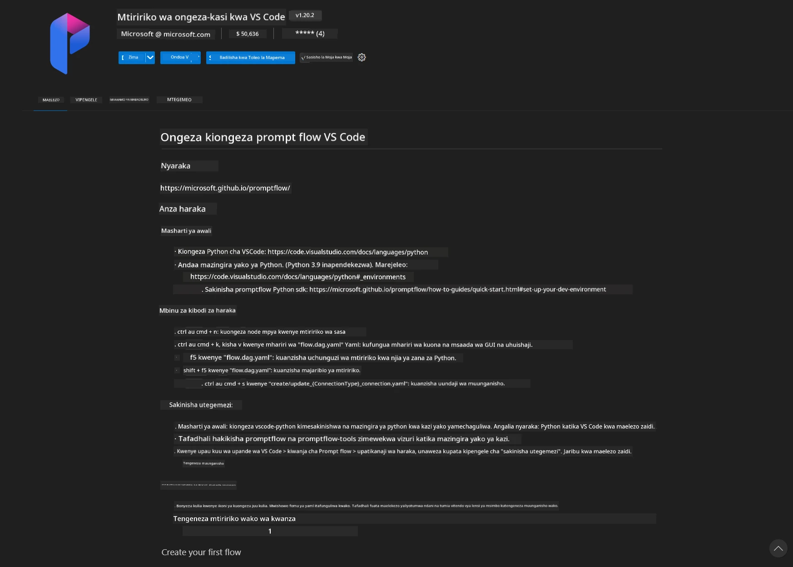
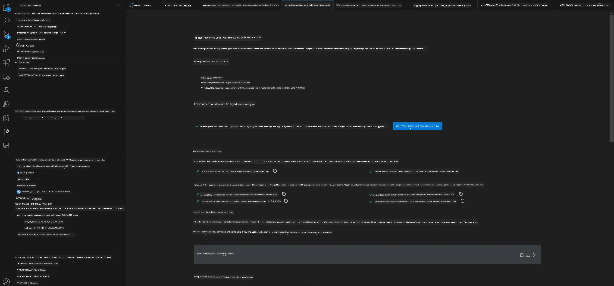
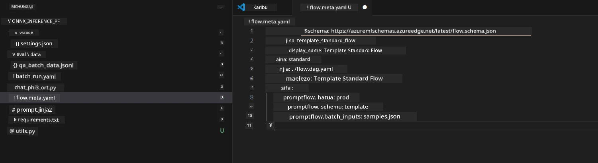
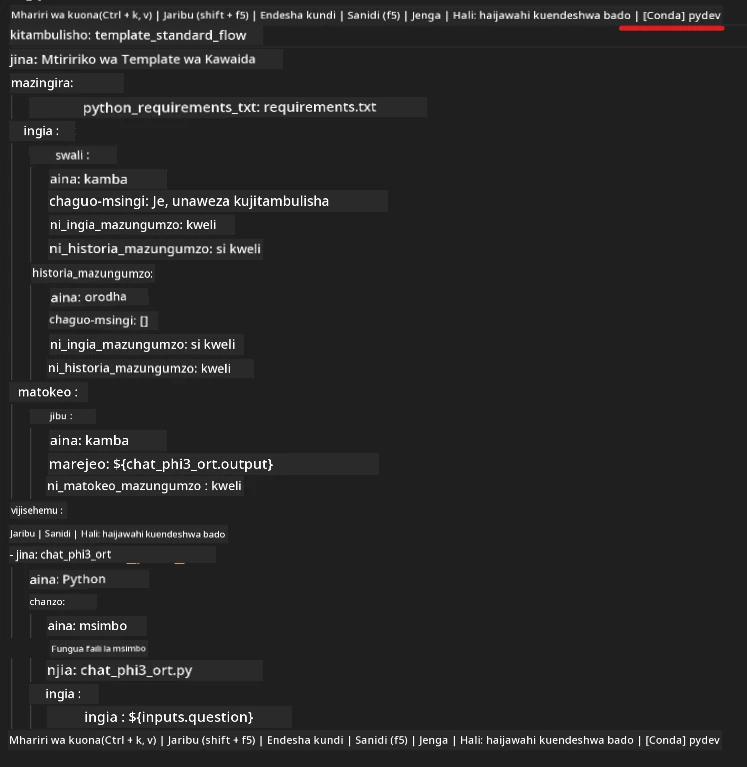
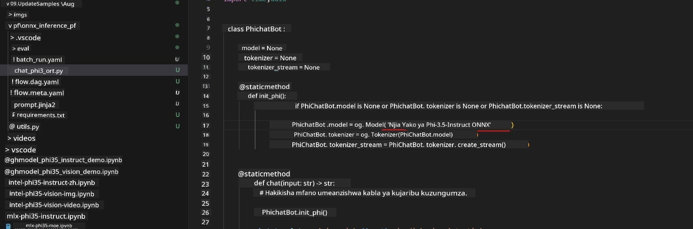
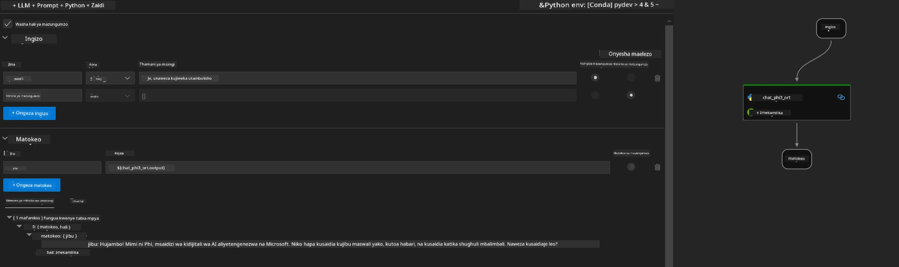
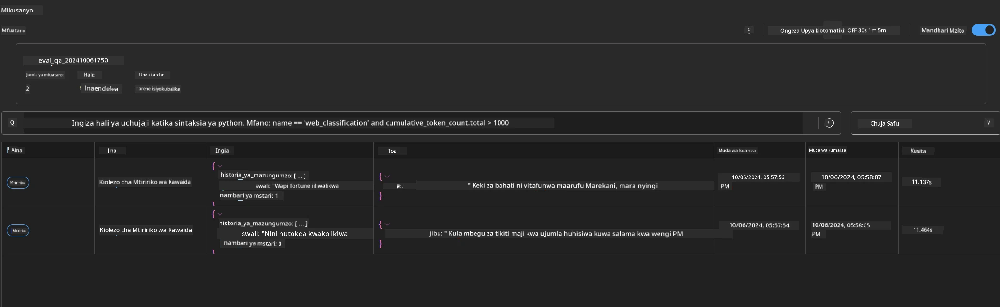

# Kutumia GPU ya Windows kuunda suluhisho la Prompt flow kwa Phi-3.5-Instruct ONNX 

Hati ifuatayo ni mfano wa jinsi ya kutumia PromptFlow na ONNX (Open Neural Network Exchange) kwa ajili ya kuendeleza programu za AI based on models za Phi-3.

PromptFlow ni mfululizo wa zana za maendeleo zilizoundwa kurahisisha mzunguko mzima wa maendeleo ya programu za AI za LLM (Large Language Model), kutoka kwenye mawazo na usanifu hadi upimaji na tathmini.

Kwa kuunganisha PromptFlow na ONNX, watengenezaji wanaweza:

- Kuboresha Utendaji wa Modeli: Tumia ONNX kwa ufanisi wa kutafsiri na kusambaza modeli.
- Kuweka Rahisi Maendeleo: Tumia PromptFlow kudhibiti mtiririko wa kazi na kuendesha kazi zinazojirudia kiotomatiki.
- Kuongeza Ushirikiano: Rahisisha ushirikiano kati ya wanachama wa timu kwa kutoa mazingira ya maendeleo yaliyojumuishwa.

**Prompt flow** ni mfululizo wa zana za maendeleo zilizoundwa kurahisisha mzunguko mzima wa maendeleo ya programu za AI za LLM, kutoka kwenye mawazo, usanifu, upimaji, tathmini hadi kusambaza kwa uzalishaji na ufuatiliaji. Inafanya uhandisi wa prompt kuwa rahisi zaidi na inakuwezesha kujenga programu za LLM zenye ubora wa uzalishaji.

Prompt flow inaweza kuunganishwa na OpenAI, Azure OpenAI Service, na modeli zinazoweza kubadilishwa (Huggingface, LLM/SLM za eneo la karibu). Tunatarajia kusambaza modeli ya ONNX ya Phi-3.5 iliyopimwa kwenye programu za eneo la karibu. Prompt flow inaweza kutusaidia kupanga biashara yetu vizuri zaidi na kukamilisha suluhisho za eneo la karibu zinazotegemea Phi-3.5. Katika mfano huu, tutachanganya Maktaba ya ONNX Runtime GenAI kumaliza suluhisho la Prompt flow kwa msingi wa Windows GPU.

## **Usanidi**

### **ONNX Runtime GenAI kwa Windows GPU**

Soma mwongozo huu ili kuweka ONNX Runtime GenAI kwa Windows GPU  [bonyeza hapa](./ORTWindowGPUGuideline.md)

### **Sanidi Prompt flow katika VSCode**

1. Sakinisha Programu-jalizi ya Prompt flow VS Code



2. Baada ya kusakinisha Programu-jalizi ya Prompt flow VS Code，bonyeza programu-jalizi hiyo，kisha chagua **Installation dependencies** fuata mwongozo huu kusakinisha Prompt flow SDK katika mazingira yako



3. Pakua [Sample Code](../../../../../../code/09.UpdateSamples/Aug/pf/onnx_inference_pf) na tumia VS Code kufungua sampuli hii



4. Fungua **flow.dag.yaml** kuchagua mazingira yako ya Python



   Fungua **chat_phi3_ort.py** kubadilisha eneo la Modeli ya Phi-3.5-instruct ONNX



5. Endesha prompt flow yako kwa ajili ya upimaji

Fungua **flow.dag.yaml** na bonyeza mhariri wa kuona


baada ya kubonyeza hii, endesha ili kujaribu



1. Unaweza kuendesha seti katika terminal kuangalia matokeo zaidi


```bash

pf run create --file batch_run.yaml --stream --name 'Your eval qa name'    

```

Unaweza kukagua matokeo kwenye kivinjari chako cha chaguo




---

<!-- CO-OP TRANSLATOR DISCLAIMER START -->
**Kionyozo**:
Hati hii imetafsiriwa kwa kutumia huduma ya tafsiri ya AI [Co-op Translator](https://github.com/Azure/co-op-translator). Ingawa tunajitahidi kupata usahihi, tafadhali fahamu kwamba tafsiri za kiotomatiki zinaweza kuwa na makosa au upungufu wa usahihi. Hati ya asili katika lugha yake halisi inapaswa kuchukuliwa kama chanzo cha mamlaka. Kwa taarifa muhimu, tafsiri ya kitaalamu inayofanywa na binadamu inapendekezwa. Hatutojibu kwa kuelewa vibaya au tafsiri potofu zinazotokea kutokana na matumizi ya tafsiri hii.
<!-- CO-OP TRANSLATOR DISCLAIMER END -->