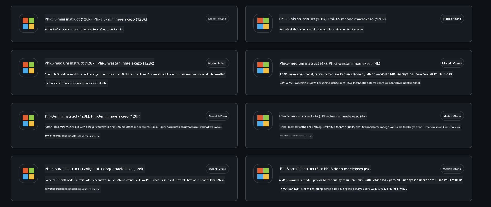
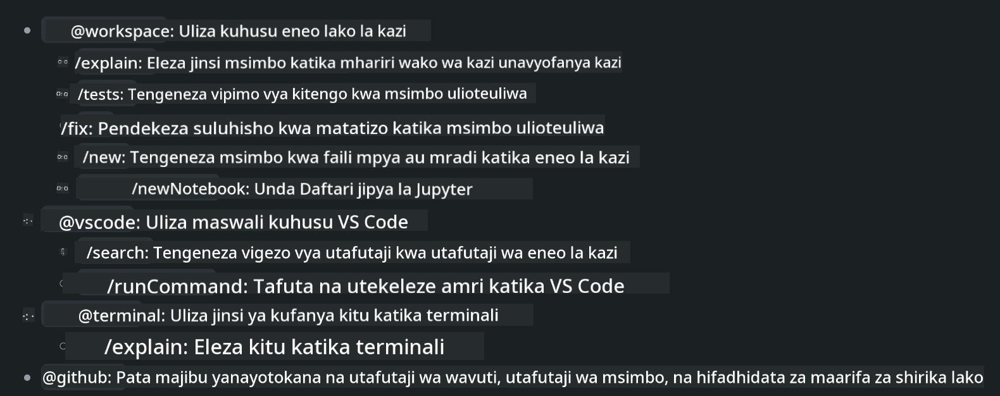
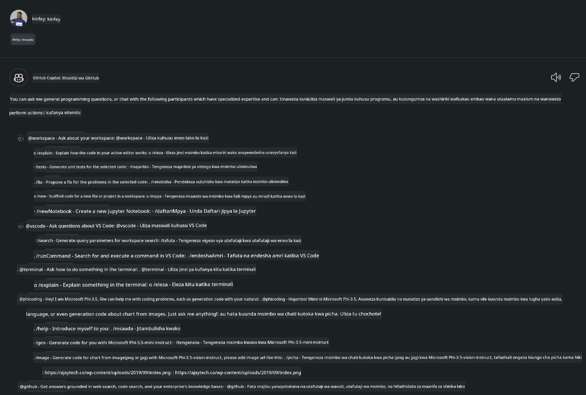
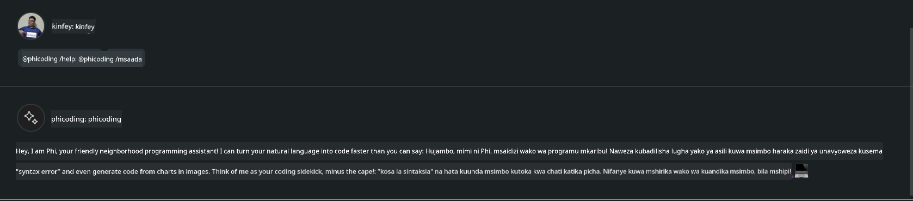
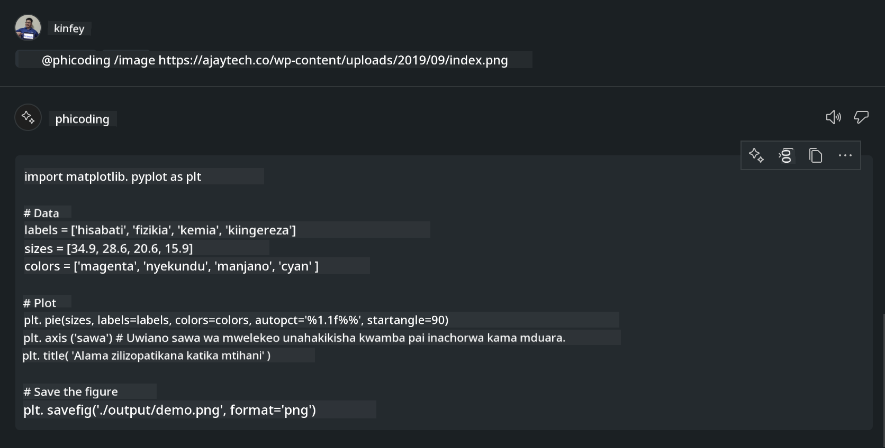

<!--
CO_OP_TRANSLATOR_METADATA:
{
  "original_hash": "35bf81388ac6917277b8d9a0c39bdc70",
  "translation_date": "2025-07-17T03:29:13+00:00",
  "source_file": "md/02.Application/02.Code/Phi3/CreateVSCodeChatAgentWithGitHubModels.md",
  "language_code": "sw"
}
-->
# **Tengeneza Wakala wako wa Visual Studio Code Chat Copilot kwa Phi-3.5 kupitia GitHub Models**

Je, unatumia Visual Studio Code Copilot? Hasa katika Chat, unaweza kutumia mawakala tofauti kuboresha uwezo wa kuunda, kuandika, na kudumisha miradi ndani ya Visual Studio Code. Visual Studio Code hutoa API inayowezesha makampuni na watu binafsi kuunda mawakala tofauti kulingana na biashara yao ili kupanua uwezo wao katika nyanja mbalimbali za kipekee. Katika makala hii, tutazingatia **Phi-3.5-mini-instruct (128k)** na **Phi-3.5-vision-instruct (128k)** za GitHub Models kuunda Wakala wako wa Visual Studio Code.

## **Kuhusu Phi-3.5 kwenye GitHub Models**

Tunajua kuwa Phi-3/3.5-mini-instruct katika Familia ya Phi-3/3.5 ina uwezo mkubwa wa kuelewa na kuzalisha msimbo, na ina faida ikilinganishwa na Gemma-2-9b na Mistral-Nemo-12B-instruct-2407.


GitHub Models za hivi karibuni tayari zinatoa ufikiaji wa modeli za Phi-3.5-mini-instruct (128k) na Phi-3.5-vision-instruct (128k). Waendelezaji wanaweza kuzifikia kupitia OpenAI SDK, Azure AI Inference SDK, na REST API.



***Note: *** Inashauriwa kutumia Azure AI Inference SDK hapa, kwa sababu inaweza kubadilika vizuri zaidi na Azure Model Catalog katika mazingira ya uzalishaji

Hapa chini ni matokeo ya **Phi-3.5-mini-instruct (128k)** na **Phi-3.5-vision-instruct (128k)** katika hali ya uzalishaji msimbo baada ya kuunganishwa na GitHub Models, na pia maandalizi kwa mifano ifuatayo

**Demo: GitHub Models Phi-3.5-mini-instruct (128k) kuzalisha msimbo kutoka kwa Prompt** ([bonyeza hapa](../../../../../../code/09.UpdateSamples/Aug/ghmodel_phi35_instruct_demo.ipynb))

**Demo: GitHub Models Phi-3.5-vision-instruct (128k) kuzalisha msimbo kutoka kwa Picha** ([bonyeza hapa](../../../../../../code/09.UpdateSamples/Aug/ghmodel_phi35_vision_demo.ipynb))


## **Kuhusu Wakala wa GitHub Copilot Chat**

Wakala wa GitHub Copilot Chat unaweza kukamilisha kazi mbalimbali katika mazingira tofauti ya mradi kulingana na msimbo. Mfumo una mawakala wanne: workspace, github, terminal, vscode



Kwa kuongeza jina la wakala kwa ‘@’, unaweza haraka kukamilisha kazi inayohusiana. Kwa makampuni, ikiwa utaongeza maudhui yanayohusiana na biashara yako kama mahitaji, uandishi wa msimbo, vipimo vya majaribio, na utoaji, unaweza kuwa na kazi za kibinafsi za kampuni zenye nguvu zaidi kulingana na GitHub Copilot.

Wakala wa Visual Studio Code Chat sasa umezindua rasmi API yake, ikiruhusu makampuni au waendelezaji wa makampuni kuendeleza mawakala kulingana na mifumo tofauti ya biashara ya programu. Kulingana na njia ya maendeleo ya Visual Studio Code Extension Development, unaweza kwa urahisi kupata kiolesura cha API ya Wakala wa Visual Studio Code Chat. Tunaweza kuendeleza kulingana na mchakato huu


Hali ya maendeleo inaweza kusaidia ufikiaji wa API za modeli za wahusika wengine (kama GitHub Models, Azure Model Catalog, na huduma zilizojengwa binafsi kulingana na modeli za chanzo huria) na pia inaweza kutumia modeli za gpt-35-turbo, gpt-4, na gpt-4o zinazotolewa na GitHub Copilot.

## **Ongeza Wakala @phicoding kulingana na Phi-3.5**

Tunajaribu kuunganisha uwezo wa uandishi wa programu wa Phi-3.5 kukamilisha uandishi wa msimbo, kuzalisha msimbo wa picha na kazi nyinginezo. Kamili Wakala uliojengwa kuzunguka Phi-3.5 - @PHI, zifuatazo ni baadhi ya kazi zake

1. Tengeneza utambulisho binafsi kulingana na GPT-4o inayotolewa na GitHub Copilot kupitia amri ya **@phicoding /help**

2. Tengeneza msimbo kwa lugha tofauti za programu kulingana na **Phi-3.5-mini-instruct (128k)** kupitia amri ya **@phicoding /gen**

3. Tengeneza msimbo kulingana na **Phi-3.5-vision-instruct (128k)** na ukamilishaji wa picha kupitia amri ya **@phicoding /image**


## **Hatua zinazohusiana**

1. Sakinisha msaada wa maendeleo ya Visual Studio Code Extension kwa kutumia npm

```bash

npm install --global yo generator-code 

```
2. Unda plugin ya Visual Studio Code Extension (kutumia hali ya maendeleo ya Typescript, iitwe phiext)

```bash

yo code 

```

3. Fungua mradi ulioundwa na badilisha package.json. Hapa kuna maelekezo na usanidi unaohusiana, pamoja na usanidi wa GitHub Models. Kumbuka unahitaji kuongeza tokeni yako ya GitHub Models hapa.

```json

{
  "name": "phiext",
  "displayName": "phiext",
  "description": "",
  "version": "0.0.1",
  "engines": {
    "vscode": "^1.93.0"
  },
  "categories": [
    "AI",
    "Chat"
  ],
  "activationEvents": [],
  "enabledApiProposals": [
      "chatVariableResolver"
  ],
  "main": "./dist/extension.js",
  "contributes": {
    "chatParticipants": [
        {
            "id": "chat.phicoding",
            "name": "phicoding",
            "description": "Hey! I am Microsoft Phi-3.5, She can help me with coding problems, such as generation code with your natural language, or even generation code about chart from images. Just ask me anything!",
            "isSticky": true,
            "commands": [
                {
                    "name": "help",
                    "description": "Introduce myself to you"
                },
                {
                    "name": "gen",
                    "description": "Generate code for you with Microsoft Phi-3.5-mini-instruct"
                },
                {
                    "name": "image",
                    "description": "Generate code for chart from image(png or jpg) with Microsoft Phi-3.5-vision-instruct, please add image url like this : https://ajaytech.co/wp-content/uploads/2019/09/index.png"
                }
            ]
        }
    ],
    "commands": [
        {
            "command": "phicoding.namesInEditor",
            "title": "Use Microsoft Phi 3.5 in Editor"
        }
    ],
    "configuration": {
      "type": "object",
      "title": "githubmodels",
      "properties": {
        "githubmodels.endpoint": {
          "type": "string",
          "default": "https://models.inference.ai.azure.com",
          "description": "Your GitHub Models Endpoint",
          "order": 0
        },
        "githubmodels.api_key": {
          "type": "string",
          "default": "Your GitHub Models Token",
          "description": "Your GitHub Models Token",
          "order": 1
        },
        "githubmodels.phi35instruct": {
          "type": "string",
          "default": "Phi-3.5-mini-instruct",
          "description": "Your Phi-35-Instruct Model",
          "order": 2
        },
        "githubmodels.phi35vision": {
          "type": "string",
          "default": "Phi-3.5-vision-instruct",
          "description": "Your Phi-35-Vision Model",
          "order": 3
        }
      }
    }
  },
  "scripts": {
    "vscode:prepublish": "npm run package",
    "compile": "webpack",
    "watch": "webpack --watch",
    "package": "webpack --mode production --devtool hidden-source-map",
    "compile-tests": "tsc -p . --outDir out",
    "watch-tests": "tsc -p . -w --outDir out",
    "pretest": "npm run compile-tests && npm run compile && npm run lint",
    "lint": "eslint src",
    "test": "vscode-test"
  },
  "devDependencies": {
    "@types/vscode": "^1.93.0",
    "@types/mocha": "^10.0.7",
    "@types/node": "20.x",
    "@typescript-eslint/eslint-plugin": "^8.3.0",
    "@typescript-eslint/parser": "^8.3.0",
    "eslint": "^9.9.1",
    "typescript": "^5.5.4",
    "ts-loader": "^9.5.1",
    "webpack": "^5.94.0",
    "webpack-cli": "^5.1.4",
    "@vscode/test-cli": "^0.0.10",
    "@vscode/test-electron": "^2.4.1"
  },
  "dependencies": {
    "@types/node-fetch": "^2.6.11",
    "node-fetch": "^3.3.2",
    "@azure-rest/ai-inference": "latest",
    "@azure/core-auth": "latest",
    "@azure/core-sse": "latest"
  }
}


```

4. Badilisha src/extension.ts

```typescript

// The module 'vscode' contains the VS Code extensibility API
// Import the module and reference it with the alias vscode in your code below
import * as vscode from 'vscode';
import ModelClient from "@azure-rest/ai-inference";
import { AzureKeyCredential } from "@azure/core-auth";


interface IPhiChatResult extends vscode.ChatResult {
    metadata: {
        command: string;
    };
}


const MODEL_SELECTOR: vscode.LanguageModelChatSelector = { vendor: 'copilot', family: 'gpt-4o' };

function isValidImageUrl(url: string): boolean {
    const regex = /^(https?:\/\/.*\.(?:png|jpg))$/i;
    return regex.test(url);
}
  

// This method is called when your extension is activated
// Your extension is activated the very first time the command is executed
export function activate(context: vscode.ExtensionContext) {

    const codinghandler: vscode.ChatRequestHandler = async (request: vscode.ChatRequest, context: vscode.ChatContext, stream: vscode.ChatResponseStream, token: vscode.CancellationToken): Promise<IPhiChatResult> => {


        const config : any = vscode.workspace.getConfiguration('githubmodels');
        const endPoint: string = config.get('endpoint');
        const apiKey: string = config.get('api_key');
        const phi35instruct: string = config.get('phi35instruct');
        const phi35vision: string = config.get('phi35vision');
        
        if (request.command === 'help') {

            const content = "Welcome to Coding assistant with Microsoft Phi-3.5"; 
            stream.progress(content);


            try {
                const [model] = await vscode.lm.selectChatModels(MODEL_SELECTOR);
                if (model) {
                    const messages = [
                        vscode.LanguageModelChatMessage.User("Please help me express this content in a humorous way: I am a programming assistant who can help you convert natural language into code and generate code based on the charts in the images. output format like this : Hey I am Phi ......")
                    ];
                    const chatResponse = await model.sendRequest(messages, {}, token);
                    for await (const fragment of chatResponse.text) {
                        stream.markdown(fragment);
                    }
                }
            } catch(err) {
                console.log(err);
            }


            return { metadata: { command: 'help' } };

        }

        
        if (request.command === 'gen') {

            const content = "Welcome to use phi-3.5 to generate code";

            stream.progress(content);

            const client = new ModelClient(endPoint, new AzureKeyCredential(apiKey));

            const response = await client.path("/chat/completions").post({
              body: {
                messages: [
                  { role:"system", content: "You are a coding assistant.Help answer all code generation questions." },
                  { role:"user", content: request.prompt }
                ],
                model: phi35instruct,
                temperature: 0.4,
                max_tokens: 1000,
                top_p: 1.
              }
            });

            stream.markdown(response.body.choices[0].message.content);

            return { metadata: { command: 'gen' } };

        }


        
        if (request.command === 'image') {


            const content = "Welcome to use phi-3.5 to generate code from image(png or jpg),image url like this:https://ajaytech.co/wp-content/uploads/2019/09/index.png";

            stream.progress(content);

            if (!isValidImageUrl(request.prompt)) {
                stream.markdown('Please provide a valid image URL');
                return { metadata: { command: 'image' } };
            }
            else
            {

                const client = new ModelClient(endPoint, new AzureKeyCredential(apiKey));
    
                const response = await client.path("/chat/completions").post({
                    body: {
                      messages: [
                        { role: "system", content: "You are a helpful assistant that describes images in details." },
                        { role: "user", content: [
                            { type: "text", text: "Please generate code according to the chart in the picture according to the following requirements\n1. Keep all information in the chart, including data and text\n2. Do not generate additional information that is not included in the chart\n3. Please extract data from the picture, do not generate it from csv\n4. Please save the regenerated chart as a chart and save it to ./output/demo.png"},
                            { type: "image_url", image_url: {url: request.prompt}
                            }
                          ]
                        }
                      ],
                      model: phi35vision,
                      temperature: 0.4,
                      max_tokens: 2048,
                      top_p: 1.
                    }
                  });
    
                
                stream.markdown(response.body.choices[0].message.content);
    
                return { metadata: { command: 'image' } };
            }


        }


        return { metadata: { command: '' } };
    };


    const phi_ext = vscode.chat.createChatParticipant("chat.phicoding", codinghandler);

    phi_ext.iconPath = new vscode.ThemeIcon('sparkle');


    phi_ext.followupProvider = {
        provideFollowups(result: IPhiChatResult, context: vscode.ChatContext, token: vscode.CancellationToken) {
            return [{
                prompt: 'Let us coding with Phi-3.5 😋😋😋😋',
                label: vscode.l10n.t('Enjoy coding with Phi-3.5'),
                command: 'help'
            } satisfies vscode.ChatFollowup];
        }
    };

    context.subscriptions.push(phi_ext);
}

// This method is called when your extension is deactivated
export function deactivate() {}


```

6. Kuendesha

***/help***



***@phicoding /help***



***@phicoding /gen***


***@phicoding /image***



Unaweza kupakua msimbo wa mfano :[bonyeza hapa](../../../../../../code/09.UpdateSamples/Aug/vscode)

## **Rasilimali**

1. Jisajili GitHub Models [https://gh.io/models](https://gh.io/models)

2. Jifunze Maendeleo ya Visual Studio Code Extension [https://code.visualstudio.com/api/get-started/your-first-extension](https://code.visualstudio.com/api/get-started/your-first-extension)

3. Jifunze kuhusu Visual Studio Code Coilot Chat API [https://code.visualstudio.com/api/extension-guides/chat](https://code.visualstudio.com/api/extension-guides/chat)

**Kiarifu cha Kutotegemea**:  
Hati hii imetafsiriwa kwa kutumia huduma ya tafsiri ya AI [Co-op Translator](https://github.com/Azure/co-op-translator). Ingawa tunajitahidi kwa usahihi, tafadhali fahamu kwamba tafsiri za kiotomatiki zinaweza kuwa na makosa au upungufu wa usahihi. Hati ya asili katika lugha yake ya asili inapaswa kuchukuliwa kama chanzo cha mamlaka. Kwa taarifa muhimu, tafsiri ya kitaalamu inayofanywa na binadamu inapendekezwa. Hatubebei dhamana kwa kutoelewana au tafsiri potofu zinazotokana na matumizi ya tafsiri hii.