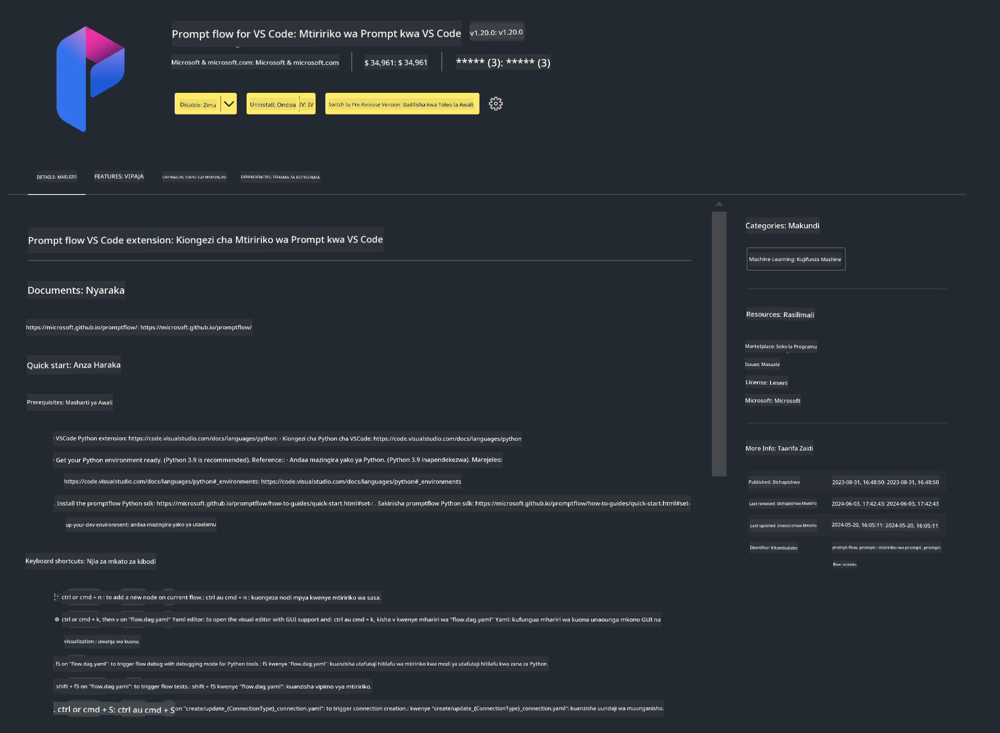

<!--
CO_OP_TRANSLATOR_METADATA:
{
  "original_hash": "a4ef39027902e82f2c33d568d2a2259a",
  "translation_date": "2025-05-09T19:20:55+00:00",
  "source_file": "md/02.Application/02.Code/Phi3/VSCodeExt/HOL/AIPC/01.Installations.md",
  "language_code": "sw"
}
-->
# **Lab 0 - Ufungaji**

Tunapoingia Lab, tunahitaji kusanidi mazingira husika:


### **1. Python 3.11+**

Inashauriwa kutumia miniforge kusanidi mazingira yako ya Python

Ili kusanidi miniforge, tafadhali rejelea [https://github.com/conda-forge/miniforge](https://github.com/conda-forge/miniforge)

Baada ya kusanidi miniforge, endesha amri ifuatayo katika Power Shell

```bash

conda create -n pyenv python==3.11.8 -y

conda activate pyenv

```


### **2. Sakinisha Prompt flow SDK**

Katika Lab 1, tutatumia Prompt flow, hivyo unahitaji kusanidi Prompt flow SDK.

```bash

pip install promptflow --upgrade

```

Unaweza kuangalia promptflow sdk kwa amri hii


```bash

pf --version

```

### **3. Sakinisha Visual Studio Code Prompt flow Extension**




### **4. Maktaba ya Kuongeza Kasi ya Intel NPU**

Viprocesa vya kizazi kipya vya Intel vinaunga mkono NPU. Ikiwa unataka kutumia NPU kuendesha LLMs / SLMs kwa ndani, unaweza kutumia ***Intel NPU Acceleration Library***. Ikiwa unataka kujifunza zaidi, unaweza kusoma [https://github.com/microsoft/PhiCookBook/blob/main/md/01.Introduction/03/AIPC_Inference.md](https://github.com/microsoft/PhiCookBook/blob/main/md/01.Introduction/03/AIPC_Inference.md).

Sakinisha Intel NPU Acceleration Library katika bash


```bash

pip install intel-npu-acceleration-library

```

***Note***: Tafadhali kumbuka maktaba hii inaunga mkono transformers ***4.40.2***, hakikisha toleo lako


### **5. Maktaba Nyingine za Python**


tengeneza requirements.txt na ongeza maudhui haya

```txt

notebook
numpy 
scipy 
scikit-learn 
matplotlib 
pandas 
pillow 
graphviz

```


### **6. Sakinisha NVM**

sakinisha nvm katika Powershell 


```bash

winget install -e --id CoreyButler.NVMforWindows

```

sakinisha nodejs 18.20


```bash

nvm install 18.20.0

nvm use 18.20.0

```

### **7. Sakinisha Msaada wa Maendeleo wa Visual Studio Code**


```bash

npm install --global yo generator-code

```

Hongera! Umefanikiwa kusanidi SDK. Ifuatayo, endelea na hatua za mazoezi.

**Kionyesho cha Majadiliano**:  
Hati hii imetafsiriwa kwa kutumia huduma ya tafsiri ya AI [Co-op Translator](https://github.com/Azure/co-op-translator). Ingawa tunajitahidi kwa usahihi, tafadhali fahamu kwamba tafsiri za kiotomatiki zinaweza kuwa na makosa au upungufu wa usahihi. Hati ya asili katika lugha yake ya asili inapaswa kuzingatiwa kama chanzo cha mamlaka. Kwa taarifa muhimu, tafsiri ya kitaalamu inayofanywa na binadamu inashauriwa. Hatubeba dhamana kwa maelewano mabaya au tafsiri potofu zinazotokana na matumizi ya tafsiri hii.