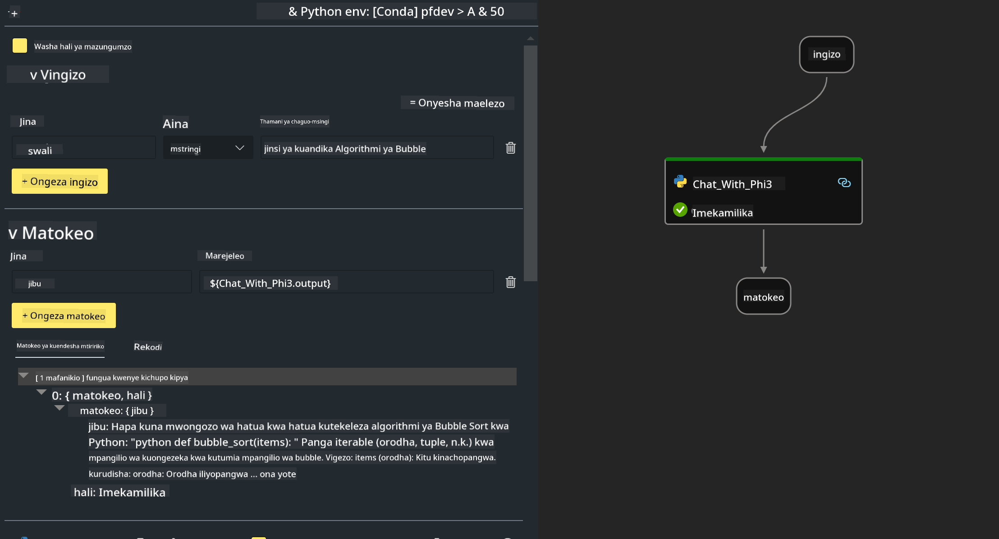

<!--
CO_OP_TRANSLATOR_METADATA:
{
  "original_hash": "3dbbf568625b1ee04b354c2dc81d3248",
  "translation_date": "2025-05-09T19:41:01+00:00",
  "source_file": "md/02.Application/02.Code/Phi3/VSCodeExt/HOL/Apple/02.PromptflowWithMLX.md",
  "language_code": "sw"
}
-->
# **Lab 2 - Endesha Prompt flow na Phi-3-mini katika AIPC**

## **Prompt flow ni nini**

Prompt flow ni seti ya zana za maendeleo iliyoundwa kurahisisha mzunguko mzima wa maendeleo ya programu za AI zinazotumia LLM, kuanzia wazo, mfano wa awali, upimaji, tathmini hadi uzalishaji na ufuatiliaji. Inafanya uhandisi wa prompt kuwa rahisi zaidi na inakuwezesha kujenga programu za LLM zenye ubora wa uzalishaji.

Kwa kutumia prompt flow, utaweza:

- Tengeneza flows zinazounganisha LLMs, prompts, msimbo wa Python na zana nyingine pamoja katika mtiririko unaotekelezeka.

- Rekebisha na rudia flows zako, hasa mwingiliano na LLMs kwa urahisi.

- Tathmini flows zako, hesabu viashiria vya ubora na utendaji kwa seti kubwa za data.

- Unganisha upimaji na tathmini katika mfumo wako wa CI/CD kuhakikisha ubora wa flow yako.

- Sambaza flows zako kwenye jukwaa la kuhudumia ulilolichagua au uziunganishe kwa urahisi kwenye msimbo wa app yako.

- (Hiari lakini inashauriwa sana) Fanya kazi kwa pamoja na timu yako kwa kutumia toleo la Prompt flow la wingu katika Azure AI.

## **Kuunda flows za msimbo wa kizazi kwenye Apple Silicon**

***Note*** ：Kama bado hujakamilisha usakinishaji wa mazingira, tafadhali tembelea [Lab 0 -Installations](./01.Installations.md)

1. Fungua Extension ya Prompt flow katika Visual Studio Code na tengeneza mradi wa flow tupu


2. Ongeza vigezo vya Inputs na Outputs na Ongeza Python Code kama flow mpya



Unaweza rejelea muundo huu (flow.dag.yaml) kujenga flow yako

```yaml

inputs:
  prompt:
    type: string
    default: Write python code for Fibonacci serie. Please use markdown as output
outputs:
  result:
    type: string
    reference: ${gen_code_by_phi3.output}
nodes:
- name: gen_code_by_phi3
  type: python
  source:
    type: code
    path: gen_code_by_phi3.py
  inputs:
    prompt: ${inputs.prompt}


```

3. Fanya quantification ya phi-3-mini

Tunatumai kuendesha SLM vizuri zaidi kwenye vifaa vya eneo la karibu. Kwa kawaida, tunafanya quantification ya modeli (INT4, FP16, FP32)

```bash

python -m mlx_lm.convert --hf-path microsoft/Phi-3-mini-4k-instruct

```

**Note:** folda ya default ni mlx_model

4. Ongeza Msimbo katika ***Chat_With_Phi3.py***

```python


from promptflow import tool

from mlx_lm import load, generate


# The inputs section will change based on the arguments of the tool function, after you save the code
# Adding type to arguments and return value will help the system show the types properly
# Please update the function name/signature per need
@tool
def my_python_tool(prompt: str) -> str:

    model_id = './mlx_model_phi3_mini'

    model, tokenizer = load(model_id)

    # <|user|>\nWrite python code for Fibonacci serie. Please use markdown as output<|end|>\n<|assistant|>

    response = generate(model, tokenizer, prompt="<|user|>\n" + prompt  + "<|end|>\n<|assistant|>", max_tokens=2048, verbose=True)

    return response


```

4. Unaweza kujaribu flow kutoka Debug au Run kuona kama msimbo wa kizazi unafanya kazi vizuri


5. Endesha flow kama API ya maendeleo kwenye terminal

```

pf flow serve --source ./ --port 8080 --host localhost   

```

Unaweza kuipima kwa Postman / Thunder Client

### **Note**

1. Mara ya kwanza kuendesha inachukua muda mrefu. Inashauriwa kupakua modeli ya phi-3 kupitia Hugging face CLI.

2. Kwa kuzingatia uwezo mdogo wa kompyuta wa Intel NPU, inashauriwa kutumia Phi-3-mini-4k-instruct

3. Tunatumia Kuongeza Kasi ya Intel NPU kwa quantize ya INT4, lakini ukirudia kuendesha huduma, unahitaji kufuta folda za cache na nc_workshop.

## **Rasilimali**

1. Jifunze Promptflow [https://microsoft.github.io/promptflow/](https://microsoft.github.io/promptflow/)

2. Jifunze Kuongeza Kasi ya Intel NPU [https://github.com/intel/intel-npu-acceleration-library](https://github.com/intel/intel-npu-acceleration-library)

3. Msimbo wa Mfano, pakua [Local NPU Agent Sample Code](../../../../../../../../../code/07.Lab/01/AIPC/local-npu-agent)

**Kiadhibu**:  
Hati hii imetafsiriwa kwa kutumia huduma ya tafsiri ya AI [Co-op Translator](https://github.com/Azure/co-op-translator). Ingawa tunajitahidi kwa usahihi, tafadhali fahamu kuwa tafsiri za moja kwa moja zinaweza kuwa na makosa au upungufu wa usahihi. Hati asilia katika lugha yake ya asili inapaswa kuchukuliwa kama chanzo cha mamlaka. Kwa taarifa muhimu, tafsiri ya kitaalamu inayofanywa na binadamu inapendekezwa. Hatuna dhamana kwa kutoelewana au tafsiri potofu zinazotokana na matumizi ya tafsiri hii.