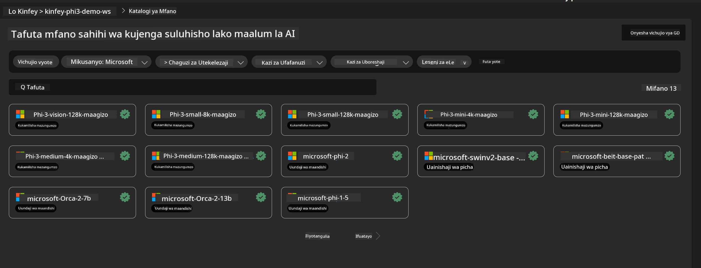
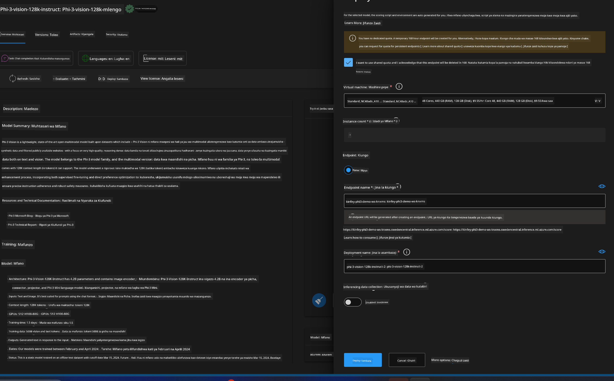
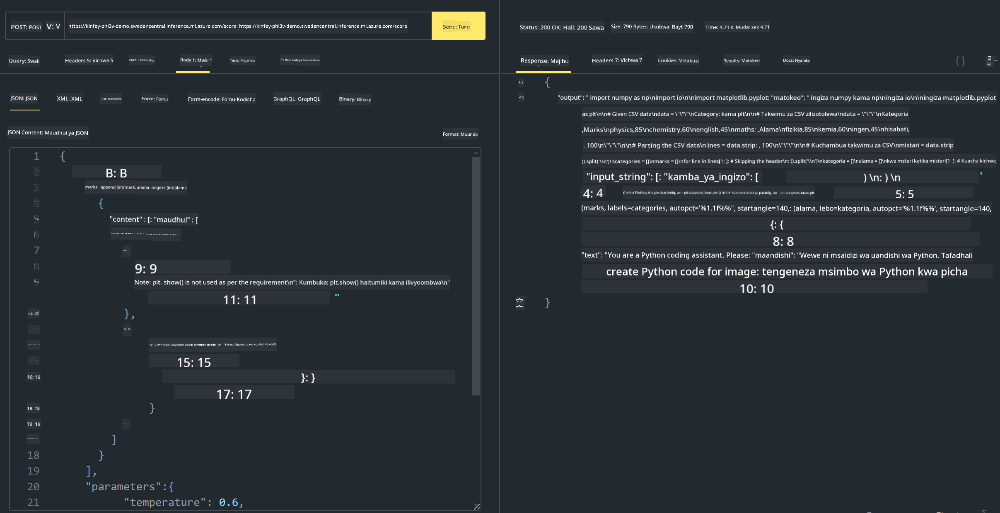

<!--
CO_OP_TRANSLATOR_METADATA:
{
  "original_hash": "20cb4e6ac1686248e8be913ccf6c2bc2",
  "translation_date": "2025-05-09T19:44:48+00:00",
  "source_file": "md/02.Application/02.Code/Phi3/VSCodeExt/HOL/Apple/03.DeployPhi3VisionOnAzure.md",
  "language_code": "sw"
}
-->
# **Lab 3 - Tengeneza Phi-3-vision kwenye Azure Machine Learning Service**

Tunatumia NPU kumaliza utoaji wa msimbo wa eneo la kazi, na kisha tunataka kuanzisha uwezo wa kuingiza PHI-3-VISION kupitia hiyo ili kufanikisha picha kuzalisha msimbo.

Katika utangulizi huu, tunaweza haraka kujenga Huduma ya Mfano kama Huduma ya Phi-3 Vision katika Azure Machine Learning Service.

***Note***: Phi-3 Vision inahitaji nguvu za kompyuta kuzalisha maudhui kwa kasi zaidi. Tunahitaji nguvu za kompyuta za wingu kutusaidia kufanikisha hili.

### **1. Tengeneza Azure Machine Learning Service**

Tunahitaji kuunda Azure Machine Learning Service katika Azure Portal. Ikiwa unataka kujifunza jinsi, tafadhali tembelea kiungo hiki [https://learn.microsoft.com/azure/machine-learning/quickstart-create-resources?view=azureml-api-2](https://learn.microsoft.com/azure/machine-learning/quickstart-create-resources?view=azureml-api-2)

### **2. Chagua Phi-3 Vision katika Azure Machine Learning Service**



### **3. Tengeneza Phi-3-Vision katika Azure**



### **4. Jaribu Endpoint katika Postman**



***Note***

1. Vigezo vinavyotakiwa kupelekwa lazima vijumuishe Authorization, azureml-model-deployment, na Content-Type. Unahitaji kuangalia taarifa za utoaji kupata haya.

2. Kwa kupeleka vigezo, Phi-3-Vision inahitaji kupeleka kiungo cha picha. Tafadhali rejea njia ya GPT-4-Vision kupeleka vigezo, kama vile

```json

{
  "input_data":{
    "input_string":[
      {
        "role":"user",
        "content":[ 
          {
            "type": "text",
            "text": "You are a Python coding assistant.Please create Python code for image "
          },
          {
              "type": "image_url",
              "image_url": {
                "url": "https://ajaytech.co/wp-content/uploads/2019/09/index.png"
              }
          }
        ]
      }
    ],
    "parameters":{
          "temperature": 0.6,
          "top_p": 0.9,
          "do_sample": false,
          "max_new_tokens": 2048
    }
  }
}

```

3. Piga simu **/score** kwa kutumia njia ya Post

**Hongera**! Umefanikiwa kumaliza utoaji wa haraka wa PHI-3-VISION na kujaribu jinsi ya kutumia picha kuzalisha msimbo. Ifuatayo, tunaweza kujenga programu kwa kuunganisha NPU na wingu.

**Kandido**:  
Hati hii imetafsiriwa kwa kutumia huduma ya tafsiri ya AI [Co-op Translator](https://github.com/Azure/co-op-translator). Ingawa tunajitahidi kuwa sahihi, tafadhali fahamu kuwa tafsiri za kiotomatiki zinaweza kuwa na makosa au kasoro. Hati ya awali katika lugha yake ya asili inapaswa kuchukuliwa kama chanzo cha kuaminika. Kwa taarifa muhimu, tafsiri ya kitaalamu inayofanywa na binadamu inapendekezwa. Hatubebei jukumu kwa maelewano au tafsiri potofu zitokanazo na matumizi ya tafsiri hii.