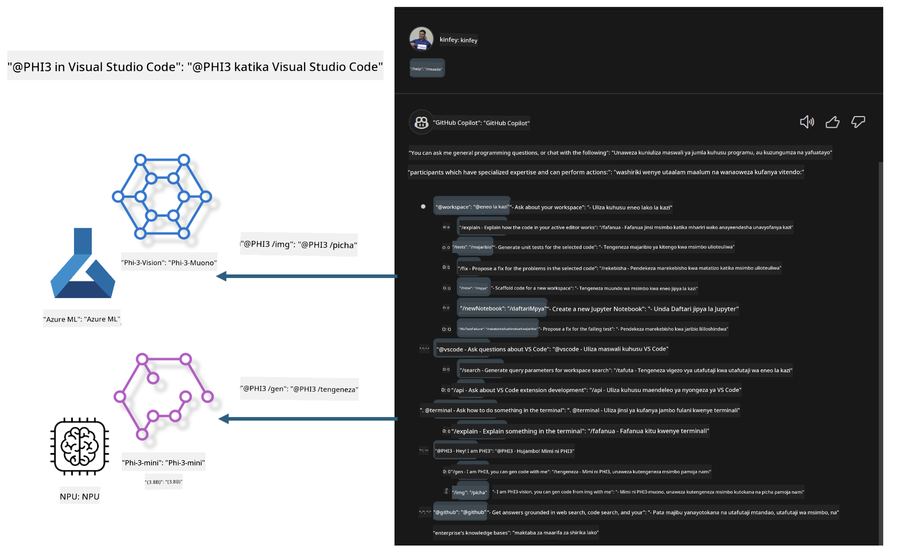

<!--
CO_OP_TRANSLATOR_METADATA:
{
  "original_hash": "00b7a699de8ac405fa821f4c0f7fc0ab",
  "translation_date": "2025-05-09T19:16:14+00:00",
  "source_file": "md/02.Application/02.Code/Phi3/VSCodeExt/README.md",
  "language_code": "sw"
}
-->
# **Jenga Visual Studio Code GitHub Copilot Chat yako mwenyewe na Microsoft Phi-3 Family**

Je, umewahi kutumia workspace agent katika GitHub Copilot Chat? Unataka kuunda agent wa msimbo wa timu yako mwenyewe? Maabara hii ya vitendo inalenga kuunganisha modeli ya chanzo huria kujenga agent wa biashara wa msimbo wa kiwango cha shirika.

## **Msingi**

### **Kwa nini uchague Microsoft Phi-3**

Phi-3 ni familia ya modeli, ikijumuisha phi-3-mini, phi-3-small, na phi-3-medium kulingana na vigezo tofauti vya mafunzo kwa ajili ya uundaji wa maandishi, kukamilisha mazungumzo, na uundaji wa msimbo. Pia kuna phi-3-vision inayotegemea Vision. Inafaa kwa makampuni au timu tofauti kuunda suluhisho za AI za kizazi zisizo mtandao.

Inapendekezwa kusoma kiungo hiki [https://github.com/microsoft/PhiCookBook/blob/main/md/01.Introduction/01/01.PhiFamily.md](https://github.com/microsoft/PhiCookBook/blob/main/md/01.Introduction/01/01.PhiFamily.md)

### **Microsoft GitHub Copilot Chat**

Ongeza ya GitHub Copilot Chat inakupa kiolesura cha mazungumzo kinachokuwezesha kuwasiliana na GitHub Copilot na kupokea majibu ya maswali yanayohusiana na coding moja kwa moja ndani ya VS Code, bila kuhitaji kuvinjari nyaraka au kutafuta kwenye majukwaa ya mtandaoni.

Copilot Chat inaweza kutumia kuonyesha sintaksia, mwekundu wa mistari, na vipengele vingine vya muundo kuongeza uwazi kwenye majibu yanayotolewa. Kulingana na aina ya swali kutoka kwa mtumiaji, matokeo yanaweza kuwa na viungo vinavyoelezea muktadha ambao Copilot ilitumia kutengeneza jibu, kama vile faili za msimbo chanzo au nyaraka, au vitufe vya kufikia vipengele vya VS Code.

- Copilot Chat inaunganishwa kwenye mtiririko wako wa maendeleo na inakupa msaada unapotahitaji:

- Anza mazungumzo ya moja kwa moja ndani ya mhariri au terminal kwa msaada wakati unafanya coding

- Tumia mtazamo wa Chat kuwa na msaidizi wa AI pembeni kukusaidia wakati wowote

- Anzisha Quick Chat kuuliza swali fupi na kurudi kwenye kazi yako haraka

Unaweza kutumia GitHub Copilot Chat katika hali mbalimbali, kama vile:

- Kujibu maswali ya coding juu ya jinsi ya kutatua tatizo kwa njia bora

- Kuelezea msimbo wa mtu mwingine na kupendekeza maboresho

- Kupendekeza marekebisho ya msimbo

- Kutengeneza kesi za majaribio ya unit

- Kutengeneza nyaraka za msimbo

Inapendekezwa kusoma kiungo hiki [https://code.visualstudio.com/docs/copilot/copilot-chat](https://code.visualstudio.com/docs/copilot/copilot-chat?WT.mc_id=aiml-137032-kinfeylo)

###  **Microsoft GitHub Copilot Chat @workspace**

Kurejelea **@workspace** katika Copilot Chat kunakuwezesha kuuliza maswali kuhusu msimbo wako mzima. Kulingana na swali, Copilot hutafuta kwa akili faili na alama zinazofaa, ambazo kisha hutaja katika jibu lake kama viungo na mifano ya msimbo.

Ili kujibu swali lako, **@workspace** hutafuta kupitia vyanzo sawa ambavyo msanidi programu hutumia anapovinjari msimbo ndani ya VS Code:

- Faili zote katika workspace, isipokuwa faili zilizoachwa na .gitignore

- Muundo wa saraka yenye folda na majina ya faili yaliyomo ndani

- Kielekezi cha utafutaji wa msimbo cha GitHub, ikiwa workspace ni hifadhi ya GitHub na imeorodheshwa na utafutaji wa msimbo

- Alama na ufafanuzi katika workspace

- Maandishi yaliyochaguliwa sasa au yaliyomo kwenye mhariri unaoonekana

Kumbuka: .gitignore haizingatiwi ikiwa una faili wazi au umechagua maandishi ndani ya faili lililoachwa.

Inapendekezwa kusoma kiungo hiki [[https://code.visualstudio.com/docs/copilot/copilot-chat](https://code.visualstudio.com/docs/copilot/workspace-context?WT.mc_id=aiml-137032-kinfeylo)]

## **Jifunze zaidi kuhusu Maabara hii**

GitHub Copilot imeboresha sana ufanisi wa uandishi wa programu katika makampuni, na kila shirika linatarajia kubinafsisha vipengele husika vya GitHub Copilot. Makampuni mengi yameunda Extensions zinazofanana na GitHub Copilot kulingana na hali zao za biashara na modeli za chanzo huria. Kwa makampuni, Extensions zilizobinafsishwa ni rahisi kudhibiti, lakini hii pia huathiri uzoefu wa mtumiaji. Baada ya yote, GitHub Copilot ina uwezo mkubwa zaidi katika kushughulikia hali za jumla na taaluma. Ikiwa uzoefu unaweza kudumishwa kuwa sawa, itakuwa bora kubinafsisha Extension ya shirika lako. GitHub Copilot Chat hutoa APIs zinazohusiana kwa makampuni kupanua uzoefu wa Chat. Kudumisha uzoefu wa kuendelea na kuwa na vipengele vilivyobinafsishwa ni uzoefu bora kwa mtumiaji.

Maabara hii hutumia hasa modeli ya Phi-3 pamoja na NPU ya ndani na mchanganyiko wa Azure kujenga Agent maalum katika GitHub Copilot Chat ***@PHI3*** kusaidia watengenezaji wa shirika kukamilisha uundaji wa msimbo***(@PHI3 /gen)*** na kutengeneza msimbo kulingana na picha ***(@PHI3 /img)***.

### ***Note:*** 

Maabara hii kwa sasa inatekelezwa kwenye AIPC ya Intel CPU na Apple Silicon. Tutaendelea kusasisha toleo la Qualcomm la NPU.

## **Maabara**

| Jina | Maelezo | AIPC | Apple |
| ------------ | ----------- | -------- |-------- |
| Lab0 - Installations(✅) | Sanidi na sakinisha mazingira na zana zinazohusiana | [Go](./HOL/AIPC/01.Installations.md) |[Go](./HOL/Apple/01.Installations.md) |
| Lab1 - Run Prompt flow with Phi-3-mini (✅) | Pamoja na AIPC / Apple Silicon, tumia NPU ya ndani kuunda uundaji wa msimbo kupitia Phi-3-mini | [Go](./HOL/AIPC/02.PromptflowWithNPU.md) |  [Go](./HOL/Apple/02.PromptflowWithMLX.md) |
| Lab2 - Deploy Phi-3-vision on Azure Machine Learning Service(✅) | Tengeneza msimbo kwa kutumia Azure Machine Learning Service Model Catalog - picha ya Phi-3-vision | [Go](./HOL/AIPC/03.DeployPhi3VisionOnAzure.md) |[Go](./HOL/Apple/03.DeployPhi3VisionOnAzure.md) |
| Lab3 - Create a @phi-3 agent in GitHub Copilot Chat(✅)  | Unda agent maalum wa Phi-3 katika GitHub Copilot Chat kukamilisha uundaji wa msimbo, uundaji wa msimbo wa grafu, RAG, n.k. | [Go](./HOL/AIPC/04.CreatePhi3AgentInVSCode.md) | [Go](./HOL/Apple/04.CreatePhi3AgentInVSCode.md) |
| Sample Code (✅)  | Pakua msimbo wa mfano | [Go](../../../../../../../code/07.Lab/01/AIPC) | [Go](../../../../../../../code/07.Lab/01/Apple) |

## **Rasilimali**

1. Phi-3 Cookbook [https://github.com/microsoft/Phi-3CookBook](https://github.com/microsoft/Phi-3CookBook)

2. Jifunze zaidi kuhusu GitHub Copilot [https://learn.microsoft.com/training/paths/copilot/](https://learn.microsoft.com/training/paths/copilot/?WT.mc_id=aiml-137032-kinfeylo)

3. Jifunze zaidi kuhusu GitHub Copilot Chat [https://learn.microsoft.com/training/paths/accelerate-app-development-using-github-copilot/](https://learn.microsoft.com/training/paths/accelerate-app-development-using-github-copilot/?WT.mc_id=aiml-137032-kinfeylo)

4. Jifunze zaidi kuhusu GitHub Copilot Chat API [https://code.visualstudio.com/api/extension-guides/chat](https://code.visualstudio.com/api/extension-guides/chat?WT.mc_id=aiml-137032-kinfeylo)

5. Jifunze zaidi kuhusu Azure AI Foundry [https://learn.microsoft.com/training/paths/create-custom-copilots-ai-studio/](https://learn.microsoft.com/training/paths/create-custom-copilots-ai-studio/?WT.mc_id=aiml-137032-kinfeylo)

6. Jifunze zaidi kuhusu Azure AI Foundry's Model Catalog [https://learn.microsoft.com/azure/ai-studio/how-to/model-catalog-overview](https://learn.microsoft.com/azure/ai-studio/how-to/model-catalog-overview)

**Kanganyo**:  
Hati hii imetafsiriwa kwa kutumia huduma ya tafsiri ya AI [Co-op Translator](https://github.com/Azure/co-op-translator). Ingawa tunajitahidi kuhakikisha usahihi, tafadhali fahamu kuwa tafsiri za kiotomatiki zinaweza kuwa na makosa au upungufu wa usahihi. Hati ya asili katika lugha yake ya asili inapaswa kuchukuliwa kama chanzo cha mamlaka. Kwa taarifa muhimu, tafsiri ya kitaalamu inayofanywa na binadamu inapendekezwa. Hatubeba dhamana yoyote kwa kutokuelewana au tafsiri potofu zinazotokana na matumizi ya tafsiri hii.