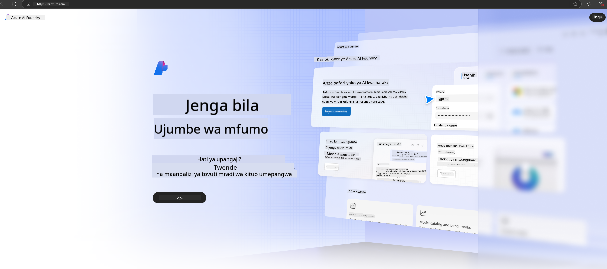

<!--
CO_OP_TRANSLATOR_METADATA:
{
  "original_hash": "3a1e48b628022485aac989c9f733e792",
  "translation_date": "2025-05-09T20:14:02+00:00",
  "source_file": "md/02.QuickStart/AzureAIFoundry_QuickStart.md",
  "language_code": "sw"
}
-->
# **Kutumia Phi-3 katika Azure AI Foundry**

Kwa maendeleo ya Generative AI, tunatarajia kutumia jukwaa moja la kusimamia LLM na SLM tofauti, ushirikiano wa data za biashara, urekebishaji/fine-tuning/RAG, na tathmini ya biashara mbalimbali baada ya kuunganisha LLM na SLM, n.k., ili AI ya kizazi iweze kutekelezwa vyema katika programu za Smart. [Azure AI Foundry](https://ai.azure.com) ni jukwaa la programu za kizazi la AI kwa viwango vya biashara.

Kwa kutumia Azure AI Foundry, unaweza kutathmini majibu ya modeli kubwa za lugha (LLM) na kupanga vipengele vya matumizi ya prompt kwa kutumia prompt flow ili kupata utendaji bora. Jukwaa hili linawezesha upanuzi rahisi wa kubadilisha majaribio kuwa uzalishaji kamili. Ufuatiliaji wa mara kwa mara na maboresho husaidia kufanikisha mafanikio ya muda mrefu.

Tunaweza kupeleka modeli ya Phi-3 haraka kwenye Azure AI Foundry kwa hatua rahisi, kisha kutumia Azure AI Foundry kukamilisha shughuli zinazohusiana na Playground/Chat, Fine-tuning, tathmini na kazi nyingine za Phi-3.

## **1. Maandalizi**

Ikiwa tayari una [Azure Developer CLI](https://learn.microsoft.com/azure/developer/azure-developer-cli/overview?WT.mc_id=aiml-138114-kinfeylo) imewekwa kwenye mashine yako, kutumia template hii ni rahisi kama kuendesha amri hii kwenye folda mpya.

## Uundaji wa Mikono

Kuunda mradi na hub katika Microsoft Azure AI Foundry ni njia nzuri ya kupanga na kusimamia kazi zako za AI. Hapa kuna mwongozo wa hatua kwa hatua ili kuanza:

### Kuunda Mradi katika Azure AI Foundry

1. **Nenda Azure AI Foundry**: Ingia kwenye tovuti ya Azure AI Foundry.
2. **Unda Mradi**:
   - Ikiwa uko ndani ya mradi, chagua "Azure AI Foundry" juu kushoto ili kurudi kwenye ukurasa wa nyumbani.
   - Chagua "+ Create project".
   - Weka jina la mradi.
   - Ikiwa una hub, itachaguliwa kwa default. Ikiwa una hubs zaidi ya moja, unaweza kuchagua tofauti kwenye dropdown. Ikiwa unataka kuunda hub mpya, chagua "Create new hub" na toa jina.
   - Chagua "Create".

### Kuunda Hub katika Azure AI Foundry

1. **Nenda Azure AI Foundry**: Ingia kwa akaunti yako ya Azure.
2. **Unda Hub**:
   - Chagua Management center kutoka kwenye menyu ya kushoto.
   - Chagua "All resources", kisha mshale chini karibu na "+ New project" na chagua "+ New hub".
   - Katika dirisha la "Create a new hub", weka jina la hub yako (mfano, contoso-hub) na badilisha maeneo mengine kama unavyotaka.
   - Chagua "Next", hakiki taarifa, kisha chagua "Create".

Kwa maelezo zaidi, unaweza rejelea [Microsoft documentation](https://learn.microsoft.com/azure/ai-studio/how-to/create-projects).

Baada ya kuundwa kwa mafanikio, unaweza kufikia studio uliyounda kupitia [ai.azure.com](https://ai.azure.com/)

Kunaweza kuwa na miradi mingi kwenye AI Foundry moja. Unda mradi katika AI Foundry kama maandalizi.

Unda Azure AI Foundry [QuickStarts](https://learn.microsoft.com/azure/ai-studio/quickstarts/get-started-code)

## **2. Kuweka modeli ya Phi katika Azure AI Foundry**

Bofya chaguo la Explore la mradi kuingia kwenye Model Catalog na chagua Phi-3

Chagua Phi-3-mini-4k-instruct

Bofya 'Deploy' kuweka modeli ya Phi-3-mini-4k-instruct

> [!NOTE]
>
> Unaweza kuchagua nguvu ya kompyuta wakati wa kuweka

## **3. Playground Chat Phi katika Azure AI Foundry**

Nenda kwenye ukurasa wa deployment, chagua Playground, na zungumza na Phi-3 wa Azure AI Foundry

## **4. Kuweka Modeli kutoka Azure AI Foundry**

Ili kuweka modeli kutoka Azure Model Catalog, fuata hatua hizi:

- Ingia Azure AI Foundry.
- Chagua modeli unayotaka kuweka kutoka kwenye katalogi ya modeli ya Azure AI Foundry.
- Kwenye ukurasa wa Maelezo ya modeli, chagua Deploy kisha chagua Serverless API na Azure AI Content Safety.
- Chagua mradi ambao unataka kuweka modeli zako ndani yake. Ili kutumia Serverless API, eneo la workspace lazima liwe East US 2 au Sweden Central. Unaweza kubadilisha Jina la Deployment.
- Kwenye dirisha la deployment, chagua Pricing na terms ili kujifunza kuhusu gharama na masharti ya matumizi.
- Chagua Deploy. Subiri hadi deployment ianze na uelekezwe kwenye ukurasa wa Deployments.
- Chagua Open in playground kuanza kuingiliana na modeli.
- Unaweza kurudi kwenye ukurasa wa Deployments, chagua deployment, na kumbuka URL ya Target ya endpoint na Secret Key, ambazo unaweza kutumia kuita deployment na kuzalisha majibu.
- Daima unaweza kupata maelezo ya endpoint, URL, na funguo za kufikia kwa kwenda kwenye tab ya Build na kuchagua Deployments sehemu ya Components.

> [!NOTE]
> Tafadhali hakikisha akaunti yako ina ruhusa za Azure AI Developer kwenye Resource Group ili kufanya hatua hizi.

## **5. Kutumia Phi API katika Azure AI Foundry**

Unaweza kufikia https://{Your project name}.region.inference.ml.azure.com/swagger.json kupitia Postman GET na kuunganisha na Key ili kujifunza kuhusu interfaces zinazotolewa

Unaweza kupata vigezo vya maombi kwa urahisi, pamoja na vigezo vya majibu.

**Kangamsha**:  
Nyaraka hii imetafsiriwa kwa kutumia huduma ya tafsiri ya AI [Co-op Translator](https://github.com/Azure/co-op-translator). Ingawa tunajitahidi kufikia usahihi, tafadhali fahamu kwamba tafsiri za kiotomatiki zinaweza kuwa na makosa au upungufu wa usahihi. Nyaraka ya asili katika lugha yake ya asili inapaswa kuchukuliwa kama chanzo cha mamlaka. Kwa taarifa muhimu, tafsiri ya kitaalamu inayofanywa na watu inashauriwa. Hatubebwi dhamana kwa kutoelewana au tafsiri potofu zinazotokana na matumizi ya tafsiri hii.