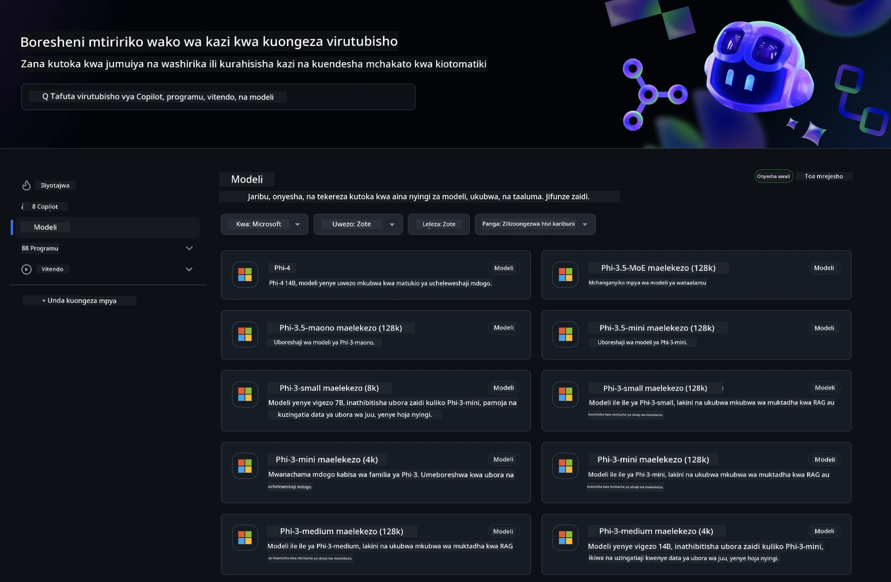
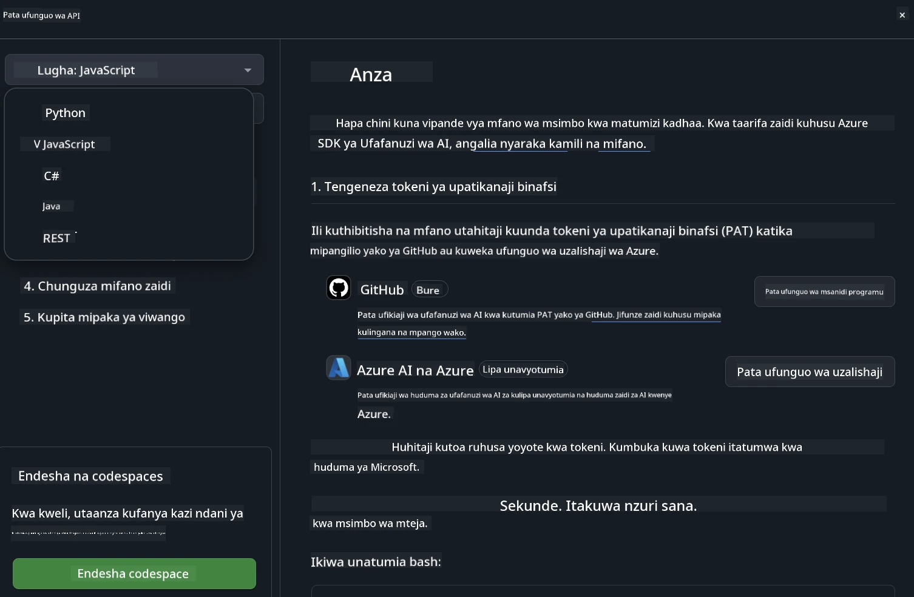
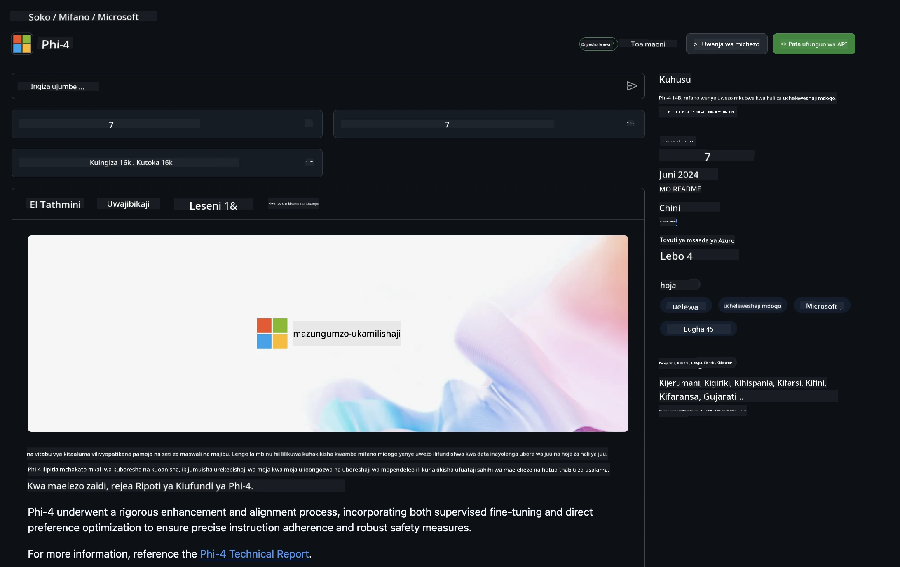

<!--
CO_OP_TRANSLATOR_METADATA:
{
  "original_hash": "5113634b77370af6790f9697d5d7de90",
  "translation_date": "2025-07-17T05:40:24+00:00",
  "source_file": "md/02.QuickStart/GitHubModel_QuickStart.md",
  "language_code": "sw"
}
-->
## GitHub Models - Beta ya Umma Iliyopunguzwa

Karibu kwenye [GitHub Models](https://github.com/marketplace/models)! Tumeandaa kila kitu tayari kwa ajili yako kuchunguza Modeli za AI zinazohudumiwa kwenye Azure AI.



Kwa maelezo zaidi kuhusu Modeli zinazopatikana kwenye GitHub Models, angalia [GitHub Model Marketplace](https://github.com/marketplace/models)

## Modeli Zinazopatikana

Kila modeli ina eneo la majaribio na mifano ya msimbo


### Modeli za Phi-3 katika Katalogi ya Modeli ya GitHub

[Phi-3-Medium-128k-Instruct](https://github.com/marketplace/models/azureml/Phi-3-medium-128k-instruct)

[Phi-3-medium-4k-instruct](https://github.com/marketplace/models/azureml/Phi-3-medium-4k-instruct)

[Phi-3-mini-128k-instruct](https://github.com/marketplace/models/azureml/Phi-3-mini-128k-instruct)

[Phi-3-mini-4k-instruct](https://github.com/marketplace/models/azureml/Phi-3-mini-4k-instruct)

[Phi-3-small-128k-instruct](https://github.com/marketplace/models/azureml/Phi-3-small-128k-instruct)

[Phi-3-small-8k-instruct](https://github.com/marketplace/models/azureml/Phi-3-small-8k-instruct)

## Kuanzia

Kuna mifano michache ya msingi tayari kwa ajili yako kuendesha. Unaweza kuipata kwenye saraka ya samples. Ikiwa unataka kwenda moja kwa moja kwenye lugha unayopenda, unaweza kupata mifano katika Lugha zifuatazo:

- Python
- JavaScript
- cURL

Pia kuna Mazingira maalum ya Codespaces kwa ajili ya kuendesha mifano na modeli.



## Mifano ya Msimbo

Hapa chini ni vipande vya msimbo kwa baadhi ya matumizi. Kwa maelezo zaidi kuhusu Azure AI Inference SDK, angalia nyaraka kamili na mifano.

## Usanidi

1. Tengeneza tokeni ya upatikanaji binafsi  
Huhitaji kutoa ruhusa yoyote kwa tokeni. Kumbuka tokeni itatumwa kwa huduma ya Microsoft.

Ili kutumia vipande vya msimbo hapa chini, tengeneza variable ya mazingira kuweka tokeni yako kama ufunguo kwa msimbo wa mteja.

Ikiwa unatumia bash:  
```
export GITHUB_TOKEN="<your-github-token-goes-here>"
```  
Ikiwa uko kwenye powershell:  

```
$Env:GITHUB_TOKEN="<your-github-token-goes-here>"
```  

Ikiwa unatumia Windows command prompt:  

```
set GITHUB_TOKEN=<your-github-token-goes-here>
```  

## Mfano wa Python

### Sakinisha utegemezi  
Sakinisha Azure AI Inference SDK kwa kutumia pip (Inahitaji: Python >=3.8):  

```
pip install azure-ai-inference
```  
### Endesha mfano wa msimbo wa msingi

Mfano huu unaonyesha wito wa msingi kwa API ya chat completion. Unatumia kiungo cha modeli ya AI ya GitHub na tokeni yako ya GitHub. Wito ni wa moja kwa moja (synchronous).

```
import os
from azure.ai.inference import ChatCompletionsClient
from azure.ai.inference.models import SystemMessage, UserMessage
from azure.core.credentials import AzureKeyCredential

endpoint = "https://models.inference.ai.azure.com"
# Replace Model_Name 
model_name = "Phi-3-small-8k-instruct"
token = os.environ["GITHUB_TOKEN"]

client = ChatCompletionsClient(
    endpoint=endpoint,
    credential=AzureKeyCredential(token),
)

response = client.complete(
    messages=[
        SystemMessage(content="You are a helpful assistant."),
        UserMessage(content="What is the capital of France?"),
    ],
    model=model_name,
    temperature=1.,
    max_tokens=1000,
    top_p=1.
)

print(response.choices[0].message.content)
```

### Endesha mazungumzo ya mizunguko mingi

Mfano huu unaonyesha mazungumzo ya mizunguko mingi na API ya chat completion. Unapotumia modeli kwa programu ya mazungumzo, utahitaji kusimamia historia ya mazungumzo hayo na kutuma ujumbe wa hivi karibuni kwa modeli.

```
import os
from azure.ai.inference import ChatCompletionsClient
from azure.ai.inference.models import AssistantMessage, SystemMessage, UserMessage
from azure.core.credentials import AzureKeyCredential

token = os.environ["GITHUB_TOKEN"]
endpoint = "https://models.inference.ai.azure.com"
# Replace Model_Name
model_name = "Phi-3-small-8k-instruct"

client = ChatCompletionsClient(
    endpoint=endpoint,
    credential=AzureKeyCredential(token),
)

messages = [
    SystemMessage(content="You are a helpful assistant."),
    UserMessage(content="What is the capital of France?"),
    AssistantMessage(content="The capital of France is Paris."),
    UserMessage(content="What about Spain?"),
]

response = client.complete(messages=messages, model=model_name)

print(response.choices[0].message.content)
```

### Pitia matokeo kwa mtiririko

Kwa uzoefu bora wa mtumiaji, utataka kupitisha majibu ya modeli kwa mtiririko ili tokeni ya kwanza ionekane mapema na kuepuka kusubiri majibu marefu.

```
import os
from azure.ai.inference import ChatCompletionsClient
from azure.ai.inference.models import SystemMessage, UserMessage
from azure.core.credentials import AzureKeyCredential

token = os.environ["GITHUB_TOKEN"]
endpoint = "https://models.inference.ai.azure.com"
# Replace Model_Name
model_name = "Phi-3-small-8k-instruct"

client = ChatCompletionsClient(
    endpoint=endpoint,
    credential=AzureKeyCredential(token),
)

response = client.complete(
    stream=True,
    messages=[
        SystemMessage(content="You are a helpful assistant."),
        UserMessage(content="Give me 5 good reasons why I should exercise every day."),
    ],
    model=model_name,
)

for update in response:
    if update.choices:
        print(update.choices[0].delta.content or "", end="")

client.close()
```  
## JavaScript

### Sakinisha utegemezi

Sakinisha Node.js.

Nakili mistari ifuatayo ya maandishi na uiweke kama faili package.json ndani ya folda yako.

```
{
  "type": "module",
  "dependencies": {
    "@azure-rest/ai-inference": "latest",
    "@azure/core-auth": "latest",
    "@azure/core-sse": "latest"
  }
}
```

Kumbuka: @azure/core-sse inahitajika tu wakati unapitisha majibu ya chat completions kwa mtiririko.

Fungua dirisha la terminal katika folda hii na endesha npm install.

Kwa kila kipande cha msimbo hapa chini, nakili yaliyomo kwenye faili sample.js na uendeshe kwa node sample.js.

### Endesha mfano wa msimbo wa msingi

Mfano huu unaonyesha wito wa msingi kwa API ya chat completion. Unatumia kiungo cha modeli ya AI ya GitHub na tokeni yako ya GitHub. Wito ni wa moja kwa moja (synchronous).

```
import ModelClient from "@azure-rest/ai-inference";
import { AzureKeyCredential } from "@azure/core-auth";

const token = process.env["GITHUB_TOKEN"];
const endpoint = "https://models.inference.ai.azure.com";
// Update your modelname
const modelName = "Phi-3-small-8k-instruct";

export async function main() {

  const client = new ModelClient(endpoint, new AzureKeyCredential(token));

  const response = await client.path("/chat/completions").post({
    body: {
      messages: [
        { role:"system", content: "You are a helpful assistant." },
        { role:"user", content: "What is the capital of France?" }
      ],
      model: modelName,
      temperature: 1.,
      max_tokens: 1000,
      top_p: 1.
    }
  });

  if (response.status !== "200") {
    throw response.body.error;
  }
  console.log(response.body.choices[0].message.content);
}

main().catch((err) => {
  console.error("The sample encountered an error:", err);
});
```

### Endesha mazungumzo ya mizunguko mingi

Mfano huu unaonyesha mazungumzo ya mizunguko mingi na API ya chat completion. Unapotumia modeli kwa programu ya mazungumzo, utahitaji kusimamia historia ya mazungumzo hayo na kutuma ujumbe wa hivi karibuni kwa modeli.

```
import ModelClient from "@azure-rest/ai-inference";
import { AzureKeyCredential } from "@azure/core-auth";

const token = process.env["GITHUB_TOKEN"];
const endpoint = "https://models.inference.ai.azure.com";
// Update your modelname
const modelName = "Phi-3-small-8k-instruct";

export async function main() {

  const client = new ModelClient(endpoint, new AzureKeyCredential(token));

  const response = await client.path("/chat/completions").post({
    body: {
      messages: [
        { role: "system", content: "You are a helpful assistant." },
        { role: "user", content: "What is the capital of France?" },
        { role: "assistant", content: "The capital of France is Paris." },
        { role: "user", content: "What about Spain?" },
      ],
      model: modelName,
    }
  });

  if (response.status !== "200") {
    throw response.body.error;
  }

  for (const choice of response.body.choices) {
    console.log(choice.message.content);
  }
}

main().catch((err) => {
  console.error("The sample encountered an error:", err);
});
```

### Pitia matokeo kwa mtiririko  
Kwa uzoefu bora wa mtumiaji, utataka kupitisha majibu ya modeli kwa mtiririko ili tokeni ya kwanza ionekane mapema na kuepuka kusubiri majibu marefu.

```
import ModelClient from "@azure-rest/ai-inference";
import { AzureKeyCredential } from "@azure/core-auth";
import { createSseStream } from "@azure/core-sse";

const token = process.env["GITHUB_TOKEN"];
const endpoint = "https://models.inference.ai.azure.com";
// Update your modelname
const modelName = "Phi-3-small-8k-instruct";

export async function main() {

  const client = new ModelClient(endpoint, new AzureKeyCredential(token));

  const response = await client.path("/chat/completions").post({
    body: {
      messages: [
        { role: "system", content: "You are a helpful assistant." },
        { role: "user", content: "Give me 5 good reasons why I should exercise every day." },
      ],
      model: modelName,
      stream: true
    }
  }).asNodeStream();

  const stream = response.body;
  if (!stream) {
    throw new Error("The response stream is undefined");
  }

  if (response.status !== "200") {
    stream.destroy();
    throw new Error(`Failed to get chat completions, http operation failed with ${response.status} code`);
  }

  const sseStream = createSseStream(stream);

  for await (const event of sseStream) {
    if (event.data === "[DONE]") {
      return;
    }
    for (const choice of (JSON.parse(event.data)).choices) {
        process.stdout.write(choice.delta?.content ?? ``);
    }
  }
}

main().catch((err) => {
  console.error("The sample encountered an error:", err);
});
```

## REST

### Endesha mfano wa msimbo wa msingi

Bandika yafuatayo kwenye shell:

```
curl -X POST "https://models.inference.ai.azure.com/chat/completions" \
    -H "Content-Type: application/json" \
    -H "Authorization: Bearer $GITHUB_TOKEN" \
    -d '{
        "messages": [
            {
                "role": "system",
                "content": "You are a helpful assistant."
            },
            {
                "role": "user",
                "content": "What is the capital of France?"
            }
        ],
        "model": "Phi-3-small-8k-instruct"
    }'
```  
### Endesha mazungumzo ya mizunguko mingi

Piga API ya chat completion na tuma historia ya mazungumzo:

```
curl -X POST "https://models.inference.ai.azure.com/chat/completions" \
    -H "Content-Type: application/json" \
    -H "Authorization: Bearer $GITHUB_TOKEN" \
    -d '{
        "messages": [
            {
                "role": "system",
                "content": "You are a helpful assistant."
            },
            {
                "role": "user",
                "content": "What is the capital of France?"
            },
            {
                "role": "assistant",
                "content": "The capital of France is Paris."
            },
            {
                "role": "user",
                "content": "What about Spain?"
            }
        ],
        "model": "Phi-3-small-8k-instruct"
    }'
```  
### Pitia matokeo kwa mtiririko

Huu ni mfano wa kupiga kiungo na kupitisha majibu kwa mtiririko.

```
curl -X POST "https://models.inference.ai.azure.com/chat/completions" \
    -H "Content-Type: application/json" \
    -H "Authorization: Bearer $GITHUB_TOKEN" \
    -d '{
        "messages": [
            {
                "role": "system",
                "content": "You are a helpful assistant."
            },
            {
                "role": "user",
                "content": "Give me 5 good reasons why I should exercise every day."
            }
        ],
        "stream": true,
        "model": "Phi-3-small-8k-instruct"
    }'
```

## Matumizi ya BURE na Mipaka ya Kiwango kwa GitHub Models



[Mipaka ya kiwango kwa eneo la majaribio na matumizi ya bure ya API](https://docs.github.com/en/github-models/prototyping-with-ai-models#rate-limits) yamekusudiwa kusaidia kujaribu modeli na kuunda mfano wa programu yako ya AI. Kwa matumizi zaidi ya mipaka hiyo, na kupeleka programu yako kwa kiwango kikubwa, lazima upange rasilimali kutoka kwa akaunti ya Azure, na uthibitishe kutoka hapo badala ya tokeni yako ya upatikanaji binafsi ya GitHub. Huhitaji kubadilisha kitu kingine chochote kwenye msimbo wako. Tumia kiungo hiki kujifunza jinsi ya kupita mipaka ya kiwango cha bure katika Azure AI.

### Maelezo ya Onyo

Kumbuka unapoingiliana na modeli, unajaribu AI, hivyo makosa ya maudhui yanawezekana.

Kipengele hiki kina mipaka mbalimbali (ikiwa ni pamoja na maombi kwa dakika, maombi kwa siku, tokeni kwa ombi, na maombi yanayofanyika kwa wakati mmoja) na hakijatengenezwa kwa matumizi ya uzalishaji.

GitHub Models hutumia Azure AI Content Safety. Vichujio hivi haviwezi kuzimwa kama sehemu ya uzoefu wa GitHub Models. Ikiwa utaamua kutumia modeli kupitia huduma ya kulipwa, tafadhali sanidi vichujio vyako vya maudhui ili kukidhi mahitaji yako.

Huduma hii iko chini ya Masharti ya Awali ya Kutolewa ya GitHub.

**Kiarifu cha Kutotegemea**:  
Hati hii imetafsiriwa kwa kutumia huduma ya tafsiri ya AI [Co-op Translator](https://github.com/Azure/co-op-translator). Ingawa tunajitahidi kwa usahihi, tafadhali fahamu kuwa tafsiri za kiotomatiki zinaweza kuwa na makosa au upungufu wa usahihi. Hati ya asili katika lugha yake ya asili inapaswa kuchukuliwa kama chanzo cha mamlaka. Kwa taarifa muhimu, tafsiri ya kitaalamu inayofanywa na binadamu inapendekezwa. Hatubebei dhamana kwa kutoelewana au tafsiri potofu zinazotokana na matumizi ya tafsiri hii.