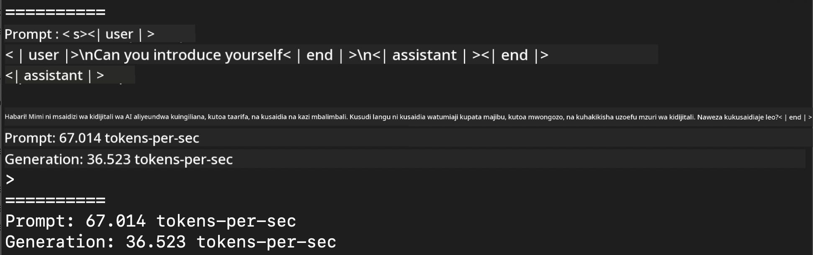
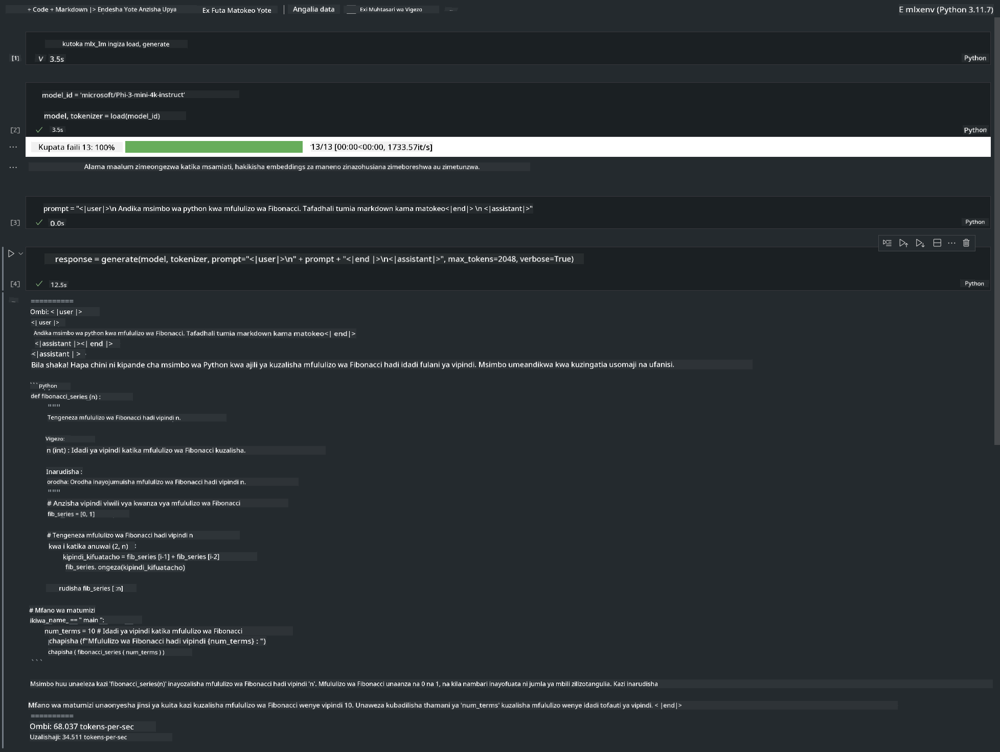

<!--
CO_OP_TRANSLATOR_METADATA:
{
  "original_hash": "dcb656f3d206fc4968e236deec5d4384",
  "translation_date": "2025-07-17T10:08:37+00:00",
  "source_file": "md/03.FineTuning/03.Inference/MLX_Inference.md",
  "language_code": "sw"
}
-->
# **Inference Phi-3 na Apple MLX Framework**

## **MLX Framework ni Nini**

MLX ni mfumo wa safu kwa ajili ya utafiti wa kujifunza mashine kwenye Apple silicon, uliotolewa na utafiti wa kujifunza mashine wa Apple.

MLX imeundwa na watafiti wa kujifunza mashine kwa ajili ya watafiti wa kujifunza mashine. Mfumo huu umebuniwa kuwa rahisi kwa mtumiaji, lakini bado wenye ufanisi wa kufundisha na kuendesha mifano. Muundo wa mfumo pia ni rahisi kimsingi. Tunakusudia kufanya iwe rahisi kwa watafiti kuongeza na kuboresha MLX kwa lengo la kuchunguza haraka mawazo mapya.

LLMs zinaweza kuharakishwa kwenye vifaa vya Apple Silicon kupitia MLX, na mifano inaweza kuendeshwa kwa urahisi mahali hapa.

## **Kutumia MLX kufanya inference ya Phi-3-mini**

### **1. Weka mazingira yako ya MLX**

1. Python 3.11.x  
2. Sakinisha Maktaba ya MLX  


```bash

pip install mlx-lm

```

### **2. Kuendesha Phi-3-mini kwenye Terminal kwa kutumia MLX**


```bash

python -m mlx_lm.generate --model microsoft/Phi-3-mini-4k-instruct --max-token 2048 --prompt  "<|user|>\nCan you introduce yourself<|end|>\n<|assistant|>"

```

Matokeo (mazingira yangu ni Apple M1 Max, 64GB) ni



### **3. Kufanya quantization ya Phi-3-mini kwa MLX kwenye Terminal**


```bash

python -m mlx_lm.convert --hf-path microsoft/Phi-3-mini-4k-instruct

```

***Note：*** Mfano unaweza kufanyiwa quantization kupitia mlx_lm.convert, na quantization ya default ni INT4. Mfano huu unafanya quantization ya Phi-3-mini hadi INT4

Mfano unaweza kufanyiwa quantization kupitia mlx_lm.convert, na quantization ya default ni INT4. Mfano huu ni kufanya quantization ya Phi-3-mini kuwa INT4. Baada ya quantization, itahifadhiwa kwenye saraka ya default ./mlx_model

Tunaweza kujaribu mfano uliopatiwa quantization na MLX kutoka terminal


```bash

python -m mlx_lm.generate --model ./mlx_model/ --max-token 2048 --prompt  "<|user|>\nCan you introduce yourself<|end|>\n<|assistant|>"

```

Matokeo ni


### **4. Kuendesha Phi-3-mini kwa MLX kwenye Jupyter Notebook**




***Note:*** Tafadhali soma sampuli hii [bonyeza kiungo hiki](../../../../../code/03.Inference/MLX/MLX_DEMO.ipynb)


## **Rasilimali**

1. Jifunze kuhusu Apple MLX Framework [https://ml-explore.github.io](https://ml-explore.github.io/mlx/build/html/index.html)

2. Apple MLX GitHub Repo [https://github.com/ml-explore](https://github.com/ml-explore)

**Kiarifu cha Kutotegemea**:  
Hati hii imetafsiriwa kwa kutumia huduma ya tafsiri ya AI [Co-op Translator](https://github.com/Azure/co-op-translator). Ingawa tunajitahidi kwa usahihi, tafadhali fahamu kwamba tafsiri za kiotomatiki zinaweza kuwa na makosa au upungufu wa usahihi. Hati ya asili katika lugha yake ya asili inapaswa kuchukuliwa kama chanzo cha mamlaka. Kwa taarifa muhimu, tafsiri ya kitaalamu inayofanywa na binadamu inapendekezwa. Hatubebei dhamana kwa kutoelewana au tafsiri potofu zinazotokana na matumizi ya tafsiri hii.