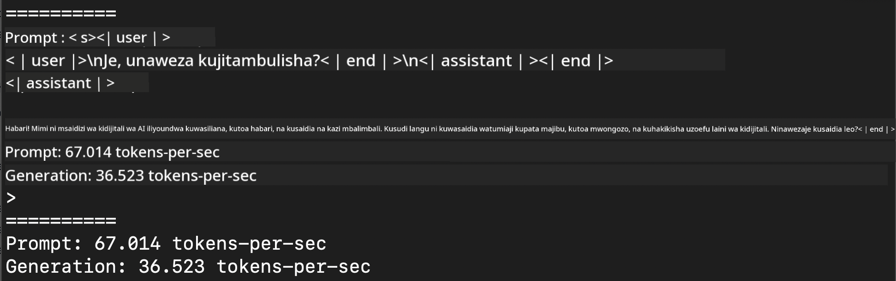
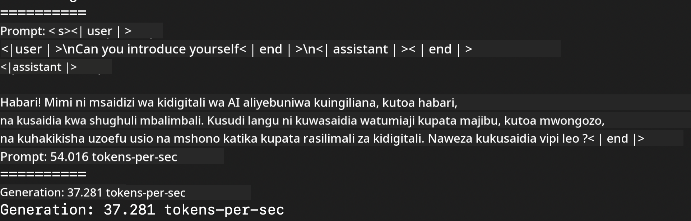
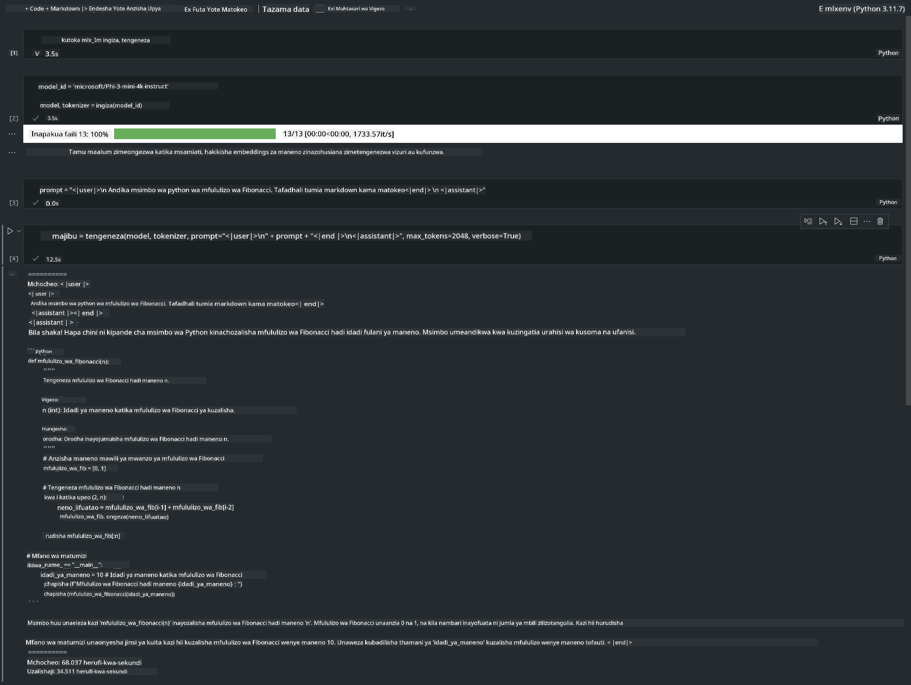

<!--
CO_OP_TRANSLATOR_METADATA:
{
  "original_hash": "dcb656f3d206fc4968e236deec5d4384",
  "translation_date": "2025-05-09T22:33:08+00:00",
  "source_file": "md/03.FineTuning/03.Inference/MLX_Inference.md",
  "language_code": "sw"
}
-->
# **Utambuzi wa Phi-3 kwa kutumia Apple MLX Framework**

## **MLX Framework ni Nini**

MLX ni mfumo wa array kwa ajili ya utafiti wa machine learning kwenye Apple silicon, unaotolewa na utafiti wa machine learning wa Apple.

MLX imeundwa na watafiti wa machine learning kwa ajili ya watafiti wa machine learning. Mfumo huu umebuniwa kuwa rahisi kwa mtumiaji, lakini pia wenye ufanisi wa kuendesha mafunzo na kutekeleza modeli. Ubunifu wa mfumo huu pia ni rahisi kifikra. Lengo letu ni kurahisisha watafiti kuongeza na kuboresha MLX kwa ajili ya kuchunguza haraka mawazo mapya.

LLMs zinaweza kuendeshwa kwa kasi kwenye vifaa vya Apple Silicon kupitia MLX, na modeli zinaweza kuendeshwa kwa urahisi kwa ndani.

## **Kutumia MLX kuendesha Phi-3-mini**

### **1. Andaa mazingira yako ya MLX**

1. Python 3.11.x  
2. Sakinisha Maktaba ya MLX


```bash

pip install mlx-lm

```

### **2. Kuendesha Phi-3-mini kwenye Terminal kwa kutumia MLX**


```bash

python -m mlx_lm.generate --model microsoft/Phi-3-mini-4k-instruct --max-token 2048 --prompt  "<|user|>\nCan you introduce yourself<|end|>\n<|assistant|>"

```

Matokeo (mazingira yangu ni Apple M1 Max, 64GB) ni



### **3. Kufanya Quantization ya Phi-3-mini kwa MLX kwenye Terminal**


```bash

python -m mlx_lm.convert --hf-path microsoft/Phi-3-mini-4k-instruct

```

***Note：*** Modeli inaweza kufanyiwa quantization kupitia mlx_lm.convert, na quantization ya kawaida ni INT4. Mfano huu unafanya quantization ya Phi-3-mini kwenda INT4

Modeli inaweza kufanyiwa quantization kupitia mlx_lm.convert, na quantization ya kawaida ni INT4. Mfano huu ni kuquantize Phi-3-mini kuwa INT4. Baada ya quantization, itahifadhiwa kwenye saraka ya kawaida ./mlx_model

Tunaweza kujaribu modeli iliyofanyiwa quantization na MLX kutoka terminal


```bash

python -m mlx_lm.generate --model ./mlx_model/ --max-token 2048 --prompt  "<|user|>\nCan you introduce yourself<|end|>\n<|assistant|>"

```

Matokeo ni




### **4. Kuendesha Phi-3-mini kwa MLX kwenye Jupyter Notebook**




***Note:*** Tafadhali soma mfano huu [bonyeza hapa](../../../../../code/03.Inference/MLX/MLX_DEMO.ipynb)


## **Rasilimali**

1. Jifunze kuhusu Apple MLX Framework [https://ml-explore.github.io](https://ml-explore.github.io/mlx/build/html/index.html)

2. Apple MLX GitHub Repo [https://github.com/ml-explore](https://github.com/ml-explore)

**Kiarifu**:  
Hati hii imetafsiriwa kwa kutumia huduma ya tafsiri ya AI [Co-op Translator](https://github.com/Azure/co-op-translator). Ingawa tunajitahidi kwa usahihi, tafadhali fahamu kwamba tafsiri za kiotomatiki zinaweza kuwa na makosa au upungufu wa usahihi. Hati asili katika lugha yake ya asili inapaswa kuchukuliwa kama chanzo cha kuaminika. Kwa taarifa muhimu, tafsiri ya kitaalamu inayofanywa na binadamu inashauriwa. Hatuna dhamana kwa maelewano au tafsiri potofu zitokanazo na matumizi ya tafsiri hii.