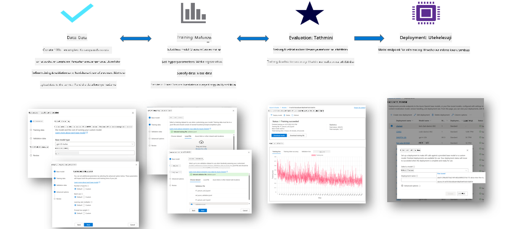
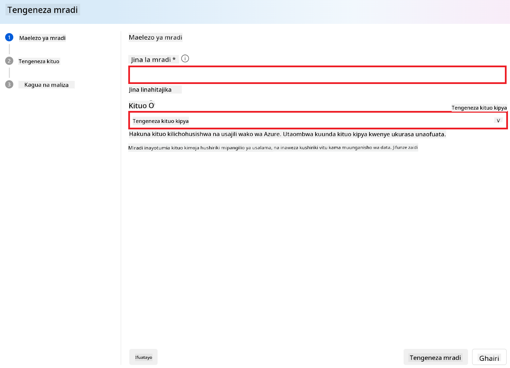
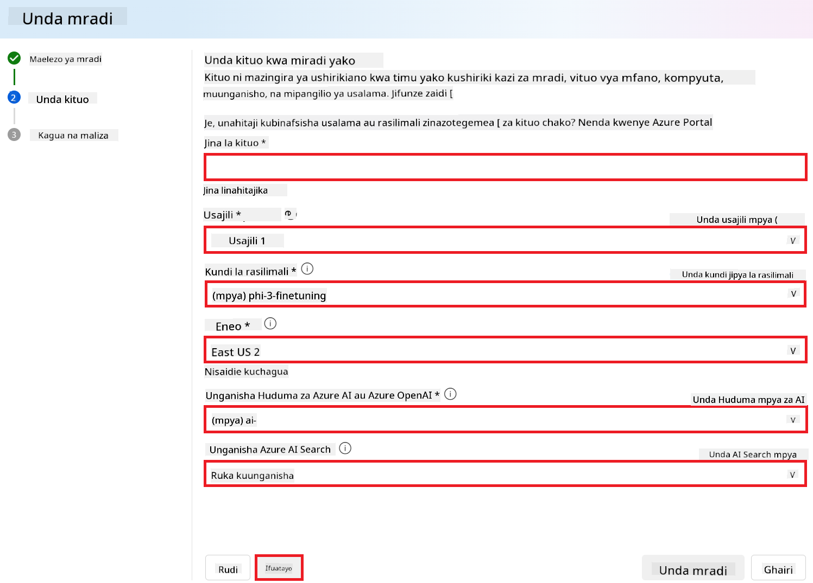
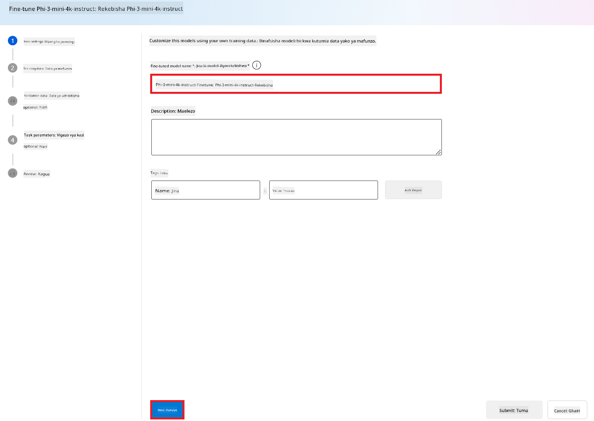
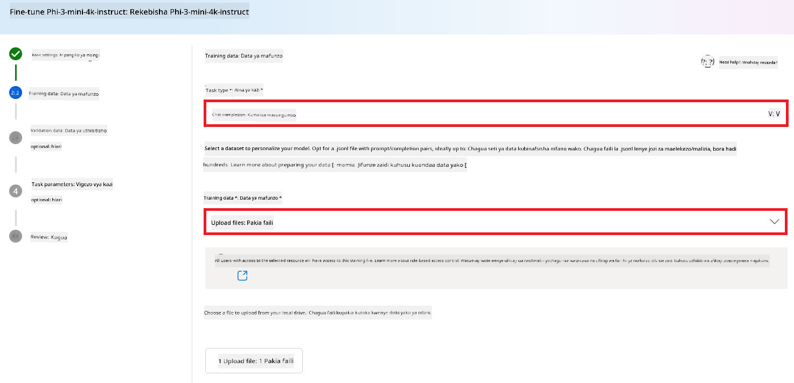

<!--
CO_OP_TRANSLATOR_METADATA:
{
  "original_hash": "c1559c5af6caccf6f623fd43a6b3a9a3",
  "translation_date": "2025-07-17T06:11:01+00:00",
  "source_file": "md/03.FineTuning/FineTuning_AIFoundry.md",
  "language_code": "sw"
}
-->
# Kurekebisha Phi-3 kwa Azure AI Foundry

Tuchunguze jinsi ya kurekebisha mfano wa lugha wa Microsoft Phi-3 Mini kwa kutumia Azure AI Foundry. Kurekebisha kunakuwezesha kuendana na Phi-3 Mini kwa kazi maalum, na kuufanya kuwa na nguvu zaidi na kuelewa muktadha vyema.

## Mambo ya Kuzingatia

- **Uwezo:** Ni mifano gani inaweza kurekebishwa? Mfano wa msingi unaweza kurekebishwa kufanya nini?
- **Gharama:** Mfano wa bei kwa kurekebisha ni upi?
- **Uwezo wa Kubadilika:** Naweza kubadilisha kiasi gani mfano wa msingi – na kwa njia gani?
- **Urahisi:** Kurekebisha hufanyika vipi – je, nahitaji kuandika msimbo maalum? Je, nahitaji kuleta kompyuta yangu?
- **Usalama:** Mifano iliyorekebishwa inajulikana kuwa na hatari za usalama – je, kuna kinga zozote za kuzuia madhara yasiyokusudiwa?


## Maandalizi ya Kurekebisha

### Masharti ya Awali

> [!NOTE]
> Kwa mifano ya familia ya Phi-3, ofa ya kurekebisha kwa malipo ya matumizi inapatikana tu kwa vituo vilivyoundwa katika maeneo ya **East US 2**.

- Usajili wa Azure. Ikiwa huna usajili wa Azure, tengeneza [akaunti ya Azure yenye malipo](https://azure.microsoft.com/pricing/purchase-options/pay-as-you-go) kuanza.

- Mradi wa [AI Foundry](https://ai.azure.com?WT.mc_id=aiml-138114-kinfeylo).
- Udhibiti wa ruhusa za Azure (Azure RBAC) hutumika kutoa ruhusa kwa shughuli katika Azure AI Foundry. Ili kufanya hatua katika makala hii, akaunti yako ya mtumiaji lazima ipewe __Azure AI Developer role__ kwenye kundi la rasilimali.

### Usajili wa mtoa huduma wa usajili

Thibitisha usajili uko kwenye mtoa huduma wa rasilimali `Microsoft.Network`.

1. Ingia kwenye [Azure portal](https://portal.azure.com).
1. Chagua **Subscriptions** kutoka kwenye menyu ya kushoto.
1. Chagua usajili unaotaka kutumia.
1. Chagua **AI project settings** > **Resource providers** kutoka kwenye menyu ya kushoto.
1. Thibitisha kuwa **Microsoft.Network** iko kwenye orodha ya watoa huduma wa rasilimali. Vinginevyo, ongeza.

### Maandalizi ya Data

Tayarisha data zako za mafunzo na uthibitishaji ili kurekebisha mfano wako. Seti zako za data za mafunzo na uthibitishaji zinajumuisha mifano ya ingizo na matokeo unayotaka mfano ufanye.

Hakikisha mifano yote ya mafunzo inafuata muundo unaotarajiwa kwa utambuzi. Ili kurekebisha mifano kwa ufanisi, hakikisha seti ya data ni yenye usawa na tofauti.

Hii inahusisha kudumisha usawa wa data, kujumuisha hali mbalimbali, na mara kwa mara kusafisha data za mafunzo ili ziendane na matarajio halisi, na hatimaye kusababisha majibu sahihi na yenye usawa zaidi kutoka kwa mfano.

Aina tofauti za mifano zinahitaji muundo tofauti wa data za mafunzo.

### Kukamilisha Mazungumzo

Data za mafunzo na uthibitishaji unazotumia **zinapaswa** kuwa katika muundo wa hati ya JSON Lines (JSONL). Kwa `Phi-3-mini-128k-instruct` seti ya data ya kurekebisha lazima iwe katika muundo wa mazungumzo unaotumika na API ya Kukamilisha Mazungumzo.

### Mfano wa muundo wa faili

```json
    {"messages": [{"role": "system", "content": "You are an Xbox customer support agent whose primary goal is to help users with issues they are experiencing with their Xbox devices. You are friendly and concise. You only provide factual answers to queries, and do not provide answers that are not related to Xbox."}, {"role": "user", "content": "Is Xbox better than PlayStation?"}, {"role": "assistant", "content": "I apologize, but I cannot provide personal opinions. My primary job is to assist you with any issues related to your Xbox device. Do you have any Xbox-related issues that need addressing?"}]}
    {"messages": [{"role": "system", "content": "You are an Xbox customer support agent whose primary goal is to help users with issues they are experiencing with their Xbox devices. You are friendly and concise. You only provide factual answers to queries, and do not provide answers that are not related to Xbox."}, {"role": "user", "content": "Can I play PC games on my Xbox?"}, {"role": "assistant", "content": "While Xbox consoles don't natively support PC games, they can play an array of Xbox games, many of which are also available on PC. Can I assist you with finding games compatible with your Xbox device?"}]}
    {"messages": [{"role": "system", "content": "You are an Xbox customer support agent whose primary goal is to help users with issues they are experiencing with their Xbox devices. You are friendly and concise. You only provide factual answers to queries, and do not provide answers that are not related to Xbox."}, {"role": "user", "content": "I'm having trouble connecting my Xbox to the Wi-Fi."}, {"role": "assistant", "content": "No worries, let's go through the network settings on your Xbox. Can you please tell me what happens when you try to connect it to the Wi-Fi?"}]}
```

Aina ya faili inayoungwa mkono ni JSON Lines. Faili hupakiwa kwenye hifadhi ya kawaida na kupatikana katika mradi wako.

## Kurekebisha Phi-3 kwa Azure AI Foundry

Azure AI Foundry inakuwezesha kubinafsisha mifano mikubwa ya lugha kwa seti zako binafsi za data kwa kutumia mchakato unaojulikana kama kurekebisha. Kurekebisha kunatoa thamani kubwa kwa kuwezesha ubinafsishaji na uboreshaji kwa kazi na matumizi maalum. Hii huleta utendaji bora, ufanisi wa gharama, kupunguza ucheleweshaji, na matokeo yaliyobinafsishwa.



### Tengeneza Mradi Mpya

1. Ingia kwenye [Azure AI Foundry](https://ai.azure.com).

1. Chagua **+New project** kuunda mradi mpya katika Azure AI Foundry.

    

1. Fanya kazi zifuatazo:

    - Jina la **Hub** la mradi. Lazima liwe la kipekee.
    - Chagua **Hub** unayotaka kutumia (unda mpya ikiwa inahitajika).

    

1. Fanya kazi zifuatazo kuunda hub mpya:

    - Weka **Jina la Hub**. Lazima liwe la kipekee.
    - Chagua **Subscription** yako ya Azure.
    - Chagua **Resource group** unayotaka kutumia (unda mpya ikiwa inahitajika).
    - Chagua **Location** unayotaka kutumia.
    - Chagua **Connect Azure AI Services** unayotaka kutumia (unda mpya ikiwa inahitajika).
    - Chagua **Connect Azure AI Search** kisha **Skip connecting**.

    

1. Chagua **Next**.
1. Chagua **Create a project**.

### Maandalizi ya Data

Kabla ya kurekebisha, kusanya au tengeneza seti ya data inayohusiana na kazi yako, kama vile maelekezo ya mazungumzo, maswali na majibu, au data nyingine muhimu ya maandishi. Safisha na andaa data hii kwa kuondoa kelele, kushughulikia thamani zilizokosekana, na kugawanya maandishi vipande vidogo.

### Rekebisha mifano ya Phi-3 katika Azure AI Foundry

> [!NOTE]
> Kurekebisha mifano ya Phi-3 kwa sasa kunasaidiwa katika miradi iliyoko East US 2.

1. Chagua **Model catalog** kutoka kwenye kichupo cha upande wa kushoto.

1. Andika *phi-3* kwenye **search bar** na chagua mfano wa phi-3 unayotaka kutumia.

    

1. Chagua **Fine-tune**.

    

1. Weka **Jina la mfano uliorekebishwa**.

    

1. Chagua **Next**.

1. Fanya kazi zifuatazo:

    - Chagua aina ya **kazi** kuwa **Chat completion**.
    - Chagua **Data ya Mafunzo** unayotaka kutumia. Unaweza kuipakia kupitia data ya Azure AI Foundry au kutoka mazingira yako ya ndani.

    

1. Chagua **Next**.

1. Pakia **Data ya Uthibitishaji** unayotaka kutumia, au unaweza kuchagua **Automatic split of training data**.

    

1. Chagua **Next**.

1. Fanya kazi zifuatazo:

    - Chagua **Kiwango cha ukubwa wa kundi (Batch size multiplier)** unayotaka kutumia.
    - Chagua **Kiwango cha kujifunza (Learning rate)** unayotaka kutumia.
    - Chagua **Idadi ya mizunguko (Epochs)** unayotaka kutumia.

    

1. Chagua **Submit** kuanza mchakato wa kurekebisha.

    

1. Mara mfano wako utakaporekebishwa, hali itakuwa **Completed**, kama inavyoonyeshwa kwenye picha hapa chini. Sasa unaweza kupeleka mfano na kuutumia katika programu yako, kwenye playground, au katika prompt flow. Kwa maelezo zaidi, angalia [Jinsi ya kupeleka familia ya mifano midogo ya lugha ya Phi-3 kwa Azure AI Foundry](https://learn.microsoft.com/azure/ai-studio/how-to/deploy-models-phi-3?tabs=phi-3-5&pivots=programming-language-python).

    

> [!NOTE]
> Kwa maelezo zaidi kuhusu kurekebisha Phi-3, tafadhali tembelea [Kurekebisha mifano ya Phi-3 katika Azure AI Foundry](https://learn.microsoft.com/azure/ai-studio/how-to/fine-tune-phi-3?tabs=phi-3-mini).

## Kusafisha mifano yako iliyorekebishwa

Unaweza kufuta mfano uliorekebishwa kutoka kwenye orodha ya mifano iliyorekebishwa katika [Azure AI Foundry](https://ai.azure.com) au kutoka kwenye ukurasa wa maelezo ya mfano. Chagua mfano uliorekebishwa wa kufuta kutoka kwenye ukurasa wa Kurekebisha, kisha chagua kitufe cha Futa kufuta mfano uliorekebishwa.

> [!NOTE]
> Huwezi kufuta mfano wa kawaida ikiwa una usambazaji uliopo. Lazima kwanza ufute usambazaji wa mfano wako kabla hujafuta mfano wako wa kawaida.

## Gharama na vikwazo

### Mambo ya kuzingatia gharama na vikwazo kwa mifano ya Phi-3 iliyorekebishwa kama huduma

Mifano ya Phi iliyorekebishwa kama huduma hutolewa na Microsoft na kuunganishwa na Azure AI Foundry kwa matumizi. Unaweza kupata bei wakati wa [kupeleka](https://learn.microsoft.com/azure/ai-studio/how-to/deploy-models-phi-3?tabs=phi-3-5&pivots=programming-language-python) au kurekebisha mifano chini ya kichupo cha Bei na masharti kwenye mtaalamu wa kupeleka.

## Kuchuja maudhui

Mifano inayotumika kama huduma kwa malipo ya matumizi inalindwa na Azure AI Content Safety. Inapopelekwa kwenye vituo vya wakati halisi, unaweza kuchagua kutotumia uwezo huu. Ukiwa na Azure AI content safety imewezeshwa, maelekezo na matokeo hupitia mchanganyiko wa mifano ya uainishaji inayolenga kugundua na kuzuia utoaji wa maudhui hatarishi. Mfumo wa kuchuja maudhui hugundua na kuchukua hatua kwa makundi maalum ya maudhui yanayoweza kuwa hatari katika maelekezo ya ingizo na matokeo ya utoaji. Jifunze zaidi kuhusu [Azure AI Content Safety](https://learn.microsoft.com/azure/ai-studio/concepts/content-filtering).

**Mipangilio ya Kurekebisha**

Hyperparameters: Bainisha hyperparameters kama kiwango cha kujifunza, ukubwa wa kundi, na idadi ya mizunguko ya mafunzo.

**Kazi ya Hasara**

Chagua kazi ya hasara inayofaa kwa kazi yako (mfano, cross-entropy).

**Mrekebishaji**

Chagua mrekebishaji (mfano, Adam) kwa masasisho ya gradient wakati wa mafunzo.

**Mchakato wa Kurekebisha**

- Pakua Mfano Uliopangwa Awali: Pakua checkpoint ya Phi-3 Mini.
- Ongeza Tabaka Maalum: Ongeza tabaka maalum kwa kazi (mfano, kichwa cha uainishaji kwa maelekezo ya mazungumzo).

**Fanya Mafunzo ya Mfano**  
Rekebisha mfano kwa kutumia seti yako ya data iliyotayarishwa. Fuata maendeleo ya mafunzo na rekebisha hyperparameters inapohitajika.

**Tathmini na Uthibitishaji**

Seti ya Uthibitishaji: Gawanya data yako kuwa seti za mafunzo na uthibitishaji.

**Tathmini Utendaji**

Tumia vipimo kama usahihi, alama ya F1, au ugumu wa kuelewa (perplexity) kutathmini utendaji wa mfano.

## Hifadhi Mfano Uliorekebishwa

**Checkpoint**  
Hifadhi checkpoint ya mfano uliorekebishwa kwa matumizi ya baadaye.

## Utekelezaji

- Tekeleza kama Huduma ya Wavuti: Tekeleza mfano uliorekebishwa kama huduma ya wavuti katika Azure AI Foundry.
- Jaribu Kituo cha Huduma: Tuma maswali ya majaribio kwenye kituo kilichotekelezwa kuthibitisha utendaji wake.

## Rudia na Boresha

Rudia: Ikiwa utendaji haujitoshelezi, rudia kwa kurekebisha hyperparameters, kuongeza data zaidi, au kurekebisha kwa mizunguko zaidi.

## Fuata na Boresha

Endelea kufuatilia tabia ya mfano na uboreshe inapohitajika.

## Binafsisha na Panua

Kazi Maalum: Phi-3 Mini inaweza kurekebishwa kwa kazi mbalimbali zaidi ya maelekezo ya mazungumzo. Chunguza matumizi mengine!  
Jaribu: Jaribu miundo tofauti, mchanganyiko wa tabaka, na mbinu mbalimbali kuboresha utendaji.

> [!NOTE]
> Kurekebisha ni mchakato wa kurudia. Jaribu, jifunze, na rekebisha mfano wako kufikia matokeo bora kwa kazi yako maalum!

**Kiarifu cha Kutotegemea**:  
Hati hii imetafsiriwa kwa kutumia huduma ya tafsiri ya AI [Co-op Translator](https://github.com/Azure/co-op-translator). Ingawa tunajitahidi kwa usahihi, tafadhali fahamu kwamba tafsiri za kiotomatiki zinaweza kuwa na makosa au upungufu wa usahihi. Hati ya asili katika lugha yake ya asili inapaswa kuchukuliwa kama chanzo cha mamlaka. Kwa taarifa muhimu, tafsiri ya kitaalamu inayofanywa na binadamu inapendekezwa. Hatubebei dhamana kwa kutoelewana au tafsiri potofu zinazotokana na matumizi ya tafsiri hii.