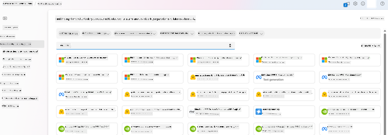
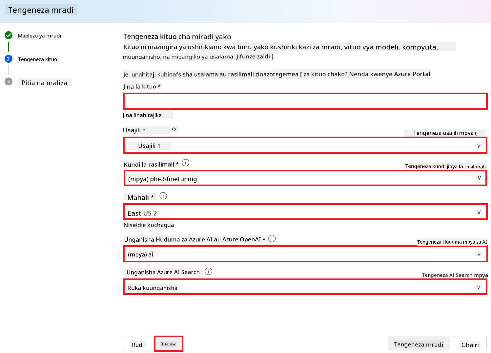
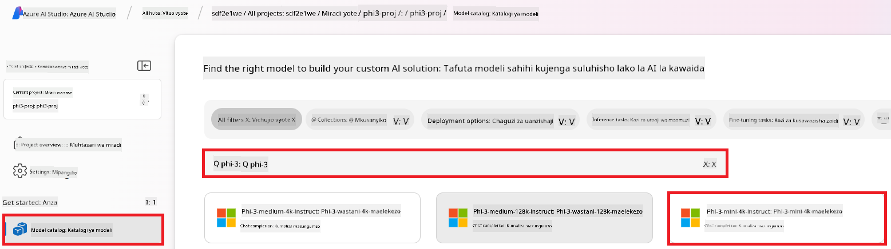
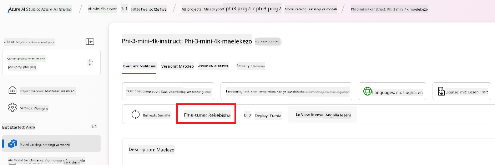
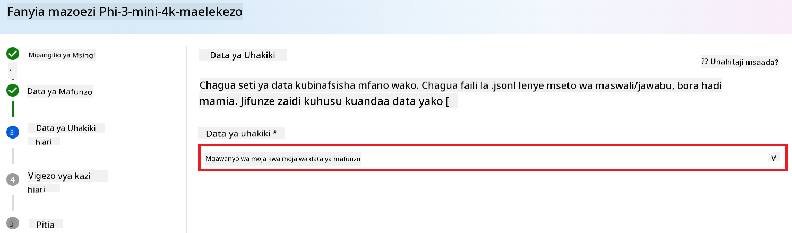
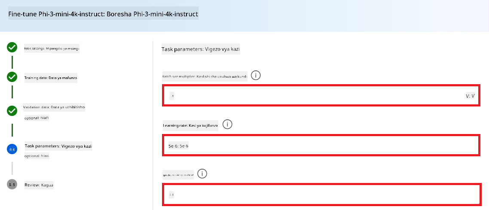
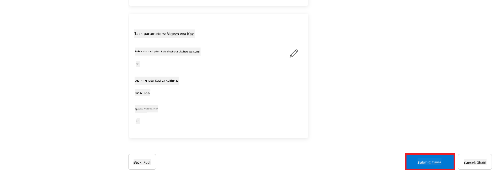
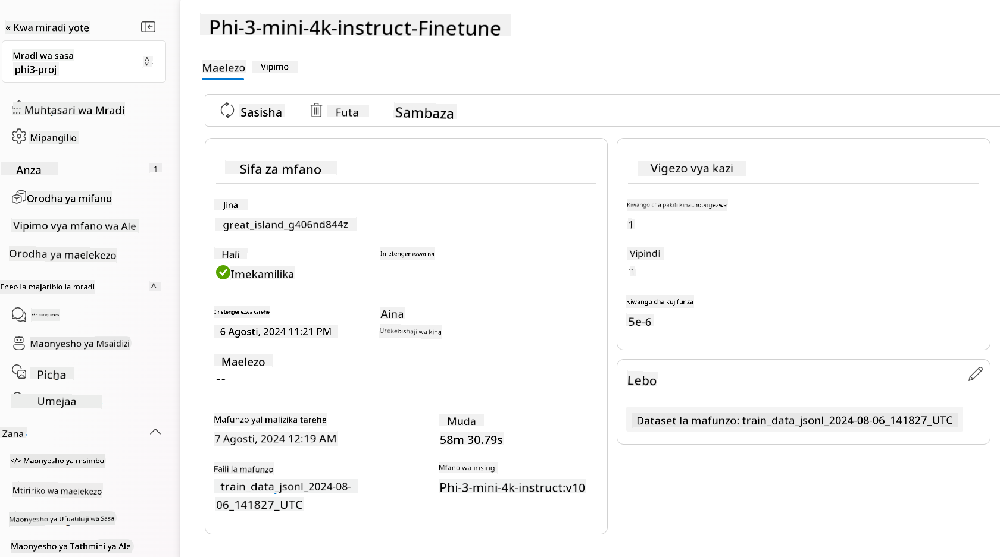

<!--
CO_OP_TRANSLATOR_METADATA:
{
  "original_hash": "c1559c5af6caccf6f623fd43a6b3a9a3",
  "translation_date": "2025-05-09T20:35:42+00:00",
  "source_file": "md/03.FineTuning/FineTuning_AIFoundry.md",
  "language_code": "sw"
}
-->
# Kuongeza ufanisi Phi-3 kwa kutumia Azure AI Foundry

Hebu tuchunguze jinsi ya kuongeza ufanisi wa mfano wa lugha wa Microsoft Phi-3 Mini kwa kutumia Azure AI Foundry. Kuongeza ufanisi kunakuwezesha kubadilisha Phi-3 Mini kwa kazi maalum, kuifanya iwe na nguvu zaidi na kuelewa muktadha vyema.

## Mambo ya kuzingatia

- **Uwezo:** Ni modeli gani zinaweza kuongezwa ufanisi? Mfano msingi unaweza kuongezwa ufanisi kufanya nini?
- **Gharama:** Mfano wa bei ya kuongeza ufanisi ni upi?
- **Urekebishaji:** Naweza kubadilisha kiasi gani mfano msingi – na kwa njia gani?
- **Urahisi:** Kuongeza ufanisi hufanyika vipi – je, nahitaji kuandika msimbo maalum? Je, nahitaji kuleta kompyuta yangu mwenyewe?
- **Usalama:** Modeli zilizoongezwa ufanisi zinajulikana kuwa na hatari za usalama – kuna kinga zozote za kuzuia madhara yasiyotakikana?



## Maandalizi ya kuongeza ufanisi

### Mahitaji ya awali

> [!NOTE]
> Kwa modeli za familia ya Phi-3, ofa ya kuongeza ufanisi kwa malipo kulingana na matumizi inapatikana tu kwa hubs zilizoundwa katika mikoa ya **East US 2**.

- Usajili wa Azure. Ikiwa huna usajili wa Azure, tengeneza [akaunti ya Azure yenye malipo](https://azure.microsoft.com/pricing/purchase-options/pay-as-you-go) kuanza.

- Mradi wa [AI Foundry](https://ai.azure.com?WT.mc_id=aiml-138114-kinfeylo).
- Udhibiti wa ruhusa wa Azure (Azure RBAC) hutumika kutoa ruhusa kwa shughuli katika Azure AI Foundry. Ili kutekeleza hatua katika makala hii, akaunti yako ya mtumiaji lazima iwe na __Azure AI Developer role__ kwenye kundi la rasilimali.

### Usajili wa mtoa huduma wa usajili

Hakikisha usajili umefanywa kwa mtoa huduma wa rasilimali `Microsoft.Network`.

1. Ingia kwenye [Azure portal](https://portal.azure.com).
1. Chagua **Subscriptions** kutoka kwenye menyu ya kushoto.
1. Chagua usajili unaotaka kutumia.
1. Chagua **AI project settings** > **Resource providers** kutoka kwenye menyu ya kushoto.
1. Thibitisha kwamba **Microsoft.Network** ipo kwenye orodha ya watoa huduma wa rasilimali. Vinginevyo, ongeza.

### Maandalizi ya data

Tayarisha data yako ya mafunzo na uthibitishaji ili kuongeza ufanisi wa mfano wako. Seti za data za mafunzo na uthibitishaji zinajumuisha mifano ya ingizo na matokeo unayotaka mfano ufanye.

Hakikisha mifano yote ya mafunzo inafuata muundo unaotarajiwa kwa ajili ya utambuzi. Ili kuongeza ufanisi wa modeli kwa ufanisi, hakikisha dataset ni yenye usawa na aina mbalimbali.

Hii inahusisha kudumisha usawa wa data, kujumuisha hali mbalimbali, na kuboresha mara kwa mara data ya mafunzo ili kuendana na matarajio halisi, na hatimaye kusababisha majibu sahihi na yenye usawa kutoka kwa mfano.

Aina tofauti za modeli zinahitaji muundo tofauti wa data ya mafunzo.

### Kukamilisha mazungumzo

Data ya mafunzo na uthibitishaji unayotumia **lazima** iwe katika muundo wa hati ya JSON Lines (JSONL). Kwa `Phi-3-mini-128k-instruct` dataset ya kuongeza ufanisi lazima iwe katika muundo wa mazungumzo unaotumika na API ya Kukamilisha mazungumzo.

### Mfano wa muundo wa faili

```json
    {"messages": [{"role": "system", "content": "You are an Xbox customer support agent whose primary goal is to help users with issues they are experiencing with their Xbox devices. You are friendly and concise. You only provide factual answers to queries, and do not provide answers that are not related to Xbox."}, {"role": "user", "content": "Is Xbox better than PlayStation?"}, {"role": "assistant", "content": "I apologize, but I cannot provide personal opinions. My primary job is to assist you with any issues related to your Xbox device. Do you have any Xbox-related issues that need addressing?"}]}
    {"messages": [{"role": "system", "content": "You are an Xbox customer support agent whose primary goal is to help users with issues they are experiencing with their Xbox devices. You are friendly and concise. You only provide factual answers to queries, and do not provide answers that are not related to Xbox."}, {"role": "user", "content": "Can I play PC games on my Xbox?"}, {"role": "assistant", "content": "While Xbox consoles don't natively support PC games, they can play an array of Xbox games, many of which are also available on PC. Can I assist you with finding games compatible with your Xbox device?"}]}
    {"messages": [{"role": "system", "content": "You are an Xbox customer support agent whose primary goal is to help users with issues they are experiencing with their Xbox devices. You are friendly and concise. You only provide factual answers to queries, and do not provide answers that are not related to Xbox."}, {"role": "user", "content": "I'm having trouble connecting my Xbox to the Wi-Fi."}, {"role": "assistant", "content": "No worries, let's go through the network settings on your Xbox. Can you please tell me what happens when you try to connect it to the Wi-Fi?"}]}
```

Aina ya faili inayoungwa mkono ni JSON Lines. Faili hupakiwa kwenye hifadhi ya kawaida na kupatikana katika mradi wako.

## Kuongeza ufanisi Phi-3 kwa kutumia Azure AI Foundry

Azure AI Foundry inakuwezesha kubinafsisha modeli kubwa za lugha kwa kutumia seti zako za data kupitia mchakato unaojulikana kama kuongeza ufanisi. Kuongeza ufanisi kunaleta faida kubwa kwa kuwezesha ubinafsishaji na uboreshaji kwa kazi na matumizi maalum. Hii huleta utendaji bora, ufanisi wa gharama, kuchelewesha kidogo, na matokeo yaliyobinafsishwa.


### Tengeneza Mradi Mpya

1. Ingia kwenye [Azure AI Foundry](https://ai.azure.com).

1. Chagua **+New project** kuanzisha mradi mpya katika Azure AI Foundry.

    

1. Fanya kazi zifuatazo:

    - Jina la mradi **Hub name**. Lazima liwe la kipekee.
    - Chagua **Hub** ya kutumia (tengeneza mpya ikiwa inahitajika).

    

1. Fanya kazi zifuatazo kuunda hub mpya:

    - Weka **Hub name**. Lazima liwe la kipekee.
    - Chagua **Subscription** ya Azure.
    - Chagua **Resource group** ya kutumia (tengeneza mpya ikiwa inahitajika).
    - Chagua **Location** unayotaka kutumia.
    - Chagua **Connect Azure AI Services** kutumia (tengeneza mpya ikiwa inahitajika).
    - Chagua **Connect Azure AI Search** kisha **Skip connecting**.

    

1. Chagua **Next**.
1. Chagua **Create a project**.

### Maandalizi ya Data

Kabla ya kuongeza ufanisi, kusanya au tengeneza seti ya data inayohusiana na kazi yako, kama maelekezo ya mazungumzo, maswali na majibu, au aina nyingine yoyote ya data ya maandishi inayofaa. Safisha na andaa data hii kwa kuondoa kelele, kushughulikia thamani zilizokosekana, na kugawanya maneno.

### Ongeza ufanisi wa modeli za Phi-3 katika Azure AI Foundry

> [!NOTE]
> Kuongeza ufanisi kwa modeli za Phi-3 kwa sasa kunasaidiwa katika miradi iliyoko East US 2.

1. Chagua **Model catalog** kutoka kwenye tab ya upande wa kushoto.

1. Andika *phi-3* katika **search bar** na chagua mfano wa phi-3 unayotaka kutumia.

    

1. Chagua **Fine-tune**.

    

1. Weka **Fine-tuned model name**.

    

1. Chagua **Next**.

1. Fanya yafuatayo:

    - Chagua **task type** kuwa **Chat completion**.
    - Chagua **Training data** unayotaka kutumia. Unaweza kuipakia kupitia data ya Azure AI Foundry au kutoka kwa mazingira yako ya ndani.

    

1. Chagua **Next**.

1. Pakia **Validation data** unayotaka kutumia, au unaweza kuchagua **Automatic split of training data**.

    

1. Chagua **Next**.

1. Fanya yafuatayo:

    - Chagua **Batch size multiplier** unayotaka kutumia.
    - Chagua **Learning rate** unayotaka kutumia.
    - Chagua **Epochs** unayotaka kutumia.

    

1. Chagua **Submit** kuanza mchakato wa kuongeza ufanisi.

    


1. Mara mfano wako unapoongezwa ufanisi, hali yake itaonekana kama **Completed**, kama ilivyo kwenye picha hapa chini. Sasa unaweza kupeleka mfano na kuutumia katika programu yako, kwenye playground, au katika prompt flow. Kwa maelezo zaidi, angalia [How to deploy Phi-3 family of small language models with Azure AI Foundry](https://learn.microsoft.com/azure/ai-studio/how-to/deploy-models-phi-3?tabs=phi-3-5&pivots=programming-language-python).

    

> [!NOTE]
> Kwa maelezo zaidi kuhusu kuongeza ufanisi wa Phi-3, tafadhali tembelea [Fine-tune Phi-3 models in Azure AI Foundry](https://learn.microsoft.com/azure/ai-studio/how-to/fine-tune-phi-3?tabs=phi-3-mini).

## Kusafisha modeli zako zilizoongezwa ufanisi

Unaweza kufuta mfano ulioboreshwa kutoka kwenye orodha ya modeli za kuongeza ufanisi katika [Azure AI Foundry](https://ai.azure.com) au kutoka kwenye ukurasa wa maelezo ya mfano. Chagua mfano ulioboreshwa kufuta kutoka ukurasa wa Fine-tuning, kisha chagua kitufe cha Delete kufuta mfano ulioboreshwa.

> [!NOTE]
> Huwezi kufuta mfano uliobinafsishwa ikiwa una uenezaji uliopo. Lazima kwanza ufute uenezaji wa mfano kabla ya kufuta mfano uliobinafsishwa.

## Gharama na vikwazo

### Mambo ya kuzingatia kuhusu gharama na vikwazo kwa modeli za Phi-3 zilizoongezwa ufanisi kama huduma

Modeli za Phi zilizoongezwa ufanisi kama huduma hutolewa na Microsoft na kuunganishwa na Azure AI Foundry kwa matumizi. Unaweza kupata bei wakati wa [kupeleka](https://learn.microsoft.com/azure/ai-studio/how-to/deploy-models-phi-3?tabs=phi-3-5&pivots=programming-language-python) au kuongeza ufanisi wa modeli chini ya kichupo cha Pricing and terms kwenye mtaalamu wa uenezaji.

## Kuchuja maudhui

Modeli zilizotumika kama huduma kwa malipo kulingana na matumizi zinalindwa na Azure AI Content Safety. Zikitumika kwenye vituo vya wakati halisi, unaweza kuchagua kutotumia kipengele hiki. Ukiwa na Azure AI content safety imewezeshwa, maelekezo na majibu hupitia kupitia mchanganyiko wa modeli za upangaji lengo la kugundua na kuzuia maudhui hatarishi. Mfumo wa kuchuja maudhui hugundua na kuchukua hatua kwa makundi maalum ya maudhui yanayoweza kuwa hatari katika maelekezo ya ingizo na majibu ya matokeo. Jifunze zaidi kuhusu [Azure AI Content Safety](https://learn.microsoft.com/azure/ai-studio/concepts/content-filtering).

**Mipangilio ya Kuongeza Ufanisi**

Hyperparameters: Fafanua hyperparameters kama kiwango cha kujifunza, ukubwa wa batch, na idadi ya epochs za mafunzo.

**Kazi ya Hasara**

Chagua kazi ya hasara inayofaa kwa kazi yako (mfano, cross-entropy).

**Optimizer**

Chagua optimizer (mfano, Adam) kwa masasisho ya gradient wakati wa mafunzo.

**Mchakato wa Kuongeza Ufanisi**

- Pakua Mfano Uliofunzwa Awali: Pakua checkpoint ya Phi-3 Mini.
- Ongeza Tabaka Maalum: Ongeza tabaka maalum kwa kazi (mfano, kichwa cha uainishaji kwa maelekezo ya mazungumzo).

**Fanya Mafunzo kwa Mfano**
Ongeza ufanisi wa mfano kwa kutumia dataset uliyoandaa. Fuata maendeleo ya mafunzo na rekebisha hyperparameters inapohitajika.

**Tathmini na Uthibitishaji**

Seti ya Uthibitishaji: Gawanya data yako kuwa seti za mafunzo na uthibitishaji.

**Tathmini Utendaji**

Tumia vipimo kama usahihi, F1-score, au perplexity kutathmini utendaji wa mfano.

## Hifadhi Mfano Ulioboreshwa

**Checkpoint**
Hifadhi checkpoint ya mfano ulioboreshwa kwa matumizi ya baadaye.

## Uenezaji

- Peleka kama Huduma ya Wavuti: Peleka mfano ulioboreshwa kama huduma ya wavuti katika Azure AI Foundry.
- Jaribu Kituo: Tuma maswali ya majaribio kwenye kituo kilichopelekwa ili kuthibitisha utendaji wake.

## Rudia na Boresha

Rudia: Ikiwa utendaji haujakidhi matarajio, rudia kwa kurekebisha hyperparameters, kuongeza data zaidi, au kuongeza mafunzo kwa epochs zaidi.

## Fuata na Boresha

Endelea kufuatilia tabia ya mfano na uboreshe inapohitajika.

## Binafsisha na Panua

Kazi Maalum: Phi-3 Mini inaweza kuongezwa ufanisi kwa kazi mbalimbali zaidi ya maelekezo ya mazungumzo. Chunguza matumizi mengine!
Jaribu: Jaribu usanifu tofauti, mchanganyiko wa tabaka, na mbinu za kuboresha utendaji.

> [!NOTE]
> Kuongeza ufanisi ni mchakato unaorudiwa. Jaribu, jifunze, na badilisha mfano wako kufikia matokeo bora kwa kazi yako maalum!

**Kiasi cha majibu**:  
Hati hii imetafsiriwa kwa kutumia huduma ya tafsiri ya AI [Co-op Translator](https://github.com/Azure/co-op-translator). Ingawa tunajitahidi kuhakikisha usahihi, tafadhali fahamu kuwa tafsiri za moja kwa moja zinaweza kuwa na makosa au upungufu wa usahihi. Hati asili katika lugha yake ya asili inapaswa kuchukuliwa kama chanzo cha mamlaka. Kwa taarifa muhimu, tafsiri ya kitaalamu inayofanywa na binadamu inashauriwa. Hatutawajibika kwa kutoelewana au tafsiri zisizo sahihi zinazotokana na matumizi ya tafsiri hii.