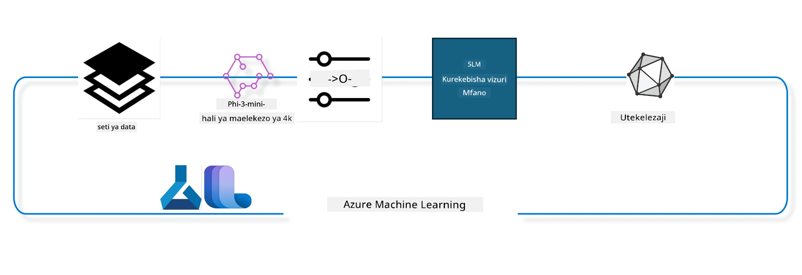

## Jinsi ya kutumia vipengele vya chat-completion kutoka kwenye rejista ya mfumo wa Azure ML kufanyia modeli marekebisho

Katika mfano huu tutafanya marekebisho ya modeli ya Phi-3-mini-4k-instruct ili kumalizia mazungumzo kati ya watu 2 tukitumia dataset ya ultrachat_200k.



Mfano huu utaonyesha jinsi ya kufanya marekebisho kwa kutumia Azure ML SDK na Python kisha kupeleka modeli iliyorekebishwa kwenye endpoint mtandaoni kwa ajili ya utambuzi wa wakati halisi.

### Data ya Mafunzo

Tutatumia dataset ya ultrachat_200k. Hii ni toleo lililosafishwa sana la dataset ya UltraChat na ilitumika kufundisha Zephyr-7B-β, modeli ya mazungumzo ya hali ya juu yenye ukubwa wa 7b.

### Modeli

Tutatumia modeli ya Phi-3-mini-4k-instruct kuonyesha jinsi mtumiaji anavyoweza kufanya marekebisho ya modeli kwa kazi ya chat-completion. Ikiwa umefungua daftari hili kutoka kwenye kadi ya modeli maalum, kumbuka kubadilisha jina la modeli husika.

### Kazi

- Chagua modeli ya kurekebisha.
- Chagua na chunguza data ya mafunzo.
- Sanidi kazi ya marekebisho.
- Endesha kazi ya marekebisho.
- Pitia vipimo vya mafunzo na tathmini.
- Sajili modeli iliyorekebishwa.
- Peleka modeli iliyorekebishwa kwa utambuzi wa wakati halisi.
- Safisha rasilimali.

## 1. Andaa mahitaji ya awali

- Sakinisha utegemezi
- Unganisha na AzureML Workspace. Jifunze zaidi kuhusu kusanidi uthibitishaji wa SDK. Badilisha <WORKSPACE_NAME>, <RESOURCE_GROUP> na <SUBSCRIPTION_ID> hapa chini.
- Unganisha na rejista ya mfumo ya azureml
- Weka jina la jaribio kama hiari
- Angalia au tengeneza compute.

> [!NOTE]
> Mahitaji ni node moja ya GPU inaweza kuwa na kadi nyingi za GPU. Kwa mfano, katika node moja ya Standard_NC24rs_v3 kuna GPUs 4 za NVIDIA V100 wakati katika Standard_NC12s_v3, kuna GPUs 2 za NVIDIA V100. Rejelea nyaraka kwa taarifa hii. Idadi ya kadi za GPU kwa node imewekwa katika param gpus_per_node hapa chini. Kuweka thamani hii kwa usahihi kutahakikisha matumizi ya GPUs zote kwenye node. SKU za GPU compute zinazopendekezwa zinaweza kupatikana hapa na hapa.

### Maktaba za Python

Sakinisha utegemezi kwa kuendesha seli ifuatayo. Huu si hatua ya hiari ikiwa unafanya kazi katika mazingira mapya.

```bash
pip install azure-ai-ml
pip install azure-identity
pip install datasets==2.9.0
pip install mlflow
pip install azureml-mlflow
```

### Kuingiliana na Azure ML

1. Skripti hii ya Python inatumika kuingiliana na huduma ya Azure Machine Learning (Azure ML). Hapa kuna muhtasari wa inavyofanya:

    - Inaingiza moduli muhimu kutoka kwa azure.ai.ml, azure.identity, na azure.ai.ml.entities. Pia inaingiza moduli ya time.

    - Inajaribu kuthibitisha kwa kutumia DefaultAzureCredential(), ambayo hutoa uzoefu rahisi wa uthibitishaji kuanza haraka kuendeleza programu zinazotumia Azure cloud. Ikiwa hii itashindwa, inarudi kwa InteractiveBrowserCredential(), ambayo hutoa kiolesura cha kuingia kwa njia ya kivinjari.

    - Kisha inajaribu kuunda mfano wa MLClient kwa kutumia njia ya from_config, ambayo husoma usanidi kutoka kwa faili ya default config.json. Ikiwa hii itashindwa, huunda MLClient kwa kutoa subscription_id, resource_group_name, na workspace_name kwa mkono.

    - Inaunda mfano mwingine wa MLClient, wakati huu kwa rejista ya Azure ML iitwayo "azureml". Rejista hii ni mahali ambapo modeli, njia za marekebisho, na mazingira huhifadhiwa.

    - Inaweka jina la jaribio kuwa "chat_completion_Phi-3-mini-4k-instruct".

    - Inazalisha alama ya wakati ya kipekee kwa kubadilisha wakati wa sasa (kwa sekunde tangu epoch, kama nambari ya desimali) kuwa nambari kamili kisha kuwa mfuatano wa herufi. Alama hii ya wakati inaweza kutumika kuunda majina na matoleo ya kipekee.

    ```python
    # Import necessary modules from Azure ML and Azure Identity
    from azure.ai.ml import MLClient
    from azure.identity import (
        DefaultAzureCredential,
        InteractiveBrowserCredential,
    )
    from azure.ai.ml.entities import AmlCompute
    import time  # Import time module
    
    # Try to authenticate using DefaultAzureCredential
    try:
        credential = DefaultAzureCredential()
        credential.get_token("https://management.azure.com/.default")
    except Exception as ex:  # If DefaultAzureCredential fails, use InteractiveBrowserCredential
        credential = InteractiveBrowserCredential()
    
    # Try to create an MLClient instance using the default config file
    try:
        workspace_ml_client = MLClient.from_config(credential=credential)
    except:  # If that fails, create an MLClient instance by manually providing the details
        workspace_ml_client = MLClient(
            credential,
            subscription_id="<SUBSCRIPTION_ID>",
            resource_group_name="<RESOURCE_GROUP>",
            workspace_name="<WORKSPACE_NAME>",
        )
    
    # Create another MLClient instance for the Azure ML registry named "azureml"
    # This registry is where models, fine-tuning pipelines, and environments are stored
    registry_ml_client = MLClient(credential, registry_name="azureml")
    
    # Set the experiment name
    experiment_name = "chat_completion_Phi-3-mini-4k-instruct"
    
    # Generate a unique timestamp that can be used for names and versions that need to be unique
    timestamp = str(int(time.time()))
    ```

## 2. Chagua modeli ya msingi ya kurekebisha

1. Phi-3-mini-4k-instruct ni modeli nyepesi yenye vigezo 3.8B, ya kisasa iliyojengwa kwa kutumia datasets zilizotumika kwa Phi-2. Modeli hii ni sehemu ya familia ya modeli za Phi-3, na toleo la Mini linakuja katika aina mbili 4K na 128K ambazo ni urefu wa muktadha (kwa tokeni) unaoweza kuunga mkono, tunahitaji kurekebisha modeli kwa madhumuni yetu maalum ili kuitumia. Unaweza kuvinjari modeli hizi katika Katalogi ya Modeli katika AzureML Studio, ukichuja kwa kazi ya chat-completion. Katika mfano huu, tunatumia modeli ya Phi-3-mini-4k-instruct. Ikiwa umefungua daftari hili kwa modeli tofauti, badilisha jina la modeli na toleo ipasavyo.

    > [!NOTE]
    > sifa ya kitambulisho cha modeli. Hii itapitishwa kama ingizo kwa kazi ya marekebisho. Pia inapatikana kama sehemu ya Asset ID kwenye ukurasa wa maelezo ya modeli katika Katalogi ya Modeli ya AzureML Studio.

2. Skripti hii ya Python inaingiliana na huduma ya Azure Machine Learning (Azure ML). Hapa kuna muhtasari wa inavyofanya:

    - Inaweka model_name kuwa "Phi-3-mini-4k-instruct".

    - Inatumia njia ya get ya mali ya models ya kitu registry_ml_client kupata toleo la hivi karibuni la modeli yenye jina lililotajwa kutoka kwenye rejista ya Azure ML. Njia ya get inaitwa kwa hoja mbili: jina la modeli na lebo inayosema toleo la hivi karibuni la modeli linapaswa kupatikana.

    - Inachapisha ujumbe kwenye console unaoonyesha jina, toleo, na kitambulisho cha modeli itakayotumika kwa marekebisho. Njia ya format ya mfuatano wa herufi hutumika kuingiza jina, toleo, na kitambulisho cha modeli kwenye ujumbe. Jina, toleo, na kitambulisho cha modeli vinapatikana kama mali za kitu foundation_model.

    ```python
    # Set the model name
    model_name = "Phi-3-mini-4k-instruct"
    
    # Get the latest version of the model from the Azure ML registry
    foundation_model = registry_ml_client.models.get(model_name, label="latest")
    
    # Print the model name, version, and id
    # This information is useful for tracking and debugging
    print(
        "\n\nUsing model name: {0}, version: {1}, id: {2} for fine tuning".format(
            foundation_model.name, foundation_model.version, foundation_model.id
        )
    )
    ```

## 3. Tengeneza compute itakayotumika kwa kazi

Kazi ya finetune inafanya kazi TU na compute ya GPU. Ukubwa wa compute unategemea ukubwa wa modeli na mara nyingi huwa vigumu kubaini compute sahihi kwa kazi. Katika seli hii, tunaelekeza mtumiaji kuchagua compute sahihi kwa kazi.

> [!NOTE]
> Compute zilizoorodheshwa hapa chini zinafanya kazi kwa usanidi ulioboreshwa zaidi. Mabadiliko yoyote kwenye usanidi yanaweza kusababisha kosa la Cuda Out Of Memory. Katika hali kama hizo, jaribu kuboresha compute hadi ukubwa mkubwa zaidi.

> [!NOTE]
> Wakati wa kuchagua compute_cluster_size hapa chini, hakikisha compute inapatikana katika resource group yako. Ikiwa compute fulani haipatikani unaweza kuomba ruhusa ya kupata rasilimali za compute.

### Kukagua Modeli kwa Msaada wa Marekebisho

1. Skripti hii ya Python inaingiliana na modeli ya Azure Machine Learning (Azure ML). Hapa kuna muhtasari wa inavyofanya:

    - Inaingiza moduli ya ast, ambayo hutoa kazi za kuchakata miti ya sarufi ya Python.

    - Inakagua kama kitu foundation_model (kinachoonyesha modeli katika Azure ML) kina lebo iitwayo finetune_compute_allow_list. Lebo katika Azure ML ni jozi za funguo na thamani unazoweza kuunda na kutumia kuchuja na kupanga modeli.

    - Ikiwa lebo ya finetune_compute_allow_list ipo, inatumia ast.literal_eval kwa usalama kuchambua thamani ya lebo (mfuatano wa herufi) kuwa orodha ya Python. Orodha hii kisha inahifadhiwa kwenye variable computes_allow_list. Kisha inachapisha ujumbe unaoonyesha compute inapaswa kuundwa kutoka kwenye orodha hiyo.

    - Ikiwa lebo ya finetune_compute_allow_list haipo, inaweka computes_allow_list kuwa None na inachapisha ujumbe unaoonyesha lebo hiyo si sehemu ya lebo za modeli.

    - Kwa muhtasari, skripti hii inakagua lebo maalum katika metadata ya modeli, kubadilisha thamani ya lebo kuwa orodha ikiwa ipo, na kutoa mrejesho kwa mtumiaji ipasavyo.

    ```python
    # Import the ast module, which provides functions to process trees of the Python abstract syntax grammar
    import ast
    
    # Check if the 'finetune_compute_allow_list' tag is present in the model's tags
    if "finetune_compute_allow_list" in foundation_model.tags:
        # If the tag is present, use ast.literal_eval to safely parse the tag's value (a string) into a Python list
        computes_allow_list = ast.literal_eval(
            foundation_model.tags["finetune_compute_allow_list"]
        )  # convert string to python list
        # Print a message indicating that a compute should be created from the list
        print(f"Please create a compute from the above list - {computes_allow_list}")
    else:
        # If the tag is not present, set computes_allow_list to None
        computes_allow_list = None
        # Print a message indicating that the 'finetune_compute_allow_list' tag is not part of the model's tags
        print("`finetune_compute_allow_list` is not part of model tags")
    ```

### Kukagua Compute Instance

1. Skripti hii ya Python inaingiliana na huduma ya Azure Machine Learning (Azure ML) na kufanya ukaguzi kadhaa kwenye compute instance. Hapa kuna muhtasari wa inavyofanya:

    - Inajaribu kupata compute instance yenye jina lililohifadhiwa katika compute_cluster kutoka kwa Azure ML workspace. Ikiwa hali ya utoaji wa compute instance ni "failed", inatoa ValueError.

    - Inakagua kama computes_allow_list si None. Ikiwa siyo, hubadilisha ukubwa wote wa compute kwenye orodha kuwa herufi ndogo na kuangalia kama ukubwa wa compute instance ya sasa uko kwenye orodha. Ikiwa siyo, inatoa ValueError.

    - Ikiwa computes_allow_list ni None, inakagua kama ukubwa wa compute instance uko kwenye orodha ya ukubwa wa VM za GPU zisizotegemewa. Ikiwa uko, inatoa ValueError.

    - Inapata orodha ya ukubwa wote wa compute zinazopatikana katika workspace. Kisha inazizunguka orodha hii, na kwa kila ukubwa wa compute, inakagua kama jina lake linafanana na ukubwa wa compute instance ya sasa. Ikiwa linafanana, inapata idadi ya GPUs kwa ukubwa huo wa compute na kuweka gpu_count_found kuwa True.

    - Ikiwa gpu_count_found ni True, inachapisha idadi ya GPUs katika compute instance. Ikiwa ni False, inatoa ValueError.

    - Kwa muhtasari, skripti hii inafanya ukaguzi kadhaa kwenye compute instance katika Azure ML workspace, ikiwa ni pamoja na hali ya utoaji wake, ukubwa wake dhidi ya orodha ya kuruhusiwa au orodha ya marufuku, na idadi ya GPUs anazomiliki.

    ```python
    # Print the exception message
    print(e)
    # Raise a ValueError if the compute size is not available in the workspace
    raise ValueError(
        f"WARNING! Compute size {compute_cluster_size} not available in workspace"
    )
    
    # Retrieve the compute instance from the Azure ML workspace
    compute = workspace_ml_client.compute.get(compute_cluster)
    # Check if the provisioning state of the compute instance is "failed"
    if compute.provisioning_state.lower() == "failed":
        # Raise a ValueError if the provisioning state is "failed"
        raise ValueError(
            f"Provisioning failed, Compute '{compute_cluster}' is in failed state. "
            f"please try creating a different compute"
        )
    
    # Check if computes_allow_list is not None
    if computes_allow_list is not None:
        # Convert all compute sizes in computes_allow_list to lowercase
        computes_allow_list_lower_case = [x.lower() for x in computes_allow_list]
        # Check if the size of the compute instance is in computes_allow_list_lower_case
        if compute.size.lower() not in computes_allow_list_lower_case:
            # Raise a ValueError if the size of the compute instance is not in computes_allow_list_lower_case
            raise ValueError(
                f"VM size {compute.size} is not in the allow-listed computes for finetuning"
            )
    else:
        # Define a list of unsupported GPU VM sizes
        unsupported_gpu_vm_list = [
            "standard_nc6",
            "standard_nc12",
            "standard_nc24",
            "standard_nc24r",
        ]
        # Check if the size of the compute instance is in unsupported_gpu_vm_list
        if compute.size.lower() in unsupported_gpu_vm_list:
            # Raise a ValueError if the size of the compute instance is in unsupported_gpu_vm_list
            raise ValueError(
                f"VM size {compute.size} is currently not supported for finetuning"
            )
    
    # Initialize a flag to check if the number of GPUs in the compute instance has been found
    gpu_count_found = False
    # Retrieve a list of all available compute sizes in the workspace
    workspace_compute_sku_list = workspace_ml_client.compute.list_sizes()
    available_sku_sizes = []
    # Iterate over the list of available compute sizes
    for compute_sku in workspace_compute_sku_list:
        available_sku_sizes.append(compute_sku.name)
        # Check if the name of the compute size matches the size of the compute instance
        if compute_sku.name.lower() == compute.size.lower():
            # If it does, retrieve the number of GPUs for that compute size and set gpu_count_found to True
            gpus_per_node = compute_sku.gpus
            gpu_count_found = True
    # If gpu_count_found is True, print the number of GPUs in the compute instance
    if gpu_count_found:
        print(f"Number of GPU's in compute {compute.size}: {gpus_per_node}")
    else:
        # If gpu_count_found is False, raise a ValueError
        raise ValueError(
            f"Number of GPU's in compute {compute.size} not found. Available skus are: {available_sku_sizes}."
            f"This should not happen. Please check the selected compute cluster: {compute_cluster} and try again."
        )
    ```

## 4. Chagua dataset kwa ajili ya kurekebisha modeli

1. Tunatumia dataset ya ultrachat_200k. Dataset ina mgawanyo nne, unaofaa kwa Supervised fine-tuning (sft).
Uainishaji wa kizazi (gen). Idadi ya mifano kwa kila mgawanyo inaonyeshwa kama ifuatavyo:

    ```bash
    train_sft test_sft  train_gen  test_gen
    207865  23110  256032  28304
    ```

1. Selifu chache zinazofuata zinaonyesha maandalizi ya msingi ya data kwa ajili ya marekebisho:

### Onyesha baadhi ya mistari ya data

Tunataka sampuli hii iendeshe haraka, hivyo hifadhi faili za train_sft, test_sft zenye asilimia 5 ya mistari iliyosagwa tayari. Hii inamaanisha modeli iliyorekebishwa itakuwa na usahihi mdogo, kwa hivyo haipaswi kutumika kwa matumizi halisi.
download-dataset.py hutumika kupakua dataset ya ultrachat_200k na kubadilisha dataset kuwa muundo unaoweza kutumiwa na sehemu ya pipeline ya finetune. Pia kwa kuwa dataset ni kubwa, hapa tunayo sehemu tu ya dataset.

1. Kuendesha skripti ifuatayo kunapakua asilimia 5 tu ya data. Hii inaweza kuongezwa kwa kubadilisha parameter ya dataset_split_pc hadi asilimia inayotakiwa.

    > [!NOTE]
    > Baadhi ya modeli za lugha zina misimbo tofauti ya lugha na kwa hivyo majina ya safu katika dataset yanapaswa kuakisi hayo.

1. Hapa kuna mfano wa jinsi data inavyopaswa kuonekana
Dataset ya chat-completion imehifadhiwa kwa muundo wa parquet na kila rekodi ikifuata muundo ufuatao:

    - Huu ni hati ya JSON (JavaScript Object Notation), ambayo ni muundo maarufu wa kubadilishana data. Sio msimbo unaotekelezwa, bali ni njia ya kuhifadhi na kusafirisha data. Hapa kuna muhtasari wa muundo wake:

    - "prompt": Hii ni funguo inayoshikilia thamani ya mfuatano wa herufi unaowakilisha kazi au swali lililotolewa kwa msaidizi wa AI.

    - "messages": Hii ni funguo inayoshikilia safu ya vitu. Kila kitu kinawakilisha ujumbe katika mazungumzo kati ya mtumiaji na msaidizi wa AI. Kila kitu cha ujumbe kina funguo mbili:

    - "content": Funguo hii ina thamani ya mfuatano wa herufi unaowakilisha maudhui ya ujumbe.
    - "role": Funguo hii ina thamani ya mfuatano wa herufi unaowakilisha nafasi ya mhusika aliyemtuma ujumbe. Inaweza kuwa "user" au "assistant".
    - "prompt_id": Funguo hii ina thamani ya mfuatano wa herufi unaowakilisha kitambulisho cha kipekee cha prompt.

1. Katika hati hii maalum ya JSON, mazungumzo yanaonyeshwa ambapo mtumiaji anaomba msaidizi wa AI kuunda mhusika mkuu wa hadithi ya hali mbaya. Msaidizi anajibu, na mtumiaji kisha anaomba maelezo zaidi. Msaidizi anakubali kutoa maelezo zaidi. Mazungumzo yote yanahusishwa na kitambulisho maalum cha prompt.

    ```python
    {
        // The task or question posed to an AI assistant
        "prompt": "Create a fully-developed protagonist who is challenged to survive within a dystopian society under the rule of a tyrant. ...",
        
        // An array of objects, each representing a message in a conversation between a user and an AI assistant
        "messages":[
            {
                // The content of the user's message
                "content": "Create a fully-developed protagonist who is challenged to survive within a dystopian society under the rule of a tyrant. ...",
                // The role of the entity that sent the message
                "role": "user"
            },
            {
                // The content of the assistant's message
                "content": "Name: Ava\n\n Ava was just 16 years old when the world as she knew it came crashing down. The government had collapsed, leaving behind a chaotic and lawless society. ...",
                // The role of the entity that sent the message
                "role": "assistant"
            },
            {
                // The content of the user's message
                "content": "Wow, Ava's story is so intense and inspiring! Can you provide me with more details.  ...",
                // The role of the entity that sent the message
                "role": "user"
            }, 
            {
                // The content of the assistant's message
                "content": "Certainly! ....",
                // The role of the entity that sent the message
                "role": "assistant"
            }
        ],
        
        // A unique identifier for the prompt
        "prompt_id": "d938b65dfe31f05f80eb8572964c6673eddbd68eff3db6bd234d7f1e3b86c2af"
    }
    ```

### Pakua Data

1. Skripti hii ya Python hutumika kupakua dataset kwa kutumia skripti msaidizi iitwayo download-dataset.py. Hapa kuna muhtasari wa inavyofanya:

    - Inaingiza moduli ya os, ambayo hutoa njia ya kutumia vipengele vinavyotegemea mfumo wa uendeshaji.

    - Inatumia os.system kuendesha skripti ya download-dataset.py kwenye shell na hoja maalum za mstari wa amri. Hoja hizi zinaelezea dataset ya kupakua (HuggingFaceH4/ultrachat_200k), saraka ya kupakulia (ultrachat_200k_dataset), na asilimia ya dataset kugawanywa (5). os.system hurudisha hali ya kutoka ya amri iliyotekelezwa; hali hii huhifadhiwa kwenye variable exit_status.

    - Inakagua kama exit_status si 0. Katika mifumo ya uendeshaji kama Unix, hali ya kutoka 0 kawaida inaonyesha amri imefanikiwa, wakati nambari nyingine yoyote inaonyesha kosa. Ikiwa exit_status si 0, inatoa Exception yenye ujumbe unaoonyesha kulikuwa na kosa la kupakua dataset.

    - Kwa muhtasari, skripti hii inaendesha amri ya kupakua dataset kwa kutumia skripti msaidizi, na inatoa kosa ikiwa amri itashindwa.

    ```python
    # Import the os module, which provides a way of using operating system dependent functionality
    import os
    
    # Use the os.system function to run the download-dataset.py script in the shell with specific command-line arguments
    # The arguments specify the dataset to download (HuggingFaceH4/ultrachat_200k), the directory to download it to (ultrachat_200k_dataset), and the percentage of the dataset to split (5)
    # The os.system function returns the exit status of the command it executed; this status is stored in the exit_status variable
    exit_status = os.system(
        "python ./download-dataset.py --dataset HuggingFaceH4/ultrachat_200k --download_dir ultrachat_200k_dataset --dataset_split_pc 5"
    )
    
    # Check if exit_status is not 0
    # In Unix-like operating systems, an exit status of 0 usually indicates that a command has succeeded, while any other number indicates an error
    # If exit_status is not 0, raise an Exception with a message indicating that there was an error downloading the dataset
    if exit_status != 0:
        raise Exception("Error downloading dataset")
    ```

### Kupakia Data katika DataFrame

1. Skripti hii ya Python inapakia faili ya JSON Lines katika DataFrame ya pandas na kuonyesha mistari 5 ya kwanza. Hapa kuna muhtasari wa inavyofanya:

    - Inaingiza maktaba ya pandas, ambayo ni maktaba yenye nguvu ya usindikaji na uchambuzi wa data.

    - Inaweka upana wa safu wa juu kabisa kwa chaguo la maonyesho ya pandas kuwa 0. Hii inamaanisha maandishi kamili ya kila safu yataonyeshwa bila kukatwa wakati DataFrame itakapochapishwa. 

    - Inatumia pd.read_json kupakia faili ya train_sft.jsonl kutoka saraka ya ultrachat_200k_dataset katika DataFrame. Hoja lines=True inaonyesha faili ni katika muundo wa JSON Lines, ambapo kila mstari ni kitu tofauti cha JSON.
- Inatumia njia ya head kuonyesha mistari 5 ya kwanza ya DataFrame. Ikiwa DataFrame ina mistari chini ya 5, itaonyesha yote.

- Kwa muhtasari, script hii inapakia faili la JSON Lines ndani ya DataFrame na kuonyesha mistari 5 ya kwanza ikiwa na maandishi kamili ya safu.

```python
    # Import the pandas library, which is a powerful data manipulation and analysis library
    import pandas as pd
    
    # Set the maximum column width for pandas' display options to 0
    # This means that the full text of each column will be displayed without truncation when the DataFrame is printed
    pd.set_option("display.max_colwidth", 0)
    
    # Use the pd.read_json function to load the train_sft.jsonl file from the ultrachat_200k_dataset directory into a DataFrame
    # The lines=True argument indicates that the file is in JSON Lines format, where each line is a separate JSON object
    df = pd.read_json("./ultrachat_200k_dataset/train_sft.jsonl", lines=True)
    
    # Use the head method to display the first 5 rows of the DataFrame
    # If the DataFrame has less than 5 rows, it will display all of them
    df.head()
    ```

## 5. Tuma kazi ya fine tuning ukitumia modeli na data kama ingizo

Tengeneza kazi inayotumia sehemu ya pipeline ya chat-completion. Jifunze zaidi kuhusu vigezo vyote vinavyounga mkono fine tuning.

### Eleza vigezo vya finetune

1. Vigezo vya finetune vinaweza kugawanywa katika makundi 2 - vigezo vya mafunzo, vigezo vya uboreshaji

1. Vigezo vya mafunzo vinaeleza mambo ya mafunzo kama vile -

    - Optimizer, scheduler ya kutumia
    - Kipimo cha kuboresha finetune
    - Idadi ya hatua za mafunzo na ukubwa wa batch n.k.
    - Vigezo vya uboreshaji husaidia kuboresha matumizi ya kumbukumbu ya GPU na kutumia rasilimali za kompyuta kwa ufanisi.

1. Hapa chini ni baadhi ya vigezo vinavyohusiana na kundi hili. Vigezo vya uboreshaji hutofautiana kwa kila modeli na vimefungwa pamoja na modeli kushughulikia tofauti hizi.

    - Washa deepspeed na LoRA
    - Washa mafunzo ya mchanganyiko wa usahihi (mixed precision training)
    - Washa mafunzo ya multi-node

> [!NOTE]
> Supervised finetuning inaweza kusababisha kupoteza mlingano au kusahau kwa ghafla. Tunapendekeza kuangalia tatizo hili na kuendesha hatua ya mlingano baada ya finetune.

### Vigezo vya Fine Tuning

1. Script hii ya Python inaweka vigezo vya fine-tuning kwa modeli ya mashine ya kujifunza. Hapa kuna muhtasari wa inavyofanya:

    - Inaweka vigezo vya mafunzo vya msingi kama vile idadi ya epochs za mafunzo, ukubwa wa batch kwa mafunzo na tathmini, kiwango cha kujifunza, na aina ya scheduler ya kiwango cha kujifunza.

    - Inaweka vigezo vya msingi vya uboreshaji kama vile kama Layer-wise Relevance Propagation (LoRa) na DeepSpeed zitumike, na hatua ya DeepSpeed.

    - Inachanganya vigezo vya mafunzo na uboreshaji katika kamusi moja iitwayo finetune_parameters.

    - Inakagua kama foundation_model ina vigezo vya msingi maalum vya modeli. Ikiwa ipo, inachapisha ujumbe wa onyo na kusasisha kamusi ya finetune_parameters na vigezo hivi maalum. Kazi ya ast.literal_eval hutumika kubadilisha vigezo maalum kutoka kwenye string hadi kamusi ya Python.

    - Inachapisha seti ya mwisho ya vigezo vya fine-tuning vitakavyotumika kwa utekelezaji.

    - Kwa muhtasari, script hii inaandaa na kuonyesha vigezo vya fine-tuning kwa modeli ya mashine ya kujifunza, na uwezo wa kubadilisha vigezo vya msingi na vya modeli maalum.

```python
    # Set up default training parameters such as the number of training epochs, batch sizes for training and evaluation, learning rate, and learning rate scheduler type
    training_parameters = dict(
        num_train_epochs=3,
        per_device_train_batch_size=1,
        per_device_eval_batch_size=1,
        learning_rate=5e-6,
        lr_scheduler_type="cosine",
    )
    
    # Set up default optimization parameters such as whether to apply Layer-wise Relevance Propagation (LoRa) and DeepSpeed, and the DeepSpeed stage
    optimization_parameters = dict(
        apply_lora="true",
        apply_deepspeed="true",
        deepspeed_stage=2,
    )
    
    # Combine the training and optimization parameters into a single dictionary called finetune_parameters
    finetune_parameters = {**training_parameters, **optimization_parameters}
    
    # Check if the foundation_model has any model-specific default parameters
    # If it does, print a warning message and update the finetune_parameters dictionary with these model-specific defaults
    # The ast.literal_eval function is used to convert the model-specific defaults from a string to a Python dictionary
    if "model_specific_defaults" in foundation_model.tags:
        print("Warning! Model specific defaults exist. The defaults could be overridden.")
        finetune_parameters.update(
            ast.literal_eval(  # convert string to python dict
                foundation_model.tags["model_specific_defaults"]
            )
        )
    
    # Print the final set of fine-tuning parameters that will be used for the run
    print(
        f"The following finetune parameters are going to be set for the run: {finetune_parameters}"
    )
    ```

### Pipeline ya Mafunzo

1. Script hii ya Python inaeleza kazi ya kuunda jina la kuonyesha kwa pipeline ya mafunzo ya mashine ya kujifunza, kisha inaita kazi hii kuunda na kuchapisha jina hilo. Hapa kuna muhtasari wa inavyofanya:

1. Kazi get_pipeline_display_name imefafanuliwa. Kazi hii huunda jina la kuonyesha kulingana na vigezo mbalimbali vinavyohusiana na pipeline ya mafunzo.

1. Ndani ya kazi, inahesabu jumla ya ukubwa wa batch kwa kuzidisha ukubwa wa batch kwa kifaa, idadi ya hatua za mkusanyiko wa gradient, idadi ya GPUs kwa node, na idadi ya nodes zinazotumika kwa fine-tuning.

1. Inapata vigezo vingine kama aina ya scheduler ya kiwango cha kujifunza, kama DeepSpeed inatumika, hatua ya DeepSpeed, kama Layer-wise Relevance Propagation (LoRa) inatumika, kikomo cha idadi ya checkpoints za modeli kuhifadhiwa, na urefu wa mfuatano wa juu kabisa.

1. Inaunda mfuatano wa maneno unaojumuisha vigezo hivi vyote, vimegawanywa kwa alama za msalaba. Ikiwa DeepSpeed au LoRa inatumika, mfuatano unajumuisha "ds" ikifuatiwa na hatua ya DeepSpeed, au "lora", mtawalia. Ikiwa si hivyo, unajumuisha "nods" au "nolora", mtawalia.

1. Kazi inarudisha mfuatano huu, ambao hutumika kama jina la kuonyesha kwa pipeline ya mafunzo.

1. Baada ya kazi kufafanuliwa, inaitwa kuunda jina la kuonyesha, ambalo linachapishwa.

1. Kwa muhtasari, script hii inaunda jina la kuonyesha kwa pipeline ya mafunzo ya mashine ya kujifunza kulingana na vigezo mbalimbali, kisha inachapisha jina hilo.

```python
    # Define a function to generate a display name for the training pipeline
    def get_pipeline_display_name():
        # Calculate the total batch size by multiplying the per-device batch size, the number of gradient accumulation steps, the number of GPUs per node, and the number of nodes used for fine-tuning
        batch_size = (
            int(finetune_parameters.get("per_device_train_batch_size", 1))
            * int(finetune_parameters.get("gradient_accumulation_steps", 1))
            * int(gpus_per_node)
            * int(finetune_parameters.get("num_nodes_finetune", 1))
        )
        # Retrieve the learning rate scheduler type
        scheduler = finetune_parameters.get("lr_scheduler_type", "linear")
        # Retrieve whether DeepSpeed is applied
        deepspeed = finetune_parameters.get("apply_deepspeed", "false")
        # Retrieve the DeepSpeed stage
        ds_stage = finetune_parameters.get("deepspeed_stage", "2")
        # If DeepSpeed is applied, include "ds" followed by the DeepSpeed stage in the display name; if not, include "nods"
        if deepspeed == "true":
            ds_string = f"ds{ds_stage}"
        else:
            ds_string = "nods"
        # Retrieve whether Layer-wise Relevance Propagation (LoRa) is applied
        lora = finetune_parameters.get("apply_lora", "false")
        # If LoRa is applied, include "lora" in the display name; if not, include "nolora"
        if lora == "true":
            lora_string = "lora"
        else:
            lora_string = "nolora"
        # Retrieve the limit on the number of model checkpoints to keep
        save_limit = finetune_parameters.get("save_total_limit", -1)
        # Retrieve the maximum sequence length
        seq_len = finetune_parameters.get("max_seq_length", -1)
        # Construct the display name by concatenating all these parameters, separated by hyphens
        return (
            model_name
            + "-"
            + "ultrachat"
            + "-"
            + f"bs{batch_size}"
            + "-"
            + f"{scheduler}"
            + "-"
            + ds_string
            + "-"
            + lora_string
            + f"-save_limit{save_limit}"
            + f"-seqlen{seq_len}"
        )
    
    # Call the function to generate the display name
    pipeline_display_name = get_pipeline_display_name()
    # Print the display name
    print(f"Display name used for the run: {pipeline_display_name}")
    ```

### Kusanidi Pipeline

Script hii ya Python inaeleza na kusanidi pipeline ya mashine ya kujifunza kwa kutumia Azure Machine Learning SDK. Hapa kuna muhtasari wa inavyofanya:

1. Inaingiza moduli muhimu kutoka Azure AI ML SDK.

1. Inapata sehemu ya pipeline iitwayo "chat_completion_pipeline" kutoka kwenye rejista.

1. Inaeleza kazi ya pipeline kwa kutumia dekoreta `@pipeline` na kazi `create_pipeline`. Jina la pipeline limewekwa kuwa `pipeline_display_name`.

1. Ndani ya kazi `create_pipeline`, inanzisha sehemu ya pipeline iliyopatikana na vigezo mbalimbali, ikiwa ni pamoja na njia ya modeli, makundi ya kompyuta kwa hatua tofauti, mgawanyo wa dataset kwa mafunzo na majaribio, idadi ya GPUs za kutumia kwa fine-tuning, na vigezo vingine vya fine-tuning.

1. Inaunganisha matokeo ya kazi ya fine-tuning na matokeo ya kazi ya pipeline. Hii inafanywa ili modeli iliyofinywa iweze kusajiliwa kwa urahisi, jambo linalohitajika kwa ajili ya kupeleka modeli kwenye endpoint ya mtandaoni au batch.

1. Inaunda mfano wa pipeline kwa kuita kazi `create_pipeline`.

1. Inaweka mipangilio ya `force_rerun` ya pipeline kuwa `True`, ikimaanisha matokeo yaliyohifadhiwa kutoka kazi za awali hayatatumika.

1. Inaweka mipangilio ya `continue_on_step_failure` ya pipeline kuwa `False`, ikimaanisha pipeline itasimama ikiwa hatua yoyote itashindwa.

1. Kwa muhtasari, script hii inaeleza na kusanidi pipeline ya mashine ya kujifunza kwa kazi ya chat completion kwa kutumia Azure Machine Learning SDK.

```python
    # Import necessary modules from the Azure AI ML SDK
    from azure.ai.ml.dsl import pipeline
    from azure.ai.ml import Input
    
    # Fetch the pipeline component named "chat_completion_pipeline" from the registry
    pipeline_component_func = registry_ml_client.components.get(
        name="chat_completion_pipeline", label="latest"
    )
    
    # Define the pipeline job using the @pipeline decorator and the function create_pipeline
    # The name of the pipeline is set to pipeline_display_name
    @pipeline(name=pipeline_display_name)
    def create_pipeline():
        # Initialize the fetched pipeline component with various parameters
        # These include the model path, compute clusters for different stages, dataset splits for training and testing, the number of GPUs to use for fine-tuning, and other fine-tuning parameters
        chat_completion_pipeline = pipeline_component_func(
            mlflow_model_path=foundation_model.id,
            compute_model_import=compute_cluster,
            compute_preprocess=compute_cluster,
            compute_finetune=compute_cluster,
            compute_model_evaluation=compute_cluster,
            # Map the dataset splits to parameters
            train_file_path=Input(
                type="uri_file", path="./ultrachat_200k_dataset/train_sft.jsonl"
            ),
            test_file_path=Input(
                type="uri_file", path="./ultrachat_200k_dataset/test_sft.jsonl"
            ),
            # Training settings
            number_of_gpu_to_use_finetuning=gpus_per_node,  # Set to the number of GPUs available in the compute
            **finetune_parameters
        )
        return {
            # Map the output of the fine tuning job to the output of pipeline job
            # This is done so that we can easily register the fine tuned model
            # Registering the model is required to deploy the model to an online or batch endpoint
            "trained_model": chat_completion_pipeline.outputs.mlflow_model_folder
        }
    
    # Create an instance of the pipeline by calling the create_pipeline function
    pipeline_object = create_pipeline()
    
    # Don't use cached results from previous jobs
    pipeline_object.settings.force_rerun = True
    
    # Set continue on step failure to False
    # This means that the pipeline will stop if any step fails
    pipeline_object.settings.continue_on_step_failure = False
    ```

### Tuma Kazi

1. Script hii ya Python inatuma kazi ya pipeline ya mashine ya kujifunza kwenye eneo la kazi la Azure Machine Learning na kisha kusubiri kazi hiyo kukamilika. Hapa kuna muhtasari wa inavyofanya:

    - Inaita njia ya create_or_update ya kitu cha jobs katika workspace_ml_client kutuma kazi ya pipeline. Pipeline inayotekelezwa inaelezwa na pipeline_object, na jaribio ambalo kazi inatekelezwa chini yake linaelezwa na experiment_name.

    - Kisha inaita njia ya stream ya kitu cha jobs katika workspace_ml_client kusubiri kazi ya pipeline kukamilika. Kazi inayosubiriwa inaelezwa na sifa ya name ya kitu cha pipeline_job.

    - Kwa muhtasari, script hii inatuma kazi ya pipeline ya mashine ya kujifunza kwenye eneo la kazi la Azure Machine Learning, kisha inasubiri kazi hiyo kukamilika.

```python
    # Submit the pipeline job to the Azure Machine Learning workspace
    # The pipeline to be run is specified by pipeline_object
    # The experiment under which the job is run is specified by experiment_name
    pipeline_job = workspace_ml_client.jobs.create_or_update(
        pipeline_object, experiment_name=experiment_name
    )
    
    # Wait for the pipeline job to complete
    # The job to wait for is specified by the name attribute of the pipeline_job object
    workspace_ml_client.jobs.stream(pipeline_job.name)
    ```

## 6. Sajili modeli iliyofinywa na workspace

Tutamsajili modeli kutoka matokeo ya kazi ya fine tuning. Hii itafuatilia uhusiano kati ya modeli iliyofinywa na kazi ya fine tuning. Kazi ya fine tuning, zaidi ya hayo, inafuatilia uhusiano na modeli ya msingi, data, na msimbo wa mafunzo.

### Kusajili Modeli ya ML

1. Script hii ya Python inasajili modeli ya mashine ya kujifunza iliyofunzwa katika pipeline ya Azure Machine Learning. Hapa kuna muhtasari wa inavyofanya:

    - Inaingiza moduli muhimu kutoka Azure AI ML SDK.

    - Inakagua kama matokeo ya trained_model yanapatikana kutoka kwa kazi ya pipeline kwa kuita njia ya get ya kitu cha jobs katika workspace_ml_client na kufikia sifa yake ya outputs.

    - Inaunda njia ya faili ya modeli iliyofunzwa kwa kuunda mfuatano wa string kwa kutumia jina la kazi ya pipeline na jina la matokeo ("trained_model").

    - Inaeleza jina la modeli iliyofinywa kwa kuongeza "-ultrachat-200k" kwenye jina la modeli asili na kubadilisha alama za slash kuwa msalaba.

    - Inajiandaa kusajili modeli kwa kuunda kitu cha Model na vigezo mbalimbali, ikiwa ni pamoja na njia ya modeli, aina ya modeli (MLflow model), jina na toleo la modeli, na maelezo ya modeli.

    - Inasajili modeli kwa kuita njia ya create_or_update ya kitu cha models katika workspace_ml_client kwa kutumia kitu cha Model kama hoja.

    - Inachapisha modeli iliyosajiliwa.

1. Kwa muhtasari, script hii inasajili modeli ya mashine ya kujifunza iliyofunzwa katika pipeline ya Azure Machine Learning.

```python
    # Import necessary modules from the Azure AI ML SDK
    from azure.ai.ml.entities import Model
    from azure.ai.ml.constants import AssetTypes
    
    # Check if the `trained_model` output is available from the pipeline job
    print("pipeline job outputs: ", workspace_ml_client.jobs.get(pipeline_job.name).outputs)
    
    # Construct a path to the trained model by formatting a string with the name of the pipeline job and the name of the output ("trained_model")
    model_path_from_job = "azureml://jobs/{0}/outputs/{1}".format(
        pipeline_job.name, "trained_model"
    )
    
    # Define a name for the fine-tuned model by appending "-ultrachat-200k" to the original model name and replacing any slashes with hyphens
    finetuned_model_name = model_name + "-ultrachat-200k"
    finetuned_model_name = finetuned_model_name.replace("/", "-")
    
    print("path to register model: ", model_path_from_job)
    
    # Prepare to register the model by creating a Model object with various parameters
    # These include the path to the model, the type of the model (MLflow model), the name and version of the model, and a description of the model
    prepare_to_register_model = Model(
        path=model_path_from_job,
        type=AssetTypes.MLFLOW_MODEL,
        name=finetuned_model_name,
        version=timestamp,  # Use timestamp as version to avoid version conflict
        description=model_name + " fine tuned model for ultrachat 200k chat-completion",
    )
    
    print("prepare to register model: \n", prepare_to_register_model)
    
    # Register the model by calling the create_or_update method of the models object in the workspace_ml_client with the Model object as the argument
    registered_model = workspace_ml_client.models.create_or_update(
        prepare_to_register_model
    )
    
    # Print the registered model
    print("registered model: \n", registered_model)
    ```

## 7. Peleka modeli iliyofinywa kwenye endpoint ya mtandaoni

Endpoints za mtandaoni hutoa API ya REST inayodumu ambayo inaweza kutumika kuunganishwa na programu zinazohitaji kutumia modeli.

### Simamia Endpoint

1. Script hii ya Python inaunda endpoint ya mtandaoni inayosimamiwa katika Azure Machine Learning kwa modeli iliyosajiliwa. Hapa kuna muhtasari wa inavyofanya:

    - Inaingiza moduli muhimu kutoka Azure AI ML SDK.

    - Inaeleza jina la kipekee la endpoint ya mtandaoni kwa kuongeza alama ya wakati kwenye mfuatano "ultrachat-completion-".

    - Inajiandaa kuunda endpoint ya mtandaoni kwa kuunda kitu cha ManagedOnlineEndpoint na vigezo mbalimbali, ikiwa ni pamoja na jina la endpoint, maelezo ya endpoint, na hali ya uthibitishaji ("key").

    - Inaunda endpoint ya mtandaoni kwa kuita njia ya begin_create_or_update ya workspace_ml_client kwa kutumia kitu cha ManagedOnlineEndpoint kama hoja. Kisha inasubiri operesheni ya uundaji kukamilika kwa kutumia njia ya wait.

1. Kwa muhtasari, script hii inaunda endpoint ya mtandaoni inayosimamiwa katika Azure Machine Learning kwa modeli iliyosajiliwa.

```python
    # Import necessary modules from the Azure AI ML SDK
    from azure.ai.ml.entities import (
        ManagedOnlineEndpoint,
        ManagedOnlineDeployment,
        ProbeSettings,
        OnlineRequestSettings,
    )
    
    # Define a unique name for the online endpoint by appending a timestamp to the string "ultrachat-completion-"
    online_endpoint_name = "ultrachat-completion-" + timestamp
    
    # Prepare to create the online endpoint by creating a ManagedOnlineEndpoint object with various parameters
    # These include the name of the endpoint, a description of the endpoint, and the authentication mode ("key")
    endpoint = ManagedOnlineEndpoint(
        name=online_endpoint_name,
        description="Online endpoint for "
        + registered_model.name
        + ", fine tuned model for ultrachat-200k-chat-completion",
        auth_mode="key",
    )
    
    # Create the online endpoint by calling the begin_create_or_update method of the workspace_ml_client with the ManagedOnlineEndpoint object as the argument
    # Then wait for the creation operation to complete by calling the wait method
    workspace_ml_client.begin_create_or_update(endpoint).wait()
    ```

> [!NOTE]
> Unaweza kupata hapa orodha ya SKU zinazounga mkono upeleka - [Managed online endpoints SKU list](https://learn.microsoft.com/azure/machine-learning/reference-managed-online-endpoints-vm-sku-list)

### Kuweka ML Model Endpoint

1. Script hii ya Python inapeleka modeli ya mashine ya kujifunza iliyosajiliwa kwenye endpoint ya mtandaoni inayosimamiwa katika Azure Machine Learning. Hapa kuna muhtasari wa inavyofanya:

    - Inaingiza moduli ya ast, ambayo hutoa kazi za kushughulikia muundo wa sarufi ya Python.

    - Inaweka aina ya mfano kwa ajili ya upeleka kuwa "Standard_NC6s_v3".

    - Inakagua kama tag ya inference_compute_allow_list ipo katika foundation model. Ikiwa ipo, hubadilisha thamani ya tag kutoka string hadi orodha ya Python na kuiweka kwenye inference_computes_allow_list. Ikiwa haipo, inaweka inference_computes_allow_list kuwa None.

    - Inakagua kama aina ya mfano iliyotajwa iko kwenye orodha ya kuruhusiwa. Ikiwa siyo, inachapisha ujumbe ikimwomba mtumiaji kuchagua aina ya mfano kutoka orodha ya kuruhusiwa.

    - Inajiandaa kuunda upeleka kwa kuunda kitu cha ManagedOnlineDeployment na vigezo mbalimbali, ikiwa ni pamoja na jina la upeleka, jina la endpoint, kitambulisho cha modeli, aina na idadi ya mfano, mipangilio ya liveness probe, na mipangilio ya maombi.

    - Inaunda upeleka kwa kuita njia ya begin_create_or_update ya workspace_ml_client kwa kutumia kitu cha ManagedOnlineDeployment kama hoja. Kisha inasubiri operesheni ya uundaji kukamilika kwa kutumia njia ya wait.

    - Inaweka trafiki ya endpoint kupeleka asilimia 100 ya trafiki kwa upeleka wa "demo".

    - Inasasisha endpoint kwa kuita njia ya begin_create_or_update ya workspace_ml_client kwa kutumia kitu cha endpoint kama hoja. Kisha inasubiri operesheni ya sasisho kukamilika kwa kutumia njia ya result.

1. Kwa muhtasari, script hii inapeleka modeli ya mashine ya kujifunza iliyosajiliwa kwenye endpoint ya mtandaoni inayosimamiwa katika Azure Machine Learning.

```python
    # Import the ast module, which provides functions to process trees of the Python abstract syntax grammar
    import ast
    
    # Set the instance type for the deployment
    instance_type = "Standard_NC6s_v3"
    
    # Check if the `inference_compute_allow_list` tag is present in the foundation model
    if "inference_compute_allow_list" in foundation_model.tags:
        # If it is, convert the tag value from a string to a Python list and assign it to `inference_computes_allow_list`
        inference_computes_allow_list = ast.literal_eval(
            foundation_model.tags["inference_compute_allow_list"]
        )
        print(f"Please create a compute from the above list - {computes_allow_list}")
    else:
        # If it's not, set `inference_computes_allow_list` to `None`
        inference_computes_allow_list = None
        print("`inference_compute_allow_list` is not part of model tags")
    
    # Check if the specified instance type is in the allow list
    if (
        inference_computes_allow_list is not None
        and instance_type not in inference_computes_allow_list
    ):
        print(
            f"`instance_type` is not in the allow listed compute. Please select a value from {inference_computes_allow_list}"
        )
    
    # Prepare to create the deployment by creating a `ManagedOnlineDeployment` object with various parameters
    demo_deployment = ManagedOnlineDeployment(
        name="demo",
        endpoint_name=online_endpoint_name,
        model=registered_model.id,
        instance_type=instance_type,
        instance_count=1,
        liveness_probe=ProbeSettings(initial_delay=600),
        request_settings=OnlineRequestSettings(request_timeout_ms=90000),
    )
    
    # Create the deployment by calling the `begin_create_or_update` method of the `workspace_ml_client` with the `ManagedOnlineDeployment` object as the argument
    # Then wait for the creation operation to complete by calling the `wait` method
    workspace_ml_client.online_deployments.begin_create_or_update(demo_deployment).wait()
    
    # Set the traffic of the endpoint to direct 100% of the traffic to the "demo" deployment
    endpoint.traffic = {"demo": 100}
    
    # Update the endpoint by calling the `begin_create_or_update` method of the `workspace_ml_client` with the `endpoint` object as the argument
    # Then wait for the update operation to complete by calling the `result` method
    workspace_ml_client.begin_create_or_update(endpoint).result()
    ```

## 8. Jaribu endpoint na data ya mfano

Tutachukua baadhi ya data ya mfano kutoka dataset ya majaribio na kuituma kwenye endpoint ya mtandaoni kwa ajili ya utambuzi. Kisha tutaonyesha lebo zilizopimwa pamoja na lebo halisi.

### Kusoma matokeo

1. Script hii ya Python inasoma faili la JSON Lines ndani ya pandas DataFrame, kuchukua sampuli ya bahati nasibu, na kuweka upya index. Hapa kuna muhtasari wa inavyofanya:

    - Inasoma faili ./ultrachat_200k_dataset/test_gen.jsonl ndani ya pandas DataFrame. Kazi ya read_json inatumika na hoja lines=True kwa sababu faili iko katika muundo wa JSON Lines, ambapo kila mstari ni kitu tofauti cha JSON.

    - Inachukua sampuli ya bahati nasibu ya mstari 1 kutoka DataFrame. Kazi ya sample inatumika na hoja n=1 kuonyesha idadi ya mistari ya bahati nasibu kuchaguliwa.

    - Inapanga upya index ya DataFrame. Kazi ya reset_index inatumika na hoja drop=True kuondoa index ya awali na kuibadilisha na index mpya ya nambari za kawaida.

    - Inaonyesha mistari 2 ya kwanza ya DataFrame kwa kutumia kazi ya head na hoja 2. Hata hivyo, kwa kuwa DataFrame ina mstari mmoja tu baada ya sampuli, hii itaonyesha mstari huo mmoja tu.

1. Kwa muhtasari, script hii inasoma faili la JSON Lines ndani ya pandas DataFrame, kuchukua sampuli ya bahati nasibu ya mstari 1, kuweka upya index, na kuonyesha mstari wa kwanza.

```python
    # Import pandas library
    import pandas as pd
    
    # Read the JSON Lines file './ultrachat_200k_dataset/test_gen.jsonl' into a pandas DataFrame
    # The 'lines=True' argument indicates that the file is in JSON Lines format, where each line is a separate JSON object
    test_df = pd.read_json("./ultrachat_200k_dataset/test_gen.jsonl", lines=True)
    
    # Take a random sample of 1 row from the DataFrame
    # The 'n=1' argument specifies the number of random rows to select
    test_df = test_df.sample(n=1)
    
    # Reset the index of the DataFrame
    # The 'drop=True' argument indicates that the original index should be dropped and replaced with a new index of default integer values
    # The 'inplace=True' argument indicates that the DataFrame should be modified in place (without creating a new object)
    test_df.reset_index(drop=True, inplace=True)
    
    # Display the first 2 rows of the DataFrame
    # However, since the DataFrame only contains one row after the sampling, this will only display that one row
    test_df.head(2)
    ```

### Tengeneza Kitu cha JSON

1. Script hii ya Python inaunda kitu cha JSON chenye vigezo maalum na kuikagua kwenye faili. Hapa kuna muhtasari wa inavyofanya:

    - Inaingiza moduli ya json, ambayo hutoa kazi za kushughulikia data za JSON.

    - Inaunda kamusi parameters yenye funguo na thamani zinazowakilisha vigezo vya modeli ya mashine ya kujifunza. Funguo ni "temperature", "top_p", "do_sample", na "max_new_tokens", na thamani zao ni 0.6, 0.9, True, na 200 mtawalia.

    - Inaunda kamusi nyingine test_json yenye funguo mbili: "input_data" na "params". Thamani ya "input_data" ni kamusi nyingine yenye funguo "input_string" na "parameters". Thamani ya "input_string" ni orodha inayojumuisha ujumbe wa kwanza kutoka DataFrame ya test_df. Thamani ya "parameters" ni kamusi parameters iliyoundwa awali. Thamani ya "params" ni kamusi tupu.
- Inafungua faili liitwalo sample_score.json

```python
    # Import the json module, which provides functions to work with JSON data
    import json
    
    # Create a dictionary `parameters` with keys and values that represent parameters for a machine learning model
    # The keys are "temperature", "top_p", "do_sample", and "max_new_tokens", and their corresponding values are 0.6, 0.9, True, and 200 respectively
    parameters = {
        "temperature": 0.6,
        "top_p": 0.9,
        "do_sample": True,
        "max_new_tokens": 200,
    }
    
    # Create another dictionary `test_json` with two keys: "input_data" and "params"
    # The value of "input_data" is another dictionary with keys "input_string" and "parameters"
    # The value of "input_string" is a list containing the first message from the `test_df` DataFrame
    # The value of "parameters" is the `parameters` dictionary created earlier
    # The value of "params" is an empty dictionary
    test_json = {
        "input_data": {
            "input_string": [test_df["messages"][0]],
            "parameters": parameters,
        },
        "params": {},
    }
    
    # Open a file named `sample_score.json` in the `./ultrachat_200k_dataset` directory in write mode
    with open("./ultrachat_200k_dataset/sample_score.json", "w") as f:
        # Write the `test_json` dictionary to the file in JSON format using the `json.dump` function
        json.dump(test_json, f)
    ```

### Kupiga Endpoint

1. Script hii ya Python inapiga endpoint mtandaoni katika Azure Machine Learning ili kupima faili la JSON. Hapa kuna muhtasari wa inavyofanya:

    - Inaita njia ya invoke ya mali ya online_endpoints ya kitu workspace_ml_client. Njia hii hutumika kutuma ombi kwa endpoint mtandaoni na kupata jibu.

    - Inaeleza jina la endpoint na deployment kwa kutumia hoja za endpoint_name na deployment_name. Katika kesi hii, jina la endpoint limehifadhiwa katika variable ya online_endpoint_name na jina la deployment ni "demo".

    - Inaeleza njia ya faili la JSON ambalo litapimwa kwa kutumia hoja ya request_file. Katika kesi hii, faili ni ./ultrachat_200k_dataset/sample_score.json.

    - Inahifadhi jibu kutoka kwa endpoint katika variable ya response.

    - Inachapisha jibu halisi.

1. Kwa muhtasari, script hii inapiga endpoint mtandaoni katika Azure Machine Learning ili kupima faili la JSON na kuchapisha jibu.

```python
    # Invoke the online endpoint in Azure Machine Learning to score the `sample_score.json` file
    # The `invoke` method of the `online_endpoints` property of the `workspace_ml_client` object is used to send a request to an online endpoint and get a response
    # The `endpoint_name` argument specifies the name of the endpoint, which is stored in the `online_endpoint_name` variable
    # The `deployment_name` argument specifies the name of the deployment, which is "demo"
    # The `request_file` argument specifies the path to the JSON file to be scored, which is `./ultrachat_200k_dataset/sample_score.json`
    response = workspace_ml_client.online_endpoints.invoke(
        endpoint_name=online_endpoint_name,
        deployment_name="demo",
        request_file="./ultrachat_200k_dataset/sample_score.json",
    )
    
    # Print the raw response from the endpoint
    print("raw response: \n", response, "\n")
    ```

## 9. Futa endpoint mtandaoni

1. Usisahau kufuta endpoint mtandaoni, vinginevyo utaacha mita ya malipo ikifanya kazi kwa ajili ya kompyuta inayotumika na endpoint. Mstari huu wa msimbo wa Python unafuta endpoint mtandaoni katika Azure Machine Learning. Hapa kuna muhtasari wa inavyofanya:

    - Inaita njia ya begin_delete ya mali ya online_endpoints ya kitu workspace_ml_client. Njia hii hutumika kuanza mchakato wa kufuta endpoint mtandaoni.

    - Inaeleza jina la endpoint itakayofutwa kwa kutumia hoja ya name. Katika kesi hii, jina la endpoint limehifadhiwa katika variable ya online_endpoint_name.

    - Inaita njia ya wait kusubiri mchakato wa kufuta ukamilike. Hii ni operesheni ya kuzuia, ikimaanisha itazuia script kuendelea hadi kufutwa kumalizike.

    - Kwa muhtasari, mstari huu wa msimbo unaanza mchakato wa kufuta endpoint mtandaoni katika Azure Machine Learning na kusubiri mchakato ukamilike.

```python
    # Delete the online endpoint in Azure Machine Learning
    # The `begin_delete` method of the `online_endpoints` property of the `workspace_ml_client` object is used to start the deletion of an online endpoint
    # The `name` argument specifies the name of the endpoint to be deleted, which is stored in the `online_endpoint_name` variable
    # The `wait` method is called to wait for the deletion operation to complete. This is a blocking operation, meaning that it will prevent the script from continuing until the deletion is finished
    workspace_ml_client.online_endpoints.begin_delete(name=online_endpoint_name).wait()
    ```

**Kiarifu cha Msamaha**:  
Hati hii imetafsiriwa kwa kutumia huduma ya tafsiri ya AI [Co-op Translator](https://github.com/Azure/co-op-translator). Ingawa tunajitahidi kuhakikisha usahihi, tafadhali fahamu kwamba tafsiri za kiotomatiki zinaweza kuwa na makosa au upungufu wa usahihi. Hati ya asili katika lugha yake ya asili inapaswa kuchukuliwa kama chanzo cha mamlaka. Kwa taarifa muhimu, tafsiri ya kitaalamu inayofanywa na binadamu inashauriwa. Hatuna dhamana kwa kutoelewana au tafsiri potofu zinazotokana na matumizi ya tafsiri hii.