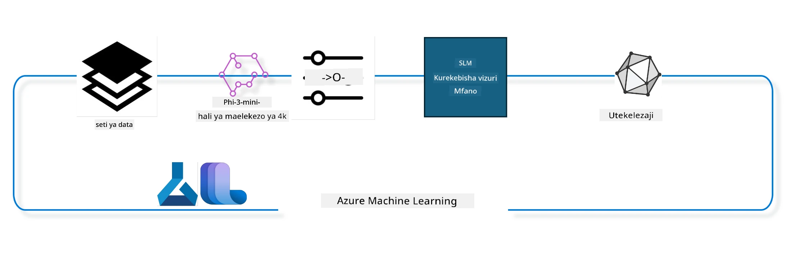

## Jinsi ya kutumia vipengele vya chat-completion kutoka kwa rejista ya mfumo wa Azure ML kufinyaza mfano

Katika mfano huu tutaendelea na kufinyaza mfano wa Phi-3-mini-4k-instruct ili kukamilisha mazungumzo kati ya watu 2 kwa kutumia dataset ya ultrachat_200k.



Mfano utaonyesha jinsi ya kufanya ufinyaji kwa kutumia SDK ya Azure ML na Python kisha kutuma mfano uliobinafsishwa kwenye endpoint ya mtandao kwa ajili ya utambuzi wa wakati halisi.

### Data ya Mafunzo

Tutatumia dataset ya ultrachat_200k. Hii ni toleo lililosafishwa sana la dataset ya UltraChat na ilitumika kufunza Zephyr-7B-β, mfano bora wa mazungumzo wa 7b.

### Mfano

Tutatumia mfano wa Phi-3-mini-4k-instruct kuonyesha jinsi mtumiaji anavyoweza kufinyaza mfano kwa kazi ya chat-completion. Ikiwa umefungua daftari hili kutoka kwa kadi maalum ya mfano, kumbuka kubadilisha jina la mfano husika.

### Kazi

- Chagua mfano wa kufinyaza.
- Chagua na chunguza data ya mafunzo.
- Sanidi kazi ya kufinyaza.
- Endesha kazi ya kufinyaza.
- Kagua takwimu za mafunzo na tathmini.
- Sajili mfano uliobinafsishwa.
- Tumia mfano uliobinafsishwa kwa utambuzi wa wakati halisi.
- Safisha rasilimali.

## 1. Weka mahitaji ya awali

- Sakinisha utegemezi
- Ungana na AzureML Workspace. Jifunze zaidi kwenye seti up SDK authentication. Badilisha <WORKSPACE_NAME>, <RESOURCE_GROUP> na <SUBSCRIPTION_ID> hapa chini.
- Ungana na rejista ya mfumo wa azureml
- Weka jina la jaribio kama hiari
- Angalia au unda compute.

> [!NOTE]
> Mahitaji ni node moja ya GPU inayoweza kuwa na kadi nyingi za GPU. Kwa mfano, kwenye node moja ya Standard_NC24rs_v3 kuna GPUs 4 za NVIDIA V100 wakati kwenye Standard_NC12s_v3 kuna GPUs 2 za NVIDIA V100. Rejelea nyaraka kwa habari hii. Idadi ya kadi za GPU kwa node huwekwa katika param gpus_per_node hapa chini. Kuweka thamani hii ipasavyo hakikisha matumizi ya GPUs zote kwenye node. SKUs za GPU compute zilizopendekezwa zinaweza kupatikana hapa na hapa.

### Maktaba za Python

Sakinisha utegemezi kwa kuendesha seli hapa chini. Hii si hatua ya hiari ikiwa unafanya kazi katika mazingira mapya.

```bash
pip install azure-ai-ml
pip install azure-identity
pip install datasets==2.9.0
pip install mlflow
pip install azureml-mlflow
```

### Kuingiliana na Azure ML

1. Hii ni script ya Python inayotumiwa kuingiliana na huduma ya Azure Machine Learning (Azure ML). Hapa kuna muhtasari wa kile inachofanya:

    - Inaingiza moduli muhimu kutoka kwa vifurushi vya azure.ai.ml, azure.identity, na azure.ai.ml.entities. Pia inaingiza moduli ya time.

    - Inajaribu kuhalalisha kwa kutumia DefaultAzureCredential(), inayotoa uzoefu rahisi wa uhalalishaji kuanza haraka kuendeleza programu zinazofanya kazi katika wingu la Azure. Ikiwa hii itashindwa, inatumia InteractiveBrowserCredential(), inayotoa kivutikio cha kuingia kiutendaji.

    - Kisha inajaribu kuunda mfano wa MLClient kwa kutumia njia ya from_config, inayosoma usanidi kutoka kwa faili chaguomsingi (config.json). Ikiwa hii itashindwa, inaunda mfano wa MLClient kwa kutoa subscription_id, resource_group_name, na workspace_name kwa mkono.

    - Inaunda mfano mwingine wa MLClient, mara hii kwa rejista ya Azure ML iitwayo "azureml". Rejista hii ndio mahali ambapo mifano, mifumo ya kufinyaza, na mazingira huhifadhiwa.

    - Inaweka experiment_name kuwa "chat_completion_Phi-3-mini-4k-instruct".

    - Inazalisha alama ya muda ya kipekee kwa kubadilisha wakati wa sasa (katika sekunde tangu epoch, kama namba ya float) kuwa namba ya integer kisha kuwa string. Alama hii ya muda inaweza kutumika kuunda majina na matoleo ya kipekee.

    ```python
    # Ingiza moduli zinazohitajika kutoka Azure ML na Azure Identity
    from azure.ai.ml import MLClient
    from azure.identity import (
        DefaultAzureCredential,
        InteractiveBrowserCredential,
    )
    from azure.ai.ml.entities import AmlCompute
    import time  # Ingiza moduli ya wakati
    
    # Jaribu kuthibitisha kutumia DefaultAzureCredential
    try:
        credential = DefaultAzureCredential()
        credential.get_token("https://management.azure.com/.default")
    except Exception as ex:  # Ikiwa DefaultAzureCredential itaanguka, tumia InteractiveBrowserCredential
        credential = InteractiveBrowserCredential()
    
    # Jaribu kuunda mfano wa MLClient kwa kutumia faili ya usanidi wa chaguo-msingi
    try:
        workspace_ml_client = MLClient.from_config(credential=credential)
    except:  # Ikiwa hiyo itaanguka, unda mfano wa MLClient kwa kutoa maelezo moja kwa moja
        workspace_ml_client = MLClient(
            credential,
            subscription_id="<SUBSCRIPTION_ID>",
            resource_group_name="<RESOURCE_GROUP>",
            workspace_name="<WORKSPACE_NAME>",
        )
    
    # Unda mfano mwingine wa MLClient kwa rejista ya Azure ML iitwayo "azureml"
    # Rejista hii ni mahali ambapo mifano, mabomba ya utunzi wa kina, na mazingira huhifadhiwa
    registry_ml_client = MLClient(credential, registry_name="azureml")
    
    # Weka jina la jaribio
    experiment_name = "chat_completion_Phi-3-mini-4k-instruct"
    
    # Tengeneza muhuri wa wakati wa kipekee unaoweza kutumika kwa majina na matoleo yanayohitaji kuwa ya kipekee
    timestamp = str(int(time.time()))
    ```

## 2. Chagua mfano wa msingi kufinyaza

1. Phi-3-mini-4k-instruct ni mfano wa parameta 3.8B, mwepesi, wa kisasa uliotengenezwa kwa kutumia dataset zilizotumika kwa Phi-2. Mfano huu ni wa familia ya mfano za Phi-3, na toleo la Mini linakuja katika aina mbili 4K na 128K ambayo ni urefu wa muktadha (kwa vipengele/tokeni) unaoweza kuunga mkono, tunahitaji kufinyaza mfano kwa matumizi yetu maalum ili kuutumia. Unaweza kutazama mifano hii katika Katalogi ya Mfano katika AzureML Studio, ukichuja kwa kazi ya chat-completion. Katika mfano huu, tunatumia mfano wa Phi-3-mini-4k-instruct. Ikiwa umefungua daftari hili kwa mfano tofauti, badilisha jina la mfano na toleo ipasavyo.

> [!NOTE]
> the property ya id ya mfano. Hii itapitishwa kama ingizo kwenye kazi ya kufinyaza. Pia inapatikana kama Sehemu ya Asset ID kwenye ukurasa wa maelezo ya mfano katika Katalogi ya Mfano ya AzureML Studio.

2. Hii ni script ya Python inayoshirikiana na huduma ya Azure Machine Learning (Azure ML). Hapa kuna muhtasari wa kile inachofanya:

    - Inaweka model_name kuwa "Phi-3-mini-4k-instruct".

    - Inatumia njia ya get ya mali ya models ya kitu registry_ml_client kupata toleo la hivi karibuni la mfano wenye jina lililotajwa kutoka kwa rejista ya Azure ML. Njia ya get inaitwa kwa hoja mbili: jina la mfano na lebo inayosema toleo la hivi karibuni la mfano linapaswa kupatikana.

    - Inachapisha ujumbe kwenye koni unaoonyesha jina, toleo, na id ya mfano ambao utatumika kufinyaza. Njia ya format ya string hutumika kuweka jina, toleo, na id ya mfano katika ujumbe. Jina, toleo, na id ya mfano huonekana kama mali za kitu foundation_model.

    ```python
    # Weka jina la modeli
    model_name = "Phi-3-mini-4k-instruct"
    
    # Pata toleo la hivi karibuni la modeli kutoka kwenye rejista ya Azure ML
    foundation_model = registry_ml_client.models.get(model_name, label="latest")
    
    # Chapisha jina la modeli, toleo, na kitambulisho
    # Taarifa hii ni muhimu kwa kufuatilia na kutatua matatizo
    print(
        "\n\nUsing model name: {0}, version: {1}, id: {2} for fine tuning".format(
            foundation_model.name, foundation_model.version, foundation_model.id
        )
    )
    ```

## 3. Unda compute itakayotumiwa na kazi

Kazi ya kufinyaza hufanya kazi TU na GPU compute. Ukubwa wa compute hutegemea ukubwa wa mfano na mara nyingi huwa vigumu kubaini compute sahihi kwa kazi hiyo. Katika seli hii, tunamsaidia mtumiaji kuchagua compute sahihi kwa kazi.

> [!NOTE]
> Computes zilizoorodheshwa hapa chini zinafanya kazi na usanidi ulioboreshwa zaidi. Mabadiliko yoyote katika usanidi yanaweza kusababisha kosa la Cuda Out Of Memory. Katika hali kama hizi, jaribu kuboresha compute kuwa kubwa zaidi.

> [!NOTE]
> Wakati unachagua compute_cluster_size hapa chini, hakikisha compute inapatikana katika kundi lako la rasilimali. Ikiwa compute fulani haipatikani unaweza kuomba kupata ruhusa ya kutumia rasilimali za compute.

### Kukagua Mfano kwa Msaada wa Kufinyaza

1. Hii ni script ya Python inayoshirikiana na mfano wa Azure Machine Learning (Azure ML). Hapa kuna muhtasari wa kile inachofanya:

    - Inaingiza moduli ya ast, inayotoa kazi za kusindika miti ya sarufi ya sintaksia ya abstrakti ya Python.

    - Inakagua kama kitu cha foundation_model (kilicho mfano katika Azure ML) kina lebo iitwayo finetune_compute_allow_list. Lebo katika Azure ML ni jozi za funguo na thamani unazoweza kuunda na kutumia kuchuja na kupanga mifano.

    - Ikiwa lebo finetune_compute_allow_list ipo, inatumia ast.literal_eval kufanya uchambuzi salama wa thamani ya lebo (kamba) kuwa orodha ya Python. Orodha hii inawekwa kwenye variable ya computes_allow_list. Kisha inachapisha ujumbe unaoonyesha compute inapaswa kuundwa kutoka kwa orodha hiyo.

    - Ikiwa lebo finetune_compute_allow_list haipo, inaweka computes_allow_list kuwa None na inachapisha ujumbe unaoonyesha lebo hii si sehemu ya lebo za mfano.

    - Kwa muhtasari, script hii inakagua lebo fulani katika metadata ya mfano, kubadilisha thamani ya lebo kuwa orodha ikiwa ipo, na kutoa mrejesho kwa mtumiaji ipasavyo.

    ```python
    # Ingiza moduli ya ast, ambayo inatoa kazi za kushughulikia miti ya sarufi ya syntax ya Python
    import ast
    
    # Angalia kama lebo ya 'finetune_compute_allow_list' ipo katika lebo za mfano
    if "finetune_compute_allow_list" in foundation_model.tags:
        # Ikiwa lebo ipo, tumia ast.literal_eval kusoma kwa usalama thamani ya lebo (kamba) kuwa orodha ya Python
        computes_allow_list = ast.literal_eval(
            foundation_model.tags["finetune_compute_allow_list"]
        )  # badilisha kamba kuwa orodha ya python
        # Chapisha ujumbe unaoonesha kwamba compute inapaswa kuundwa kutoka kwenye orodha
        print(f"Please create a compute from the above list - {computes_allow_list}")
    else:
        # Ikiwa lebo haipo, weka computes_allow_list kuwa None
        computes_allow_list = None
        # Chapisha ujumbe unaoonesha kwamba lebo ya 'finetune_compute_allow_list' si sehemu ya lebo za mfano
        print("`finetune_compute_allow_list` is not part of model tags")
    ```

### Kukagua Compute Instance

1. Hii ni script ya Python inayoshirikiana na huduma ya Azure Machine Learning (Azure ML) na kufanya ukaguzi kadhaa kwa compute instance. Hapa kuna muhtasari wa kile inachofanya:

    - Inajaribu kupata compute instance yenye jina lililo kwenye compute_cluster kutoka kwa Azure ML workspace. Ikiwa hali ya upangaji wa compute instance ni "failed", inatoa kosa la ValueError.

    - Inakagua ikiwa computes_allow_list si None. Ikiwa si hivyo, inabadilisha saizi zote za compute kwenye orodha kuwa herufi ndogo na inakagua kama ukubwa wa compute instance ya sasa uko kwenye orodha. Ikiwa haupo, inatoa ValueError.

    - Ikiwa computes_allow_list ni None, inakagua ikiwa ukubwa wa compute instance uko kwenye orodha ya ukubwa wa GPU VM zisizotegemewa. Ikiwa iko, inatoa ValueError.

    - Inapata orodha ya ukubwa zote za compute zinapatikana kwenye workspace. Kisha inapitia orodha hii, na kwa kila ukubwa, inakagua kama jina lake linafanana na ukubwa wa compute instance ya sasa. Ikiwa linafanana, inapata idadi ya GPUs kwa ukubwa huo na kuweka gpu_count_found kuwa True.

    - Ikiwa gpu_count_found ni True, inachapisha idadi ya GPUs kwenye compute instance. Ikiwa ni False, inatoa ValueError.

    - Kwa muhtasari, script hii inafanya ukaguzi kadhaa kwa compute instance katika Azure ML workspace, ikijumuisha ukaguzi wa hali ya upangaji, ukubwa wake dhidi ya orodha ya kuruhusiwa au kukanushwa, na idadi ya GPUs iliyo nayo.

    ```python
    # Chapisha ujumbe wa kasoro
    print(e)
    # Orodhesha ValueError ikiwa ukubwa wa kompyuta haupatikani katika eneo la kazi
    raise ValueError(
        f"WARNING! Compute size {compute_cluster_size} not available in workspace"
    )
    
    # Pata mfano wa kompyuta kutoka kwa eneo la kazi la Azure ML
    compute = workspace_ml_client.compute.get(compute_cluster)
    # Angalia kama hali ya utoaji wa mfano wa kompyuta ni "imeshindikana"
    if compute.provisioning_state.lower() == "failed":
        # Orodhesha ValueError ikiwa hali ya utoaji ni "imeshindikana"
        raise ValueError(
            f"Provisioning failed, Compute '{compute_cluster}' is in failed state. "
            f"please try creating a different compute"
        )
    
    # Angalia kama computes_allow_list sio None
    if computes_allow_list is not None:
        # Badilisha ukubwa wote wa kompyuta kwenye computes_allow_list kuwa herufi ndogo
        computes_allow_list_lower_case = [x.lower() for x in computes_allow_list]
        # Angalia ikiwa ukubwa wa mfano wa kompyuta uko kwenye computes_allow_list_lower_case
        if compute.size.lower() not in computes_allow_list_lower_case:
            # Orodhesha ValueError ikiwa ukubwa wa mfano wa kompyuta hauko kwenye computes_allow_list_lower_case
            raise ValueError(
                f"VM size {compute.size} is not in the allow-listed computes for finetuning"
            )
    else:
        # Eleza orodha ya ukubwa wa GPU VM zisizo supported
        unsupported_gpu_vm_list = [
            "standard_nc6",
            "standard_nc12",
            "standard_nc24",
            "standard_nc24r",
        ]
        # Angalia ikiwa ukubwa wa mfano wa kompyuta uko kwenye orodha ya unsupported_gpu_vm_list
        if compute.size.lower() in unsupported_gpu_vm_list:
            # Orodhesha ValueError ikiwa ukubwa wa mfano wa kompyuta uko kwenye orodha ya unsupported_gpu_vm_list
            raise ValueError(
                f"VM size {compute.size} is currently not supported for finetuning"
            )
    
    # Anzisha bendera ya kuangalia kama idadi ya GPU kwenye mfano wa kompyuta imetambuliwa
    gpu_count_found = False
    # Pata orodha ya ukubwa wote wa kompyuta unaopatikana katika eneo la kazi
    workspace_compute_sku_list = workspace_ml_client.compute.list_sizes()
    available_sku_sizes = []
    # Pitia orodha ya ukubwa wa kompyuta unaopatikana
    for compute_sku in workspace_compute_sku_list:
        available_sku_sizes.append(compute_sku.name)
        # Angalia kama jina la ukubwa wa kompyuta linafanana na ukubwa wa mfano wa kompyuta
        if compute_sku.name.lower() == compute.size.lower():
            # Ikiwa ndivyo, pata idadi ya GPU kwa ukubwa huo wa kompyuta na weka gpu_count_found kuwa True
            gpus_per_node = compute_sku.gpus
            gpu_count_found = True
    # Ikiwa gpu_count_found ni True, chapisha idadi ya GPU kwenye mfano wa kompyuta
    if gpu_count_found:
        print(f"Number of GPU's in compute {compute.size}: {gpus_per_node}")
    else:
        # Ikiwa gpu_count_found ni False, orodhesha ValueError
        raise ValueError(
            f"Number of GPU's in compute {compute.size} not found. Available skus are: {available_sku_sizes}."
            f"This should not happen. Please check the selected compute cluster: {compute_cluster} and try again."
        )
    ```

## 4. Chagua dataset kwa kufinyaza mfano

1. Tunatumia dataset ya ultrachat_200k. Dataset ina mgawanyo nne, inayofaa kwa Supervised fine-tuning (sft).
Magawanyo ya ukaribu wa kizazi (gen). Idadi ya mifano kwa kila mgawanyo inaonyeshwa kama ifuatavyo:

    ```bash
    train_sft test_sft  train_gen  test_gen
    207865  23110  256032  28304
    ```

1. Selia chache zinazofuata zinaonyesha maandalizi ya data ya msingi kwa kufinyaza:

### Onyesha mistari kadhaa ya data

Tunataka sampuli hii iendeshe kwa haraka, hivyo hifadhi faili za train_sft, test_sft zenye asilimia 5 ya mistari iliyokatwa tayari. Hii inamaanisha mfano uliobinafsishwa utakuwa na usahihi mdogo, kwa hiyo haupaswi kutumiwa kwa matumizi halisi.
download-dataset.py inatumiwa kupakua dataset ya ultrachat_200k na kubadilisha dataset kuwa muundo unaotumiwa na sehemu ya mchakato wa finetune. Pia dataset ni kubwa, kwa hiyo hapa tuna sehemu tu ya dataset.

1. Kuendesha script ifuatayo kunapakua tu asilimia 5 ya data. Hii inaweza kuongezwa kwa kubadilisha parameter ya dataset_split_pc kwa asilimia inayotakiwa.

> [!NOTE]
> Mifano ya lugha mingine ina jina tofauti za lugha na hivyo majina ya safu katika dataset yanapaswa kuakisi hilo.

1. Hapa kuna mfano wa jinsi data inavyopaswa kuonekana
Dataset ya chat-completion imehifadhiwa kwa muundo wa parquet na kila kiingilio kinatumia mpangilio ufuatao:

    - Hii ni hati ya JSON (JavaScript Object Notation), ambayo ni muundo maarufu wa kubadilishana data. Sio msimbo unaotekelezeka, bali ni njia ya kuhifadhi na kusafirisha data. Hapa ni muhtasari wa muundo wake:

    - "prompt": Funguo hii ina thamani ya kamba inayowakilisha kazi au swali linaloulizwa msaidizi wa AI.

    - "messages": Funguo hii ina safu ya vitu. Kila kitu kinawakilisha ujumbe katika mazungumzo kati ya mtumiaji na msaidizi wa AI. Kila kitu cha ujumbe kina funguo mbili:

    - "content": Funguo hii ina thamani ya kamba inayowakilisha maudhui ya ujumbe.
    - "role": Funguo hii ina thamani ya kamba inayowakilisha jukumu la muumba wa ujumbe. Inaweza kuwa "user" au "assistant".
    - "prompt_id": Funguo hii ina thamani ya kamba inayowakilisha kitambulisho cha kipekee cha prompt.

1. Katika hati hii maalum ya JSON, mazungumzo yanaonyeshwa ambapo mtumiaji anaomba msaidizi wa AI kuunda mhusika mkuu kwa hadithi ya giza. Msaidizi anajibu, na mtumiaji anaomba maelezo zaidi. Msaidizi anakubali kutoa maelezo zaidi. Mazungumzo yote yanahusiana na prompt_id maalum.

    ```python
    {
        // The task or question posed to an AI assistant
        "prompt": "Create a fully-developed protagonist who is challenged to survive within a dystopian society under the rule of a tyrant. ...",
        
        // An array of objects, each representing a message in a conversation between a user and an AI assistant
        "messages":[
            {
                // The content of the user's message
                "content": "Create a fully-developed protagonist who is challenged to survive within a dystopian society under the rule of a tyrant. ...",
                // The role of the entity that sent the message
                "role": "user"
            },
            {
                // The content of the assistant's message
                "content": "Name: Ava\n\n Ava was just 16 years old when the world as she knew it came crashing down. The government had collapsed, leaving behind a chaotic and lawless society. ...",
                // The role of the entity that sent the message
                "role": "assistant"
            },
            {
                // The content of the user's message
                "content": "Wow, Ava's story is so intense and inspiring! Can you provide me with more details.  ...",
                // The role of the entity that sent the message
                "role": "user"
            }, 
            {
                // The content of the assistant's message
                "content": "Certainly! ....",
                // The role of the entity that sent the message
                "role": "assistant"
            }
        ],
        
        // A unique identifier for the prompt
        "prompt_id": "d938b65dfe31f05f80eb8572964c6673eddbd68eff3db6bd234d7f1e3b86c2af"
    }
    ```

### Pakua Data

1. Hii ni script ya Python inayotumiwa kupakua dataset kwa kutumia script ya msaada iitwayo download-dataset.py. Hapa ni muhtasari wa kile inachofanya:

    - Inaingiza moduli ya os, inayotoa njia rahisi ya kutumia vipengele vya mfumo wa uendeshaji.

    - Inatumia os.system kuendesha script ya download-dataset.py kwenye shell na hoja maalum za mstari wa amri. Hoja zinabainisha dataset kupakuliwa (HuggingFaceH4/ultrachat_200k), saraka ya kuipakulia (ultrachat_200k_dataset), na asilimia ya dataset kugawanywa (5). os.system inarudisha hali ya kutoka ya amri; hali hii huhifadhiwa kwenye variable exit_status.

    - Inakagua ikiwa exit_status si 0. Katika mifumo ya Unix, hali 0 ya kutoka kawaida inaonyesha amri imefanikiwa, na nambari nyingine yoyote inaonyesha kosa. Ikiwa exit_status si 0, inatoa Exception yenye ujumbe unaoonyesha kuwa kulikuwa na kosa wakati wa kupakua dataset.

    - Kwa muhtasari, script hii inaendesha amri ya kupakua dataset kwa kutumia script ya msaada, na hutupa kosa ikiwa amri inashindwa.
    
    ```python
    # Ingiza moduli ya os, ambayo hutoa njia ya kutumia vipengele vinavyotegemea mfumo wa uendeshaji
    import os
    
    # Tumia kazi ya os.system kuendesha script ya download-dataset.py kwenye shell kwa kutumia hoja maalum za mstari wa amri
    # Hoja hizi zinaelezea seti ya data ya kupakua (HuggingFaceH4/ultrachat_200k), saraka ya kupakilia (ultrachat_200k_dataset), na asilimia ya seti ya data ya kugawanya (5)
    # Kazi ya os.system hurudisha hali ya kutoka ya amri iliyotekelezwa; hali hii huhifadhiwa katika kigezo exit_status
    exit_status = os.system(
        "python ./download-dataset.py --dataset HuggingFaceH4/ultrachat_200k --download_dir ultrachat_200k_dataset --dataset_split_pc 5"
    )
    
    # Angalia ikiwa exit_status si 0
    # Katika mifumo ya uendeshaji inayofanana na Unix, hali ya kutoka 0 kawaida inaashiria kuwa amri imefanikiwa, wakati nambari nyingine yoyote inaashiria kosa
    # Ikiwa exit_status si 0, inapasha Exception yenye ujumbe unaoonyesha kuwa kulikuwa na kosa la kupakua seti ya data
    if exit_status != 0:
        raise Exception("Error downloading dataset")
    ```

### Kupakia Data ndani ya DataFrame
1. Hii script ya Python inapakia faili la Mistari ya JSON ndani ya DataFrame ya pandas na kuonyesha mistari 5 ya kwanza. Hapa kuna muhtasari wa kile inachofanya:

    - Inaingiza maktaba ya pandas, ambayo ni maktaba yenye nguvu ya usindikaji na uchambuzi wa data.

    - Inaweka upana wa safu wa juu zaidi kwa chaguo za kuonyesha za pandas kuwa 0. Hii ina maana kwamba maandishi kamili ya kila safu yataonyeshwa bila kukatwa wakati DataFrame inapochapishwa.

    - Inatumia kazi ya pd.read_json kupakia faili la train_sft.jsonl kutoka kwa saramusi ya ultrachat_200k_dataset ndani ya DataFrame. Hoja ya lines=True inaonyesha kuwa faili iko katika muundo wa Mistari ya JSON, ambapo kila mstari ni kitu tofauti cha JSON.

    - Inatumia njia ya head kuonyesha mistari 5 ya kwanza ya DataFrame. Ikiwa DataFrame ina mistari chini ya 5, itaonyesha yote.

    - Kwa muhtasari, script hii inapakia faili la Mistari ya JSON ndani ya DataFrame na kuonyesha mistari 5 ya kwanza na maandishi kamili ya safu.

    ```python
    # Ingiza maktaba ya pandas, ambayo ni maktaba yenye nguvu ya uendeshaji na uchambuzi wa data
    import pandas as pd
    
    # Weka upana wa safu wa juu kabisa kwa chaguo za kuonyesha za pandas kuwa 0
    # Hii ina maana kwamba maandishi kamili ya kila safu yataonyeshwa bila kukatwa wakati DataFrame inachapishwa
    pd.set_option("display.max_colwidth", 0)
    
    # Tumia kazi ya pd.read_json kupakia faili la train_sft.jsonl kutoka kwa saraka ya ultrachat_200k_dataset ndani ya DataFrame
    # Hoja lines=True inaonyesha kwamba faili iko katika muundo wa Mistari ya JSON, ambapo kila mstari ni kitu tofauti cha JSON
    df = pd.read_json("./ultrachat_200k_dataset/train_sft.jsonl", lines=True)
    
    # Tumia njia ya head kuonyesha mistari 5 ya kwanza ya DataFrame
    # Ikiwa DataFrame ina mistari chini ya 5, itaonyesha yote
    df.head()
    ```

## 5. Wasilisha kazi ya kurekebisha kwa kutumia mfano na data kama pembejeo

Tengeneza kazi inayotumia kipengele cha mchakato wa chat-completion. Jifunze zaidi kuhusu vigezo vyote vinavyounga mkono kurekebisha kwa usahihi.

### Tafsiri parameta za kurekebisha

1. Parameta za kurekebisha zinaweza kugawanywa katika makundi 2 - parameta za mafunzo, parameta za uboreshaji

1. Parameta za mafunzo zinaelezea mambo ya mafunzo kama vile -

    - Mboreshaji, ratiba ya kutumia
    - Kipimo cha kuboresha kurekebisha
    - Idadi ya hatua za mafunzo na ukubwa wa kundi nk
    - Parameta za uboreshaji husaidia kuboresha kumbukumbu ya GPU na kutumia rasilimali za kompyuta kwa ufanisi.

1. Hapa chini kuna baadhi ya vigezo vinavyohusiana na kundi hili. Parameta za uboreshaji zinatofautiana kwa kila mfano na hupakizwa pamoja na mfano kudhibiti tofauti hizi.

    - Wezesha deepspeed na LoRA
    - Wezesha mafunzo ya mchanganyiko sahihi
    - Wezesha mafunzo ya nodi nyingi

> [!NOTE]
> Kurekebisha kwa usimamizi kunaweza kusababisha kupoteza muafaka au kusahau kwa makubwa. Tunapendekeza kukagua tatizo hili na kuendesha hatua ya muafaka baada ya kurekebisha.

### Parameta za Kurekebisha

1. Hii script ya Python inaweka parameta kwa ajili ya kurekebisha mfano wa mashine. Hapa kuna muhtasari wa kile inachofanya:

    - Inaweka parameta za mafunzo za msingi kama vile idadi ya vipindi vya mafunzo, ukubwa wa kundi kwa mafunzo na tathmini, kiwango cha ujifunzaji, na aina ya ratiba ya kiwango cha ujifunzaji.

    - Inaweka parameta za msingi za uboreshaji kama vile kama itatumia Layer-wise Relevance Propagation (LoRa) na DeepSpeed, na hatua ya DeepSpeed.

    - Inachanganya parameta za mafunzo na uboreshaji katika kamusi moja inayoitwa finetune_parameters.

    - Inakagua kama foundation_model ina parameta za chaguo cha mfano. Ikiwa ipo, inachapisha ujumbe wa onyo na kusasisha kamusi ya finetune_parameters na chaguo hizi maalum za mfano. Kazi ya ast.literal_eval inatumika kubadilisha chaguo hizi kutoka kwa string hadi kamusi ya Python.

    - Inachapisha seti ya mwisho ya parameta za kurekebisha zitakazotumika kwa mfululizo.

    - Kwa muhtasari, script hii inaandaa na kuonyesha parameta za kurekebisha mfano wa mashine, kwa uwezo wa kubadilisha parameta za msingi na zile maalum za mfano.

    ```python
    # Weka vigezo vya mafunzo vya msingi kama vile idadi ya vipindi vya mafunzo, ukubwa wa kundi kwa mafunzo na tathmini, kiwango cha kujifunza, na aina ya ratiba ya kiwango cha kujifunza
    training_parameters = dict(
        num_train_epochs=3,
        per_device_train_batch_size=1,
        per_device_eval_batch_size=1,
        learning_rate=5e-6,
        lr_scheduler_type="cosine",
    )
    
    # Weka vigezo vya msingi vya uboreshaji kama vile kama itatumika Layer-wise Relevance Propagation (LoRa) na DeepSpeed, na hatua ya DeepSpeed
    optimization_parameters = dict(
        apply_lora="true",
        apply_deepspeed="true",
        deepspeed_stage=2,
    )
    
    # Changanya vigezo vya mafunzo na uboreshaji ndani ya kamusi moja inayoitwa finetune_parameters
    finetune_parameters = {**training_parameters, **optimization_parameters}
    
    # Angalia kama foundation_model ina vigezo yoyote maalum vya msingi vya mfano
    # Ikiwa ina, chapisha ujumbe wa onyo na sasisha kamusi ya finetune_parameters na vigezo hizi maalum za mfano
    # Kazi ya ast.literal_eval hutumika kubadilisha vigezo maalum za mfano kutoka kamba hadi kamusi ya Python
    if "model_specific_defaults" in foundation_model.tags:
        print("Warning! Model specific defaults exist. The defaults could be overridden.")
        finetune_parameters.update(
            ast.literal_eval(  # badilisha kamba kuwa kamusi ya python
                foundation_model.tags["model_specific_defaults"]
            )
        )
    
    # Chapisha seti ya mwisho ya vigezo vya wepesi wa mafunzo vitakavyotumika kwa kuendesha huko
    print(
        f"The following finetune parameters are going to be set for the run: {finetune_parameters}"
    )
    ```

### Mchakato wa Mafunzo

1. Hii script ya Python inafafanua kazi ya kuzalisha jina la kuonyesha kwa mchakato wa mafunzo ya mashine, na kisha kuitisha kazi hii kuzalisha na kuchapisha jina hilo. Hapa kuna muhtasari wa kile inachofanya:

1. Kazi ya get_pipeline_display_name imefafanuliwa. Kazi hii huzalisha jina la kuonyesha kulingana na vigezo mbalimbali vinavyohusiana na mchakato wa mafunzo.

1. Ndani ya kazi, huhesabu ukubwa wa jumla wa kundi kwa kuzidisha ukubwa wa kundi kwa kifaa, idadi ya hatua za mkusanyiko wa gradient, idadi ya GPUs kwa node, na idadi ya node zinazotumika kwa kurekebisha.

1. Inapata vigezo vingine mbalimbali kama vile aina ya ratiba ya kiwango cha ujifunzaji, kama DeepSpeed inatumika, hatua ya DeepSpeed, kama Layer-wise Relevance Propagation (LoRa) inatumika, kikomo cha idadi ya alama za kumbukumbu za mfano za kuhifadhi, na urefu wa mfuatano wa juu kabisa.

1. Inajenga mfuatano unaojumuisha vigezo hivi vyote, vimegawanywa na alama ya kichwa. Ikiwa DeepSpeed au LoRa zinatumika, mfuatano hujumuisha "ds" ikifuatiwa na hatua ya DeepSpeed, au "lora" mtawaliwa. Ikiwa sivyo, hujumuisha "nods" au "nolora" mtawaliwa.

1. Kazi hurudisha mfuatano huu, ambao hutumika kama jina la kuonyesha kwa mchakato wa mafunzo.

1. Baada ya kazi kufafanuliwa, huitwa kuzalisha jina la kuonyesha, ambalo linachapishwa.

1. Kwa muhtasari, script hii huzalisha jina la kuonyesha kwa mchakato wa mafunzo ya mashine kulingana na vigezo mbalimbali, na kisha kuchapisha jina hilo.

    ```python
    # Fafanua kazi ya kuunda jina la kuonyesha kwa mchakato wa mafunzo
    def get_pipeline_display_name():
        # Hesabu jumla ya ukubwa wa kundi kwa kuzidisha ukubwa wa kundi kwa kifaa, idadi ya hatua za mkusanyiko wa mwinuko, idadi ya GPU kwa nodi, na idadi ya nodi zinazotumika kwa mafunzo maalum
        batch_size = (
            int(finetune_parameters.get("per_device_train_batch_size", 1))
            * int(finetune_parameters.get("gradient_accumulation_steps", 1))
            * int(gpus_per_node)
            * int(finetune_parameters.get("num_nodes_finetune", 1))
        )
        # Pata aina ya ratiba ya kasi ya kujifunza
        scheduler = finetune_parameters.get("lr_scheduler_type", "linear")
        # Pata ikiwa DeepSpeed imetumiwa
        deepspeed = finetune_parameters.get("apply_deepspeed", "false")
        # Pata hatua ya DeepSpeed
        ds_stage = finetune_parameters.get("deepspeed_stage", "2")
        # Ikiwa DeepSpeed imetumiwa, jumuisha "ds" ikifuatiwa na hatua ya DeepSpeed kwenye jina la kuonyesha; ikiwa siyo, jumuisha "nods"
        if deepspeed == "true":
            ds_string = f"ds{ds_stage}"
        else:
            ds_string = "nods"
        # Pata ikiwa Uenezi wa Umuhimu kwa safu (LoRa) umetumika
        lora = finetune_parameters.get("apply_lora", "false")
        # Ikiwa LoRa imetumika, jumuisha "lora" kwenye jina la kuonyesha; ikiwa siyo, jumuisha "nolora"
        if lora == "true":
            lora_string = "lora"
        else:
            lora_string = "nolora"
        # Pata kikomo cha idadi ya hakikisho za modeli za kuhifadhi
        save_limit = finetune_parameters.get("save_total_limit", -1)
        # Pata urefu wa mfuatano wa juu kabisa
        seq_len = finetune_parameters.get("max_seq_length", -1)
        # Tengeneza jina la kuonyesha kwa kuunganisha vigezo hivi vyote, vikiwa vimetengwa na dashes
        return (
            model_name
            + "-"
            + "ultrachat"
            + "-"
            + f"bs{batch_size}"
            + "-"
            + f"{scheduler}"
            + "-"
            + ds_string
            + "-"
            + lora_string
            + f"-save_limit{save_limit}"
            + f"-seqlen{seq_len}"
        )
    
    # Piga kazi kuunda jina la kuonyesha
    pipeline_display_name = get_pipeline_display_name()
    # Chapisha jina la kuonyesha
    print(f"Display name used for the run: {pipeline_display_name}")
    ```

### Kusanidi Mchakato

Script hii ya Python inafafanua na kusanidi mchakato wa mashine kwa kutumia Azure Machine Learning SDK. Hapa kuna muhtasari wa kile inachofanya:

1. Inaingiza moduli muhimu kutoka kwa Azure AI ML SDK.

1. Inapata kipengele cha mchakato chenye jina "chat_completion_pipeline" kutoka kwa rejista.

1. Inafafanua kazi ya kazi ya mchakato kwa kutumia `@pipeline` na kazi `create_pipeline`. Jina la mchakato limewekwa kuwa `pipeline_display_name`.

1. Ndani ya kazi ya `create_pipeline`, inanzisha kipengele cha mchakato kilichopatikana na vigezo mbalimbali, ikiwa ni pamoja na njia ya mfano, klasta za kompyuta kwa hatua tofauti, mgawanyo wa seti za data kwa mafunzo na majaribio, idadi ya GPUs za kutumia kwa kurekebisha, na vigezo vingine vya kurekebisha.

1. Inalinganisha pato la kazi ya kurekebisha na pato la kazi ya mchakato. Hii inafanyika ili mfano uliorekebishwa uweze kusajiliwa kwa urahisi, jambo ambalo ni muhimu kwa kuwezesha mfano kwenye endpoint ya mtandaoni au ya kundi.

1. Inatengeneza mfano wa mchakato kwa kuitisha kazi ya `create_pipeline`.

1. Inaweka mpangilio wa `force_rerun` wa mchakato kuwa `True`, maana yake matokeo yaliyohifadhiwa kutoka kwa kazi zilizopita hayatatumika.

1. Inaweka mpangilio wa `continue_on_step_failure` wa mchakato kuwa `False`, maana yake mchakato utakoma ikiwa hatua yoyote inapoteza.

1. Kwa muhtasari, script hii inafafanua na kusanidi mchakato wa mashine kwa ajili ya kazi ya chat completion kwa kutumia Azure Machine Learning SDK.

    ```python
    # Ingiza moduli zinazohitajika kutoka kwa Azure AI ML SDK
    from azure.ai.ml.dsl import pipeline
    from azure.ai.ml import Input
    
    # Pata sehemu ya pipeline iitwayo "chat_completion_pipeline" kutoka kwa rejista
    pipeline_component_func = registry_ml_client.components.get(
        name="chat_completion_pipeline", label="latest"
    )
    
    # Eleza kazi ya pipeline ukitumia mchapishaji @pipeline na kazi create_pipeline
    # Jina la pipeline limewekwa kuwa pipeline_display_name
    @pipeline(name=pipeline_display_name)
    def create_pipeline():
        # Anzisha sehemu ya pipeline iliyopatikana na vigezo mbalimbali
        # Hii ni pamoja na njia ya modeli, klasta za kompyuta kwa hatua tofauti, mgawanyo wa seti za data kwa mafunzo na upimaji, idadi ya GPU za kutumia kwa urekebishaji, na vigezo vingine vya urekebishaji
        chat_completion_pipeline = pipeline_component_func(
            mlflow_model_path=foundation_model.id,
            compute_model_import=compute_cluster,
            compute_preprocess=compute_cluster,
            compute_finetune=compute_cluster,
            compute_model_evaluation=compute_cluster,
            # Ramani mgawanyo wa seti za data kwa vigezo
            train_file_path=Input(
                type="uri_file", path="./ultrachat_200k_dataset/train_sft.jsonl"
            ),
            test_file_path=Input(
                type="uri_file", path="./ultrachat_200k_dataset/test_sft.jsonl"
            ),
            # Mipangilio ya mafunzo
            number_of_gpu_to_use_finetuning=gpus_per_node,  # Weka kwa idadi ya GPU zinazopatikana kwenye kompyuta
            **finetune_parameters
        )
        return {
            # Ramani matokeo ya kazi ya urekebishaji kwa matokeo ya kazi ya pipeline
            # Hii inafanywa ili tuweze kusajili modeli iliyorekebishwa kwa urahisi
            # Kusajili modeli ni lazima ili kuwezesha kupeleka modeli kwenye kiunganishi mtandaoni au kwa kundi
            "trained_model": chat_completion_pipeline.outputs.mlflow_model_folder
        }
    
    # Tengeneza mfano wa pipeline kwa kuita kazi create_pipeline
    pipeline_object = create_pipeline()
    
    # Usitumie matokeo yaliyohifadhiwa kutoka kwa kazi za awali
    pipeline_object.settings.force_rerun = True
    
    # Weka endelea ikiwa hatua itashindwa kuwa False
    # Hii ina maana pipeline itakoma ikiwa hatua yoyote itashindwa
    pipeline_object.settings.continue_on_step_failure = False
    ```

### Wasilisha Kazi

1. Hii script ya Python inawasisha kazi ya mchakato wa mashine kwa eneo la kazi la Azure Machine Learning na kisha kusubiri kazi kukamilika. Hapa kuna muhtasari wa kile inachofanya:

    - Inaitisha njia ya create_or_update ya kitu cha jobs katika workspace_ml_client kuwasilisha kazi ya mchakato. Mchakato wa kuendesha umeainishwa na pipeline_object, na jaribio ambalo kazi inafanya chini yake limeainishwa na experiment_name.

    - Kisha inaitisha njia ya stream ya kitu cha jobs katika workspace_ml_client kusubiri kazi ya mchakato kukamilika. Kazi ya kusubiri imeainishwa na sifa ya name ya kitu cha pipeline_job.

    - Kwa muhtasari, script hii inawasisha kazi ya mchakato wa mashine kwa eneo la kazi la Azure Machine Learning, na kisha kusubiri kazi kukamilika.

    ```python
    # Wasilisha kazi ya pipeline kwa Azure Machine Learning workspace
    # Pipeline inayotakiwa kuendeshwa inaelezwa na pipeline_object
    # Jaribio ambalo kazi inaendeshwa chini yake linaelezwa na experiment_name
    pipeline_job = workspace_ml_client.jobs.create_or_update(
        pipeline_object, experiment_name=experiment_name
    )
    
    # Subiri kazi ya pipeline kukamilika
    # Kazi inayosubiriwa inaelezwa na tabia ya name ya kitu cha pipeline_job
    workspace_ml_client.jobs.stream(pipeline_job.name)
    ```

## 6. Sajili mfano uliorekebishwa na eneo la kazi

Tutamsajili mfano kutoka kwa pato la kazi ya kurekebisha. Hii itafuatilia uhusiano kati ya mfano uliorekebishwa na kazi ya kurekebisha. Kazi ya kurekebisha, zaidi ya hayo, inafuatilia uhusiano na mfano wa msingi, data na msimbo wa mafunzo.

### Kusajili Mfano wa ML

1. Hii script ya Python inasajili mfano wa mashine uliyofundishwa katika mchakato wa Azure Machine Learning. Hapa kuna muhtasari wa kile inachofanya:

    - Inaingiza moduli muhimu kutoka kwa Azure AI ML SDK.

    - Inakagua kama pato la trained_model linapatikana kutoka kwa kazi ya mchakato kwa kuitisha njia ya get ya kitu cha jobs katika workspace_ml_client na kufikia sifa yake ya outputs.

    - Inajenga njia ya mfano uliyo fundishwa kwa kupanga mfuatano wa jina la kazi ya mchakato na jina la pato ("trained_model").

    - Inafafanua jina la mfano uliorekebishwa kwa kuongezea "-ultrachat-200k" kwa jina la awali la mfano na kubadilisha mikata kwa alama za kichwa.

    - Inajiandaa kusajili mfano kwa kutengeneza kitu cha Model na vigezo mbalimbali, ikiwa ni pamoja na njia ya mfano, aina ya mfano (mfano wa MLflow), jina na toleo la mfano, na maelezo ya mfano.

    - Inasajili mfano kwa kuitisha njia ya create_or_update ya kitu cha models katika workspace_ml_client kwa mfano wa Model kama hoja.

    - Inachapisha mfano uliosajiliwa.

1. Kwa muhtasari, script hii inasajili mfano wa mashine uliyofundishwa katika mchakato wa Azure Machine Learning.

    ```python
    # Ingiza moduli muhimu kutoka kwa Azure AI ML SDK
    from azure.ai.ml.entities import Model
    from azure.ai.ml.constants import AssetTypes
    
    # Angalia kama matokeo ya `trained_model` yanapatikana kutoka kwa kazi ya pipeline
    print("pipeline job outputs: ", workspace_ml_client.jobs.get(pipeline_job.name).outputs)
    
    # Tengeneza njia ya kwenda kwa mfano uliobebwa kwa kuunda muundo wa mstari na jina la kazi ya pipeline na jina la matokeo ("trained_model")
    model_path_from_job = "azureml://jobs/{0}/outputs/{1}".format(
        pipeline_job.name, "trained_model"
    )
    
    # Eleza jina la mfano uliobebeshwa kama ulivyobadilishwa kwa kuongeza "-ultrachat-200k" kwenye jina la mfano halisi na kubadilisha slashi zozote kuwa viongezaji
    finetuned_model_name = model_name + "-ultrachat-200k"
    finetuned_model_name = finetuned_model_name.replace("/", "-")
    
    print("path to register model: ", model_path_from_job)
    
    # Jiandae kusajili mfano kwa kuunda kitu cha mfano (Model object) kikiwa na vigezo mbalimbali
    # Hii ni pamoja na njia ya mfano, aina ya mfano (mfano wa MLflow), jina na toleo la mfano, pamoja na maelezo ya mfano
    prepare_to_register_model = Model(
        path=model_path_from_job,
        type=AssetTypes.MLFLOW_MODEL,
        name=finetuned_model_name,
        version=timestamp,  # Tumia alama ya muda kama toleo ili kuepuka mzozo wa toleo
        description=model_name + " fine tuned model for ultrachat 200k chat-completion",
    )
    
    print("prepare to register model: \n", prepare_to_register_model)
    
    # Sajili mfano kwa kuita njia ya create_or_update ya vitu vya models katika workspace_ml_client na kitu cha mfano kama hoja
    registered_model = workspace_ml_client.models.create_or_update(
        prepare_to_register_model
    )
    
    # Chapisha mfano uliosajiliwa
    print("registered model: \n", registered_model)
    ```

## 7. Sambaza mfano uliorekebishwa kwa endpoint ya mtandaoni

Endpoint za mtandaoni hutoa API ya REST tete ambayo inaweza kutumika kuunganisha na programu zinazohitaji kutumia mfano.

### Kusimamia Endpoint

1. Hii script ya Python inaunda endpoint ya mtandaoni inayosimamiwa katika Azure Machine Learning kwa mfano uliosajiliwa. Hapa kuna muhtasari wa kile inachofanya:

    - Inaingiza moduli muhimu kutoka kwa Azure AI ML SDK.

    - Inafafanua jina la kipekee kwa endpoint ya mtandaoni kwa kuongezea alama ya wakati kwenye mfuatano "ultrachat-completion-".

    - Inajiandaa kuunda endpoint ya mtandaoni kwa kutengeneza kitu cha ManagedOnlineEndpoint na vigezo mbalimbali, ikiwa ni pamoja na jina la endpoint, maelezo ya endpoint, na njia ya uthibitishaji ("key").

    - Inaunda endpoint ya mtandaoni kwa kuitisha njia ya begin_create_or_update ya workspace_ml_client kwa ManagedOnlineEndpoint kama hoja. Kisha inasubiri kwa kutumia njia ya wait hadi operesheni ya kuunda itakapokamilika.

1. Kwa muhtasari, script hii inaunda endpoint ya mtandaoni inayosimamiwa katika Azure Machine Learning kwa mfano uliosajiliwa.

    ```python
    # Ingiza moduli muhimu kutoka kwenye Azure AI ML SDK
    from azure.ai.ml.entities import (
        ManagedOnlineEndpoint,
        ManagedOnlineDeployment,
        ProbeSettings,
        OnlineRequestSettings,
    )
    
    # Elezea jina la kipekee kwa endpoint ya mtandao kwa kuongeza tarehe na saa kwa mfululizo "ultrachat-completion-"
    online_endpoint_name = "ultrachat-completion-" + timestamp
    
    # Andaa kuunda endpoint ya mtandao kwa kuunda kitu cha ManagedOnlineEndpoint na vigezo mbalimbali
    # Hii ni pamoja na jina la endpoint, maelezo ya endpoint, na njia ya uthibitishaji ("key")
    endpoint = ManagedOnlineEndpoint(
        name=online_endpoint_name,
        description="Online endpoint for "
        + registered_model.name
        + ", fine tuned model for ultrachat-200k-chat-completion",
        auth_mode="key",
    )
    
    # Unda endpoint ya mtandao kwa kuita njia ya begin_create_or_update ya workspace_ml_client ukiwa na kitu cha ManagedOnlineEndpoint kama hoja
    # Kisha subili mchakato wa uundaji ukamilike kwa kuita njia ya wait
    workspace_ml_client.begin_create_or_update(endpoint).wait()
    ```

> [!NOTE]
> Unaweza kupata hapa orodha ya SKU zinazounga mkono usambazaji - [Orodha ya SKU za endpoint za mtandaoni zinazodhibitiwa](https://learn.microsoft.com/azure/machine-learning/reference-managed-online-endpoints-vm-sku-list)

### Kusambaza Mfano wa ML

1. Hii script ya Python inasambaza mfano wa mashine uliosajiliwa kwa endpoint ya mtandaoni inayosimamiwa katika Azure Machine Learning. Hapa kuna muhtasari wa kile inachofanya:

    - Inaingiza moduli ya ast, inayotoa kazi za kushughulikia miti ya sarufi ya Python.

    - Inaweka aina ya kifaa kwa usambazaji kuwa "Standard_NC6s_v3".

    - Inakagua kama tag ya inference_compute_allow_list ipo katika mfano wa msingi. Ikiwa ipo, hubadilisha thamani ya tag kutoka kwa string hadi orodha ya Python na kuiweka katika inference_computes_allow_list. Ikiwa haipo, inaiweka inference_computes_allow_list kuwa None.

    - Inakagua kama aina ya kifaa iliyotajwa iko katika orodha ya ruhusa. Ikiwa haipo, inachapisha ujumbe ikimwomba mtumiaji kuchagua aina ya kifaa kutoka kwenye orodha.

    - Inajiandaa kuunda usambazaji kwa kutengeneza kitu cha ManagedOnlineDeployment na vigezo mbalimbali, ikiwa ni pamoja na jina la usambazaji, jina la endpoint, kitambulisho cha mfano, aina ya kifaa na idadi, mipangilio ya kipimo cha uhai, na mipangilio ya maombi.

    - Inaunda usambazaji kwa kuitisha njia ya begin_create_or_update ya workspace_ml_client na kitu cha ManagedOnlineDeployment kama hoja. Kisha inasubiri kwa kutumia njia ya wait hadi operesheni ya kuunda itakapokamilika.

    - Inaweka trafiki ya endpoint kuuelekeza asilimia 100 ya trafiki kwa usambazaji wa "demo".

    - Inasasisha endpoint kwa kuitisha njia ya begin_create_or_update ya workspace_ml_client na kitu cha endpoint kama hoja. Kisha inasubiri kwa kutumia njia ya result hadi sasisho litakapokamilika.

1. Kwa muhtasari, script hii inasambaza mfano uliosajiliwa wa mashine kwa endpoint ya mtandaoni inayosimamiwa katika Azure Machine Learning.

    ```python
    # Ingiza moduli ya ast, ambayo hutoa kazi za kushughulikia miti ya sarufi ya msimbo wa Python
    import ast
    
    # Weka aina ya mfano kwa ajili ya uwekaji
    instance_type = "Standard_NC6s_v3"
    
    # Angalia kama alama ya `inference_compute_allow_list` ipo katika mfano wa msingi
    if "inference_compute_allow_list" in foundation_model.tags:
        # Ikiwa ipo, badilisha thamani ya alama kutoka mfuatano wa herufi kwenda kwenye orodha ya Python na uipe `inference_computes_allow_list`
        inference_computes_allow_list = ast.literal_eval(
            foundation_model.tags["inference_compute_allow_list"]
        )
        print(f"Please create a compute from the above list - {computes_allow_list}")
    else:
        # Ikiwa haipo, weka `inference_computes_allow_list` kuwa `None`
        inference_computes_allow_list = None
        print("`inference_compute_allow_list` is not part of model tags")
    
    # Angalia kama aina ya mfano iliyotajwa iko katika orodha ya ruhusa
    if (
        inference_computes_allow_list is not None
        and instance_type not in inference_computes_allow_list
    ):
        print(
            f"`instance_type` is not in the allow listed compute. Please select a value from {inference_computes_allow_list}"
        )
    
    # Jiandae kuunda uwekaji kwa kuunda kitu cha `ManagedOnlineDeployment` na vigezo mbalimbali
    demo_deployment = ManagedOnlineDeployment(
        name="demo",
        endpoint_name=online_endpoint_name,
        model=registered_model.id,
        instance_type=instance_type,
        instance_count=1,
        liveness_probe=ProbeSettings(initial_delay=600),
        request_settings=OnlineRequestSettings(request_timeout_ms=90000),
    )
    
    # Unda uwekaji kwa kuita njia ya `begin_create_or_update` ya `workspace_ml_client` na kitu cha `ManagedOnlineDeployment` kama hujuma
    # Kisha subiri utekelezaji wa uundaji ukamilike kwa kuita njia ya `wait`
    workspace_ml_client.online_deployments.begin_create_or_update(demo_deployment).wait()
    
    # Weka trafiki ya kiunganishi dira kwa kuelekeza asilimia 100 ya trafiki kwenye uwekaji wa "demo"
    endpoint.traffic = {"demo": 100}
    
    # Sasisha kiunganishi kwa kuita njia ya `begin_create_or_update` ya `workspace_ml_client` na kitu cha `endpoint` kama hujuma
    # Kisha subiri utekelezaji wa usasishaji ukamilike kwa kuita njia ya `result`
    workspace_ml_client.begin_create_or_update(endpoint).result()
    ```

## 8. Jaribu endpoint na data ya mfano

Tutachukua sampuli ya data kutoka kwa seti ya majaribio na kuwasilisha kwa endpoint ya mtandaoni kwa utambuzi. Kisha tutaonyesha lebo za matokeo pamoja na lebo za ukweli wa ardhi.

### Kusoma Matokeo

1. Hii script ya Python inasoma faili la Mistari ya JSON katika DataFrame ya pandas, kuchukua sampuli nasibu, na kuweka upya fahirisi. Hapa kuna muhtasari wa kile inachofanya:

    - Inasoma faili ./ultrachat_200k_dataset/test_gen.jsonl ndani ya DataFrame ya pandas. Kazi ya read_json inatumika kwa kutumia hoja ya lines=True kwa sababu faili iko katika muundo wa Mistari ya JSON, ambapo kila mstari ni kitu tofauti cha JSON.

    - Inachukua sampuli nasibu ya mstari 1 kutoka kwa DataFrame. Kazi ya sample inatumika na hoja n=1 kuonyesha idadi ya mistari ya nasibu kuchaguliwa.

    - Inaweka upya fahirisi ya DataFrame. Kazi ya reset_index inatumika na hoja drop=True kuondoa fahirisi ya awali na kuiweka na fahirisi mpya za nambari za kawaida.

    - Inaonyesha mistari 2 ya kwanza ya DataFrame kwa kutumia kazi ya head na hoja 2. Hata hivyo, kwa sababu DataFrame ina mstari mmoja tu baada ya sampuli, hii itaonyesha mstari huo mmoja tu.

1. Kwa muhtasari, script hii inasoma faili la Mistari ya JSON katika DataFrame ya pandas, kuchukua sampuli moja ya nasibu, kuweka upya fahirisi, na kuonyesha mstari wa kwanza.

    ```python
    # Leta maktaba ya pandas
    import pandas as pd
    
    # Soma faili la JSON Lines './ultrachat_200k_dataset/test_gen.jsonl' kwenye DataFrame ya pandas
    # Hoja 'lines=True' inaonyesha kuwa faili iko katika muundo wa JSON Lines, ambapo kila mstari ni kitu tofauti cha JSON
    test_df = pd.read_json("./ultrachat_200k_dataset/test_gen.jsonl", lines=True)
    
    # Chukua sampuli ya bahati nasibu ya safu 1 kutoka DataFrame
    # Hoja 'n=1' inaelezea idadi ya safu za bahati nasibu kuchaguliwa
    test_df = test_df.sample(n=1)
    
    # Weka upya index ya DataFrame
    # Hoja 'drop=True' inaonyesha kuwa index ya awali inapaswa kuondolewa na kuchukuliwa na index mpya yenye thamani za integer za msingi
    # Hoja 'inplace=True' inaonyesha kuwa DataFrame inapaswa kubadilishwa mahali hapa (bila kuunda kitu kipya)
    test_df.reset_index(drop=True, inplace=True)
    
    # Onyesha safu 2 za kwanza za DataFrame
    # Hata hivyo, kwa kuwa DataFrame ina safu moja tu baada ya kuchukua sampuli, hii itaonyesha safu hiyo moja tu
    test_df.head(2)
    ```

### Unda Kitu cha JSON
1. Hii script ya Python inaunda kitu cha JSON chenye vigezo maalum na kuihifadhi kwenye faili. Hapa kuna muhtasari wa kile inachofanya:

    - Inaingiza moduli ya json, ambayo hutoa kazi za kufanya kazi na data ya JSON.

    - Inaunda kamusi iitwayo parameters yenye funguo na thamani zinazowakilisha vigezo vya mfano wa kujifunza mashine. Funguo ni "temperature", "top_p", "do_sample", na "max_new_tokens", na thamani zao mtawaliwa ni 0.6, 0.9, True, na 200.

    - Inaunda kamusi nyingine iitwayo test_json yenye funguo mbili: "input_data" na "params". Thamani ya "input_data" ni kamusi nyingine yenye funguo "input_string" na "parameters". Thamani ya "input_string" ni orodha inayojumuisha ujumbe wa kwanza kutoka DataFrame ya test_df. Thamani ya "parameters" ni kamusi ya parameters iliyoumbwa awali. Thamani ya "params" ni kamusi tupu.

    - Inafungua faili iitwayo sample_score.json
    
    ```python
    # Ingiza moduli ya json, ambayo hutoa kazi za kufanya kazi na data ya JSON
    import json
    
    # Tengeneza kamusi `parameters` yenye funguo na thamani zinazowakilisha vigezo vya mfano wa kujifunza mashine
    # Funguo ni "temperature", "top_p", "do_sample", na "max_new_tokens", na thamani zao ni 0.6, 0.9, True, na 200 mtawaliwa
    parameters = {
        "temperature": 0.6,
        "top_p": 0.9,
        "do_sample": True,
        "max_new_tokens": 200,
    }
    
    # Tengeneza kamusi nyingine `test_json` yenye funguo mbili: "input_data" na "params"
    # Thamani ya "input_data" ni kamusi nyingine yenye funguo "input_string" na "parameters"
    # Thamani ya "input_string" ni orodha inayojumuisha ujumbe wa kwanza kutoka DataFrame ya `test_df`
    # Thamani ya "parameters" ni kamusi ya `parameters` iliyotengenezwa awali
    # Thamani ya "params" ni kamusi tupu
    test_json = {
        "input_data": {
            "input_string": [test_df["messages"][0]],
            "parameters": parameters,
        },
        "params": {},
    }
    
    # Fungua faili yenye jina `sample_score.json` katika saraka `./ultrachat_200k_dataset` kwa hali ya kuandika
    with open("./ultrachat_200k_dataset/sample_score.json", "w") as f:
        # Andika kamusi ya `test_json` kwenye faili kwa muundo wa JSON kwa kutumia kazi ya `json.dump`
        json.dump(test_json, f)
    ```

### Kupiga Ombi kwa Endpoint

1. Hii script ya Python inapiga ombi kwenye endpoint mtandaoni katika Azure Machine Learning ili kupima faili la JSON. Hapa kuna muhtasari wa kile inachofanya:

    - Inaita njia ya invoke ya mali ya online_endpoints ya kitu workspace_ml_client. Njia hii hutumiwa kutuma ombi kwenye endpoint mtandaoni na kupata majibu.

    - Inaeleza jina la endpoint na usambazaji kwa hoja za endpoint_name na deployment_name. Katika kesi hii, jina la endpoint limehifadhiwa katika tofauti ya online_endpoint_name na jina la usambazaji ni "demo".

    - Inaeleza njia ya faili la JSON la kupimwa kwa hoja ya request_file. Katika kesi hii, faili ni ./ultrachat_200k_dataset/sample_score.json.

    - Inahifadhi jibu kutoka kwa endpoint kwenye tofauti ya response.

    - Inachapisha jibu halisi.

1. Kwa muhtasari, script hii inapiga ombi kwenye endpoint mtandaoni katika Azure Machine Learning ili kupima faili la JSON na kuchapisha jibu.

    ```python
    # Piga huduma ya mtandao katika Azure Machine Learning ili kupata alama za faili ya `sample_score.json`
    # Njia ya `invoke` ya mali ya `online_endpoints` ya kitu cha `workspace_ml_client` hutumika kutuma ombi kwa huduma ya mtandao na kupata majibu
    # Hoja ya `endpoint_name` inaelezea jina la huduma ya mtandao, ambalo limehifadhiwa katika tofauti ya `online_endpoint_name`
    # Hoja ya `deployment_name` inaelezea jina la uenezaji, ambalo ni "demo"
    # Hoja ya `request_file` inaelezea njia ya faili ya JSON ya kupimwa, ambayo ni `./ultrachat_200k_dataset/sample_score.json`
    response = workspace_ml_client.online_endpoints.invoke(
        endpoint_name=online_endpoint_name,
        deployment_name="demo",
        request_file="./ultrachat_200k_dataset/sample_score.json",
    )
    
    # Chapisha jibu halisi kutoka kwa huduma ya mtandao
    print("raw response: \n", response, "\n")
    ```

## 9. Futa endpoint mtandaoni

1. Usisahau kufuta endpoint mtandaoni, vinginevyo utaacha mita ya malipo ikiendesha kwa kutumia kompyuta iliyotumika na endpoint. Hufuata mstari huu wa msimbo wa Python unaofuta endpoint mtandaoni katika Azure Machine Learning. Hapa kuna muhtasari wa kile inachofanya:

    - Inaita njia ya begin_delete ya mali ya online_endpoints ya kitu workspace_ml_client. Njia hii hutumiwa kuanzisha kufutwa kwa endpoint mtandaoni.

    - Inaeleza jina la endpoint inayofutwa kwa hoja ya name. Katika kesi hii, jina la endpoint limehifadhiwa katika tofauti ya online_endpoint_name.

    - Inaita njia ya wait kusubiri mchakato wa kufuta ukamilike. Hii ni operesheni inayozuia, ikimaanisha itazuia script kuendelea hadi kufutwa kukamilike.

    - Kwa muhtasari, mstari huu wa msimbo unaanza kufuta endpoint mtandaoni katika Azure Machine Learning na kusubiri operesheni kumalizika.

    ```python
    # Futa kiunganishi mtandaoni katika Azure Machine Learning
    # Njia ya `begin_delete` ya mali ya `online_endpoints` katika kitu cha `workspace_ml_client` hutumika kuanza kufuta kiunganishi mtandaoni
    # Hoja ya `name` inaelezea jina la kiunganishi cha kufutwa, ambalo limehifadhiwa katika mabadiliko ya `online_endpoint_name`
    # Njia ya `wait` inaitwa kusubiri mpaka operesheni ya kufuta ikamilike. Hii ni operesheni ya kuzuia, ambayo inamaanisha kuwa itazuia script kuendelea mpaka kufutwa kumalizike
    workspace_ml_client.online_endpoints.begin_delete(name=online_endpoint_name).wait()
    ```

---

<!-- CO-OP TRANSLATOR DISCLAIMER START -->
**Taarifa ya Kutengwa**:
Hati hii imetafsiriwa kwa kutumia huduma ya tafsiri ya AI [Co-op Translator](https://github.com/Azure/co-op-translator). Ingawa tunajitahidi kuwa sahihi, tafadhali fahamu kwamba tafsiri za moja kwa moja zinaweza kuwa na makosa au upungufu wa usahihi. Hati ya asili katika lugha yake halisi inapaswa kuchukuliwa kama chanzo cha mamlaka. Kwa taarifa muhimu, tafsiri ya kitaalamu kutoka kwa binadamu inashauriwa. Hatubebei lawama kwa kutoelewana au tafsiri potofu zinazotokana na matumizi ya tafsiri hii.
<!-- CO-OP TRANSLATOR DISCLAIMER END -->