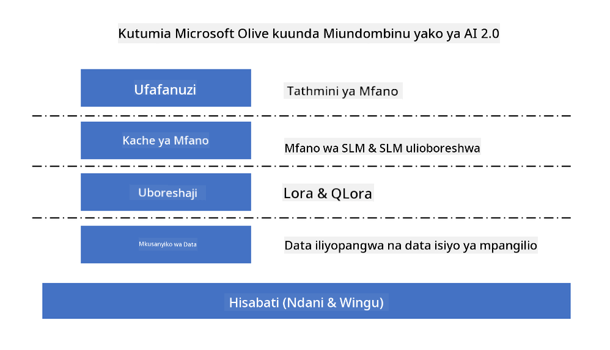

<!--
CO_OP_TRANSLATOR_METADATA:
{
  "original_hash": "5764be88ad2eb4f341e742eb8f14fab1",
  "translation_date": "2025-07-17T06:49:30+00:00",
  "source_file": "md/03.FineTuning/FineTuning_MicrosoftOlive.md",
  "language_code": "sw"
}
-->
# **Kurekebisha Phi-3 kwa Microsoft Olive**

[Olive](https://github.com/microsoft/OLive?WT.mc_id=aiml-138114-kinfeylo) ni chombo rahisi cha kuboresha modeli kinachojali vifaa ambacho huunganisha mbinu bora za sekta katika usimbuaji, uboreshaji, na mkusanyiko wa modeli.

Imeundwa ili kurahisisha mchakato wa kuboresha modeli za mashine za kujifunza, kuhakikisha zinatumia kwa ufanisi zaidi miundo maalum ya vifaa.

Iwe unafanya kazi kwenye programu za wingu au vifaa vya edge, Olive inakuwezesha kuboresha modeli zako kwa urahisi na kwa ufanisi.

## Sifa Muhimu:
- Olive hukusanya na kuendesha mbinu za uboreshaji kwa malengo maalum ya vifaa.
- Hakuna mbinu moja ya uboreshaji inayofaa kwa kila hali, hivyo Olive huruhusu upanuzi kwa kuwapa wataalamu wa sekta uwezo wa kuingiza ubunifu wao wa uboreshaji.

## Punguza Juhudi za Uhandisi:
- Waendelezaji mara nyingi wanahitaji kujifunza na kutumia zana mbalimbali za wauzaji wa vifaa ili kuandaa na kuboresha modeli zilizofunzwa kwa ajili ya utekelezaji.
- Olive hurahisisha uzoefu huu kwa kuendesha mbinu za uboreshaji kwa vifaa vinavyotakiwa.

## Suluhisho Tayari la Uboreshaji wa Mwisho-mwisho:

Kwa kuunganisha na kurekebisha mbinu zilizojumuishwa, Olive hutoa suluhisho moja kwa uboreshaji wa mwisho-mwisho.
Inazingatia vizingiti kama usahihi na ucheleweshaji wakati wa kuboresha modeli.

## Kutumia Microsoft Olive kwa kurekebisha

Microsoft Olive ni chombo rahisi sana cha chanzo huria cha kuboresha modeli kinachoweza kufunika kurekebisha na marejeleo katika uwanja wa akili bandia ya kizazi. Inahitaji tu usanidi rahisi, ikichanganywa na matumizi ya modeli ndogo za lugha za chanzo huria na mazingira yanayohusiana ya utekelezaji (AzureML / GPU ya ndani, CPU, DirectML), unaweza kukamilisha kurekebisha au marejeleo ya modeli kupitia uboreshaji wa moja kwa moja, na kupata modeli bora ya kupeleka kwenye wingu au kwenye vifaa vya edge. Inaruhusu makampuni kujenga modeli zao za sekta mahususi ndani ya makazi na kwenye wingu.



## Kurekebisha Phi-3 kwa Microsoft Olive


## Mfano wa Msimbo wa Phi-3 Olive na Mfano
Katika mfano huu utatumia Olive ili:

- Kurekebisha kiambatisho cha LoRA kwa ajili ya kuainisha misemo kuwa Huzuni, Furaha, Hofu, Mshangao.
- Kuunganisha uzito wa kiambatisho kwenye modeli msingi.
- Kuboresha na Kupanua modeli hadi int4.

[Sample Code](../../code/03.Finetuning/olive-ort-example/README.md)

### Sanidi Microsoft Olive

Usanidi wa Microsoft Olive ni rahisi sana, na pia unaweza kusakinishwa kwa CPU, GPU, DirectML, na Azure ML

```bash
pip install olive-ai
```

Ikiwa unataka kuendesha modeli ya ONNX kwa CPU, unaweza kutumia

```bash
pip install olive-ai[cpu]
```

Ikiwa unataka kuendesha modeli ya ONNX kwa GPU, unaweza kutumia

```python
pip install olive-ai[gpu]
```

Ikiwa unataka kutumia Azure ML, tumia

```python
pip install git+https://github.com/microsoft/Olive#egg=olive-ai[azureml]
```

**Kumbuka**
Mahitaji ya OS: Ubuntu 20.04 / 22.04

### **Config.json ya Microsoft Olive**

Baada ya usakinishaji, unaweza kusanidi mipangilio tofauti maalum ya modeli kupitia faili la Config, ikiwa ni pamoja na data, kompyuta, mafunzo, utekelezaji, na uzalishaji wa modeli.

**1. Data**

Katika Microsoft Olive, mafunzo kwa data ya ndani na data ya wingu yanaweza kuungwa mkono, na yanaweza kusanidiwa katika mipangilio.

*Mipangilio ya data ya ndani*

Unaweza kwa urahisi kuweka seti ya data inayohitaji kufunzwa kwa ajili ya kurekebisha, kawaida katika muundo wa json, na kuibadilisha kwa kutumia kiolezo cha data. Hii inahitaji kurekebishwa kulingana na mahitaji ya modeli (kwa mfano, kuibadilisha kwa muundo unaotakiwa na Microsoft Phi-3-mini. Ikiwa una modeli nyingine, tafadhali rejelea muundo unaohitajika wa kurekebisha modeli nyingine kwa usindikaji)

```json

    "data_configs": [
        {
            "name": "dataset_default_train",
            "type": "HuggingfaceContainer",
            "load_dataset_config": {
                "params": {
                    "data_name": "json", 
                    "data_files":"dataset/dataset-classification.json",
                    "split": "train"
                }
            },
            "pre_process_data_config": {
                "params": {
                    "dataset_type": "corpus",
                    "text_cols": [
                            "phrase",
                            "tone"
                    ],
                    "text_template": "### Text: {phrase}\n### The tone is:\n{tone}",
                    "corpus_strategy": "join",
                    "source_max_len": 2048,
                    "pad_to_max_len": false,
                    "use_attention_mask": false
                }
            }
        }
    ],
```

**Mipangilio ya chanzo cha data ya wingu**

Kwa kuunganisha hifadhi ya data ya Azure AI Studio/Azure Machine Learning Service kuunganisha data iliyoko kwenye wingu, unaweza kuchagua kuleta vyanzo tofauti vya data kwenye Azure AI Studio/Azure Machine Learning Service kupitia Microsoft Fabric na Azure Data kama msaada wa kurekebisha data.

```json

    "data_configs": [
        {
            "name": "dataset_default_train",
            "type": "HuggingfaceContainer",
            "load_dataset_config": {
                "params": {
                    "data_name": "json", 
                    "data_files": {
                        "type": "azureml_datastore",
                        "config": {
                            "azureml_client": {
                                "subscription_id": "Your Azure Subscrition ID",
                                "resource_group": "Your Azure Resource Group",
                                "workspace_name": "Your Azure ML Workspaces name"
                            },
                            "datastore_name": "workspaceblobstore",
                            "relative_path": "Your train_data.json Azure ML Location"
                        }
                    },
                    "split": "train"
                }
            },
            "pre_process_data_config": {
                "params": {
                    "dataset_type": "corpus",
                    "text_cols": [
                            "Question",
                            "Best Answer"
                    ],
                    "text_template": "<|user|>\n{Question}<|end|>\n<|assistant|>\n{Best Answer}\n<|end|>",
                    "corpus_strategy": "join",
                    "source_max_len": 2048,
                    "pad_to_max_len": false,
                    "use_attention_mask": false
                }
            }
        }
    ],
    
```

**2. Mipangilio ya kompyuta**

Ikiwa unahitaji kuwa wa ndani, unaweza kutumia rasilimali za data za ndani moja kwa moja. Ikiwa unahitaji kutumia rasilimali za Azure AI Studio / Azure Machine Learning Service, unahitaji kusanidi vigezo husika vya Azure, jina la nguvu ya kompyuta, n.k.

```json

    "systems": {
        "aml": {
            "type": "AzureML",
            "config": {
                "accelerators": ["gpu"],
                "hf_token": true,
                "aml_compute": "Your Azure AI Studio / Azure Machine Learning Service Compute Name",
                "aml_docker_config": {
                    "base_image": "Your Azure AI Studio / Azure Machine Learning Service docker",
                    "conda_file_path": "conda.yaml"
                }
            }
        },
        "azure_arc": {
            "type": "AzureML",
            "config": {
                "accelerators": ["gpu"],
                "aml_compute": "Your Azure AI Studio / Azure Machine Learning Service Compute Name",
                "aml_docker_config": {
                    "base_image": "Your Azure AI Studio / Azure Machine Learning Service docker",
                    "conda_file_path": "conda.yaml"
                }
            }
        }
    },
```

***Kumbuka***

Kwa kuwa inatekelezwa kupitia kontena kwenye Azure AI Studio/Azure Machine Learning Service, mazingira yanayohitajika yanahitaji kusanidiwa. Hii inafanywa katika mazingira ya conda.yaml.

```yaml

name: project_environment
channels:
  - defaults
dependencies:
  - python=3.8.13
  - pip=22.3.1
  - pip:
      - einops
      - accelerate
      - azure-keyvault-secrets
      - azure-identity
      - bitsandbytes
      - datasets
      - huggingface_hub
      - peft
      - scipy
      - sentencepiece
      - torch>=2.2.0
      - transformers
      - git+https://github.com/microsoft/Olive@jiapli/mlflow_loading_fix#egg=olive-ai[gpu]
      - --extra-index-url https://aiinfra.pkgs.visualstudio.com/PublicPackages/_packaging/ORT-Nightly/pypi/simple/ 
      - ort-nightly-gpu==1.18.0.dev20240307004
      - --extra-index-url https://aiinfra.pkgs.visualstudio.com/PublicPackages/_packaging/onnxruntime-genai/pypi/simple/
      - onnxruntime-genai-cuda

    

```

**3. Chagua SLM yako**

Unaweza kutumia modeli moja kwa moja kutoka Hugging face, au unaweza kuunganisha moja kwa moja na Katalogi ya Modeli ya Azure AI Studio / Azure Machine Learning kuchagua modeli ya kutumia. Katika mfano wa msimbo hapa chini tutatumia Microsoft Phi-3-mini kama mfano.

Ikiwa una modeli kwa ndani, unaweza kutumia njia hii

```json

    "input_model":{
        "type": "PyTorchModel",
        "config": {
            "hf_config": {
                "model_name": "model-cache/microsoft/phi-3-mini",
                "task": "text-generation",
                "model_loading_args": {
                    "trust_remote_code": true
                }
            }
        }
    },
```

Ikiwa unataka kutumia modeli kutoka Azure AI Studio / Azure Machine Learning Service, unaweza kutumia njia hii

```json

    "input_model":{
        "type": "PyTorchModel",
        "config": {
            "model_path": {
                "type": "azureml_registry_model",
                "config": {
                    "name": "microsoft/Phi-3-mini-4k-instruct",
                    "registry_name": "azureml-msr",
                    "version": "11"
                }
            },
             "model_file_format": "PyTorch.MLflow",
             "hf_config": {
                "model_name": "microsoft/Phi-3-mini-4k-instruct",
                "task": "text-generation",
                "from_pretrained_args": {
                    "trust_remote_code": true
                }
            }
        }
    },
```

**Kumbuka:**
Tunahitaji kuunganishwa na Azure AI Studio / Azure Machine Learning Service, hivyo wakati wa kusanidi modeli, tafadhali rejelea nambari ya toleo na majina yanayohusiana.

Modeli zote kwenye Azure zinahitaji kuwekwa kuwa PyTorch.MLflow

Unahitaji kuwa na akaunti ya Hugging face na kufunga ufunguo kwenye Thamani ya Key ya Azure AI Studio / Azure Machine Learning

**4. Algoriti**

Microsoft Olive inafunga vizuri algoriti za kurekebisha za Lora na QLora. Unachohitaji kusanidi ni baadhi ya vigezo husika. Hapa nitachukua QLora kama mfano.

```json
        "lora": {
            "type": "LoRA",
            "config": {
                "target_modules": [
                    "o_proj",
                    "qkv_proj"
                ],
                "double_quant": true,
                "lora_r": 64,
                "lora_alpha": 64,
                "lora_dropout": 0.1,
                "train_data_config": "dataset_default_train",
                "eval_dataset_size": 0.3,
                "training_args": {
                    "seed": 0,
                    "data_seed": 42,
                    "per_device_train_batch_size": 1,
                    "per_device_eval_batch_size": 1,
                    "gradient_accumulation_steps": 4,
                    "gradient_checkpointing": false,
                    "learning_rate": 0.0001,
                    "num_train_epochs": 3,
                    "max_steps": 10,
                    "logging_steps": 10,
                    "evaluation_strategy": "steps",
                    "eval_steps": 187,
                    "group_by_length": true,
                    "adam_beta2": 0.999,
                    "max_grad_norm": 0.3
                }
            }
        },
```

Ikiwa unataka mabadiliko ya upunguzaji, tawi kuu la Microsoft Olive tayari linaunga mkono njia ya onnxruntime-genai. Unaweza kuisanidi kulingana na mahitaji yako:

1. Unganisha uzito wa kiambatisho kwenye modeli msingi
2. Badilisha modeli kuwa modeli ya onnx yenye usahihi unaohitajika kwa ModelBuilder

kama vile kubadilisha kuwa INT4 iliyopunguzwa

```json

        "merge_adapter_weights": {
            "type": "MergeAdapterWeights"
        },
        "builder": {
            "type": "ModelBuilder",
            "config": {
                "precision": "int4"
            }
        }
```

**Kumbuka**
- Ikiwa unatumia QLoRA, mabadiliko ya upunguzaji ya ONNXRuntime-genai kwa sasa hayasaidii.

- Inapaswa kuangaziwa hapa kwamba unaweza kusanidi hatua zilizo juu kulingana na mahitaji yako binafsi. Sio lazima kusanidi hatua zote hapo juu kikamilifu. Kulingana na mahitaji yako, unaweza kutumia hatua za algoriti moja kwa moja bila kurekebisha. Mwishowe unahitaji kusanidi injini husika

```json

    "engine": {
        "log_severity_level": 0,
        "host": "aml",
        "target": "aml",
        "search_strategy": false,
        "execution_providers": ["CUDAExecutionProvider"],
        "cache_dir": "../model-cache/models/phi3-finetuned/cache",
        "output_dir" : "../model-cache/models/phi3-finetuned"
    }
```

**5. Kamilisha kurekebisha**

Katika mstari wa amri, tekeleza katika saraka ya olive-config.json

```bash
olive run --config olive-config.json  
```

**Kiarifu cha Kutotegemea**:  
Hati hii imetafsiriwa kwa kutumia huduma ya tafsiri ya AI [Co-op Translator](https://github.com/Azure/co-op-translator). Ingawa tunajitahidi kwa usahihi, tafadhali fahamu kwamba tafsiri za kiotomatiki zinaweza kuwa na makosa au upungufu wa usahihi. Hati ya asili katika lugha yake ya asili inapaswa kuchukuliwa kama chanzo cha mamlaka. Kwa taarifa muhimu, tafsiri ya kitaalamu inayofanywa na binadamu inapendekezwa. Hatubebei dhamana kwa kutoelewana au tafsiri potofu zinazotokana na matumizi ya tafsiri hii.