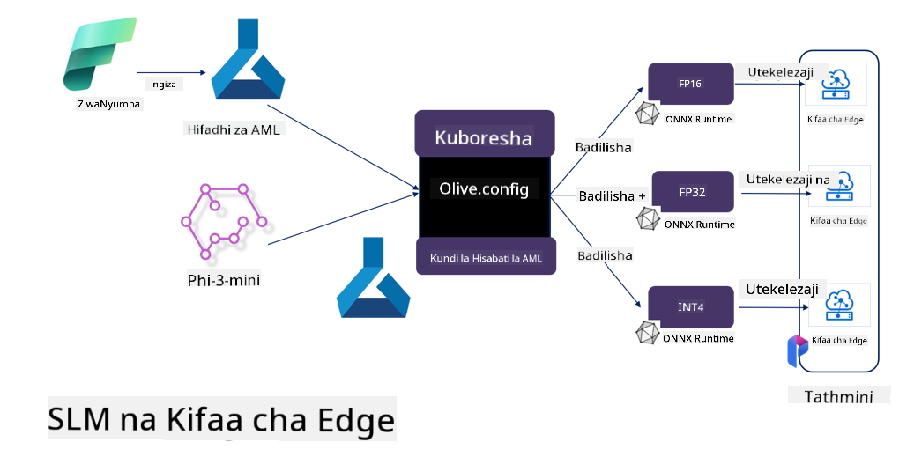

<!--
CO_OP_TRANSLATOR_METADATA:
{
  "original_hash": "5764be88ad2eb4f341e742eb8f14fab1",
  "translation_date": "2025-05-09T20:54:17+00:00",
  "source_file": "md/03.FineTuning/FineTuning_MicrosoftOlive.md",
  "language_code": "sw"
}
-->
# **Kufinyanisha Phi-3 na Microsoft Olive**

[Olive](https://github.com/microsoft/OLive?WT.mc_id=aiml-138114-kinfeylo) ni chombo rahisi kinachojali vifaa cha kuboresha mifano kinachojumuisha mbinu bora za sekta katika kusindika mifano, kuboresha, na kuandaa.

Imeundwa kurahisisha mchakato wa kuboresha mifano ya mashine ya kujifunza, kuhakikisha inatumia vifaa maalum kwa ufanisi zaidi.

Iwe unafanya kazi kwenye programu za wingu au vifaa vya edge, Olive inakuwezesha kuboresha mifano yako kwa urahisi na ufanisi.

## Sifa Muhimu:
- Olive hukusanya na kuendesha kiotomatiki mbinu za kuboresha kwa ajili ya vifaa unavyotaka.
- Hakuna mbinu moja inayofaa kwa kila hali, hivyo Olive inaruhusu upanuzi kwa wataalamu wa sekta kuingiza mbinu zao za ubunifu.

## Punguza Juhudi za Uhandisi:
- Waendelezaji mara nyingi wanahitaji kujifunza na kutumia zana nyingi za wauzaji wa vifaa kutayarisha na kuboresha mifano iliyofunzwa kwa ajili ya utekelezaji.
- Olive hurahisisha uzoefu huu kwa kuendesha kiotomatiki mbinu za kuboresha kwa vifaa vinavyotakiwa.

## Suluhisho Tayari la Uboreshaji wa Kilele hadi Kilele:

Kwa kuunganisha na kusanifu mbinu mbalimbali, Olive hutoa suluhisho moja kwa moja la uboreshaji wa mwisho hadi mwisho.
Inazingatia vikwazo kama usahihi na ucheleweshaji wakati wa kuboresha mifano.

## Kutumia Microsoft Olive kufinyanisha

Microsoft Olive ni chombo rahisi sana cha chanzo huria cha kuboresha mifano kinachoweza kufunika kufinyanisha na marejeleo katika uwanja wa akili bandia ya kizazi. Inahitaji tu usanidi rahisi, ikichanganywa na matumizi ya mifano midogo ya lugha ya chanzo huria na mazingira yanayohusiana ya runtime (AzureML / GPU ya ndani, CPU, DirectML), unaweza kumaliza kufinyanisha au marejeleo ya mfano kupitia uboreshaji wa kiotomatiki, na kupata mfano bora wa kupeleka kwenye wingu au vifaa vya edge. Inaruhusu makampuni kujenga mifano yao ya sekta mahali pa kazi na kwenye wingu.


## Kufinyanisha Phi-3 na Microsoft Olive



## Mfano wa Msimbo wa Phi-3 Olive na Mfano
Katika mfano huu utatumia Olive kufanya:

- Kufinyanisha kiambatanisho cha LoRA ili kuainisha misemo kuwa Huzuni, Furaha, Hofu, Mshangao.
- Kuunganisha uzito wa kiambatanisho kwenye mfano msingi.
- Kuboresha na Kubadilisha mfano kuwa int4.

[Sample Code](../../code/03.Finetuning/olive-ort-example/README.md)

### Sanidi Microsoft Olive

Usanidi wa Microsoft Olive ni rahisi sana, na pia unaweza kusanikishwa kwa CPU, GPU, DirectML, na Azure ML

```bash
pip install olive-ai
```

Ikiwa unataka kuendesha mfano wa ONNX kwa CPU, unaweza tumia

```bash
pip install olive-ai[cpu]
```

Ikiwa unataka kuendesha mfano wa ONNX kwa GPU, unaweza tumia

```python
pip install olive-ai[gpu]
```

Ikiwa unataka kutumia Azure ML, tumia

```python
pip install git+https://github.com/microsoft/Olive#egg=olive-ai[azureml]
```

**Notice**  
Mahitaji ya OS: Ubuntu 20.04 / 22.04

### **Config.json ya Microsoft Olive**

Baada ya usakinishaji, unaweza kusanidi mipangilio tofauti maalum ya mfano kupitia faili la Config, ikiwa ni pamoja na data, kompyuta, mafunzo, utekelezaji, na uzalishaji wa mfano.

**1. Data**

Katika Microsoft Olive, mafunzo yanaweza kufanywa kwa data ya ndani na data ya wingu, na inaweza kusanidiwa katika mipangilio.

*Mipangilio ya data ya ndani*

Unaweza kuweka seti ya data inayohitajika kufunzwa kwa kufinyanisha, kawaida katika muundo wa json, na kuiendana na kiolezo cha data. Hii inahitaji kurekebishwa kulingana na mahitaji ya mfano (kwa mfano, kuifanya iwe muundo unaotakiwa na Microsoft Phi-3-mini. Ikiwa una mifano mingine, tafadhali rejea muundo unaohitajika wa kufinyanisha mifano mingine kwa usindikaji)

```json

    "data_configs": [
        {
            "name": "dataset_default_train",
            "type": "HuggingfaceContainer",
            "load_dataset_config": {
                "params": {
                    "data_name": "json", 
                    "data_files":"dataset/dataset-classification.json",
                    "split": "train"
                }
            },
            "pre_process_data_config": {
                "params": {
                    "dataset_type": "corpus",
                    "text_cols": [
                            "phrase",
                            "tone"
                    ],
                    "text_template": "### Text: {phrase}\n### The tone is:\n{tone}",
                    "corpus_strategy": "join",
                    "source_max_len": 2048,
                    "pad_to_max_len": false,
                    "use_attention_mask": false
                }
            }
        }
    ],
```

**Mipangilio ya chanzo cha data ya wingu**

Kwa kuunganisha duka la data la Azure AI Studio/Azure Machine Learning Service kuunganisha data kwenye wingu, unaweza kuchagua kuleta vyanzo tofauti vya data kwenye Azure AI Studio/Azure Machine Learning Service kupitia Microsoft Fabric na Azure Data kama msaada wa kufinyanisha data.

```json

    "data_configs": [
        {
            "name": "dataset_default_train",
            "type": "HuggingfaceContainer",
            "load_dataset_config": {
                "params": {
                    "data_name": "json", 
                    "data_files": {
                        "type": "azureml_datastore",
                        "config": {
                            "azureml_client": {
                                "subscription_id": "Your Azure Subscrition ID",
                                "resource_group": "Your Azure Resource Group",
                                "workspace_name": "Your Azure ML Workspaces name"
                            },
                            "datastore_name": "workspaceblobstore",
                            "relative_path": "Your train_data.json Azure ML Location"
                        }
                    },
                    "split": "train"
                }
            },
            "pre_process_data_config": {
                "params": {
                    "dataset_type": "corpus",
                    "text_cols": [
                            "Question",
                            "Best Answer"
                    ],
                    "text_template": "<|user|>\n{Question}<|end|>\n<|assistant|>\n{Best Answer}\n<|end|>",
                    "corpus_strategy": "join",
                    "source_max_len": 2048,
                    "pad_to_max_len": false,
                    "use_attention_mask": false
                }
            }
        }
    ],
    
```

**2. Mipangilio ya kompyuta**

Ikiwa unahitaji kuwa ndani, unaweza kutumia rasilimali za data za ndani moja kwa moja. Ikiwa unahitaji kutumia rasilimali za Azure AI Studio / Azure Machine Learning Service, unahitaji kusanidi vigezo husika vya Azure, jina la nguvu ya kompyuta, n.k.

```json

    "systems": {
        "aml": {
            "type": "AzureML",
            "config": {
                "accelerators": ["gpu"],
                "hf_token": true,
                "aml_compute": "Your Azure AI Studio / Azure Machine Learning Service Compute Name",
                "aml_docker_config": {
                    "base_image": "Your Azure AI Studio / Azure Machine Learning Service docker",
                    "conda_file_path": "conda.yaml"
                }
            }
        },
        "azure_arc": {
            "type": "AzureML",
            "config": {
                "accelerators": ["gpu"],
                "aml_compute": "Your Azure AI Studio / Azure Machine Learning Service Compute Name",
                "aml_docker_config": {
                    "base_image": "Your Azure AI Studio / Azure Machine Learning Service docker",
                    "conda_file_path": "conda.yaml"
                }
            }
        }
    },
```

***Notice***

Kwa kuwa inatekelezwa kupitia kontena kwenye Azure AI Studio/Azure Machine Learning Service, mazingira yanayohitajika yanapaswa kusanidiwa. Hii inafanywa katika mazingira ya conda.yaml.

```yaml

name: project_environment
channels:
  - defaults
dependencies:
  - python=3.8.13
  - pip=22.3.1
  - pip:
      - einops
      - accelerate
      - azure-keyvault-secrets
      - azure-identity
      - bitsandbytes
      - datasets
      - huggingface_hub
      - peft
      - scipy
      - sentencepiece
      - torch>=2.2.0
      - transformers
      - git+https://github.com/microsoft/Olive@jiapli/mlflow_loading_fix#egg=olive-ai[gpu]
      - --extra-index-url https://aiinfra.pkgs.visualstudio.com/PublicPackages/_packaging/ORT-Nightly/pypi/simple/ 
      - ort-nightly-gpu==1.18.0.dev20240307004
      - --extra-index-url https://aiinfra.pkgs.visualstudio.com/PublicPackages/_packaging/onnxruntime-genai/pypi/simple/
      - onnxruntime-genai-cuda

    

```

**3. Chagua SLM yako**

Unaweza kutumia mfano moja kwa moja kutoka Hugging face, au unaweza kuunganisha moja kwa moja na Katalogi ya Mfano ya Azure AI Studio / Azure Machine Learning kuchagua mfano wa kutumia. Katika mfano wa msimbo hapa chini tutatumia Microsoft Phi-3-mini kama mfano.

Ikiwa una mfano ndani ya kompyuta, unaweza tumia njia hii

```json

    "input_model":{
        "type": "PyTorchModel",
        "config": {
            "hf_config": {
                "model_name": "model-cache/microsoft/phi-3-mini",
                "task": "text-generation",
                "model_loading_args": {
                    "trust_remote_code": true
                }
            }
        }
    },
```

Ikiwa unataka kutumia mfano kutoka Azure AI Studio / Azure Machine Learning Service, unaweza tumia njia hii

```json

    "input_model":{
        "type": "PyTorchModel",
        "config": {
            "model_path": {
                "type": "azureml_registry_model",
                "config": {
                    "name": "microsoft/Phi-3-mini-4k-instruct",
                    "registry_name": "azureml-msr",
                    "version": "11"
                }
            },
             "model_file_format": "PyTorch.MLflow",
             "hf_config": {
                "model_name": "microsoft/Phi-3-mini-4k-instruct",
                "task": "text-generation",
                "from_pretrained_args": {
                    "trust_remote_code": true
                }
            }
        }
    },
```

**Notice:**  
Tunahitaji kuunganishwa na Azure AI Studio / Azure Machine Learning Service, hivyo wakati wa kusanidi mfano, tafadhali rejea nambari ya toleo na majina yanayohusiana.

Mifano yote kwenye Azure inapaswa kuwekwa kuwa PyTorch.MLflow

Unahitaji kuwa na akaunti ya Hugging face na kufunga funguo kwa Thamani ya Funguo ya Azure AI Studio / Azure Machine Learning

**4. Algorithm**

Microsoft Olive imefunga vizuri algorithms za kufinyanisha Lora na QLora. Unachohitaji ni kusanidi vigezo vinavyohusiana. Hapa nitachukua QLora kama mfano.

```json
        "lora": {
            "type": "LoRA",
            "config": {
                "target_modules": [
                    "o_proj",
                    "qkv_proj"
                ],
                "double_quant": true,
                "lora_r": 64,
                "lora_alpha": 64,
                "lora_dropout": 0.1,
                "train_data_config": "dataset_default_train",
                "eval_dataset_size": 0.3,
                "training_args": {
                    "seed": 0,
                    "data_seed": 42,
                    "per_device_train_batch_size": 1,
                    "per_device_eval_batch_size": 1,
                    "gradient_accumulation_steps": 4,
                    "gradient_checkpointing": false,
                    "learning_rate": 0.0001,
                    "num_train_epochs": 3,
                    "max_steps": 10,
                    "logging_steps": 10,
                    "evaluation_strategy": "steps",
                    "eval_steps": 187,
                    "group_by_length": true,
                    "adam_beta2": 0.999,
                    "max_grad_norm": 0.3
                }
            }
        },
```

Ikiwa unataka kubadilisha kuwa quantization, tawi kuu la Microsoft Olive tayari linaunga mkono njia ya onnxruntime-genai. Unaweza kuisanidi kulingana na mahitaji yako:

1. Unganisha uzito wa kiambatanisho kwenye mfano msingi  
2. Badilisha mfano kuwa mfano wa onnx kwa usahihi unaotakiwa kwa kutumia ModelBuilder

kama vile kubadilisha kuwa quantized INT4

```json

        "merge_adapter_weights": {
            "type": "MergeAdapterWeights"
        },
        "builder": {
            "type": "ModelBuilder",
            "config": {
                "precision": "int4"
            }
        }
```

**Notice**  
- Ikiwa unatumia QLoRA, ubadilishaji wa quantization wa ONNXRuntime-genai bado hauungi mkono kwa sasa.

- Inapaswa kuangaziwa hapa kuwa unaweza kusanidi hatua hizo kulingana na mahitaji yako. Haina lazima kusanidi hatua zote hapo juu kikamilifu. Kulingana na mahitaji yako, unaweza kutumia hatua za algorithm moja kwa moja bila kufinyanisha. Mwisho unahitaji kusanidi engines zinazohusiana

```json

    "engine": {
        "log_severity_level": 0,
        "host": "aml",
        "target": "aml",
        "search_strategy": false,
        "execution_providers": ["CUDAExecutionProvider"],
        "cache_dir": "../model-cache/models/phi3-finetuned/cache",
        "output_dir" : "../model-cache/models/phi3-finetuned"
    }
```

**5. Kufinyanisha kumekamilika**

Katika mstari wa amri, tekeleza katika saraka ya olive-config.json

```bash
olive run --config olive-config.json  
```

**Kasi ya Majibu**:  
Hati hii imetafsiriwa kwa kutumia huduma ya tafsiri ya AI [Co-op Translator](https://github.com/Azure/co-op-translator). Ingawa tunajitahidi kwa usahihi, tafadhali fahamu kwamba tafsiri za kiotomatiki zinaweza kuwa na makosa au upungufu wa usahihi. Hati ya asili katika lugha yake ya asili inapaswa kuzingatiwa kama chanzo cha kuaminika. Kwa taarifa muhimu, tafsiri ya kitaalamu na ya binadamu inashauriwa. Hatuhusiki kwa maelewano au tafsiri potofu zitakazotokea kutokana na matumizi ya tafsiri hii.