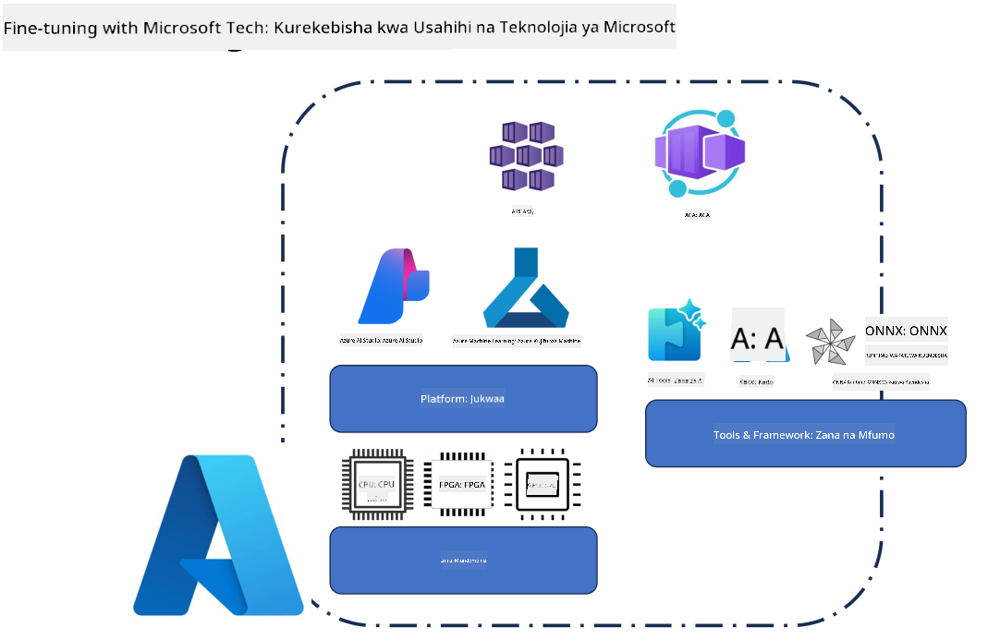
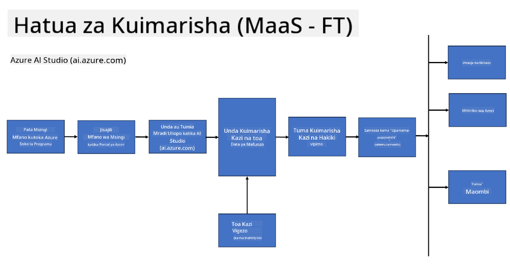
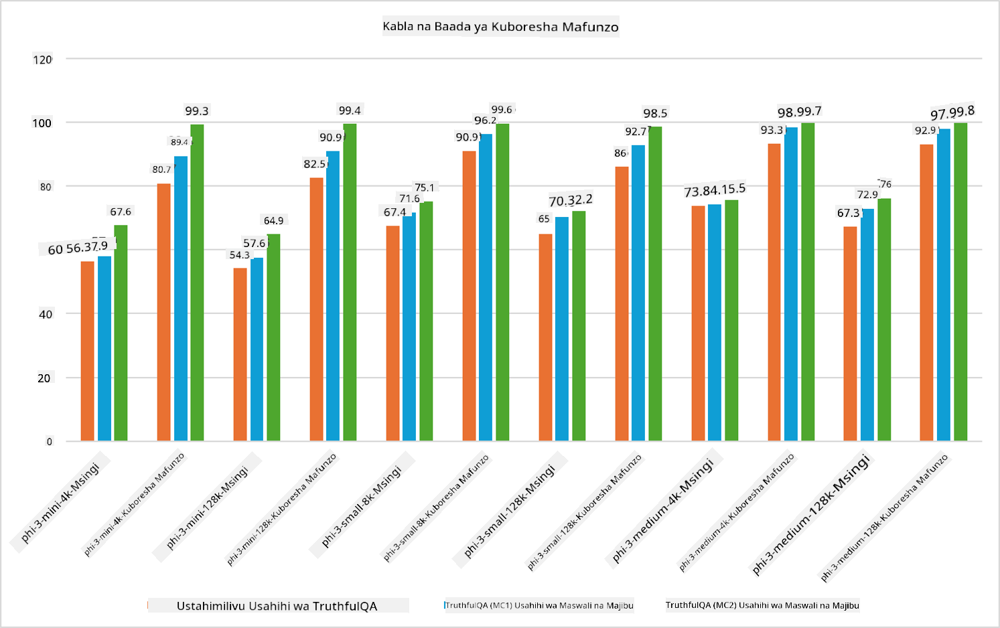

<!--
CO_OP_TRANSLATOR_METADATA:
{
  "original_hash": "cb5648935f63edc17e95ce38f23adc32",
  "translation_date": "2025-05-09T21:57:13+00:00",
  "source_file": "md/03.FineTuning/FineTuning_Scenarios.md",
  "language_code": "sw"
}
-->
## Mienendo ya Urekebishaji

**Jukwaa** Hii inajumuisha teknolojia mbalimbali kama Azure AI Foundry, Azure Machine Learning, AI Tools, Kaito, na ONNX Runtime.

**Miundombinu** Hii inajumuisha CPU na FPGA, ambazo ni muhimu kwa mchakato wa urekebishaji. Acha nikuonyeshe alama za kila teknolojia hizi.

**Zana & Mfumo** Hii inajumuisha ONNX Runtime na ONNX Runtime. Acha nikuonyeshe alama za kila teknolojia hizi.
[Ingiza alama za ONNX Runtime na ONNX Runtime]

Mchakato wa urekebishaji kwa teknolojia za Microsoft unahusisha vipengele na zana mbalimbali. Kwa kuelewa na kutumia teknolojia hizi, tunaweza kurekebisha kwa ufanisi programu zetu na kuunda suluhisho bora.

## Mfano kama Huduma

Rekebisha mfano kwa kutumia urekebishaji uliopangwa, bila hitaji la kuunda na kusimamia kompyuta.

Urekebishaji usio na seva unapatikana kwa mifano ya Phi-3-mini na Phi-3-medium, kuruhusu waendelezaji kurekebisha mifano kwa haraka na kwa urahisi kwa hali za wingu na edge bila hitaji la kupanga kompyuta. Pia tumezitangaza kuwa, Phi-3-small, sasa inapatikana kupitia huduma yetu ya Models-as-a-Service ili waendelezaji waweze kuanza haraka na kwa urahisi maendeleo ya AI bila kusimamia miundombinu ya chini.

## Mfano kama Jukwaa

Watumiaji husimamia kompyuta zao wenyewe ili kurekebisha mifano yao.

[Fine Tuning Sample](https://github.com/Azure/azureml-examples/blob/main/sdk/python/foundation-models/system/finetune/chat-completion/chat-completion.ipynb)

## Mienendo ya Urekebishaji

| | | | | | | |
|-|-|-|-|-|-|-|
|Mienendo|LoRA|QLoRA|PEFT|DeepSpeed|ZeRO|DORA|
|Kurekebisha LLM zilizofunzwa awali kwa kazi maalum au maeneo|Ndiyo|Ndiyo|Ndiyo|Ndiyo|Ndiyo|Ndiyo|
|Urekebishaji kwa kazi za NLP kama uainishaji wa maandishi, utambuzi wa majina, na tafsiri ya mashine|Ndiyo|Ndiyo|Ndiyo|Ndiyo|Ndiyo|Ndiyo|
|Urekebishaji kwa kazi za QA|Ndiyo|Ndiyo|Ndiyo|Ndiyo|Ndiyo|Ndiyo|
|Urekebishaji kwa kuzalisha majibu yanayofanana na ya binadamu katika chatbots|Ndiyo|Ndiyo|Ndiyo|Ndiyo|Ndiyo|Ndiyo|
|Urekebishaji kwa kuzalisha muziki, sanaa, au aina nyingine za ubunifu|Ndiyo|Ndiyo|Ndiyo|Ndiyo|Ndiyo|Ndiyo|
|Kupunguza gharama za kihesabu na kifedha|Ndiyo|Ndiyo|Hapana|Ndiyo|Ndiyo|Hapana|
|Kupunguza matumizi ya kumbukumbu|Hapana|Ndiyo|Hapana|Ndiyo|Ndiyo|Ndiyo|
|Kutumia vigezo vichache kwa urekebishaji bora|Hapana|Ndiyo|Ndiyo|Hapana|Hapana|Ndiyo|
|Aina ya ulinganifu wa data yenye ufanisi wa kumbukumbu inayotoa ufikiaji wa kumbukumbu ya jumla ya GPU zote zilizopo|Hapana|Hapana|Hapana|Ndiyo|Ndiyo|Ndiyo|

## Mifano ya Utendaji wa Urekebishaji

**Kielelezo cha Majukumu**:  
Hati hii imetafsiriwa kwa kutumia huduma ya tafsiri ya AI [Co-op Translator](https://github.com/Azure/co-op-translator). Ingawa tunajitahidi kwa usahihi, tafadhali fahamu kuwa tafsiri za kiotomatiki zinaweza kuwa na makosa au upungufu wa usahihi. Hati asili katika lugha yake ya asili inapaswa kuchukuliwa kama chanzo cha mamlaka. Kwa taarifa muhimu, tafsiri ya kitaalamu ya binadamu inashauriwa. Hatuna dhamana kwa kutoelewana au tafsiri potofu zinazotokana na matumizi ya tafsiri hii.