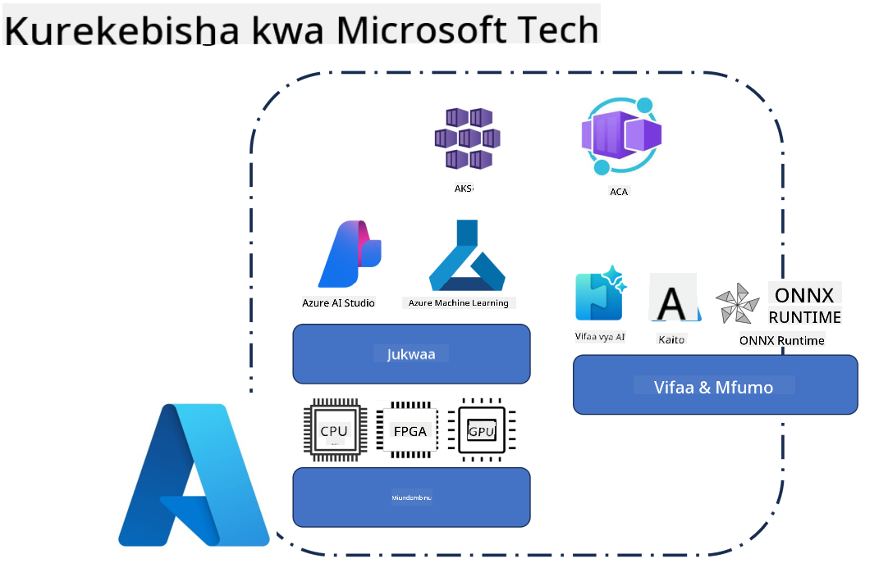
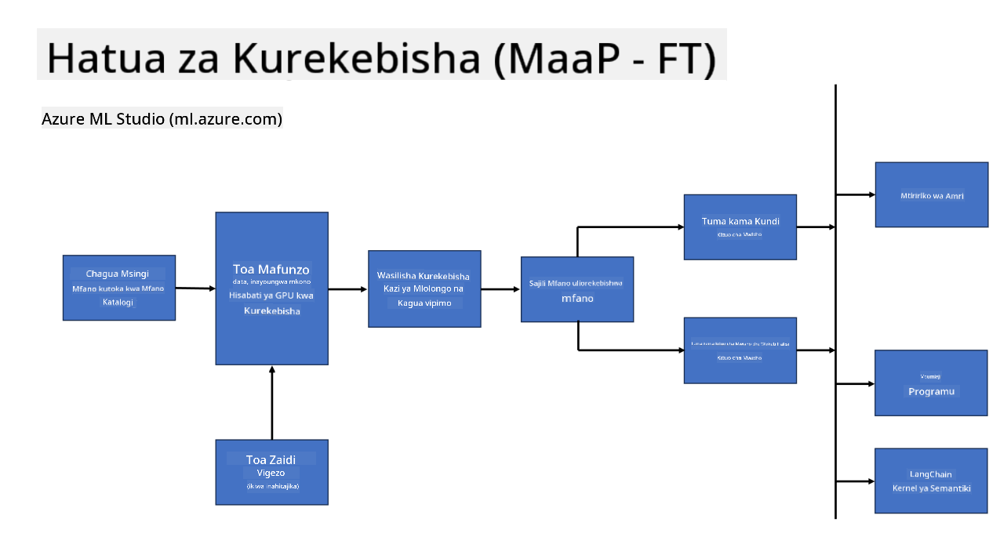
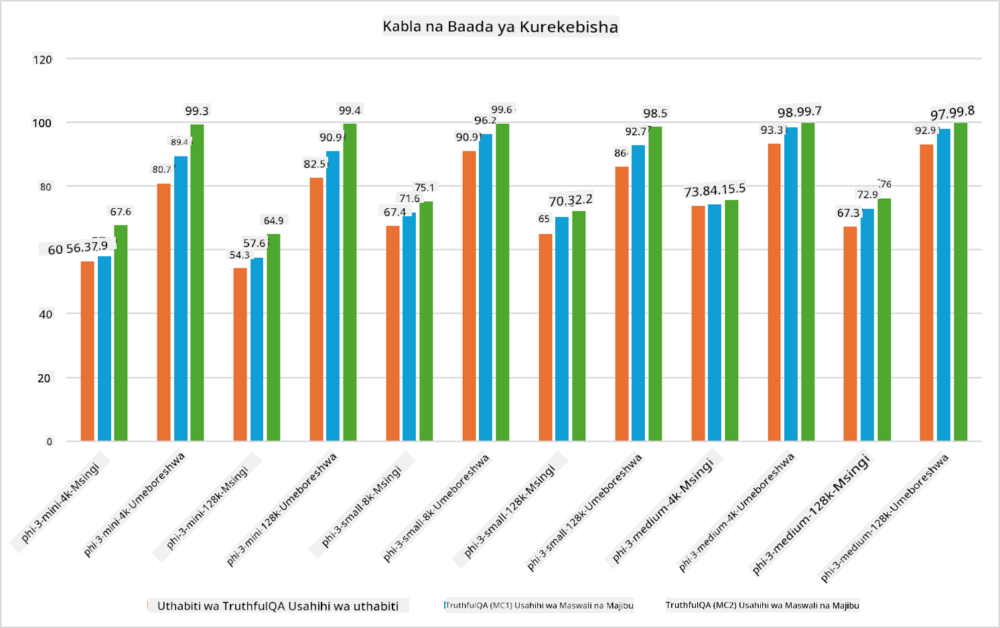

<!--
CO_OP_TRANSLATOR_METADATA:
{
  "original_hash": "cb5648935f63edc17e95ce38f23adc32",
  "translation_date": "2025-07-17T08:29:29+00:00",
  "source_file": "md/03.FineTuning/FineTuning_Scenarios.md",
  "language_code": "sw"
}
-->
## Hali za Urekebishaji wa Kina

**Jukwaa** Hii inajumuisha teknolojia mbalimbali kama Azure AI Foundry, Azure Machine Learning, AI Tools, Kaito, na ONNX Runtime.

**Miundombinu** Hii inajumuisha CPU na FPGA, ambazo ni muhimu kwa mchakato wa urekebishaji wa kina. Nikuonyeshe alama za kila moja ya teknolojia hizi.

**Zana na Mfumo** Hii inajumuisha ONNX Runtime na ONNX Runtime. Nikuonyeshe alama za kila moja ya teknolojia hizi.  
[Ingiza alama za ONNX Runtime na ONNX Runtime]

Mchakato wa urekebishaji wa kina kwa kutumia teknolojia za Microsoft unahusisha vipengele na zana mbalimbali. Kwa kuelewa na kutumia teknolojia hizi, tunaweza kurekebisha kwa ufanisi programu zetu na kuunda suluhisho bora zaidi.

## Mfano kama Huduma

Rekebisha mfano kwa kutumia urekebishaji uliowekwa, bila haja ya kuunda na kusimamia kompyuta.

Urekebishaji usio na seva unapatikana kwa mifano ya Phi-3-mini na Phi-3-medium, ukiruhusu watengenezaji kubinafsisha mifano kwa haraka na kwa urahisi kwa hali za wingu na edge bila kuhitaji kupanga kompyuta. Pia tumetangaza kuwa, Phi-3-small, sasa inapatikana kupitia huduma yetu ya Models-as-a-Service ili watengenezaji waanze haraka na kwa urahisi maendeleo ya AI bila kusimamia miundombinu ya msingi.

## Mfano kama Jukwaa

Watumiaji husimamia kompyuta zao wenyewe ili kurekebisha mifano yao.

[Mfano wa Urekebishaji wa Kina](https://github.com/Azure/azureml-examples/blob/main/sdk/python/foundation-models/system/finetune/chat-completion/chat-completion.ipynb)

## Hali za Urekebishaji wa Kina

| | | | | | | |
|-|-|-|-|-|-|-|
|Hali|LoRA|QLoRA|PEFT|DeepSpeed|ZeRO|DORA|
|Kurekebisha LLM zilizofunzwa awali kwa kazi au maeneo maalum|Ndiyo|Ndiyo|Ndiyo|Ndiyo|Ndiyo|Ndiyo|
|Urekebishaji kwa kazi za NLP kama uainishaji wa maandishi, utambuzi wa vitu vilivyopewa majina, na tafsiri ya mashine|Ndiyo|Ndiyo|Ndiyo|Ndiyo|Ndiyo|Ndiyo|
|Urekebishaji kwa kazi za QA|Ndiyo|Ndiyo|Ndiyo|Ndiyo|Ndiyo|Ndiyo|
|Urekebishaji kwa kuzalisha majibu yanayofanana na ya binadamu katika chatbots|Ndiyo|Ndiyo|Ndiyo|Ndiyo|Ndiyo|Ndiyo|
|Urekebishaji kwa kuzalisha muziki, sanaa, au aina nyingine za ubunifu|Ndiyo|Ndiyo|Ndiyo|Ndiyo|Ndiyo|Ndiyo|
|Kupunguza gharama za kompyuta na kifedha|Ndiyo|Ndiyo|Hapana|Ndiyo|Ndiyo|Hapana|
|Kupunguza matumizi ya kumbukumbu|Hapana|Ndiyo|Hapana|Ndiyo|Ndiyo|Ndiyo|
|Kutumia vigezo vichache kwa urekebishaji wenye ufanisi|Hapana|Ndiyo|Ndiyo|Hapana|Hapana|Ndiyo|
|Aina ya ufanisi wa kumbukumbu wa usambazaji wa data inayotoa ufikiaji wa jumla ya kumbukumbu ya GPU za vifaa vyote vya GPU vinavyopatikana|Hapana|Hapana|Hapana|Ndiyo|Ndiyo|Ndiyo|

## Mifano ya Utendaji wa Urekebishaji wa Kina

**Kiarifu cha Msamaha**:  
Hati hii imetafsiriwa kwa kutumia huduma ya tafsiri ya AI [Co-op Translator](https://github.com/Azure/co-op-translator). Ingawa tunajitahidi kuhakikisha usahihi, tafadhali fahamu kwamba tafsiri za kiotomatiki zinaweza kuwa na makosa au upungufu wa usahihi. Hati ya asili katika lugha yake ya asili inapaswa kuchukuliwa kama chanzo cha mamlaka. Kwa taarifa muhimu, tafsiri ya kitaalamu inayofanywa na binadamu inashauriwa. Hatubebwi dhamana kwa kutoelewana au tafsiri potofu zinazotokana na matumizi ya tafsiri hii.