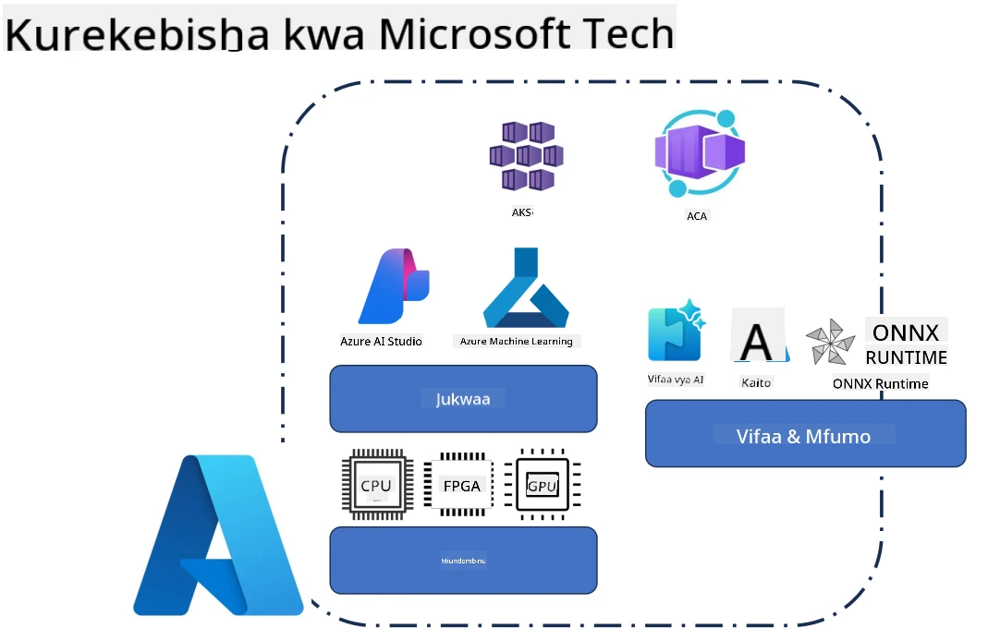
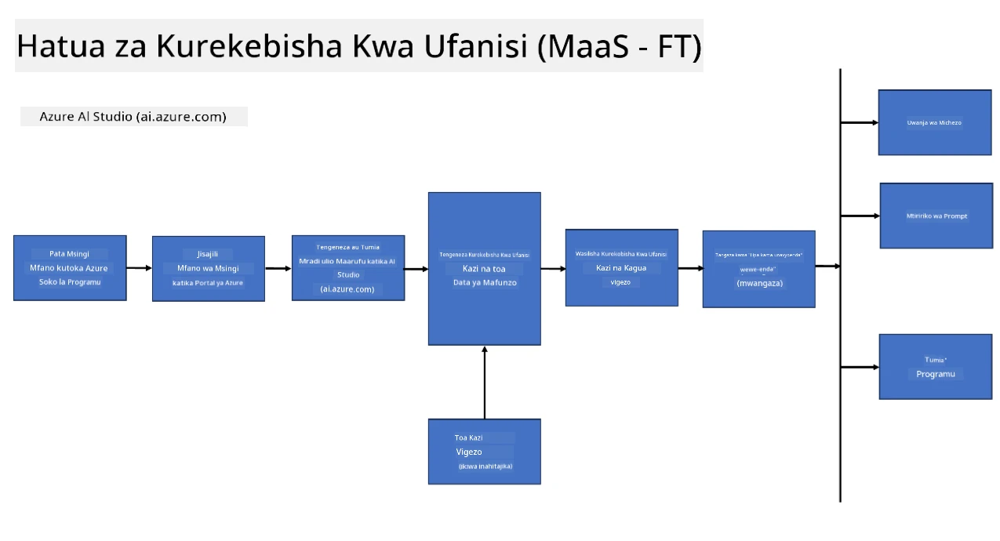
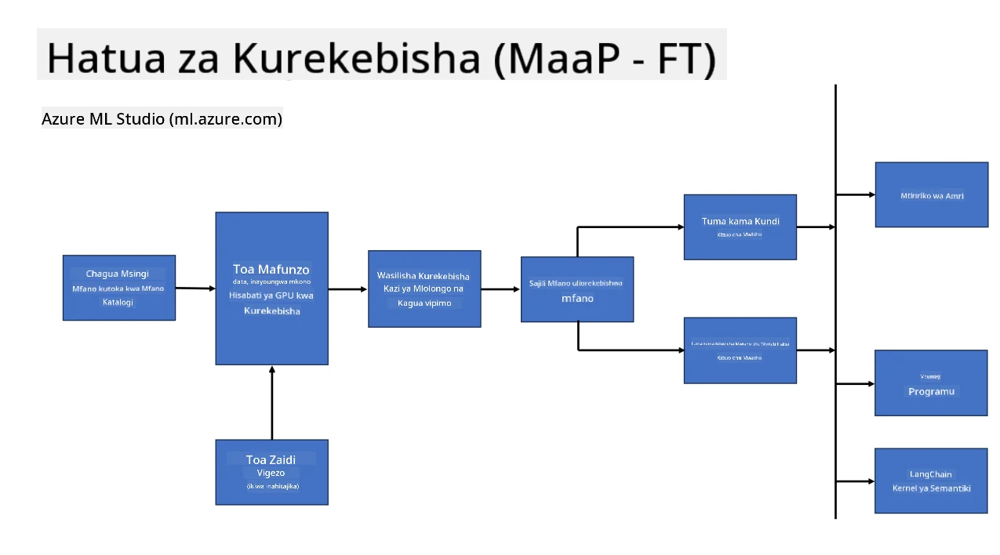
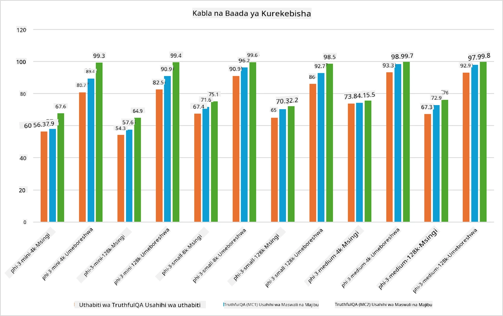

## Mifano ya Urekebishaji wa Modeli

Sehemu hii inatoa muhtasari wa mifano ya urekebishaji wa modeli katika Microsoft Foundry na mazingira ya Azure, ikiwa ni pamoja na mifano ya utoaji, tabaka za miundombinu, na mbinu za uboreshaji zinazotumika mara kwa mara.

**Platform**  
Hii inajumuisha huduma zilizotendewa kama Microsoft Foundry (hapo awali Azure AI Foundry) na Azure Machine Learning, ambazo zinatoa usimamizi wa modeli, upangaji, ufuatiliaji wa majaribio, na mifumo ya kazi za utumaji.

**Infrastructure**  
Urekebishaji unahitaji rasilimali za kompyuta zinazoweza kupanuka. Katika mazingira ya Azure, hii kwa kawaida inajumuisha mashine pepe zenye GPU na rasilimali za CPU kwa mzigo wa kazi mwepesi, pamoja na uhifadhi unaoweza kupanuka kwa seti za data na alama za kuhifadhi (checkpoints).

**Vyombo na Mifumo**  
Mifumo ya kazi ya urekebishaji kawaida hutegemea mifumo na maktaba za uboreshaji kama Hugging Face Transformers, DeepSpeed, na PEFT (Urekebishaji wa Vigezo Uliofanisi).

Mchakato wa urekebishaji kwa teknolojia za Microsoft unashughulikia huduma za jukwaa, miundombinu ya kompyuta, na mifumo ya mafunzo. Kwa kuelewa jinsi vipengele hivi vinavyofanya kazi pamoja, watengenezaji wanaweza kurekebisha kwa ufanisi modeli za msingi kwa kazi maalum na mazingira ya uzalishaji.

## Modeli kama Huduma

Fanya urekebishaji wa modeli kwa kutumia urekebishaji uliowekwa, bila hitaji la kuunda na kusimamia kompyuta.

Urekebishaji bila server sasa upo kwa familia za modeli za Phi-3, Phi-3.5, na Phi-4, ukiwawezesha watengenezaji kuharakisha na kurahisisha kubadilisha modeli kwa mazingira ya wingu na edge bila lazima wapange kompyuta.

## Modeli kama Jukwaa 

Watumiaji husimamia kompyuta zao ili kufanya Urekebishaji wa modeli zao.

[Mfano wa Urekebishaji](https://github.com/Azure/azureml-examples/blob/main/sdk/python/foundation-models/system/finetune/chat-completion/chat-completion.ipynb)

## Ulinganisho wa Mbinu za Urekebishaji

|Senario|LoRA|QLoRA|PEFT|DeepSpeed|ZeRO|DoRA|
|---|---|---|---|---|---|---|
|Kurekebisha LLM zilizo tayari kufunzwa kwa kazi maalum au sekta|Ndiyo|Ndiyo|Ndiyo|Ndiyo|Ndiyo|Ndiyo|
|Urekebishaji kwa kazi za NLP kama uainishaji wa maandishi, utambuzi wa entiti zilizopewa jina, na tafsiri ya mashine|Ndiyo|Ndiyo|Ndiyo|Ndiyo|Ndiyo|Ndiyo|
|Urekebishaji kwa kazi za QA|Ndiyo|Ndiyo|Ndiyo|Ndiyo|Ndiyo|Ndiyo|
|Urekebishaji kwa ajili ya kuzalisha majibu yanayofanana na ya binadamu katika roboti za mazungumzo|Ndiyo|Ndiyo|Ndiyo|Ndiyo|Ndiyo|Ndiyo|
|Urekebishaji kwa kuzalisha muziki, sanaa, au aina nyingine za ubunifu|Ndiyo|Ndiyo|Ndiyo|Ndiyo|Ndiyo|Ndiyo|
|Kupunguza gharama za kihesabu na kifedha|Ndiyo|Ndiyo|Ndiyo|Ndiyo|Ndiyo|Ndiyo|
|Kupunguza matumizi ya kumbukumbu|Ndiyo|Ndiyo|Ndiyo|Ndiyo|Ndiyo|Ndiyo|
|Kutumia vigezo vichache kwa urekebishaji wenye ufanisi|Ndiyo|Ndiyo|Ndiyo|Hapana|Hapana|Ndiyo|
|Aina ya ulandanishi wa data inayotumia kumbukumbu kwa ufanisi ambayo inatoa ufikiaji wa jumla ya kumbukumbu za GPU za vifaa vyote vya GPU vinavyopatikana|Hapana|Hapana|Hapana|Ndiyo|Ndiyo|Hapana|

> [!NOTE]
> LoRA, QLoRA, PEFT, na DoRA ni mbinu za urekebishaji zinazotumia vigezo kwa ufanisi, ilhali DeepSpeed na ZeRO zinazingatia mafunzo yaliogawanywa na uboreshaji wa kumbukumbu.

## Mifano ya Utendaji wa Urekebishaji

---

<!-- CO-OP TRANSLATOR DISCLAIMER START -->
Tamko la Kutowajibika:
Nyaraka hii imetatuliwa/imetafsiriwa kwa kutumia huduma ya tafsiri ya AI [Co-op Translator](https://github.com/Azure/co-op-translator). Ingawa tunajitahidi kuhakikisha usahihi, tafadhali fahamu kwamba tafsiri za kiotomatiki zinaweza kuwa na makosa au ukosefu wa usahihi. Nyaraka ya asili katika lugha yake ya asili inapaswa kuchukuliwa kama chanzo chenye mamlaka. Kwa taarifa muhimu, inashauriwa kutumia tafsiri iliyoendeshwa na mtaalamu wa kibinadamu. Hatuwajibiki kwa kutoelewana au tafsiri zisizo sahihi zitokanazo na matumizi ya tafsiri hii.
<!-- CO-OP TRANSLATOR DISCLAIMER END -->