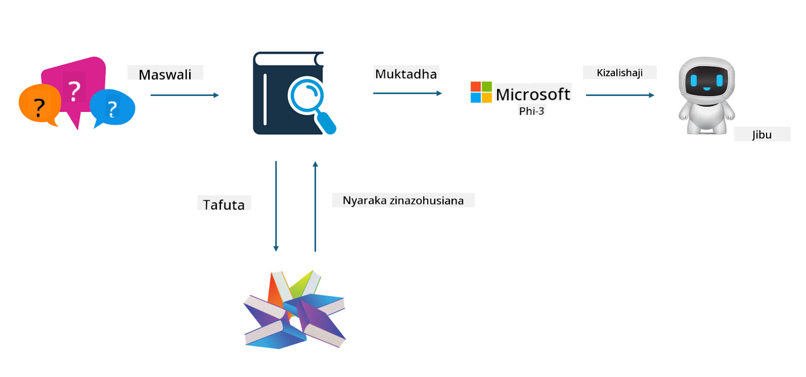

<!--
CO_OP_TRANSLATOR_METADATA:
{
  "original_hash": "e4e010400c2918557b36bb932a14004c",
  "translation_date": "2025-05-09T22:16:51+00:00",
  "source_file": "md/03.FineTuning/FineTuning_vs_RAG.md",
  "language_code": "sw"
}
-->
## Finetuning vs RAG

## Retrieval Augmented Generation

RAG ni mchakato wa kupata data pamoja na uundaji wa maandishi. Data zilizopangwa na zisizopangwa za kampuni huhifadhiwa kwenye hifadhidata ya vector. Wakati wa kutafuta maudhui yanayohusiana, muhtasari na maudhui yanayohusiana hupatikana kuunda muktadha, na uwezo wa kukamilisha maandishi wa LLM/SLM hutumika kuunda maudhui.

## Mchakato wa RAG

## Fine-tuning
Fine-tuning inajengwa juu ya kuboresha mfano fulani. Hainahitaji kuanzia kwenye algorithm ya mfano, lakini data inahitaji kuendelea kukusanywa. Ikiwa unataka istilahi sahihi zaidi na maelezo ya lugha katika matumizi ya sekta, fine-tuning ni chaguo bora kwako. Lakini kama data yako hubadilika mara kwa mara, fine-tuning inaweza kuwa ngumu.

## Jinsi ya kuchagua
Kama jibu letu linahitaji kuingiza data za nje, RAG ndiyo chaguo bora.

Kama unahitaji kutoa maarifa thabiti na sahihi ya sekta, fine-tuning itakuwa chaguo zuri. RAG inalenga kupata maudhui yanayohusiana lakini huenda isiwafikie mara zote nuances maalum.

Fine-tuning inahitaji seti ya data yenye ubora wa juu, na kama ni data ndogo tu, haitakuwa na tofauti kubwa. RAG ni rahisi kubadilika.

Fine-tuning ni sanduku zito, ni mambo ya siri, na ni vigumu kuelewa jinsi inavyofanya kazi ndani. Lakini RAG inaweza kusaidia kwa urahisi kupata chanzo cha data, hivyo kurekebisha kwa ufanisi mawazo potofu au makosa ya maudhui na kutoa uwazi zaidi.

**Kiondoa lawama**:  
Nyaraka hii imetafsiriwa kwa kutumia huduma ya utafsiri wa AI [Co-op Translator](https://github.com/Azure/co-op-translator). Ingawa tunajitahidi kwa usahihi, tafadhali fahamu kwamba tafsiri za moja kwa moja zinaweza kuwa na makosa au upungufu wa usahihi. Nyaraka asili katika lugha yake ya asili inapaswa kuzingatiwa kama chanzo cha mamlaka. Kwa taarifa muhimu, tafsiri ya kitaalamu inayofanywa na binadamu inapendekezwa. Hatubebeki lawama kwa kutoelewana au tafsiri potofu zinazotokana na matumizi ya tafsiri hii.