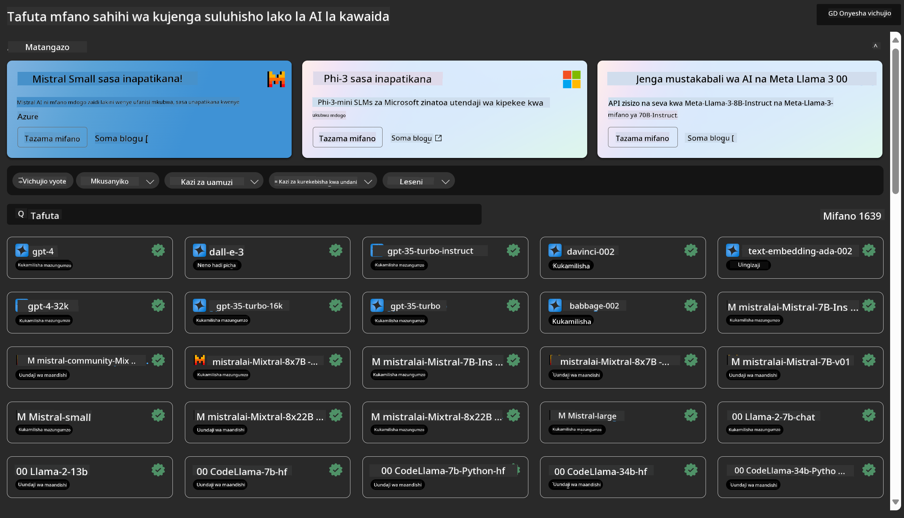
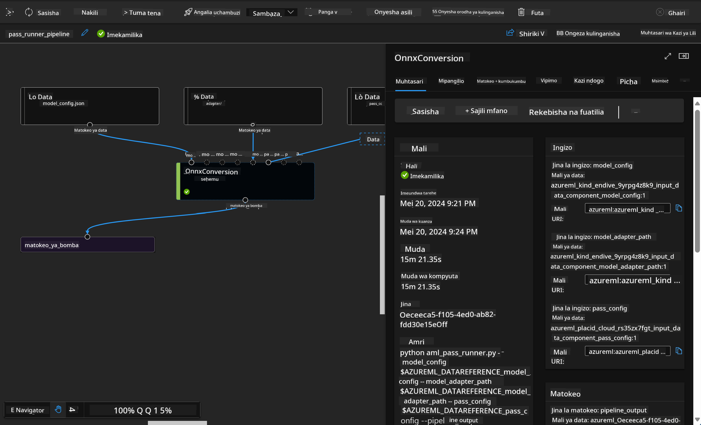

<!--
CO_OP_TRANSLATOR_METADATA:
{
  "original_hash": "7fe541373802e33568e94e13226d463c",
  "translation_date": "2025-07-17T09:46:24+00:00",
  "source_file": "md/03.FineTuning/Introduce_AzureML.md",
  "language_code": "sw"
}
-->
# **Tambulisha Huduma ya Azure Machine Learning**

[Azure Machine Learning](https://ml.azure.com?WT.mc_id=aiml-138114-kinfeylo) ni huduma ya wingu inayolenga kuharakisha na kusimamia mzunguko wa maisha wa miradi ya kujifunza kwa mashine (ML).

Wataalamu wa ML, wanasayansi wa data, na wahandisi wanaweza kuitumia katika shughuli zao za kila siku ili:

- Kufundisha na kupeleka mifano.
- Kusimamia shughuli za kujifunza kwa mashine (MLOps).
- Unaweza kuunda mfano katika Azure Machine Learning au kutumia mfano uliotengenezwa kutoka jukwaa la chanzo huria, kama PyTorch, TensorFlow, au scikit-learn.
- Zana za MLOps zinakusaidia kufuatilia, kufundisha upya, na kupeleka mifano tena.

## Azure Machine Learning ni kwa nani?

**Wanasayansi wa Data na Wahandisi wa ML**

Wanaweza kutumia zana kuharakisha na kuendesha shughuli zao za kila siku kwa urahisi.
Azure ML hutoa vipengele vya usawa, ufafanuzi, ufuatiliaji, na ukaguzi.
Waendelezaji wa Programu:
Wanaweza kuingiza mifano ndani ya programu au huduma kwa urahisi.

**Waendelezaji wa Jukwaa**

Wana upatikanaji wa seti thabiti ya zana zinazotegemea API za Azure Resource Manager zenye uimara.
Zana hizi zinawawezesha kujenga zana za hali ya juu za ML.

**Makampuni**

Wakiwa katika wingu la Microsoft Azure, makampuni yanapata faida ya usalama unaojulikana na udhibiti wa upatikanaji kwa misingi ya majukumu.
Weka mipango ili kudhibiti upatikanaji wa data iliyo salama na shughuli maalum.

## Uzalishaji kwa Kila Mtu Kwenye Timu
Miradi ya ML mara nyingi inahitaji timu yenye ujuzi tofauti ili kujenga na kudumisha.

Azure ML hutoa zana zinazokuwezesha:
- Kushirikiana na timu yako kupitia daftari za pamoja, rasilimali za kompyuta, kompyuta isiyo na seva, data, na mazingira.
- Kuendeleza mifano yenye usawa, ufafanuzi, ufuatiliaji, na ukaguzi ili kutimiza mahitaji ya asili na ukaguzi.
- Kupeleka mifano ya ML haraka na kwa urahisi kwa kiwango kikubwa, na kuisimamia na kuiongoza kwa ufanisi kwa MLOps.
- Kuendesha kazi za kujifunza kwa mashine mahali popote kwa udhibiti, usalama, na ufuatiliaji uliojengwa ndani.

## Zana za Jukwaa Zinazolingana Kwenye Mipaka

Kila mtu katika timu ya ML anaweza kutumia zana anazopendelea kumaliza kazi.
Iwe unafanya majaribio ya haraka, kurekebisha hyperparameters, kujenga mistari ya kazi, au kusimamia makisio, unaweza kutumia interfaces unazozijua zikiwemo:
- Azure Machine Learning Studio
- Python SDK (v2)
- Azure CLI (v2)
- Azure Resource Manager REST APIs

Unapoboresha mifano na kushirikiana katika mzunguko mzima wa maendeleo, unaweza kushiriki na kupata mali, rasilimali, na vipimo ndani ya UI ya Azure Machine Learning studio.

## **LLM/SLM katika Azure ML**

Azure ML imeongeza kazi nyingi zinazohusiana na LLM/SLM, ikichanganya LLMOps na SLMOps kuunda jukwaa la teknolojia ya akili bandia ya kizazi kwa kiwango cha kampuni nzima.

### **Katalogi ya Mifano**

Watumiaji wa kampuni wanaweza kupeleka mifano tofauti kulingana na hali tofauti za biashara kupitia Katalogi ya Mifano, na kutoa huduma kama Mfano kama Huduma kwa waendelezaji wa kampuni au watumiaji kufikia.

Katalogi ya Mifano katika Azure Machine Learning studio ni kitovu cha kugundua na kutumia aina mbalimbali za mifano zinazokuwezesha kujenga programu za AI za kizazi. Katalogi ya mfano ina mamia ya mifano kutoka kwa watoa huduma kama Azure OpenAI service, Mistral, Meta, Cohere, Nvidia, Hugging Face, pamoja na mifano iliyofunzwa na Microsoft. Mifano kutoka kwa watoa huduma wengine isipokuwa Microsoft ni Bidhaa zisizo za Microsoft, kama ilivyoainishwa katika Masharti ya Bidhaa ya Microsoft, na zinatawaliwa na masharti yaliyotolewa pamoja na mfano.

### **Mtiririko wa Kazi**

Msingi wa mtiririko wa kazi wa kujifunza kwa mashine ni kugawanya kazi kamili ya kujifunza kwa mashine kuwa mchakato wa hatua nyingi. Kila hatua ni sehemu inayoweza kusimamiwa ambayo inaweza kuendelezwa, kuboreshwa, kusanidiwa, na kuendeshwa kiotomatiki kwa mtu mmoja mmoja. Hatua hizi zinaunganishwa kupitia interfaces zilizo wazi. Huduma ya mtiririko wa kazi ya Azure Machine Learning inaandaa moja kwa moja utegemezi wote kati ya hatua za mtiririko.

Katika kurekebisha kwa kina SLM / LLM, tunaweza kusimamia data zetu, mafunzo, na michakato ya uzalishaji kupitia Mtiririko wa Kazi.

### **Mtiririko wa Prompt**

Faida za kutumia mtiririko wa prompt wa Azure Machine Learning  
Mtiririko wa prompt wa Azure Machine Learning hutoa faida mbalimbali zinazosaidia watumiaji kuhamia kutoka kwa mawazo hadi majaribio na, hatimaye, programu za LLM zinazotegemewa kwa uzalishaji:

**Uwezo wa uhandisi wa prompt**

Uzoefu wa uandishi wa maingiliano: Mtiririko wa prompt wa Azure Machine Learning hutoa mwonekano wa muundo wa mtiririko, kuruhusu watumiaji kuelewa na kuvinjari miradi yao kwa urahisi. Pia hutoa uzoefu wa kuandika kama daftari kwa maendeleo na utatuzi wa mtiririko kwa ufanisi.  
Tofauti za kurekebisha prompt: Watumiaji wanaweza kuunda na kulinganisha toleo mbalimbali za prompt, kuwezesha mchakato wa marekebisho ya hatua kwa hatua.

Tathmini: Mitiririko ya tathmini iliyojengwa ndani inawawezesha watumiaji kutathmini ubora na ufanisi wa prompt na mitiririko yao.

Rasilimali kamili: Mtiririko wa prompt wa Azure Machine Learning unajumuisha maktaba ya zana zilizojengwa, sampuli, na templeti zinazotumika kama msingi wa maendeleo, kuhamasisha ubunifu na kuharakisha mchakato.

**Uko tayari kwa kampuni kwa programu za LLM**

Ushirikiano: Mtiririko wa prompt wa Azure Machine Learning unaunga mkono ushirikiano wa timu, kuruhusu watumiaji wengi kufanya kazi pamoja kwenye miradi ya uhandisi wa prompt, kushirikiana maarifa, na kudumisha udhibiti wa matoleo.

Jukwaa la kila kitu kwa pamoja: Mtiririko wa prompt wa Azure Machine Learning hufanya mchakato mzima wa uhandisi wa prompt kuwa rahisi, kutoka maendeleo na tathmini hadi upeleka na ufuatiliaji. Watumiaji wanaweza kupeleka mitiririko yao kama vituo vya Azure Machine Learning na kufuatilia utendaji wao kwa wakati halisi, kuhakikisha uendeshaji bora na maboresho endelevu.

Suluhisho za Uko Tayari wa Kampuni za Azure Machine Learning: Mtiririko wa prompt unatumia suluhisho thabiti za Azure Machine Learning za uko tayari wa kampuni, ukitoa msingi salama, unaoweza kupanuka, na wa kuaminika kwa maendeleo, majaribio, na upeleka wa mitiririko.

Kwa mtiririko wa prompt wa Azure Machine Learning, watumiaji wanaweza kuonyesha uwezo wao wa uhandisi wa prompt, kushirikiana kwa ufanisi, na kutumia suluhisho za kiwango cha kampuni kwa maendeleo na upeleka wa programu za LLM kwa mafanikio.

Kwa kuunganisha nguvu za kompyuta, data, na vipengele tofauti vya Azure ML, waendelezaji wa kampuni wanaweza kwa urahisi kujenga programu zao za akili bandia.

**Kiarifu cha Kutotegemea**:  
Hati hii imetafsiriwa kwa kutumia huduma ya tafsiri ya AI [Co-op Translator](https://github.com/Azure/co-op-translator). Ingawa tunajitahidi kwa usahihi, tafadhali fahamu kuwa tafsiri za kiotomatiki zinaweza kuwa na makosa au upungufu wa usahihi. Hati ya asili katika lugha yake ya asili inapaswa kuchukuliwa kama chanzo cha mamlaka. Kwa taarifa muhimu, tafsiri ya kitaalamu inayofanywa na binadamu inapendekezwa. Hatubebei dhamana kwa kutoelewana au tafsiri potofu zinazotokana na matumizi ya tafsiri hii.