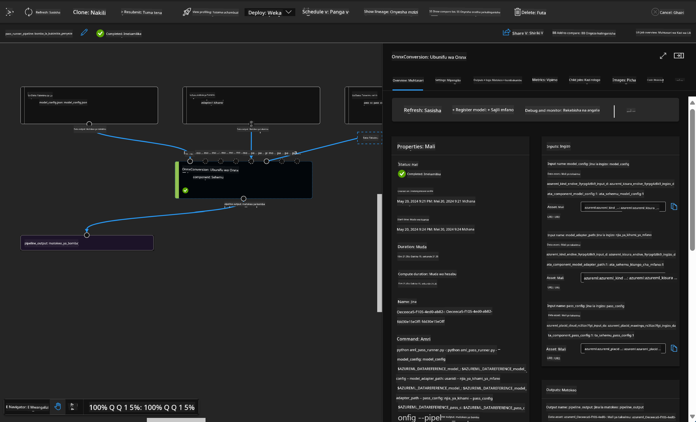

<!--
CO_OP_TRANSLATOR_METADATA:
{
  "original_hash": "7fe541373802e33568e94e13226d463c",
  "translation_date": "2025-05-09T22:22:54+00:00",
  "source_file": "md/03.FineTuning/Introduce_AzureML.md",
  "language_code": "sw"
}
-->
# **Tambulisha Huduma ya Azure Machine Learning**

[Azure Machine Learning](https://ml.azure.com?WT.mc_id=aiml-138114-kinfeylo) ni huduma ya wingu inayolenga kuharakisha na kusimamia mzunguko wa maisha wa mradi wa kujifunza mashine (ML).

Wataalamu wa ML, wanasayansi wa data, na wahandisi wanaweza kuitumia katika shughuli zao za kila siku ili:

- Kufundisha na kuweka mifano.
- Kusimamia shughuli za kujifunza mashine (MLOps).
- Unaweza kuunda mfano katika Azure Machine Learning au kutumia mfano uliojengwa kutoka jukwaa la chanzo huria, kama PyTorch, TensorFlow, au scikit-learn.
- Zana za MLOps zinakusaidia kufuatilia, kufundisha upya, na kuweka mifano tena.

## Azure Machine Learning ni kwa nani?

**Wanasayansi wa Data na Wahandisi wa ML**

Wanaweza kutumia zana za kuharakisha na kuendesha kazi zao za kila siku kiotomatiki.
Azure ML hutoa vipengele vya usawa, ufafanuzi, ufuatiliaji, na uhakiki.
**Waendelezaji wa Programu:**
Wanaweza kuunganisha mifano katika programu au huduma kwa urahisi.

**Waendelezaji wa Jukwaa**

Wana upatikanaji wa seti imara ya zana zinazoungwa mkono na API za Azure Resource Manager zenye uimara.
Zana hizi zinawawezesha kujenga zana za ML za hali ya juu.

**Makampuni**

Wakiwa kwenye wingu la Microsoft Azure, makampuni yanafaidika na usalama unaojulikana na udhibiti wa upatikanaji kulingana na majukumu.
Weka mipango kudhibiti upatikanaji wa data iliyo salama na shughuli maalum.

## Uzalishaji kwa Kila Mtu Kwenye Timu
Miradi ya ML mara nyingi inahitaji timu yenye ujuzi tofauti kuijenga na kuendeleza.

Azure ML hutoa zana zinazokuwezesha:
- Kushirikiana na timu yako kupitia daftari za kumbukumbu zilizosambazwa, rasilimali za kompyuta, kompyuta isiyo na seva, data, na mazingira.
- Kuendeleza mifano yenye usawa, ufafanuzi, ufuatiliaji, na uhakiki ili kutimiza mahitaji ya urithi na uthibitishaji.
- Kuweka mifano ya ML haraka na kwa urahisi kwa kiwango kikubwa, na kuisimamia na kuiondoa kwa ufanisi kwa MLOps.
- Kuendesha kazi za kujifunza mashine mahali popote kwa udhibiti, usalama, na ulinganifu uliyojengwa ndani.

## Zana za Jukwaa Zinazofanya Kazi Kwenye Majukwaa Mbalimbali

Kila mtu kwenye timu ya ML anaweza kutumia zana anazozipenda kufanya kazi.
Iwe unafanya majaribio ya haraka, kuboresha vigezo, kujenga mistari ya kazi, au kusimamia makisio, unaweza kutumia interfaces unazozijua ikiwemo:
- Azure Machine Learning Studio
- Python SDK (v2)
- Azure CLI (v2)
- Azure Resource Manager REST APIs

Unapoboresha mifano na kushirikiana katika mzunguko wa maendeleo, unaweza kushiriki na kupata mali, rasilimali, na vipimo ndani ya UI ya Azure Machine Learning studio.

## **LLM/SLM katika Azure ML**

Azure ML imeongeza kazi nyingi zinazohusiana na LLM/SLM, ikichanganya LLMOps na SLMOps kuunda jukwaa la teknolojia ya akili bandia ya kizazi kwa kiwango cha shirika.

### **Katalogi ya Mfano**

Watumiaji wa shirika wanaweza kuweka mifano tofauti kulingana na hali tofauti za biashara kupitia Katalogi ya Mfano, na kutoa huduma kama Mfano kama Huduma kwa waendelezaji au watumiaji wa shirika kufikia.

Katalogi ya Mfano katika Azure Machine Learning studio ni kitovu cha kugundua na kutumia mifano mbalimbali inayokuwezesha kujenga programu za AI za kizazi. Katalogi ya mfano ina mamia ya mifano kutoka kwa watoa huduma kama Azure OpenAI service, Mistral, Meta, Cohere, Nvidia, Hugging Face, pamoja na mifano iliyofunzwa na Microsoft. Mifano kutoka kwa watoa huduma wasiokuwa Microsoft ni Bidhaa zisizo za Microsoft, kama inavyofafanuliwa katika Masharti ya Bidhaa ya Microsoft, na inahusiana na masharti yanayotolewa na mfano huo.

### **Mtiririko wa Kazi wa Job Pipeline**

Msingi wa mtiririko wa kazi wa kujifunza mashine ni kugawanya kazi kamili ya kujifunza mashine kuwa mchakato wa hatua nyingi. Kila hatua ni sehemu inayoweza kudhibitiwa ambayo inaweza kuendelezwa, kuboreshwa, kusanidiwa, na kuendeshwa kiotomatiki kwa njia tofauti. Hatua hizi zinaunganishwa kupitia interfaces zilizo wazi. Huduma ya mtiririko wa kazi wa Azure Machine Learning inaandaa kiotomatiki utegemezi wote kati ya hatua za mtiririko.

Katika kurekebisha SLM / LLM, tunaweza kusimamia data yetu, mafunzo, na michakato ya uzalishaji kupitia Pipeline

### **Mtiririko wa Prompt**

Manufaa ya kutumia mtiririko wa prompt wa Azure Machine Learning  
Mtiririko wa prompt wa Azure Machine Learning hutoa faida nyingi zinazosaidia watumiaji kutoka katika mawazo hadi majaribio na hatimaye, programu za LLM zinazotegemewa kwa ajili ya uzalishaji:

**Uwezo wa uhandisi wa prompt kwa urahisi**

Uzoefu wa uandishi wa maingiliano: Mtiririko wa prompt wa Azure Machine Learning hutoa uwakilishi wa kuona wa muundo wa mtiririko, kuruhusu watumiaji kuelewa na kuvinjari miradi yao kwa urahisi. Pia hutoa uzoefu wa uandishi kama daftari la kumbukumbu kwa maendeleo na urekebishaji wa mtiririko kwa ufanisi.  
Toleo tofauti za marekebisho ya prompt: Watumiaji wanaweza kuunda na kulinganisha matoleo mengi ya prompt, kuwezesha mchakato wa maboresho ya mfululizo.

Tathmini: Mitiririko ya tathmini iliyojengwa ndani inawawezesha watumiaji kutathmini ubora na ufanisi wa prompt na mitiririko yao.

Rasilimali kamili: Mtiririko wa prompt wa Azure Machine Learning unajumuisha maktaba ya zana zilizojengwa ndani, mifano, na templeti zinazotumika kama msingi wa maendeleo, kuhamasisha ubunifu na kuharakisha mchakato.

**Uko tayari kwa makampuni kwa programu za LLM**

Ushirikiano: Mtiririko wa prompt wa Azure Machine Learning unaunga mkono ushirikiano wa timu, kuruhusu watumiaji wengi kufanya kazi pamoja kwenye miradi ya uhandisi wa prompt, kushiriki maarifa, na kudumisha udhibiti wa matoleo.

Jukwaa moja kwa yote: Mtiririko wa prompt wa Azure Machine Learning hurahisisha mchakato mzima wa uhandisi wa prompt, kutoka maendeleo na tathmini hadi kuweka na ufuatiliaji. Watumiaji wanaweza kuweka mitiririko yao kama vituo vya Azure Machine Learning na kufuatilia utendaji wao kwa wakati halisi, kuhakikisha uendeshaji bora na maboresho endelevu.

Suluhisho za Uko Tayari wa Enterprise wa Azure Machine Learning: Mtiririko wa prompt unatumia suluhisho imara za Azure Machine Learning za uko tayari wa shirika, likitoa msingi salama, linaloweza kupanuka, na la kuaminika kwa maendeleo, majaribio, na kuweka mitiririko.

Kwa kutumia mtiririko wa prompt wa Azure Machine Learning, watumiaji wanaweza kuonyesha uwezo wao wa uhandisi wa prompt, kushirikiana kwa ufanisi, na kutumia suluhisho za kiwango cha shirika kwa maendeleo na usambazaji wa mafanikio ya programu za LLM.

Kwa kuchanganya nguvu za kompyuta, data, na vipengele tofauti vya Azure ML, waendelezaji wa makampuni wanaweza kwa urahisi kujenga programu zao za akili bandia.

**Kiarifu**:  
Hati hii imetafsiriwa kwa kutumia huduma ya tafsiri ya AI [Co-op Translator](https://github.com/Azure/co-op-translator). Ingawa tunajitahidi kuwa sahihi, tafadhali fahamu kwamba tafsiri za kiotomatiki zinaweza kuwa na makosa au kasoro. Hati asili katika lugha yake ya asili inapaswa kuzingatiwa kama chanzo cha uhakika. Kwa taarifa muhimu, tafsiri ya mtaalamu wa binadamu inapendekezwa. Hatuna dhamana kwa kutoelewana au tafsiri potofu zinazotokana na matumizi ya tafsiri hii.