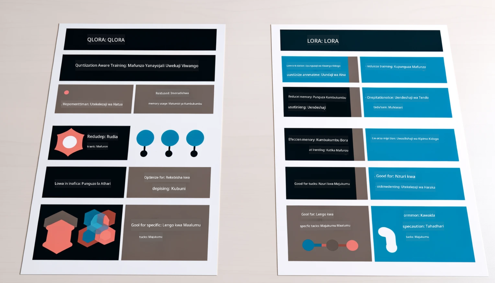

<!--
CO_OP_TRANSLATOR_METADATA:
{
  "original_hash": "743d7e9cb9c4e8ea642d77bee657a7fa",
  "translation_date": "2025-05-09T22:28:57+00:00",
  "source_file": "md/03.FineTuning/LetPhi3gotoIndustriy.md",
  "language_code": "sw"
}
-->
# **Acha Phi-3 kuwa mtaalamu wa sekta**

Ili kuweka mfano wa Phi-3 katika sekta fulani, unahitaji kuongeza data ya biashara ya sekta hiyo kwenye mfano wa Phi-3. Tuna chaguzi mbili tofauti, ya kwanza ni RAG (Retrieval Augmented Generation) na ya pili ni Fine Tuning.

## **RAG vs Fine-Tuning**

### **Retrieval Augmented Generation**

RAG ni mchakato wa kupata data + uzalishaji wa maandishi. Data iliyopangwa na isiyopangwa ya kampuni huhifadhiwa katika hifadhidata ya vector. Wakati wa kutafuta maudhui yanayohusiana, muhtasari na maudhui husika hupatikana kuunda muktadha, na uwezo wa kukamilisha maandishi wa LLM/SLM hutumika kuunda maudhui.

### **Fine-tuning**

Fine-tuning ni msingi wa kuboresha mfano fulani. Hainahitaji kuanzia na algoriti ya mfano, lakini data inapaswa kuendelea kukusanywa. Ikiwa unataka istilahi na maelezo ya lugha sahihi zaidi katika matumizi ya sekta, fine-tuning ndiyo chaguo bora kwako. Lakini ikiwa data yako hubadilika mara kwa mara, fine-tuning inaweza kuwa ngumu.

### **Jinsi ya kuchagua**

1. Ikiwa jibu letu linahitaji kuingiza data ya nje, RAG ndiyo chaguo bora

2. Ikiwa unahitaji kutoa maarifa thabiti na sahihi ya sekta, fine-tuning itakuwa chaguo zuri. RAG inalenga kupata maudhui husika lakini huenda isishike undani maalum wa taaluma kila wakati.

3. Fine-tuning inahitaji seti ya data yenye ubora wa juu, na ikiwa ni data ndogo tu, haitakuwa na tofauti kubwa. RAG ni rahisi kubadilika

4. Fine-tuning ni sanduku giza, ni mafumbo, na ni vigumu kuelewa utaratibu wake wa ndani. Lakini RAG inaweza kusaidia kupata chanzo cha data kwa urahisi, hivyo kurekebisha makosa ya maudhui au mawazo potofu na kutoa uwazi bora.

### **Mazingira**

1. Sekta maalum zinahitaji istilahi na maelezo ya kitaalamu, ***Fine-tuning*** itakuwa chaguo bora

2. Mfumo wa QA, unaohusisha muunganiko wa maarifa tofauti, ***RAG*** itakuwa chaguo bora

3. Mchanganyiko wa mchakato wa biashara wa moja kwa moja ***RAG + Fine-tuning*** ni chaguo bora

## **Jinsi ya kutumia RAG**

Hifadhidata ya vector ni mkusanyiko wa data iliyohifadhiwa kwa njia ya kihisabati. Hifadhidata hizi hurahisisha mifano ya kujifunza mashine kukumbuka maingizo ya awali, na hivyo kuwezesha matumizi ya kujifunza mashine kusaidia matumizi kama utaftaji, mapendekezo, na uzalishaji wa maandishi. Data inaweza kutambuliwa kwa msingi wa vipimo vya ulinganifu badala ya kulinganisha kwa usahihi kabisa, na hivyo kuruhusu mifano ya kompyuta kuelewa muktadha wa data.

Hifadhidata ya vector ni muhimu katika kutekeleza RAG. Tunaweza kubadilisha data kuwa hifadhidata ya vector kupitia mifano ya vector kama text-embedding-3, jina-ai-embedding, n.k.

Jifunze zaidi kuhusu kuunda programu ya RAG [https://github.com/microsoft/Phi-3CookBook](https://github.com/microsoft/Phi-3CookBook?WT.mc_id=aiml-138114-kinfeylo)

## **Jinsi ya kutumia Fine-tuning**

Algoriti zinazotumika mara kwa mara katika Fine-tuning ni Lora na QLora. Jinsi ya kuchagua?
- [Jifunze Zaidi kwa kutumia mfano huu wa notebook](../../../../code/04.Finetuning/Phi_3_Inference_Finetuning.ipynb)
- [Mfano wa Python FineTuning Sample](../../../../code/04.Finetuning/FineTrainingScript.py)

### **Lora na QLora**

LoRA (Low-Rank Adaptation) na QLoRA (Quantized Low-Rank Adaptation) ni mbinu zinazotumika kufinyanga mifano mikubwa ya lugha (LLMs) kwa kutumia Parameter Efficient Fine Tuning (PEFT). Mbinu za PEFT zimeundwa ili kufundisha mifano kwa ufanisi zaidi kuliko mbinu za kawaida.  
LoRA ni mbinu ya kufinyanga peke yake inayopunguza matumizi ya kumbukumbu kwa kutumia takriban ya daraja la chini kwenye matrix ya masasisho ya uzito. Hutoa muda mfupi wa mafunzo na hifadhi utendaji karibu na mbinu za kawaida za fine-tuning.

QLoRA ni toleo lililopanuliwa la LoRA ambalo linajumuisha mbinu za kuonyesha data kwa kiwango kidogo ili kupunguza matumizi ya kumbukumbu zaidi. QLoRA hupunguza usahihi wa vigezo vya uzito katika LLM iliyofunzwa awali hadi usahihi wa bit 4, ambayo ni ya kuokoa kumbukumbu zaidi kuliko LoRA. Hata hivyo, mafunzo ya QLoRA huwa polepole kwa takriban asilimia 30 ikilinganishwa na LoRA kutokana na hatua za ziada za kuonyesha na kuondoa kuonyesha.

QLoRA hutumia LoRA kama nyongeza kurekebisha makosa yaliyotokana na kuonyesha data kwa kiwango kidogo. QLoRA inaruhusu kufinyanga mifano mikubwa yenye mabilioni ya vigezo kwenye GPUs ndogo na zinazopatikana kwa urahisi. Kwa mfano, QLoRA inaweza kufinyanga mfano wa vigezo 70B ambao ungehitaji GPUs 36 kwa kutumia GPUs 2 tu.

**Kifungu cha kutangaza**:  
Hati hii imetafsiriwa kwa kutumia huduma ya tafsiri ya AI [Co-op Translator](https://github.com/Azure/co-op-translator). Ingawa tunajitahidi kwa usahihi, tafadhali fahamu kwamba tafsiri za kiotomatiki zinaweza kuwa na makosa au upungufu wa usahihi. Hati asili katika lugha yake ya asili inapaswa kuchukuliwa kama chanzo cha mamlaka. Kwa taarifa muhimu, tafsiri ya kitaalamu ya binadamu inapendekezwa. Hatuna dhamana kwa kutoelewana au tafsiri potofu zinazotokana na matumizi ya tafsiri hii.