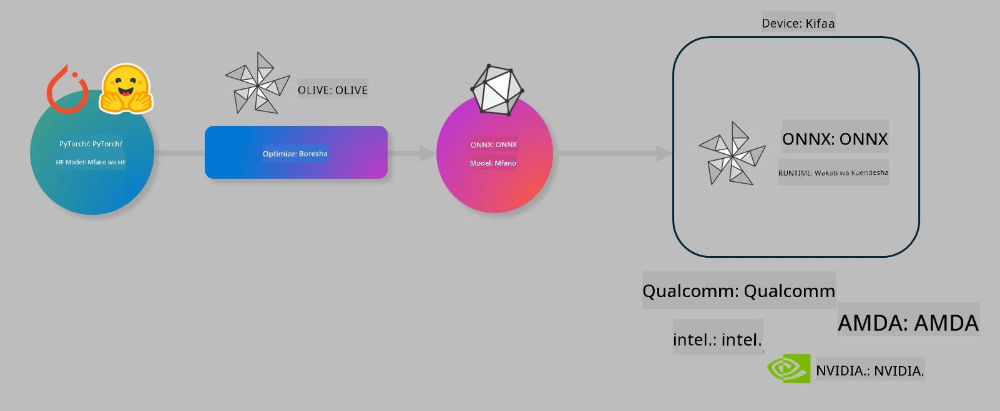

<!--
CO_OP_TRANSLATOR_METADATA:
{
  "original_hash": "6bbe47de3b974df7eea29dfeccf6032b",
  "translation_date": "2025-07-17T10:24:48+00:00",
  "source_file": "md/03.FineTuning/olive-lab/readme.md",
  "language_code": "sw"
}
-->
# Maabara. Boresha mifano ya AI kwa utambuzi wa kifaa

## Utangulizi

> [!IMPORTANT]
> Maabara hii inahitaji **Nvidia A10 au A100 GPU** pamoja na madereva na zana za CUDA (toleo 12+) zilizowekwa.

> [!NOTE]
> Hii ni maabara ya **dakika 35** itakayokupa utangulizi wa vitendo kuhusu dhana kuu za kuboresha mifano kwa utambuzi wa kifaa kwa kutumia OLIVE.

## Malengo ya Kujifunza

Mwisho wa maabara hii, utaweza kutumia OLIVE kufanya:

- Kupanua Mfano wa AI kwa kutumia mbinu ya kuquantize ya AWQ.
- Kufanya marekebisho ya kina kwa mfano wa AI kwa kazi maalum.
- Kutengeneza viambatanisho vya LoRA (mfano uliorekebishwa) kwa utambuzi bora wa kifaa kwa kutumia ONNX Runtime.

### Olive ni Nini

Olive (*O*NNX *live*) ni zana ya kuboresha mifano yenye CLI inayokuwezesha kusafirisha mifano kwa ONNX runtime +++https://onnxruntime.ai+++ kwa ubora na utendaji.



Kuingia kwa Olive kawaida ni mfano wa PyTorch au Hugging Face na matokeo ni mfano wa ONNX ulioboreshwa unaotekelezwa kwenye kifaa (lengo la usambazaji) kinachotumia ONNX runtime. Olive itaboresha mfano kwa kiendeshi cha AI cha lengo la usambazaji (NPU, GPU, CPU) kinachotolewa na muuzaji wa vifaa kama Qualcomm, AMD, Nvidia au Intel.

Olive hufanya *mchakato wa kazi*, ambao ni mfuatano wa kazi za kuboresha mfano zinazoitwa *passes* - mifano ya passes ni pamoja na: kubana mfano, kunasa grafu, kuquantize, kuboresha grafu. Kila pass ina seti ya vigezo vinavyoweza kurekebishwa ili kufikia vipimo bora, kama usahihi na ucheleweshaji, vinavyopimwa na mtathmini husika. Olive hutumia mkakati wa utafutaji unaotumia algoriti ya utafutaji kurekebisha kila pass moja baada ya nyingine au seti ya passes pamoja.

#### Faida za Olive

- **Punguza hasira na muda** wa majaribio ya mikono ya jaribio-kosa kwa mbinu tofauti za kuboresha grafu, kubana na kuquantize. Weka vizingiti vyako vya ubora na utendaji na ruhusu Olive ipate mfano bora kwa ajili yako moja kwa moja.
- **Vipengele 40+ vya kuboresha mifano vilivyojengwa ndani** vinavyoshughulikia mbinu za kisasa za kuquantize, kubana, kuboresha grafu na kurekebisha.
- **CLI rahisi kutumia** kwa kazi za kawaida za kuboresha mfano. Kwa mfano, olive quantize, olive auto-opt, olive finetune.
- Ufungaji na usambazaji wa mifano umejumuishwa.
- Inasaidia kutengeneza mifano kwa **Huduma ya Multi LoRA**.
- Tengeneza mchakato wa kazi kwa kutumia YAML/JSON kuandaa kazi za kuboresha na kusambaza mifano.
- Muunganisho wa **Hugging Face** na **Azure AI**.
- Mfumo wa **kushikilia (caching)** uliyojengwa ku **okoa gharama**.

## Maelekezo ya Maabara
> [!NOTE]
> Tafadhali hakikisha umeandaa Azure AI Hub na Mradi wako na umeweka A100 compute kama ilivyoelezwa katika Maabara 1.

### Hatua 0: Unganisha na Azure AI Compute yako

Utaunganisha na Azure AI compute kwa kutumia kipengele cha mbali katika **VS Code.**

1. Fungua programu yako ya **VS Code** desktop:
1. Fungua **command palette** kwa kutumia **Shift+Ctrl+P**
1. Katika command palette tafuta **AzureML - remote: Connect to compute instance in New Window**.
1. Fuata maelekezo ya skrini kuungana na Compute. Hii itahusisha kuchagua Azure Subscription yako, Resource Group, Mradi na Jina la Compute uliloweka katika Maabara 1.
1. Mara utakapounganishwa na Azure ML Compute node hii itaonyeshwa **chini kushoto katika Visual Code** `><Azure ML: Compute Name`

### Hatua 1: Nakili repo hii

Katika VS Code, unaweza kufungua terminal mpya kwa **Ctrl+J** na kunakili repo hii:

Katika terminal utaona ombi

```
azureuser@computername:~/cloudfiles/code$ 
```
Nakili suluhisho

```bash
cd ~/localfiles
git clone https://github.com/microsoft/phi-3cookbook.git
```

### Hatua 2: Fungua Folda katika VS Code

Ili kufungua VS Code katika folda husika tumia amri ifuatayo katika terminal, itafungua dirisha jipya:

```bash
code phi-3cookbook/code/04.Finetuning/Olive-lab
```

Mbali na hilo, unaweza kufungua folda kwa kuchagua **File** > **Open Folder**.

### Hatua 3: Kutegemea

Fungua dirisha la terminal katika VS Code kwenye Azure AI Compute Instance yako (kibofya: **Ctrl+J**) na tekeleza amri zifuatazo kufunga kutegemea:

```bash
conda create -n olive-ai python=3.11 -y
conda activate olive-ai
pip install -r requirements.txt
az extension remove -n azure-cli-ml
az extension add -n ml
```

> [!NOTE]
> Itachukua takriban dakika 5 kufunga kutegemea zote.

Katika maabara hii utapakua na kupakia mifano kwenye Azure AI Model catalog. Ili kupata katalogi ya mfano, utahitaji kuingia Azure kwa kutumia:

```bash
az login
```

> [!NOTE]
> Wakati wa kuingia utaombwa kuchagua usajili wako. Hakikisha umeweka usajili ule uliopewa kwa maabara hii.

### Hatua 4: Tekeleza amri za Olive

Fungua dirisha la terminal katika VS Code kwenye Azure AI Compute Instance yako (kibofya: **Ctrl+J**) na hakikisha mazingira ya conda `olive-ai` yamewashwa:

```bash
conda activate olive-ai
```

Kisha, tekeleza amri zifuatazo za Olive kwenye mstari wa amri.

1. **Chunguza data:** Katika mfano huu, utarekebisha mfano wa Phi-3.5-Mini ili uwe maalum kwa kujibu maswali yanayohusiana na usafiri. Msimbo hapa chini unaonyesha rekodi chache za kwanza za dataset, ambazo ziko katika muundo wa mistari ya JSON:
   
    ```bash
    head data/data_sample_travel.jsonl
    ```
1. **Quantize mfano:** Kabla ya kufundisha mfano, kwanza unafanya kuquantize kwa amri ifuatayo inayotumia mbinu inayoitwa Active Aware Quantization (AWQ) +++https://arxiv.org/abs/2306.00978+++. AWQ huquantize uzito wa mfano kwa kuzingatia uanzishaji unaotokea wakati wa utambuzi. Hii ina maana mchakato wa kuquantize unazingatia usambazaji halisi wa data katika uanzishaji, na kusababisha uhifadhi bora wa usahihi wa mfano ikilinganishwa na mbinu za kawaida za kuquantize uzito.
    
    ```bash
    olive quantize \
       --model_name_or_path microsoft/Phi-3.5-mini-instruct \
       --trust_remote_code \
       --algorithm awq \
       --output_path models/phi/awq \
       --log_level 1
    ```
    
    Inachukua **takriban dakika 8** kukamilisha kuquantize kwa AWQ, ambayo itapunguza ukubwa wa mfano kutoka **takriban 7.5GB hadi takriban 2.5GB**.
   
   Katika maabara hii, tunakuonyesha jinsi ya kuingiza mifano kutoka Hugging Face (kwa mfano: `microsoft/Phi-3.5-mini-instruct`). Hata hivyo, Olive pia inaruhusu kuingiza mifano kutoka katalogi ya Azure AI kwa kubadilisha hoja ya `model_name_or_path` kuwa kitambulisho cha mali ya Azure AI (kwa mfano: `azureml://registries/azureml/models/Phi-3.5-mini-instruct/versions/4`).

1. **Fundisha mfano:** Kisha, amri ya `olive finetune` inafundisha mfano uliquantize. Kuquantize mfano *kabla* ya kurekebisha kina badala ya baada ya hapo hutoa usahihi bora kwani mchakato wa kurekebisha kina hurudisha baadhi ya hasara kutoka kuquantize.
    
    ```bash
    olive finetune \
        --method lora \
        --model_name_or_path models/phi/awq \
        --data_files "data/data_sample_travel.jsonl" \
        --data_name "json" \
        --text_template "<|user|>\n{prompt}<|end|>\n<|assistant|>\n{response}<|end|>" \
        --max_steps 100 \
        --output_path ./models/phi/ft \
        --log_level 1
    ```
    
    Inachukua **takriban dakika 6** kukamilisha kurekebisha kina (kwa hatua 100).

1. **Boresha:** Baada ya mfano kufundishwa, sasa unaboresha mfano kwa kutumia amri ya `auto-opt` ya Olive, ambayo itakamata grafu ya ONNX na moja kwa moja kufanya maboresho kadhaa ili kuboresha utendaji wa mfano kwa CPU kwa kubana mfano na kufanya fusion. Inapaswa kutambuliwa, kwamba unaweza pia kuboresha kwa vifaa vingine kama NPU au GPU kwa kubadilisha hoja za `--device` na `--provider` - lakini kwa madhumuni ya maabara hii tutatumia CPU.

    ```bash
    olive auto-opt \
       --model_name_or_path models/phi/ft/model \
       --adapter_path models/phi/ft/adapter \
       --device cpu \
       --provider CPUExecutionProvider \
       --use_ort_genai \
       --output_path models/phi/onnx-ao \
       --log_level 1
    ```
    
    Inachukua **takriban dakika 5** kukamilisha maboresho.

### Hatua 5: Jaribio la haraka la utambuzi wa mfano

Ili kujaribu utambuzi wa mfano, tengeneza faili la Python katika folda yako liitwalo **app.py** na nakili na ubandike msimbo ufuatao:

```python
import onnxruntime_genai as og
import numpy as np

print("loading model and adapters...", end="", flush=True)
model = og.Model("models/phi/onnx-ao/model")
adapters = og.Adapters(model)
adapters.load("models/phi/onnx-ao/model/adapter_weights.onnx_adapter", "travel")
print("DONE!")

tokenizer = og.Tokenizer(model)
tokenizer_stream = tokenizer.create_stream()

params = og.GeneratorParams(model)
params.set_search_options(max_length=100, past_present_share_buffer=False)
user_input = "what is the best thing to see in chicago"
params.input_ids = tokenizer.encode(f"<|user|>\n{user_input}<|end|>\n<|assistant|>\n")

generator = og.Generator(model, params)

generator.set_active_adapter(adapters, "travel")

print(f"{user_input}")

while not generator.is_done():
    generator.compute_logits()
    generator.generate_next_token()

    new_token = generator.get_next_tokens()[0]
    print(tokenizer_stream.decode(new_token), end='', flush=True)

print("\n")
```

Tekeleza msimbo kwa kutumia:

```bash
python app.py
```

### Hatua 6: Pakia mfano kwenye Azure AI

Kupakia mfano kwenye hifadhi ya mfano ya Azure AI kunafanya mfano uweze kushirikiwa na wanachama wengine wa timu yako ya maendeleo na pia hushughulikia udhibiti wa matoleo ya mfano. Ili kupakia mfano tumia amri ifuatayo:

> [!NOTE]
> Sasisha sehemu za `{}` na jina la resource group yako na Jina la Mradi wa Azure AI.

Ili kupata resource group yako `"resourceGroup"` na Jina la Mradi wa Azure AI, tumia amri ifuatayo

```
az ml workspace show
```

Au kwa kwenda +++ai.azure.com+++ na kuchagua **management center** **project** **overview**

Sasisha sehemu za `{}` na jina la resource group yako na Jina la Mradi wa Azure AI.

```bash
az ml model create \
    --name ft-for-travel \
    --version 1 \
    --path ./models/phi/onnx-ao \
    --resource-group {RESOURCE_GROUP_NAME} \
    --workspace-name {PROJECT_NAME}
```
Baadaye utaweza kuona mfano uliopakiwa na kusambaza mfano wako kwenye https://ml.azure.com/model/list

**Kiarifu cha Msamaha**:  
Hati hii imetafsiriwa kwa kutumia huduma ya tafsiri ya AI [Co-op Translator](https://github.com/Azure/co-op-translator). Ingawa tunajitahidi kuhakikisha usahihi, tafadhali fahamu kwamba tafsiri za kiotomatiki zinaweza kuwa na makosa au upungufu wa usahihi. Hati ya asili katika lugha yake ya asili inapaswa kuchukuliwa kama chanzo cha mamlaka. Kwa taarifa muhimu, tafsiri ya kitaalamu inayofanywa na binadamu inashauriwa. Hatuna dhamana kwa kutoelewana au tafsiri potofu zinazotokana na matumizi ya tafsiri hii.