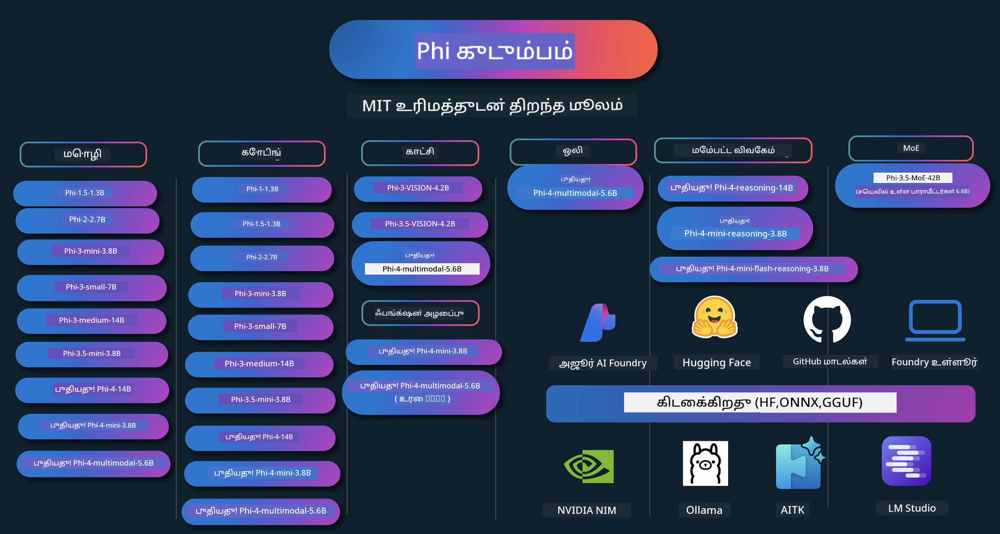

<!--
CO_OP_TRANSLATOR_METADATA:
{
  "original_hash": "ef3a50368712b1a7483d0def1f70c490",
  "translation_date": "2025-12-21T14:35:42+00:00",
  "source_file": "README.md",
  "language_code": "ta"
}
-->
# Phi குக்க்புக்: Microsoft-ன் Phi மாதிரிகளுடன் கைமுறை எடுத்துக்காட்டுகள்

Phi என்பது Microsoft மூலம் உருவாக்கப்பட்ட திறந்த மூல AI மாதிரிகளின் தொடர்.

தற்போது Phi மிகவும் சக்திவாய்ந்ததும் குறைந்த செலவில் செயல்படக்கூடியதுமான சிறிய மொழி மாதிரி (SLM) ஆகும், இது பன்மொழி, காரணித்திறன், உரை/சாட் உருவாக்கம், கோடிங், படங்கள், ஒலி மற்றும் பிற சூழ்நிலைகளில் சிறந்த குறியீட்டு முறை (benchmarks) களை கொண்டுள்ளது.

Phi-வை மேகம் அல்லது எட்ஜ் சாதனங்களில் விநியோகிக்கலாம், மற்றும் குறைந்த கணினி சக்தியைக் கொண்டிருந்தாலும் ஜெனரேட்டീവ് AI பயன்பாடுகளை எளிதாக உருவாக்கலாம்.

இந்த வளங்களை பயன்படுத்த தொடங்க கீழ்க்காணும் படிகளை பின்பற்றுங்கள் :
1. **Repository-ஐ Fork செய்யுங்கள்**: கிளிக் செய்க 
2. **Repository-ஐ கிளோன் செய்யுங்கள்**:   `git clone https://github.com/microsoft/PhiCookBook.git`
3. [**Microsoft AI Discord சமுதாயத்தில் சேர்ந்துகொள்ளவும் மற்றும் நிபுணர்களையும் மற்ற டெவலப்பர்களையும் சந்திக்கவும்**](https://discord.com/invite/ByRwuEEgH4?WT.mc_id=aiml-137032-kinfeylo)

### 🌐 பன்மொழி ஆதரவு

#### GitHub Action மூலம் ஆதரிக்கப்படுகிறது (தானியக்கமாக மற்றும் எப்போதும் புதுப்பிக்கப்பட்டது)

<!-- CO-OP TRANSLATOR LANGUAGES TABLE START -->
[அரபிக்](../ar/README.md) | [பெங்காலி](../bn/README.md) | [பல்கேரியன்](../bg/README.md) | [புர்மீஸ் (மியன்மார்)](../my/README.md) | [சீனம் (எளிமைப்படுத்தப்பட்ட)](../zh/README.md) | [சீனம் (பாரம்பரிய, ஹாங்காங்)](../hk/README.md) | [சீனம் (பாரம்பரிய, மாகாவ்)](../mo/README.md) | [சீனம் (பாரம்பரிய, தைவான்)](../tw/README.md) | [க்ரோஷியன்](../hr/README.md) | [செக்](../cs/README.md) | [டானிஷ்](../da/README.md) | [டச்சு](../nl/README.md) | [எஸ்டோனியன்](../et/README.md) | [பினிஷ்](../fi/README.md) | [பிரஞ்சு](../fr/README.md) | [ஜெர்மன்](../de/README.md) | [கிரேக்கம்](../el/README.md) | [ஹீப்ரூ](../he/README.md) | [ஹிந்தி](../hi/README.md) | [ஹங்கேரியன்](../hu/README.md) | [இந்தோனேஷியன்](../id/README.md) | [இத்தாலியன்](../it/README.md) | [ஜப்பானீஸ்](../ja/README.md) | [ಕನ್ನಡ](../kn/README.md) | [கொரியன்](../ko/README.md) | [லித்துவேனியன்](../lt/README.md) | [மலாய்](../ms/README.md) | [மலையாளம்](../ml/README.md) | [மராத்தி](../mr/README.md) | [நேபாளி](../ne/README.md) | [நைஜீரியன் பிஜின்](../pcm/README.md) | [நோர்வேஜியன்](../no/README.md) | [பெர்ஷியன் (பார்ஸி)](../fa/README.md) | [பொலிஷ்](../pl/README.md) | [போர்ச்சுகீஸ் (பிரேசில்)](../br/README.md) | [போர்ச்சுகீஸ் (போர்ச்சுகால்)](../pt/README.md) | [ப்ஞ்ஜாபி (குர்முகி)](../pa/README.md) | [ருமானியன்](../ro/README.md) | [ரஷ்யன்](../ru/README.md) | [சர்பியன் (சிரிலிக்)](../sr/README.md) | [ஸ்லோவாக்](../sk/README.md) | [ஸ்லோவேனியன்](../sl/README.md) | [ஸ்பானிஷ்](../es/README.md) | [ஸ்வாஹிலி](../sw/README.md) | [ஸ்வீடிஷ்](../sv/README.md) | [தகாலொக் (பிலிபினோ)](../tl/README.md) | [தமிழ்](./README.md) | [తెలుగు](../te/README.md) | [தை](../th/README.md) | [துருக்கியன்](../tr/README.md) | [உக்ரைனியன்](../uk/README.md) | [உருது](../ur/README.md) | [வியட்நாமீஸ்](../vi/README.md)
<!-- CO-OP TRANSLATOR LANGUAGES TABLE END -->

## உள்ளடக்க அட்டவணை

- அறிமுகம்
  - [Phi குடும்பத்திற்கு வரவேற்கிறோம்](./md/01.Introduction/01/01.PhiFamily.md)
  - [உங்கள் சுற்றுச்சூழலை அமைத்தல்](./md/01.Introduction/01/01.EnvironmentSetup.md)
  - [முக்கிய தொழில்நுட்பங்களைப் புரிந்துகொள்வது](./md/01.Introduction/01/01.Understandingtech.md)
  - [Phi மாதிரிகளுக்கான AI பாதுகாப்பு](./md/01.Introduction/01/01.AISafety.md)
  - [Phi ஹார்ட்வேர் ஆதரவு](./md/01.Introduction/01/01.Hardwaresupport.md)
  - [Phi மாதிரிகள் மற்றும் தளங்களின் கிடைக்கத்தன்மை](./md/01.Introduction/01/01.Edgeandcloud.md)
  - [Guidance-ai மற்றும் Phi பயன்படுத்துவது](./md/01.Introduction/01/01.Guidance.md)
  - [GitHub Marketplace மாதிரிகள்](https://github.com/marketplace/models)
  - [Azure AI மாதிரி காடலக்](https://ai.azure.com)

- வெவ்வேறு சூழல்களில் Phi இன்ஃபரன்ஸ்
    -  [Hugging face](./md/01.Introduction/02/01.HF.md)
    -  [GitHub மாதிரிகள்](./md/01.Introduction/02/02.GitHubModel.md)
    -  [Azure AI Foundry மாதிரி காடலக்](./md/01.Introduction/02/03.AzureAIFoundry.md)
    -  [Ollama](./md/01.Introduction/02/04.Ollama.md)
    -  [AI Toolkit VSCode (AITK)](./md/01.Introduction/02/05.AITK.md)
    -  [NVIDIA NIM](./md/01.Introduction/02/06.NVIDIA.md)
    -  [Foundry உள்ளூர்](./md/01.Introduction/02/07.FoundryLocal.md)

- Phi குடும்பத்தில் இன்ஃபரன்ஸ்
    - [iOS-இல் Phi இன்ஃபரன்ஸ்](./md/01.Introduction/03/iOS_Inference.md)
    - [Android-இல் Phi இன்ஃபரன்ஸ்](./md/01.Introduction/03/Android_Inference.md)
    - [Jetson-இல் Phi இன்ஃபரன்ஸ்](./md/01.Introduction/03/Jetson_Inference.md)
    - [AI PC-இல் Phi இன்ஃபரன்ஸ்](./md/01.Introduction/03/AIPC_Inference.md)
    - [Apple MLX Framework உடன் Phi இன்ஃபரன்ஸ்](./md/01.Introduction/03/MLX_Inference.md)
    - [உள்ளூர் சர்வரில் Phi இன்ஃபரன்ஸ்](./md/01.Introduction/03/Local_Server_Inference.md)
    - [AI Toolkit பயன்படுத்தி ரிமோட் சர்வரில் Phi இன்ஃபரன்ஸ்](./md/01.Introduction/03/Remote_Interence.md)
    - [Rust உடன் Phi இன்ஃபரன்ஸ்](./md/01.Introduction/03/Rust_Inference.md)
    - [உள்ளூர் காட்சி (Vision) இன்ஃபரன்ஸ்](./md/01.Introduction/03/Vision_Inference.md)
    - [Kaito AKS, Azure Containers (அதிகாரப்பூர்வ ஆதரவு) உடன் Phi இன்ஃபரன்ஸ்](./md/01.Introduction/03/Kaito_Inference.md)
-  [Phi குடும்பத்தின் அளவீடு](./md/01.Introduction/04/QuantifyingPhi.md)
    - [llama.cpp பயன்படுத்தி Phi-3.5 / 4 குவாண்டைசிங்](./md/01.Introduction/04/UsingLlamacppQuantifyingPhi.md)
    - [Generative AI extensions for onnxruntime பயன்படுத்தி Phi-3.5 / 4 குவாண்டைசிங்](./md/01.Introduction/04/UsingORTGenAIQuantifyingPhi.md)
    - [Intel OpenVINO பயன்படுத்தி Phi-3.5 / 4 குவாண்டைசிங்](./md/01.Introduction/04/UsingIntelOpenVINOQuantifyingPhi.md)
    - [Apple MLX Framework பயன்படுத்தி Phi-3.5 / 4 குவாண்டைசிங்](./md/01.Introduction/04/UsingAppleMLXQuantifyingPhi.md)

-  Phi மதிப்பீடு
    - [பொறுப்பான AI](./md/01.Introduction/05/ResponsibleAI.md)
    - [மதிப்பீட்டிற்கான Azure AI Foundry](./md/01.Introduction/05/AIFoundry.md)
    - [மதிப்பீட்டிற்கு Promptflow பயன்படுத்துதல்](./md/01.Introduction/05/Promptflow.md)
 
- Azure AI Search உடன் RAG
    - [Azure AI Search உடன் Phi-4-mini மற்றும் Phi-4-multimodal(RAG) பயன்படுத்துவது எப்படி](https://github.com/microsoft/PhiCookBook/blob/main/code/06.E2E/E2E_Phi-4-RAG-Azure-AI-Search.ipynb)

- Phi பயன்பாட்டு மேம்பாட்டு மாதிரிகள்
  - உரை & உரையாடல் பயன்பாடுகள்
    - Phi-4 மாதிரிகள் 🆕
      - [📓] [Phi-4-mini ONNX மாதிரியுடன் உரையாடல்](./md/02.Application/01.TextAndChat/Phi4/ChatWithPhi4ONNX/README.md)
      - [Phi-4 உள்ளூர் ONNX மாதிரி .NET உடன் உரையாடல்](../../md/04.HOL/dotnet/src/LabsPhi4-Chat-01OnnxRuntime)
      - [Semantic Kernel பயன்படுத்தி Phi-4 ONNX உடன் Chat .NET கன்சோல் பயன்பாடு](../../md/04.HOL/dotnet/src/LabsPhi4-Chat-02SK)
    - Phi-3 / 3.5 மாதிரிகள்
      - [உலாவியில் உள்ளூர் சாட்பாட் (Phi3, ONNX Runtime Web மற்றும் WebGPU பயன்படுத்தி)](https://github.com/microsoft/onnxruntime-inference-examples/tree/main/js/chat)
      - [OpenVino உரையாடல்](./md/02.Application/01.TextAndChat/Phi3/E2E_OpenVino_Chat.md)
      - [பல மாதிரிகள் - தொடர்பு கொள்ளக்கூடிய Phi-3-mini மற்றும் OpenAI Whisper](./md/02.Application/01.TextAndChat/Phi3/E2E_Phi-3-mini_with_whisper.md)
      - [MLFlow - ஒரு wrapper உருவாக்கி MLFlow உடன் Phi-3 பயன்படுத்துதல்](./md//02.Application/01.TextAndChat/Phi3/E2E_Phi-3-MLflow.md)
      - [மாடல் ஆப்டிமைசேஷன் - Olive உடன் ONNX Runtime Web இற்காக Phi-3-min மாடலை எவ்வாறு மேம்படுத்துவது](https://github.com/microsoft/Olive/tree/main/examples/phi3)
      - [WinUI3 செயலி Phi-3 mini-4k-instruct-onnx உடன்](https://github.com/microsoft/Phi3-Chat-WinUI3-Sample/)
      -[WinUI3 பல மாடல் AI-ஆதாரமான குறிப்பு செயலி மாதிரி](https://github.com/microsoft/ai-powered-notes-winui3-sample)
      - [Prompt flow உடன் தனிப்பயன் Phi-3 மாடல்களை நுணுக்கமாகச் சீரமைத்து ஒருங்கிணைப்பது](./md/02.Application/01.TextAndChat/Phi3/E2E_Phi-3-FineTuning_PromptFlow_Integration.md)
      - [Azure AI Foundry இல் Prompt flow உடன் தனிப்பயன் Phi-3 மாடல்களை நுணுக்கமாகச் சீரமைத்து ஒருங்கிணைப்பது](./md/02.Application/01.TextAndChat/Phi3/E2E_Phi-3-FineTuning_PromptFlow_Integration_AIFoundry.md)
      - [Microsoft-ன் பொறுப்பான AI கொள்கைகளை கவனித்து Azure AI Foundry இல் நுணுக்கமாக திருத்திய Phi-3 / Phi-3.5 மாடலை மதிப்பீடு செய்வது](./md/02.Application/01.TextAndChat/Phi3/E2E_Phi-3-Evaluation_AIFoundry.md)
      - [📓] [Phi-3.5-mini-instruct மொழி கணிப்பு மாதிரி (சீன/ஆங்கிலம்)](./md/02.Application/01.TextAndChat/Phi3/phi3-instruct-demo.ipynb)
      - [Phi-3.5-Instruct WebGPU RAG சாட்பாட்](./md/02.Application/01.TextAndChat/Phi3/WebGPUWithPhi35Readme.md)
      - [Phi-3.5-Instruct ONNX உடன் Prompt flow தீர்வை உருவாக்க Windows GPU-வை பயன்படுத்துதல்](./md/02.Application/01.TextAndChat/Phi3/UsingPromptFlowWithONNX.md)
      - [Microsoft Phi-3.5 tflite பயன்படுத்தி Android செயலி உருவாக்குதல்](./md/02.Application/01.TextAndChat/Phi3/UsingPhi35TFLiteCreateAndroidApp.md)
      - [Microsoft.ML.OnnxRuntime பயன்படுத்தி உள்ளூர் ONNX Phi-3 மாடலைப் பயன்படுத்தும் Q&A .NET உதாரணம்](../../md/04.HOL/dotnet/src/LabsPhi301)
      - [Console chat .NET செயலி Semantic Kernel மற்றும் Phi-3 உடன்](../../md/04.HOL/dotnet/src/LabsPhi302)

  - Azure AI Inference SDK கோட்-ஆதாரமான எடுத்துக்காட்டுகள் 
    - Phi-4 மாதிரிகள் 🆕
      - [📓] [Phi-4-multimodal பயன்படுத்தி திட்டக் குறியீட்டை உருவாக்குதல்](./md/02.Application/02.Code/Phi4/GenProjectCode/README.md)
    - Phi-3 / 3.5 மாதிரிகள்
      - [உங்கள் சொந்த Visual Studio Code GitHub Copilot Chat-ஐ Microsoft Phi-3 Family உடன் உருவாக்குதல்](./md/02.Application/02.Code/Phi3/VSCodeExt/README.md)
      - [GitHub Models மூலம் Phi-3.5 கொண்டு உங்கள் சொந்த Visual Studio Code Chat Copilot Agent ஐ உருவாக்குதல்](/md/02.Application/02.Code/Phi3/CreateVSCodeChatAgentWithGitHubModels.md)

  - முன்னேறிய காரணித்தல் மாதிரிகள்
    - Phi-4 மாதிரிகள் 🆕
      - [📓] [Phi-4-mini-reasoning அல்லது Phi-4-reasoning மாதிரிகள்](./md/02.Application/03.AdvancedReasoning/Phi4/AdvancedResoningPhi4mini/README.md)
      - [📓] [Microsoft Olive உடன் Phi-4-mini-reasoning ஐ நுணுக்கமாகப் பயிற்றுதல்](./md/02.Application/03.AdvancedReasoning/Phi4/AdvancedResoningPhi4mini/olive_ft_phi_4_reasoning_with_medicaldata.ipynb)
      - [📓] [Apple MLX உடன் Phi-4-mini-reasoning ஐ நுணுக்கமாகப் பயிற்றுதல்](./md/02.Application/03.AdvancedReasoning/Phi4/AdvancedResoningPhi4mini/mlx_ft_phi_4_reasoning_with_medicaldata.ipynb)
      - [📓] [GitHub Models உடன் Phi-4-mini-reasoning](./md/02.Application/02.Code/Phi4r/github_models_inference.ipynb)
      - [📓] [Azure AI Foundry மாடல்களுடன் Phi-4-mini-reasoning](./md/02.Application/02.Code/Phi4r/azure_models_inference.ipynb)
  - Demos
      - [Hugging Face Spaces-ல் ஹோஸ்ட் செய்யப்பட்ட Phi-4-mini டெமோக்கள்](https://huggingface.co/spaces/microsoft/phi-4-mini?WT.mc_id=aiml-137032-kinfeylo)
      - [Hugginge Face Spaces-ல் ஹோஸ்ட் செய்யப்பட்ட Phi-4-multimodal டெமோக்கள்](https://huggingface.co/spaces/microsoft/phi-4-multimodal?WT.mc_id=aiml-137032-kinfeylo)
  - Vision Samples
    - Phi-4 மாதிரிகள் 🆕
      - [📓] [Phi-4-multimodal ஐப் பயன்படுத்தி படங்களைப் படித்து குறியீடு உருவாக்குதல்](./md/02.Application/04.Vision/Phi4/CreateFrontend/README.md) 
    - Phi-3 / 3.5 மாதிரிகள்
      -  [📓][Phi-3-vision-படத்திலிருந்து உரை வரை](./md/02.Application/04.Vision/Phi3/E2E_Phi-3-vision-image-text-to-text-online-endpoint.ipynb)
      - [Phi-3-vision-ONNX](https://onnxruntime.ai/docs/genai/tutorials/phi3-v.html)
      - [📓][Phi-3-vision CLIP எம்பெட்டிங்](./md/02.Application/04.Vision/Phi3/E2E_Phi-3-vision-image-text-to-text-online-endpoint.ipynb)
      - [DEMO: Phi-3 மறுசுழற்சி](https://github.com/jennifermarsman/PhiRecycling/)
      - [Phi-3-vision - காட்சிப் மொழி உதவியாளர் - Phi3-Vision மற்றும் OpenVINO உடன்](https://docs.openvino.ai/nightly/notebooks/phi-3-vision-with-output.html)
      - [Phi-3 Vision Nvidia NIM](./md/02.Application/04.Vision/Phi3/E2E_Nvidia_NIM_Vision.md)
      - [Phi-3 Vision OpenVino](./md/02.Application/04.Vision/Phi3/E2E_OpenVino_Phi3Vision.md)
      - [📓][Phi-3.5 Vision பல-ஃப்ரேம் அல்லது பல-பட மாதிரி](./md/02.Application/04.Vision/Phi3/phi3-vision-demo.ipynb)
      - [Microsoft.ML.OnnxRuntime .NET பயன்படுத்தி உள்ளூர் Phi-3 Vision ONNX மாடல்](../../md/04.HOL/dotnet/src/LabsPhi303)
      - [மெனு அடிப்படையிலான Phi-3 Vision உள்ளூர் ONNX மாடல் Microsoft.ML.OnnxRuntime .NET பயன்படுத்தி](../../md/04.HOL/dotnet/src/LabsPhi304)

  - Math Samples
    -  Phi-4-Mini-Flash-Reasoning-Instruct மாதிரிகள் 🆕 [Phi-4-Mini-Flash-Reasoning-Instruct உடன் கணித டெமோ](./md/02.Application/09.Math/MathDemo.ipynb)

  - Audio Samples
    - Phi-4 மாதிரிகள் 🆕
      - [📓] [Phi-4-multimodal பயன்படுத்தி ஒலி உரை பதிவுகளை எடுத்தறிதல்](./md/02.Application/05.Audio/Phi4/Transciption/README.md)
      - [📓] [Phi-4-multimodal ஒலி மாதிரி](./md/02.Application/05.Audio/Phi4/Siri/demo.ipynb)
      - [📓] [Phi-4-multimodal பேச்சு மொழிபெயர்ப்பு மாதிரி](./md/02.Application/05.Audio/Phi4/Translate/demo.ipynb)
      - [.NET கான்சோல் பயன்பாடு Phi-4-multimodal ஒலியைப் பயன்படுத்தி ஒலி கோப்பை பகுப்பாய்வு செய்து உரை பதிவை உருவாக்குகிறது](../../md/04.HOL/dotnet/src/LabsPhi4-MultiModal-02Audio)

  - MOE மாதிரிகள்
    - Phi-3 / 3.5 மாதிரிகள்
      - [📓] [Phi-3.5 Mixture of Experts மாதிரிகள் (MoEs) சமூக ஊடக மாதிரி](./md/02.Application/06.MoE/Phi3/phi3_moe_demo.ipynb)
      - [📓] [NVIDIA NIM Phi-3 MOE, Azure AI Search மற்றும் LlamaIndex உடன் Retrieval-Augmented Generation (RAG) பைப்ப்லைன் உருவாக்குதல்](./md/02.Application/06.MoE/Phi3/azure-ai-search-nvidia-rag.ipynb)
      - 
  - Function Calling மாதிரிகள்
    - Phi-4 மாதிரிகள் 🆕
      -  [📓] [Phi-4-mini உடன் Function Calling பயன்படுத்துதல்](./md/02.Application/07.FunctionCalling/Phi4/FunctionCallingBasic/README.md)
      -  [📓] [Function Calling பயன்படுத்தி Phi-4-mini உடன் பல-ஏஜென்ட்களை உருவாக்குதல்](./md/02.Application/07.FunctionCalling/Phi4/Multiagents/Phi_4_mini_multiagent.ipynb)
      -  [📓] [Ollama உடன் Function Calling பயன்படுத்துதல்](./md/02.Application/07.FunctionCalling/Phi4/Ollama/ollama_functioncalling.ipynb)
      -  [📓] [ONNX உடன் Function Calling பயன்படுத்துதல்](./md/02.Application/07.FunctionCalling/Phi4/ONNX/onnx_parallel_functioncalling.ipynb)
  - Multimodal Mixing மாதிரிகள்
    - Phi-4 மாதிரிகள் 🆕
      -  [📓] [தொழில்நுட்ப பத்திரிகையாளராக Phi-4-multimodal பயன்படுத்துதல்](./md/02.Application/08.Multimodel/Phi4/TechJournalist/phi_4_mm_audio_text_publish_news.ipynb)
      - [.NET கான்சோல் பயன்பாடு Phi-4-multimodal பயன்படுத்தி படங்களை பகுப்பாய்வு செய்தல்](../../md/04.HOL/dotnet/src/LabsPhi4-MultiModal-01Images)

- Phi மாதிரிகளை நுணுக்கமாகச் சீரமைக்கும் எடுத்துக்காட்டுகள்
  - [நுணுக்கப்படுத்தல் நிகழ்நிலைகள்](./md/03.FineTuning/FineTuning_Scenarios.md)
  - [நுணுக்கப்படுத்தல் மற்றும் RAG ஒப்பீடு](./md/03.FineTuning/FineTuning_vs_RAG.md)
  - [நுணுக்கப்படுத்துதல்: Phi-3 ஐ ஒரு தொழில் நிபுணராக மாற்றுதல்](./md/03.FineTuning/LetPhi3gotoIndustriy.md)
  - [VS Code-க்கான AI Toolkit மூலம் Phi-3 ஐ நுணுக்கப்படுத்துதல்](./md/03.FineTuning/Finetuning_VSCodeaitoolkit.md)
  - [Azure Machine Learning சேவையைப் பயன்படுத்தி Phi-3 ஐ நுணுக்கப்படுத்துதல்](./md/03.FineTuning/Introduce_AzureML.md)
  - [Lora உடன் Phi-3 ஐ நுணுக்கப்படுத்துதல்](./md/03.FineTuning/FineTuning_Lora.md)
  - [QLora உடன் Phi-3 ஐ நுணுக்கப்படுத்துதல்](./md/03.FineTuning/FineTuning_Qlora.md)
  - [Azure AI Foundry உடன் Phi-3 ஐ நுணுக்கப்படுத்துதல்](./md/03.FineTuning/FineTuning_AIFoundry.md)
  - [Azure ML CLI/SDK பயன்படுத்தி Phi-3 ஐ நுணுக்கப்படுத்துதல்](./md/03.FineTuning/FineTuning_MLSDK.md)
  - [Microsoft Olive மூலம் நுணுக்கப்படுத்துதல்](./md/03.FineTuning/FineTuning_MicrosoftOlive.md)
  - [Microsoft Olive கைமுறை ஆய்வகம் மூலம் நுணுக்கப்படுத்துதல்](./md/03.FineTuning/olive-lab/readme.md)
  - [Weights and Bias உடன் Phi-3-vision ஐ நுணுக்கப்படுத்துதல்](./md/03.FineTuning/FineTuning_Phi-3-visionWandB.md)
  - [Apple MLX Framework கொண்டு Phi-3 ஐ நுணுக்கப்படுத்துதல்](./md/03.FineTuning/FineTuning_MLX.md)
  - [Phi-3-vision ஐ நுணுக்கப்படுத்துதல் (அதிகாரபூர்வ ஆதரவு)](./md/03.FineTuning/FineTuning_Vision.md)
  - [Kaito AKS, Azure Containers (அதிகாரபூர்வ ஆதரவு) மூலம் Phi-3 ஐ நுணுக்கப்படுத்துதல்](./md/03.FineTuning/FineTuning_Kaito.md)
  - [Phi-3 மற்றும் 3.5 Vision ஐ நுணுக்கப்படுத்துதல்](https://github.com/2U1/Phi3-Vision-Finetune)

- கைமுறை ஆய்வகம்
  - [அதிகளவு முன்னேற்ற மாடல்களை ஆராய்தல்: LLMs, SLMs, உள்ளூர் மேம்பாடு மற்றும் மேலும்](https://github.com/microsoft/aitour-exploring-cutting-edge-models)
  - [NLP திறமையை திறப்பது: Microsoft Olive மூலம் நுணுக்கப்படுத்துதல்](https://github.com/azure/Ignite_FineTuning_workshop)

- அகாடமிக் ஆய்வு கட்டுரைகள் மற்றும் வெளியீடுகள்
  - [Textbooks Are All You Need II: phi-1.5 தொழில்நுட்ப அறிக்கை](https://arxiv.org/abs/2309.05463)
  - [Phi-3 தொழில்நுட்ப அறிக்கை: உங்கள் தொலைபேசியில் உள்ளூர் முறையில் மிக திறமையான மொழி மாடல்](https://arxiv.org/abs/2404.14219)
  - [Phi-4 தொழில்நுட்ப அறிக்கை](https://arxiv.org/abs/2412.08905)
  - [Phi-4-Mini தொழில்நுட்ப அறிக்கை: Mixture-of-LoRAs மூலம் சுருக்கமான ஆனால் சக்திவாய்ந்த பல்மாதிரி மொழி மாடல்கள்](https://arxiv.org/abs/2503.01743)
  - [வாகனத்தில் செயல்பாடு அழைக்குதலுக்கான சிறிய மொழி மாடல்களை மேம்படுத்துதல்](https://arxiv.org/abs/2501.02342)
  - [(WhyPHI) பல தேர்வு கேள்வி பதிலளிப்பிற்கான PHI-3ஐ நுணுக்கமாய் தூண்டுதல்: முறைகள், முடிவுகள் மற்றும் சவால்கள்](https://arxiv.org/abs/2501.01588)
  - [Phi-4-தர்க்கம் தொழில்நுட்ப அறிக்கை](https://www.microsoft.com/en-us/research/wp-content/uploads/2025/04/phi_4_reasoning.pdf)
  - [Phi-4-mini-தர்க்கம் தொழில்நுட்ப அறிக்கை](https://huggingface.co/microsoft/Phi-4-mini-reasoning/blob/main/Phi-4-Mini-Reasoning.pdf)

## Phi மாடல்களை பயன்படுத்துதல்

### Azure AI Foundry இல் Phi

Microsoft Phi ஐ எப்படி பயன்படுத்துவது மற்றும் உங்கள் வெவ்வேறு ஹார்டுவேர் சாதனங்களில் E2E தீர்வுகளை எப்படி கட்டமைக்குவது என்பதை நீங்கள் கற்று கொள்ளலாம். Phi ஐ நேரடியாக அனுபவிக்க, முதலில் மாடல்களுடன் விளையாடி உங்கள் சூழல்களுக்கு ஏற்ப Phi ஐ தனிப்பயனாக்க [Azure AI Foundry Azure AI Model Catalog](https://aka.ms/phi3-azure-ai) ஐப் பயன்படுத்துங்கள். மேலும் தொடங்கும் வழிகாட்டலுக்கு Getting Started with [Azure AI Foundry](/md/02.QuickStart/AzureAIFoundry_QuickStart.md) ஐப் பார்க்கலாம்

**விளையாட்டு இடம்**
ஒவ்வொரு மாடலுக்கும் மாடலைச் சோதிக்க ஒரு தனித்துவமான playground உள்ளது [Azure AI Playground](https://aka.ms/try-phi3).

### GitHub Models இல் Phi

Microsoft Phi ஐ எப்படி பயன்படுத்துவது மற்றும் உங்கள் வெவ்வேறு ஹார்டுவேர் சாதனங்களில் E2E தீர்வுகளை எப்படி கட்டமைக்குவது என்பதை நீங்கள் கற்று கொள்ளலாம். Phi ஐ நேரடியாக அனுபவிக்க, முதலில் மாடலுடன் விளையாடி உங்கள் சூழல்களுக்கு ஏற்ப Phi ஐ தனிப்பயனாக்க [GitHub Model Catalog](https://github.com/marketplace/models?WT.mc_id=aiml-137032-kinfeylo) ஐப் பயன்படுத்துங்கள். மேலும் தொடங்கும் வழிகாட்டலுக்கு Getting Started with [GitHub Model Catalog](/md/02.QuickStart/GitHubModel_QuickStart.md) ஐப் பார்க்கலாம்

**விளையாட்டு இடம்**
ஒவ்வொரு மாடலுக்கும் ஒரு பிரத்யேக [playground to test the model](/md/02.QuickStart/GitHubModel_QuickStart.md).

### Hugging Face இல் Phi

மாடலை மேலும் [Hugging Face](https://huggingface.co/microsoft) இல் கண்டுபிடிக்கலாம்

**விளையாட்டு இடம்**
 [Hugging Chat விளையாட்டு இடம்](https://huggingface.co/chat/models/microsoft/Phi-3-mini-4k-instruct)

 ## 🎒 பிற பாடநெறிகள்

எங்கள் குழு மற்ற பாடநெறிகளையும் உருவாக்குகிறது! கீழைப் பார்க்கவும்:

<!-- CO-OP TRANSLATOR OTHER COURSES START -->
### LangChain

---

### Azure / Edge / MCP / Agents

---
 
### Generative AI தொடர்

[-9333EA?style=for-the-badge&labelColor=E5E7EB&color=9333EA)](https://github.com/microsoft/Generative-AI-for-beginners-dotnet?WT.mc_id=academic-105485-koreyst)
[-C084FC?style=for-the-badge&labelColor=E5E7EB&color=C084FC)](https://github.com/microsoft/generative-ai-for-beginners-java?WT.mc_id=academic-105485-koreyst)
[-E879F9?style=for-the-badge&labelColor=E5E7EB&color=E879F9)](https://github.com/microsoft/generative-ai-with-javascript?WT.mc_id=academic-105485-koreyst)

---
 
### மையக் கற்றல்

---
 
### Copilot தொடர்

<!-- CO-OP TRANSLATOR OTHER COURSES END -->

## பொறுப்பான AI 

Microsoft நமது வாடிக்கையாளர்கள் எங்கள் AI தயாரிப்புகளை பொறுப்புடன் பயன்படுத்த உதவுவதில், எங்கள் கற்றல்களை பகிர்வதில் மற்றும் Transparency Notes மற்றும் Impact Assessments போன்ற கருவிகளின் மூலம் நம்பிக்கை அடிப்படையிலான கூட்டாண்மைகளை உருவாக்குவதில் உறுதிபடுத்தியுள்ளது. இந்த வளங்களில் பலவற்றை [https://aka.ms/RAI](https://aka.ms/RAI) இல் காணலாம்.
Microsoft இன் பொறுப்பான AI அணுகுமுறை நமது AI கொள்கைகள் — நீதி, நம்பகத்தன்மை மற்றும் பாதுகாப்பு, தனியுரிமை மற்றும் பாதுகாப்பு, உட்பொதிவு, வெளிப்படைத்தன்மை மற்றும் பொறுப்புப் பொறுப்புகள் — ஆகியவற்றில் அடிப்படையாயுள்ளது.

பெரிய அளவிலான இயற்கை மொழி, படம் மற்றும் பேச்சு மாதிரிகள் — இந்த மாதிரியில் பயன்படுத்தப்பட்டவையைப் போன்றவை — சாத்தியமான முறையில் அநீதியான, நம்பமுடியாத அல்லது அவகாசமான நடத்தை வெளிப்படுத்தக்கூடும்; இதனால் தீவிரமான தீங்கு நிகழக்கூடும். அபாயங்கள் மற்றும் வரம்புகள் பற்றி அறிய [Azure OpenAI service Transparency note](https://learn.microsoft.com/legal/cognitive-services/openai/transparency-note?tabs=text) ஐப் பார்க்கவும்.

இந்து அபாயங்களை குறைப்பதற்கான பரிந்துரைக்கப்படும் அணுகுமுறை என்பது உங்கள் கட்டமைப்பில் தீங்கு விளைவிக்கும் நடத்தை கண்டறிந்து தடுக்கும் ஒரு பாதுகாப்பு அமைப்பினை ஒருங்கிணைப்பது ஆகும். [Azure AI Content Safety](https://learn.microsoft.com/azure/ai-services/content-safety/overview) ஒரு சுயாதீன பாதுகாப்பு அடுக்கை வழங்குகிறது, செயலிகளிலும் சேவைகளிலும் பயனர்-உருவாக்கப்பட்ட மற்றும் AI-உருவாக்கப்பட்ட தீங்கு உள்ள உள்ளடக்கத்தை கண்டறியக்கூடியது. Azure AI Content Safety உரை மற்றும் பட APIக்களை உடையது, இவை தீங்கு விளைவிக்கும் பொருட்களை கண்டறிய உதவுகின்றன. Azure AI Foundry இல், Content Safety சேவை பல்வேறு முறைமைகளில் தீங்கு உள்ளடக்கத்தைக் கண்டறிய உதவியாக சாம்பிள் குறியீடுகளை பார்க்க, ஆராய மற்றும் முயற்சி செய்ய அனுமதிக்கிறது. கீழுள்ள [quickstart documentation](https://learn.microsoft.com/azure/ai-services/content-safety/quickstart-text?tabs=visual-studio%2Clinux&pivots=programming-language-rest) சேவைக்கு வேண்டுகோள்களை எவ்வாறு செய்ய வேண்டும் என்பதை வழிகாட்டுகிறது.

மறு அம்சமாக கரக்கவேண்டியதன் ஒரு பகுதி முழு பயன்பாட்டின் செயல்திறனாகும். பல்மாதிரி மற்றும் பல-மாடல் பயன்பாடுகளுடன், செயல்திறன் என்பது அமைப்பு நீங்கள் மற்றும் உங்கள் பயனர்கள் எதிர்பார்க்கும் போல் செயல்படுவதை குறிக்கும், அதில் தீங்கு விளைவிக்கும் வெளியீடுகள் உருவாகாமல் இருப்பதும் அடங்கும். உங்கள் முழு பயன்பாட்டின் செயல்திறனை [Performance and Quality and Risk and Safety evaluators](https://learn.microsoft.com/azure/ai-studio/concepts/evaluation-metrics-built-in) மூலம் மதிப்பீடு செய்வது முக்கியம். மேலும், நீங்கள் [custom evaluators](https://learn.microsoft.com/azure/ai-studio/how-to/develop/evaluate-sdk#custom-evaluators) உருவாக்கி அவற்றுடன் மதிப்பீடு செய்யும் திறனும் உங்களிடம் உள்ளது.

[Azure AI Evaluation SDK](https://microsoft.github.io/promptflow/index.html) ஐ உங்கள் அபிவிருத்தி சூழலில் பயன்படுத்தி உங்கள் AI பயன்பாட்டை மதிப்பீடு செய்ய முடியும். ஒரு சோதனை தரவுத்தொகை அல்லது ஒரு இலக்கை கொடுத்தால், உங்கள் உருவாக்கும் AI பயன்பாட்டின் உருவாக்கங்கள் கட்டமைக்கப்பட்ட மதிப்பீடாளர்கள் அல்லது நீங்கள் தேர்ந்தெடுத்த தனிப்பயன் மதிப்பீடாளர்களால் அளவுக் கணக்கீடு செய்யப்படும். உங்கள் கணினி அமைப்பை மதிப்பீடு செய்ய azure ai evaluation sdk-ஐ தொடங்க, [quickstart guide](https://learn.microsoft.com/azure/ai-studio/how-to/develop/flow-evaluate-sdk) ஐ பின்பற்றலாம். ஒரு மதிப்பீட்டு ஓட்டம் இயக்கப்பட்டவுடன், [Azure AI Foundry இல் முடிவுகளை காட்சி படுத்தலாம்](https://learn.microsoft.com/azure/ai-studio/how-to/evaluate-flow-results). 

## வர்த்தகக் குறிகள்
இந்த திட்டத்தில் திட்டங்கள், தயாரிப்புகள், அல்லது சேவைகளுக்கான வர்த்தகச் சின்னங்கள் அல்லது லோகோக்கள் இருக்கலாம். Microsoft வர்த்தகச்சின்னங்கள் அல்லது லோகோக்களின் அங்கீகரிக்கப்பட்ட பயன்பாடு [Microsoft's Trademark & Brand Guidelines](https://www.microsoft.com/legal/intellectualproperty/trademarks/usage/general) இன் விதிகளுக்குட்பட்டதாகவும் அவற்றை பின்பற்றவேண்டும் என்பதும் இருக்கிறது.
இந்தத் திட்டத்தின் மாற்றப்பட்ட பதிப்புகளில் Microsoft வர்த்தகச் சின்னங்கள் அல்லது லோகோக்களின் பயன்பாடு குழப்பம் ஏற்படுத்தக்கூடாது அல்லது Microsoft ஆதரவு இருப்பதாகத் தோன்றக்கூடாது. மூன்றாம் தரப்பின் எந்தவொரு வர்த்தகச் சின்னங்களோ அல்லது லோகோக்களோ பயன்பாடும் அந்த மூன்றாம் தரப்பின் கொள்கைகளுக்கு உட்பட்டதாகும்.

## உதவி பெறுதல்

AI பயன்பாடுகளை உருவாக்குவதில் நீங்கள் சிக்கலில் போனால் அல்லது ஏதேனும் கேள்விகள் இருந்தால், இணைக:

உங்களுக்கு தயாரிப்பு தொடர்பான கருத்துக்கள் அல்லது உருவாக்கத்தின் போது பிழைகள் இருந்தால், பார்க்க:

---

<!-- CO-OP TRANSLATOR DISCLAIMER START -->
மறுப்பு அறிக்கை:
இந்த ஆவணம் AI மொழிபெயர்ப்பு சேவையான [Co-op Translator](https://github.com/Azure/co-op-translator) பயன்படுத்தி மொழிபெயர்க்கப்பட்டுள்ளது. நாம் துல்லியத்தன்மைக்காக முயலினாலும், தானியங்கி மொழிபெயர்ப்புகளில் பிழைகள் அல்லது தவறான விளக்கங்கள் இருக்கக்கூடும் என்பதை தயவுசெய்து நினைவில் கொள்ளுங்கள். அசல் ஆவணம் அதன் சொந்த மொழியில் அதிகாரப்பூர்வ மூலமாக கருதப்பட வேண்டும். முக்கியமான தகவல்களுக்கு, தொழில்முறை மனித மொழிபெயர்ப்பு பரிந்துரைக்கப்படுகிறது. இந்த மொழிபெயர்ப்பினைப் பயன்படுத்துவதால் ஏற்படும் எந்தவொரு தவறான புரிதலுக்கோ அல்லது தவறான விளக்கத்திற்குோ நாங்கள் பொறுப்பி நாங்கள் அல்ல என்பதை குறிப்பிட்டுக் கொள்கிறோம்.
<!-- CO-OP TRANSLATOR DISCLAIMER END -->