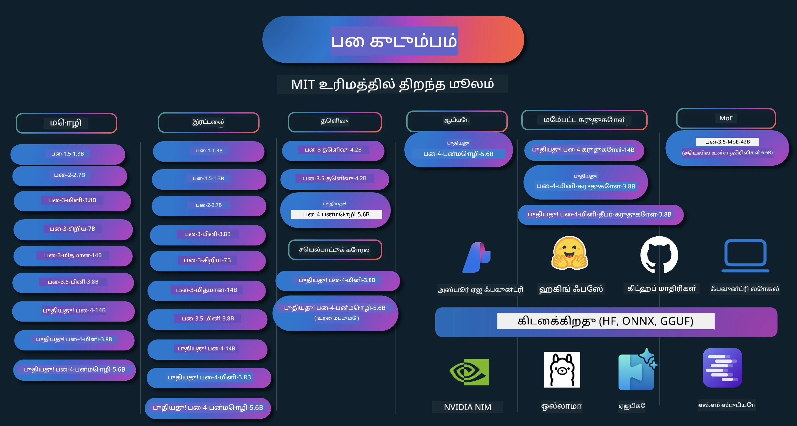

# Phi Cookbook: Microsoft இன் Phi மாதிரிகளுடன் கைமுறை உதாரணங்கள்

[](https://codespaces.new/microsoft/phicookbook)
[](https://vscode.dev/redirect?url=vscode://ms-vscode-remote.remote-containers/cloneInVolume?url=https://github.com/microsoft/phicookbook)

[](https://GitHub.com/microsoft/phicookbook/graphs/contributors/?WT.mc_id=aiml-137032-kinfeylo)
[](https://GitHub.com/microsoft/phicookbook/issues/?WT.mc_id=aiml-137032-kinfeylo)
[](https://GitHub.com/microsoft/phicookbook/pulls/?WT.mc_id=aiml-137032-kinfeylo)
[](http://makeapullrequest.com?WT.mc_id=aiml-137032-kinfeylo)

[](https://GitHub.com/microsoft/phicookbook/watchers/?WT.mc_id=aiml-137032-kinfeylo)
[](https://GitHub.com/microsoft/phicookbook/network/?WT.mc_id=aiml-137032-kinfeylo)
[](https://GitHub.com/microsoft/phicookbook/stargazers/?WT.mc_id=aiml-137032-kinfeylo)

[](https://discord.com/invite/ByRwuEEgH4)

Phi என்பது Microsoft உருவாக்கிய ஒரு தொடர் திறந்த மூல AI மாதிரிகள் ஆகும்.

Phi தற்போது மிகவும் சக்திவாய்ந்த மற்றும் செலவினமான சிறிய மொழி மாதிரி (SLM) ஆகும், இது பல மொழிகள், தர்க்கவியல், எழுத்து/உரையாடல் உருவாக்கம், குறியீட்டமைத்தல், படங்கள், ஒலி மற்றும் பிற பரிமாணங்களில் சிறந்த முன்னேற்றங்களை பெற்றுள்ளது.

நீங்கள் Phi-ஐ மேகத்தில் அல்லது எட்ஜ் சாதனங்களில் பரிமாறலாம், மேலும் குறைந்த கணக்கீட்டு சக்தியுடன் உருவாக்கும் AI பயன்பாடுகளை எளிதாக கட்டமைக்கலாம்.

இந்த வளங்களை பயன்படுத்த துவங்குவதற்கு கீழ்காணும் படிகளை பின்பற்றவும்:
1. **களஞ்சியத்தை Fork செய்யவும்**: சொடுக்கவும் [](https://GitHub.com/microsoft/phicookbook/network/?WT.mc_id=aiml-137032-kinfeylo)
2. **களஞ்சியத்தை Clone செய்யவும்**:   `git clone https://github.com/microsoft/PhiCookBook.git`
3. [**Microsoft AI Discord சமூகத்தில் சேரவும் மற்றும் நிபுணர்கள் மற்றும் சக மாண்புமிகு டெவலப்பர்களைப் பார்க்கவும்**](https://discord.com/invite/ByRwuEEgH4?WT.mc_id=aiml-137032-kinfeylo)



### 🌐 பலமொழி ஆதரவு

#### GitHub செயல்பாடு மூலமாக ஆதரவு (தானாகச் செயல்படும் மற்றும் எப்போதும் புதுப்பிக்கப்படும்)

<!-- CO-OP TRANSLATOR LANGUAGES TABLE START -->
[ஆரபிக்](../ar/README.md) | [பெங்காலி](../bn/README.md) | [பல்கேரியன்](../bg/README.md) | [பர்மீஸ் (மியான்மார்)](../my/README.md) | [சீனம் (எளியமைப்பு)](../zh-CN/README.md) | [சீனம் (பாரம்பரிய, ஹாங்காங்)](../zh-HK/README.md) | [சீனம் (பாரம்பரிய, மக்காவ்)](../zh-MO/README.md) | [சீனம் (பாரம்பரிய, தைவான்)](../zh-TW/README.md) | [குரோஷியன்](../hr/README.md) | [செக்](../cs/README.md) | [டேனிஷ்](../da/README.md) | [டச்சு](../nl/README.md) | [எஸ்தோனியன்](../et/README.md) | [பின்னிஷ்](../fi/README.md) | [பிரஞ்சு](../fr/README.md) | [ஜெர்மன்](../de/README.md) | [கிரேக்கம்](../el/README.md) | [ஹீப்ரூ](../he/README.md) | [இந்தி](../hi/README.md) | [ஹங்கேரியன்](../hu/README.md) | [இந்தோனீசியன்](../id/README.md) | [இத்தாலியன்](../it/README.md) | [ஜப்பானியன்](../ja/README.md) | [கன்னடம்](../kn/README.md) | [கொரியன்](../ko/README.md) | [லிதுவேனியன்](../lt/README.md) | [மலாய்](../ms/README.md) | [மலையாளம்](../ml/README.md) | [மராத்தி](../mr/README.md) | [நேபாளி](../ne/README.md) | [நைஜீரியன் பிகின்](../pcm/README.md) | [நார்வேஜியன்](../no/README.md) | [பெர்சியன் (ஃபார்சி)](../fa/README.md) | [போலிஷ்](../pl/README.md) | [போர்ச்சுகீஸ் (பிரேசில்)](../pt-BR/README.md) | [போர்ச்சுகீஸ் (போர்ச்சுகல்)](../pt-PT/README.md) | [பஞ்சாபி (குருமுக்ஹி)](../pa/README.md) | [ரோமானியன்](../ro/README.md) | [ரஷியன்](../ru/README.md) | [செர்பியன் (சிலிலிக்)](../sr/README.md) | [சிளோவாக்](../sk/README.md) | [ஸ்ளோவேனியன்](../sl/README.md) | [ஸ்பானிஷ்](../es/README.md) | [ஸ்வாஹிலி](../sw/README.md) | [ஸ்வீடிஷ்](../sv/README.md) | [தகாலோக் (பிலிப்பைனோ)](../tl/README.md) | [தமிழ்](./README.md) | [தெலுங்கு](../te/README.md) | [தை](../th/README.md) | [துருக்கிய](../tr/README.md) | [உக்ரைனியன்](../uk/README.md) | [உருது](../ur/README.md) | [வையட்நாமீஸ்](../vi/README.md)

> **உள்ளகமாக Clone செய்ய விரும்புகிறீர்களா?**
>
> இந்தக் களஞ்சியத்தில் 50க்கு மேற்பட்ட மொழி மொழிபெயர்ப்புகள் உள்ளன, இது பதிவேற்ற அளவை முக்கியமாக அதிகரிக்கும். மொழிபெயர்ப்புகள் இல்லாமல் clone செய்ய sparse checkout பயன்படுத்தவும்:
>
> **Bash / macOS / Linux:**
> ```bash
> git clone --filter=blob:none --sparse https://github.com/microsoft/PhiCookBook.git
> cd PhiCookBook
> git sparse-checkout set --no-cone '/*' '!translations' '!translated_images'
> ```
>
> **CMD (Windows):**
> ```cmd
> git clone --filter=blob:none --sparse https://github.com/microsoft/PhiCookBook.git
> cd PhiCookBook
> git sparse-checkout set --no-cone "/*" "!translations" "!translated_images"
> ```
>
> இது குறைந்த காலத்தில் முழு பாடத்தின் தேவையான அனைத்து உள்ளடக்கங்களையும் தரும்.
<!-- CO-OP TRANSLATOR LANGUAGES TABLE END -->

## உள்ளடக்க அட்டவணை

- அறிமுகம்
  - [Phi குடும்பத்திற்கு வரவேற்கின்றோம்](./md/01.Introduction/01/01.PhiFamily.md)
  - [உங்கள் சூழலை அமைக்க](./md/01.Introduction/01/01.EnvironmentSetup.md)
  - [முக்கிய தொழில்நுட்பங்களை புரிந்துகொள்ளுதல்](./md/01.Introduction/01/01.Understandingtech.md)
  - [Phi மாதிரிகளுக்கான AI பாதுகாப்பு](./md/01.Introduction/01/01.AISafety.md)
  - [Phi உபகரண ஆதரவு](./md/01.Introduction/01/01.Hardwaresupport.md)
  - [Phi மாதிரிகள் மற்றும் பல தளங்களில் கிடைக்கும் இடம்](./md/01.Introduction/01/01.Edgeandcloud.md)
  - [Guidance-ai மற்றும் Phi பயன்படுத்துதல்](./md/01.Introduction/01/01.Guidance.md)
  - [GitHub சந்தை மாதிரிகள்](https://github.com/marketplace/models)
  - [Azure AI மாதிரி பட்டியல்](https://ai.azure.com)

- வெவ்வேறு சூழலில் Phi நேர்த்தி
    -  [Hugging face](./md/01.Introduction/02/01.HF.md)
    -  [GitHub மாதிரிகள்](./md/01.Introduction/02/02.GitHubModel.md)
    -  [Microsoft Foundry மாதிரி பட்டியல்](./md/01.Introduction/02/03.AzureAIFoundry.md)
    -  [Ollama](./md/01.Introduction/02/04.Ollama.md)
    -  [AI கருவி VSCode (AITK)](./md/01.Introduction/02/05.AITK.md)
    -  [NVIDIA NIM](./md/01.Introduction/02/06.NVIDIA.md)
    -  [Foundry உள்ளூர்](./md/01.Introduction/02/07.FoundryLocal.md)

- Phi குடும்பத்தின் நேர்த்தி
    - [iOS இல் Phi நேர்த்தி](./md/01.Introduction/03/iOS_Inference.md)
    - [ஆண்ட்ராய்டு இல் Phi நேர்த்தி](./md/01.Introduction/03/Android_Inference.md)
    - [Jetson இல் Phi நேர்த்தி](./md/01.Introduction/03/Jetson_Inference.md)
    - [AI PC இல் Phi நேர்த்தி](./md/01.Introduction/03/AIPC_Inference.md)
    - [Apple MLX வடிவமைப்பு உடன் Phi நேர்த்தி](./md/01.Introduction/03/MLX_Inference.md)
    - [உள்ளூர் சேவையகத்தில் Phi நேர்த்தி](./md/01.Introduction/03/Local_Server_Inference.md)
    - [AI கருவி பயன்படுத்தி தொலை சேவையகத்தில் Phi நேர்த்தி](./md/01.Introduction/03/Remote_Interence.md)
    - [Rust உடன் Phi நேர்த்தி](./md/01.Introduction/03/Rust_Inference.md)
    - [உள்ளூரில் Phi--Vision நேர்த்தி](./md/01.Introduction/03/Vision_Inference.md)
    - [Kaito AKS, Azure Containers (அதிகாரப்பூர்வ ஆதரவு) உடன் Phi நேர்த்தி](./md/01.Introduction/03/Kaito_Inference.md)
-  [Phi குடும்பத்தை அளவிடுதல்](./md/01.Introduction/04/QuantifyingPhi.md)
    - [llama.cpp பயன்படுத்தி Phi-3.5 / 4 அளவிடுதல்](./md/01.Introduction/04/UsingLlamacppQuantifyingPhi.md)
    - [onnxruntime க்கான Generative AI நீட்சிகள் பயன்படுத்தி Phi-3.5 / 4 அளவிடுதல்](./md/01.Introduction/04/UsingORTGenAIQuantifyingPhi.md)
    - [Intel OpenVINO பயன்படுத்தி Phi-3.5 / 4 அளவிடுதல்](./md/01.Introduction/04/UsingIntelOpenVINOQuantifyingPhi.md)
    - [Apple MLX வடிவமைப்பு பயன்படுத்தி Phi-3.5 / 4 அளவிடுதல்](./md/01.Introduction/04/UsingAppleMLXQuantifyingPhi.md)

-  Phi மதிப்பீடு
    - [பொறுப்பான AI](./md/01.Introduction/05/ResponsibleAI.md)
    - [மதிப்பீட்டிற்கு Microsoft Foundry](./md/01.Introduction/05/AIFoundry.md)
    - [மதிப்பீட்டிற்கு Promptflow பயன்படுத்துதல்](./md/01.Introduction/05/Promptflow.md)

- Azure AI தேடல் உடன் RAG
    - [Phi-4-mini மற்றும் Phi-4-multimodal(RAG) ஐ Azure AI தேடல் உடன் எப்படி பயன்படுத்துவது](https://github.com/microsoft/PhiCookBook/blob/main/code/06.E2E/E2E_Phi-4-RAG-Azure-AI-Search.ipynb)

- Phi பயன்பாட்டு வளர்ப்பு உதாரணங்கள்
  - எழுத்து மற்றும் உரையாடல் பயன்பாடுகள்
    - Phi-4 உதாரணங்கள் 🆕
      - [📓] [Phi-4-mini ONNX மாதிரியுடன் உரையாடல்](./md/02.Application/01.TextAndChat/Phi4/ChatWithPhi4ONNX/README.md)
      - [Phi-4 உள்ளூர் ONNX மாதிரியுடன் .NET உரையாடல்](../../md/04.HOL/dotnet/src/LabsPhi4-Chat-01OnnxRuntime)
      - [Semantic Kernel பயன்படுத்தி Phi-4 ONNX உடன் .NET கன்சோல் செயலி உரையாடல்](../../md/04.HOL/dotnet/src/LabsPhi4-Chat-02SK)
    - Phi-3 / 3.5 உதாரணங்கள்
      - [Phi3, ONNX Runtime வலை மற்றும் WebGPU பயன்படுத்தி உலாவியில் உள்ளூர் உரையாடல் இயந்திரம்](https://github.com/microsoft/onnxruntime-inference-examples/tree/main/js/chat)
      - [OpenVino உரையாடல்](./md/02.Application/01.TextAndChat/Phi3/E2E_OpenVino_Chat.md)
      - [பல மாதிரி - இடைமுக Phi-3-mini மற்றும் OpenAI விசும்பு](./md/02.Application/01.TextAndChat/Phi3/E2E_Phi-3-mini_with_whisper.md)
      - [MLFlow - ஓரம் கட்டி Phi-3 ஐ MLFlow உடன் பயன்படுத்துவது](./md//02.Application/01.TextAndChat/Phi3/E2E_Phi-3-MLflow.md)
      - [மாதிரி மேம்படுத்தல் - ONNX ரன்டைம் வலைக்கான Phi-3-மினி மாதிரியை Olive உடன் எப்படி மேம்படுத்துவது](https://github.com/microsoft/Olive/tree/main/examples/phi3)
      - [Phi-3 mini-4k-instruct-onnx உடன் WinUI3 செயலி](https://github.com/microsoft/Phi3-Chat-WinUI3-Sample/)
      -[WinUI3 பல மாதிரி AI சக்திவாய்ந்த குறிப்பு செயலி மாதிரி](https://github.com/microsoft/ai-powered-notes-winui3-sample)
      - [சூழலுக்கு உகந்த தனிப்பயன் Phi-3 மாதிரிகளை Prompt flow உடன் நன்றாக திருத்தவும் ஒருங்கிணைக்கவும்](./md/02.Application/01.TextAndChat/Phi3/E2E_Phi-3-FineTuning_PromptFlow_Integration.md)
      - [Microsoft Foundry இல் Prompt flow உடன் தனிப்பயன் Phi-3 மாதிரிகளை நன்றாக திருத்தவும் ஒருங்கிணைக்கவும்](./md/02.Application/01.TextAndChat/Phi3/E2E_Phi-3-FineTuning_PromptFlow_Integration_AIFoundry.md)
      - [Microsoft இன் பொறுப்பு AI கொள்கைகள் மையமாக்கப்பட்ட Microsoft Foundry இல் நன்றாக திருத்தப்பட்ட Phi-3 / Phi-3.5 Model ஐ மதிப்பாய்வு செய்யவும்](./md/02.Application/01.TextAndChat/Phi3/E2E_Phi-3-Evaluation_AIFoundry.md)
      - [📓] [Phi-3.5-mini-instruct மொழி கணிப்பு மாதிரி (சீன/ஆங்கிலம்)](./md/02.Application/01.TextAndChat/Phi3/phi3-instruct-demo.ipynb)
      - [Phi-3.5-Instruct WebGPU RAG உரையாடல் பாட்டு](./md/02.Application/01.TextAndChat/Phi3/WebGPUWithPhi35Readme.md)
      - [Windows GPU ஐ பயன்படுத்தி Phi-3.5-Instruct ONNX உடன் Prompt flow தீர்வை உருவாக்குதல்](./md/02.Application/01.TextAndChat/Phi3/UsingPromptFlowWithONNX.md)
      - [Android செயலி உருவாக்க Microsoft Phi-3.5 tflite ஐ பயன்படுத்துதல்](./md/02.Application/01.TextAndChat/Phi3/UsingPhi35TFLiteCreateAndroidApp.md)
      - [Microsoft.ML.OnnxRuntime பயன்படுத்தி உள்ளூர் ONNX Phi-3 மாதிரியை பயன்படுத்தி கேள்வி மற்றும் பதில் .NET உதாரணம்](../../md/04.HOL/dotnet/src/LabsPhi301)
      - [Semantic Kernel மற்றும் Phi-3 உடன் கன்சோல் உரையாடல் .NET செயலி](../../md/04.HOL/dotnet/src/LabsPhi302)

  - Azure AI முன்கூட்டிய தொடக்கக் குறியீடு உதாரணங்கள் 
    - Phi-4 உதாரணங்கள் 🆕
      - [📓] [Phi-4-multimodal பயன்படுத்தி திட்டக் குறியீட்டை உருவாக்கவும்](./md/02.Application/02.Code/Phi4/GenProjectCode/README.md)
    - Phi-3 / 3.5 உதாரணங்கள்
      - [Microsoft Phi-3 குடும்பத்துடன் உங்கள் சொந்த Visual Studio Code GitHub Copilot உரையாடலை உருவாக்கவும்](./md/02.Application/02.Code/Phi3/VSCodeExt/README.md)
      - [GitHub மாதிரிகளின் உதவியுடன் Phi-3.5 உடன் உங்கள் சொந்த Visual Studio Code Chat Copilot முகவரியை உருவாக்கவும்](/md/02.Application/02.Code/Phi3/CreateVSCodeChatAgentWithGitHubModels.md)

  - முன்னேற்றமான யோசனைக் கூடுதல் உதாரணங்கள்
    - Phi-4 உதாரணங்கள் 🆕
      - [📓] [Phi-4-mini_reasoning அல்லது Phi-4_reasoning உதாரணங்கள்](./md/02.Application/03.AdvancedReasoning/Phi4/AdvancedResoningPhi4mini/README.md)
      - [📓] [Microsoft Olive உடன் Phi-4-mini_reasoning நன்றாக திருத்துதல்](./md/02.Application/03.AdvancedReasoning/Phi4/AdvancedResoningPhi4mini/olive_ft_phi_4_reasoning_with_medicaldata.ipynb)
      - [📓] [Apple MLX உடன் Phi-4-mini_reasoning நன்றாக திருத்துதல்](./md/02.Application/03.AdvancedReasoning/Phi4/AdvancedResoningPhi4mini/mlx_ft_phi_4_reasoning_with_medicaldata.ipynb)
      - [📓] [GitHub மாதிரிகளுடன் Phi-4-mini_reasoning](./md/02.Application/02.Code/Phi4r/github_models_inference.ipynb)
      - [📓] [Microsoft Foundry மாதிரிகளுடன் Phi-4-mini_reasoning](./md/02.Application/02.Code/Phi4r/azure_models_inference.ipynb)
  - டெமோக்கள்
      - [Phi-4-mini டெமோக்கள் Hugging Face Spaces இல் நடத்தப்படுகிறது](https://huggingface.co/spaces/microsoft/phi-4-mini?WT.mc_id=aiml-137032-kinfeylo)
      - [Phi-4-multimodal டெமோக்கள் Hugging Face Spaces இல் நடத்தப்படுகிறது](https://huggingface.co/spaces/microsoft/phi-4-multimodal?WT.mc_id=aiml-137032-kinfeylo)
  - காட்சி உதாரணங்கள்
    - Phi-4 உதாரணங்கள் 🆕
      - [📓] [Phi-4-multimodal ஐ பயன்படுத்தி படங்களை படிக்கவும் குறியீட்டை உருவாக்கவும்](./md/02.Application/04.Vision/Phi4/CreateFrontend/README.md) 
    - Phi-3 / 3.5 உதாரணங்கள்
      -  [📓][Phi-3-vision-பட உரை-உரைக்கு மாற்றம்](./md/02.Application/04.Vision/Phi3/E2E_Phi-3-vision-image-text-to-text-online-endpoint.ipynb)
      - [Phi-3-vision-ONNX](https://onnxruntime.ai/docs/genai/tutorials/phi3-v.html)
      - [📓][Phi-3-vision CLIP பதிப்பு](./md/02.Application/04.Vision/Phi3/E2E_Phi-3-vision-image-text-to-text-online-endpoint.ipynb)
      - [டெமோ: Phi-3 மறுசுழற்சி](https://github.com/jennifermarsman/PhiRecycling/)
      - [Phi-3-vision - காட்சி மொழி உதவியாளர் - Phi3-விஷன் மற்றும் OpenVINO உடன்](https://docs.openvino.ai/nightly/notebooks/phi-3-vision-with-output.html)
      - [Phi-3 காட்சி Nvidia NIM](./md/02.Application/04.Vision/Phi3/E2E_Nvidia_NIM_Vision.md)
      - [Phi-3 காட்சி OpenVino](./md/02.Application/04.Vision/Phi3/E2E_OpenVino_Phi3Vision.md)
      - [📓][Phi-3.5 காட்சி பன்முக காட்சி அல்லது பன்முக பட மாதிரி](./md/02.Application/04.Vision/Phi3/phi3-vision-demo.ipynb)
      - [Microsoft.ML.OnnxRuntime .NET பயன்படுத்தி Phi-3 காட்சி உள்ளூர் ONNX மாதிரி](../../md/04.HOL/dotnet/src/LabsPhi303)
      - [மெனு அடிப்படையிலான Phi-3 காட்சி உள்ளூர் ONNX மாதிரி Microsoft.ML.OnnxRuntime .NET பயன்படுத்தி](../../md/04.HOL/dotnet/src/LabsPhi304)

  - கணித உதாரணங்கள்
    -  Phi-4-Mini-Flash-Reasoning-Instruct உதாரணங்கள் 🆕 [Phi-4-Mini-Flash-Reasoning-Instruct உடன் கணித டெமோ](./md/02.Application/09.Math/MathDemo.ipynb)

  - ஒலிப்பிழை உதாரணங்கள்
    - Phi-4 உதாரணங்கள் 🆕
      - [📓] [Phi-4-multimodal பயன்படுத்தி ஒலிப்பிழை உரைகளை எடுக்கல்](./md/02.Application/05.Audio/Phi4/Transciption/README.md)
      - [📓] [Phi-4-multimodal ஒலிப்பிழை உதாரணம்](./md/02.Application/05.Audio/Phi4/Siri/demo.ipynb)
      - [📓] [Phi-4-multimodal பேச்சு மொழிபெயர்ப்பு உதாரணம்](./md/02.Application/05.Audio/Phi4/Translate/demo.ipynb)
      - [.NET கன்சோல் செயலி Phi-4-multimodal ஆடியோ பதிவை பகுப்பாய்வுசெய்து உரை உருவாக்கும்](../../md/04.HOL/dotnet/src/LabsPhi4-MultiModal-02Audio)

  - MOE உதாரணங்கள்
    - Phi-3 / 3.5 உதாரணங்கள்
      - [📓] [Phi-3.5 வல்லுநர் கலவை மாதிரிகள் (MoEs) சமூக ஊடகம் உதாரணம்](./md/02.Application/06.MoE/Phi3/phi3_moe_demo.ipynb)
      - [📓] [NVIDIA NIM Phi-3 MOE, Azure AI Search மற்றும் LlamaIndex உடன் ரிட்ரிவல்-ஆக்மெண்டட் ஜெனரேஷன் (RAG) குழாயை உருவாக்குதல்](./md/02.Application/06.MoE/Phi3/azure-ai-search-nvidia-rag.ipynb)
      - 
  - செயல்பாடுகள் அழைப்பு உதாரணங்கள்
    - Phi-4 உதாரணங்கள் 🆕
      -  [📓] [Phi-4-mini உடன் செயல்பாடு அழைப்பை பயன்படுத்துதல்](./md/02.Application/07.FunctionCalling/Phi4/FunctionCallingBasic/README.md)
      -  [📓] [Phi-4-mini உடன் பல முகவர்கள் உருவாக்க செயல்பாடு அழைப்பை பயன்படுத்துதல்](./md/02.Application/07.FunctionCalling/Phi4/Multiagents/Phi_4_mini_multiagent.ipynb)
      -  [📓] [Ollama உடன் செயல்பாடு அழைப்பை பயன்படுத்துதல்](./md/02.Application/07.FunctionCalling/Phi4/Ollama/ollama_functioncalling.ipynb)
      -  [📓] [ONNX உடன் செயல்பாடு அழைப்பை பயன்படுத்துதல்](./md/02.Application/07.FunctionCalling/Phi4/ONNX/onnx_parallel_functioncalling.ipynb)
  - பல்முறை கலவைக் குறியீடு உதாரணங்கள்
    - Phi-4 உதாரணங்கள் 🆕
      -  [📓] [தொழில்நுட்ப பத்திரிகையாளர் ஆக Phi-4-multimodal ஐ பயன்படுத்துதல்](./md/02.Application/08.Multimodel/Phi4/TechJournalist/phi_4_mm_audio_text_publish_news.ipynb)
      - [.NET கன்சோல் செயலி Phi-4-multimodal பயன்படுத்தி படங்களை பகுப்பாய்வு செய்தல்](../../md/04.HOL/dotnet/src/LabsPhi4-MultiModal-01Images)

- Phi மாதிரிகள் நன்றாக திருத்தல்
  - [நன்றாக திருத்தும் சூழல்கள்](./md/03.FineTuning/FineTuning_Scenarios.md)
  - [நன்றாக திருத்தல் vs RAG](./md/03.FineTuning/FineTuning_vs_RAG.md)
  - [Phi-3 ஐ தொழில்துறை வல்லுநராக மாற்ற நன்றாக திருத்தல்](./md/03.FineTuning/LetPhi3gotoIndustriy.md)
  - [VS Code க்கான AI கருவி கிட்டுடன் Phi-3 நன்றாக திருத்தல்](./md/03.FineTuning/Finetuning_VSCodeaitoolkit.md)
  - [Azure Machine Learning சேவையுடன் Phi-3 நன்றாக திருத்தல்](./md/03.FineTuning/Introduce_AzureML.md)
  - [Lora உடன் Phi-3 நன்றாக திருத்தல்](./md/03.FineTuning/FineTuning_Lora.md)
  - [QLora உடன் Phi-3 நன்றாக திருத்தல்](./md/03.FineTuning/FineTuning_Qlora.md)
  - [Microsoft Foundry உடன் Phi-3 நன்றாக திருத்தல்](./md/03.FineTuning/FineTuning_AIFoundry.md)
  - [Azure ML CLI/SDK உடன் Phi-3 நன்றாக திருத்தல்](./md/03.FineTuning/FineTuning_MLSDK.md)
  - [Microsoft Olive உடன் நன்றாக திருத்தல்](./md/03.FineTuning/FineTuning_MicrosoftOlive.md)
  - [Microsoft Olive கை-பயிற்சி ஆய்வகம் உதவி நன்றாக திருத்தல்](./md/03.FineTuning/olive-lab/readme.md)
  - [Weights மற்றும் Bias உடன் Phi-3-vision நன்றாக திருத்தல்](./md/03.FineTuning/FineTuning_Phi-3-visionWandB.md)
  - [Apple MLX கட்டமைப்புடன் Phi-3 நன்றாக திருத்தல்](./md/03.FineTuning/FineTuning_MLX.md)
  - [Phi-3-vision நன்றாக திருத்தல் (அதிகாரப்பூர்வ ஆதரவு)](./md/03.FineTuning/FineTuning_Vision.md)
  - [Kaito AKS, Azure கன்டெய்னர்கள் உடன் Phi-3 நன்றாக திருத்தல் (அதிகாரப்பூர்வ ஆதரவு)](./md/03.FineTuning/FineTuning_Kaito.md)
  - [Phi-3 மற்றும் 3.5 Vision நன்றாக திருத்தல்](https://github.com/2U1/Phi3-Vision-Finetune)

- கைபயிற்சி ஆய்வு
  - [கட்டுனர் மாதிரிகள் மற்றும் LLMs, SLMs, உள்ளூர்தல் மேம்பாடு மற்றும் இன்னும் பலவை ஆராய்தல்](https://github.com/microsoft/aitour-exploring-cutting-edge-models)
  - [NLP திறன் திறந்துவைக்கும்: Microsoft Olive உடன் நன்றாக திருத்தல்](https://github.com/azure/Ignite_FineTuning_workshop)
- أكاديمية ஆய்வு செய்திகள் மற்றும் வெளியீடுகள்
  - [Textbooks Are All You Need II: phi-1.5 தொழில்நுட்ப அறிக்கை](https://arxiv.org/abs/2309.05463)
  - [Phi-3 தொழில்நுட்ப அறிக்கை: உங்கள் போனில் உள்ள ஒரு மிக திறமையான மொழி மாதிரி](https://arxiv.org/abs/2404.14219)
  - [Phi-4 தொழில்நுட்ப அறிக்கை](https://arxiv.org/abs/2412.08905)
  - [Phi-4-Mini தொழில்நுட்ப அறிக்கை: சுருக்கமான ஆனால் சக்திவாய்ந்த பன்மொழி மாதிரிகள் Mixture-of-LoRAs மூலம்](https://arxiv.org/abs/2503.01743)
  - [உள்நகரு அழைப்புக்கு சிறிய மொழி மாதிரிகளை சிறப்புப்படுத்தல்](https://arxiv.org/abs/2501.02342)
  - [(WhyPHI) பன்மைத் தேர்வு கேள்விக்கு பதில் அளிப்பதற்கான PHI-3 ஐ நுண்ணறிதல்: முறைவியல், முடிவுகள் மற்றும் சவால்கள்](https://arxiv.org/abs/2501.01588)
  - [Phi-4-கருத்தாற்றல் தொழில்நுட்ப அறிக்கை](https://www.microsoft.com/en-us/research/wp-content/uploads/2025/04/phi_4_reasoning.pdf)
  - [Phi-4-mini-கருத்தாற்றல் தொழில்நுட்ப அறிக்கை](https://huggingface.co/microsoft/Phi-4-mini-reasoning/blob/main/Phi-4-Mini-Reasoning.pdf)

## பை மாதிரிகளை பயன்படுத்தல்

### Microsoft Foundry இல் பை

நீங்கள் Microsoft Phi ஐ எப்படி பயன்படுத்துவது மற்றும் உங்கள் வேறுபட்ட ஹார்ட்வேரு சாதனங்களில் E2E தீர்வுகளை எப்படி கட்டமைப்பது என்பதை கற்றுக்கொள்ளலாம். Phi ஐ நேரடியாக அனுபவிக்க, மாதிரிகளுடன் விளையாட ஆரம்பித்து உங்கள் சூழலுக்குத் தக்கவாறு Phi ஐ முறைப்படுத்துங்கள் [Microsoft Foundry Azure AI Model Catalog](https://aka.ms/phi3-azure-ai) இல். மேலும் அறிய Getting Started with [Microsoft Foundry](/md/02.QuickStart/AzureAIFoundry_QuickStart.md) ஐப் பாருங்கள்.

**பிளேகிரௌண்ட்**  
ஒவ்வொரு மாதிரிக்கும் மாதிரியை சோதிக்க தனித்துவமான பிளேகிரௌண்ட் உள்ளது [Azure AI Playground](https://aka.ms/try-phi3).

### GitHub மாதிரிகளில் பை

நீங்கள் Microsoft Phi ஐ எப்படி பயன்படுத்துவது மற்றும் உங்கள் பல்வேறு ஹார்ட்வேரு சாதனங்களில் E2E தீர்வுகளை எப்படி கட்டமைப்பது என்பதை கற்றுக்கொள்ளலாம். Phi ஐ நேரடியாக அனுபவிக்க, மாதிரிகளுடன் விளையாட ஆரம்பித்து உங்கள் சூழலுக்குத் தக்கவாறு Phi ஐ முறைப்படுத்துங்கள் [GitHub Model Catalog](https://github.com/marketplace/models?WT.mc_id=aiml-137032-kinfeylo) இல். மேலும் அறிய Getting Started with [GitHub Model Catalog](/md/02.QuickStart/GitHubModel_QuickStart.md) ஐப் பாருங்கள்.

**பிளேகிரௌண்ட்**  
ஒவ்வொரு மாதிரிக்கும் மாதிரியை சோதிக்க தனித்துவமான [பிளேகிரௌண்ட் உள்ளது](/md/02.QuickStart/GitHubModel_QuickStart.md).

### Hugging Face இல் பை

மாதிரியை நீங்கள் [Hugging Face](https://huggingface.co/microsoft) இல் காணலாம்.

**பிளேகிரௌண்ட்**  
[Hugging Chat playground](https://huggingface.co/chat/models/microsoft/Phi-3-mini-4k-instruct)

## 🎒 பிற பாடநெறிகள்

எங்கள் குழு மற்ற பாடநெறிகளை உருவாக்குகிறது! பார்:

<!-- CO-OP TRANSLATOR OTHER COURSES START -->
### LangChain
[](https://aka.ms/langchain4j-for-beginners)
[](https://aka.ms/langchainjs-for-beginners?WT.mc_id=m365-94501-dwahlin)
[](https://github.com/microsoft/langchain-for-beginners?WT.mc_id=m365-94501-dwahlin)
---

### Azure / Edge / MCP / Agents
[](https://github.com/microsoft/AZD-for-beginners?WT.mc_id=academic-105485-koreyst)
[](https://github.com/microsoft/edgeai-for-beginners?WT.mc_id=academic-105485-koreyst)
[](https://github.com/microsoft/mcp-for-beginners?WT.mc_id=academic-105485-koreyst)
[](https://github.com/microsoft/ai-agents-for-beginners?WT.mc_id=academic-105485-koreyst)

---

### உருவாக்கும் AI தொடர்
[](https://github.com/microsoft/generative-ai-for-beginners?WT.mc_id=academic-105485-koreyst)
[-9333EA?style=for-the-badge&labelColor=E5E7EB&color=9333EA)](https://github.com/microsoft/Generative-AI-for-beginners-dotnet?WT.mc_id=academic-105485-koreyst)
[-C084FC?style=for-the-badge&labelColor=E5E7EB&color=C084FC)](https://github.com/microsoft/generative-ai-for-beginners-java?WT.mc_id=academic-105485-koreyst)
[-E879F9?style=for-the-badge&labelColor=E5E7EB&color=E879F9)](https://github.com/microsoft/generative-ai-with-javascript?WT.mc_id=academic-105485-koreyst)

---

### மூலக கற்றல்
[](https://aka.ms/ml-beginners?WT.mc_id=academic-105485-koreyst)
[](https://aka.ms/datascience-beginners?WT.mc_id=academic-105485-koreyst)
[](https://aka.ms/ai-beginners?WT.mc_id=academic-105485-koreyst)
[](https://github.com/microsoft/Security-101?WT.mc_id=academic-96948-sayoung)
[](https://aka.ms/webdev-beginners?WT.mc_id=academic-105485-koreyst)
[](https://aka.ms/iot-beginners?WT.mc_id=academic-105485-koreyst)
[](https://github.com/microsoft/xr-development-for-beginners?WT.mc_id=academic-105485-koreyst)

---

### Copilot தொடர்
[](https://aka.ms/GitHubCopilotAI?WT.mc_id=academic-105485-koreyst)
[](https://github.com/microsoft/mastering-github-copilot-for-dotnet-csharp-developers?WT.mc_id=academic-105485-koreyst)
[](https://github.com/microsoft/CopilotAdventures?WT.mc_id=academic-105485-koreyst)
<!-- CO-OP TRANSLATOR OTHER COURSES END -->

## பொறுப்பான AI

Microsoft எங்கள் வாடிக்கையாளர்கள் எங்கள் AI தயாரிப்புகளை பொறுப்புடன் பயன்படுத்த உதவுவதை, எங்கள் கற்றல்களை பகிர்ந்துகொள்வதை, மற்றும் விசுவாசம் மையமான கூட்டாண்மைகளை Transparency Notes மற்றும் Impact Assessments போன்ற கருவிகளின் மூலம் கட்டமைப்பதை உறுதிப்படுத்தியுள்ளது. இத்தகைய பல வீல்களைக் [https://aka.ms/RAI](https://aka.ms/RAI) இல் காணலாம்.  
Microsoft இன் பொறுப்பான AI அணுகுமுறை நியாயம், நம்பகத்தன்மை மற்றும் பாதுகாப்பு, தனியுரிமை மற்றும் பாதுகாப்பு, ஒருங்கிணைத்தல், வெளிப்படைத்தன்மை, மற்றும் கணக்குத் பெறுமதி என்ற AI தர்மங்கள் மீது அடிப்படையாய் உள்ளது.

பெரிய அளவிலான இயற்கை மொழி, படம், மற்றும் பேச்சு மாதிரிகள் - இவ்வளவு எடுத்துக்காட்டிலுள்ள மாதிரிகள் போன்றவை - நியாயமற்ற, நம்பகமற்ற அல்லது துரோகம் இனங்களை உருவாக்கக்கூடிய விதத்தில் நடத்தப்படலாம், இது தீங்கு விளைவிக்கும். அபாயங்கள் மற்றும் வரம்புகளைப் பற்றி தெரிந்துகொள்ள Azure OpenAI சேவை Transparency note ஐ பார்வையிடவும் [https://learn.microsoft.com/legal/cognitive-services/openai/transparency-note?tabs=text](https://learn.microsoft.com/legal/cognitive-services/openai/transparency-note?tabs=text).

இந்த அபாயங்களை குறைக்க பரிந்துரைக்கப்பட்ட தீர்வு உங்கள் கட்டமைப்பில் ஒரு பாதுகாப்பு முறைமையை சேர்ப்பது, இது தீங்கு விளைவிக்கக்கூடிய நடத்தையை கண்டறிந்து தடுக்கக்கூடியது. [Azure AI Content Safety](https://learn.microsoft.com/azure/ai-services/content-safety/overview) ஒரு சுயாதீன பாதுகாப்பு அடுக்கை வழங்குகிறது, இது பயன்பாடுகள் மற்றும் சேவைகளில் பயனரால் உருவாக்கப்பட்ட மற்றும் AI உருவாக்கிய தீங்கு விளைவிக்கும் உள்ளடக்கங்களை கண்டறிய முடியும். Azure AI Content Safety அவரும் உரை மற்றும் படம் API களையும் கொண்டுள்ளன, இது தீங்கு விளைவிக்கும் உள்ளடக்கத்தை கண்டறிய உதவுகிறது. Microsoft Foundry இல் Content Safety சேவை உங்கள் கண்காணிப்பு, ஆய்வு மற்றும் வெவ்வேறு வகை உள்ளடக்கங்களில் தீங்கு உள்ளடக்கத்தை கண்டறிய உதவும் மாதிரி குறியீடுகளை முயற்சிக்க அனுமதிக்கும். கீழ்காணும் [உறுதியான ஸ்டார்ட் ஆவணம்](https://learn.microsoft.com/azure/ai-services/content-safety/quickstart-text?tabs=visual-studio%2Clinux&pivots=programming-language-rest) சேவைக்கு கோரிக்கைகளை எடுத்து செயல்படுத்த வழிகாட்டுகிறது.
மற்றொரு பரிமாணம் யாவது மொத்த பயன்பாட்டு செயல்திறன். பன்முக மற்றும் பன்முறை மாதிரிகள் கொண்ட பயன்பாடுகளில், செயல்திறன் என்பது உங்கள் மற்றும் உங்கள் பயனர்களின் எதிர்பார்ப்புகளுக்கு ஏற்ப சিস্টம் செயல்படுவதாக பொருளாகும், அதாவது தீங்கு விளைவிக்கும் வெளிப்பாடுகளை உருவாக்காது இருக்க வேண்டும். [Performance and Quality and Risk and Safety evaluators](https://learn.microsoft.com/azure/ai-studio/concepts/evaluation-metrics-built-in) மூலம் உங்கள் மொத்த பயன்பாட்டின் செயல்திறனை மதிப்பிடுவது முக்கியம். மேலும், நீங்கள் [custom evaluators](https://learn.microsoft.com/azure/ai-studio/how-to/develop/evaluate-sdk#custom-evaluators) கொண்டு உருவாக்கி மதிப்பீடு செய்யும் திறனும் உங்களுக்கு உள்ளது.

[Azure AI Evaluation SDK](https://microsoft.github.io/promptflow/index.html) பயன்படுத்தி உங்கள் AI பயன்பாட்டை உங்கள் மேம்பாட்டு சூழலில் மதிப்பிடலாம். ஒரு சோதனை தரவு தொகுப்பு அல்லது ஒரு இலக்கைத் தருவதன் மூலம், உங்கள் உருவாக்கும் AI பயன்பாடு உருவாக்கங்கள் உள்ளமைக்கப்பட்ட மதிப்பிடியாளர்கள் அல்லது உங்கள் விருப்பப்படி உருவாக்கிய தனிப்பட்ட மதிப்பிடியாளர்களால் கணக்கிடப்படும். உங்கள் சிஸ்டத்தை மதிப்பிட azure ai evaluation sdk உடன் துவங்க [quickstart guide](https://learn.microsoft.com/azure/ai-studio/how-to/develop/flow-evaluate-sdk) தொடரலாம். ஒரு மதிப்பீட்டு இயக்கத்தை நிறைவு படுத்தியவுடன், [Microsoft Foundry](https://learn.microsoft.com/azure/ai-studio/how-to/evaluate-flow-results) இல் முடிவுகளை காட்சி வடிவில் காணலாம்.

## வர்த்தகக்குறிச் சின்னங்கள்

இந்தத் திட்டத்தில் திட்டங்கள், தயாரிப்புகள் அல்லது சேவைகளுக்கான வர்த்தகக்குறிச் சின்னங்கள் அல்லது லோகோக்கள் இருக்கலாம். மைக்ரோசாஃப்ட் வர்த்தகக்குறிச் சின்னங்கள் அல்லது லோகோக்களின் அனுமதிக்கப்பட்ட பயன்பாடு [Microsoft's Trademark & Brand Guidelines](https://www.microsoft.com/legal/intellectualproperty/trademarks/usage/general) என்பவற்றை பின்பற்றவேண்டியுள்ளது. இந்தத் திட்டத்தின் மாற்றப்பட்ட பதிப்புகளில் மைக்ரோசாஃப்ட் வர்த்தகக்குறிச் சின்னங்கள் அல்லது லோகோக்களை பயன்படுத்துவது குழப்பத்தை உருவாக்கக்கூடாது அல்லது மைக்ரோசாஃப்டின் ஆதரவாக இருப்பது தவிர்க்கப்பட வேண்டும். மூன்றாவது தரப்பு வர்த்தகக்குறிச் சின்னங்கள் அல்லது லோகோக்களின் எந்தவொரு பயன்பாடும் அந்த மூன்றாவது தரப்பின் கொள்கைகளுக்கு உட்பட்டது.

## உதவி பெறுதல்

AI செயலிகளை உருவாக்கும் போது சிக்கல் ஏற்பட்டால் அல்லது கேள்விகள் இருந்தால், சேரவும்:

[](https://aka.ms/foundry/discord)

உத்தியோக பிழைகள் அல்லது கருத்துக்களுக்காக வருக:

[](https://aka.ms/foundry/forum)

---

<!-- CO-OP TRANSLATOR DISCLAIMER START -->
**பாதுகாப்பு அறிவிப்பு**:  
இந்தக் கையேடு [Co-op Translator](https://github.com/Azure/co-op-translator) என்ற செயற்கை நுண்ணறிவு மொழிபெயர்ப்பு சேவையைப் பயன்படுத்தி மொழிபெயர்க்கப்பட்டுள்ளது. நாம் துல்லியத்திற்காக முயலினாலும், தானாக மொழிபெயர்ப்பு செய்யப்பட்டதில் பிழைகள் அல்லது தவறுகள் இருக்க வாய்ப்பு உள்ளது என்பதை உணர்ந்துகொள்ளவும். தமிழ் மொழியில் உள்ள மூலக் கையேடு அதிகாரப்பூர்வ ஆதாரமாக கருதப்பட வேண்டும். முக்கியமான தகவலுக்கு, தொழில்முறை மனித மொழிபெயர்ப்பு பரிந்துரைக்கப்படுகிறது. இந்த மொழிபெயர்ப்பின் பயன்பாட்டினால் ஏற்பட்ட ஏதேனும் தவறுதல் அல்லது தவறான புரிதல்களுக்கு நாம் பொறுப்பாளர்கள் அல்ல.
<!-- CO-OP TRANSLATOR DISCLAIMER END -->