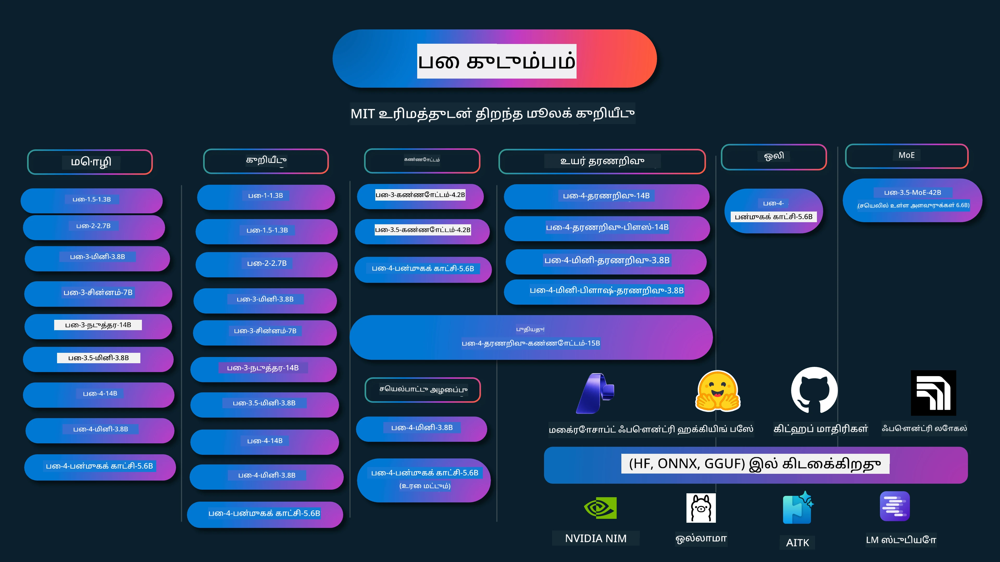

# Phi Cookbook: Microsoft இன் Phi மாதிரிகளுடன் கையால் செய்யும் உதாரணங்கள்

[](https://codespaces.new/microsoft/phicookbook)
[](https://vscode.dev/redirect?url=vscode://ms-vscode-remote.remote-containers/cloneInVolume?url=https://github.com/microsoft/phicookbook)

[](https://GitHub.com/microsoft/phicookbook/graphs/contributors/?WT.mc_id=aiml-137032-kinfeylo)
[](https://GitHub.com/microsoft/phicookbook/issues/?WT.mc_id=aiml-137032-kinfeylo)
[](https://GitHub.com/microsoft/phicookbook/pulls/?WT.mc_id=aiml-137032-kinfeylo)
[](http://makeapullrequest.com?WT.mc_id=aiml-137032-kinfeylo)

[](https://GitHub.com/microsoft/phicookbook/watchers/?WT.mc_id=aiml-137032-kinfeylo)
[](https://GitHub.com/microsoft/phicookbook/network/?WT.mc_id=aiml-137032-kinfeylo)
[](https://GitHub.com/microsoft/phicookbook/stargazers/?WT.mc_id=aiml-137032-kinfeylo)

[](https://discord.com/invite/ByRwuEEgH4)

Phi என்பது Microsoft உருவாக்கிய திறந்த மூல AI மாதிரிகள் தொடர் ஆகும். 

Phi தற்போது மிகவும் சக்திவாய்ந்த மற்றும் செலவு குறைந்த சிறிய மொழி மாதிரி (SLM) ஆகும், பன்மொழி, காரணிகை, உரை/செய்தி உருவாக்கம், குறியீடு, படங்கள், ஒலி மற்றும் பிற சூழல்களில் சிறந்த படிவங்கேற்றங்களை கொண்டுள்ளது. 

நீங்கள் Phi ஐ மேகத்திலோ அல்லது எட்ஜ் சாதனங்களிலும் பயன்படுத்தலாம், மற்றும் குறைந்த கணினிசார் திறனுடன் உருவாக்கும் AI பயன்பாடுகளை எளிதில் கட்டமைக்கலாம்.

இந்த வளங்களைப் பயன்படுத்த ஆரம்பிக்க பின்வரும் படிகளை பின்பற்றுங்கள்:
1. **களஞ்சியத்தை Fork செய்யவும்**: கிளிக் செய்யவும் [](https://GitHub.com/microsoft/phicookbook/network/?WT.mc_id=aiml-137032-kinfeylo)
2. **களஞ்சியத்தை பிரதியெடுக்கவும்**: `git clone https://github.com/microsoft/PhiCookBook.git`
3. [**Microsoft AI Discord சமுதாயத்தில் சேரவும், நிபுணர்களும் மற்ற டெவலப்பர்களும் சந்திக்கவும்**](https://discord.com/invite/ByRwuEEgH4?WT.mc_id=aiml-137032-kinfeylo)



### 🌐 பன்மொழி ஆதரவு

#### GitHub செயல்பாட்டால் ஆதரிக்கப்படுகிறது (தானாகவும் எப்போதும் புதியதாகவும்)

<!-- CO-OP TRANSLATOR LANGUAGES TABLE START -->
[Arabic](../ar/README.md) | [Bengali](../bn/README.md) | [Bulgarian](../bg/README.md) | [Burmese (Myanmar)](../my/README.md) | [Chinese (Simplified)](../zh-CN/README.md) | [Chinese (Traditional, Hong Kong)](../zh-HK/README.md) | [Chinese (Traditional, Macau)](../zh-MO/README.md) | [Chinese (Traditional, Taiwan)](../zh-TW/README.md) | [Croatian](../hr/README.md) | [Czech](../cs/README.md) | [Danish](../da/README.md) | [Dutch](../nl/README.md) | [Estonian](../et/README.md) | [Finnish](../fi/README.md) | [French](../fr/README.md) | [German](../de/README.md) | [Greek](../el/README.md) | [Hebrew](../he/README.md) | [Hindi](../hi/README.md) | [Hungarian](../hu/README.md) | [Indonesian](../id/README.md) | [Italian](../it/README.md) | [Japanese](../ja/README.md) | [Kannada](../kn/README.md) | [Khmer](../km/README.md) | [Korean](../ko/README.md) | [Lithuanian](../lt/README.md) | [Malay](../ms/README.md) | [Malayalam](../ml/README.md) | [Marathi](../mr/README.md) | [Nepali](../ne/README.md) | [Nigerian Pidgin](../pcm/README.md) | [Norwegian](../no/README.md) | [Persian (Farsi)](../fa/README.md) | [Polish](../pl/README.md) | [Portuguese (Brazil)](../pt-BR/README.md) | [Portuguese (Portugal)](../pt-PT/README.md) | [Punjabi (Gurmukhi)](../pa/README.md) | [Romanian](../ro/README.md) | [Russian](../ru/README.md) | [Serbian (Cyrillic)](../sr/README.md) | [Slovak](../sk/README.md) | [Slovenian](../sl/README.md) | [Spanish](../es/README.md) | [Swahili](../sw/README.md) | [Swedish](../sv/README.md) | [Tagalog (Filipino)](../tl/README.md) | [Tamil](./README.md) | [Telugu](../te/README.md) | [Thai](../th/README.md) | [Turkish](../tr/README.md) | [Ukrainian](../uk/README.md) | [Urdu](../ur/README.md) | [Vietnamese](../vi/README.md)

> **உள்ளூர் க்ளோனிங்கை முன்னுரிமை தருகிறீர்களா?**
>
> இந்த களஞ்சியம் 50+ மொழி மொழிபெயர்ப்புகளை கொண்டுள்ளது, இது பதிவிறக்கம் அளவை பெரிதாக்குகிறது. மொழிபெயர்ப்புகள் இல்லாமல் க்ளோன் செய்ய, ஸ்பார்ஸ் சேகரிப்பு பயன்படுத்தவும்:
>
> **Bash / macOS / Linux:**
> ```bash
> git clone --filter=blob:none --sparse https://github.com/microsoft/PhiCookBook.git
> cd PhiCookBook
> git sparse-checkout set --no-cone '/*' '!translations' '!translated_images'
> ```
>
> **CMD (Windows):**
> ```cmd
> git clone --filter=blob:none --sparse https://github.com/microsoft/PhiCookBook.git
> cd PhiCookBook
> git sparse-checkout set --no-cone "/*" "!translations" "!translated_images"
> ```
>
> இது பாடத்திட்டத்தை முடிக்க தேவையான அனைத்தையும் மிகவும் விரைவான பதிவிறக்கம் மூலம் வழங்கும்.
<!-- CO-OP TRANSLATOR LANGUAGES TABLE END -->

## உள்ளடக்க அட்டவணை

- அறிமுகம்
  - [Phi குடும்பத்திற்கு வரவேற்பு](./md/01.Introduction/01/01.PhiFamily.md)
  - [உங்கள் சூழலை அமைக்கல்](./md/01.Introduction/01/01.EnvironmentSetup.md)
  - [முக்கிய தொழில்நுட்பங்களைப் புரிந்து கொள்வது](./md/01.Introduction/01/01.Understandingtech.md)
  - [Phi மாதிரிகளுக்கான AI பாதுகாப்பு](./md/01.Introduction/01/01.AISafety.md)
  - [Phi ஹார்ட்வேர் ஆதரவு](./md/01.Introduction/01/01.Hardwaresupport.md)
  - [பிளாட்ஃபாரங்கள் முழுவதும் Phi மாதிரிகள் மற்றும் கிடைக்கும்தல்கள்](./md/01.Introduction/01/01.Edgeandcloud.md)
  - [Guidance-ai மற்றும் Phi பயன்படுத்துதல்](./md/01.Introduction/01/01.Guidance.md)
  - [GitHub மார்க்கெட்ட்பிளேஸ் மாதிரிகள்](https://github.com/marketplace/models)
  - [Azure AI மாதிரி பட்டியல்](https://ai.azure.com)

- வெவ்வேறு சூழலில் Phi வடிதல்
    -  [Hugging face](./md/01.Introduction/02/01.HF.md)
    -  [GitHub மாதிரிகள்](./md/01.Introduction/02/02.GitHubModel.md)
    -  [Microsoft Foundry மாதிரி பட்டியல்](./md/01.Introduction/02/03.AzureAIFoundry.md)
    -  [Ollama](./md/01.Introduction/02/04.Ollama.md)
    -  [AI கருவி VSCode (AITK)](./md/01.Introduction/02/05.AITK.md)
    -  [NVIDIA NIM](./md/01.Introduction/02/06.NVIDIA.md)
    -  [Foundry உள்ளூர்](./md/01.Introduction/02/07.FoundryLocal.md)

- Phi குடும்பத்தின் வடிதல்
    - [iOS இல் Phi வடிதல்](./md/01.Introduction/03/iOS_Inference.md)
    - [Android இல் Phi வடிதல்](./md/01.Introduction/03/Android_Inference.md)
    - [Jetson இல் Phi வடிதல்](./md/01.Introduction/03/Jetson_Inference.md)
    - [AI PC இல் Phi வடிதல்](./md/01.Introduction/03/AIPC_Inference.md)
    - [Apple MLX கட்டமைப்புடன் Phi வடிதல்](./md/01.Introduction/03/MLX_Inference.md)
    - [உள்ளூர் சேவையகத்தில் Phi வடிதல்](./md/01.Introduction/03/Local_Server_Inference.md)
    - [AI கருவியைப் பயன்படுத்து ரிமோட் சேவையகத்தில் Phi வடிதல்](./md/01.Introduction/03/Remote_Interence.md)
    - [Rust உடன் Phi வடிதல்](./md/01.Introduction/03/Rust_Inference.md)
    - [உள்ளூரில் Phi--Vision வடிதல்](./md/01.Introduction/03/Vision_Inference.md)
    - [Kaito AKS, Azure கொண்டெய்னர்கள்(அதிகாரபூர்வ ஆதரவு) உடன் Phi வடிதல்](./md/01.Introduction/03/Kaito_Inference.md)
-  [Phi குடும்பத்தை அளவிடுதல்](./md/01.Introduction/04/QuantifyingPhi.md)
    - [llama.cpp பயன்படுத்தி Phi-3.5 /4 அளவிடுதல்](./md/01.Introduction/04/UsingLlamacppQuantifyingPhi.md)
    - [onnxruntimeக்கான உருவாக்கும் AI நீட்சிகளைப் பயன்படுத்தி Phi-3.5 /4 அளவிடுதல்](./md/01.Introduction/04/UsingORTGenAIQuantifyingPhi.md)
    - [Intel OpenVINO பயன்படுத்தி Phi-3.5 /4 அளவிடுதல்](./md/01.Introduction/04/UsingIntelOpenVINOQuantifyingPhi.md)
    - [Apple MLX கட்டமைப்பைப் பயன்படுத்தி Phi-3.5 /4 அளவிடுதல்](./md/01.Introduction/04/UsingAppleMLXQuantifyingPhi.md)

-  Phi மதிப்பீடு
    - [பொறுப்பான AI](./md/01.Introduction/05/ResponsibleAI.md)
    - [மதிப்பீட்டிற்கு Microsoft Foundry](./md/01.Introduction/05/AIFoundry.md)
    - [மதிப்பீட்டிற்கு Promptflow பயன்படுத்துதல்](./md/01.Introduction/05/Promptflow.md)
 
- Azure AI தேடலுடன் RAG
    - [Phi-4-mini மற்றும் Phi-4-multimodal(RAG) ஐ Azure AI தேடலுடன் எப்படி பயன்படுத்துவது](https://github.com/microsoft/PhiCookBook/blob/main/code/06.E2E/E2E_Phi-4-RAG-Azure-AI-Search.ipynb)
    - [Zero-Cloud உள்ளூர் ஹைபிரிட் RAG SQLite FTS5 மற்றும் phi-4-mini உடன்](https://github.com/microsoft/PhiCookBook/blob/main/code/06.E2E/E2E_Phi-4-mini_Local_Hybrid_RAG_SQLite_FTS5.ipynb)

- Phi பயன்பாட்டு மேம்பாட்டுக் கூடுகள்
  - உரை மற்றும் உரையாடல் பயன்பாடுகள்
    - Phi-4 உதாரணங்கள் 
      - [📓] [Phi-4-mini ONNX மாதிரியுடன் உரையாடல்](./md/02.Application/01.TextAndChat/Phi4/ChatWithPhi4ONNX/README.md)
      - [Phi-4 உள்ளூர் ONNX மாதிரியுடன் உரையாடல் .NET](../../md/04.HOL/dotnet/src/LabsPhi4-Chat-01OnnxRuntime)
      - [செயன்முறை குழாய் வைத்து Phi-4 ONNX உடன் .NET கன்சோல் பயன்பாடு](../../md/04.HOL/dotnet/src/LabsPhi4-Chat-02SK)

    - பை-3 / 3.5 மாதிரிகள்
      - [Phi3, ONNX Runtime Web மற்றும் WebGPU பயன்படுத்தி உலாவியில் உள்ளூர் அரட்டைப் பொறி](https://github.com/microsoft/onnxruntime-inference-examples/tree/main/js/chat)
      - [OpenVino அரட்டை](./md/02.Application/01.TextAndChat/Phi3/E2E_OpenVino_Chat.md)
      - [பல மாதிரிகள் - தொடர்புடைய phi-3-mini மற்றும் OpenAI விசும்பு](./md/02.Application/01.TextAndChat/Phi3/E2E_Phi-3-mini_with_whisper.md)
      - [MLFlow - ஒரு உறை கட்டி Phi-3 உடன் MLFlow பயன்படுத்துவது](./md//02.Application/01.TextAndChat/Phi3/E2E_Phi-3-MLflow.md)
      - [மாதிரி மேம்படுத்தல் - Olive உடன் ONNX Runtime Webக்கு Phi-3-min மாதிரியை எப்படி மேம்படுத்துவது](https://github.com/microsoft/Olive/tree/main/examples/phi3)
      - [Phi-3 mini-4k-instruct-onnx உடன் WinUI3 பயன்பாடுகள்](https://github.com/microsoft/Phi3-Chat-WinUI3-Sample/)
      -[WinUI3 பல மாதிரி AI வழங்கிய குறிப்பு பயன்பாட்டின் மாதிரி](https://github.com/microsoft/ai-powered-notes-winui3-sample)
      - [தனி Phi-3 மாதிரிகளை உரைப்பலகை ஓட்டத்தில் சிறப்பாக திருத்தி ஒருங்கிணைப்பது](./md/02.Application/01.TextAndChat/Phi3/E2E_Phi-3-FineTuning_PromptFlow_Integration.md)
      - [Microsoft Foundryல் உரைப்பலகை ஓட்டத்துடன் தனியார் Phi-3 மாதிரிகளை சிறப்பாக திருத்தி ஒருங்கிணைப்பது](./md/02.Application/01.TextAndChat/Phi3/E2E_Phi-3-FineTuning_PromptFlow_Integration_AIFoundry.md)
      - [Microsoft Foundryல் Microsoftன் பொறுப்பான AI கொள்கைகளுக்கு முக்கியத்துவம் கொடுத்து சிறப்பாக திருத்தப்பட்ட Phi-3 / Phi-3.5 மாதிரியை மதிப்பாய்வு செய்வது](./md/02.Application/01.TextAndChat/Phi3/E2E_Phi-3-Evaluation_AIFoundry.md)
      - [📓] [Phi-3.5-mini-instruct மொழிப் பூர்வீக மாதிரி (சீனா/ஆங்கிலம்)](./md/02.Application/01.TextAndChat/Phi3/phi3-instruct-demo.ipynb)
      - [Phi-3.5-Instruct WebGPU RAG அரட்டைப் பொறி](./md/02.Application/01.TextAndChat/Phi3/WebGPUWithPhi35Readme.md)
      - [Phi-3.5-Instruct ONNX உடன் Windows GPU பயன்படுத்தி உரைப்பலகை ஓட்டத் தீர்வு உருவாக்குவது](./md/02.Application/01.TextAndChat/Phi3/UsingPromptFlowWithONNX.md)
      - [Microsoft Phi-3.5 tflite பயன்படுத்தி Android பயன்பாட்டை உருவாக்குவது](./md/02.Application/01.TextAndChat/Phi3/UsingPhi35TFLiteCreateAndroidApp.md)
      - [Microsoft.ML.OnnxRuntime பயன்படுத்தி உள்ளூர் ONNX Phi-3 மாதிரியை பயன்படுத்தும் கேள்வி பதில் .NET உதாரணம்](../../md/04.HOL/dotnet/src/LabsPhi301)
      - [Semantic Kernel மற்றும் Phi-3 உடன் கான்சோல் அரட்டை .NET பயன்பாடு](../../md/04.HOL/dotnet/src/LabsPhi302)

  - Azure AI கணிப்பொறி SDK குறியீடு அடிப்படையிலான மாதிரிகள்
    - பை-4 மாதிரிகள்
      - [📓] [Phi-4-பலவகை பயன்படுத்தி திட்ட குறியீட்டை உருவாக்குதல்](./md/02.Application/02.Code/Phi4/GenProjectCode/README.md)
    - பை-3 / 3.5 மாதிரிகள்
      - [Microsoft Phi-3 குடும்பத்துடன் உங்கள் சொந்த Visual Studio Code GitHub Copilot அரட்டை உருவாக்குதல்](./md/02.Application/02.Code/Phi3/VSCodeExt/README.md)
      - [GitHub மாதிரிகளுடன் Phi-3.5 பயன்படுத்தி உங்கள் சொந்த Visual Studio Code அரட்டை Copilot முகவரியை உருவாக்குதல்](/md/02.Application/02.Code/Phi3/CreateVSCodeChatAgentWithGitHubModels.md)

  - முன்னேறிய காரணமுடைய மாதிரிகள்
    - பை-4 மாதிரிகள்
      - [📓] [Phi-4-mini-காரணம்றுக்கும் அல்லது Phi-4-காரணமுடைய மாதிரிகள்](./md/02.Application/03.AdvancedReasoning/Phi4/AdvancedResoningPhi4mini/README.md)
      - [📓] [Microsoft Olive உடன் Phi-4-mini-காரணமுடையதை சிறப்பாக திருத்தல்](./md/02.Application/03.AdvancedReasoning/Phi4/AdvancedResoningPhi4mini/olive_ft_phi_4_reasoning_with_medicaldata.ipynb)
      - [📓] [Apple MLX உடன் Phi-4-mini-காரணமுடையதை சிறப்பாக திருத்தல்](./md/02.Application/03.AdvancedReasoning/Phi4/AdvancedResoningPhi4mini/mlx_ft_phi_4_reasoning_with_medicaldata.ipynb)
      - [📓] [GitHub மாதிரிகளுடன் Phi-4-mini-காரணமுடையது](./md/02.Application/02.Code/Phi4r/github_models_inference.ipynb)
      - [📓] [Microsoft Foundry மாதிரிகளுடன் Phi-4-mini-காரணமுடையது](./md/02.Application/02.Code/Phi4r/azure_models_inference.ipynb)
  - டெமோக்கள்
      - [Hugging Face Spaces இல் Phi-4-mini டெமோக்கள்](https://huggingface.co/spaces/microsoft/phi-4-mini?WT.mc_id=aiml-137032-kinfeylo)
      - [Hugginge Face Spaces இல் Phi-4-பலவகை டெமோக்கள்](https://huggingface.co/spaces/microsoft/phi-4-multimodal?WT.mc_id=aiml-137032-kinfeylo)
  - பார்வை மாதிரிகள்
    - பை-4 மாதிரிகள்
      - [📓] [படங்களை வாசித்து குறியீடு உருவாக்க Phi-4-பலவகையைப் பயன்படுத்துவது](./md/02.Application/04.Vision/Phi4/CreateFrontend/README.md)
    - பை-3 / 3.5 மாதிரிகள்
      -  [📓][Phi-3-பார்வை-பட வாக்கியங்களை உரைக்கு மாற்றுதல்](./md/02.Application/04.Vision/Phi3/E2E_Phi-3-vision-image-text-to-text-online-endpoint.ipynb)
      - [Phi-3-பார்வை-ONNX](https://onnxruntime.ai/docs/genai/tutorials/phi3-v.html)
      - [📓][Phi-3-பார்வை CLIP இடைநிலை](./md/02.Application/04.Vision/Phi3/E2E_Phi-3-vision-image-text-to-text-online-endpoint.ipynb)
      - [டெமோ: Phi-3 மறுசுழற்சி](https://github.com/jennifermarsman/PhiRecycling/)
      - [Phi-3-பார்வை - Visual மொழி உதவியாளர் - Phi3-பார்வை மற்றும் OpenVINO உடன்](https://docs.openvino.ai/nightly/notebooks/phi-3-vision-with-output.html)
      - [Phi-3 பார்வை Nvidia NIM](./md/02.Application/04.Vision/Phi3/E2E_Nvidia_NIM_Vision.md)
      - [Phi-3 பார்வை OpenVino](./md/02.Application/04.Vision/Phi3/E2E_OpenVino_Phi3Vision.md)
      - [📓][Phi-3.5 பார்வை பல கட்டம் அல்லது பலபட மாதிரி](./md/02.Application/04.Vision/Phi3/phi3-vision-demo.ipynb)
      - [Microsoft.ML.OnnxRuntime .NET பயன்படுத்தி Phi-3 பார்வை உள்ளூர் ONNX மாதிரி](../../md/04.HOL/dotnet/src/LabsPhi303)
      - [Microsoft.ML.OnnxRuntime .NET பயன்படுத்தி மெனு அடிப்படையிலான Phi-3 பார்வை உள்ளூர் ONNX மாதிரி](../../md/04.HOL/dotnet/src/LabsPhi304)

  - காரணம்-பார்வை மாதிரிகள்
    - Phi-4-காரணம்-பார்வை-15B
      - [📓] [Jaywalking கண்டறிய Phi-4-காரணம்-பார்வை-15B பயன்படுத்துவது](./md/02.Application/10.ReasoningVision/Phi_4_reasoning_vision_15b_Jaywalking.ipynb)
      - [📓] [கணிதம் செய்ய Phi-4-காரணம்-பார்வை-15B பயன்படுத்துவது](./md/02.Application/10.ReasoningVision/Phi_4_reasoning_vision_15b_Math.ipynb)
      - [📓] [UI கண்டறிய Phi-4-காரணம்-பார்வை-15B பயன்படுத்துவது](./md/02.Application/10.ReasoningVision/Phi_4_reasoning_vision_15b_ui.ipynb)

  - கணித மாதிரிகள்
    -  Phi-4-மினி-பிளாஷ்-காரணம்-உபதேச மாதிரிகள்  [Phi-4-மினி-பிளாஷ்-காரணம்-உபதேசத்துடன் கணித டெமோ](./md/02.Application/09.Math/MathDemo.ipynb)

  - ஒலி மாதிரிகள்
    - பை-4 மாதிரிகள்
      - [📓] [Phi-4-பலவகை பயன்படுத்தி ஒலி உரைகள் எடுப்பது](./md/02.Application/05.Audio/Phi4/Transciption/README.md)
      - [📓] [Phi-4-பலவகை ஒலி மாதிரி](./md/02.Application/05.Audio/Phi4/Siri/demo.ipynb)
      - [📓] [Phi-4-பலவகை பேச்சு மொழிபெயர்ப்பு மாதிரி](./md/02.Application/05.Audio/Phi4/Translate/demo.ipynb)
      - [.NET கான்சோல் பயன்பாடு Phi-4-பலவகை ஒலியை பயன்படுத்தி ஒலி கோப்பை பகுப்பாய்வு செய்து உரையை உருவாக்குதல்](../../md/04.HOL/dotnet/src/LabsPhi4-MultiModal-02Audio)

  - MOE மாதிரிகள்
    - பை-3 / 3.5 மாதிரிகள்
      - [📓] [Phi-3.5 நிபுணர் கலவை மாதிரிகள் (MoEs) சமூக ஊடக மாதிரி](./md/02.Application/06.MoE/Phi3/phi3_moe_demo.ipynb)
      - [📓] [NVIDIA NIM Phi-3 MOE, Azure AI தேடல் மற்றும் LlamaIndex உடன் மீட்டெடுக்கப்பட்ட உருவாக்கம் (RAG) குழாயைக் கட்டுதல்](./md/02.Application/06.MoE/Phi3/azure-ai-search-nvidia-rag.ipynb)
      - 
  - செயல்பாடு அழைப்ப மாதிரிகள்
    - பை-4 மாதிரிகள் 🆕
      -  [📓] [Phi-4-மினி உடன் செயல்பாடு அழைப்பை பயன்படுத்துவது](./md/02.Application/07.FunctionCalling/Phi4/FunctionCallingBasic/README.md)
      -  [📓] [Phi-4-மினி மூலம் பல முகவர்கள் உருவாக்க செயல்பாடு அழைப்பைப் பயன்படுத்துவது](./md/02.Application/07.FunctionCalling/Phi4/Multiagents/Phi_4_mini_multiagent.ipynb)
      -  [📓] [Ollama உடன் செயல்பாடு அழைப்பைப் பயன்படுத்துவது](./md/02.Application/07.FunctionCalling/Phi4/Ollama/ollama_functioncalling.ipynb)
      -  [📓] [ONNX உடன் செயல்பாடு அழைப்பைப் பயன்படுத்துவது](./md/02.Application/07.FunctionCalling/Phi4/ONNX/onnx_parallel_functioncalling.ipynb)
  - பலவகை கலவை மாதிரிகள்
    - பை-4 மாதிரிகள் 🆕
      -  [📓] [தொழில்நுட்ப காப்புரை விளக்கப்படுத்தும் தொழில்நுட்ப எழுத்தாளர் ஆக Phi-4-பலவகையைப் பயன்படுத்துவது](./md/02.Application/08.Multimodel/Phi4/TechJournalist/phi_4_mm_audio_text_publish_news.ipynb)
      - [.NET கான்சோல் பயன்பாடு Phi-4-பலவகையைப் பயன்படுத்தி படங்களைக் கணக்கிடுதல்](../../md/04.HOL/dotnet/src/LabsPhi4-MultiModal-01Images)

- Phi மாதிரிகளை சிறப்பாக திருத்துதல்
  - [சிறப்பாக திருத்தும் சூழல்கள்](./md/03.FineTuning/FineTuning_Scenarios.md)
  - [சிறப்பாக திருத்தல் மற்றும் RAG](./md/03.FineTuning/FineTuning_vs_RAG.md)
  - [Phi-3 தொழில்துறை நிபுணராக மாறுவதை சிறப்பாக திருத்துதல்](./md/03.FineTuning/LetPhi3gotoIndustriy.md)
  - [VS Codeக்கான AI கருவிப் பொதியைப் பயன்படுத்தி Phi-3 ஐ சிறப்பாக திருத்துதல்](./md/03.FineTuning/Finetuning_VSCodeaitoolkit.md)
  - [Azure Machine Learning சேவையுடன் Phi-3 ஐ சிறப்பாக திருத்துதல்](./md/03.FineTuning/Introduce_AzureML.md)
  - [Lora உடன் Phi-3 ஐ சிறப்பாக திருத்துதல்](./md/03.FineTuning/FineTuning_Lora.md)
  - [QLora உடன் Phi-3 ஐ சிறப்பாக திருத்துதல்](./md/03.FineTuning/FineTuning_Qlora.md)
  - [Microsoft Foundry உடன் Phi-3 ஐ சிறப்பாக திருத்துதல்](./md/03.FineTuning/FineTuning_AIFoundry.md)
  - [Azure ML CLI/SDK உடன் Phi-3 ஐ சிறப்பாக திருத்துதல்](./md/03.FineTuning/FineTuning_MLSDK.md)
  - [Microsoft Olive உடன் சிறப்பாக திருத்துதல்](./md/03.FineTuning/FineTuning_MicrosoftOlive.md)
  - [Microsoft Olive செயல்முறை நடைமுறை ஆய்வு க்கான சிறப்பாக திருத்துதல்](./md/03.FineTuning/olive-lab/readme.md)
  - [Weights and Bias உடன் Phi-3-பார்வையை சிறப்பாக திருத்துதல்](./md/03.FineTuning/FineTuning_Phi-3-visionWandB.md)

  - [ஆப்பிள் MLX கட்டமைப்புடன் Phi-3 ஐ நுட்பமாக அமைத்தல்](./md/03.FineTuning/FineTuning_MLX.md)
  - [Phi-3-vision ஐ நுட்பமாக அமைத்தல் (அதிகாரப்பூர்வ ஆதரவு)](./md/03.FineTuning/FineTuning_Vision.md)
  - [Kaito AKS, Azure Containers உடன் Phi-3 ஐ நுட்பமாக அமைத்தல் (அதிகாரப்பூர்வ ஆதரவு)](./md/03.FineTuning/FineTuning_Kaito.md)
  - [Phi-3 மற்றும் 3.5 Vision ஐ நுட்பமாக அமையதிருத்தல்](https://github.com/2U1/Phi3-Vision-Finetune)

- கைபிடிக்கும் ஆய்வகம்
  - [அத்துண்டு மாடல்களை ஆராய்தல்: LLM கள், SLM கள், உள்ளக மேம்பாடு மற்றும் மேலும் பல](https://github.com/microsoft/aitour-exploring-cutting-edge-models)
  - [NLP திறன்களை திறக்குதல்: Microsoft Olive உடன் நுட்பமாக அமைத்தல்](https://github.com/azure/Ignite_FineTuning_workshop)

- அகடமிக் ஆராய்ச்சி கட்டுரைகள் மற்றும் வெளியீடுகள்
  - [Textbooks Are All You Need II: phi-1.5 தொழில்நுட்ப அறிக்கை](https://arxiv.org/abs/2309.05463)
  - [Phi-3 தொழில்நுட்ப அறிக்கை: உங்கள் கைபேசியில் உள்ள ஒரு திறமையான மொழி மாதிரியானது](https://arxiv.org/abs/2404.14219)
  - [Phi-4 தொழில்நுட்ப அறிக்கை](https://arxiv.org/abs/2412.08905)
  - [Phi-4-Mini தொழில்நுட்ப அறிக்கை: LoRAகளின் கலவையால் நெருக்கமான ஆனால் சக்திவாய்ந்த மல்டிமோடல் மொழி மாதிரிகள்](https://arxiv.org/abs/2503.01743)
  - [காரில் செயல்படும் செயல்பாடுகளுக்கான சிறிய மொழி மாதிரிகளை பரிமாற்றுதல்](https://arxiv.org/abs/2501.02342)
  - [(WhyPHI) பல்துறை வினா பதில் அளிப்பதற்கான PHI-3 நுட்பமாக அமைத்தல்: முறைகள், முடிவுகள் மற்றும் சவால்கள்](https://arxiv.org/abs/2501.01588)
  - [Phi-4-கருத்தாக்கும் தொழில்நுட்ப அறிக்கை](https://www.microsoft.com/en-us/research/wp-content/uploads/2025/04/phi_4_reasoning.pdf)
  - [Phi-4 மினி-கருத்தாக்கும் தொழில்நுட்ப அறிக்கை](https://huggingface.co/microsoft/Phi-4-mini-reasoning/blob/main/Phi-4-Mini-Reasoning.pdf)

## Phi மாதிரிகளை பயன்படுத்துதல்

### Microsoft Foundry இல் Phi

நீங்கள் Microsoft Phi ஐ எப்படி பயன்படுத்துவது மற்றும் உங்கள் வித்தியாசமான ஹார்டுவேர் சாதனங்களில் முதலில் இறுதி தீர்வுகளை எப்படி கட்டுவது என்று கற்றுகொள்ளலாம். Phi ஐ நேரடியாக அனுபவிக்க, முதலில் மாதிரிகளை விளையாடி உங்கள் சூழ்நிலைகளுக்காக Phi ஐ தனிப்பயனாக்க [Microsoft Foundry Azure AI Model Catalog](https://aka.ms/phi3-azure-ai) பயன்படுத்தலாம். மேலும் காண [Microsoft Foundry](../../../../../../../md/02.QuickStart/AzureAIFoundry_QuickStart.md ) உடன் தொடங்குங்கள்.

**விளையாட்டு மைதானம்**
ஒவ்வொரு மாதிரிக்கும் தனித்துவமான பரிசோதனை மைதானம் உள்ளது [Azure AI Playground](https://aka.ms/try-phi3).

### GitHub மாதிரிகளில் Phi

Microsoft Phi ஐ எப்படி பயன்படுத்துவது மற்றும் உங்கள் வித்தியாசமான ஹார்டுவேரில் இறுதி தீர்வுகளை எப்படி கட்டுவது என்று அறியலாம். Phi யை நேரடியாக அனுபவிக்க, முதலில் மாதிரியை விளையாடி உங்கள் சூழ்நிலைகளுக்காக Phi ஐ தனிப்பயனாக்க [GitHub Model Catalog](https://github.com/marketplace/models?WT.mc_id=aiml-137032-kinfeylo) பயன்படுத்தலாம். மேலும் காண [GitHub Model Catalog](../../../../../../../md/02.QuickStart/GitHubModel_QuickStart.md ) உடன் தொடங்குங்கள்.

**விளையாட்டு மைதானம்**
ஒவ்வொரு மாதிரிக்கும் [பரிசோதனைக்கு தனித்துவமான விளையாட்டு மைதானம்](/md/02.QuickStart/GitHubModel_QuickStart.md) உள்ளது.

### Hugging Face இல் Phi

நீங்கள் மாதிரியை [Hugging Face](https://huggingface.co/microsoft) இல் காணலாம்

**விளையாட்டு மைதானம்**
 [Hugging Chat விளையாட்டு மைதானம்](https://huggingface.co/chat/models/microsoft/Phi-3-mini-4k-instruct)

 ## 🎒 பிற பாடங்கள்

எங்கள் குழு பிற பாடங்களையும் தயாரிக்கிறது! பார்க்கலாம்:

<!-- CO-OP TRANSLATOR OTHER COURSES START -->
### LangChain
[](https://aka.ms/langchain4j-for-beginners)
[](https://aka.ms/langchainjs-for-beginners?WT.mc_id=m365-94501-dwahlin)
[](https://github.com/microsoft/langchain-for-beginners?WT.mc_id=m365-94501-dwahlin)
---

### Azure / Edge / MCP / முகவர்கள்
[](https://github.com/microsoft/AZD-for-beginners?WT.mc_id=academic-105485-koreyst)
[](https://github.com/microsoft/edgeai-for-beginners?WT.mc_id=academic-105485-koreyst)
[](https://github.com/microsoft/mcp-for-beginners?WT.mc_id=academic-105485-koreyst)
[](https://github.com/microsoft/ai-agents-for-beginners?WT.mc_id=academic-105485-koreyst)

---
 
### செயற்கை நுண்ணறிவு தொடர்
[](https://github.com/microsoft/generative-ai-for-beginners?WT.mc_id=academic-105485-koreyst)
[-9333EA?style=for-the-badge&labelColor=E5E7EB&color=9333EA)](https://github.com/microsoft/Generative-AI-for-beginners-dotnet?WT.mc_id=academic-105485-koreyst)
[-C084FC?style=for-the-badge&labelColor=E5E7EB&color=C084FC)](https://github.com/microsoft/generative-ai-for-beginners-java?WT.mc_id=academic-105485-koreyst)
[-E879F9?style=for-the-badge&labelColor=E5E7EB&color=E879F9)](https://github.com/microsoft/generative-ai-with-javascript?WT.mc_id=academic-105485-koreyst)

---
 
### முதன்மை கற்றல்
[](https://aka.ms/ml-beginners?WT.mc_id=academic-105485-koreyst)
[](https://aka.ms/datascience-beginners?WT.mc_id=academic-105485-koreyst)
[](https://aka.ms/ai-beginners?WT.mc_id=academic-105485-koreyst)
[](https://github.com/microsoft/Security-101?WT.mc_id=academic-96948-sayoung)
[](https://aka.ms/webdev-beginners?WT.mc_id=academic-105485-koreyst)
[](https://aka.ms/iot-beginners?WT.mc_id=academic-105485-koreyst)
[](https://github.com/microsoft/xr-development-for-beginners?WT.mc_id=academic-105485-koreyst)

---
 
### கோபைலட் தொடர்
[](https://aka.ms/GitHubCopilotAI?WT.mc_id=academic-105485-koreyst)
[](https://github.com/microsoft/mastering-github-copilot-for-dotnet-csharp-developers?WT.mc_id=academic-105485-koreyst)
[](https://github.com/microsoft/CopilotAdventures?WT.mc_id=academic-105485-koreyst)
<!-- CO-OP TRANSLATOR OTHER COURSES END -->

## பொறுப்பான செயற்கை நுண்ணறிவு

Microsoft நமக்கு AI தயாரிப்புகளை பொறுப்புடன் பயன்படுத்துவதற்கும், நமது கற்றல்களை பகிர்வதற்கும், Transparency Notes மற்றும் Impact Assessments போன்ற கருவிகளின் மூலம் நம்பிக்கையைக் கலந்த கூட்டமைப்புகளை உருவாக்குவதற்கும் உறுதிப்படையாக உள்ளது. இந்தப் பல வளங்களையும் [https://aka.ms/RAI](https://aka.ms/RAI) இல் காணலாம்.
Microsoft இன் பொறுப்பான செயற்கை நுண்ணறிவு அணுகுமுறை நியாயம், நம்பகத்தன்மை மற்றும் பாதுகாப்பு, தனியுரிமை மற்றும் பாதுகாப்பு, கைகோர்த்தல், வெளிப்படைத்தன்மை மற்றும் பொறுப்புணர்வு என்பது போன்ற AI கோட்பாடுகளின் அடிப்படையில் உள்ளது.

பெரிய அளவிலான இயற்பியல் மொழி, படங்கள் மற்றும் பேச்சு மாதிரிகள் - இந்த மாதிரிகளில் பயன்படுத்தப்படுகின்றன - அதுவே நியாயமற்ற, நம்பமுடியாத அல்லது அவமதிப்பித்தல் போன்றவைகள் நடக்கும் வாய்ப்பு உள்ளது, இது சேதங்களை உண்டாக்கலாம். ஆபத்து மற்றும் வரம்புகளைப் பற்றி அறிவதற்கு [Azure OpenAI சேவை Transparency note](https://learn.microsoft.com/legal/cognitive-services/openai/transparency-note?tabs=text) என்பதைப் படிக்கவும்.


இந்த அபாயங்களை குறைக்கும் பரிந்துரைக்கப்பட்ட அணுகுமுறை உங்கள் கட்டமைப்பில் தீங்கு விளைவிக்கும் நடத்தை கண்டறிந்து தடுக்கும் பாதுகாப்பு அமைப்பை சேர்ப்பது ஆகும். [Azure AI உள்ளடக்க பாதுகாப்பு](https://learn.microsoft.com/azure/ai-services/content-safety/overview) பயன்பாடுகள் மற்றும் சேவைகளில் தீங்கு விளைவிக்கும் பயனர்-உருவாக்கப்பட்ட மற்றும் AI-உருவாக்கப்பட்ட உள்ளடக்கத்தை கண்டறியக்கூடிய சுயாதீன பாதுகாப்பு அடுக்கு வழங்குகிறது. Azure AI உள்ளடக்க பாதுகாப்பில், தீங்கு விளைவிக்கும் பொருளை கண்டறிய நீங்கள் பயன்படுத்தக்கூடிய உரை மற்றும் பட உருவாக்க APIகள் அடக்கம் நுழைவது. Microsoft Foundry-இல், Content Safety சேவை தீங்கு விளைவிக்கும் உள்ளடக்கத்தை பல முறை, பல்வேறு வடிவங்களில் கண்டறிய மாதிரிச் குறியீட்டை பார்க்க, ஆராய மற்றும் முயற்சிக்க உதவுகிறது. பின்வரும் [குவிக்க்ஸ்டார்ட் ஆவணம்](https://learn.microsoft.com/azure/ai-services/content-safety/quickstart-text?tabs=visual-studio%2Clinux&pivots=programming-language-rest) சேவைக்கு கோரிக்கைகள் செய்ய வழிகாட்டுகிறது.

மற்றொரு அம்சம் நினைவில் கொள்ள வேண்டியது என்பது மொத்த பயன்பாட்டு செயல்திறன் ஆகும். பன்முறை வடிவ மற்றும் பன்முறை மாதிரிகள் பயன்பாடுகளுடன், செயல்திறன் என்பது நீங்கள் மற்றும் உங்கள் பயனர்கள் எதிர்பார்க்கும் முறையில் அமைப்பு செயல்படுவதாக பொருள்படுத்தப்படுகிறது, தீங்கு விளைவிக்கும் வெளியீடுகளை உருவாக்காமலும். உங்கள் மொத்த பயன்பாட்டின் செயல்திறனை [செயல்திறன் மற்றும் தரம் மற்றும் அபாயம் மற்றும் பாதுகாப்பு மதிப்பீட்டாளர்கள்](https://learn.microsoft.com/azure/ai-studio/concepts/evaluation-metrics-built-in) பயன்படுத்தி மதிப்பிடுவது முக்கியம். [தனிப்பயன் மதிப்பீட்டாளர்களுடன்](https://learn.microsoft.com/azure/ai-studio/how-to/develop/evaluate-sdk#custom-evaluators) நீங்கள் உருவாக்கி மதிப்பிடவும் முடியும்.

[Azure AI Evaluation SDK](https://microsoft.github.io/promptflow/index.html) பயன்படுத்தி உங்கள் டெவலப்மெண்ட் சூழலில் உங்கள் AI பயன்பாட்டை மதிப்பிடலாம். ஒரு சோதனை தரவுத்தொகைக்கு அல்லது இலக்கிற்கு உங்கள் உருவாக்க AI பயன்பாட்டின் உருவாக்கங்கள் நேர்மையாக, கொண்டு வரும் மதிப்பீட்டாளர்களால் அல்லது உங்கள் தேர்ந்த தனிப்பயன் மதிப்பீட்டாளர்களால் கொள்கின்றன. உங்கள் அமைப்பை மதிப்பிட Azure AI Evaluation SDK-உடன் ஆரம்பிக்க [குவிக்க்ஸ்டார்ட் வழிகாட்டியை](https://learn.microsoft.com/azure/ai-studio/how-to/develop/flow-evaluate-sdk) பின்பற்றலாம். மதிப்பீட்டுச் சுற்று ஓட்டிய பிறகு, [Microsoft Foundry-இல் முடிவுகளை காணலாம்](https://learn.microsoft.com/azure/ai-studio/how-to/evaluate-flow-results).

## வர்த்தக குறியீடுகள்

இந்த திட்டத்தில் திட்டங்கள், தயாரிப்புகள் அல்லது சேவைகளுக்கான வர்த்தக குறியீடுகள் அல்லது லோகோக்கள் இருக்கலாம். Microsoft வர்த்தக குறியீடுகள் அல்லது லோகோக்களை அதிகாரபூர்வமாக பயன்படுத்துவது [Microsoft வர்த்தக குறியீடு மற்றும் பிராண்ட் வழிகாட்டுதல்கள்](https://www.microsoft.com/legal/intellectualproperty/trademarks/usage/general) உடன் இணக்கம் கொண்டதாக இருக்க வேண்டும்.
இந்த திட்டத்தின் மாற்றப்பட்ட பதிப்புகளில் Microsoft வர்த்தக குறியீடுகள் அல்லது லோகோக்களை பயன்படுத்துவது குழப்பத்தை ஏற்படுத்தக்கூடாது அல்லது Microsoft அங்கீகாரம் என்று அர்த்தமூட்டக்கூடாது. மூன்றாம் தரப்பினர் வர்த்தக குறியீடுகள் அல்லது லோகோக்களைப் பயன்படுத்துவது அந்த மூன்றாம் தரப்பினர் கொள்கைகளின் படி இருக்க வேண்டும்.

## உதவி பெறுதல்

AI பயன்பாடுகளை உருவாக்குவதில் சிக்கல் ஏற்பட்டால் அல்லது கேள்விகள் இருப்பின், சேருங்கள்:

[](https://aka.ms/foundry/discord)

தயாரிப்பு கருத்துமுடி அல்லது பிழைகள் இருந்தால், பார்வையிடவும்:

[](https://aka.ms/foundry/forum)

---

<!-- CO-OP TRANSLATOR DISCLAIMER START -->
**மறுப்பு**:
இந்த ஆவணம் AI மொழிபெயர்ப்பு சேவை [Co-op Translator](https://github.com/Azure/co-op-translator) பயன்படுத்தி மொழிபெயர்க்கப்பட்டுள்ளது. நாங்கள் துல்லியத்திற்காக முயற்சி செய்துள்ளோம், ஆனால் தானாக செய்யப்படும் மொழிபெயர்ப்புகளில் பிழைகள் அல்லது தவறுகள் இருக்கலாம் என்பதை கவனத்தில் கொள்ளவும். அசல் ஆவணம் அதன் தாய்மொழியில் அதிகாரப்பூர்வ ஆதாரமாக கருதப்பட வேண்டும். முக்கியமான தகவல்களுக்கு, தொழில்நுட்பமான மனித மொழிபெயர்ப்பு பரிந்துரைக்கப்படுகிறது. இந்த மொழிபெயர்ப்பைப் பயன்படுத்துவதால் ஏற்படும் எந்த தவறான புரிதல்கள் அல்லது தவறான விளக்கத்திற்கும் நாங்கள் பொறுப்பில்வில்லை.
<!-- CO-OP TRANSLATOR DISCLAIMER END -->