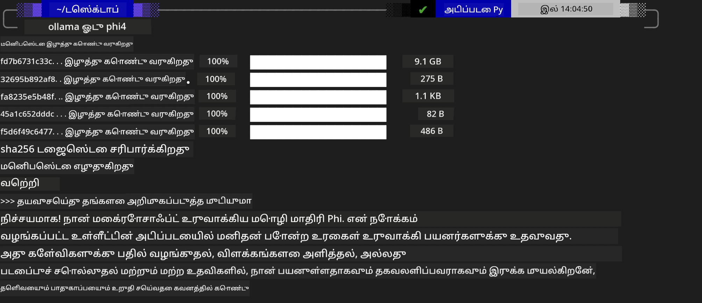
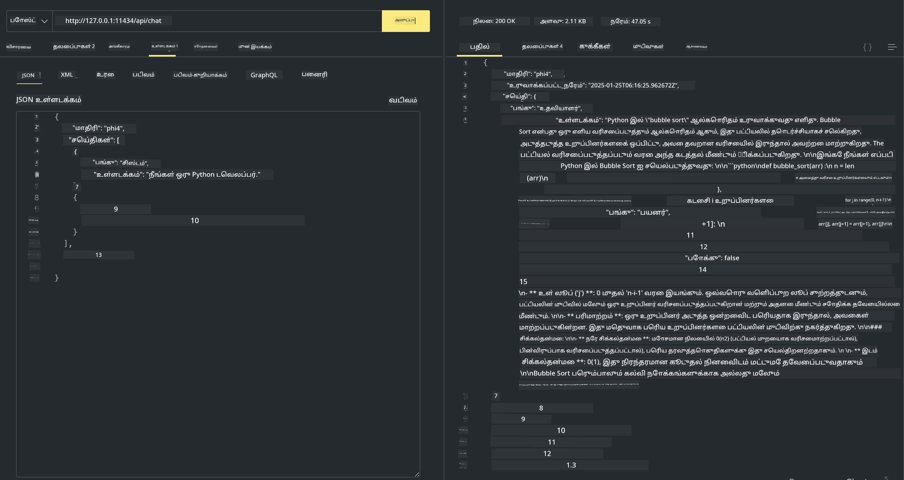

<!--
CO_OP_TRANSLATOR_METADATA:
{
  "original_hash": "2aa35f3c8b437fd5dc9995d53909d495",
  "translation_date": "2025-12-21T14:42:07+00:00",
  "source_file": "md/01.Introduction/02/04.Ollama.md",
  "language_code": "ta"
}
-->
## Ollama இல் Phi குடும்பம்


[Ollama](https://ollama.com) எளிய ஸ்கிரிப்டுகளின் மூலம் அதிகமான மக்களுக்கு open source LLM அல்லது SLM ஐ நேரடியாக நிறுவவும் இயக்கவும் அனுமதிக்கிறது, மேலும் உள்ளக Copilot பயன்பாட்டு சூழல்களுக்கு உதவும் APIகளையும் உருவாக்கலாம்.

## **1. நிறுவல்**

Ollama Windows, macOS, மற்றும் Linux-இல் இயங்குவதை ஆதரிக்கிறது. நீங்கள் இந்த இணைப்பின் மூலம் Ollama-ஐ நிறுவலாம் ([https://ollama.com/download](https://ollama.com/download)). நிறுவல் வெற்றிகரமாக முடிந்த பிறகு, டெர்மினல் ஜன்னலில் Ollama ஸ்கிரிப்டைப் பயன்படுத்தி நேரடியாக Phi-3-ஐ அழைக்கலாம். நீங்கள் [Ollama-இல் கிடைக்கும் அனைத்து நூலகங்களையும்](https://ollama.com/library) பார்க்கலாம். இந்த ரெப்போசிடரியை Codespace-இல் திறக்கும் போது அதில் ஏற்கனவே Ollama நிறுவப்பட்டிருக்கும்.

```bash

ollama run phi4

```

> [!NOTE]
> முதல் முறையாக இயக்கும் போது மாடல் முதலில் பதிவிறக்கப்படும். நிச்சயமாக, நீங்கள் பதிவிறக்கப்பட்ட Phi-4 மாடலை நேரடியாக குறிப்பிடலாம். கட்டளையை இயக்க உதாரணமாக WSL-ஐ எடுத்துக்கொள்கிறோம். மீட்பு வெற்றிகரமாகப்படும் பின்னர், நீங்கள் நேரடியாக டெர்மினலில் தொடர்பு கொள்ளலாம்.



## **2. Ollama-இலிருந்து phi-4 API ஐ அழைக்குதல்**

Ollama மூலம் உருவாக்கப்பட்ட Phi-4 API-ஐ அழைக்க விரும்பினால், Ollama சர்வரை தொடங்க டெர்மினலில் இந்த கட்டளையை பயன்படுத்தலாம்.

```bash

ollama serve

```

> [!NOTE]
> MacOS அல்லது Linux-இல் இயங்கும்போது, கீழ்காணும் பிழையை நீங்கள் சந்திக்கலாம் **"Error: listen tcp 127.0.0.1:11434: bind: address already in use"**. இந்த கட்டளையை இயக்கும்போது இந்த பிழை தோன்றலாம். இது பொதுவாக சர்வர் ஏற்கனவே இயங்கிக் கொண்டிருக்கிறதைக் குறிக்குமெனவே நீங்கள் இந்த பிழையை புறக்கணிக்கலாம், அல்லது Ollama-யை நிறுத்தி மீண்டும் துவக்கலாம்:

**macOS**

```bash

brew services restart ollama

```

**Linux**

```bash

sudo systemctl stop ollama

```

Ollama இரண்டு API-களை ஆதரிக்கிறது: generate மற்றும் chat. 11434 போர்ட்டில் இயங்கும் உள்ளக சேவைக்கு கோரிக்கைகள் அனுப்புவதன் மூலம், உங்கள் தேவைக்குத்தானாக Ollama வழங்கும் மாடல் API-ஐ அழைக்கலாம்.

**Chat**

```bash

curl http://127.0.0.1:11434/api/chat -d '{
  "model": "phi3",
  "messages": [
    {
      "role": "system",
      "content": "Your are a python developer."
    },
    {
      "role": "user",
      "content": "Help me generate a bubble algorithm"
    }
  ],
  "stream": false
  
}'
```

இது Postman-இல் கிடைத்த முடிவு



## கூடுதல் வளங்கள்

Ollama-இல் கிடைக்கும் மாடல்களின் பட்டியலை பார்க்க [அவற்றின் நூலகத்தில்](https://ollama.com/library) செக் செய்யவும்.

Ollama சர்வரிலிருந்து உங்கள் மாடலை இழுக்க இந்த கட்டளையைப் பயன்படுத்தவும்

```bash
ollama pull phi4
```

இந்த கட்டளையைப் பயன்படுத்தி மாடலை இயக்கவும்

```bash
ollama run phi4
```

***குறிப்பு:*** மேலும் அறிய இந்த இணைப்பை பார்வையிடவும் [https://github.com/ollama/ollama/blob/main/docs/api.md](https://github.com/ollama/ollama/blob/main/docs/api.md)

## Python-இலிருந்து Ollama-ஐ அழைப்பது

மேலே குறிப்பிடப்பட்ட உள்ளக சர்வர் end-point களுக்கு கோரிக்கைகள் செய்ய நீங்கள் `requests` அல்லது `urllib3` ஐப் பயன்படுத்தலாம். இருப்பினும், Python-இல் Ollama-ஐ பயன்படுத்துவதற்கான பிரபலமான வழி [openai](https://pypi.org/project/openai/) SDK மூலம் தான், ஏனெனில் Ollama OpenAI-ஒத்திசைவு கொண்ட சர்வர் end-point களையும் வழங்குகிறது.

இது phi3-mini க்கான ஒரு உதாரணம்:

```python
import openai

client = openai.OpenAI(
    base_url="http://localhost:11434/v1",
    api_key="nokeyneeded",
)

response = client.chat.completions.create(
    model="phi4",
    temperature=0.7,
    n=1,
    messages=[
        {"role": "system", "content": "You are a helpful assistant."},
        {"role": "user", "content": "Write a haiku about a hungry cat"},
    ],
)

print("Response:")
print(response.choices[0].message.content)
```

## JavaScript-இலிருந்து Ollama-ஐ அழைப்பது 

```javascript
// Phi-4 மூலம் ஒரு கோப்பை சுருக்குவதன் உதாரணம்
script({
    model: "ollama:phi4",
    title: "Summarize with Phi-4",
    system: ["system"],
})

// சுருக்கத்தின் உதாரணம்
const file = def("FILE", env.files)
$`Summarize ${file} in a single paragraph.`
```

## C#-இலிருந்து Ollama-ஐ அழைப்பது

புதிய C# Console செயலியை உருவாக்கி பின்வரும் NuGet package-ஐச் சேர்க்கவும்:

```bash
dotnet add package Microsoft.SemanticKernel --version 1.34.0
```

பின்பு `Program.cs` கோப்பில் இந்தக் கோடுகளை மாற்றவும்

```csharp
using Microsoft.SemanticKernel;
using Microsoft.SemanticKernel.ChatCompletion;

// add chat completion service using the local ollama server endpoint
#pragma warning disable SKEXP0001, SKEXP0003, SKEXP0010, SKEXP0011, SKEXP0050, SKEXP0052
builder.AddOpenAIChatCompletion(
    modelId: "phi4",
    endpoint: new Uri("http://localhost:11434/"),
    apiKey: "non required");

// invoke a simple prompt to the chat service
string prompt = "Write a joke about kittens";
var response = await kernel.InvokePromptAsync(prompt);
Console.WriteLine(response.GetValue<string>());
```

இந்த கட்டளையுடன் செயலியை இயக்கவும்:

```bash
dotnet run
```

---

<!-- CO-OP TRANSLATOR DISCLAIMER START -->
மறுப்பு:
இந்த ஆவணம் AI மொழிபெயர்ப்பு சேவையான [Co-op Translator](https://github.com/Azure/co-op-translator) மூலம் மொழி பெயர்க்கப்பட்டுள்ளது. நாங்கள் துல்லியத்திற்காக முயலினாலும், தானியங்கி மொழிபெயர்ப்புகளில் பிழைகள் அல்லது தவறுகள் இருக்கலாம் என்பதை தயவுசெய்து கவனிக்கவும். அதன் சொந்த மொழியிலுள்ள மூல ஆவணம் அதிகாரப்பூர்வ ஆதாரமாக கருதப்பட வேண்டும். முக்கியமான தகவல்களுக்கு தொழில்முறை மனித மொழிபெயர்ப்பை பரிந்துரைக்கிறோம். இந்த மொழிபெயர்ப்பின் பயன்பாட்டினால் ஏற்படும் எந்த தவறான புரிதல்களுக்கும் அல்லது தவறான விளக்கங்களுக்கும் நாங்கள் பொறுப்பேற்கமாட்டோம்.
<!-- CO-OP TRANSLATOR DISCLAIMER END -->