<!--
CO_OP_TRANSLATOR_METADATA:
{
  "original_hash": "7ca2c30fdb802664070e9cfbf92e24fe",
  "translation_date": "2026-01-05T14:38:34+00:00",
  "source_file": "md/02.Application/01.TextAndChat/Phi3/E2E_Phi-3-FineTuning_PromptFlow_Integration.md",
  "language_code": "ta"
}
-->
# Fine-tune மற்றும் Prompt flow உடன் தனிப்பயன் Phi-3 மாதிரிகளை ஒருங்கிணைக்கவும்

இந்த End-to-end (E2E) மாதிரி Microsoft Tech Community இன் "[Fine-Tune and Integrate Custom Phi-3 Models with Prompt Flow: Step-by-Step Guide](https://techcommunity.microsoft.com/t5/educator-developer-blog/fine-tune-and-integrate-custom-phi-3-models-with-prompt-flow/ba-p/4178612?WT.mc_id=aiml-137032-kinfeylo)" என்ற வழிகாட்டி அடிப்படையில் உருவாக்கப்பட்டுள்ளது. இது fine-tuning, despleyment மற்றும் Prompt flow உடன் தனிப்பயன் Phi-3 மாதிரிகளை ஒருங்கிணைக்கும் செயல்முறைகளை அறிமுகப்படுத்துகிறது.

## கண்ணோட்டம்

இந்த E2E மாதிரியில், நீங்கள் Phi-3 மாதிரியை fine-tune செய்யவும், அதனை Prompt flow உடன் ஒருங்கிணைக்கவும் கற்றுக்கொள்வீர்கள். Azure Machine Learning மற்றும் Prompt flow ஐ பயன்படுத்தி, தனிப்பயன் AI மாதிரிகளை despleyment மற்றும் பயன்பாட்டிற்கான ஒரு வேலைநெறியை அமைக்கும். இந்த E2E மாதிரி மூன்று காட்சிகளாகப் பிரிக்கப்பட்டுள்ளது:

**காட்சி 1: Azure வளங்களை அமைத்தல் மற்றும் fine-tuning க்கு தயார் செய்தல்**

**காட்சி 2: Phi-3 மாதிரியை fine-tune செய்யவும் Azure Machine Learning Studio இல் despleyment செய்யவும்**

**காட்சி 3: Prompt flow உடன் ஒருங்கிணைத்தல் மற்றும் உங்கள் தனிப்பயன் மாதிரியுடன் உரையாடல்**

இதோ இந்த E2E மாதிரியின் ஒரு கண்ணோட்டம்.

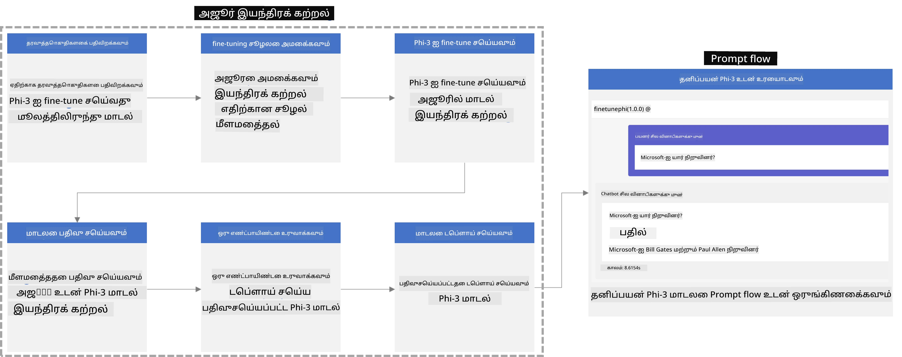

### உள்ளடக்க அட்டவணை

1. **[காட்சி 1: Azure வளங்களை அமைத்தல் மற்றும் fine-tuning க்கு தயார் செய்தல்](../../../../../../md/02.Application/01.TextAndChat/Phi3)**
    - [Azure Machine Learning வேலைநிரலிடத்தை உருவாக்குக](../../../../../../md/02.Application/01.TextAndChat/Phi3)
    - [Azure சந்தாவுக்கு GPU வட்டாரங்கள் கோருக](../../../../../../md/02.Application/01.TextAndChat/Phi3)
    - [பங்கு நியமனம் சேர்க்கவும்](../../../../../../md/02.Application/01.TextAndChat/Phi3)
    - [திட்டத்தை அமைக்கவும்](../../../../../../md/02.Application/01.TextAndChat/Phi3)
    - [fine-tuning க்கு தரவுத்தொகுப்பை தயார் செய்க](../../../../../../md/02.Application/01.TextAndChat/Phi3)

1. **[காட்சி 2: Phi-3 மாதிரியை fine-tune செய்யவும் Azure Machine Learning Studio இல் despleyment செய்யவும்](../../../../../../md/02.Application/01.TextAndChat/Phi3)**
    - [Azure CLI ஐ அமைக்கவும்](../../../../../../md/02.Application/01.TextAndChat/Phi3)
    - [Phi-3 மாதிரியை fine-tune செய்க](../../../../../../md/02.Application/01.TextAndChat/Phi3)
    - [fine-tuned மாதிரியை despleyment செய்யவும்](../../../../../../md/02.Application/01.TextAndChat/Phi3)

1. **[காட்சி 3: Prompt flow உடன் ஒருங்கிணைத்தல் மற்றும் உங்கள் தனிப்பயன் மாதிரியுடன் உரையாடல்](../../../../../../md/02.Application/01.TextAndChat/Phi3)**
    - [தனிப்பயன் Phi-3 மாதிரியை Prompt flow உடன் ஒருங்கிணைக்கவும்](../../../../../../md/02.Application/01.TextAndChat/Phi3)
    - [உங்கள் தனிப்பயன் மாதிரியுடன் உரையாடவும்](../../../../../../md/02.Application/01.TextAndChat/Phi3)

## காட்சி 1: Azure வளங்களை அமைத்தல் மற்றும் fine-tuning க்கு தயார் செய்தல்

### Azure Machine Learning வேலைநிரலிடத்தை உருவாக்குக

1. போர்டல் பக்கத்தின் மேல் உள்ள **தேடல் பெட்டியில்** *azure machine learning* என்பதைக் கொடுத்து தோன்றும் விருப்பங்களில் இருந்து **Azure Machine Learning** ஐத் தேர்ந்தெடுக்கவும்.

    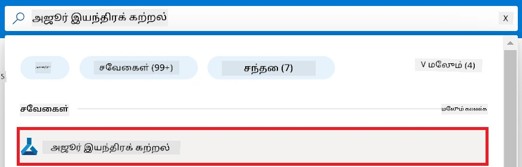

1. வழிசெலுத்தல் பட்டியில் இருந்து **+ Create** ஐ தேர்ந்தெடுக்கவும்.

1. வழிசெலுத்தல் பட்டியில் இருந்து **New workspace** ஐத் தேர்ந்தெடுக்கவும்.

    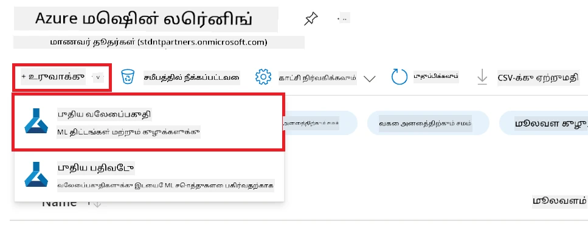

1. பின்வரும் பணிகளைச் செய்யவும்:

    - உங்கள் Azure **Subscription** ஐத் தேர்ந்தெடுக்கவும்.
    - பயன்படுத்த வேண்டிய **Resource group** ஐ தேர்ந்தெடுக்கவும் (தேவைப்பட்டால் புதியதை உருவாக்கவும்).
    - **Workspace Name** ஐ உள்ளிடவும். இது ஒரு தனித்துவமான மதிப்பாக இருக்க வேண்டும்.
    - நீங்கள் பயன்படுத்த விருப்பமான **Region** ஐ தேர்ந்தெடுக்கவும்.
    - பயன்பாட்டுக்குரிய **Storage account** ஐ தேர்ந்தெடுக்கவும் (தேவைப்பட்டால் புதியது).
    - பயன்பாட்டுக்குரிய **Key vault** ஐ தேர்ந்தெடுக்கவும் (தேவைப்பட்டால் புதியது).
    - பயன்பாட்டுக்குரிய **Application insights** ஐ தேர்ந்தெடுக்கவும் (தேவைப்பட்டால் புதியது).
    - பயன்பாட்டுக்குரிய **Container registry** ஐ தேர்ந்தெடுக்கவும் (தேவைப்பட்டால் புதியது).

    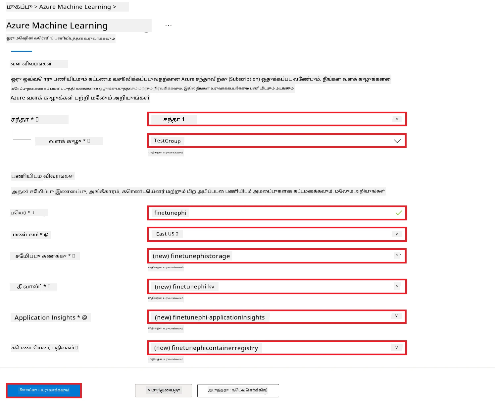

1. **Review + Create** ஐ தேர்ந்தெடுக்கவும்.

1. **Create** ஐ தேர்ந்தெடுக்கவும்.

### Azure சந்தாவில் GPU வட்டாரங்களை கோருக

இந்த E2E மாதிரியில், fine-tuning க்காக *Standard_NC24ads_A100_v4 GPU* பயன்படுத்தப்படும், இது வட்டார கோரிக்கையை தேவைப்படுத்துகிறது, deployment க்காக *Standard_E4s_v3* CPU பயன்படுத்தப்படும், இது வட்டார கோரிக்கையைத் தேவையற்றது.

> [!NOTE]
>
> Pay-As-You-Go சந்தாக்கள் மட்டும் (இயல்பான சந்தை வகை) GPU ஒதுக்கீட்டிற்கு தகுதிபெற்றவை; பயன்திட்ட சந்தாக்கள் இப்போது ஆதரிக்கப்படவில்லை.
>
> பயன்திட்ட சந்தைகளை பயன்படுத்துவோருக்கு (Visual Studio Enterprise Subscription போன்றவை) அல்லது fine-tuning மற்றும் deployment செயல்முறையை விரைவாகச் சோதிக்க விரும்புவோருக்கு, இந்த பயிற்சியில் CPU கொண்டு குறைந்த தரவு தொகுப்புடன் fine-tuning செய்வதற்கான வழிகாட்டலும் உள்ளது. எனினும், GPU கொண்டு பெரிய தரவு தொகுப்புகளை பயன்படுத்துவதால் fine-tuning முடிவுகள் முக்கியமாக சிறப்பாக இருக்கும் என்பதை கவனிக்கவும்.

1. [Azure ML Studio](https://ml.azure.com/home?wt.mc_id=studentamb_279723) செல்லவும்.

1. *Standard NCADSA100v4 Family* வட்டாரத்தை கோருவதற்கு பின்வரும் பணிகளைச் செய்யவும்:

    - இடது பக்க தாவலில் இருந்து **Quota** ஐத் தேர்ந்தெடுக்கவும்.
    - பயன்படுத்த வேண்டிய **Virtual machine family** ஐ தேர்ந்தெடுக்கவும். உதாரணமாக, *Standard_NC24ads_A100_v4* GPU உட்படிவரும் **Standard NCADSA100v4 Family Cluster Dedicated vCPUs** ஐ தேர்ந்தெடுக்கவும்.
    - வழிசெலுத்தல் பட்டியில் இருந்து **Request quota** ஐ தேர்ந்தெடுக்கவும்.

        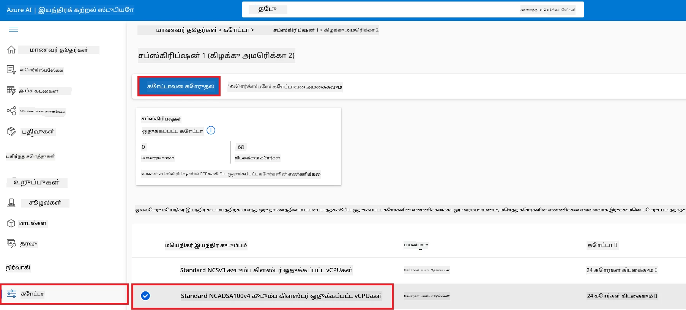

    - Request quota பக்கத்திலுள்ள **New cores limit** ஐ நீங்கள் தேவையான மதிப்பை உள்ளிடவும். உதாரணமாக, 24.
    - Request quota பக்கத்தில் **Submit** ஐ தேர்ந்தெடுத்து GPU வட்டாரத்தை கோரவும்.

> [!NOTE]
> உங்கள் தேவைகளுக்கு ஏற்ப GPU அல்லது CPU ஐ தேர்ந்தெடுக்க [Sizes for Virtual Machines in Azure](https://learn.microsoft.com/azure/virtual-machines/sizes/overview?tabs=breakdownseries%2Cgeneralsizelist%2Ccomputesizelist%2Cmemorysizelist%2Cstoragesizelist%2Cgpusizelist%2Cfpgasizelist%2Chpcsizelist) ஆவணத்தை காணலாம்.

### பங்கு நியமனத்தைச் சேர்

நீங்கள் உங்கள் மாதிரிகளை fine-tune செய்து despleyment செய்ய User Assigned Managed Identity (UAI) ஒன்றை உருவாக்கி, அதற்கு ஏற்ற அனுமதிகளை வழங்க வேண்டும். இந்த UAI despleyment போது அங்கீகாரத்திற்குப் பயன்படும்.

#### User Assigned Managed Identity(UAI) உருவாக்குக

1. போர்டல் பக்கத்தின் மேல் உள்ள **தேடல் பெட்டியில்** *managed identities* என்று உள்ளிட்டு தோன்றும் விருப்பங்களில் இருந்து **Managed Identities** ஐ தேர்ந்தெடுக்கவும்.

    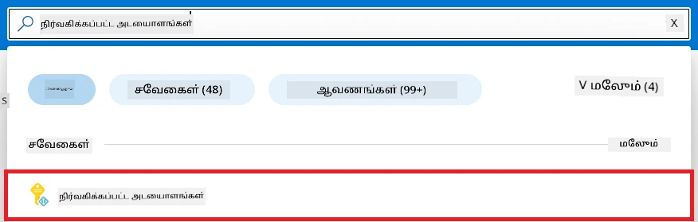

1. **+ Create** ஐ தேர்ந்தெடுக்கவும்.

    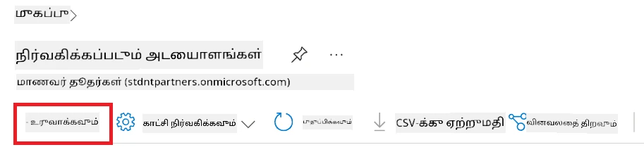

1. பின்வரும் பணிகளைச் செய்யவும்:

    - உங்கள் Azure **Subscription** ஐ தேர்ந்தெடுக்கவும்.
    - பயன்படுத்த வேண்டிய **Resource group** ஐ தேர்ந்தெடுக்கவும் (தேவைப்பட்டால் புதியதை உருவாக்கவும்).
    - நீங்கள் பயன்படுத்த விருப்பமான **Region** ஐ தேர்ந்தெடுக்கவும்.
    - **Name** ஐ உள்ளிடவும். இது தனித்துவமானது ஆக இருக்க வேண்டும்.

1. **Review + create** ஐ தேர்ந்தெடுக்கவும்.

1. **+ Create** ஐ தேர்ந்தெடுக்கவும்.

#### Managed Identityக்கு Contributor பங்கு நியமனத்தைச் சேர்க்கவும்

1. நீங்கள் உருவாக்கிய Managed Identity வளத்திற்கு செல்லவும்.

1. இடது பக்க தாவலில் இருந்து **Azure role assignments** ஐத் தேர்ந்தெடுக்கவும்.

1. வழிசெலுத்தல் பட்டியில் இருந்து **+Add role assignment** ஐ தேர்ந்தெடுக்கவும்.

1. Add role assignment பக்கத்தில் பின்வரும் பணிகளைச் செய்யவும்:
    - **Scope** ஐ **Resource group** ஆக தேர்ந்தெடுக்கவும்.
    - உங்கள் Azure **Subscription** ஐத் தேர்ந்தெடுக்கவும்.
    - பயன்படுத்த வேண்டிய **Resource group** ஐத் தேர்ந்தெடுக்கவும்.
    - **Role** ஐ **Contributor** ஆக தேர்ந்தெடுக்கவும்.

    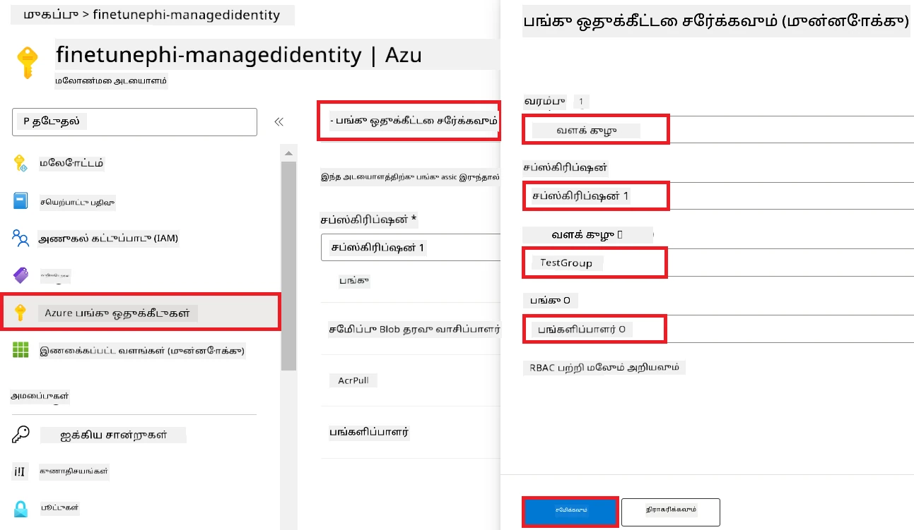

1. **Save** ஐத் தேர்ந்தெடுக்கவும்.

#### Managed Identityக்கு Storage Blob Data Reader பங்கு நியமனத்தைச் சேர்க்கவும்

1. போர்டல் பக்கத்தின் மேல் உள்ள **தேடல் பெட்டியில்** *storage accounts* என்று உள்ளிட்டு தோன்றும் விருப்பங்களில் இருந்து **Storage accounts** ஐத் தேர்ந்தெடுக்கவும்.

    

1. உங்கள் Azure Machine Learning வேலைநிரலிடம் சார்ந்த சேமிப்பக கணக்கை தேர்ந்தெடுக்கவும். உதாரணமாக, *finetunephistorage*.

1. Add role assignment பக்கத்துக்கு செல்ல பின்வரும் பணிகளைச் செய்யவும்:

    - நீங்கள் உருவாக்கிய Azure Storage கணக்குக்கு செல்லவும்.
    - இடது பக்க தாவலில் இருந்து **Access Control (IAM)** ஐத் தேர்ந்தெடுக்கவும்.
    - வழிசெலுத்தல் பட்டியில் இருந்து **+ Add** ஐத் தேர்ந்தெடுக்கவும்.
    - **Add role assignment** ஐத் தேர்ந்தெடுக்கவும்.

    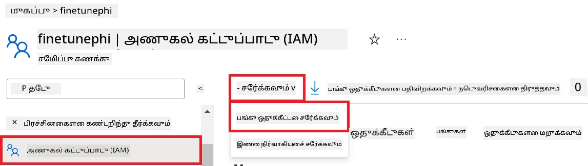

1. Add role assignment பக்கத்தில் பின்வரும் பணிகளைச் செய்யவும்:

    - Role பக்கத்தில் *Storage Blob Data Reader* என்பதைக் தேடல் பெட்டியில் தட்டச்சு செய்து தோன்றும் விருப்பங்களில் இருந்து **Storage Blob Data Reader** ஐத் தேர்ந்தெடுக்கவும்.
    - Role பக்கத்தில் **Next** ஐத் தேர்ந்தெடுக்கவும்.
    - Members பக்கத்தில் **Assign access to** இல் **Managed identity** ஐத் தேர்ந்தெடுக்கவும்.
    - Members பக்கத்தில் **+ Select members** ஐத் தேர்ந்தெடுக்கவும்.
    - Select managed identities பக்கத்தில் உங்கள் Azure **Subscription** ஐத் தேர்ந்தெடுக்கவும்.
    - Select managed identities பக்கத்தில் **Managed identity** ஐ **Manage Identity** ஆக தேர்ந்தெடுக்கவும்.
    - Select managed identities பக்கத்தில் நீங்கள் உருவாக்கிய Managed Identity ஐ (உதாரணம்: *finetunephi-managedidentity*) தேர்ந்தெடுக்கவும்.
    - Select managed identities பக்கத்தில் **Select** ஐத் தேர்ந்தெடுக்கவும்.

    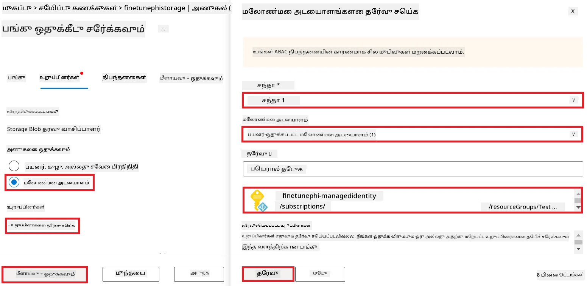

1. **Review + assign** ஐத் தேர்ந்தெடுக்கவும்.

#### Managed Identityக்கு AcrPull பங்கு நியமனத்தைச் சேர்க்கவும்

1. போர்டல் பக்கத்தின் மேல் உள்ள **தேடல் பெட்டியில்** *container registries* என்று உள்ளிட்டு தோன்றும் விருப்பங்களில் இருந்து **Container registries** ஐத் தேர்ந்தெடுக்கவும்.

    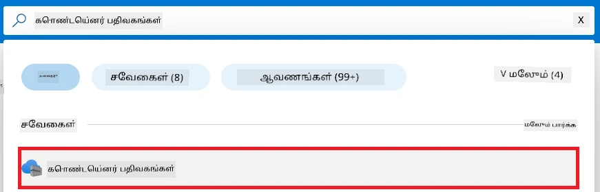

1. Azure Machine Learning வேலைநிரலிடம் சார்ந்த container registry ஐத் தேர்ந்தெடுக்கவும். உதாரணமாக, *finetunephicontainerregistries*.

1. Add role assignment பக்கத்துக்கு செல்ல பின்வரும் பணிகளைச் செய்யவும்:

    - இடது பக்க தாவலில் இருந்து **Access Control (IAM)** ஐத் தேர்ந்தெடுக்கவும்.
    - வழிசெலுத்தல் பட்டியில் இருந்து **+ Add** ஐத் தேர்ந்தெடுக்கவும்.
    - **Add role assignment** ஐத் தேர்ந்தெடுக்கவும்.

1. Add role assignment பக்கத்தில் பின்வரும் பணிகளைச் செய்யவும்:

    - Role பக்கத்தில் *AcrPull* என்பதைக் தேடல் பெட்டியில் தட்டச்சு செய்து தோன்றும் விருப்பங்களில் இருந்து **AcrPull** ஐத் தேர்ந்தெடுக்கவும்.
    - Role பக்கத்தில் **Next** ஐத் தேர்ந்தெடுக்கவும்.
    - Members பக்கத்தில் **Assign access to** இல் **Managed identity** ஐத் தேர்ந்தெடுக்கவும்.
    - Members பக்கத்தில் **+ Select members** ஐத் தேர்ந்தெடுக்கவும்.
    - Select managed identities பக்கத்தில் உங்கள் Azure **Subscription** ஐத் தேர்ந்தெடுக்கவும்.
    - Select managed identities பக்கத்தில் **Managed identity** ஐ **Manage Identity** ஆக தேர்ந்தெடுக்கவும்.
    - Select managed identities பக்கத்தில் நீங்கள் உருவாக்கிய Managed Identity ஐ (உதாரணம்: *finetunephi-managedidentity*) தேர்ந்தெடுக்கவும்.
    - Select managed identities பக்கத்தில் **Select** ஐத் தேர்ந்தெடுக்கவும்.
    - **Review + assign** ஐத் தேர்ந்தெடுக்கவும்.

### திட்டத்தை அமைக்கவும்

இப்போது, நீங்கள் ஒரு பணிக்குள் பணிகள் செய்யும் ஒரு கோப்புறையை உருவாக்கி, பயனர்களுடன் தொடர்பு கொண்டு, Azure Cosmos DB இல் சேமிக்கப்பட்ட உரையாடல் வரலாற்றை பயன்படுத்தும் ஒரு விண்டுவிட்ட சுற்றுச்சூழலை அமைத்துச் செயல்படும் ஒரு நிரலை உருவாக்குவீர்கள்.

#### பணிக்குள் பணிகள் செய்ய ஒருகோப்புறையை உருவாக்குக

1. டெர்மினல் விண்டோவை திறந்து கீழ்காணும் கட்டளையைக் கொண்டு இயல்புநிலை பாதையில் *finetune-phi* என்ற கோப்புறை உருவாக்கவும்.

    ```console
    mkdir finetune-phi
    ```

1. கீழ்காணும் கட்டளையைக் கொண்டு நீங்கள் உருவாக்கிய *finetune-phi* கோப்புறைக்குள் செல்லவும்.

    ```console
    cd finetune-phi
    ```

#### விண்டுவிட்ட சுற்றுச்சூழலை உருவாக்குக

1. கீழ்காணும் கட்டளையைக் கொண்டு *.venv* என்ற பெயரில் விண்டுவிட்ட சுற்றுச்சூழலை உருவாக்கவும்.

    ```console
    python -m venv .venv
    ```

1. கீழ்காணும் கட்டளையைக் கொண்டு விண்டுவிட்ட சுற்றுச்சூழலை செயல்படுத்தவும்.

    ```console
    .venv\Scripts\activate.bat
    ```

> [!NOTE]
>
> இது செயல்பட்டால் கட்டளை முன் *(.venv)* எனும் குறிப்பு தெரியும்.

#### தேவையான தொகுப்புகளை நிறுவுக

1. கீழ்காணும் கட்டளைகளை உங்கள் டெர்மினலில் இயக்கு தேவையான தொகுப்புகளை நிறுவவும்.

    ```console
    pip install datasets==2.19.1
    pip install transformers==4.41.1
    pip install azure-ai-ml==1.16.0
    pip install torch==2.3.1
    pip install trl==0.9.4
    pip install promptflow==1.12.0
    ```

#### திட்ட கோப்புகளை உருவாக்குக
இந்த பயிற்சியில், உங்கள் திட்டத்தின் முக்கிய கோப்புகளை நீங்கள் உருவாக்குவீர்கள். இந்த கோப்புகளில் தரவுத்தொகுப்பை பதிவிறக்கம் செய்வதற்கான ஸ்கிரிப்ட்கள், Azure இயந்திரக் கற்றல் சூழல் அமைப்பு, Phi-3 மாதிரியின் நுட்பமாக துலக்கல், மற்றும் நுட்பமாக துலக்கப்பட்ட மாதிரியை பயன்பாட்டுக்கு உருவாக்குதல் ஆகியவை அடங்கும். நீங்கள் நுட்பமாக துலக்கல் சூழலை அமைப்பதற்கான *conda.yml* கோப்பையும் உருவாக்குவீர்கள்.

இந்த பயிற்சியில், நீங்கள்:

- தரவுத்தொகுப்பை பதிவிறக்கம் செய்ய *download_dataset.py* கோப்பை உருவாக்குங்கள்.
- Azure இயந்திரக் கற்றல் சூழலை அமைக்க *setup_ml.py* கோப்பை உருவாக்குங்கள்.
- *finetuning_dir* கோப்புறையில் உள்ள *fine_tune.py* கோப்பை பயன்படுத்தி தரவுத்தொகுப்பைப் பயன்படுத்தி Phi-3 மாதிரியை நுட்பமாக துலக்குங்கள்.
- நுட்பமாக துலக்கல் சூழலை அமைக்க *conda.yml* கோப்பை உருவாக்குங்கள்.
- நுட்பமாக துலக்கப்பட்ட மாதிரியை பயன்பாட்டுக்கு உருவாக்க *deploy_model.py* கோப்பை உருவாக்குங்கள்.
- நுட்பமாக துலக்கப்பட்ட மாதிரியை Prompt flow மூலம் இயக்க *integrate_with_promptflow.py* கோப்பை உருவாக்குங்கள்.
- Prompt flow இன்டெக்ரேஷன் செயல்முறைக்காக *flow.dag.yml* கோப்பை உருவாக்குங்கள்.
- Azure தகவல்களை உள்ளிட *config.py* கோப்பை உருவாக்குங்கள்.

> [!NOTE]
>
> முழுமையான கோப்புறை அமைப்பு:
>
> ```text
> └── YourUserName
> .    └── finetune-phi
> .        ├── finetuning_dir
> .        │      └── fine_tune.py
> .        ├── conda.yml
> .        ├── config.py
> .        ├── deploy_model.py
> .        ├── download_dataset.py
> .        ├── flow.dag.yml
> .        ├── integrate_with_promptflow.py
> .        └── setup_ml.py
> ```

1. **Visual Studio Code**ஐ திறக்கவும்.

1. மேல்நிலை பட்டி (menu bar)இல் இருந்து **File**-ஐ தேர்ந்தெடுக்கவும்.

1. **Open Folder**-ஐ தேர்ந்தெடுக்கவும்.

1. நீங்கள் உருவாக்கிய *finetune-phi* கோப்புறையை தேர்வு செய்யவும், அது *C:\Users\yourUserName\finetune-phi* ல் உள்ளது.

    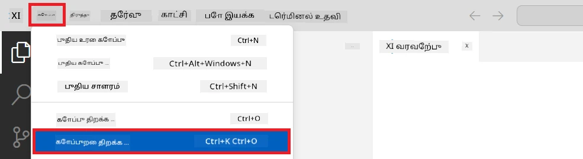

1. Visual Studio Code-இன் இடது பகுதியில, வலது கிளிக் செய்து **New File**-ஐ தேர்ந்தெடுத்து *download_dataset.py* என்ற பெயரில் புதிய கோப்பை உருவாக்குங்கள்.

1. இடது பகுதி-வில், வலது கிளிக் செய்து **New File**-ஐ தேர்ந்தெடுத்து *setup_ml.py* என்ற பெயரில் புதிய கோப்பை உருவாக்குங்கள்.

1. இடது பகுதி-வில், வலது கிளிக் செய்து **New File**-ஐ தேர்ந்தெடுத்து *deploy_model.py* என்ற பெயரில் புதிய கோப்பை உருவாக்குங்கள்.

    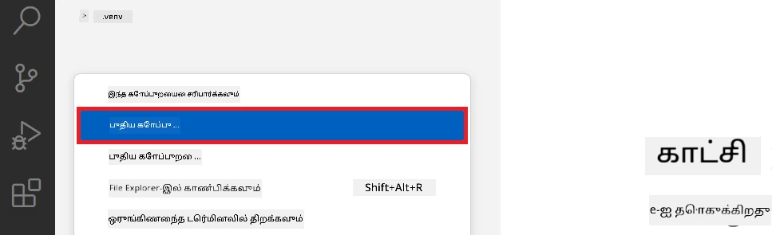

1. இடது பகுதி-வில், வலது கிளிக் செய்து **New Folder**-ஐ தேர்ந்தெடுத்து *finetuning_dir* என்ற புதிய கோப்புறையை உருவாக்குங்கள்.

1. *finetuning_dir* கோப்புறையில், *fine_tune.py* என்ற புதிய கோப்பை உருவாக்குங்கள்.

#### *conda.yml* கோப்பை உருவாக்கி அமைக்கவும்

1. இடது பகுதி-வில், வலது கிளிக் செய்து **New File**-ஐ தேர்ந்தெடுத்து *conda.yml* என்ற புதிய கோப்பை உருவாக்குங்கள்.

1. *conda.yml* கோப்பில் கீழ்காணும் குறியீட்டை சேர்க்கவும், இது Phi-3 மாதிரிக்கு நுட்பமாக துலக்கல் சூழலை அமைக்கும்.

    ```yml
    name: phi-3-training-env
    channels:
      - defaults
      - conda-forge
    dependencies:
      - python=3.10
      - pip
      - numpy<2.0
      - pip:
          - torch==2.4.0
          - torchvision==0.19.0
          - trl==0.8.6
          - transformers==4.41
          - datasets==2.21.0
          - azureml-core==1.57.0
          - azure-storage-blob==12.19.0
          - azure-ai-ml==1.16
          - azure-identity==1.17.1
          - accelerate==0.33.0
          - mlflow==2.15.1
          - azureml-mlflow==1.57.0
    ```

#### *config.py* கோப்பை உருவாக்கி அமைக்கவும்

1. இடது பகுதி-வில், வலது கிளிக் செய்து **New File**-ஐ தேர்ந்தெடுத்து *config.py* என்ற புதிய கோப்பை உருவாக்குங்கள்.

1. உங்கள் Azure தகவல்களுடன் *config.py* கோப்பில் கீழ்க்காணும் குறியீட்டை சேர்க்கவும்.

    ```python
    # Azure அமைப்புகள்
    AZURE_SUBSCRIPTION_ID = "your_subscription_id"
    AZURE_RESOURCE_GROUP_NAME = "your_resource_group_name" # "TestGroup"

    # Azure மெஷின் லெர்னிங் அமைப்புகள்
    AZURE_ML_WORKSPACE_NAME = "your_workspace_name" # "finetunephi-workspace"

    # Azure மேலாண்மையாளர் அடையாள அமைப்புகள்
    AZURE_MANAGED_IDENTITY_CLIENT_ID = "your_azure_managed_identity_client_id"
    AZURE_MANAGED_IDENTITY_NAME = "your_azure_managed_identity_name" # "finetunephi-mangedidentity"
    AZURE_MANAGED_IDENTITY_RESOURCE_ID = f"/subscriptions/{AZURE_SUBSCRIPTION_ID}/resourceGroups/{AZURE_RESOURCE_GROUP_NAME}/providers/Microsoft.ManagedIdentity/userAssignedIdentities/{AZURE_MANAGED_IDENTITY_NAME}"

    # தரவுத்தொகுப்பு கோப்பு பாதைகள்
    TRAIN_DATA_PATH = "data/train_data.jsonl"
    TEST_DATA_PATH = "data/test_data.jsonl"

    # நுட்பபடுத்தப்பட்ட மாதிரி அமைப்புகள்
    AZURE_MODEL_NAME = "your_fine_tuned_model_name" # "finetune-phi-model"
    AZURE_ENDPOINT_NAME = "your_fine_tuned_model_endpoint_name" # "finetune-phi-endpoint"
    AZURE_DEPLOYMENT_NAME = "your_fine_tuned_model_deployment_name" # "finetune-phi-deployment"

    AZURE_ML_API_KEY = "your_fine_tuned_model_api_key"
    AZURE_ML_ENDPOINT = "your_fine_tuned_model_endpoint_uri" # "https://{your-endpoint-name}.{your-region}.inference.ml.azure.com/score"
    ```

#### Azure சூழல் மாறிகள் சேர்க்கவும்

1. Azure Subscription ID சேர்க்க பின்வரும் நடவடிக்கைகள் செய்யவும்:

    - போர்டல் பக்கத்தின் மேலே உள்ள **search bar**-இல் *subscriptions* என்று தட்டச்சு செய்து தோன்றும் விருப்பங்களில் **Subscriptions**-ஐ தேர்ந்தெடுக்கவும்.
    - நீங்கள் தற்போது பயன்படுத்திக் கொண்டிருக்கும் Azure Subscription-ஐ தேர்வு செய்யவும்.
    - உங்கள் உபசரிச் ஐடியை *config.py* கோப்பில் நகலெடுத்து ஒட்டவும்.

    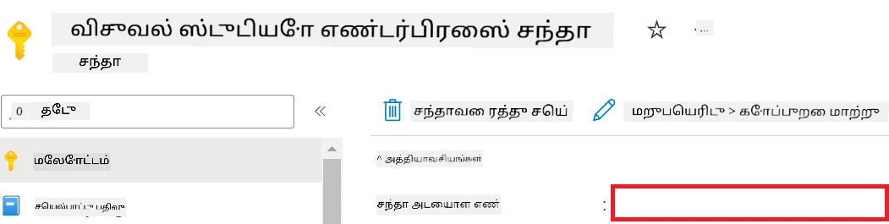

1. Azure வர்த்தகப்பார்வை பெயரை சேர்க்க பின்வரும் பணிகள் செய்யவும்:

    - நீங்கள் உருவாக்கிய Azure Machine Learning வளத்திற்கு செல்லவும்.
    - உங்கள் கணக்கு பெயரை *config.py* கோப்பில் நகல் செய்து ஒட்டவும்.

    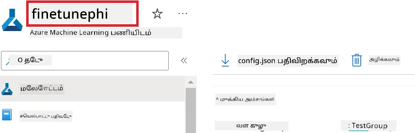

1. Azure வளக் குழு பெயரை சேர்க்க பின்வரும் பணிகள் செய்யவும்:

    - நீங்கள் உருவாக்கிய Azure Machine Learning வளத்திற்கு செல்லவும்.
    - உங்கள் Azure வளக் குழு பெயரை *config.py* கோப்பில் நகல் செய்து ஒட்டவும்.

    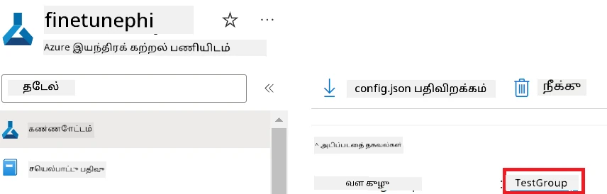

2. Azure மேலாண்மை அடையாளப் பெயரை சேர்க்க பின்வரும் பணிகள் செய்யவும்:

    - நீங்கள் உருவாக்கிய மேலாண்மை அடையாளங்கள் வளத்திற்கு செல்லவும்.
    - உங்கள் Azure மேலாண்மை அடையாளப் பெயரை *config.py* கோப்பில் நகல் செய்து ஒட்டவும்.

    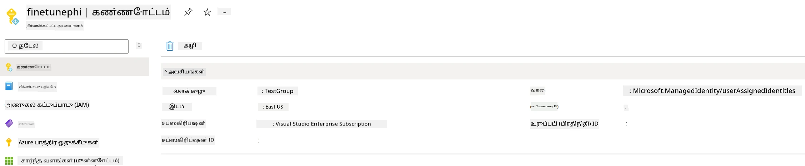

### நுட்பமாக துலக்கலுக்காக தரவுத்தொகுப்பு தயாரித்தல்

இந்த பயிற்சியில், *download_dataset.py* கோப்பை இயக்கி *ULTRACHAT_200k* தரவுத்தொகுப்புகளை உங்கள் உள்ளூர் சூழலுக்கு பதிவிறக்கம் செய்வீர்கள். பிறகு, Azure இயந்திரக் கற்றலில் Phi-3 மாதிரியை நுட்பமாக துலக்க இந்த தரவுத்தொகுப்புகளை பயன்படுத்துவீர்கள்.

#### *download_dataset.py* மூலமாக உங்கள் தரவுத்தொகுப்பை பதிவிறக்கவும்

1. Visual Studio Code-இல் *download_dataset.py* கோப்பை திறக்கவும்.

1. கீழ்காணும் குறியீட்டை *download_dataset.py*-க்கு சேர்க்கவும்.

    ```python
    import json
    import os
    from datasets import load_dataset
    from config import (
        TRAIN_DATA_PATH,
        TEST_DATA_PATH)

    def load_and_split_dataset(dataset_name, config_name, split_ratio):
        """
        Load and split a dataset.
        """
        # குறிப்பிடப்பட்ட பெயர், கட்டமைப்பு மற்றும் பிரிவுக் விகிதத்துடன் தரவுத்தொகுப்பு ஏற்றுகொள்ளவும்
        dataset = load_dataset(dataset_name, config_name, split=split_ratio)
        print(f"Original dataset size: {len(dataset)}")
        
        # தரவுத்தொகுப்பை பயிற்சி மற்றும் சோதனை தொகுப்புகளாக பிரிக்கவும் (80% பயிற்சி, 20% சோதனை)
        split_dataset = dataset.train_test_split(test_size=0.2)
        print(f"Train dataset size: {len(split_dataset['train'])}")
        print(f"Test dataset size: {len(split_dataset['test'])}")
        
        return split_dataset

    def save_dataset_to_jsonl(dataset, filepath):
        """
        Save a dataset to a JSONL file.
        """
        # அடைவை அது இல்லாவிட்டால் உருவாக்கவும்
        os.makedirs(os.path.dirname(filepath), exist_ok=True)
        
        # கோப்பை எழுத்து முறையில் திறக்கவும்
        with open(filepath, 'w', encoding='utf-8') as f:
            # தரவுத்தொகுப்பில் உள்ள ஒவ்வொரு பதிவையும் மீளாய்வு செய்யவும்
            for record in dataset:
                # பதிவை JSON பொருளாக இடவும் மற்றும் கோப்பில் எழுதவும்
                json.dump(record, f)
                # பதிவுகளை பிரிக்க புதிய வரிசை எழுத்தை எழுதவும்
                f.write('\n')
        
        print(f"Dataset saved to {filepath}")

    def main():
        """
        Main function to load, split, and save the dataset.
        """
        # ULTRACHAT_200k தரவுத்தொகுப்பை ஒரு குறிப்பிட்ட கட்டமைப்பும் பிரிவுக் விகிதத்துடனும் ஏற்றவும் மற்றும் பிரிக்கவும்
        dataset = load_and_split_dataset("HuggingFaceH4/ultrachat_200k", 'default', 'train_sft[:1%]')
        
        # பிரிப்பில் இருந்து பயிற்சி மற்றும் சோதனை தரவுத்தொகுப்புகளை எடுத்துக்கொள்ளவும்
        train_dataset = dataset['train']
        test_dataset = dataset['test']

        # பயிற்சி தரவுத்தொகுப்பை ஒரு JSONL கோப்பாக சேமிக்கவும்
        save_dataset_to_jsonl(train_dataset, TRAIN_DATA_PATH)
        
        # சோதனை தரவுத்தொகுப்பை தனித்த JSONL கோப்பாக சேமிக்கவும்
        save_dataset_to_jsonl(test_dataset, TEST_DATA_PATH)

    if __name__ == "__main__":
        main()

    ```

> [!TIP]
>
> **CPU பயன்படுத்தி குறைந்தளவு தரவுத்தொகுப்பைப் பயன்படுத்தி நுட்பமாக துலக்கும் வழிகாட்டி**
>
> நீங்கள் CPU-ஐ பயன்படுத்தி நுட்பமாக துலக்க விரும்பினால், இந்த முறையை Visual Studio Enterprise Subscription போன்ற பலனுள்ள சந்தாக்களுக்கானவர்கள் அல்லது நுட்பமாக துலக்கும் மற்றும் பயன்பாட்டை வேகமாக சோதிக்க விருப்பவர்கள் பயன்படுத்தலாம்.
>
> `dataset = load_and_split_dataset("HuggingFaceH4/ultrachat_200k", 'default', 'train_sft[:1%]')` என்பதனை `dataset = load_and_split_dataset("HuggingFaceH4/ultrachat_200k", 'default', 'train_sft[:10]')` என மாற்றவும்.
>

1. உங்கள் டெர்மினலில் கீழ்காணும் கட்டளையை தட்டச்சு செய்து ஸ்கிரிப்ட் இயக்கி தரவுத்தொகுப்பை உள்ளூர் சூழலுக்கு பதிவிறக்கம் செய்யவும்.

    ```console
    python download_data.py
    ```

1. தரவுத்தொகுப்புகள் உங்கள் உள்ளூர் *finetune-phi/data* அடைவில் வெற்றிகரமாக சேமிக்கப்பட்டதா என சரிபார்க்கவும்.

> [!NOTE]
>
> **தரவுத்தொகுப்பு அளவும் நுட்பமாக துலக்கும் நேரமும்**
>
> இந்த இறுதி தொடக்க மாதிரியில், நீங்கள் தரவுத்தொகுப்பின் 1% (`train_sft[:1%]`) மட்டுமே பயன்படுத்துகிறீர்கள். இது தரவின் அளவை குறைத்து, பதிவேற்றம் மற்றும் நுட்பமாக துலக்கும் செயல்முறையை வேகமாக்குகிறது. பயிற்சி நேரம் மற்றும் மாதிரி செயல்திறன் ஆகியவற்றுக்கு சரியான சமநிலை காணவதற்காக நீங்கள் இந்த சதவிகிதத்தை மாற்றலாம். குறைந்தளவு தரவுத்தொகுப்பைப் பயன்படுத்துவதால் நுட்பமாக துலக்கும் நேரம் குறைகிறது, இது ஒரு இறுதி தொடக்க மாதிரிக்கு கூடிய சீரான நடைமுறையாகும்.

## நிகழ்ச்சி 2: Phi-3 மாதிரியை நுட்பமாக துலக்கவும் Azure இயந்திரக் கற்றல் ஸ்டூடியோவில் பயன்பாட்டுக்கு கொண்டு வரவும்

### Azure CLI அமைப்பது

Azure சூழலை அங்கீகரிப்பதற்கு Azure CLI-ஐ அமைக்க வேண்டியுள்ளது. Azure CLI மூலம் கட்டளை வரி மூலம் Azure வளங்களைக் கையாள மற்றும் Azure இயந்திரக் கற்றல் இந்த வளங்களுக்கு அணுகுவதற்கான அங்கீகார விவரங்களைப் பெற முடியும். [Azure CLI ஐ நிறுவ](https://learn.microsoft.com/cli/azure/install-azure-cli) ஆரம்பிக்கவும்.

1. ஒரு டெர்மினல் விண்டோவைத் திறந்து உங்கள் Azure கணக்கில் உள்நுழைய கீழ்காணும் கட்டளையை தட்டச்சு செய்யவும்.

    ```console
    az login
    ```

1. உங்களுக்கு தேவையான Azure கணக்கை தேர்ந்தெடுக்கவும்.

1. உங்களுக்கு தேவையான Azure சந்தாவை தேர்ந்தெடுக்கவும்.

    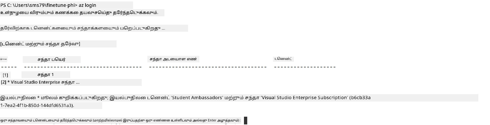

> [!TIP]
>
> Azure-க்கு உள்நுழைய சிக்கல் ஏற்பட்டால், சாதன குறியீட்டை பயன்படுத்த முயற்சிக்கவும். ஒரு டெர்மினல் விண்டோவைத் திறந்து கீழ்காணும் கட்டளையை தட்டச்சு செய்து Azure கணக்கில் உள்நுழையவும்:
>
> ```console
> az login --use-device-code
> ```
>

### Phi-3 மாதிரியை நுட்பமாக துலக்கல்

இந்த பயிற்சியில், நீங்கள் வழங்கப்பட்ட தரவுத்தொகுப்பைப் பயன்படுத்தி Phi-3 மாதிரியை நுட்பமாக துலக்குவீர்கள். முதலில், *fine_tune.py* கோப்பில் நுட்பமாக துலக்கும் செயல்முறையை வரையறுப்பீர்கள். பிறகு, Azure இயந்திரக் கற்றல் சூழலை அமைத்து *setup_ml.py* கோப்பை இயக்கி நுட்பமாக துலக்கும் செயல்முறையை துவக்குவீர்கள். இந்த ஸ்கிரிப்ட் Azure இயந்திரக் கற்றல் சூழலில் நுட்பமாக துலக்கல் நடைபெறும் என்பதை உறுதிப்படுத்தும்.

*setup_ml.py*-ஐ இயக்குவதன் மூலம், நீங்கள் Azure இயந்திரக் கற்றல் சூழலில் நுட்பமாக துலக்கும் செயல்முறையை இயங்கவீர்கள்.

#### *fine_tune.py* கோப்பில் குறியீட்டைச் சேர்க்கவும்

1. *finetuning_dir* கோப்புறைக்கு சென்று Visual Studio Code-இல் *fine_tune.py* கோப்பை திறக்கவும்.

1. *fine_tune.py*ல் கீழ்காணும் குறியீட்டை சேர்க்கவும்.

    ```python
    import argparse
    import sys
    import logging
    import os
    from datasets import load_dataset
    import torch
    import mlflow
    from transformers import AutoModelForCausalLM, AutoTokenizer, TrainingArguments
    from trl import SFTTrainer

    # MLflow இல் INVALID_PARAMETER_VALUE பிழையைத் தவிர்க்க, MLflow ஒருங்கிணைப்பை செயலிழக்கச் செய்யவும்
    os.environ["DISABLE_MLFLOW_INTEGRATION"] = "True"

    # பதிவு அமைப்பு
    logging.basicConfig(
        format="%(asctime)s - %(levelname)s - %(name)s - %(message)s",
        datefmt="%Y-%m-%d %H:%M:%S",
        handlers=[logging.StreamHandler(sys.stdout)],
        level=logging.WARNING
    )
    logger = logging.getLogger(__name__)

    def initialize_model_and_tokenizer(model_name, model_kwargs):
        """
        Initialize the model and tokenizer with the given pretrained model name and arguments.
        """
        model = AutoModelForCausalLM.from_pretrained(model_name, **model_kwargs)
        tokenizer = AutoTokenizer.from_pretrained(model_name)
        tokenizer.model_max_length = 2048
        tokenizer.pad_token = tokenizer.unk_token
        tokenizer.pad_token_id = tokenizer.convert_tokens_to_ids(tokenizer.pad_token)
        tokenizer.padding_side = 'right'
        return model, tokenizer

    def apply_chat_template(example, tokenizer):
        """
        Apply a chat template to tokenize messages in the example.
        """
        messages = example["messages"]
        if messages[0]["role"] != "system":
            messages.insert(0, {"role": "system", "content": ""})
        example["text"] = tokenizer.apply_chat_template(
            messages, tokenize=False, add_generation_prompt=False
        )
        return example

    def load_and_preprocess_data(train_filepath, test_filepath, tokenizer):
        """
        Load and preprocess the dataset.
        """
        train_dataset = load_dataset('json', data_files=train_filepath, split='train')
        test_dataset = load_dataset('json', data_files=test_filepath, split='train')
        column_names = list(train_dataset.features)

        train_dataset = train_dataset.map(
            apply_chat_template,
            fn_kwargs={"tokenizer": tokenizer},
            num_proc=10,
            remove_columns=column_names,
            desc="Applying chat template to train dataset",
        )

        test_dataset = test_dataset.map(
            apply_chat_template,
            fn_kwargs={"tokenizer": tokenizer},
            num_proc=10,
            remove_columns=column_names,
            desc="Applying chat template to test dataset",
        )

        return train_dataset, test_dataset

    def train_and_evaluate_model(train_dataset, test_dataset, model, tokenizer, output_dir):
        """
        Train and evaluate the model.
        """
        training_args = TrainingArguments(
            bf16=True,
            do_eval=True,
            output_dir=output_dir,
            eval_strategy="epoch",
            learning_rate=5.0e-06,
            logging_steps=20,
            lr_scheduler_type="cosine",
            num_train_epochs=3,
            overwrite_output_dir=True,
            per_device_eval_batch_size=4,
            per_device_train_batch_size=4,
            remove_unused_columns=True,
            save_steps=500,
            seed=0,
            gradient_checkpointing=True,
            gradient_accumulation_steps=1,
            warmup_ratio=0.2,
        )

        trainer = SFTTrainer(
            model=model,
            args=training_args,
            train_dataset=train_dataset,
            eval_dataset=test_dataset,
            max_seq_length=2048,
            dataset_text_field="text",
            tokenizer=tokenizer,
            packing=True
        )

        train_result = trainer.train()
        trainer.log_metrics("train", train_result.metrics)

        mlflow.transformers.log_model(
            transformers_model={"model": trainer.model, "tokenizer": tokenizer},
            artifact_path=output_dir,
        )

        tokenizer.padding_side = 'left'
        eval_metrics = trainer.evaluate()
        eval_metrics["eval_samples"] = len(test_dataset)
        trainer.log_metrics("eval", eval_metrics)

    def main(train_file, eval_file, model_output_dir):
        """
        Main function to fine-tune the model.
        """
        model_kwargs = {
            "use_cache": False,
            "trust_remote_code": True,
            "torch_dtype": torch.bfloat16,
            "device_map": None,
            "attn_implementation": "eager"
        }

        # pretrained_model_name = "microsoft/Phi-3-mini-4k-instruct"
        pretrained_model_name = "microsoft/Phi-3.5-mini-instruct"

        with mlflow.start_run():
            model, tokenizer = initialize_model_and_tokenizer(pretrained_model_name, model_kwargs)
            train_dataset, test_dataset = load_and_preprocess_data(train_file, eval_file, tokenizer)
            train_and_evaluate_model(train_dataset, test_dataset, model, tokenizer, model_output_dir)

    if __name__ == "__main__":
        parser = argparse.ArgumentParser()
        parser.add_argument("--train-file", type=str, required=True, help="Path to the training data")
        parser.add_argument("--eval-file", type=str, required=True, help="Path to the evaluation data")
        parser.add_argument("--model_output_dir", type=str, required=True, help="Directory to save the fine-tuned model")
        args = parser.parse_args()
        main(args.train_file, args.eval_file, args.model_output_dir)

    ```

1. *fine_tune.py* கோப்பை சேமித்து மூடவும்.

> [!TIP]
> **Phi-3.5 மாதிரியைக் கூட நுட்பமாக துலக்கலாம்**
>
> *fine_tune.py* கோப்பில், `pretrained_model_name` ஐ `"microsoft/Phi-3-mini-4k-instruct"` இருந்து உங்கள் விருப்ப மாதிரிக்கே `"microsoft/Phi-3.5-mini-instruct"` என்று மாற்றலாம். உங்கள் விருப்ப மாதிரியின் பெயரை கண்டுபிடிக்க [Hugging Face](https://huggingface.co/)-இல் தேடி, அந்த பெயரை உங்கள் ஸ்கிரிப்டில் `pretrained_model_name` களத்தில் நகல் செய்து ஒட்டுங்கள்.
>
> <image type="content" src="../../../../imgs/02/FineTuning-PromptFlow/finetunephi3.5.png" alt-text="Fine tune Phi-3.5.">
>

#### *setup_ml.py* கோப்பில் குறியீட்டைச் சேர்க்கவும்

1. Visual Studio Code-இல் *setup_ml.py* கோப்பை திறக்கவும்.

1. *setup_ml.py* கோப்பில் கீழ்காணும் குறியீட்டை சேர்க்கவும்.

    ```python
    import logging
    from azure.ai.ml import MLClient, command, Input
    from azure.ai.ml.entities import Environment, AmlCompute
    from azure.identity import AzureCliCredential
    from config import (
        AZURE_SUBSCRIPTION_ID,
        AZURE_RESOURCE_GROUP_NAME,
        AZURE_ML_WORKSPACE_NAME,
        TRAIN_DATA_PATH,
        TEST_DATA_PATH
    )

    # நிலையானங்கள்

    # பயிற்சிக்காக CPU உதாரணத்தை பயன்படுத்த கீழ்க்காணும் வரிகளைக் குறியீட்டில் இருந்து நீக்கு
    # COMPUTE_INSTANCE_TYPE = "Standard_E16s_v3" # cpu
    # COMPUTE_NAME = "cpu-e16s-v3"
    # DOCKER_IMAGE_NAME = "mcr.microsoft.com/azureml/openmpi4.1.0-ubuntu20.04:latest"

    # பயிற்சிக்காக GPU உதாரணத்தை பயன்படுத்த கீழ்க்காணும் வரிகளைக் குறியீட்டில் இருந்து நீக்கு
    COMPUTE_INSTANCE_TYPE = "Standard_NC24ads_A100_v4"
    COMPUTE_NAME = "gpu-nc24s-a100-v4"
    DOCKER_IMAGE_NAME = "mcr.microsoft.com/azureml/curated/acft-hf-nlp-gpu:59"

    CONDA_FILE = "conda.yml"
    LOCATION = "eastus2" # உங்கள் கணினி கிளஸ்டர் இருப்பிடத்தை மாற்றவும்
    FINETUNING_DIR = "./finetuning_dir" # நுணுக்கமான முன்னேற்றம் செய்யும் ஸ்கிரிப்டின் பாதை
    TRAINING_ENV_NAME = "phi-3-training-environment" # பயிற்சிக் சூழலின் பெயர்
    MODEL_OUTPUT_DIR = "./model_output" # azure ml இல் மாடல் வெளியீட்டு அடைவை பற்றிய பாதை

    # செயன்முறை பின்தொடர்பதற்கான பதிவேடு அமைப்பு
    logger = logging.getLogger(__name__)
    logging.basicConfig(
        format="%(asctime)s - %(levelname)s - %(name)s - %(message)s",
        datefmt="%Y-%m-%d %H:%M:%S",
        level=logging.WARNING
    )

    def get_ml_client():
        """
        Initialize the ML Client using Azure CLI credentials.
        """
        credential = AzureCliCredential()
        return MLClient(credential, AZURE_SUBSCRIPTION_ID, AZURE_RESOURCE_GROUP_NAME, AZURE_ML_WORKSPACE_NAME)

    def create_or_get_environment(ml_client):
        """
        Create or update the training environment in Azure ML.
        """
        env = Environment(
            image=DOCKER_IMAGE_NAME,  # சூழலுக்கான டாக்கர் படம்
            conda_file=CONDA_FILE,  # கண்டா சூழல் கோப்பு
            name=TRAINING_ENV_NAME,  # சூழலின் பெயர்
        )
        return ml_client.environments.create_or_update(env)

    def create_or_get_compute_cluster(ml_client, compute_name, COMPUTE_INSTANCE_TYPE, location):
        """
        Create or update the compute cluster in Azure ML.
        """
        try:
            compute_cluster = ml_client.compute.get(compute_name)
            logger.info(f"Compute cluster '{compute_name}' already exists. Reusing it for the current run.")
        except Exception:
            logger.info(f"Compute cluster '{compute_name}' does not exist. Creating a new one with size {COMPUTE_INSTANCE_TYPE}.")
            compute_cluster = AmlCompute(
                name=compute_name,
                size=COMPUTE_INSTANCE_TYPE,
                location=location,
                tier="Dedicated",  # கணினி கிளஸ்டரின் நிலை
                min_instances=0,  # குறைந்தபட்ச உதாரண எண்கள்
                max_instances=1  # அதிகபட்ச உதாரண எண்கள்
            )
            ml_client.compute.begin_create_or_update(compute_cluster).wait()  # கிளஸ்டரை உருவாக்கவைக்கு காத்திருக்கவும்
        return compute_cluster

    def create_fine_tuning_job(env, compute_name):
        """
        Set up the fine-tuning job in Azure ML.
        """
        return command(
            code=FINETUNING_DIR,  # fine_tune.py இன் பாதை
            command=(
                "python fine_tune.py "
                "--train-file ${{inputs.train_file}} "
                "--eval-file ${{inputs.eval_file}} "
                "--model_output_dir ${{inputs.model_output}}"
            ),
            environment=env,  # பயிற்சி சூழல்
            compute=compute_name,  # பயன்பாட்டுக்கான கணினி கிளஸ்டர்
            inputs={
                "train_file": Input(type="uri_file", path=TRAIN_DATA_PATH),  # பயிற்சி தரவு கோப்பின் பாதை
                "eval_file": Input(type="uri_file", path=TEST_DATA_PATH),  # மதிப்பீடு தரவு கோப்பின் பாதை
                "model_output": MODEL_OUTPUT_DIR
            }
        )

    def main():
        """
        Main function to set up and run the fine-tuning job in Azure ML.
        """
        # ML கிளையண்டை துவக்குக
        ml_client = get_ml_client()

        # சூழலை உருவாக்குக
        env = create_or_get_environment(ml_client)
        
        # புதிய கணினி கிளஸ்டரைக் கையாண்டு உருவாக்குக அல்லது ஏற்கனவே உள்ளதைப் பெறுக
        create_or_get_compute_cluster(ml_client, COMPUTE_NAME, COMPUTE_INSTANCE_TYPE, LOCATION)

        # நுணுக்கமான முன்னேற்றக் வேலை உருவாக்கி சமர்ப்பிக்கவும்
        job = create_fine_tuning_job(env, COMPUTE_NAME)
        returned_job = ml_client.jobs.create_or_update(job)  # வேலையை சமர்ப்பிக்கவும்
        ml_client.jobs.stream(returned_job.name)  # வேலை பதிவுகளை நேரலை பார்
        
        # வேலை பெயரை பதிவு செய்க
        job_name = returned_job.name
        print(f"Job name: {job_name}")

    if __name__ == "__main__":
        main()

    ```

1. `COMPUTE_INSTANCE_TYPE`, `COMPUTE_NAME`, மற்றும் `LOCATION` ஆகியவற்றை உங்கள் விவரங்களுடன் மாற்றவும்.

    ```python
   # பயிற்சிக்காக GPU இணைப்பை பயன்படுத்த கீழ்க்காணும் வரிகளை அன்கமெண்ட் செய்யவும்
    COMPUTE_INSTANCE_TYPE = "Standard_NC24ads_A100_v4"
    COMPUTE_NAME = "gpu-nc24s-a100-v4"
    ...
    LOCATION = "eastus2" # உங்கள் கணினித் தொகுதி கிளஸ்டர் இருப்பிடம் மூலம் மாற்றவும்
    ```

> [!TIP]
>
> **CPU பயன்படுத்தி குறைந்தளவு தரவுத்தொகுப்பைப் பயன்படுத்தி நுட்பமாக துலக்கும் வழிகாட்டி**
>
> நீங்கள் CPU-ஐ பயன்படுத்தி நுட்பமாக துலக்க விரும்பினால், இந்த முறையை Visual Studio Enterprise Subscription போன்ற பலனுள்ள சந்தாக்களுக்கானவர்கள் அல்லது நுட்பமாக துலக்கும் மற்றும் பயன்பாட்டை வேகமாக சோதிக்க விருப்பவர்கள் பயன்படுத்தலாம்.
>
> 1. *setup_ml* கோப்பை திறக்கவும்.
> 1. `COMPUTE_INSTANCE_TYPE`, `COMPUTE_NAME`, மற்றும் `DOCKER_IMAGE_NAME` ஆகியவற்றை கீழ்க்காணும் மாதிரியில் மாற்றவும். உங்கள் கணக்கில் *Standard_E16s_v3* கிடைக்கவில்லை எனில், இதற்கு இணையான CPU கம்ப்யூட் இன்ஸ்டான்ஸைப் பயன்படுத்தலாம் அல்லது புதிய அங்கீகாரத்தை கோரலாம்.
> 1. `LOCATION` ஐ உங்கள் விவரங்களுடன் மாற்றவும்.
>
>    ```python
>    # Uncomment the following lines to use a CPU instance for training
>    COMPUTE_INSTANCE_TYPE = "Standard_E16s_v3" # cpu
>    COMPUTE_NAME = "cpu-e16s-v3"
>    DOCKER_IMAGE_NAME = "mcr.microsoft.com/azureml/openmpi4.1.0-ubuntu20.04:latest"
>    LOCATION = "eastus2" # Replace with the location of your compute cluster
>    ```
>

1. *setup_ml.py* கோப்பை இயக்கி Azure இயந்திரக் கற்றல் சூழலில் நுட்பமாக துலக்கும் செயல்முறையை துவக்க கீழ்காணும் கட்டளையை தட்டச்சு செய்யவும்.

    ```python
    python setup_ml.py
    ```

1. இந்த பயிற்சியில், நீங்கள் Azure இயந்திரக் கற்றலைப் பயன்படுத்தி வெற்றிகரமாக Phi-3 மாதிரியை நுட்பமாக துலக்க முயன்றுள்ளீர்கள். *setup_ml.py*-ஐ இயக்கி நீங்கள் Azure இயந்திரக் கற்றல் சூழலை அமைத்துச் *fine_tune.py* கோப்பில் வரையறுக்கப்பட்ட நுட்பமாக துலக்கும் செயல்முறையை துவக்கியுள்ளீர்கள். நுட்பமாக துலக்கும் செயல்முறை சற்று நேரம் எடுத்துக் கொள்ளலாம். `python setup_ml.py` கட்டளை ஓடியபின் செயல்முறை முடிவதற்கு காத்திருக்க வேண்டும். டெர்மினலில் வழங்கப்பட்ட லிங்கைப் பின்பற்றி Azure இயந்திரக் கற்றல் போர்டலைப் பார்க்கலாம்.

    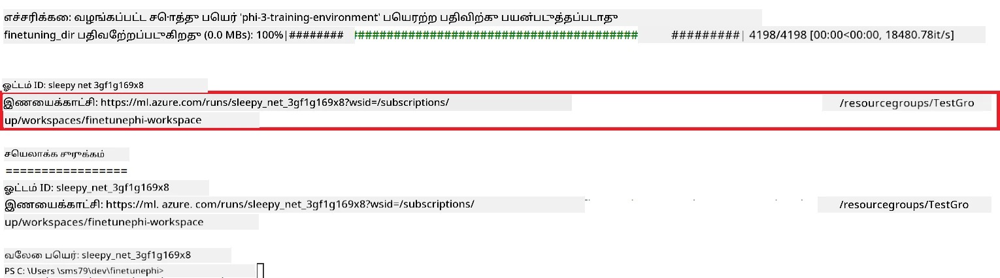

### நுட்பமாக துலக்கப்பட்ட மாதிரியை பயன்பாட்டுக்கு கொண்டு வருதல்

நுட்பமாக துலக்கப்பட்ட Phi-3 மாதிரியை Prompt Flow உடன் இணைக்க, மாதிரியை கண்காணிப்பு நேரத்தில் அணுகக்கூடியவாறு பயன்பாட்டுக்கு கொண்டு வர வேண்டும். இதற்கு மாதிரி பதிவுசெய்தல், ஆன்லைன் முடிச்சை உருவாக்கல், மற்றும் மாதிரியை நிறுவல் ஆகியவை அவசியம்.

#### மாதிரி பெயர், முடிச்சுப் பெயர், நிறுவல் பெயரை அமைக்கவும்

1. *config.py* கோப்பை திறக்கவும்.

1. `AZURE_MODEL_NAME = "your_fine_tuned_model_name"` என்பதனை உங்கள் விருப்ப மாதிரி பெயராக மாற்றவும்.

1. `AZURE_ENDPOINT_NAME = "your_fine_tuned_model_endpoint_name"` என்பதனை உங்கள் விருப்ப முடிச்சுப் பெயராக மாற்றவும்.

1. `AZURE_DEPLOYMENT_NAME = "your_fine_tuned_model_deployment_name"` என்பதனை உங்கள் விருப்ப நிறுவல் பெயராக மாற்றவும்.

#### *deploy_model.py* கோப்பில் குறியீட்டைச் சேர்க்கவும்

*deploy_model.py* கோப்பை இயக்குவதன் மூலம் முழு நிறுவல் செயல்முறை தானாக நடைபெறும். இது மாதிரியை பதிவு செய்து, முடிச்சை உருவாக்கி, *config.py* கோப்பில் கொடுக்கப்பட்ட அமைப்புகளின் அடிப்படையில் (மாதிரிப் பெயர், முடிச்சுப் பெயர், நிறுவல் பெயர்) நிறுவல் செய்கிறது.

1. Visual Studio Code-இல் *deploy_model.py* கோப்பை திறக்கவும்.

1. *deploy_model.py*-க்கு கீழ்காணும் குறியீட்டைச் சேர்்கவும்.

    ```python
    import logging
    from azure.identity import AzureCliCredential
    from azure.ai.ml import MLClient
    from azure.ai.ml.entities import Model, ProbeSettings, ManagedOnlineEndpoint, ManagedOnlineDeployment, IdentityConfiguration, ManagedIdentityConfiguration, OnlineRequestSettings
    from azure.ai.ml.constants import AssetTypes

    # கட்டமைப்பு இறக்குமதிகள்
    from config import (
        AZURE_SUBSCRIPTION_ID,
        AZURE_RESOURCE_GROUP_NAME,
        AZURE_ML_WORKSPACE_NAME,
        AZURE_MANAGED_IDENTITY_RESOURCE_ID,
        AZURE_MANAGED_IDENTITY_CLIENT_ID,
        AZURE_MODEL_NAME,
        AZURE_ENDPOINT_NAME,
        AZURE_DEPLOYMENT_NAME
    )

    # நிலையான தரவுகள்
    JOB_NAME = "your-job-name"
    COMPUTE_INSTANCE_TYPE = "Standard_E4s_v3"

    deployment_env_vars = {
        "SUBSCRIPTION_ID": AZURE_SUBSCRIPTION_ID,
        "RESOURCE_GROUP_NAME": AZURE_RESOURCE_GROUP_NAME,
        "UAI_CLIENT_ID": AZURE_MANAGED_IDENTITY_CLIENT_ID,
    }

    # பதிவு அமைப்பு
    logging.basicConfig(
        format="%(asctime)s - %(levelname)s - %(name)s - %(message)s",
        datefmt="%Y-%m-%d %H:%M:%S",
        level=logging.DEBUG
    )
    logger = logging.getLogger(__name__)

    def get_ml_client():
        """Initialize and return the ML Client."""
        credential = AzureCliCredential()
        return MLClient(credential, AZURE_SUBSCRIPTION_ID, AZURE_RESOURCE_GROUP_NAME, AZURE_ML_WORKSPACE_NAME)

    def register_model(ml_client, model_name, job_name):
        """Register a new model."""
        model_path = f"azureml://jobs/{job_name}/outputs/artifacts/paths/model_output"
        logger.info(f"Registering model {model_name} from job {job_name} at path {model_path}.")
        run_model = Model(
            path=model_path,
            name=model_name,
            description="Model created from run.",
            type=AssetTypes.MLFLOW_MODEL,
        )
        model = ml_client.models.create_or_update(run_model)
        logger.info(f"Registered model ID: {model.id}")
        return model

    def delete_existing_endpoint(ml_client, endpoint_name):
        """Delete existing endpoint if it exists."""
        try:
            endpoint_result = ml_client.online_endpoints.get(name=endpoint_name)
            logger.info(f"Deleting existing endpoint {endpoint_name}.")
            ml_client.online_endpoints.begin_delete(name=endpoint_name).result()
            logger.info(f"Deleted existing endpoint {endpoint_name}.")
        except Exception as e:
            logger.info(f"No existing endpoint {endpoint_name} found to delete: {e}")

    def create_or_update_endpoint(ml_client, endpoint_name, description=""):
        """Create or update an endpoint."""
        delete_existing_endpoint(ml_client, endpoint_name)
        logger.info(f"Creating new endpoint {endpoint_name}.")
        endpoint = ManagedOnlineEndpoint(
            name=endpoint_name,
            description=description,
            identity=IdentityConfiguration(
                type="user_assigned",
                user_assigned_identities=[ManagedIdentityConfiguration(resource_id=AZURE_MANAGED_IDENTITY_RESOURCE_ID)]
            )
        )
        endpoint_result = ml_client.online_endpoints.begin_create_or_update(endpoint).result()
        logger.info(f"Created new endpoint {endpoint_name}.")
        return endpoint_result

    def create_or_update_deployment(ml_client, endpoint_name, deployment_name, model):
        """Create or update a deployment."""

        logger.info(f"Creating deployment {deployment_name} for endpoint {endpoint_name}.")
        deployment = ManagedOnlineDeployment(
            name=deployment_name,
            endpoint_name=endpoint_name,
            model=model.id,
            instance_type=COMPUTE_INSTANCE_TYPE,
            instance_count=1,
            environment_variables=deployment_env_vars,
            request_settings=OnlineRequestSettings(
                max_concurrent_requests_per_instance=3,
                request_timeout_ms=180000,
                max_queue_wait_ms=120000
            ),
            liveness_probe=ProbeSettings(
                failure_threshold=30,
                success_threshold=1,
                period=100,
                initial_delay=500,
            ),
            readiness_probe=ProbeSettings(
                failure_threshold=30,
                success_threshold=1,
                period=100,
                initial_delay=500,
            ),
        )
        deployment_result = ml_client.online_deployments.begin_create_or_update(deployment).result()
        logger.info(f"Created deployment {deployment.name} for endpoint {endpoint_name}.")
        return deployment_result

    def set_traffic_to_deployment(ml_client, endpoint_name, deployment_name):
        """Set traffic to the specified deployment."""
        try:
            # தற்போதைய முடிவு விவரங்களை பெற்றுக்கொள்ளவும்
            endpoint = ml_client.online_endpoints.get(name=endpoint_name)
            
            # பிழைதிருத்தத்திற்கு தற்போதைய போக்குவரத்து ஒதுக்கீட்டை பதிவு செய்க
            logger.info(f"Current traffic allocation: {endpoint.traffic}")
            
            # வெளியீட்டிற்கான போக்குவரத்து ஒதுக்கீட்டை அமைக்கவும்
            endpoint.traffic = {deployment_name: 100}
            
            # புதிய போக்குவரத்து ஒதுக்கீட்டுடன் முடிவை புதுப்பிக்கவும்
            endpoint_poller = ml_client.online_endpoints.begin_create_or_update(endpoint)
            updated_endpoint = endpoint_poller.result()
            
            # பிழைதிருத்தத்திற்கு புதுப்பிக்கப்பட்ட போக்குவரத்து ஒதுக்கீட்டை பதிவு செய்க
            logger.info(f"Updated traffic allocation: {updated_endpoint.traffic}")
            logger.info(f"Set traffic to deployment {deployment_name} at endpoint {endpoint_name}.")
            return updated_endpoint
        except Exception as e:
            # செயல்முறையில் ஏற்படும் எந்த பிழைகளையும் பதிவு செய்யவும்
            logger.error(f"Failed to set traffic to deployment: {e}")
            raise


    def main():
        ml_client = get_ml_client()

        registered_model = register_model(ml_client, AZURE_MODEL_NAME, JOB_NAME)
        logger.info(f"Registered model ID: {registered_model.id}")

        endpoint = create_or_update_endpoint(ml_client, AZURE_ENDPOINT_NAME, "Endpoint for finetuned Phi-3 model")
        logger.info(f"Endpoint {AZURE_ENDPOINT_NAME} is ready.")

        try:
            deployment = create_or_update_deployment(ml_client, AZURE_ENDPOINT_NAME, AZURE_DEPLOYMENT_NAME, registered_model)
            logger.info(f"Deployment {AZURE_DEPLOYMENT_NAME} is created for endpoint {AZURE_ENDPOINT_NAME}.")

            set_traffic_to_deployment(ml_client, AZURE_ENDPOINT_NAME, AZURE_DEPLOYMENT_NAME)
            logger.info(f"Traffic is set to deployment {AZURE_DEPLOYMENT_NAME} at endpoint {AZURE_ENDPOINT_NAME}.")
        except Exception as e:
            logger.error(f"Failed to create or update deployment: {e}")

    if __name__ == "__main__":
        main()

    ```

1. `JOB_NAME` பெற பின்வரும் நடவடிக்கைகள் செய்யவும்:

    - நீங்கள் உருவாக்கிய Azure இயந்திரக் கற்றல் வளத்திற்குச் செல்லவும்.
    - **Studio web URL**-ஐ தேர்ந்தெடுத்து Azure இயந்திரக் கற்றல் பணிப்பகுதியில் செல்.
    - இடது பக்கப்பட்டியலில் இருந்து **Jobs**-ஐ தேர்ந்தெடுக்கவும்.
    - நுட்பமாக துலக்கும் முயற்சியை (எ.கா., *finetunephi*) தேர்ந்தெடுக்கவும்.
    - நீங்கள் உருவாக்கிய பணியை தேர்ந்தெடுக்கவும்.
- உங்கள் வேலை பெயரை *deploy_model.py* கோப்பில் உள்ள `JOB_NAME = "your-job-name"` இல் நகல் செய்து ஒட்டவும்.

1. `COMPUTE_INSTANCE_TYPE` ஐ உங்கள் குறிப்பிட்ட விவரங்களுடன் மாற்றவும்.

1. Azure Machine Learning இல் *deploy_model.py* ஸ்கிரிப்டை இயக்கி வெளியீட்டு செயல்முறையை தொடங்க கீழ்காணும் கட்டளையை தட்டச்சு செய்யவும்.

    ```python
    python deploy_model.py
    ```

> [!WARNING]
> உங்கள் கணக்கில் கூடுதல் கட்டணங்கள் வராமல் இருக்க, Azure Machine Learning வேலைப்பாத்திரத்தில் உருவாக்கிய endpoints ஐ நீக்க வேண்டும்.
>

#### Azure Machine Learning வேலைப்பாத்திரத்தில் வெளியீட்டு நிலையை சரிபார்க்கவும்

1. [Azure ML Studio](https://ml.azure.com/home?wt.mc_id=studentamb_279723) செல்லவும்.

1. நீங்கள் உருவாக்கிய Azure Machine Learning வேலைப்பாத்திரத்திற்கு செல்லவும்.

1. Azure Machine Learning வேலைப்பாத்திரத்தை திறக்க **Studio web URL** ஐ தேர்ந்தெடுக்கவும்.

1. இடது பக்க டேபில் இருந்து **Endpoints** ஐ தேர்ந்தெடுக்கவும்.

    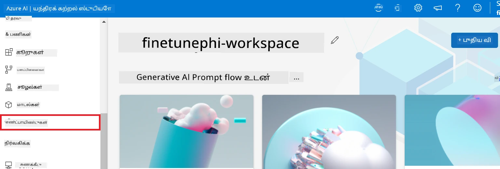

2. நீங்கள் உருவாக்கிய endpoint ஐ தேர்ந்தெடுக்கவும்.

    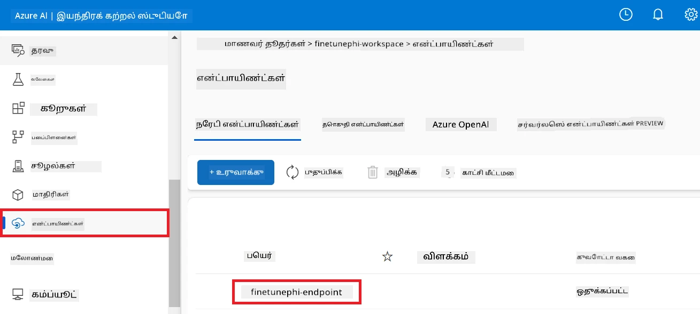

3. இந்த பக்கத்தில், வெளியீட்டு செயல்முறையின் போது உருவாக்கப்பட்ட endpoints ஐ நிர்வகிக்க முடியும்.

## நிலை 3: Prompt flow உடன் ஒருங்கிணைத்து உங்கள் தனிப்பயன் மாதிரியுடன் உரையாடல் செய்யவும்

### தனிப்பயன் Phi-3 மாதிரியை Prompt flow உடன் ஒருங்கிணைக்கவும்

உங்கள் நுணுக்கமாக பயிற்சி பெற்ற மாதிரியை வெற்றிகரமாக வெளியிட்ட பிறகு, அதை Prompt flow உடன் இணைத்து உங்கள் மாதிரியை நேரடி பயன்பாடுகளில் பயன்படுத்த முடியும், இது உங்கள் தனிப்பயன் Phi-3 மாதிரியுடன் பலவகை நேரடி பணிகளை செய்வதற்கு உதவுகிறது.

#### நுணுக்கமாக பயிற்சி பெற்ற Phi-3 மாதிரியின் api key மற்றும் endpoint uri-வை அமைக்கவும்

1. நீங்கள் உருவாக்கிய Azure Machine Learning வேலைப்பாத்திரத்திற்கு செல்லவும்.
1. இடது பக்க டேபில் இருந்து **Endpoints** ஐ தேர்ந்தெடுக்கவும்.
1. நீங்கள் உருவாக்கிய endpoint ஐத் தேர்ந்தெடுக்கவும்.
1. வழிசெலுத்தும் பட்டியில் இருந்து **Consume** ஐத் தேர்ந்தெடுக்கவும்.
1. உங்கள் **REST endpoint** ஐ *config.py* கோப்பில் `AZURE_ML_ENDPOINT = "your_fine_tuned_model_endpoint_uri"` ஐ உங்கள் **REST endpoint** மூலம் மாற்றி நகல் செய்து ஒட்டவும்.
1. உங்கள் **Primary key** ஐ *config.py* கோப்பில் `AZURE_ML_API_KEY = "your_fine_tuned_model_api_key"` ஐ உங்கள் **Primary key** மூலம் மாற்றி நகல் செய்து ஒட்டவும்.

    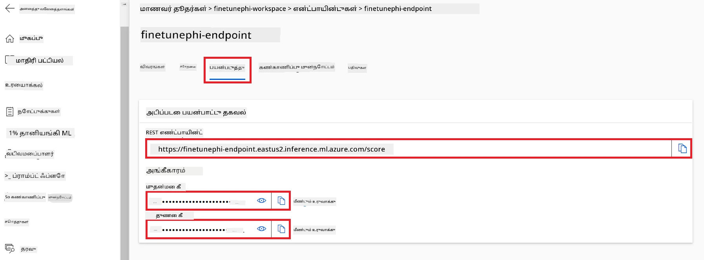

#### *flow.dag.yml* கோப்பில் கோடைச் சேர்க்கவும்

1. Visual Studio Code இல் *flow.dag.yml* கோப்பை திறக்கவும்.

1. *flow.dag.yml* கோப்பில் கீழ்காணும் கோடுகளை சேர்.

    ```yml
    inputs:
      input_data:
        type: string
        default: "Who founded Microsoft?"

    outputs:
      answer:
        type: string
        reference: ${integrate_with_promptflow.output}

    nodes:
    - name: integrate_with_promptflow
      type: python
      source:
        type: code
        path: integrate_with_promptflow.py
      inputs:
        input_data: ${inputs.input_data}
    ```

#### *integrate_with_promptflow.py* கோப்பில் கோடைச் சேர்க்கவும்

1. Visual Studio Code இல் *integrate_with_promptflow.py* கோப்பை திறக்கவும்.

1. *integrate_with_promptflow.py* கோப்பில் கீழ்காணும் கோடுகளைச் சேர்க்கவும்.

    ```python
    import logging
    import requests
    from promptflow.core import tool
    import asyncio
    import platform
    from config import (
        AZURE_ML_ENDPOINT,
        AZURE_ML_API_KEY
    )

    # பதிவு அமைப்பு
    logging.basicConfig(
        format="%(asctime)s - %(levelname)s - %(name)s - %(message)s",
        datefmt="%Y-%m-%d %H:%M:%S",
        level=logging.DEBUG
    )
    logger = logging.getLogger(__name__)

    def query_azml_endpoint(input_data: list, endpoint_url: str, api_key: str) -> str:
        """
        Send a request to the Azure ML endpoint with the given input data.
        """
        headers = {
            "Content-Type": "application/json",
            "Authorization": f"Bearer {api_key}"
        }
        data = {
            "input_data": [input_data],
            "params": {
                "temperature": 0.7,
                "max_new_tokens": 128,
                "do_sample": True,
                "return_full_text": True
            }
        }
        try:
            response = requests.post(endpoint_url, json=data, headers=headers)
            response.raise_for_status()
            result = response.json()[0]
            logger.info("Successfully received response from Azure ML Endpoint.")
            return result
        except requests.exceptions.RequestException as e:
            logger.error(f"Error querying Azure ML Endpoint: {e}")
            raise

    def setup_asyncio_policy():
        """
        Setup asyncio event loop policy for Windows.
        """
        if platform.system() == 'Windows':
            asyncio.set_event_loop_policy(asyncio.WindowsSelectorEventLoopPolicy())
            logger.info("Set Windows asyncio event loop policy.")

    @tool
    def my_python_tool(input_data: str) -> str:
        """
        Tool function to process input data and query the Azure ML endpoint.
        """
        setup_asyncio_policy()
        return query_azml_endpoint(input_data, AZURE_ML_ENDPOINT, AZURE_ML_API_KEY)

    ```

### உங்கள் தனிப்பயன் மாதிரியுடன் உரையாடல் செய்யவும்

1. Azure Machine Learning இல் *deploy_model.py* ஸ்கிரிப்டை இயக்கி வெளியீட்டு செயல்முறையை தொடங்க கீழ்காணும் கட்டளையை தட்டச்சு செய்யவும்.

    ```python
    pf flow serve --source ./ --port 8080 --host localhost
    ```

1. இதோ ஒரு முடிவுகளின் உதாரணம்: இப்போது நீங்கள் உங்கள் தனிப்பயன் Phi-3 மாதிரியுடன் உரையாட முடியும். நுணுக்க பயிற்சிக்காக பயன்படுத்திய தரவுகளின் அடிப்படையில் கேள்விகள் கேட்க பரிந்துரைக்கப்படுகிறது.

    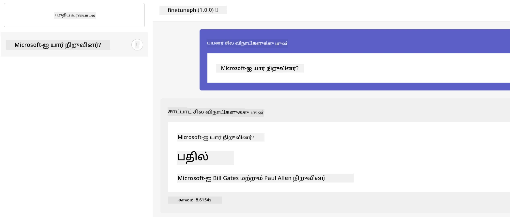

---

<!-- CO-OP TRANSLATOR DISCLAIMER START -->
**விரோதபூர்வம்**:  
இந்த ஆவணம் AI மொழிபெயர்ப்பு சேவையான [Co-op Translator](https://github.com/Azure/co-op-translator) பயன்பாட்டால் மொழிமாற்றம் செய்யப்பட்டுள்ளது. நாங்கள் துல்லியத்திற்காக முயலுகிறோம் என்றாலும், தானியங்கி மொழிபெயர்ப்புகளில் பிழைகள் அல்லது தவறான தகவல்கள் இருக்கக்கூடும் என்பதைக் கவனத்தில் கொள்ளவும். மொழியின் சொந்த மொழியில் உள்ள அசல் ஆவணம் அதிகாரப்பூர்வமான ஆதாரமாக கருதப்பட வேண்டும். முக்கியமான தகவல்களுக்காக, தொழில்முறை மனித மொழிபெயர்ப்பை பரிந்துரைக்கிறோம். இந்த மொழிபெயர்ப்பின் பயனிலிருந்து ஏற்பட்ட எந்த தவறான புரிதல்கள் அல்லது தவறான விளக்கங்களுக்கு நாங்கள் பொறுப்பேற்றுக்கொள்ளமாட்டோம்.
<!-- CO-OP TRANSLATOR DISCLAIMER END -->