# அசுரு ஏஐ ஃபவுண்ட்ரி-யில் ப்ராம்ட் ஃப்ளோவுடன் தனிப்பயனாக்கப்பட்ட Phi-3 மாதிரிகளை சிறப்பாகத் திருத்தி ஒருங்கிணைப்பு செய்வது

இந்த முழுமையான (E2E) மாதிரி Microsoft Tech Community இலிருந்து "[Azure AI Foundry-இல் Prompt Flow உடன் தனிப்பயனாக்கப்பட்ட Phi-3 மாதிரிகளை நயமாகத் திருத்தி ஒருங்கிணைப்பு செய்வது](https://techcommunity.microsoft.com/t5/educator-developer-blog/fine-tune-and-integrate-custom-phi-3-models-with-prompt-flow-in/ba-p/4191726?WT.mc_id=aiml-137032-kinfeylo)" என்ற வழிகாட்டலை அடிப்படையாகக் கொண்டது. இது Azure AI Foundry-இல் Prompt flow உடன் தனிப்பயனாக்கப்பட்ட Phi-3 மாதிரிகளை நயமாகத் திருத்துதல், பரவல் மற்றும் ஒருங்கிணைக்கும் செயல்முறைகளை அறிமுகப்படுத்துகிறது. உள்ளூர் இயங்கும் குறியீட்டை இயக்குவதற்கு ஈடுபட்ட "[கடைசி வரை E2E மாதிரி, 'Prompt Flow உடன் தனிப்பயனாக்கப்பட்ட Phi-3 மாதிரிகளை நயமாகத் திருத்தி ஒருங்கிணைத்தல்'](./E2E_Phi-3-FineTuning_PromptFlow_Integration.md)" நுட்பபூர்வமானது, இதன் மாறாக இந்த கையேடு முழுமையாக Azure AI / ML ஸ்டுடியோவில் உங்கள் மாதிரியை நயமாகத் திருத்தி ஒருங்கிணைப்பதுக்கு திருப்பமாக உள்ளது.

## கண்ணோட்டம்

இந்த E2E மாதிரியில், நீங்கள் Phi-3 மாதிரியை நயமாகத் திருத்தி Azure AI Foundry-இல் Prompt flow உடன் ஒருங்கிணைக்கும் விதத்தை கற்றுக்கொள்வீர்கள். Azure AI / ML ஸ்டுடியோவினை பயன்படுத்தி, தனித்துவம் வாய்ந்த AI மாதிரிகள் பரவல் மற்றும் பயன்பாட்டிற்கான வேலைப்பாடை உருவாக்குவீர்கள். இந்த E2E மாதிரி மூன்று சூழிகளாக பிரிக்கப்பட்டுள்ளது:

**சூழல் 1: Azure வளங்களை அமைத்து நயமாகத் திருத்த தயாராகுக**

**சூழல் 2: Phi-3 மாதிரியை நயமாகத் திருத்தி Azure Machine Learning Studio-வில் பரவும்**

**சூழல் 3: Prompt flow உடன் ஒருங்கிணைத்து Azure AI Foundry-இல் உங்கள் தனிப்பயனாக்கப்பட்ட மாதிரியுடன் உரையாடுக**

இதோ இந்த E2E மாதிரியின் விரிவான கண்ணோட்டம்.

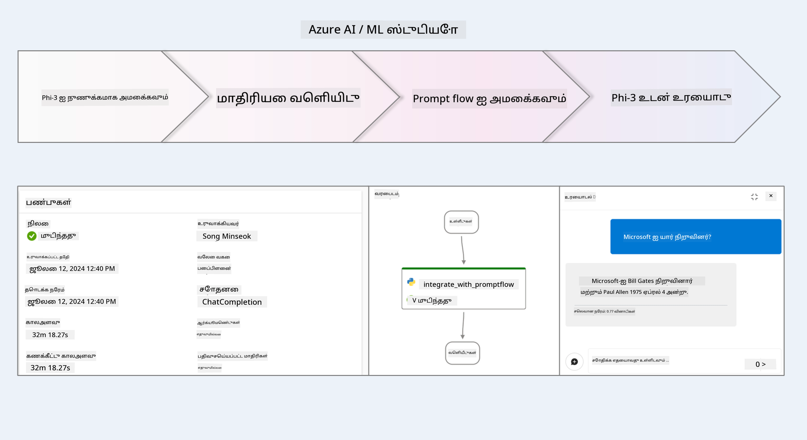

### உள்ளடக்கப்பட்ட பொருட்கள்

1. **[சூழல் 1: Azure வளங்களை அமைத்து நயமாகத் திருத்த தயாராகுக](../../../../../../md/02.Application/01.TextAndChat/Phi3)**
    - [Azure Machine Learning பணியிடம் உருவாக்குக](../../../../../../md/02.Application/01.TextAndChat/Phi3)
    - [Azure சந்தா-வில் GPU அளவுகோலைக் கோருக](../../../../../../md/02.Application/01.TextAndChat/Phi3)
    - [பங்கு ஒதுக்கீடு சேர்க்க](../../../../../../md/02.Application/01.TextAndChat/Phi3)
    - [திட்டத்தை அமைக்க](../../../../../../md/02.Application/01.TextAndChat/Phi3)
    - [நயமாகத் திருத்துவதற்கான தரவுத்தொகுப்பை தயாரிக்க](../../../../../../md/02.Application/01.TextAndChat/Phi3)

1. **[சூழல் 2: Phi-3 மாதிரியை நயமாகச் செய்து Azure Machine Learning Studio-வில் பரவும்](../../../../../../md/02.Application/01.TextAndChat/Phi3)**
    - [Phi-3 மாதிரியை நயமாகத் திருத்துக](../../../../../../md/02.Application/01.TextAndChat/Phi3)
    - [நயமாகத் திருத்தப்பட்ட Phi-3 மாதிரியை பரவும்](../../../../../../md/02.Application/01.TextAndChat/Phi3)

1. **[சூழல் 3: Prompt flow உடன் ஒருங்கிணைத்து Azure AI Foundry-இல் உங்கள் தனிப்பயனாக்கப்பட்ட மாதிரியுடன் உரையாடுக](../../../../../../md/02.Application/01.TextAndChat/Phi3)**
    - [தனிப்பயனாக்கப்பட்ட Phi-3 மாதிரியை Prompt flow உடன் ஒருங்கிணைக்க](../../../../../../md/02.Application/01.TextAndChat/Phi3)
    - [உங்கள் தனிப்பயனாக்கப்பட்ட Phi-3 மாதிரியுடன் உரையாடுக](../../../../../../md/02.Application/01.TextAndChat/Phi3)

## சூழல் 1: Azure வளங்களை அமைத்து நயமாகத் திருத்த தயாராகுக

### Azure Machine Learning பணியிடம் உருவாக்குக

1. போர்டல் பக்கத்தின் மேலே உள்ள **தேடல் பட்டியில்** *azure machine learning* என தட்டச்சு செய்து, தோன்றும் விருப்பங்களில் இருந்து **Azure Machine Learning**-ஐ தேர்ந்தெடுக்கவும்.

    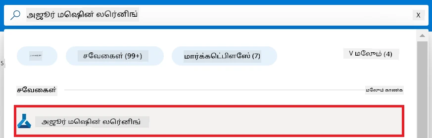

2. வழிசெலுத்தல் பட்டியில் இருந்து **+ Create** ஐ தேர்ந்தெடுக்கவும்.

3. வழிசெலுத்தல் பட்டியில் இருந்து **New workspace** ஐ தேர்ந்தெடுக்கவும்.

    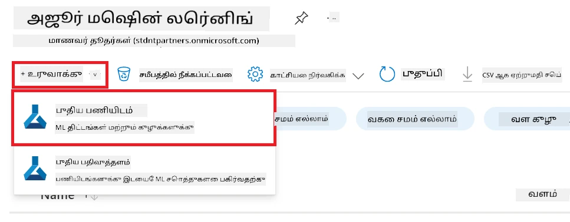

4. பின்வரும் பணிகளை மேற்கொள்ளவும்:

    - உங்கள் Azure **Subscription** ஐத் தேர்ந்தெடுக்கவும்.
    - உபயோகிக்கவேண்டிய **Resource group** ஐத் தேர்ந்தெடுக்கவும் (தேவைப்பட்டால் புதியதொன்றை உருவாக்கவும்).
    - **Workspace Name**-ஐ உள்ளிடவும். இது தனித்துவமான மதிப்பு ஆகியிருக்க வேண்டும்.
    - உங்களுக்குத் தேவையான **Region**-ஐத் தேர்ந்தெடுக்கவும்.
    - உபயோகிக்கவேண்டிய **Storage account**-ஐத் தேர்ந்தெடுக்கவும் (தேவைப்பட்டால் புதியதொன்றை உருவாக்கவும்).
    - உபயோகிக்கவேண்டிய **Key vault**-ஐத் தேர்ந்தெடுக்கவும் (தேவைப்பட்டால் புதியதொன்றை உருவாக்கவும்).
    - உபயோகிக்கவேண்டிய **Application insights**-ஐத் தேர்ந்தெடுக்கவும் (தேவைப்பட்டால் புதியதொன்றை உருவாக்கவும்).
    - உபயோகிக்கவேண்டிய **Container registry**-ஐத் தேர்ந்தெடுக்கவும் (தேவைப்பட்டால் புதியதொன்றை உருவாக்கவும்).

    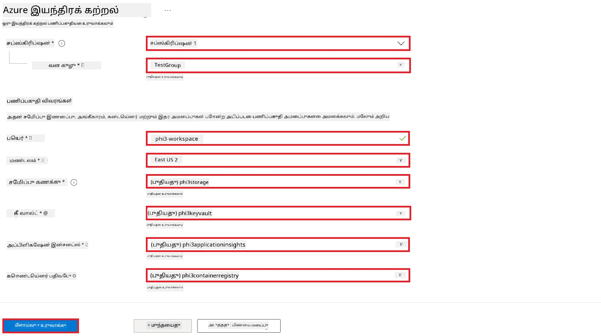

5. **Review + Create** ஐத் தேர்ந்தெடுக்கவும்.

6. **Create** ஐ தேர்ந்தெடுக்கவும்.

### Azure Subscription இல் GPU அளவுகோல்கள் கோருக

இந்த பயிற்சியில், GPUs பயன்படுத்தி Phi-3 மாதிரியை நயமாகத் திருத்தி பரவ வற்புறுத்தப்படும். நயமாக் திருத்தத்திற்கு *Standard_NC24ads_A100_v4* GPU பயன்படுத்தப்பட உள்ளது, இதற்கு அளவுகோல் கோரல் அவசியம். பரவலுக்கு, *Standard_NC6s_v3* GPU பயன்படுத்தப்பெறும், இது கூட அளவுகோல் கோரல் தேவை.

> [!NOTE]
>
> GPU ஒதுக்கீட்டுக்கான விருப்பம் Pay-As-You-Go சந்தாக்களுக்கு மட்டுமே (காந்டிராட்டான சந்தா வகை) சாதகமானது; நல மட்டுப் பாடுபட்ட சந்தாக்கள் தற்போது ஆதரிக்கப்படவில்லை.
>

1. [Azure ML Studio](https://ml.azure.com/home?wt.mc_id=studentamb_279723) இடத்திற்கு செல்லவும்.

1. *Standard NCADSA100v4 Family* அளவுகோலைக் கோர பின்வரும் பணிகளை மேற்கொள்ளவும்:

    - இடதுபுற அட்டையில் இருந்து **Quota** ஐத் தேர்ந்தெடுக்கவும்.
    - உபயோகிக்க வேண்டிய **Virtual machine family**-ஐத் தேர்ந்தெடுக்கவும். எடுத்துக்காட்டாக, *Standard_NC24ads_A100_v4* GPU-ஐ கொண்டுள்ள **Standard NCADSA100v4 Family Cluster Dedicated vCPUs**-ஐ தேர்ந்தெடுக்கவும்.
    - வழிசெலுத்தல் பட்டியில் இருந்து **Request quota** ஐத் தேர்ந்தெடுக்கவும்.

        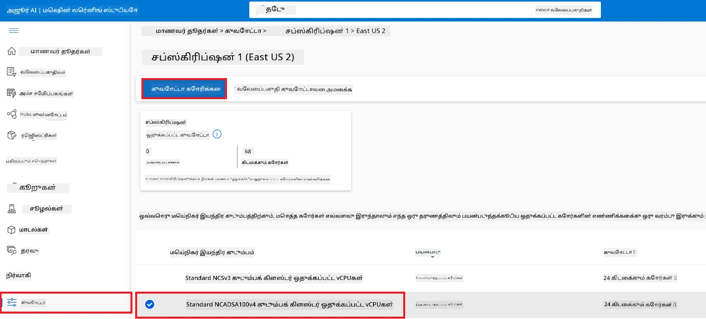

    - Request quota பக்கத்தில் உபயோகிக்க விரும்பும் **New cores limit**-ஐ உள்ளிடவும். எடுத்துக்காட்டாக, 24.
    - Request quota பக்கத்தில் **Submit** ஐத் தேர்ந்தெடுக்கி GPU அளவுகோலைக் கோரவும்.

1. *Standard NCSv3 Family* அளவுகோலைக் கோர பின்வரும் பணிகளை மேற்கொள்ளவும்:

    - இடதுபுற அட்டையில் இருந்து **Quota** ஐத் தேர்ந்தெடுக்கவும்.
    - உபயோகிக்க வேண்டிய **Virtual machine family**-ஐத் தேர்ந்தெடுக்கவும். எடுத்துக்காட்டாக, *Standard_NC6s_v3* GPU-ஐ கொண்டுள்ள **Standard NCSv3 Family Cluster Dedicated vCPUs**-ஐ தேர்ந்தெடுக்கவும்.
    - வழிசெலுத்தல் பட்டியில் இருந்து **Request quota** ஐத் தேர்ந்தெடுக்கவும்.
    - Request quota பக்கத்தில் உபயோகிக்க விரும்பும் **New cores limit**-ஐ உள்ளிடவும். எடுத்துக்காட்டாக, 24.
    - Request quota பக்கத்தில் **Submit** ஐத் தேர்ந்தெடுக்கி GPU அளவுகோலைக் கோரவும்.

### பங்கு ஒதுக்கீடு சேர்க்க

உங்கள் மாதிரிகளை நயமாகத் திருத்தி பரப்புவதற்கு முன்பு, நீங்கள் முதலில் உள்ளமைக்கப்பட்ட User Assigned Managed Identity (UAI) ஒன்றை உருவாக்கி அதற்கு பொருத்தமான அனுமதிகளை ஒதுக்க வேண்டும். இந்த UAI பரப்பும் போது அங்கீகாரத்திற்குப் பயன்படுத்தப்படும்.

#### User Assigned Managed Identity (UAI) உருவாக்குக

1. போர்டல் பக்கத்தின் மேலே உள்ள **தேடல் பட்டியில்** *managed identities* என தட்டச்சு செய்து, தோன்றும் விருப்பங்களில் இருந்து **Managed Identities**-ஐத் தேர்ந்தெடுக்கவும்.

    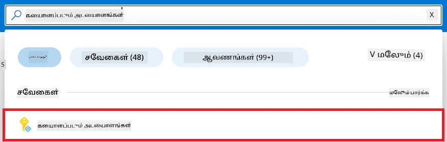

1. **+ Create**-ஐத் தேர்ந்தெடுக்கவும்.

    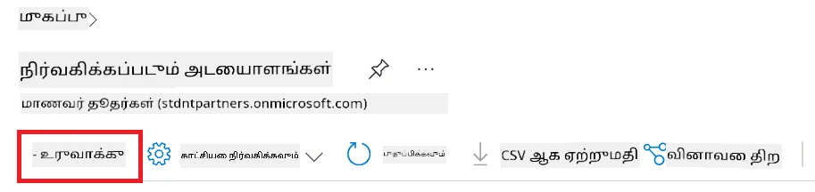

1. பின்வரும் பணிகளை மேற்கொள்ளவும்:

    - உங்கள் Azure **Subscription**-ஐத் தேர்ந்தெடுக்கவும்.
    - உபயோகிக்கவிருக்கும் **Resource group**-ஐத் தேர்ந்தெடுக்கவும் (தேவைப்பட்டால் புதியதொன்றை உருவாக்கவும்).
    - உபயோகிக்க விரும்பும் **Region**-ஐத் தேர்ந்தெடுக்கவும்.
    - **Name**-ஐ உள்ளிடவும். இது தனித்துவமான மதிப்பு ஆகியிருக்க வேண்டும்.

    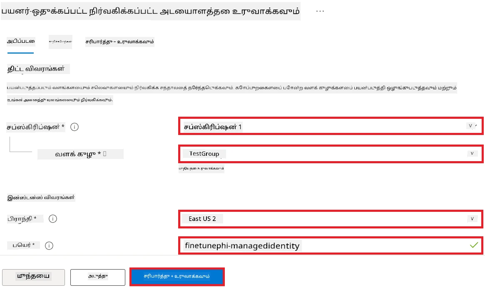

1. **Review + create** ஐத் தேர்ந்தெடுக்கவும்.

1. **+ Create** ஐ தேர்ந்தெடுக்கவும்.

#### Managed Identityக்கு பங்கு ஒதுக்கீடு (Contributor) சேர்க்க

1. நீங்கள் உருவாக்கிய Managed Identity வளத்துக்கு செல்லவும்.

1. இடதுபுற சோதனை பட்டியில் இருந்து **Azure role assignments**-ஐத் தேர்ந்தெடுக்கவும்.

1. வழிசெலுத்தல் பட்டியில் இருந்து **+Add role assignment**-ஐத் தேர்ந்தெடுக்கவும்.

1. Add role assignment பக்கத்தில் பின்வரும் பணிகளை செய்யவும்:
    - **Scope**-ஐ **Resource group** ஆக தேர்ந்தெடுக்கவும்.
    - உங்கள் Azure **Subscription**-ஐத் தேர்ந்தெடுக்கவும்.
    - உபயோகிக்க வேண்டிய **Resource group**-ஐத் தேர்ந்தெடுக்கவும்.
    - **Role**-ஐ **Contributor** என தேர்ந்தெடுக்கவும்.

    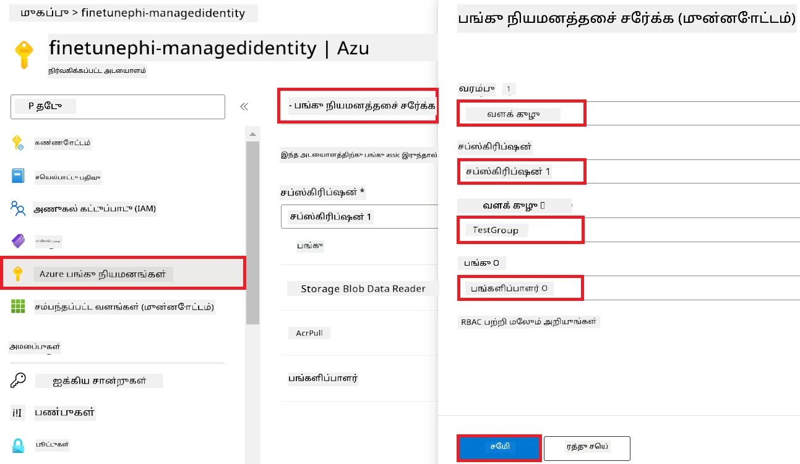

2. **Save** ஐத் தேர்ந்தெடுக்கவும்.

#### Managed Identityக்கு Storage Blob Data Reader பங்கு ஒதுக்கீடு சேர்க்க

1. போர்டல் பக்கத்தின் மேலே உள்ள **தேடல் பட்டியில்** *storage accounts* என தட்டச்சு செய்து, தோன்றும் விருப்பங்களில் இருந்து **Storage accounts**-ஐத் தேர்ந்தெடுக்கவும்.

    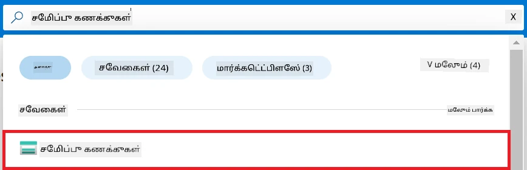

1. நீங்கள் உருவாக்கிய Azure Machine Learning பணியிடத் தொடர்புடைய ஸ்டோரேஜ் அக்கவுண்டைத் தேர்ந்தெடுக்கவும். எடுத்துக்காட்டாக, *finetunephistorage*.

1. Add role assignment பக்கத்திற்கு செல்ல பின்வரும் பணிகளை செய்யவும்:

    - நீங்கள் உருவாக்கிய Azure ஸ்டோரேஜ் அக்கவுண்டுக்குச் செல்.
    - இடதுபுற அட்டையில் இருந்து **Access Control (IAM)** ஐத் தேர்ந்தெடுக்கவும்.
    - வழிசெலுத்தல் பட்டியில் இருந்து **+ Add** ஐத் தேர்ந்தெடுக்கவும்.
    - வழிசெலுத்தல் பட்டியில் இருந்து **Add role assignment** ஐத் தேர்ந்தெடுக்கவும்.

    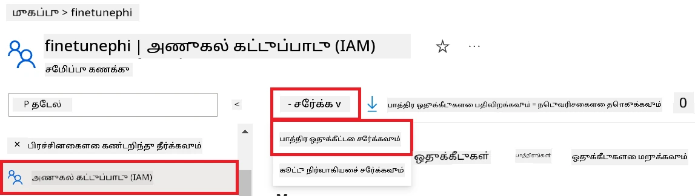

1. Add role assignment பக்கத்தில் பின்வரும் பணிகளை செய்யவும்:

    - Role பக்கத்தில், **search bar**-ல் *Storage Blob Data Reader* என தட்டச்சு செய்து தோன்றும் விருப்பங்களில் இருந்து **Storage Blob Data Reader**-ஐத் தேர்ந்தெடுக்கவும்.
    - Role பக்கத்தில் **Next**-ஐத் தேர்ந்தெடுக்கவும்.
    - Members பக்கத்தில் **Assign access to**-ஐ **Managed identity** என தேர்ந்தெடுக்கவும்.
    - Members பக்கத்தில் **+ Select members**-ஐத் தேர்ந்தெடுக்கவும்.
    - Select managed identities பக்கத்தில் உங்கள் Azure **Subscription**-ஐத் தேர்ந்தெடுக்கவும்.
    - Select managed identities பக்கத்தில் **Managed identity** ஐ **Manage Identity** எனத் தேர்ந்தெடுக்கவும்.
    - நீங்கள் உருவாக்கிய Manage Identity-ஐத் தேர்ந்தெடுக்கவும். எடுத்துக்காட்டாக, *finetunephi-managedidentity*.
    - Select managed identities பக்கத்தில் **Select** ஐத் தேர்ந்தெடுக்கவும்.

    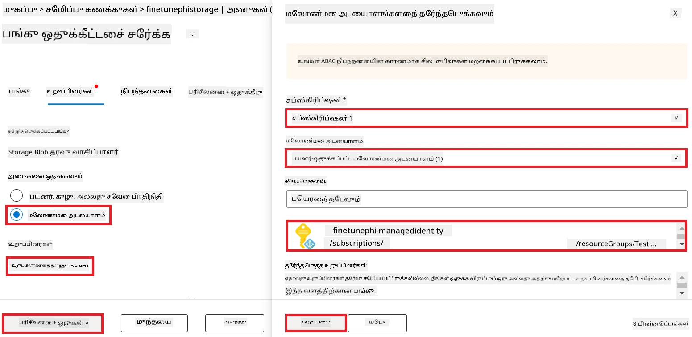

1. **Review + assign** ஐத் தேர்ந்தெடுக்கவும்.

#### Managed Identityக்கு AcrPull பங்கு ஒதுக்கீடு சேர்க்க

1. போர்டல் பக்கத்தின் மேலே உள்ள **தேடல் பட்டியில்** *container registries* என தட்டச்சு செய்து, தோன்றும் விருப்பங்களில் இருந்து **Container registries**-ஐத் தேர்ந்தெடுக்கவும்.

    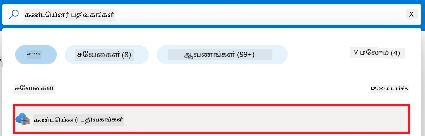

1. Azure Machine Learning பணியிடத்துடன் தொடர்புடைய container registry ஐத் தேர்ந்தெடுக்கவும். எடுத்துக்காட்டாக, *finetunephicontainerregistry*

1. Add role assignment பக்கத்திற்கு செல்ல பின்வரும் பணிகளை செய்யவும்:

    - இடதுபுற அட்டையில் இருந்து **Access Control (IAM)** ஐத் தேர்ந்தெடுக்கவும்.
    - வழிசெலுத்தல் பட்டியில் இருந்து **+ Add** ஐத் தேர்ந்தெடுக்கவும்.
    - வழிசெலுத்தல் பட்டியில் இருந்து **Add role assignment** ஐத் தேர்ந்தெடுக்கவும்.

1. Add role assignment பக்கத்தில் பின்வரும் பணிகளை செய்யவும்:

    - Role பக்கத்தில், **search bar**-ல் *AcrPull* என தட்டச்சு செய்து தோன்றும் விருப்பங்களில் இருந்து **AcrPull**-ஐத் தேர்ந்தெடுக்கவும்.
    - Role பக்கத்தில் **Next**-ஐத் தேர்ந்தெடுக்கவும்.
    - Members பக்கத்தில் **Assign access to**-ஐ **Managed identity** எனத் தேர்ந்தெடுக்கவும்.
    - Members பக்கத்தில் **+ Select members**-ஐத் தேர்ந்தெடுக்கவும்.
    - Select managed identities பக்கத்தில் உங்கள் Azure **Subscription**-ஐத் தேர்ந்தெடுக்கவும்.
    - Select managed identities பக்கத்தில் **Managed identity**-ஐ **Manage Identity** எனத் தேர்ந்தெடுக்கவும்.
    - நீங்கள் உருவாக்கிய Manage Identity-ஐத் தேர்ந்தெடுக்கவும். எடுத்துக்காட்டாக, *finetunephi-managedidentity*.
    - Select managed identities பக்கத்தில் **Select** ஐத் தேர்ந்தெடுக்கவும்.
    - **Review + assign** ஐத் தேர்ந்தெடுக்கவும்.

### திட்டத்தை அமைக்க

நயமாகத் திருத்தத் தேவையான தரவுத்தொகுப்புகளை பதிவிறக்க, நீங்கள் உள்ளூர் சூழலை அமைப்பீர்கள்.

இந்த பயிற்சியில் நீங்கள்

- உள்நுழைந்து வேலை செய்ய ஒரு கோப்பமைவை உருவாக்குவீர்கள்.
- ஒரு மெய்நிகர் சூழலை உருவாக்குவீர்கள்.
- தேவையான தொகுப்புகளை நிறுவுவீர்கள்.
- தரவுத்தொகுப்பை பதிவிறக்க *download_dataset.py* கோப்பை உருவாக்குவீர்கள்.

#### உள்நுழைந்து வேலை செய்ய ஒரு கோப்பமைவை உருவாக்குக

1. ஒரு டெர்மினல் விண்டோவைத் திறந்து, இயல்புநிலையான பாதையில் *finetune-phi* என்ற பெயரில் ஒரு கோப்பமைவை உருவாக்க கீழ்கண்ட கட்டளையைத் தட்டச்சு செய்யவும்.

    ```console
    mkdir finetune-phi
    ```

2. உங்கள் டெர்மினல் உள்ளே பின்வரும் கட்டளையை টাইப் செய்து நீங்கள் உருவாக்கிய *finetune-phi* கோப்புறைக்குச் செல்லவும்.

    ```console
    cd finetune-phi
    ```

#### ஒரு virtual environment உருவாக்கவும்

1. *.venv* எனப்படும் virtual environment ஒன்றை உருவாக்க, உங்கள் டெர்மினலில் பின்வரும் கட்டளையை டைப் செய்யவும்.

    ```console
    python -m venv .venv
    ```

2. virtual environment ஐ செயல்பாட்டிற்கு கொண்டு வர, உங்கள் டெர்மினலில் பின்வரும் கட்டளையை டைப் செய்யவும்.

    ```console
    .venv\Scripts\activate.bat
    ```

> [!NOTE]
> வேலை செய்தால், கட்டளை பிராம்ப்டுக்கு முன் *(.venv)* என்று காணப்படும்.

#### தேவையான பக்கேஜ்களை நிறுவவும்

1. தேவையான பக்கேஜ்களை நிறுவ உங்கள் டெர்மினலில் பின்வரும் கட்டளைகளை டைப் செய்யவும்.

    ```console
    pip install datasets==2.19.1
    ```

#### `donload_dataset.py` கோப்பை உருவாக்கவும்

> [!NOTE]
> முழு கோப்புறை அமைப்பு:
>
> ```text
> └── YourUserName
> .    └── finetune-phi
> .        └── download_dataset.py
> ```

1. **Visual Studio Code** ஐ திறக்கவும்.

1. மேனு பாரில் இருந்து **File** ஐத் தேர்ந்தெடுக்கவும்.

1. **Open Folder** ஐ தேர்ந்தெடுக்கவும்.

1. நீங்கள் உருவாக்கிய *finetune-phi* கோப்புறையை தேர்ந்தெடுக்கவும், இது *C:\Users\yourUserName\finetune-phi* இல் உள்ளது.

    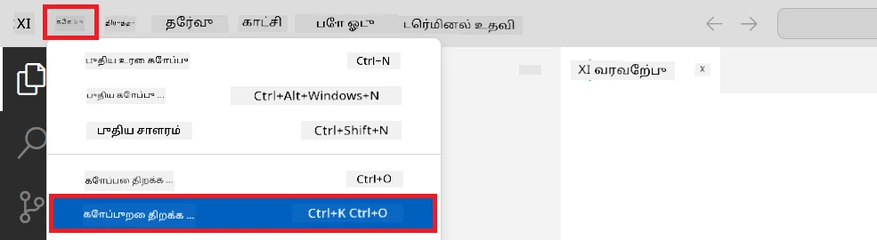

1. Visual Studio Code இன் இடது பக்க பகுதியின் மேலில் ரைட் கிளிக் செய்து **New File** ஐ தேர்ந்தெடுத்து *download_dataset.py* என்ற புதிய கோப்பை உருவாக்கவும்.

    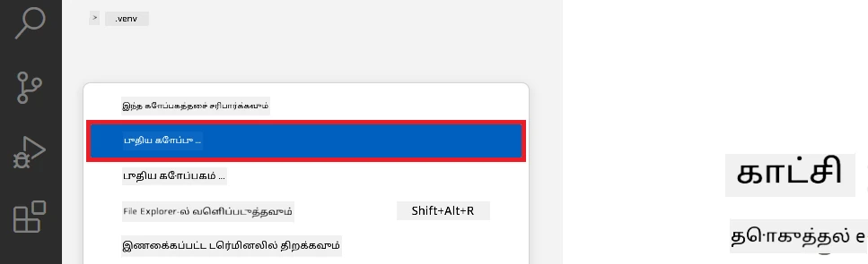

### Fine-tuning க்கு dataset ஐத் தயாரிக்கவும்

இந்த பயிற்சியில், நீங்கள் *download_dataset.py* கோப்பை இயக்கி *ultrachat_200k* datasets ஐ உங்கள் உள்ளக சுற்றுப்புறத்துக்கு பதிவிறக்கம் செய்வீர்கள். பின்னர், Azure Machine Learning இல் Phi-3 மாதிரியை fine-tune செய்வீர்கள்.

இந்த பயிற்சியில், நீங்கள்:

- *download_dataset.py* கோப்பில் datasets பதிவிறக்கும் குறியீட்டை சேர்ப்பீர்கள்.
- *download_dataset.py* கோப்பை இயக்கி datasets-ஐ உங்கள் உள்ளக சுற்றுப்புறத்தில் பதிவிறக்கம் செய்வீர்கள்.

#### *download_dataset.py* மூலம் உங்கள் dataset ஐ பதிவிறக்கவும்

1. Visual Studio Code இல் *download_dataset.py* கோப்பை திறக்கவும்.

1. *download_dataset.py* கோப்பில் பின்வரும் குறியீட்டை சேர்க்கவும்.

    ```python
    import json
    import os
    from datasets import load_dataset

    def load_and_split_dataset(dataset_name, config_name, split_ratio):
        """
        Load and split a dataset.
        """
        # குறிப்பிட்ட பெயர், கட்டமைப்பு மற்றும் பிளிட் விகிதத்துடன் தரவுக் கட்டமைப்பை ஏற்றி கொள்வது
        dataset = load_dataset(dataset_name, config_name, split=split_ratio)
        print(f"Original dataset size: {len(dataset)}")
        
        # தரவுக் கட்டமைப்பை பயிற்சி மற்றும் சோதனை தொகுதிகளாகப் பிரித்தல் (80% பயிற்சி, 20% சோதனை)
        split_dataset = dataset.train_test_split(test_size=0.2)
        print(f"Train dataset size: {len(split_dataset['train'])}")
        print(f"Test dataset size: {len(split_dataset['test'])}")
        
        return split_dataset

    def save_dataset_to_jsonl(dataset, filepath):
        """
        Save a dataset to a JSONL file.
        """
        # இல்லை என்றால் கோப்புறையை உருவாக்கு
        os.makedirs(os.path.dirname(filepath), exist_ok=True)
        
        # கோப்பை எழுதும் முறையில் திறக்கவும்
        with open(filepath, 'w', encoding='utf-8') as f:
            # தரவுக் கட்டமைப்பில் உள்ள ஒவ்வொரு பதிவையும் மீளுருவாகச் செயற்படுத்து
            for record in dataset:
                # பதிவை JSON பொருளாக மாற்றி கோப்பில் எழுதுக
                json.dump(record, f)
                # பதிவுக்களை பிரிக்கும் வசதி ஆக புதிய வரி எழுத்தை எழுதுக
                f.write('\n')
        
        print(f"Dataset saved to {filepath}")

    def main():
        """
        Main function to load, split, and save the dataset.
        """
        # குறிப்பிட்ட கட்டமைப்பு மற்றும் பிளிட் விகிதத்துடன் ULTRACHAT_200k தரவுக் கட்டமைப்பை ஏற்று பிரி
        dataset = load_and_split_dataset("HuggingFaceH4/ultrachat_200k", 'default', 'train_sft[:1%]')
        
        # பிரிப்பிலிருந்து பயிற்சி மற்றும் சோதனை தரவுக் கட்டமைப்புகளை எடு
        train_dataset = dataset['train']
        test_dataset = dataset['test']

        # பயிற்சி தரவுக் கட்டமைப்பை JSONL கோப்பாக சேமி
        save_dataset_to_jsonl(train_dataset, "data/train_data.jsonl")
        
        # சோதனை தரவுக் கட்டமைப்பை தனித்த JSONL கோப்பாக சேமி
        save_dataset_to_jsonl(test_dataset, "data/test_data.jsonl")

    if __name__ == "__main__":
        main()

    ```

1. ஸ்கிரிப்டை இயக்கி dataset ஐ உங்கள் உள்ளக சுற்றுப்புறத்தில் பதிவிறக்கம் செய்ய, உங்கள் டெர்மினலில் பின்வரும் கட்டளையை டைப் செய்யவும்.

    ```console
    python download_dataset.py
    ```

1. datasets வெற்றிகரமாக உங்கள் உள்ளக *finetune-phi/data* கோப்புறையில் சேமிக்கப்பட்டுள்ளது என்பதை சரிபார்க்கவும்.

> [!NOTE]
>
> #### dataset அளவு மற்றும் fine-tuning நேரம் குறித்த குறிப்பு
>
> இந்த பயிற்சியில், dataset இன் 1% (`split='train[:1%]'`) மட்டுமே பயன்படுத்துகிறீர்கள். இதனால் தரவின் அளவு குறைகிறது, பதிவேற்றும் மற்றும் fine-tuning செயல்முறைகளும் வேகமாக நடைபெறும். பயிற்சி நேரம் மற்றும் மாதிரி செயல்திறன் இடையேயான சமன்வயத்தை கண்டுபிடிக்க, இந்த சதவீதத்தை நீங்கள் மாற்றிக் கொள்ளலாம். dataset இன் சிறிய பகுதி பயன்படுத்துவதால் fine-tuning நேரம் குறைகிறது, இது பயிற்சிக்கு எளிதானது ஆகும்.

## காட்சித் தொகுதி 2: Phi-3 மாதிரியை fine-tune செய்து Azure Machine Learning Studio இல் பதவிடுக

### Phi-3 மாதிரியை fine-tune செய்தல்

இந்த பயிற்சியில், Azure Machine Learning Studio இல் Phi-3 மாதிரியை fine-tune செய்வீர்கள்.

இந்த பயிற்சியில், நீங்கள்:

- fine-tuning க்கான கணினி கிளஸ்டரை உருவாக்கவும்.
- Azure Machine Learning Studio இல் Phi-3 மாதிரியை fine-tune செய்யவும்.

#### fine-tuning க்கான கணினி கிளஸ்டரை உருவாக்கவும்

1. [Azure ML Studio](https://ml.azure.com/home?wt.mc_id=studentamb_279723) ஐ பார்வையிடவும்.

1. இடது பக்கம் உள்ள டேபில் இருந்து **Compute** ஐ தேர்ந்தெடுக்கவும்.

1. நெவி கேஷன் மெனுவில் இருந்து **Compute clusters** ஐ தேர்ந்தெடுக்கவும்.

1. **+ New** ஐ கிளிக் செய்யவும்.

    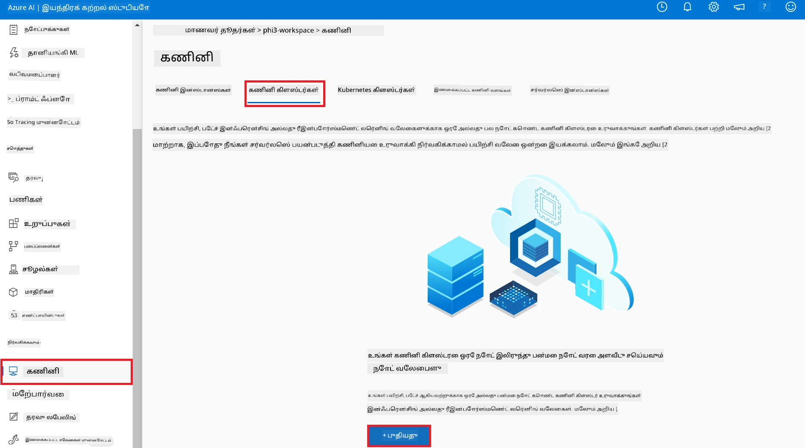

1. பின்வரும் பணிகளைச் செய்யவும்:

    - நீங்கள் விரும்பும் **Region** ஐ தேர்ந்தெடுக்கவும்.
    - **Virtual machine tier** ஐ **Dedicated** ஆக தேர்ந்தெடுக்கவும்.
    - **Virtual machine type** ஐ **GPU** ஆக தேர்ந்தெடுக்கவும்.
    - **Virtual machine size** னை **Select from all options** என நிர்வாகிக் கொள்ளவும்.
    - **Virtual machine size** ஐ **Standard_NC24ads_A100_v4** எனத் தேர்ந்தெடுக்கவும்.

    

1. **Next** ஐ கிளிக் செய்யவும்.

1. பின்வரும் பணிகளைச் செய்யவும்:

    - **Compute name** ஐ உள்ளிடவும். இது தனித்துவமான மதிப்பு இருக்க வேண்டும்.
    - **Minimum number of nodes** ஐ **0** ஆக தேர்ந்தெடுக்கவும்.
    - **Maximum number of nodes** ஐ **1** ஆக தேர்ந்தெடுக்கவும்.
    - **Idle seconds before scale down** ஐ **120** என அமைக்கவும்.

    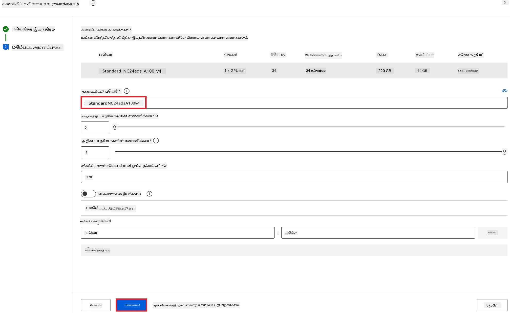

1. **Create** ஐ கிளிக் செய்யவும்.

#### Phi-3 மாதிரியை fine-tune செய்தல்

1. [Azure ML Studio](https://ml.azure.com/home?wt.mc_id=studentamb_279723) ஐ பார்வையிடவும்.

1. நீங்கள் உருவாக்கிய Azure Machine Learning வேலைப்பாங்கைத் தேர்ந்தெடுக்கவும்.

    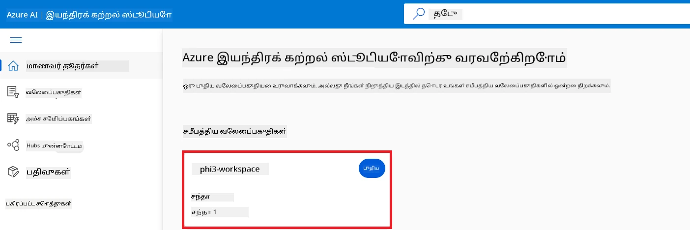

1. பின்வரும் பணிகளைச் செய்யவும்:

    - இடது பக்க டேபில் இருந்து **Model catalog** ஐ தேர்ந்தெடுக்கவும்.
    - **search bar** இல் *phi-3-mini-4k* எனத் தட்டச்சு செய்து தோன்றும் விருப்பங்களில் இருந்து **Phi-3-mini-4k-instruct** ஐ தேர்ந்தெடுக்கவும்.

    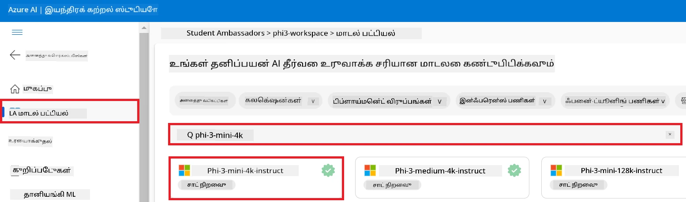

1. நெவி கேஷன் மெனுவில் இருந்து **Fine-tune** ஐ தேர்ந்தெடுக்கவும்.

    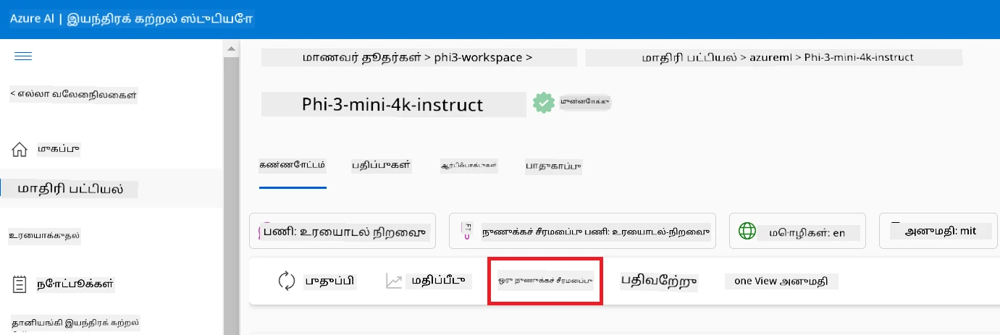

1. பின்வரும் பணிகளைச் செய்யவும்:

    - **Select task type** ஐ **Chat completion** ஆகத் தேர்ந்தெடுக்கவும்.
    - **+ Select data** என்பதை கிளிக் செய்து **Training data** ஐப் பதிவேற்றவும்.
    - Validation data upload வகையை **Provide different validation data** ஆக மாற்றவும்.
    - **+ Select data** ஐ அழுத்தி **Validation data** ஐ பதிவேற்றவும்.

    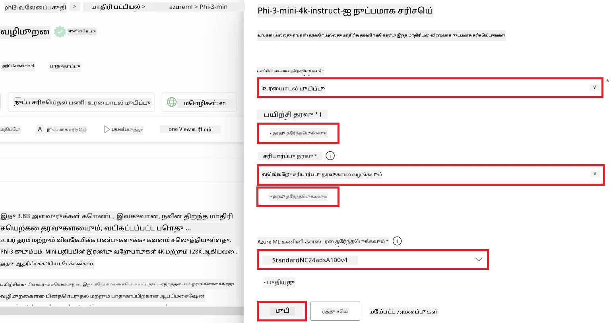

> [!TIP]
>
> சிறந்த fine-tuning க்கான அமைப்புகளை தனிப்பயனாக்க **Advanced settings** ஐ தேர்ந்தெடுத்து **learning_rate**, **lr_scheduler_type** போன்றவற்றை மாற்றலாம்.

1. **Finish** ஐ கிளிக் செய்யவும்.

1. இந்த பயிற்சியில், Azure Machine Learning இல் நீங்கள் வெற்றிகரமாக Phi-3 மாதிரியை fine-tune செய்துள்ளீர்கள். fine-tuning செயல்முறை சில நேரம் எடுக்கலாம். fine-tuning வேலை ஓடுவதற்குப் பிறகு, அது முடிவதைக் காத்திருக்க வேண்டும். Azure Machine Learning வேலைப்பாங்கின் இடது பக்கத்தில் உள்ள Jobs டேபைச் செல்லவும் fine-tuning வேலை நிலையில் இருக்கிறதா என்று பார்க்கலாம். அடுத்த தொடரில், fine-tuned மாதிரியை பதவிடுவீர்கள் மற்றும் அதை Prompt flow உடனான ஒருங்கிணைப்பை செய்யப் போகிறீர்கள்.

    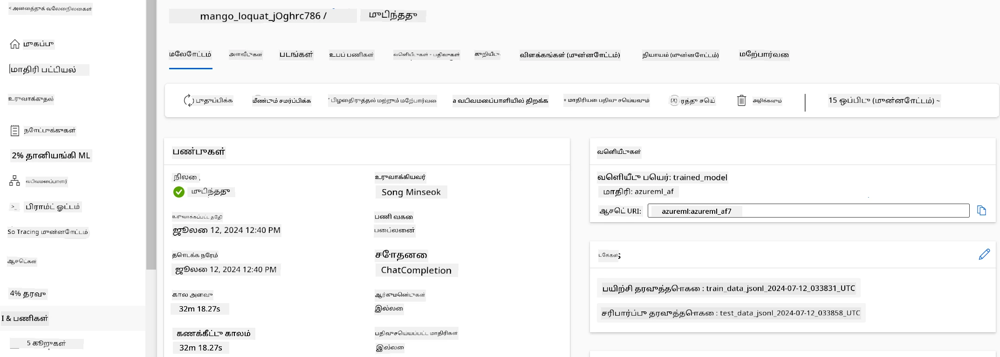

### fine-tuned Phi-3 மாதிரியை பதவிடுதல்

fine-tuned Phi-3 மாதிரியை Prompt flow உடனான ஒருங்கிணைப்புக்கு, அந்நிய நேர்வழி கணிப்புக்கு அந்த மாதிரியைச் செயலாக்கக் கட்டாயம் உள்ளது. இதற்காக, மாதிரியை பதிவு செய்தல், ஆன்லைன் இறுதிச்சுட்டி உருவாக்குதல் மற்றும் மாதிரியை பதவிடுதல் போன்றவை செய்யப்படுகின்றன.

இந்த பயிற்சியில், நீங்கள்:

- Azure Machine Learning வேலைப்பாங்கில் fine-tuned மாதிரியை பதிவு செய்வீர்கள்.
- ஒரு ஆன்லைன் இறுதிச்சுட்டியை உருவாக்குவீர்கள்.
- பதிவு செய்யப்பட்ட fine-tuned Phi-3 மாதிரியை பதவிடுவீர்கள்.

#### fine-tuned மாதிரியை பதிவு செய்தல்

1. [Azure ML Studio](https://ml.azure.com/home?wt.mc_id=studentamb_279723) ஐ பார்வையிடவும்.

1. நீங்கள் உருவாக்கிய Azure Machine Learning வேலைப்பாங்கைத் தேர்ந்தெடுக்கவும்.

    

1. இடது பக்க டேபில் இருந்து **Models** ஐ தேர்ந்தெடுக்கவும்.
1. **+ Register** ஐ தேர்ந்தெடுக்கவும்.
1. **From a job output** ஐ தேர்ந்தெடுக்கவும்.

    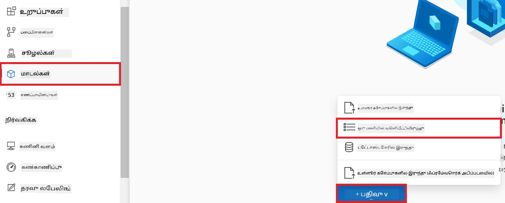

1. நீங்கள் உருவாக்கிய வேலைத்திட்டத்தை தேர்ந்தெடுக்கவும்.

    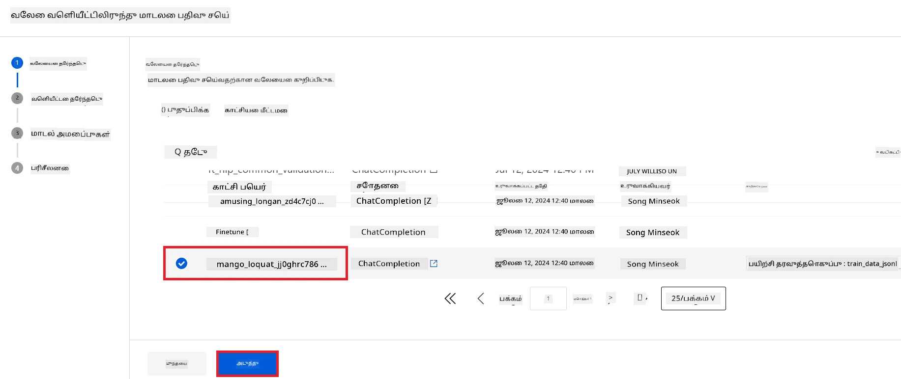

1. **Next** ஐ தேர்ந்தெடுக்கவும்.

1. **Model type** ஐ **MLflow** ஆகத் தேர்ந்தெடுக்கவும்.

1. **Job output** தேர்ந்தெடுக்கப்பட்டிருப்பதை உறுதி செய்யவும்; இது தானாக தேர்ந்தெடுக்கப்படும்.

    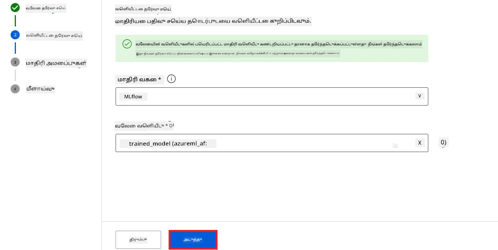

2. **Next** ஐத் தேர்ந்தெடுக்கவும்.

3. **Register** ஐ கிளிக் செய்யவும்.

    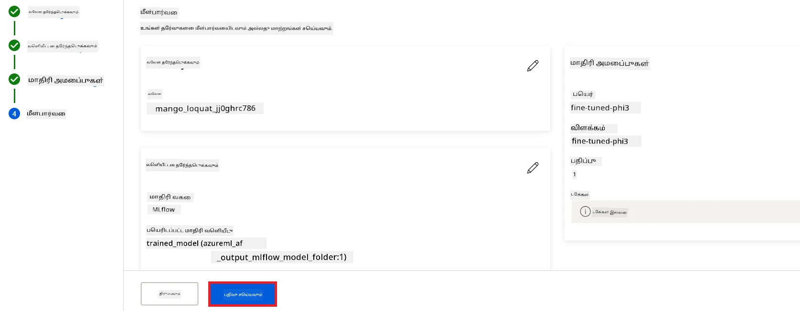

4. இடது பக்க டேபிலிருந்து **Models** மெனுவுக்குச் சென்று உங்கள் பதிவு செய்த மாதிரியைப் பார்க்கலாம்.

    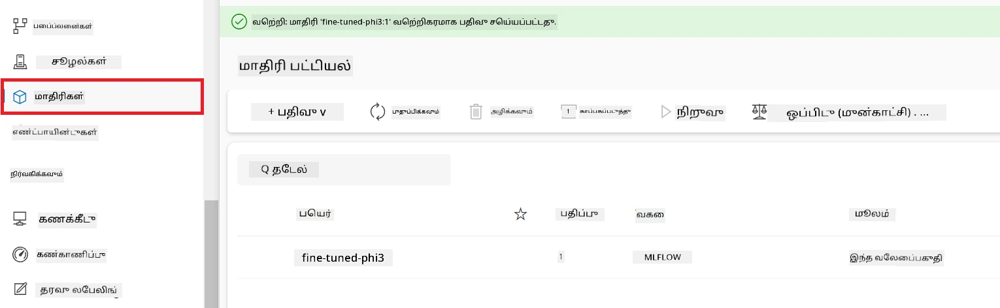

#### fine-tuned மாதிரியை பதவிடுதல்

1. நீங்கள் உருவாக்கிய Azure Machine Learning வேலைப்பாங்கைத் திறக்கவும்.

1. இடது பக்கம் உள்ள டேபிலிருந்து **Endpoints** ஐ தேர்ந்தெடுக்கவும்.

1. நெவி கேஷன் மெனுவில் இருந்து **Real-time endpoints** ஐ தேர்ந்தெடுக்கவும்.

    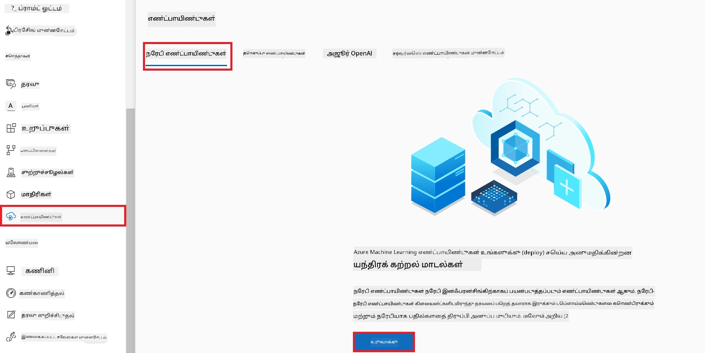

1. **Create** ஐ கிளிக் செய்யவும்.

1. நீங்கள் பதிவு செய்த மாதிரியைத் தேர்ந்தெடுக்கவும்.

    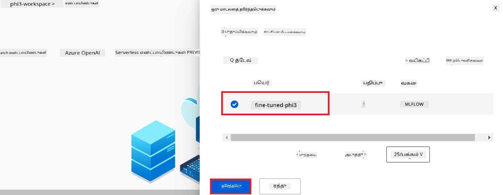

1. **Select** ஐ அழுத்தவும்.

1. பின்வரும் பணிகளைச் செய்யவும்:

    - **Virtual machine** ஐ *Standard_NC6s_v3* ஆக தேர்ந்தெடுக்கவும்.
    - நீங்கள் பயன்படுத்த விரும்பும் **Instance count** ஐ தேர்ந்தெடுக்கவும். உதாரணமாக, *1*.
    - **Endpoint** ஐ **New** என தேர்ந்தெடுத்து ஒரு புதிய இறுதிச்சுட்டி உருவாக்கவும்.
    - **Endpoint name** ஐ உள்ளிடவும். இது தனித்துவமான பெயர் ஆக வேண்டும்.
    - **Deployment name** ஐ உள்ளிடவும். இது தனித்துவமான பெயர் ஆக வேண்டும்.

    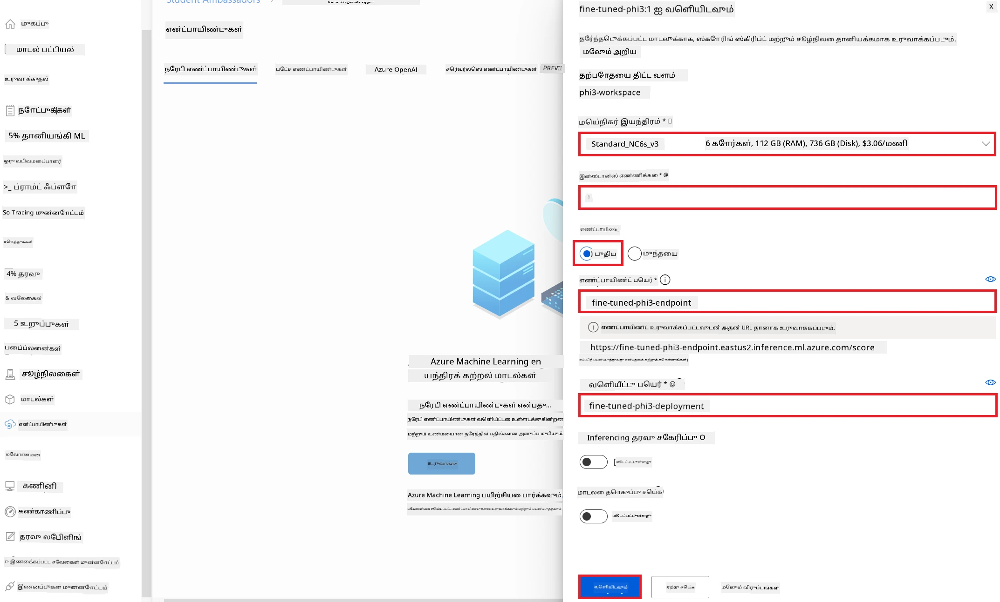

1. **Deploy** ஐ கிளிக் செய்யவும்.

> [!WARNING]
> உங்கள் கணக்குக்குக் கூடுதல் கட்டணங்கள் வராது என உறுதி செய்ய, Azure Machine Learning வேலைப்பாங்கில் உருவாக்கிய இறுதிச்சுட்டியை நீக்க வேண்டும்.
>

#### Azure Machine Learning வேலைப்பாங்கில் deployment நிலையைச் சரிபார்க்கவும்

1. நீங்கள் உருவாக்கிய Azure Machine Learning வேலைப்பாங்கைத் திறக்கவும்.

1. இடது பக்கம் உள்ள டேபிலிருந்து **Endpoints** ஐத் தேர்ந்தெடுக்கவும்.

1. நீங்கள் உருவாக்கிய இறுதிச்சுட்டியை தேர்ந்தெடுக்கவும்.

    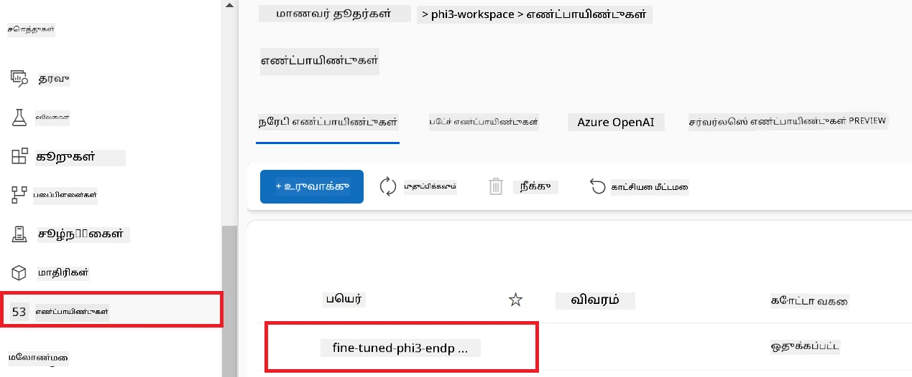

1. இந்தப் பக்கத்தில், deployment செயல்முறையின் போது இறுதிச்சுட்டிகளை நிர்வகிக்கலாம்.

> [!NOTE]
> ஒருமுறை deployment முடிந்ததும், **Live traffic** **100%** ஆக அமைக்கப்பட்டிருப்பதை உறுதி செய்யவும். இல்லையெனில், **Update traffic** ஐ தேர்ந்தெடுத்து போக்குவரத்து அமைப்புகளை மாற்றவும். போக்குவரத்து 0% இருந்தால், மாதிரியை சோதிக்க முடியாது.
>
> 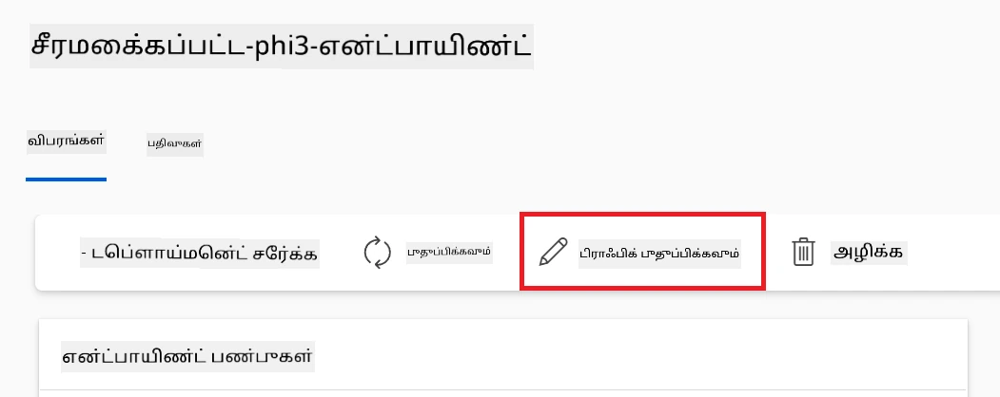
>

## காட்சித் தொகுதி 3: Prompt flow உடனான ஒருங்கிணைப்பு மற்றும் Azure AI Foundry இல் உங்கள் தனிப்பயன் மாதிரியுடன் உரையாடல்

### Prompt flow உடன் தனிப்பயன் Phi-3 மாதிரியை ஒருங்கிணைத்தல்

வெற்றிகரமாக fine-tuned மாதிரியை பதவிடப்பட்ட பிறகு, உங்கள் மாதிரியை Prompt Flow உடன் ஒருங்கிணைத்து நேரடி பயன்பாடுகளில் பயன்படுத்தலாம், இது வகைமிக்க கலந்துரையாடல் மற்றும் செயல்களைச் செயல்படுத்த உதவும்.

இந்த பயிற்சியில், நீங்கள்:

- Azure AI Foundry Hub ஐ உருவாக்குவீர்கள்.
- Azure AI Foundry Project ஐ உருவாக்குவீர்கள்.
- Prompt flow ஐ உருவாக்குவீர்கள்.
- fine-tuned Phi-3 மாதிரிக்கு தனிப்பயன் இணைப்பைச் சேர்ப்பீர்கள்.
- உங்கள் தனிப்பயன் Phi-3 மாதிரியுடன் உரையாட Prompt flow ஐ அமைக்கவும்.

> [!NOTE]
> Azure ML Studio பயன்படுத்தி Promptflow உடன் ஒருங்கிணைக்கலாம். அதே ஒருங்கிணைப்பு செயல்முறை Azure ML Studio க்கும் பொருந்தும்.

#### Azure AI Foundry Hub ஐ உருவாக்கவும்

Project உருவாக்குவதற்கு முன் Hub ஒன்றை உருவாக்க வேண்டும். Hub என்பது Resource Group போல செயல்பட்டு, Azure AI Foundry கீழ் பல Projects ஐ ஒருங்கிணைக்க மற்றும் நிர்வகிக்க உதவும்.

1. [Azure AI Foundry](https://ai.azure.com/?WT.mc_id=aiml-137032-kinfeylo) ஐ பார்வையிடவும்.

1. இடது பக்க டேபில் இருந்து **All hubs** ஐ தேர்ந்தெடுக்கவும்.

1. நெவி கேஷன் மெனுவில் இருந்து **+ New hub** ஐ தேர்ந்தெடுக்கவும்.
    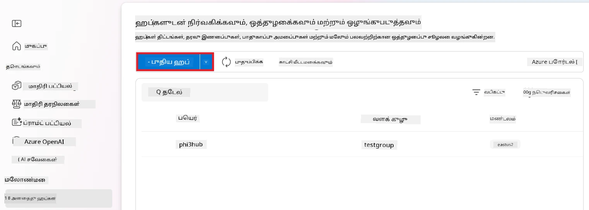

1. பின்வரும் பணிகளை செய்யவும்:

    - **ஹப் பெயர்** ஐ உள்ளிடவும். அது ஒரு தனிச்சிறப்பான மதிப்பு ஆக இருக்க வேண்டும்.
    - உங்கள் Azure **சந்தா** (Subscription) ஐத் தேர்ந்தெடுக்கவும்.
    - பயன்படுத்த வேண்டிய **வள குழு** (Resource group) ஐத் தேர்ந்தெடுக்கவும் (தேவைப்பட்டால் புதியதொரு ஒன்றை உருவாக்கவும்).
    - நீங்கள் பயன்படுத்த விரும்பும் **இடம்** (Location) ஐத் தேர்ந்தெடுக்கவும்.
    - பயன்படுத்த வேண்டிய **Azure AI சேவைகளை இணைக்கவும்** (Connect Azure AI Services) (தேவைப்பட்டால் புதியதொரு ஒன்றை உருவாக்கவும்) தேர்ந்தெடுக்கவும்.
    - **Azure AI தேடலை இணைக்கவும்** (Connect Azure AI Search) என்பதை **இணைப்பை தவிர்** (Skip connecting) என்று தேர்ந்தெடுக்கவும்.

    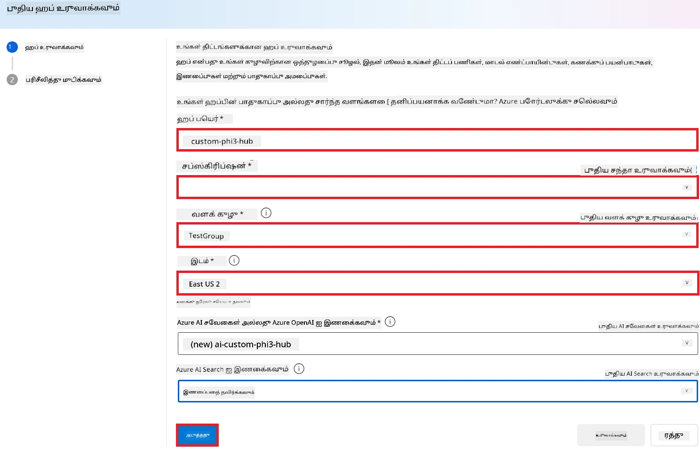

1. **எடுத்துக்கொடு** (Next) என்பதை தேர்ந்தெடுக்கவும்.

#### Azure AI Foundry திட்டத்தை உருவாக்கவும்

1. நீங்கள் உருவாக்கிய ஹப்பில், இடதுபக்கம் உள்ள தாவலில் இருந்து **அனைத்து திட்டங்களும்** (All projects) தேர்ந்தெடுக்கவும்.

1. வழிசெலுத்தல் மெனுவில் இருந்து **+ புதிய திட்டம்** (+ New project) ஐ தேர்வு செய்யவும்.

    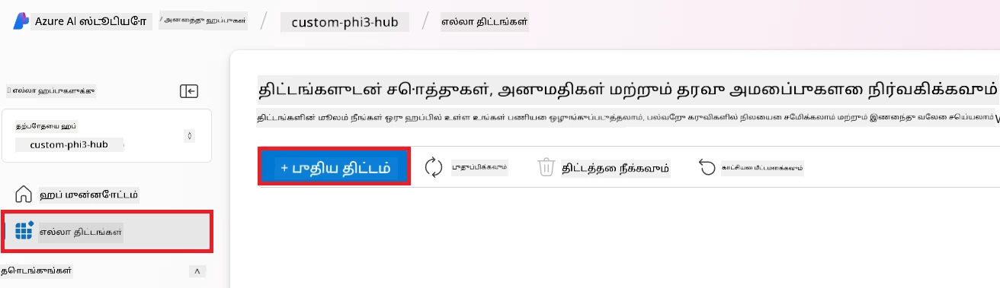

1. **திட்டப் பெயர்** (Project name) ஐ உள்ளிடவும். அது ஒரு தனிச்சிறப்பான மதிப்பு ஆக இருக்க வேண்டும்.

    

1. **திட்டத்தை உருவாக்கவும்** (Create a project) என்பதை தேர்ந்தெடுக்கவும்.

#### சிறிது பயிற்சி பெற்ற Phi-3 மாதிரிக்கு தனிப்பயன் தொடர்பை சேர்க்கவும்

உங்கள் தனிப்பயன் Phi-3 மாதிரியை Prompt flow உடன் இணைக்க, மாதிரியின் முனை மற்றும் முக்கியத்துவம்(custom connection) தொடர்பில் சேமிக்க வேண்டும். இது Prompt flow இல் உங்கள் தனிப்பயன் Phi-3 மாதிரியை அணுகுவதை உறுதி செய்யும்.

#### சிறிது பயிற்சி பெற்ற Phi-3 மாதிரியின் api விசை மற்றும் முனை உரியை அமைக்கவும்

1. [Azure ML Studio](https://ml.azure.com/home?WT.mc_id=aiml-137032-kinfeylo) ஐ பார்வையிடவும்.

1. நீங்கள் உருவாக்கிய Azure இயந்திர கற்றல் பணியிடத்திற்கு செல்லவும்.

1. இடதுபக்கம் உள்ள தாவலில் இருந்து **முனைகள்** (Endpoints) ஐத் தேர்ந்தெடுக்கவும்.

    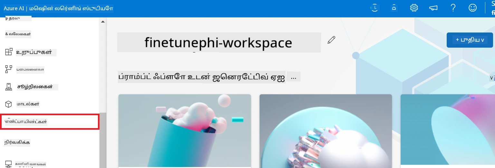

1. நீங்கள் உருவாக்கிய முனையைத் தேர்ந்தெடுக்கவும்.

    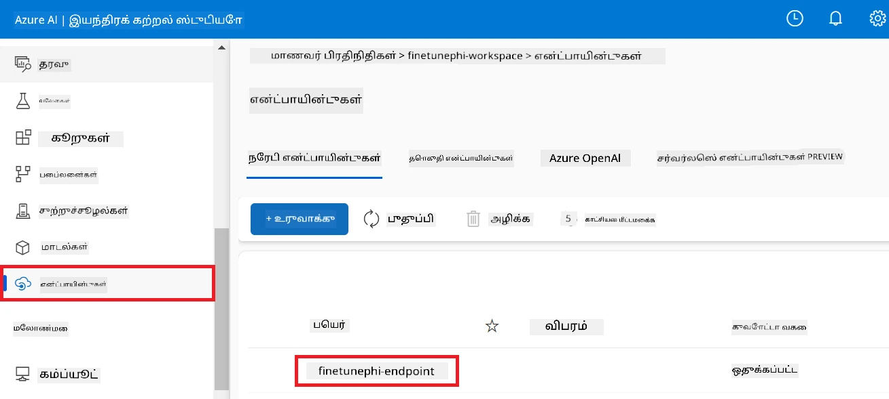

1. வழிசெலுத்தல் மெனுவில் இருந்து **புகுக** (Consume) என்பதை தெரிவுசெய்க.

1. உங்கள் **REST முனை** மற்றும் **முதன்மை விசை** ஐ நகல் செய்யவும்.

    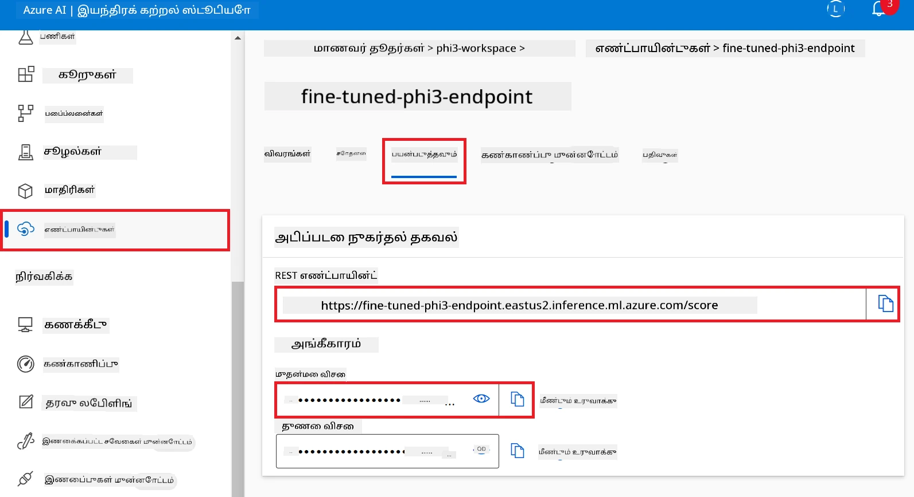

#### தனிப்பயன் தொடர்பைச் சேர்க்கவும்

1. [Azure AI Foundry](https://ai.azure.com/?WT.mc_id=aiml-137032-kinfeylo) ஐ பார்வையிடவும்.

1. நீங்கள் உருவாக்கிய Azure AI Foundry திட்டத்திற்கு செல்லவும்.

1. நீங்கள் உருவாக்கிய திட்டத்தில், இடதுபக்கம் தாவலில் இருந்து **அமைப்புகள்** (Settings) ஐத் தேர்ந்தெடுக்கவும்.

1. **+ புதிய தொடர்பு** (+ New connection) ஐ தேர்ந்தெடுக்கவும்.

    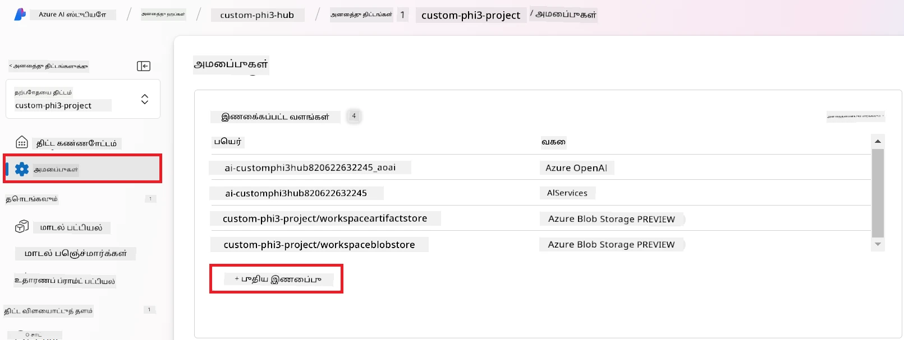

1. வழிசெலுத்தல் மெனுவில் இருந்து **தனிப்பயன் விசைகள்** (Custom keys) ஐத் தேர்ந்தெடுக்கவும்.

    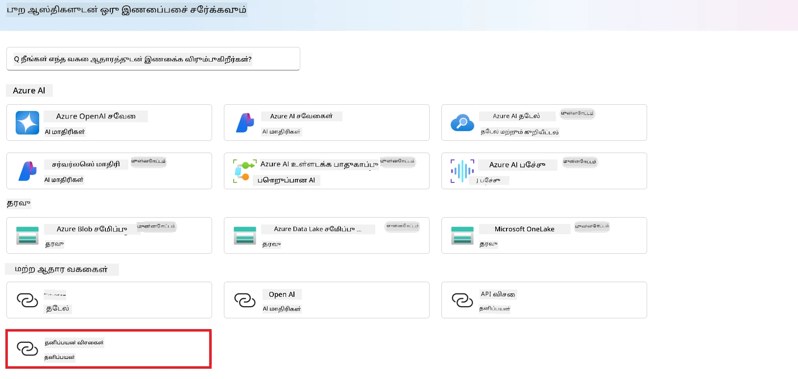

1. பின்வரும் பணிகளை செய்யவும்:

    - **+ விசை மதிப்பு ஜோடிகளைச் சேர்க்கவும்** (+ Add key value pairs) ஐத் தேர்ந்தெடுக்கவும்.
    - விசை பெயருக்கு **endpoint** என்று உள்ளிடவும், Azure ML ஸ்டூடியோவில் இருந்து நகல் செய்த முனையை மதிப்பு புலத்தில் ஒட்டவும்.
    - மீண்டும் **+ விசை மதிப்பு ஜோடிகளைச் சேர்க்கவும்** என்பதைத் தேர்ந்தெடுக்கவும்.
    - விசை பெயருக்கு **key** என்று உள்ளிடவும், Azure ML ஸ்டூடியோவில் இருந்து நகல் செய்த விசையை மதிப்பு புலத்தில் ஒட்டவும்.
    - விசைகள் சேர்த்தபின், விசையை வெளிப்படாமல் காக்க **is secret** ஐ தேர்ந்தெடுக்கவும்.

    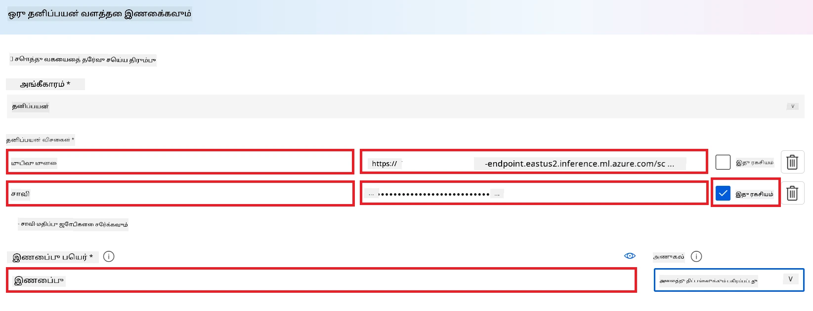

1. **தொடர்பைச் சேர்க்கவும்** (Add connection) என்பதைத் தேர்ந்தெடுக்கவும்.

#### Prompt flow ஐ உருவாக்கவும்

நீங்கள் Azure AI Foundry இல் தனிப்பயன் தொடர்பைச் சேர்த்துள்ளீர்கள். இப்பொழுது, பின்வரும் படிகளைப் பயன்படுத்தி Prompt flow ஐ உருவாக்குவோம். அதன் பிறகு, இந்த Prompt flow ஐ தனிப்பயன் தொடர்புடன் இணைத்து, சிறிது பயிற்சி பெற்ற மாதிரியை Prompt flow இல் பயன்படுத்தலாம்.

1. நீங்கள் உருவாக்கிய Azure AI Foundry திட்டத்திற்கு செல்லவும்.

1. இடதுபக்கம் உள்ள தாவலில் இருந்து **Prompt flow** ஐத் தேர்ந்தெடுக்கவும்.

1. வழிசெலுத்தல் மெனுவில் இருந்து **+ உருவாக்கு** (+ Create) ஐ தேர்ந்தெடுக்கவும்.

    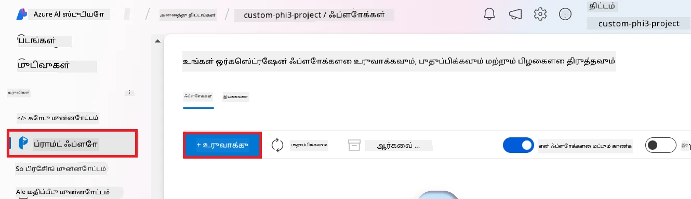

1. வழிசெலுத்தல் மெனுவில் இருந்து **சேட் ஓடு** (Chat flow) ஐத் தேர்ந்தெடுக்கவும்.

    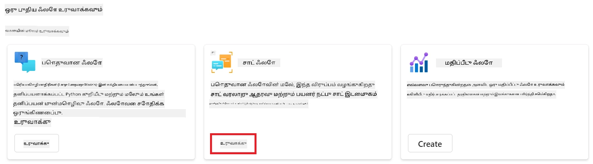

1. பயன்படுத்தவேண்டிய **கோப்புறை பெயர்** (Folder name) ஐ உள்ளிடவும்.

    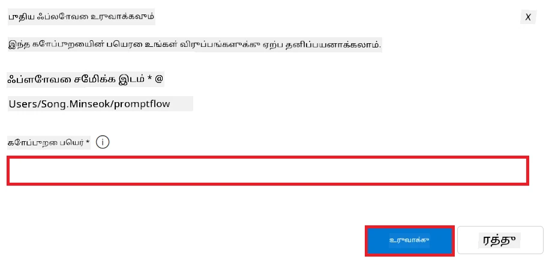

2. **உருவாக்கு** (Create) ஐத் தேர்ந்தெடுக்கவும்.

#### உங்கள் தனிப்பயன் Phi-3 மாதிரியுடன் Prompt flow ஐ சேட் செய்வது

சிறிது பயிற்சி பெற்ற Phi-3 மாதிரியை Prompt flow இல் இணைக்க வேண்டும். இருந்தாலும், தற்போதைய Prompt flow இதற்காக வடிவமைக்கப்படவில்லை. ஆகவே, Prompt flow ஐ மீண்டும் வடிவமைக்க, உங்கள் தனிப்பயன் மாதிரியை இணைக்க விரும்பியதே இதன் நோக்கம்.

1. Prompt flow இல், தற்போதைய ஓட்டத்தை மறுவடிவமைக்க பின்வரும் பணிகளை செய்யவும்:

    - **Raw கோப்பு முறை** (Raw file mode) ஐ தேர்ந்தெடுக்கவும்.
    - *flow.dag.yml* கோப்பில் உள்ள அனைத்து உள்ளடக்கங்களையும் நீக்கவும்.
    - கீழ்க்காணும் குறியீட்டை *flow.dag.yml* கோப்பில் சேர்க்கவும்.

        ```yml
        inputs:
          input_data:
            type: string
            default: "Who founded Microsoft?"

        outputs:
          answer:
            type: string
            reference: ${integrate_with_promptflow.output}

        nodes:
        - name: integrate_with_promptflow
          type: python
          source:
            type: code
            path: integrate_with_promptflow.py
          inputs:
            input_data: ${inputs.input_data}
        ```

    - **சேமி** (Save) என்பதைத் தேர்ந்தெடுக்கவும்.

    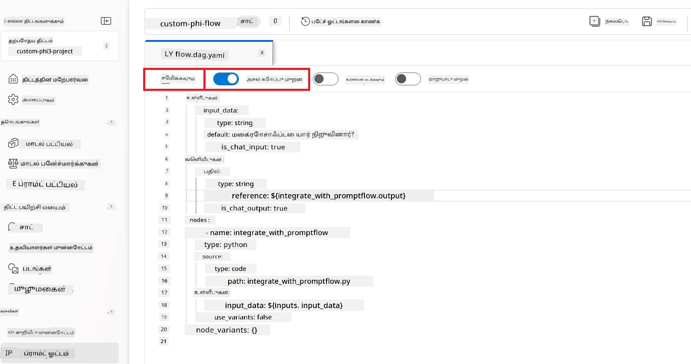

1. Prompt flow இல் உங்கள் தனிப்பயன் Phi-3 மாதிரியை பயன்படுத்த *integrate_with_promptflow.py* கோப்பில் கீழ்க்காணும் குறியீட்டைச் சேர்க்கவும்.

    ```python
    import logging
    import requests
    from promptflow import tool
    from promptflow.connections import CustomConnection

    # பதிவு அமைப்பு
    logging.basicConfig(
        format="%(asctime)s - %(levelname)s - %(name)s - %(message)s",
        datefmt="%Y-%m-%d %H:%M:%S",
        level=logging.DEBUG
    )
    logger = logging.getLogger(__name__)

    def query_phi3_model(input_data: str, connection: CustomConnection) -> str:
        """
        Send a request to the Phi-3 model endpoint with the given input data using Custom Connection.
        """

        # "connection" என்பது Custom Connection இன் பெயர், "endpoint", "key" என்பது Custom Connection இல் உள்ள விசைகள்
        endpoint_url = connection.endpoint
        api_key = connection.key

        headers = {
            "Content-Type": "application/json",
            "Authorization": f"Bearer {api_key}"
        }
        data = {
            "input_data": {
                "input_string": [
                    {"role": "user", "content": input_data}
                ],
                "parameters": {
                    "temperature": 0.7,
                    "max_new_tokens": 128
                }
            }
        }
        try:
            response = requests.post(endpoint_url, json=data, headers=headers)
            response.raise_for_status()
            
            # முழு JSON பதிலைக் பதிவு செய்க
            logger.debug(f"Full JSON response: {response.json()}")

            result = response.json()["output"]
            logger.info("Successfully received response from Azure ML Endpoint.")
            return result
        except requests.exceptions.RequestException as e:
            logger.error(f"Error querying Azure ML Endpoint: {e}")
            raise

    @tool
    def my_python_tool(input_data: str, connection: CustomConnection) -> str:
        """
        Tool function to process input data and query the Phi-3 model.
        """
        return query_phi3_model(input_data, connection)

    ```

    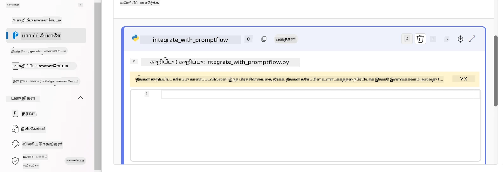

> [!NOTE]
> Azure AI Foundry இல் Prompt flow ஐ பயன்படுத்துவது பற்றிய விரிவான தகவலுக்கு [Azure AI Foundry இல் Prompt flow](https://learn.microsoft.com/azure/ai-studio/how-to/prompt-flow) ஐ பார்க்கலாம்.

1. உங்கள் மாதிரியுடன் உரையாட **சேட் உள்ளீடு** (Chat input), **சேட் வெளியீடு** (Chat output) ஐத் தேர்ந்தெடுக்கவும்.

    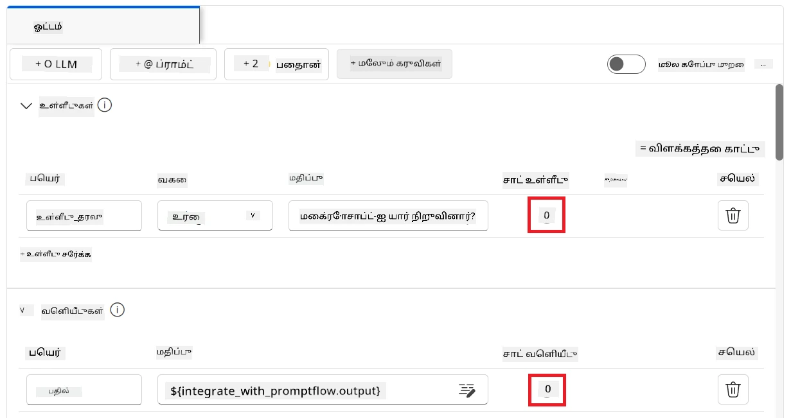

1. இப்போது உங்கள் தனிப்பயன் Phi-3 மாதிரியுடன் உரையாட தயாராக உள்ளீர்கள். அடுத்த பயிற்சியில், Prompt flow ஐத் துவக்கி, அதை உங்கள் சிறிது பயிற்சி பெற்ற Phi-3 மாதிரியைப் பயன்படுத்த உரையாடுவது எப்படி என்பதை கற்பீர்கள்.

> [!NOTE]
>
> மறுவடிவமைக்கப்பட்ட ஓட்டம் பின்வரும் படத்தை போல இருக்கும்:
>
> 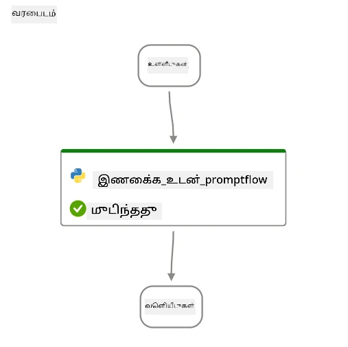
>

### உங்கள் தனிப்பயன் Phi-3 மாதிரியுடன் உரையாடவும்

இப்போது நீங்கள் சிறிது பயிற்சி பெற்ற உங்கள் தனிப்பயன் Phi-3 மாதிரியை Prompt flow உடன் இணைத்துள்ளீர்கள், அதனைப் பயன்படுத்த ஆரம்பிக்க தயாராக இருக்கின்றீர்கள். இந்த பயிற்சி, உங்கள் மாதிரியுடன் உரையாட Prompt flow ஐ அமைத்து தொடங்க வழிகாட்டும். இந்த படிகளை பின்பற்றுவதன் மூலம், சிறிது பயிற்சி பெற்ற Phi-3 மாதிரியின் திறன்களை முழுமையாக பயன்படுத்தி பல்வேறு பணிகள் மற்றும் உரையாடல்களுக்கு பயன்படுத்தலாம்.

- Prompt flow ஐப் பயன்படுத்தி உங்கள் தனிப்பயன் Phi-3 மாதிரியுடன் உரையாடவும்.

#### Prompt flow ஐ துவக்கவும்

1. Prompt flow ஐ துவக்க **கணக்கமிடும் அமர்வுகளை தொடங்கு** (Start compute sessions) என்பதைத் தேர்ந்தெடுக்கவும்.

    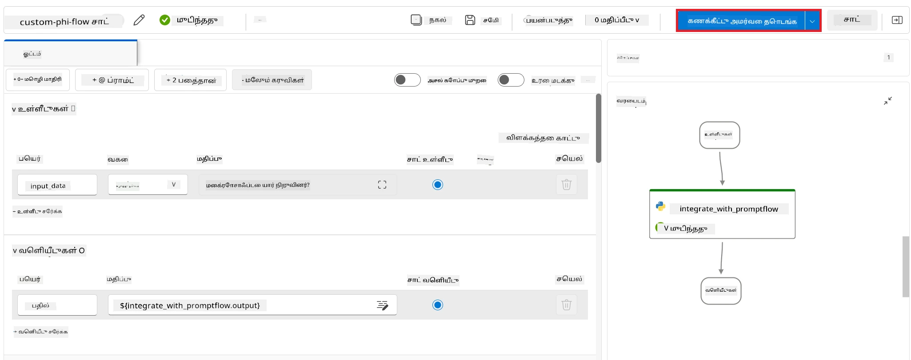

1. அளவுருக்களை புதுப்பிக்க **உள்ளீட்டை சரிபார்க்கவும் மற்றும் பகுப்பாய்வு செய்யவும்** (Validate and parse input) ஐத் தேர்ந்தெடுக்கவும்.

    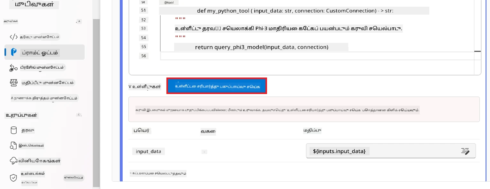

1. நீங்கள் உருவாக்கிய தனிப்பயன் தொடர்புக்கு **connection** இன் **விலை** (Value) ஐத் தேர்வு செய்யவும். உதாரணமாக, *connection*.

    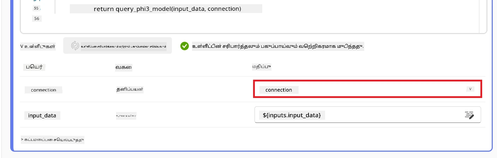

#### உங்கள் தனிப்பயன் மாதிரியுடன் உரையாடவும்

1. **உரையாடல்** (Chat) ஐத் தேர்ந்தெடுக்கவும்.

    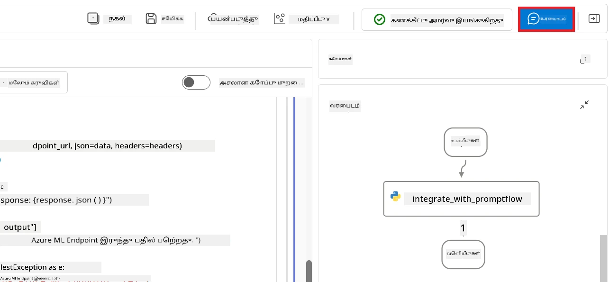

1. இதோ ஒரு முடிவுகளின் எடுத்துக்காட்டு: இப்போது நீங்கள் உங்கள் தனிப்பயன் Phi-3 மாதிரியுடன் உரையாடலாம். சிறிது பயிற்சிக்கான தரவின் அடிப்படையில் கேள்விகள் கேட்க பரிந்துரைக்கப்படுகிறது.

    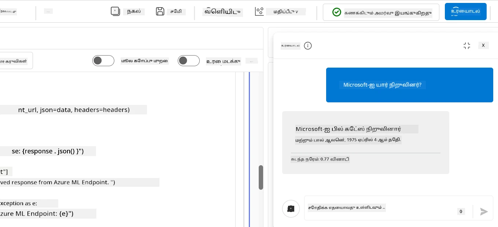

---

<!-- CO-OP TRANSLATOR DISCLAIMER START -->
**எச்சரிக்கை**:  
இந்த ஆவணம் [Co-op Translator](https://github.com/Azure/co-op-translator) என்ற க人工 நுண்ணறிவு மொழி பெயர்ப்பு சேவையைப் பயன்படுத்தி மொழி மாற்றப்பட்டுள்ளது. நாங்கள் துல்லியத்திற்காக முயன்றாலும், தானாகத் திருத்திய மொழிபெயர்ப்புகளில் தவறுகள் அல்லது பிழைகள் இருக்க வாய்ப்பு உள்ளது. ஏதாவது முக்கியமான தகவலுக்கு, மூல ஆவணம் அதன் சொந்த மொழியில் அதிகாரபூர்வ ஆதாரமாக கருதப்பட வேண்டும். முக்கியமான தகவலுக்கு, தொழில்நுட்பமான மனித மொழிபெயர்ப்பு பரிந்துரைக்கப்படுகிறது. இந்த மொழிபெயர்ப்பின் பயன்பாட்டால் ஏற்படும் எந்த தவறான புரிதல்களோ அல்லது தவறான அர்த்தக் கிளப்புகளோக்கு நாங்கள் பொறுப்பேற்கமாட்டோம்.
<!-- CO-OP TRANSLATOR DISCLAIMER END -->