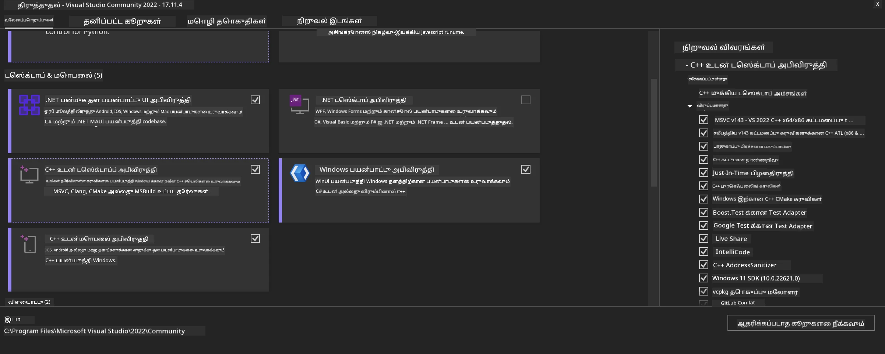
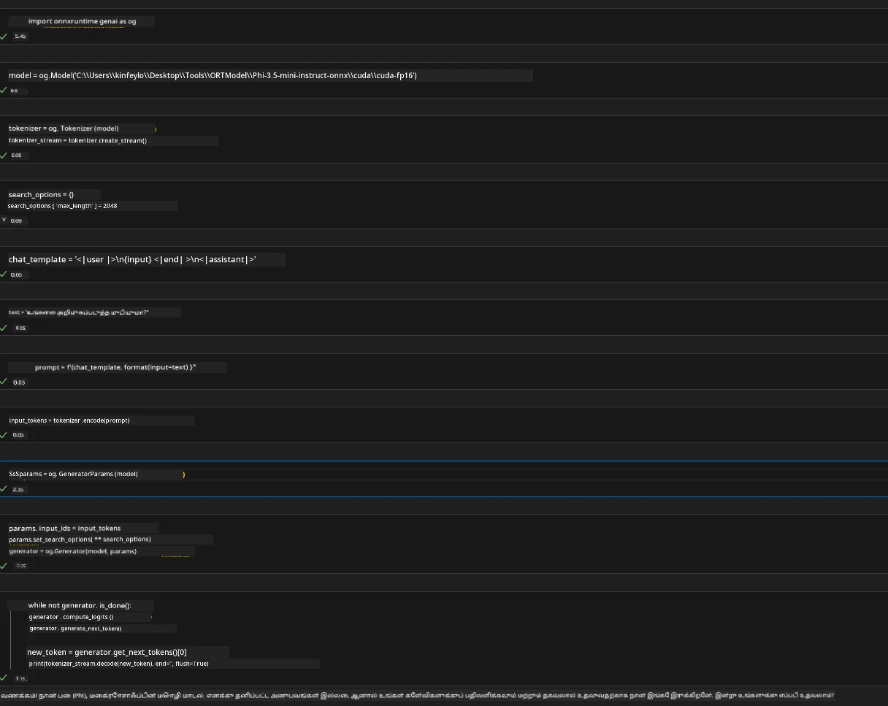
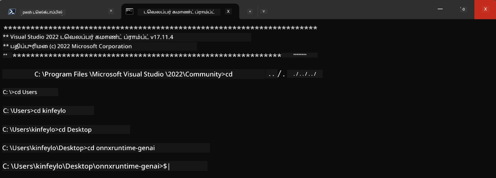

# **OnnxRuntime GenAI Windows GPUக்கான வழிகாட்டி**

இந்த வழிகாட்டி Windows இல் GPUகளுடன் ONNX Runtime (ORT) ஐ அமைப்பதற்கும் பயன்படுத்துவதற்குமான படிகளை வழங்குகிறது. உங்கள் மாதிரிகளுக்காக GPU விரைவு செயல்பாட்டை பயன்படுத்த உதவ இது உருவாக்கப்பட்டுள்ளது, செயல்திறன் மற்றும் திறமையை மேம்படுத்துகிறது.

ஆவணம் கீழ்காணும் வழிகாட்டுதலை வழங்குகிறது:

- சூழல் அமைப்பு: CUDA, cuDNN மற்றும் ONNX Runtime போன்ற தேவையான சாராம்சங்களை நிறுவுவதற்கான வழிமுறைகள்.
- கட்டமைப்பு: GPU வளங்களை பயனுள்ள முறையில் பயன்படுத்த சுற்றுச்சூழல் மற்றும் ONNX Runtime ஐ அமைப்பது எப்படி.
- மேம்பாட்டு குறிப்புகள்: சிறந்த செயல்திறனை பெறும் வகையில் GPU அமைப்புகளை நன்றாக ஒழுங்குபடுத்தும் ஆலோசனைகள்.

### **1. Python 3.10.x /3.11.8**

   ***குறிப்பு*** உங்கள் Python சூழல் மண்டலமாக [miniforge](https://github.com/conda-forge/miniforge/releases/latest/download/Miniforge3-Windows-x86_64.exe) ஐ பயன்படுத்த பரிந்துரைக்கப்படுகிறது

   ```bash

   conda create -n pydev python==3.11.8

   conda activate pydev

   ```

   ***நினைவூட்டல்*** Python இல் ONNX உட்பட வேறு எந்த நூலகங்களை நிறுவியிருந்தாலும் அவற்றை தயவுசெய்து விலக்கவும்

### **2. winget மூலம் CMake ஐ நிறுவவும்**


   ```bash

   winget install -e --id Kitware.CMake

   ```

### **3. Visual Studio 2022 - Desktop Development with C++ ஐ நிறுவவும்**

   ***குறிப்பு*** நீங்கள் தொகுக்க விரும்பவில்லை என்றால் இந்த படியை தவிர்க்கலாம்




### **4. NVIDIA டிரைவர் நிறுவவும்**

1. **NVIDIA GPU டிரைவர்**  [https://www.nvidia.com/en-us/drivers/](https://www.nvidia.com/en-us/drivers/)

2. **NVIDIA CUDA 12.4** [https://developer.nvidia.com/cuda-12-4-0-download-archive](https://developer.nvidia.com/cuda-12-4-0-download-archive)

3. **NVIDIA CUDNN 9.4**  [https://developer.nvidia.com/cudnn-downloads](https://developer.nvidia.com/cudnn-downloads)

***நினைவூட்டல்*** நிறுவும் போது இயல்புநிலை அமைப்புகளைப் பயன்படுத்தவும் 

### **5. NVIDIA சுற்றுச்சூழலை அமைக்கவும்**

NVIDIA CUDNN 9.4 இன் lib, bin, include கோப்புகளை NVIDIA CUDA 12.4 இன் lib, bin, includeக்கு நகலெடுக்கவும்

- *'C:\Program Files\NVIDIA\CUDNN\v9.4\bin\12.6'* கோப்புகளை *'C:\Program Files\NVIDIA GPU Computing Toolkit\CUDA\v12.4\bin'*க்கு நகலெடுக்கவும்

- *'C:\Program Files\NVIDIA\CUDNN\v9.4\include\12.6'* கோப்புகளை *'C:\Program Files\NVIDIA GPU Computing Toolkit\CUDA\v12.4\include'*க்கு நகலெடுக்கவும்

- *'C:\Program Files\NVIDIA\CUDNN\v9.4\lib\12.6'* கோப்புகளை *'C:\Program Files\NVIDIA GPU Computing Toolkit\CUDA\v12.4\lib\x64'*க்கு நகலெடுக்கவும்


### **6. Phi-3.5-mini-instruct-onnx ஐ பதிவிறக்கவும்**


   ```bash

   winget install -e --id Git.Git

   winget install -e --id GitHub.GitLFS

   git lfs install

   git clone https://huggingface.co/microsoft/Phi-3.5-mini-instruct-onnx

   ```

### **7. InferencePhi35Instruct.ipynb ஐ இயக்கவும்**

   [புத்தகக் குறிப்பு](../../../../code/09.UpdateSamples/Aug/ortgpu-phi35-instruct.ipynb) திறந்து அதை இயக்கு





### **8. ORT GenAI GPU ஐ தொகுக்கவும்**


   ***குறிப்பு*** 
   
   1. முதலில் onnx மற்றும் onnxruntime மற்றும் onnxruntime-genai உட்பட அனைத்து தொடர்புடையவற்றை அகற்று

   
   ```bash

   pip list 
   
   ```

   பிறகு அனைத்து onnxruntime நூலகங்களையும் அகற்று


   ```bash

   pip uninstall onnxruntime

   pip uninstall onnxruntime-genai

   pip uninstall onnxruntume-genai-cuda
   
   ```

   2. Visual Studio நீட்டிப்பை ஆதரிக்கிறதா என சரி பார்க்கவும்

   C:\Program Files\NVIDIA GPU Computing Toolkit\CUDA\v12.4\extras இல் C:\Program Files\NVIDIA GPU Computing Toolkit\CUDA\v12.4\extras\visual_studio_integration இருப்பதை உறுதிப்படுத்தவும்.
   
   கண்டுபிடிக்கவில்லை என்றால் மற்ற CUDA கருவித் தொகுப்பு டிரைவர்களின் கோப்புறைகளைச் சரிபார்த்து visual_studio_integration கோப்புறையை மற்றும் உள்ளடக்கங்களையும் C:\Program Files\NVIDIA GPU Computing Toolkit\CUDA\v12.4\extras\visual_studio_integration இக்கு நகலெடுக்கவும்


   - நீங்கள் தொகுக்க விரும்பவில்லை என்றால் இந்த படியை தவிர்க்கலாம்


   ```bash

   git clone https://github.com/microsoft/onnxruntime-genai

   ```

   - [https://github.com/microsoft/onnxruntime/releases/download/v1.19.2/onnxruntime-win-x64-gpu-1.19.2.zip](https://github.com/microsoft/onnxruntime/releases/download/v1.19.2/onnxruntime-win-x64-gpu-1.19.2.zip) ஐ பதிவிறக்கவும்

   - onnxruntime-win-x64-gpu-1.19.2.zip ஐ பிழிந்து **ort** என பெயரிடவும், ort கோப்புறையை onnxruntime-genaiக்குள் நகலெடுக்கவும்

   - Windows டெர்மினல் பயன்படுத்தி, VS 2022 - இன் Developer Command Prompt இல் சென்று onnxruntime-genaiக்கு செல்லவும்



   - உங்கள் python சூழலை கொண்டு அதை தொகுக்கவும்

   
   ```bash

   cd onnxruntime-genai

   python build.py --use_cuda  --cuda_home "C:\Program Files\NVIDIA GPU Computing Toolkit\CUDA\v12.4" --config Release
 

   cd build/Windows/Release/Wheel

   pip install .whl

   ```

---

<!-- CO-OP TRANSLATOR DISCLAIMER START -->
**மறுப்பு**:
இந்த ஆவணம் AI மொழிபெயர்ப்பு சேவை [Co-op Translator](https://github.com/Azure/co-op-translator) பயன்படுத்தி மொழிபெயர்க்கப்பட்டுள்ளது. நாங்கள் துல்லியத்திற்காக முயற்சி செய்துள்ளோம், ஆனால் தானாக செய்யப்படும் மொழிபெயர்ப்புகளில் பிழைகள் அல்லது தவறுகள் இருக்கலாம் என்பதை கவனத்தில் கொள்ளவும். அசல் ஆவணம் அதன் தாய்மொழியில் அதிகாரப்பூர்வ ஆதாரமாக கருதப்பட வேண்டும். முக்கியமான தகவல்களுக்கு, தொழில்நுட்பமான மனித மொழிபெயர்ப்பு பரிந்துரைக்கப்படுகிறது. இந்த மொழிபெயர்ப்பைப் பயன்படுத்துவதால் ஏற்படும் எந்த தவறான புரிதல்கள் அல்லது தவறான விளக்கத்திற்கும் நாங்கள் பொறுப்பில்வில்லை.
<!-- CO-OP TRANSLATOR DISCLAIMER END -->