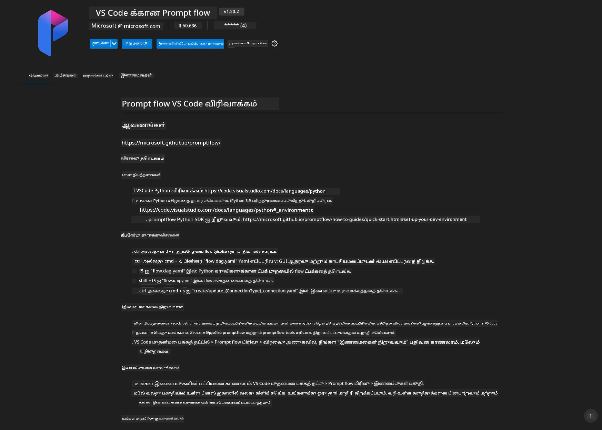
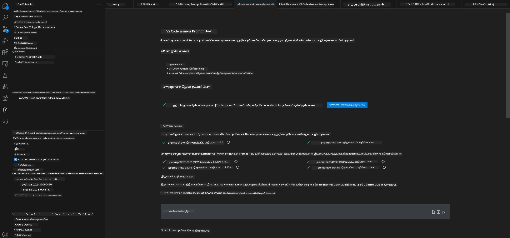
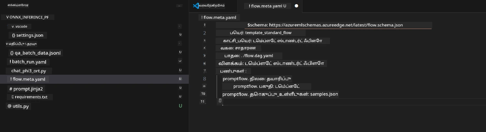
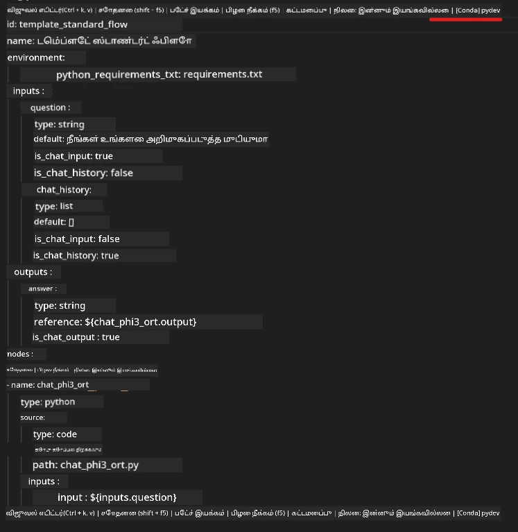
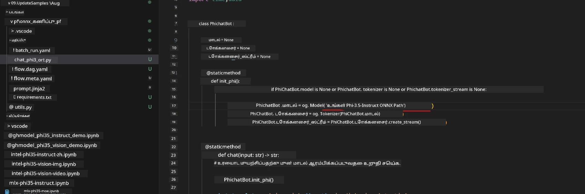
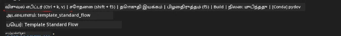
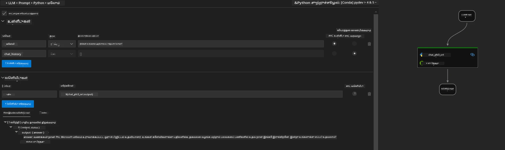
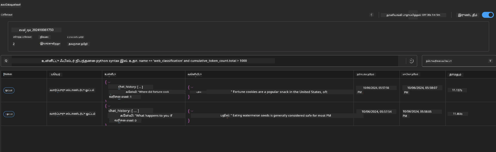

# வெயிண்டோஸ் GPU பயன்படுத்தி Phi-3.5-Instruct ONNX உடன் Prompt flow தீர்வை உருவாக்குதல் 

கீழே உள்ள ஆவணம் Phi-3 மாடல்களின் அடிப்படையில் AI பயன்பாடுகளை உருவாக்க ONNX (Open Neural Network Exchange) உடன் PromptFlow எப்படி பயன்படுத்துவது என்பதற்கான உதாரணம் ஆகும்.

PromptFlow என்பது LLM அடிப்படையிலான (பெரிய மொழி மாடல்) AI பயன்பாடுகளின் ஆரம்பமான யோசனை மற்றும் Prototype உருவாக்கத்திலிருந்து சோதனை மற்றும் மதிப்பீடு வரை கடைசி வரை முழு மேம்பாட்டு சுற்றத்தை எளிதாக்க தயாரிக்கப்பட்ட ஒரு முன்னேற்ற கருவித்தொகுப்பு ஆகும்.

PromptFlow ஐ ONNX உடன் இணைத்து, டெவலப்பர்கள் பின்வரும் விஷயங்களை செய்ய முடியும்:

- மாடல் செயல்திறனை மேம்படுத்துதல்: ONNX ஐ திறமையான மாடல் inference மற்றும் பங்கேற்றல் (deployment) க்கு பயன்படுத்துதல்.
- மேம்பாட்டை எளிமைப்படுத்துதல்: workflow ஐ PromptFlow மூலம் நிர்வகித்து மறுபடியும் செய்யும் பணிகளை தானாகச் செய்யுதல்.
- கூட்டுக் தொழில்நுட்பத்தை மேம்படுத்துதல்: ஒருங்கிணைந்த மேம்பாட்டு சூழலை வழங்கியமைக்கூடிய குழு உறுப்பினர்களுக்கு சிறந்த கூட்டு பணியை ஏற்படுத்துதல்.

**Prompt flow** என்பது LLM அடிப்படையிலான AI பயன்பாடுகளின் தொடக்கம், Prototype மீட்டமைத்தல், சோதனை, மதிப்பீடு முதல் உற்பத்தி பங்கேற்றல் மற்றும் கண்காணிப்பு வரை முழு மேம்பாட்டு சுற்றத்தை எளிதாக்க உருவாக்கப்பட்ட கருவித்தொகுப்பு ஆகும். இது prompt engineering ஐ மிகவும் எளிதாக்கி உற்பத்தி தரத்துடன் LLM செயலிகளைக் கட்டமைக்க உதவுகிறது.

Prompt flow OpenAI, Azure OpenAI Service மற்றும் தனிப்பயன் மாடல்கள் (Huggingface, உள்ளூர் LLM/SLM) க்கு இணைக்க முடியும். Phi-3.5 இன் குறைந்த அளவிலான ONNX மாடலை உள்ளூர் பயன்பாடுகளில் பயன்படுத்த திட்டமிட்டுள்ளோம். Prompt flow Phi-3.5 அடிப்படையிலான உள்ளூர் தீர்வுகளை சிறந்த முறையில் திட்டமிடுவதிலும் முழுமையாக்குவதிலும் உதவும். இந்த உதாரணத்தில், Windows GPU அடிப்படையில் Prompt flow தீர்வை முடிக்க ONNX Runtime GenAI நூலகத்தை இணைத்துக் கொள்வோம்.

## **நிறுவல்**

### **Windows GPU க்கான ONNX Runtime GenAI**

Windows GPU க்கான ONNX Runtime GenAI ஐ அமைக்க இந்த வழிகாட்டியைப் படியுங்கள்  [click here](./ORTWindowGPUGuideline.md)

### **VSCode இல் Prompt flow ஐ அமைத்தல்**

1. Prompt flow VS Code நீட்டிப்பை நிறுவுக



2. Prompt flow VS Code நீட்டிப்பை நிறுவிய பிறகு, நீட்டிப்பை கிளிக் செய்து **Installation dependencies** ஐ தேர்வு செய்து இந்த வழிகாட்டியை பின்பற்றி Prompt flow SDK ஐ உங்கள் சூழலை நிறுவுக



3. [Sample Code](../../../../../../code/09.UpdateSamples/Aug/pf/onnx_inference_pf) ஐ பதிவிறக்கம் செய்து VS Code மூலம் இந்த மாதிரியை திற*க்கவும்*



4. **flow.dag.yaml** ஐ திறந்து உங்கள் Python சூழலை தேர்ந்தெடுக்கவும்



   **chat_phi3_ort.py** ஐத் திறந்து உங்கள் Phi-3.5-instruct ONNX மாடல் இருப்பிடத்தை மாற்றவும்



5. உங்கள் prompt flow ஐ சோதனை செய்ய இயக்கவும்

**flow.dag.yaml** ஐ திறந்து பான் காட்சி (visual editor) கிளிக் செய்யவும்



இதனை கிளிக் செய்து இயக்கி சோதனை செய்யவும்



1. நீங்கள் டெர்மினலில் தொகுதியாக இயக்கி பிற பல முடிவுகளை அறியலாம்


```bash

pf run create --file batch_run.yaml --stream --name 'Your eval qa name'    

```

உங்கள் இயல்புநிலை உலாவியில் முடிவுகளைப் பார்வையிடலாம்




---

<!-- CO-OP TRANSLATOR DISCLAIMER START -->
**மறுப்பு**:
இந்த ஆவணம் AI மொழிபெயர்ப்பு சேவை [Co-op Translator](https://github.com/Azure/co-op-translator) பயன்படுத்தி மொழிபெயர்க்கப்பட்டுள்ளது. நாங்கள் துல்லியத்திற்காக முயற்சி செய்துள்ளோம், ஆனால் தானாக செய்யப்படும் மொழிபெயர்ப்புகளில் பிழைகள் அல்லது தவறுகள் இருக்கலாம் என்பதை கவனத்தில் கொள்ளவும். அசல் ஆவணம் அதன் தாய்மொழியில் அதிகாரப்பூர்வ ஆதாரமாக கருதப்பட வேண்டும். முக்கியமான தகவல்களுக்கு, தொழில்நுட்பமான மனித மொழிபெயர்ப்பு பரிந்துரைக்கப்படுகிறது. இந்த மொழிபெயர்ப்பைப் பயன்படுத்துவதால் ஏற்படும் எந்த தவறான புரிதல்கள் அல்லது தவறான விளக்கத்திற்கும் நாங்கள் பொறுப்பில்வில்லை.
<!-- CO-OP TRANSLATOR DISCLAIMER END -->