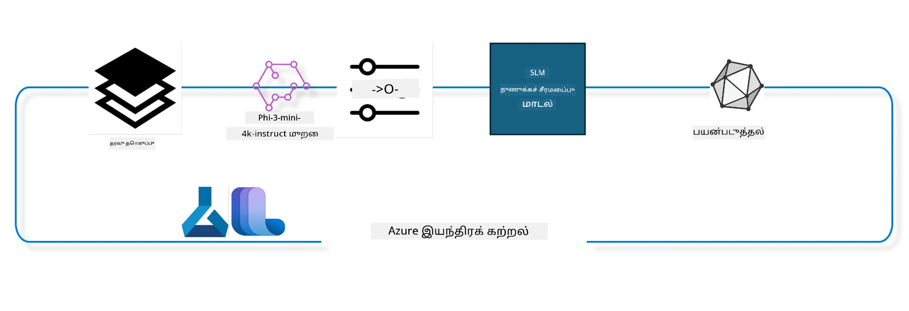

## Azure ML நிரல்குழாமிலிருந்து chat-completion காம்போனென்டுகளை பயன்படுத்தி ஒரு மாதிரியை நுட்பமாகத் திருத்துவது எப்படி

இந்த உதாரணத்தில், ultrachat_200k தரவுத்தொகுப்பைப் பயன்படுத்தி 2 நபர்களுக்கு இடையேயான உரையாடலை நிறைவு செய்ய Phi-3-mini-4k-instruct மாதிரியை நுட்பமாக திருத்துவோம்.



இந்த உதாரணம், Azure ML SDK மற்றும் Python ஐப் பயன்படுத்தி நுட்ப திருத்தல் செய்வதையும், பின்னர் நுட்பமாக திருத்தப்பட்ட மாதிரியை நேரடி கணிப்புக்கு இணையதள இறுதி புள்ளிக்கு (online endpoint) வழங்குவதையும் கற்பிக்கும்.

### பயிற்சி தரவு

நாம் ultrachat_200k தரவுத்தொகுப்பைப் பயன்படுத்துவோம். இது UltraChat தரவுத்தொகுப்பின் மிகவும் வடிகட்டப்பட்ட பதிப்பு மற்றும் Zephyr-7B-β எனப்படும், முன்னணி 7b உரையாடல் மாதிரியை பயிற்சி செய்ய பயன்படுத்தப்பட்டது.

### மாதிரி

chat-completion பணிக்காக ஒரு மாதிரியை நுட்பமாக திருத்துபவர் எப்படி செயல்படுவது என்று காட்ட Phi-3-mini-4k-instruct மாதிரியை பயன்படுத்துவோம். நீங்கள் இந்த நோட்டு புத்தகத்தை ஒரு குறிப்பிட்ட மாதிரி அட்டை மூலம் திறந்திருந்தால், அந்த மாதிரியின் பெயரை மாற்றிக் கொள்ள மறக்காதீர்கள்.

### பணிகள்

- நுட்பமாக திருத்த ஒரு மாதிரியை தேர்வு செய்க.
- பயிற்சி தரவுகளை தேர்வு செய்து ஆராயவும்.
- நுட்ப திருத்தப் பணியை கட்டமைக்கவும்.
- நுட்ப திருத்தப் பணியை இயக்கவும்.
- பயிற்சி மற்றும் மதிப்பீடு அளவுகோல்களை மதிப்பாய்வு செய்க.
- நுட்பமாக திருத்தப்பட்ட மாதிரியை பதிவு செய்க.
- நேரடி கணிப்புக்கு நுட்ப திருத்தப்பட்ட மாதிரியை வழங்கவும்.
- வளங்களை சுத்தம் செய்க.

## 1. முன் தேவைகளை அமைக்கவும்

- சார்புகளை நிறுவுக
- AzureML வேலைப்பிரதேசத்தை இணைக்கவும். அதிக விளக்கத்திற்கு set up SDK authentication ஐ பாருங்கள். கீழே உள்ள <WORKSPACE_NAME>, <RESOURCE_GROUP> மற்றும் <SUBSCRIPTION_ID> ஐ மாற்றவும்.
- azureml நிரல்குழியை (system registry) இணைக்கவும்
- விருப்பமான பரிசோதனைப் பெயரை அமைக்கவும்
- கணினி (compute) இருக்கிறதா என்று சரிபார்க்கவும் அல்லது உருவாக்கவும்.

> [!NOTE]
> தேவையானது ஒரு ஒற்றை GPU node பல GPU கார்டுகளை வைத்திருக்கலாம். உதாரணமாக, Standard_NC24rs_v3 node இல் 4 NVIDIA V100 GPUகள் இருக்கும், Standard_NC12s_v3 இல 2 NVIDIA V100 GPUகள் இருக்கும். இதற்கான தகவலுக்கு ஆவணங்களை பார்க்கவும். gpus_per_node என்ற அளவுரு கீழே குறிப்பிடப்பட்டுள்ளது, அதை சரியாக அமைப்பது அனைத்து GPUகளும் பாவிக்கப்பட்டு இருப்பதை உறுதி செய்யும். பரிந்துரைக்கபட்ட GPU கணினி வகைகள் இங்கே மற்றும் இங்கே காணலாம்.

### Python நூலகங்கள்

கீழ்காணும் செல்களை இயக்கி சார்புகளை நிறுவுக. புதிய சூழலில் இயங்கும் போது இது விருப்ப விசையல்ல.

```bash
pip install azure-ai-ml
pip install azure-identity
pip install datasets==2.9.0
pip install mlflow
pip install azureml-mlflow
```

### Azure ML உடன் தொடர்பு கொள்ளுதல்

1. இந்த Python ஸ்கிரிப்ட் Azure Machine Learning (Azure ML) சேவையுடன் தொடர்பு கொள்ள பயன்படுத்தப்படுகிறது. இதன் நடவடிக்கைகளை பின்வருமாறு விளக்கலாம்:

    - azure.ai.ml, azure.identity மற்றும் azure.ai.ml.entities பேக்கேஜ்கள் இருந்து தேவையான மாடியூல்கள் இறக்குமதி செய்கிறது. மேலும் time மாடியூலும் இறக்குமதி செய்துள்ளது.

    - DefaultAzureCredential() மூலம் அங்கிகாரம் பெற முயல்கிறது, இது Azure மேகத்தில் இயங்கும் செயலிகளை விரைவில் உருவாக்க எளிதான அங்கிகார அனுபவத்தை வழங்கும். தோல்வி ஏற்பட்டால், InteractiveBrowserCredential() மூலம் இடையிடையில் உலாவல் வழி அங்கீகாரம் பெறும்.

    - பின்னர் from_config முறை மூலம் MLClient முறையை உருவாக்க முயல்கிறது, இது இயல்புநிலை கணினி அமைப்பு கோப்பிலிருந்து (config.json) அமைப்புகளை வாசிக்கும். தோல்வி ஏற்பட்டால், கைமுறையாக subscription_id, resource_group_name மற்றும் workspace_name களை வழங்கி MLClient உருவாக்கப்படுகிறது.

    - மற்றொரு MLClient உருவாக்கப்படுகிறது, இந்த முறை Azure ML நிரல்குழி (registry) "azureml" என்ற பெயருடன். இந்த நிரல்குழியில் மாதிரிகள், நுட்ப திருத்தக் குழுக்களும் சுற்றுச் சூழல்களும் சேமிக்கப்படுகின்றன.

    - experiment_name "chat_completion_Phi-3-mini-4k-instruct" என அமைக்கப்படுகிறது.

    - தற்போது நேரத்தை (epoch முதல் செக்கன்களில், மிதமான புள்ளி எண்ணாக) முழுஎணாக்கி பின்னர் சரிசெய்து, அந்த நேரச்சின்னத்தை எழுத்துச்சொறையாக மாற்றி தனிச்சிறப்பான தகவல் உருவாக்கப்படுகிறது. இதன் மூலம் தனித்துவமான பெயர்கள் மற்றும் பதிப்புகளை உருவாக்கலாம்.

    ```python
    # Azure ML மற்றும் Azure அடையாளத்திலிருந்தும் தேவையான தொகுதிகளை இறக்குமதி செய்க
    from azure.ai.ml import MLClient
    from azure.identity import (
        DefaultAzureCredential,
        InteractiveBrowserCredential,
    )
    from azure.ai.ml.entities import AmlCompute
    import time  # நேரம் தொகுதியை இறக்குமதி செய்க
    
    # DefaultAzureCredential பயன்படுத்தி身份括்ட் சேர்க்க முயற்சி செய்க
    try:
        credential = DefaultAzureCredential()
        credential.get_token("https://management.azure.com/.default")
    except Exception as ex:  # DefaultAzureCredential தோல்வியடைந்தால் InteractiveBrowserCredential ஐ பயன்படுத்துக
        credential = InteractiveBrowserCredential()
    
    # இயல்புநிலை அமைப்பு கோப்பை பயன்படுத்தி MLClient உடன்பாடு உருவாக்க முயற்சி செய்க
    try:
        workspace_ml_client = MLClient.from_config(credential=credential)
    except:  # அது தோல்வியானால், தகவல்களை கையேடு முறையில் வழங்கி MLClient உடன்பாடு உருவாக்குக
        workspace_ml_client = MLClient(
            credential,
            subscription_id="<SUBSCRIPTION_ID>",
            resource_group_name="<RESOURCE_GROUP>",
            workspace_name="<WORKSPACE_NAME>",
        )
    
    # "azureml" என்று பெயரிடப்பட்ட Azure ML பதிவேட்டுக்கான மற்றொரு MLClient உடன்பாட்டை உருவாக்குக
    # இந்த பதிவேடு மாதிரிகள், நுணுக்கச் செயற்திட்டங்கள் மற்றும் சூழல்களை சேமிக்கும் இடம்
    registry_ml_client = MLClient(credential, registry_name="azureml")
    
    # சோதனை பெயரை அமைக்கவும்
    experiment_name = "chat_completion_Phi-3-mini-4k-instruct"
    
    # தனித்துவமான பெயர்களுக்கும் பதிப்புகளுக்கும் பயன்படுத்தக்கூடிய ஒரு தனித்துவமான சமய முத்திரையை உருவாக்குக
    timestamp = str(int(time.time()))
    ```

## 2. நுட்பமாக திருத்த ஒரு அடிப்படை மாதிரியை தேர்வு செய்க

1. Phi-3-mini-4k-instruct என்பது 3.8 பில்லியன் அளவுருக்களை கொண்ட, இலகு, முன்னணி திறன் கொண்ட திறந்த மாதிரியாகும், இது Phi-2 பயிற்சிக்கு உதவிய தரவுத்தொகுதிகள் மேல் கட்டப்பட்டிருக்கிறது. இந்த மாதிரி Phi-3 குடும்பத்தைச் சேர்ந்தது மற்றும் Mini பதிப்பு இரண்டு மாறுபாடுகளுடன் வருகிறது - 4K மற்றும் 128K, இது அது ஆதரிக்கக்கூடிய உரையாடல் நீளத்தைக் குறிக்கும் (டோக்கன்களில்). நமது குறிப்பிட்ட நோக்கத்திற்கு மாதிரியை நுட்பமாக திருத்த வேண்டியுள்ளது. AzureML ஸ்டுடியோவில் மாதிரி காட்சிப்பட்டியலில் chat-completion பணிக்கான பில்டரைப் பயன்படுத்தி இந்த மாதிரிகளை உலாவலாம். இந்த உதாரணத்தில், Phi-3-mini-4k-instruct மாதிரியைப் பயன்படுத்துகிறோம். வேறு மாதிரி ஒன்றுக்காக இந்த நோட்டு புத்தகத்தை திறந்திருந்தால், மாதிரி பெயர் மற்றும் பதிப்பை மாற்றவும்.

> [!NOTE]
> மாதிரியின் id சிறப்பு சொத்து. இது நுட்ப திருத்த பணிக்கு உள்ளீடாக வழங்கப்படும். இது AzureML ஸ்டுடியோவில் மாதிரி விவர பக்கத்தில் Asset ID என்ற புலமாகவும் கிடைக்கிறது.

2. இதுவும் Azure Machine Learning (Azure ML) சேவையுடன் தொடர்பு கொள்ளும் Python ஸ்கிரிப்ட்டானது. இதன் நடவடிக்கைகள் பின்வருமாறு:

    - model_name "Phi-3-mini-4k-instruct" என அமைக்கப்படுகிறது.

    - registry_ml_client இன் models பண்பின் get முறையை பயன்படுத்தி Azure ML நிரல்குழியில் குறிப்பிட்ட பெயரின் சமீபத்திய பதிப்பை பெறுகிறது. get ஆர்க்யூமென்ட்களில் இரண்டு: மாதிரி பெயர் மற்றும் 'latest' என்ற லேபல்.

    - எந்த மாதிரி பெயர், பதிப்பு மற்றும் id பயன்படுத்தப்படவுள்ளது என்பதை திரையில் அச்சிடுகிறது. string.format முறை மூலம் எதிர்பார்க்கப்படும் பெயர், பதிப்பு மற்றும் id வார்த்தை சேர்க்கப்படுகின்றன. foundation_model இன் பண்புகள் மூலம் தரப்படுகிறது.

    ```python
    # மாதிரி பெயரை அமைக்கவும்
    model_name = "Phi-3-mini-4k-instruct"
    
    # Azure ML பதிவு களத்திலிருந்து மாதிரியின் சமீபத்திய பதிப்பை பெறவும்
    foundation_model = registry_ml_client.models.get(model_name, label="latest")
    
    # மாதிரி பெயர், பதிப்பு மற்றும் ஐடியை அச்சிடு
    # பின்தொடர்தல் மற்றும் பிழைத்திருத்தத்திற்கு இந்த தகவல் பயன்படும்
    print(
        "\n\nUsing model name: {0}, version: {1}, id: {2} for fine tuning".format(
            foundation_model.name, foundation_model.version, foundation_model.id
        )
    )
    ```

## 3. பணிக்கான கணினியை உருவாக்கவும்

நுட்பத் திருத்த பணிகள் GPU கணினியில் மட்டுமே செயல்படும். கணினியின் அளவு மாதிரியின் பருமனுக்கு ஏற்ப இருக்க வேண்டும் மற்றும் பல நேரங்களில் சரிபார்ப்பது சிக்கலானது. இந்த செலில், பணிக்கான சரியான கணினியை தேர்வுசெய்ய பயனரை வழி நடத்துகிறோம்.

> [!NOTE]
> கீழே பட்டியலிடப்பட்ட கணினிகள் மிக 최적화 செய்யப்பட்ட கட்டமைப்புடன் செயல்படும். கட்டமைப்பில் மாற்றங்கள் Cuda Out Of Memory பிழையை ஏற்படுத்தக்கூடும். அப்படி நேர்ந்தால், கணினியை பெரிய அளவுக்கு மேம்படுத்த முயற்சிக்கவும்.

> [!NOTE]
> கீழே compute_cluster_size தேர்வு செய்கிற போது, கணினி உங்கள் வளக் குழுவில் கிடைப்பதை உறுதி செய்யவும். கணினி கிடைக்காதால், அணுகல் விண்ணப்பம் சமர்ப்பிக்கலாம்.

### நுட்ப திருத்தக் க்கான மாதிரி ஆதரவை பார்

1. Python ஸ்கிரிப்ட் ஒரு Azure ML மாதிரியைப் பரிசோதிக்கிறது. இதன் செயல்பாடுகள்:

    - ast மாடியூலை இறக்குமதி செய்கிறது, இது Python மொழியின் செயற்கட்டு மரங்களை செயலாக்க உதவுகிறது.

    - foundation_model (Azure ML இல் ஒரு மாதிரி) finetune_compute_allow_list என்ற குறிச்சொல் உள்ளதா என பார்த்து, உண்டாயின் அந்த குறிச்சொல்லை ast.literal_eval கொண்டு Python பட்டியலாக்குகிறது. அதை computes_allow_list என்ற 변수 கொடுக்கப்படுகிறது. பின்னர் அந்த பட்டியலில் இருந்து ஒரு கணினி உருவாக்க வேண்டுமானால் அக்குறிப்பை அச்சிடுகிறது.

    - குறிச்சொல் இல்லையெனில், computes_allow_list = None என அமைக்கப்படுகிறது. finetune_compute_allow_list குறிச்சொல் மாதிரியின் குறிச்சொற்களில் இல்லை என்று அச்சிடுகிறது.

    - சுருக்கமாக, இந்த ஸ்கிரிப்ட் மாதிரியின் மெட்டா தகவலில் ஒரு குறிச்சொல் உள்ளதா என்பதைப் பார்த்து, இருந்தால் அதன் மதிப்பை பட்டியலாக்கி பயனருக்கு தெரிவிக்கிறது.

    ```python
    # Python அப்ஸ்ட்ராக்ட் சிந்டாக்ஸ் விதிகள் மரங்களை செயலாக்க செயல்பாடுகளை வழங்கும் ast மொடிை ஆதரவு செய்ய இறக்குமதி செய்க
    import ast
    
    # மாடலின் தொடர்புகளில் 'finetune_compute_allow_list' குறி உள்ளது என சரிபார்
    if "finetune_compute_allow_list" in foundation_model.tags:
        # குறி இருந்தால், ast.literal_eval ஐ பயன்படுத்தி குறியின் மதிப்பை (ஒரு தொடர்) Python பட்டியலாகப் பாதுகாப்பாக பார்ஸ் செய்க
        computes_allow_list = ast.literal_eval(
            foundation_model.tags["finetune_compute_allow_list"]
        )  # தொடர் ஒன்றை பைதான் பட்டியலாக மாற்று
        # பட்டியலில் இருந்து ஒரு கணக்கீடு உருவாக்கப்பட வேண்டும் என்பதை தெரிவித்த ஒரு செய்தியை அச்சிடு
        print(f"Please create a compute from the above list - {computes_allow_list}")
    else:
        # குறி இல்லையெனில், computes_allow_list ஐ None ஆக அமைக்கவும்
        computes_allow_list = None
        # 'finetune_compute_allow_list' குறி மாடலின் தொடர்புகளில் இல்லாததைக் குறிப்பது ஒரு செய்தியை அச்சிடு
        print("`finetune_compute_allow_list` is not part of model tags")
    ```

### கணினி (Compute) ஆகிரகத்தை பரிசோதித்தல்

1. Azure ML சேவையுடன் தொடர்பு கொண்டு ஒரு கணினி ஆகிரகத்தில் பல பரிசோதனைகள் செய்கிறது. செயல்பாடுகள்:

    - compute_cluster இல் சேமிக்கப்பட்ட பெயரில் கணினி ஆகிரகத்தை பெற முயலும். கணினி provisioning நிலை if "failed" ஆக இருந்தால் ValueError தூக்குகிறது.

    - computes_allow_list None அல்லாவிட்டால், அதில் உள்ள எல்லா கணினி அளவுகளை இளம் எழுத்துக்குறிகளாக மாற்றி, தற்போதைய கணினி அளவு அந்த பட்டியலில் உள்ளதா என்று பார்க்கும். இல்லையெனில் ValueError.

    - computes_allow_list None ஆனால், கணினி அளவு ஆதரவு இல்லாத GPU VM அளவுகள் பட்டியலில் உள்ளதா என பார்க்கும். இருந்தால் ValueError.

    - வேலைப்பிரதேசத்தில் கிடைக்கும் அனைத்து கணினி அளவுகளின் பட்டியலைப் பெறும். ஒவ்வொரு தூண்டுதலிலும் தற்போதைய கணினி அளவுடன் மெய் பொருந்தும் போது அதற்கு சேர்ந்த GPU எண்ணிக்கை பெறப்படுகிறது மற்றும் gpu_count_found True ஆகும்.

    - gpu_count_found True என்றால் கணினியில் உள்ள GPU எண்ணிக்கை அச்சிடப்படும். இல்லையெனில் ValueError.

    - சுருக்கமாக, இந்த ஸ்கிரிப்ட் ஒரு Azure ML கணினியை பல்வேறு கோளாறுகளில் பரிசோதித்து அதன் நிலை, அளவு, GPU எண்ணிக்கையை உறுதி செய்கிறது.
    
    ```python
    # исключение செய்தியை அச்சிடுங்கள்
    print(e)
    # கணினி அளவு பணிக்கூடத்தில் கிடைக்காவிட்டால் ValueError எழுப்பவும்
    raise ValueError(
        f"WARNING! Compute size {compute_cluster_size} not available in workspace"
    )
    
    # Azure ML பணிக்கூடத்திலிருந்து கணினி உதாரணத்தைப் பெறவும்
    compute = workspace_ml_client.compute.get(compute_cluster)
    # கணினி உதாரணத்தின் provisioning நிலை "தோல்வி" என்றதா என சரிபார்க்கவும்
    if compute.provisioning_state.lower() == "failed":
        # provisioning நிலை "தோல்வி" என்றால் ValueError எழுப்பவும்
        raise ValueError(
            f"Provisioning failed, Compute '{compute_cluster}' is in failed state. "
            f"please try creating a different compute"
        )
    
    # computes_allow_list None அல்லத்தால் சரிபார்க்கவும்
    if computes_allow_list is not None:
        # computes_allow_list உள்ள அனைத்து கணினி அளவுகளையும் lowercase ஆக மாற்றவும்
        computes_allow_list_lower_case = [x.lower() for x in computes_allow_list]
        # கணினி உதாரணத்தின் அளவு computes_allow_list_lower_case இல் உள்ளதா என்று சரிபார்க்கவும்
        if compute.size.lower() not in computes_allow_list_lower_case:
            # கணினி உதாரணத்தின் அளவு computes_allow_list_lower_case இல் இல்லை என்றால் ValueError எழுப்பவும்
            raise ValueError(
                f"VM size {compute.size} is not in the allow-listed computes for finetuning"
            )
    else:
        # ஆதரவில்லாத GPU VM அளவுகளின் பட்டியலை வரையறுக்கவும்
        unsupported_gpu_vm_list = [
            "standard_nc6",
            "standard_nc12",
            "standard_nc24",
            "standard_nc24r",
        ]
        # கணினி உதாரணத்தின் அளவு unsupported_gpu_vm_list இல் உள்ளதா என்று சரிபார்க்கவும்
        if compute.size.lower() in unsupported_gpu_vm_list:
            # கணினி உதாரணத்தின் அளவு unsupported_gpu_vm_list இல் உள்ளதெனில் ValueError எழுப்பவும்
            raise ValueError(
                f"VM size {compute.size} is currently not supported for finetuning"
            )
    
    # கணினி உதாரணத்தில் GPUகளின் எண்ணிக்கை கண்டுபிடிக்கப்பட்டதா என்பதை சரிபார்க்க ஒரு கொடியை தொடங்கவும்
    gpu_count_found = False
    # பணிக்கூடத்தில் கிடைக்கும் அனைத்து கணினி அளவுகளின் பட்டியலைப் பெறவும்
    workspace_compute_sku_list = workspace_ml_client.compute.list_sizes()
    available_sku_sizes = []
    # கிடைக்கும் கணினி அளவுகளின் பட்டியலில் திரும்பிப் பார்வையிடவும்
    for compute_sku in workspace_compute_sku_list:
        available_sku_sizes.append(compute_sku.name)
        # கணினி அளவின் பெயர் கணினி உதாரணத்தின் அளவுடன் பொருந்துகிறதா என்பதை சரிபார்க்கவும்
        if compute_sku.name.lower() == compute.size.lower():
            # பொருந்தினால், அந்த கணினி அளவிற்கான GPUகளின் எண்ணிக்கையை பெறவும் மற்றும் gpu_count_found ஐ True ஆக அமைக்கவும்
            gpus_per_node = compute_sku.gpus
            gpu_count_found = True
    # gpu_count_found True என்றால், கணினி உதாரணத்தில் உள்ள GPUகளின் எண்ணிக்கையை அச்சிடவும்
    if gpu_count_found:
        print(f"Number of GPU's in compute {compute.size}: {gpus_per_node}")
    else:
        # gpu_count_found False என்றால் ValueError எழுப்பவும்
        raise ValueError(
            f"Number of GPU's in compute {compute.size} not found. Available skus are: {available_sku_sizes}."
            f"This should not happen. Please check the selected compute cluster: {compute_cluster} and try again."
        )
    ```

## 4. மாதிரியை நுட்ப திருத்துவதற்கான தரவுத்தொகுப்பை தேர்வுசெய்க

1. நாம் ultrachat_200k தரவுத்தொகுப்பைப் பயன்படுத்துகிறோம். இந்த தரவுத்தொகுப்பில் நான்கு பகுப்புகள் உள்ளன, அவை மேற்பார்வை நுட்பதிருத்தத்துக்கு (supervised fine-tuning, sft) பொருத்தமானவை.
உருவாக்க வரிசைப்படுத்தல் (generation ranking, gen). ஒவ்வொரு பகுதியிலும் உள்ள எடுத்துக்காட்டுகளின் எண்ணிக்கை கீழே காட்டப்பட்டுள்ளது:

    ```bash
    train_sft test_sft  train_gen  test_gen
    207865  23110  256032  28304
    ```

1. அடுத்த சில செல்கள் அடிப்படை தரவு தயார் செய்தலை (data preparation) காட்டுகின்றன:

### சில தரவு வரிசைகளை காண்க

இந்த மாதிரி விரைவாக இயங்க வேண்டும் என்பதற்காக, train_sft மற்றும் test_sft கோப்புகளில் ஏற்கனவே வெட்டப்பட்ட வரிசைகளின் 5% பதிவு செய்யப்படுகிறது. இதனால் நுட்பமாகத் திருத்தப்பட்ட மாதிரி குறைந்த துல்லியத்துடன் இருக்கும், எனவே அதை உண்மையான பயன்பாட்டிற்கு வைத்திருக்க கூடாது.
download-dataset.py ultrachat_200k தரவுத்தொகுப்பை பதிவிறக்கம் செய்து அதை நுட்ப திருத்த குழு கூறுகளுக்கு ஏற்ற வடிவில் மாற்ற பயன்படுத்தப்படுகிறது. திரும்பும்போது, தரவுத்தொகுப்பு பெரிதாக இருப்பதால் நாம் இங்கு அதன் ஒரு பகுதியை மட்டுமே வைத்திருக்கிறோம்.

1. கீழ்க்கண்ட ஸ்கிரிப்ட் 5% தரவை மட்டுமே பதிவிறக்கம் செய்கிறது. dataset_split_pc அளவுருவை மாற்றி இதனை அதிகரிக்கவும்.

> [!NOTE]
> சில மொழிமாதிரிகள் வெவ்வேறு மொழிக் குறியீடுகள் கொண்டுள்ளன, எனவே தரவுத்தொகுப்பில் உள்ள புலக் பெயர்கள் அதனை பிரதிபலிக்க வேண்டும்.

1. தரவு எப்படி இருக்க வேண்டும் என்பதற்கான உதாரணம்:
chat-completion தரவுத்தொகுப்பு parquet வடிவில் சேமிக்கப்பட்டுள்ளது, ஒவ்வொரு உள்ளீடும் பின்வரும் வடிவமைப்பை பயன்படுத்துகிறது:

    - இது JSON (JavaScript Object Notation) ஆவணம், பொதுவான தரவு பரிமாற்றக் கோப்பு வடிவம். இது செயலாக்கக் கோடு அல்ல. அதன் அமைப்பு:

    - "prompt": இந்த விசை AI உதவியாளருக்கு வழங்கப்படும் பணியோ கேள்வியோ பிரதிபலிக்கும் எழுத்து மதிப்பை வைத்திருக்கிறது.

    - "messages": இந்த விசை ஒரு பொருட்களின் வரிசையை கொண்டுள்ளது. ஒவ்வொரு பொருள் ஒரு உரையாடல் செய்தியை பிரதிபலிக்கிறது, பயனர் மற்றும் AI உதவியாளர் இடையேயான உரையாடலில். ஒவ்வொரு செய்தி பொருளுக்கும் இரண்டு விசைகள் உள்ளன:

    - "content": செய்தியின் உள்ளடக்கத்தைக் காண்பிக்கும் எழுத்து மதிப்பு.
    - "role": செய்தியை அனுப்பிய அத்தியாயத்தின் பங்கு, "user" அல்லது "assistant" என்ற மதிப்புகளிலிருந்து ஒன்று.
    - "prompt_id": அசலான அடையாளத்துடன் இணையப்பட்ட விசை.

1. குறிப்பிட்ட JSON ஆவணத்தில், ஒரு பயனர் AI உதவியாளருக்கு ஒரு எதிர்கால கதை நாயகனை உருவாக்க வேண்டிய கேள்வியை விடுவார். உதவியாளர் பதிலளிப்பார், பயனர் மேலும் விவரங்கள் கேட்பார், உதவியாளர் விருப்பத்துடன் வழங்க தயாராக இருப்பார். உரையாடல் முழுமையாக தொடர்புடைய prompt_id உடன் சேர்ந்துள்ளது.

    ```python
    {
        // The task or question posed to an AI assistant
        "prompt": "Create a fully-developed protagonist who is challenged to survive within a dystopian society under the rule of a tyrant. ...",
        
        // An array of objects, each representing a message in a conversation between a user and an AI assistant
        "messages":[
            {
                // The content of the user's message
                "content": "Create a fully-developed protagonist who is challenged to survive within a dystopian society under the rule of a tyrant. ...",
                // The role of the entity that sent the message
                "role": "user"
            },
            {
                // The content of the assistant's message
                "content": "Name: Ava\n\n Ava was just 16 years old when the world as she knew it came crashing down. The government had collapsed, leaving behind a chaotic and lawless society. ...",
                // The role of the entity that sent the message
                "role": "assistant"
            },
            {
                // The content of the user's message
                "content": "Wow, Ava's story is so intense and inspiring! Can you provide me with more details.  ...",
                // The role of the entity that sent the message
                "role": "user"
            }, 
            {
                // The content of the assistant's message
                "content": "Certainly! ....",
                // The role of the entity that sent the message
                "role": "assistant"
            }
        ],
        
        // A unique identifier for the prompt
        "prompt_id": "d938b65dfe31f05f80eb8572964c6673eddbd68eff3db6bd234d7f1e3b86c2af"
    }
    ```

### தரவு பதிவிறக்கம் செய்யுதல்

1. இந்த Python ஸ்கிரிப்ட், download-dataset.py என்று பெயரிடப்பட்ட உதவி ஸ்கிரிப்ட்டைப் பயன்படுத்தி தரவுத்தொகுப்பை பதிவிறக்கம் செய்கிறது. செயல்பாடுகள்:

    - os மாடியூலை இறக்குமதி செய்கிறது, இது இயக்கமைப்புக்கேற்ப செயலிகளை இயக்க உதவும்.

    - os.system செயலியை பயன்படுத்தி shell இல் download-dataset.py ஸ்கிரிப்ட்டை குறிப்பிட்ட கட்டளைக் கூறுகளுடன் இயக்குகிறது. கட்டளைகள் - தரவுத்தொகுப்பு பெயர் (HuggingFaceH4/ultrachat_200k), பதிவிறக்கம் செய்யும் அடைவை (ultrachat_200k_dataset) மற்றும் பகுப்பாய்வு சதவீதம் (5). os.system கட்டளை நிறைவு நிலை (exit status) திரும்ப அளிக்கும்; அதை exit_status என்பதில் சேமிக்கிறது.

    - exit_status 0 அல்ல என்றால், Unix போன்ற இயங்குதளங்களில் 0 என்பது வெற்றியைக் குறிக்கும். 0 அல்லாத பிற எண்கள் பிழையை குறிக்கும். pzhaust_exit_status 0 இல்லாவிடில் தரவுத்தொகுப்பை பதிவிறக்கம் செய்ய பிழை ஏற்பட்டதாக Exception எறிகிறது.

    - சுருக்கமாக, இந்த ஸ்கிரிப்ட் உதவி ஸ்கிரிப்ட்டைப் பயன்படுத்திக் தரவுத்தொகுப்பை பதிவிறக்கம் செய்கிறது, தோல்வி ஏற்பட்டால் பிழை வெளியிடு.

    ```python
    # இயங்கு முறை சார்ந்த செயல்பாடுகளை பயன்படுத்த ஒரு வழியை வழங்கும் os மாடலை இறக்குமதி செய்க
    import os
    
    # குறிப்பிட்ட கட்டளை வரி аргுமెంట்டுகளுடன் download-dataset.py ஸ்கிரிப்டை ஷெல் இல் இயக்க os.system() செயல்பாட்டைப் பயன்படுத்தவும்
    # ஆர்குமெண்ட்டுகள் பதிவிறக்க வேண்டிய தரவுத்தொகுப்பை (HuggingFaceH4/ultrachat_200k), பதிவிறக்க வேண்டிய கோப்புறை (ultrachat_200k_dataset), மற்றும் தரவுத்தொகுப்பின் பகுதி விகிதம் (5) குறிப்பிடுகின்றன
    # os.system செயல்பாடு அதன் இயக்கிய கட்டளையின் வெளியீட்டு நிலையை திருப்புகிறது; இந்த நிலை exit_status மாறியில் சேமிக்கப்படுகிறது
    exit_status = os.system(
        "python ./download-dataset.py --dataset HuggingFaceH4/ultrachat_200k --download_dir ultrachat_200k_dataset --dataset_split_pc 5"
    )
    
    # exit_status 0 அல்ல என சரிபார்க்கவும்
    # Unix போன்ற இயங்கு முறைகளில், வெளியீட்டு நிலை 0 என்பது ஒரு கட்டள் வெற்றிகரமாக நிறைவடைந்ததை பொதுவாக குறிப்பிடும், மற்ற எண் ஏதேனும் பிழையை குறிக்கிறது
    # exit_status 0 ஆக இல்லையெனில், தரவுத்தொகுப்பின் பதிவிறக்கம் பிழை ஏற்பட்டதை குறிக்கும் ஒரு செய்தியுடன் Exception எழுப்பவும்
    if exit_status != 0:
        raise Exception("Error downloading dataset")
    ```

### DataFrame இல் தரவை ஏற்றுதல்

1. இந்த Python ஸ்கிரிப்ட் JSON Lines கோப்பை pandas DataFrame இல் ஏற்றி முதல் 5 வரிசைகளை காண்பிக்கிறது. செயல்பாடுகள்:

    - pandas நூலகத்தை இறக்குமதி செய்கிறது, இது சக்திவாய்ந்த தரவு மாற்றி மற்றும் பகுப்பாய்வு நூலகம்.

    - pandas க்கான display விருப்பங்களில் அதிகபட்ச பத்திய அகலத்தை 0 ஆக அமைக்கிறது. அதாவது DataFrame அச்சிடும்போது ஒவ்வொரு பத்தியிலும் முழு உரையை குறுங்காணாமல் முழுமையாக காண்பிக்கும்.
- அது pd.read_json செயல்பாட்டைப் பயன்படுத்தி ultrachat_200k_dataset அடைவிலிருந்து train_sft.jsonl கோப்பை DataFrame ஆக ஏற்று வருகிறது. lines=True என்கிற வாதம் கோப்பு JSON Lines வடிவத்தில் உள்ளது எனக் குறிக்கிறது, இங்கு ஒவ்வொரு வரியும் தனித்த JSON பொருள் ஆகும்.

- அது head முறைமையைப் பயன்படுத்தி DataFrame இன் முதல் 5 வரிசைகளை காட்சிப்படுத்துகிறது. DataFrame இல் 5 விட குறைவான வரிசைகள் இருந்தால் அவற்றை எல்லாம் காட்டும்.

- சுருக்கமாக, இந்த ஸ்கிரிப்ட் JSON Lines கோப்பை DataFrame ஆக ஏற்றிக் கொண்டு முழு பத்தி வலை கடத்தல்களுடன் முதல் 5 வரிசைகளை காட்சிப்படுத்துகிறது.
    
    ```python
    # சக்திவாய்ந்த தரவாற்றல் மற்றும் பகுப்பாய்வு நூலகமான pandas நூலகத்தை இறக்குமதி செய்க
    import pandas as pd
    
    # pandas க்கான அதிகபட்ச நெடுவரிசை அகலத்தை 0 ஆக அமைக்கவும்
    # இது DataFrame அச்சிடும் போது ஒவ்வொரு நெடுவரிசையின் முழு உரையும் குறுக்கு வெட்டாமல் காட்டப்படும் என்று பொருள்
    pd.set_option("display.max_colwidth", 0)
    
    # pd.read_json செயல்பாட்டைப் பயன்படுத்தி ultrachat_200k_dataset அடைவிலுள்ள train_sft.jsonl கோப்பை DataFrame ஆக ஏற்றவும்
    # lines=True என்ற வாதம் அந்த கோப்பு JSON Lines வடிவத்தில் உள்ளது, அங்கே ஒவ்வொரு வரியும் தனித்த JSON பொருள் ஆகும் என்பதைப் குறிப்பிடும்
    df = pd.read_json("./ultrachat_200k_dataset/train_sft.jsonl", lines=True)
    
    # head முறைவழி மூலம் DataFrame இன் முதலாவது 5 வரிகளை காட்டு
    # DataFrame இல் 5-அதிகமான வரிகள் இல்லையெனில், அவற்றை முழுவதும் காட்டும்
    df.head()
    ```

## 5. மாதிரியையும் தரவையும் உள்ளீடுகளாகக் கொண்டு நுட்ப முறையை சமர்ப்பிக்கவும்

chat-completion பைப்லைன் கூறை பயன்படுத்தும் வேலை உருவாக்கவும். நுட்ப முறைமையிற்கான அனைத்து ஆதரவு பரிமாற்றங்களைப் பற்றி மேலதிகமாக அறிந்துகொள்ளவும்.

### நுட்ப முறை பரிமாற்றங்களை வரையறுக்கவும்

1. நுட்ப முறை பரிமாற்றங்கள் 2 வகைகளில் வகைப்படுத்தப்படலாம் - பயிற்சி பரிமாற்றங்கள், முறையான பரிமாற்றங்கள்

1. பயிற்சி பரிமாற்றங்கள் பயிற்சியின் அம்சங்களை வரையறுக்கின்றன, உதாரணமாக -

    - பயன்படுத்த வேண்டிய ஆப்டிமைசர், திட்டியாளர்
    - நுட்ப முறையை மேம்படுத்த ஆற்றுக்கூடிய அளவுகோல்
    - பயிற்சி படிகள் மற்றும் பேட்ச் அளவு மற்றும் மற்றவை
    - முறையான பரிமாற்றங்கள் GPU நினைவகத்தை மேம்படுத்த மற்றும் கணினி வளங்களை திறமையாகப் பயன்படுத்த உதவுகின்றன.

1. கீழே இந்தப் பிரிவுக்குள்属ிய சில பரிமாற்றங்கள் உள்ளன. முறையான பரிமாற்றங்கள் ஒவ்வொரு மாதிரிக்கும் வேறுபடுகின்றன மற்றும் மாதிரிக்கேற்ப தொகுக்கப்பட்டவை.

    - deepspeed மற்றும் LoRA இயக்கு
    - கலந்த துல்லிய பயிற்சி செய்க
    - பன்முக நொடிகள் பயிற்சி செய்க

> [!NOTE]
> கண்காணிக்கப்பட்ட நுட்ப முறை_ALIGNMENT இழப்பு அல்லது மோசமான மறவல் உண்டாகலாம். இந்த பிரச்சினையைச் சரிபார்க்கவும், நுட்பமுறை பிறகு ALIGNMENT படியை இயக்க பரிந்துரைக்கப்படுகிறது.

### நுட்ப முறை பரிமாற்றங்கள்

1. இந்த Python ஸ்கிரிப்ட் இயந்திர கற்றல் மாதிரியை நுட்பம் செய்யக் கூடிய பரிமாற்றங்களை அமைக்கிறது. இதோ அதன் விளக்கம்:

    - பயிற்சியின் இயல்பு பரிமாற்றங்களை அமைக்கிறது, உதாரணமாக பயிற்சி காலக்கட்டங்கள், பயிற்சி மற்றும் மதிப்பீட்டுக்கான பேட்ச் அளவுகள், கற்றல் விகிதம் மற்றும் கற்றல் விகித திட்டியாளர் வகை.

    - இயல்பு முறையான பரிமாற்றங்களை அமைக்கிறது, உதாரணமாக LoRa மற்றும் DeepSpeed-ஐ பயன்படுத்துவது, மற்றும் DeepSpeed நிலை.

    - பயிற்சியும் முறையான பரிமாற்றங்களும் finetune_parameters என்ற dict ஒன்றாக இணைக்கின்றன.

    - foundation_model-க்கு எந்த மாதிரி-சார்ந்த இயல்பு பரிமாற்றங்கள் உள்ளனவா என்பதைச் சரிபார்க்கிறது. இருந்தால், அந்த மாதிரிச் சார்ந்த இயல்பு பரிமாற்றங்கள் குறித்து எச்சரிக்கை செய்தியுடன் finetune_parameters-ஐ புதுப்பிக்கிறது. ast.literal_eval செயல்பாடு அந்த மாதிரி-சார்ந்த இயல்பு பரிமாற்றங்களை string-இருந்து Python dict ஆக மாற்ற பயன்படுத்தப்படுகிறது.

    - இயக்கத்திற்கான இறுதி நுட்ப பரிமாற்றங்களை அச்சிடுகிறது.

    - சுருக்கமாக, இந்த ஸ்கிரிப்ட் இயந்திர கற்றல் மாதிரியை நுட்பம் செய்ய பரிமாற்றங்களை அமைக்கவும் அச்சிடவும் செய்கிறது, இயல்பு பரிமாற்றங்களை மாதிரிச் சார்ந்தவை கொண்டு மீறக்கூடியதாக.

    ```python
    # பயிற்சி கால கட்டங்கள், பயிற்சி மற்றும் மதிப்பீடு தொகுதிகளின் அளவுகள், கற்றல் வேகம் மற்றும் கற்றல் வேக நிர்வாகி வகை போன்ற இயல்புநிலை பயிற்சி அளவுருக்கள் அமைக்கவும்
    training_parameters = dict(
        num_train_epochs=3,
        per_device_train_batch_size=1,
        per_device_eval_batch_size=1,
        learning_rate=5e-6,
        lr_scheduler_type="cosine",
    )
    
    # அடுக்கு அடிப்படையிலான முக்கியத்துவ பிணைப்பு (LoRa) மற்றும் DeepSpeed பயன்படுத்த வேண்டுமா என்பதையும் DeepSpeed நிலையைப் போன்ற இயல்புநிலை மேம்பாட்டு அளவுருக்களை அமைக்கவும்
    optimization_parameters = dict(
        apply_lora="true",
        apply_deepspeed="true",
        deepspeed_stage=2,
    )
    
    # பயிற்சி மற்றும் மேம்பாட்டு அளவுருக்களை finetune_parameters என்ற ஒரு ஒரே அகராதியில் ஒத்திசைக்கவும்
    finetune_parameters = {**training_parameters, **optimization_parameters}
    
    # foundation_model-க்கு எந்தவொரு மாடல்-கூடிய இயல்புநிலை அளவுருக்கள் உள்ளதா என்று சரிபார்க்கவும்
    # இருந்தால், ஒரு எச்சரிக்கை செய்தியைக் காட்டு மற்றும் finetune_parameters அகராதியை இந்த மாடல்-கூடிய இயல்புகளுடன் புதுப்பிக்கவும்
    # ast.literal_eval செயல்பாடு மாடல்-கூடிய இயல்புகளை சரத்தைப் Python அகராதியாக மாற்ற பயன்படுத்தப்படுகிறது
    if "model_specific_defaults" in foundation_model.tags:
        print("Warning! Model specific defaults exist. The defaults could be overridden.")
        finetune_parameters.update(
            ast.literal_eval(  # சரத்தை Python அகராதியாக மாற்றவும்
                foundation_model.tags["model_specific_defaults"]
            )
        )
    
    # ஓட்டத்துக்கு பயன்படுத்தப்படும் இறுதி fine-tuning அளவுருக்களின் தொகுப்பை அச்சிடவும்
    print(
        f"The following finetune parameters are going to be set for the run: {finetune_parameters}"
    )
    ```

### பயிற்சி பைப்லைன்

1. இந்த Python ஸ்கிரிப்ட் இயந்திர கற்றல் பயிற்சி பைப்லைனுக்கான காட்சிப்பாட்டு பெயரை உருவாக்கும் செயல்பாட்டை வரையறுக்கிறது, பின்னர் அதை அழைத்து அச்சிடுகிறது. இதோ விளக்கம்:

1. get_pipeline_display_name என்ற செயல்பாடு வரையறுக்கப்படுகிறது. பயிற்சி பைப்லைன் தொடர்புடைய பல பரிமாற்றங்களை அடிப்படையாகக் கொண்டு இது காட்சிப்பாட்டு பெயரை உருவாக்குகிறது.

1. செயல்பாட்டிற்கு உள்ளே, ஒற்றை சாதன பேட்ச் அளவு, துகள் சேர்ப்பு படிகள், ஒரு முடிச்சில் GPU-கள் மற்றும் நுட்பத்திற்கு பயன்படுத்தப்படும் தொடங்கள் எண்ணிக்கையை கொண்டு மொத்த பேட்ச் அளவு கணக்கிடப்படுகிறது.

1. கற்றல் விகித திட்டியாளர் வகை, DeepSpeed பயன்படுத்தப்படுகிறதா, DeepSpeed நிலை, LoRa பயன்படுத்தப்படுகிறதா, மாதிரி சோதனைப் பதிவுகளின் எல்லை மற்றும் அதிகபட்ச வரிசை நீளம் போன்ற பல பரிமாற்றங்கள் பெறப்படுகிறது.

1. இந்த அனைத்தையும் இணைத்து ஹய்ஃபன்களால் பிரிக்கப்பட்ட ஒரு செல்லாச்சியை உருவாக்குகிறது. DeepSpeed அல்லது LoRa பயன்படுத்தப்பட்டால், அதற்கேற்ப "ds" மற்றும் DeepSpeed நிலை அல்லது "lora" சேர்க்கப்படுகிறது. இல்லுமானால் "nods" அல்லது "nolora" சேர்க்கிறது.

1. செயல்பாடானது இந்த செல்லாச்சியை திரும்ப அளிக்கிறது, இது பயிற்சி பைப்லைனுக்கான காட்சிப்பாட்டு பெயராக செயல்படுகிறது.

1. செயல்பாடு வரையறுக்கப்பட்ட பிறகு, அதை அழைத்து காட்சிப்பாட்டு பெயர் உருவாக்கப்பட்டு அச்சிடப்படுகிறது.

1. சுருக்கமாக, இந்த ஸ்கிரிப்ட் பல பரிமாற்றங்களைக் கொண்டு இயந்திர கற்றல் பயிற்சி பைப்லைனுக்கான காட்சிப்பாட்டு பெயரை உருவாக்கி அச்சிடுகிறது.

    ```python
    # பயிற்சி குழாய்க்கான காட்சி பெயரை உருவாக்க ஒரு செயல்பாட்டை வரையறு
    def get_pipeline_display_name():
        # ஒரு சாதனத்துக்கு உள்ள தொகுப்பு அளவு, அளவு திரட்டும் படிகள், ஒரு nodeக்கு GPUகள், மற்றும் நுட்பப்படுத்தும் nodeகள் எண்ணிக்கையை பெருக்கி மொத்த தொகுப்பு அளவை கணக்கிடு
        batch_size = (
            int(finetune_parameters.get("per_device_train_batch_size", 1))
            * int(finetune_parameters.get("gradient_accumulation_steps", 1))
            * int(gpus_per_node)
            * int(finetune_parameters.get("num_nodes_finetune", 1))
        )
        # கற்றல் வீத ஒழுங்குபடுத்தி வகையை பெறுக
        scheduler = finetune_parameters.get("lr_scheduler_type", "linear")
        # DeepSpeed பயன்படுத்தப்படுகிறதா என்பதை பெறுக
        deepspeed = finetune_parameters.get("apply_deepspeed", "false")
        # DeepSpeed கட்டத்தை பெறுக
        ds_stage = finetune_parameters.get("deepspeed_stage", "2")
        # DeepSpeed பயன்படுத்தப்பட்டால், காட்சிப்பெயரில் "ds" மற்றும் DeepSpeed கட்டத்தை சேர்க்கவும்; இல்லையெனில் "nods" சேர்க்கவும்
        if deepspeed == "true":
            ds_string = f"ds{ds_stage}"
        else:
            ds_string = "nods"
        # படி-அளவை தொடர்புடைய பின்குறிப்பீடு (LoRa) பயன்படுத்தப்படுகிறதா என்பதை பெறுக
        lora = finetune_parameters.get("apply_lora", "false")
        # LoRa பயன்படுத்தப்பட்டால், காட்சிப்பெயரில் "lora" சேர்க்கவும்; இல்லையெனில் "nolora" சேர்க்கவும்
        if lora == "true":
            lora_string = "lora"
        else:
            lora_string = "nolora"
        # பாதுகாக்க வேண்டிய மாதிரி காப்புப்பிரதிகளின் எண்ணிக்கையை பெறுக
        save_limit = finetune_parameters.get("save_total_limit", -1)
        # அதிகபட்ச வரிசை நீளத்தை பெறுக
        seq_len = finetune_parameters.get("max_seq_length", -1)
        # இந்த அனைத்து அளவுருக்களையும் இணைத்து, இடையே ஹைஃபன்களில் பிரித்து காட்சிப்பெயரை உருவாக்குக
        return (
            model_name
            + "-"
            + "ultrachat"
            + "-"
            + f"bs{batch_size}"
            + "-"
            + f"{scheduler}"
            + "-"
            + ds_string
            + "-"
            + lora_string
            + f"-save_limit{save_limit}"
            + f"-seqlen{seq_len}"
        )
    
    # காட்சிப்பெயரை உருவாக்கும் செயல்பாட்டை அழைக்கவும்
    pipeline_display_name = get_pipeline_display_name()
    # காட்சிப்பெயரை அச்சிடுக
    print(f"Display name used for the run: {pipeline_display_name}")
    ```

### பைப்லைனைக் கட்டமைத்தல்

இந்த Python ஸ்கிரிப்ட் Azure Machine Learning SDK-ஐ பயன்படுத்தி இயந்திர கற்றல் பைப்லைனை வரையறுக்கவும் கட்டமைக்கவும் செய்கிறது. இதோ விளக்கம்:

1. Azure AI ML SDK-இல் இருந்து தேவையான தொகுதிகள் இறக்குமதி செய்யப்படுகிறது.

1. "chat_completion_pipeline" என்ற பெயருடைய பைப்லைன் கூறை பதிவு பட்டியலில் இருந்து பெறுகிறது.

1. `@pipeline` அலங்காரியை பயன்படுத்தி `create_pipeline` என்ற செயல்பாட்டைப் பராமரிக்கின்றது. பைப்லைன் பெயர் `pipeline_display_name` ஆக அமைக்கப்பட்டுள்ளது.

1. `create_pipeline` செயல்பாட்டில், பெறப்பட்ட பைப்லைன் கூறு பல பரிமாற்றங்களுடன் தொடக்கம் செய்யப்படுகிறது, அதாவது மாதிரி பாதை, பல்வேறு கட்டங்களுக்கான கணினி குழுக்கள், பயிற்சி மற்றும் சோதனைதிற்கான தரவு பகிர்வு, நுட்பத்திற்கு பயன்படுத்தும் GPU-கள் எண்ணிக்கை மற்றும் பிற நுட்பம் பரிமாற்றங்கள்.

1. நுட்ப வேலைவாய்ப்பின் வெளிப்படுத்தலை பைப்லைன் வேலைவாய்ப்பின் வெளியீடும் ஆக வரைபடம் செய்கிறது. இதனால் நுட்பப்படுத்தப்பட்ட மாதிரி பதிவு செய்ய எளிதாகி, இது நேரடி அல்லது தொகுதி முடிவயமைப்பிற்கு மாதிரியை வழங்க வேண்டியது.

1. `create_pipeline` செயல்பாட்டை அழைத்து பைப்லைன் உருவாக்கப்படுகிறது.

1. பைப்லைனின் `force_rerun` அமைவை `True` ஆக மாற்றுகிறது, அதாவது முந்தைய வேலைவாய்ப்பின் சுருக்கிய முடிவுகள் பயன்படுத்தப்பட மாட்டாது.

1. `continue_on_step_failure` அமைவையும் `False` ஆக மாற்றுகிறது, அதாவது ஏதேனும் படி தோல்வியடைந்தால் பைப்லைன் நிறுத்தப்படும்.

1. சுருக்கமாக, இந்த ஸ்கிரிப்ட் Azure Machine Learning SDK-ஐ பயன்படுத்தி உரையாடல் நிறைவு பணி தொடர்புடைய இயந்திர கற்றல் பைப்லைனை வரையறுக்கின்றது மற்றும் கட்டமைக்கின்றது.

    ```python
    # Azure AI ML SDK இலிருந்து தேவையான தொகுதிகளை இறக்குமதி செய்க
    from azure.ai.ml.dsl import pipeline
    from azure.ai.ml import Input
    
    # பதிவேட்டிலிருந்து "chat_completion_pipeline" என்ற குழாய் கூறியைக் பெறு
    pipeline_component_func = registry_ml_client.components.get(
        name="chat_completion_pipeline", label="latest"
    )
    
    # @pipeline அலங்காரிப்பாளரை மற்றும் create_pipeline செயல்பாட்டைப் பயன்படுத்தி குழாய் வேலைவை வரையறு
    # குழாயின் பெயர் pipeline_display_name ஆக அமைக்கப்பட்டுள்ளது
    @pipeline(name=pipeline_display_name)
    def create_pipeline():
        # பல்வேறு அளவுருக்களுடன் பெறப்பட்ட குழாய் கூறியை துவக்குக
        # இதில் மாடல் பாதை, பல்வேறு கட்டங்களுக்கான கணினி கிளஸ்டர்கள், பயிற்சி மற்றும் சோதனை தரவு தொகுதிகள், நுணுக்கம்செய்தல் үшін பயன்படுத்தப்படும் GPUகளின் எண்ணிக்கை மற்றும் பிற நுணுக்கம்செய்தல் அளவுருக்கள் அடங்கும்
        chat_completion_pipeline = pipeline_component_func(
            mlflow_model_path=foundation_model.id,
            compute_model_import=compute_cluster,
            compute_preprocess=compute_cluster,
            compute_finetune=compute_cluster,
            compute_model_evaluation=compute_cluster,
            # தரவு தொகுதி பிரிவுகளை அளவுருக்களுக்கு மையக்குக
            train_file_path=Input(
                type="uri_file", path="./ultrachat_200k_dataset/train_sft.jsonl"
            ),
            test_file_path=Input(
                type="uri_file", path="./ultrachat_200k_dataset/test_sft.jsonl"
            ),
            # பயிற்சி அமைப்புகள்
            number_of_gpu_to_use_finetuning=gpus_per_node,  # கணினியில் கிடைக்கும் GPU எண்ணிக்கைக்கு அமைக்கப்பட்டது
            **finetune_parameters
        )
        return {
            # நுணுக்கம்செய்தல் வேலைவிழாவை குழாய் வேலைவிழாவின் வெளியீட்டுடன் இணைத்தல்
            # இதனால் நுணுக்கம்செய்து மாடலை எளிதில் பதிவு செய்யலாம்
            # மாடலை ஆன்லைன் அல்லது தொகுப்பு முடிவிடத்திற்கு வைக்க மாடல் பதிவு கேட்கப்படுகிறது
            "trained_model": chat_completion_pipeline.outputs.mlflow_model_folder
        }
    
    # create_pipeline செயல்பாட்டை அழைத்து குழாய் ஓர் பிரதியை உருவாக்குக
    pipeline_object = create_pipeline()
    
    # முந்தைய வேலைகளில் இருந்த சேமிக்கப்பட்ட முடிவுகளை பயன்படுத்த வேண்டாம்
    pipeline_object.settings.force_rerun = True
    
    # படி தோல்வியில் தொடரச் செல்வதை False ஆக அமைக்குக
    # இதன் பொருள், எந்த படியும் தோல்வி அடைந்தால் குழாய் நிறுத்தப்படும்
    pipeline_object.settings.continue_on_step_failure = False
    ```

### வேலைவாய்ப்பை சமர்ப்பிக்கவும்

1. இந்த Python ஸ்கிரிப்ட் Azure Machine Learning வேலைப்பொறியிடம் இயந்திர கற்றல் பைப்லைன் வேலைவாய்ப்பை சமர்ப்பித்து, அதன் முடிவுக்காக காத்திருக்கிறது. இதோ விளக்கம்:

    - workspace_ml_client வேலைகள் பொருளின் create_or_update முறையை அழைத்து பைப்லைன் வேலைவை சமர்ப்பிக்கிறது. இயக்க வேண்டிய பைப்லைன் pipeline_object மூலம் குறிப்பிடப்பட்டுள்ளது மற்றும் இயக்கம் செய்யப்படும் பரீட்சை experiment_name மூலம் குறிப்பிடப்பட்டுள்ளது.

    - பின்னர் workspace_ml_client வேலைகள் பொருளின் stream முறையை அழைத்து பைப்லைன் வேலைகள் முடிவுக்காக காத்திருக்கிறது. காத்திருப்பு செயற்க்கூறு pipeline_job பொருள் பெயர் attribute மூலம் கூறப்படுகிறது.

    - சுருக்கமாக, இந்த ஸ்கிரிப்ட் Azure Machine Learning இடத்தில் இயந்திர கற்றல் பைப்லைன் வேலைவாய்ப்பை சமர்ப்பித்து அதற்காக காத்திருக்கிறது.

    ```python
    # Azure இயந்திர கற்றல் பணிச்சூழலுக்கு பைப்லைன் வேலையை சமர்ப்பிக்கவும்
    # இயக்கப்பட வேண்டிய பைப்லைன் pipeline_object மூலம் குறிப்பிடப்பட்டுள்ளது
    # வேலை இயக்கப்படும் முயற்சி experiment_name மூலம் குறிப்பிடப்பட்டுள்ளது
    pipeline_job = workspace_ml_client.jobs.create_or_update(
        pipeline_object, experiment_name=experiment_name
    )
    
    # பைப்லைன் வேலை முடிவடையும் வரை காத்திருங்கள்
    # காத்திருக்க வேண்டிய வேலை pipeline_job பொருளின் name பண்பின் மூலம் குறிப்பிடப்பட்டுள்ளது
    workspace_ml_client.jobs.stream(pipeline_job.name)
    ```

## 6. நுட்பப்படுத்தப்பட்ட மாதிரியை வேலைப்பொறியில் பதிவு செய்யவும்

நாம் நுட்பப்பட்ட வேலைவாய்ப்பின் வெளியீட்டிலிருந்து மாதிரியை பதிவு செய்வோம். இது நுட்பப்பட்ட மாதிரியும் நுட்ப வேலைவாய்ப்பும் இடையேயான தொடக்கத்தை கண்காணிக்கும். நுட்ப வேலைவாய்ப்பு மேலும, அடிப்படை மாதிரி, தரவு மற்றும் பயிற்சி குறியீடு இடையேயான தொடக்கத்தை கண்காணிக்கும்.

### ML மாதிரியை பதிவு செய்தல்

1. இந்த Python ஸ்கிரிப்ட் Azure Machine Learning பைப்லைனில் பயிற்சியமைக்கப்பட்ட இயந்திர கற்றல் மாதிரியை பதிவு செய்கிறது. இதோ விளக்கம்:

    - Azure AI ML SDK-இல் இருந்து தேவையான தொகுதிகள் இறக்குமதி செய்யப்படுகிறது.

    - pipeline வேலைவாய்ப்பில் இருந்து trained_model வெளியீடு கிடைக்கும் என்பதை workspace_ml_client வேலைகள் பொருளின் get முறையை அழைத்து அதன் outputs பண்பை அணுகி சரிபார்க்கிறது.

    - pipeline வேலைவாய்ப்பின் பெயர் மற்றும் வெளியீட்டின் பெயரை கொண்டு மாதிரி பாதையை உருவாக்குகிறது.

    - மூல மாதிரி பெயருக்கு "-ultrachat-200k" சேர்ப்பதன் மூலம் நுட்பப்பட்ட மாதிரிக்கான பெயரை வரையறுக்கிறது மற்றும் எந்தவொரு ஸ்லாஷும் ஹைபன்களால் மாற்றுகிறது.

    - மாதிரியை பதிவு செய்ய Model பொருளை உருவாக்கும் நோக்கில் பல பரிமாற்றங்களுடன் தயாராகிறான், அதாவது மாதிரி பாதை, மாதிரி வகை (MLflow மாதிரி), பெயர், பதிப்பு மற்றும் விளக்கம்.

    - workspace_ml_client மாதிரிகள் பொருளின் create_or_update முறையைக் கொண்டு மாதிரியை பதிவு செய்கிறது.

    - பதிவு செய்யப்பட்ட மாதிரியை அச்சிடுகிறது.

1. சுருக்கமாக, இந்த ஸ்கிரிப்ட் Azure Machine Learning பைப்லைனில் பயிற்சியமைத்த இயந்திர கற்றல் மாதிரியை பதிவு செய்கிறது.
    
    ```python
    # Azure AI ML SDK இலிருந்து தேவையான மொட்யூல்கள் இறக்குமதி செய்யவும்
    from azure.ai.ml.entities import Model
    from azure.ai.ml.constants import AssetTypes
    
    # `trained_model` வெளியீடு பைப்லைன் வேலைத்திலிருந்து கிடைக்கிறதா என்பதை சோதிக்கவும்
    print("pipeline job outputs: ", workspace_ml_client.jobs.get(pipeline_job.name).outputs)
    
    # பைப்லைன் வேலை பெயர் மற்றும் வெளியீட்டு பெயர் ("trained_model") கொண்டு ஒரு சரத்தை வடிவமைத்து பயிற்சி பெறப்பட்ட மாதிரி பாதையை உருவாக்கவும்
    model_path_from_job = "azureml://jobs/{0}/outputs/{1}".format(
        pipeline_job.name, "trained_model"
    )
    
    # அசல் மாதிரி பெயரில் "-ultrachat-200k" என்பதைக் இணைத்து எந்த ஸ்லாஷும் ஹைஃபன்களால் மாற்றி சின்னம் ஒன்றுக்கான பெயரை வரையறுக்கவும்
    finetuned_model_name = model_name + "-ultrachat-200k"
    finetuned_model_name = finetuned_model_name.replace("/", "-")
    
    print("path to register model: ", model_path_from_job)
    
    # பல்வேறு அளவுருக்களுடன் ஒரு Model பொருளைக் உருவாக்கி மாதிரியை பதிவு செய்ய தயாராகவும்
    # இவை மாதிரி பாதை, மாதிரி வகை (MLflow மாதிரி), மாதிரி பெயர் மற்றும் பதிப்பு மற்றும் மாதிரி விளக்கம் ஆகியவற்றை உள்ளடக்கியவை
    prepare_to_register_model = Model(
        path=model_path_from_job,
        type=AssetTypes.MLFLOW_MODEL,
        name=finetuned_model_name,
        version=timestamp,  # பதிப்பு மோதலை தவிர்க்க timestamp ஐ பதிப்பாக பயன்படுத்தவும்
        description=model_name + " fine tuned model for ultrachat 200k chat-completion",
    )
    
    print("prepare to register model: \n", prepare_to_register_model)
    
    # Model பொருளினை வாதமாக கொண்டு workspace_ml_client இல் உள்ள models பொருளின் create_or_update முறையை அழைத்து மாதிரியை பதிவு செய்யவும்
    registered_model = workspace_ml_client.models.create_or_update(
        prepare_to_register_model
    )
    
    # பதிவுசெய்யப்பட்ட மாதிரியை அச்சிடவும்
    print("registered model: \n", registered_model)
    ```

## 7. நுட்பப்படுத்தப்பட்ட மாதிரியை ஆன்லைன் முடிவயமைப்புக்கு தளர்ச்சி செய்யவும்

ஆன்லைன் முடிவயமைப்புகள் மாதிரியைப் பயன்படுத்த வேண்டிய பயன்பாடுகளில் இணைக்கக்கூடிய நிலையான REST API-ஐ வழங்குகின்றன.

### முடிவயமைப்பை நிர்வகிக்கவும்

1. இந்த Python ஸ்கிரிப்ட் Azure Machine Learning இல் பதிவு செய்யப்பட்ட மாதிரிக்கான மேலாண்மை ஆன்லைன் முடிவயமைப்பை உருவாக்குகிறது. இதோ விளக்கம்:

    - Azure AI ML SDK-இல் இருந்து தேவையான தொகுதிகள் இறக்குமதி செய்கிறது.

    - "ultrachat-completion-" என்ற சொல்லுக்கு நேரத்தொடர்ச்சி சேர்த்து தனித்த பெயரை வரையறுக்கிறது.

    - ManagedOnlineEndpoint பொருளை உருவாக்கி ஆன்லைன் முடிவயமையை உருவாக்க தயாராகிறது, இதில் பெயர், விளக்கம் மற்றும் அடையாளத்த الوவை ("key") உட்பட பல பரிமாற்றங்கள் உள்ளன.

    - workspace_ml_client மூலம் begin_create_or_update முறையை அழைத்து ஆன்லைன் முடிவயமைப்பை உருவாகச் செய்கிறது. பின்னர் wait முறையால் உருவாக்கல் முடிவதற்காக காத்திருக்கிறது.

1. சுருக்கமாக, இந்த ஸ்கிரிப்ட் Azure Machine Learning இல் பதிவு செய்யப்பட்ட மாதிரிக்கான மேலாண்மை ஆன்லைன் முடிவயமைப்பை உருவாக்குகிறது.

    ```python
    # Azure AI ML SDK இலிருந்து தேவையான தொகுதிகளை இறக்குமதி செய்க
    from azure.ai.ml.entities import (
        ManagedOnlineEndpoint,
        ManagedOnlineDeployment,
        ProbeSettings,
        OnlineRequestSettings,
    )
    
    # "ultrachat-completion-" என்ற சரத்திற்கு ஒரு timestamp சேர்த்து ஆன்லைன் எண்ட்பாயிண்டுக்கு தனித்துவமான பெயரை வரையறு
    online_endpoint_name = "ultrachat-completion-" + timestamp
    
    # பல்வேறு அளவுருக்கள் உடன் ManagedOnlineEndpoint ஆக объект்ப் பொருளை உருவாக்குவதன் மூலம் ஆன்லைன் எண்ட்பாயிண்ட் உருவாக்க தயாராகு
    # இதில் எண்ட்பாயிண்டின் பெயர், எண்ட்பாயிண்டின் விளக்கம் மற்றும் நுழைவுத்துறை முறை ("key") ஆகியவை அடங்கும்
    endpoint = ManagedOnlineEndpoint(
        name=online_endpoint_name,
        description="Online endpoint for "
        + registered_model.name
        + ", fine tuned model for ultrachat-200k-chat-completion",
        auth_mode="key",
    )
    
    # ManagedOnlineEndpoint объектை எடுத்துக் கொண்டு workspace_ml_client இன் begin_create_or_update முறை மூலம் ஆன்லைன் எண்ட்பாயிண்ட் உருவாக்குக
    # அதன் பிறகு wait முறையை அழைத்து உருவாக்கும் செயலியை முடிவடையும் வரை காத்திரு
    workspace_ml_client.begin_create_or_update(endpoint).wait()
    ```

> [!NOTE]
> நிலையான ஆன்லைன் முடிவயமைப்புகளுக்கான ஆதரவு SKU-க்களின் பட்டியலை இங்கு காணலாம் - [Managed online endpoints SKU list](https://learn.microsoft.com/azure/machine-learning/reference-managed-online-endpoints-vm-sku-list)

### ML மாதிரியை தளர்த்தல்

1. இந்த Python ஸ்கிரிப்ட் பதிவு செய்யப்பட்ட இயந்திர கற்றல் மாதிரியை Azure Machine Learning இல் மேலாண்மை ஆன்லைன் முடிவயமைப்புக்கு தளர்த்துகிறது. இதோ விளக்கம்:

    - Python க்கு அடிப்படையான சுருக்கக் கோடுகளுக்கான செயல்பாடுகள் உள்ள ast தொகுதியை இறக்குமதி செய்கிறது.

    - தளர்தல் இடைமுக வகையை "Standard_NC6s_v3" என அமைக்கிறது.

    - foundation_model இல் inference_compute_allow_list என்கிற குறிச்சொல் உள்ளது என்பதை சரிபார்க்கிறது. இருந்தால், string இருந்து Python பட்டியலாக மாற்றி inference_computes_allow_list-ஐ அமைக்கிறது. இல்லாவிடில் None ஆக இருக்கிறது.

    - குறிப்பிடப்பட்ட இடைமுக வகை அனுமதிப் பட்டியலில் உள்ளதா எனச் சரிபார்க்கிறது. இல்லையெனில், பயனருக்கு அனுமதிப் பட்டியலில் இருந்து ஒரு இடைமுக வகையைத் தேர்ந்தெடுக்குமாறு தெரிவிக்கிறது.

    - ManagedOnlineDeployment பொருளை உருவாக்கி தளர்தல் செய்யும் பல பரிமாற்றங்களுடன் தயாராகிறது, அதாவது பெயர், முடிவயமைப்பின் பெயர், மாதிரி ஐடி, இடைமுக வகை மற்றும் எண்ணிக்கை, வாழ்க்கை பரிசோதனை அமைப்புகள் மற்றும் கோரிக்கை அமைப்புகள்.

    - workspace_ml_client மூலம் begin_create_or_update முறையை அழைத்து தளர்த்தலை உருவாக்குகிறது. wait முறையால் உருவாக்கல் முடிந்ததற்காக காத்திருக்கிறது.

    - முடிவயமைப்பின் போக்குவரத்தை "demo" தளர்த்தலுக்கு 100% வழிமறுக்கும் வகையில் அமைக்கிறது.

    - workspace_ml_client மூலம் begin_create_or_update முறையை அழைத்து முடிவயமையை புதுப்பிக்கிறது. result மூலம் புதுப்பிப்பு முடிவுக்காக காத்திருக்கிறது.

1. சுருக்கமாக, இந்த ஸ்கிரிப்ட் பதிவு செய்யப்பட்ட இயந்திர கற்றல் மாதிரியை Azure Machine Learning-இல் மேலாண்மை ஆன்லைன் முடிவயமைப்புக்கு தளர்த்துகிறது.

    ```python
    # Python சார்ந்த சாராம்ச அமைப்பு மரங்களை செயலாக்கும் செயல்பாடுகளை வழங்கும் ast மொடியூலை இறக்குமதி செய்க
    import ast
    
    # உட்பொருள் வகையை கொண்டமைக்கவும்
    instance_type = "Standard_NC6s_v3"
    
    # நிர்மாண மாதிரியில் `inference_compute_allow_list` குறிச்சொல் உள்ளதா என சரிபார்க்கவும்
    if "inference_compute_allow_list" in foundation_model.tags:
        # இருந்தால், குறிச்சொல் மதிப்பை ஒரு ஸ்ட்ரிங்கிலிருந்து Python பட்டியலாக்க மாற்றி `inference_computes_allow_list`க்கு ஒதுக்கவும்
        inference_computes_allow_list = ast.literal_eval(
            foundation_model.tags["inference_compute_allow_list"]
        )
        print(f"Please create a compute from the above list - {computes_allow_list}")
    else:
        # இல்லையெனில், `inference_computes_allow_list` ஐ `None` ஆக்கவும்
        inference_computes_allow_list = None
        print("`inference_compute_allow_list` is not part of model tags")
    
    # குறிப்பிட்ட உட்பொருள் வகை அனுமதிப்பட்டியலில் உள்ளதா என சரிபார்க்கவும்
    if (
        inference_computes_allow_list is not None
        and instance_type not in inference_computes_allow_list
    ):
        print(
            f"`instance_type` is not in the allow listed compute. Please select a value from {inference_computes_allow_list}"
        )
    
    # பல்வேறு параметர்களுடன் `ManagedOnlineDeployment` பொருளை உருவாக்கி, வெளியீட்டை உருவாக்க தயாராகவும்
    demo_deployment = ManagedOnlineDeployment(
        name="demo",
        endpoint_name=online_endpoint_name,
        model=registered_model.id,
        instance_type=instance_type,
        instance_count=1,
        liveness_probe=ProbeSettings(initial_delay=600),
        request_settings=OnlineRequestSettings(request_timeout_ms=90000),
    )
    
    # `workspace_ml_client` இன் `begin_create_or_update` முறையை `ManagedOnlineDeployment` பொருளுடன் அழைத்து வெளியீட்டை உருவாக்கவும்
    # பிறகு, `wait` முறையை அழைத்து உருவாக்கும் செயல்முறையின் முடிவை காத்திருக்கவும்
    workspace_ml_client.online_deployments.begin_create_or_update(demo_deployment).wait()
    
    # "demo" வெளியீட்டுக்கு தொடர்பு பாதை வழியாக 100% போக்குவரத்தை குறியிடவும்
    endpoint.traffic = {"demo": 100}
    
    # `workspace_ml_client` இன் `begin_create_or_update` முறையை `endpoint` பொருளுடன் அழைத்து endpoint ஐ புதுப்பிக்கவும்
    # பிறகு, `result` முறையை அழைத்து புதுப்பிப்பு செயல்முறையின் முடிவை காத்திருக்கவும்
    workspace_ml_client.begin_create_or_update(endpoint).result()
    ```

## 8. மாதிரி தரவுடன் முடிவயமைப்பை சோதிக்கவும்

சோதனைத் தரவுத்தொகுதியில் இருந்து சில மாதிரி தரவுகளை எடுத்து இறுதிச் சேவையை இணைய முடிவயமைப்புக்கு அனுப்பி ஊகிக்கப்படும் முடிவுகளை காட்சிப்படுத்துவோம். அதன் பிறகு தரவின் உண்மையான அடையாளங்களுடன் மதிப்பிடப்பட்ட மதிப்புகளையும் காட்டுவோம்.

### முடிவுகளை வாசித்தல்

1. இந்த Python ஸ்கிரிப்ட் JSON Lines கோப்பை pandas DataFrame ஆக வாசித்து, ஒரு சீரற்ற எடுத்துக்காட்டை எடுத்து, குறியீட்டை மீட்டமைக்கின்றது. இதோ விளக்கம்:

    - ./ultrachat_200k_dataset/test_gen.jsonl கோப்பை pandas DataFrame ஆக வாசிக்கிறது. read_json செயல் lines=True என்கிற வாதத்துடன் பயன்படுத்தப்படுகிறதனால், கோப்பு JSON Lines வடிவத்தில் உள்ளது, ஒவ்வொரு வரியும் தனித்த JSON பொருள்.

    - DataFrame இலிருந்து ஒரு வரிசை சீரற்ற எடுத்துக்காட்டாக எடுக்கிறது. sample செயல்பாடு n=1 என்கிற வாதத்துடன் பயன்படுத்தப்படுகிறது.

    - DataFrame இன் குறியீட்டை மீட்டமைக்கிறது. reset_index செயல் drop=True என்ற வாதத்துடன் பயன்படுத்தப்படுகிறது, இதனால் பழைய குறியீடு நீக்கப்படுமாறு புதிய முழு எண் குறியீடு வருகிறது.

    - முதல் 2 வரிசைகளை head(2) மூலம் காட்சிப்படுத்துகிறது. ஆனால் சீரற்ற எடுத்துக்காட்டில் ஒரே வரிசை இருப்பதால் அது ஒரே வரிசையை மட்டுமே காட்டும்.

1. சுருக்கமாக, இந்த ஸ்கிரிப்ட் JSON Lines கோப்பை pandas DataFrame ஆக வாசித்து, ஒரு சீரற்ற எடுத்துக்காட்டை எடுத்து, குறியீட்டை மீட்டமைக்கிறது மற்றும் முதல் வரிசையை காட்சிப்படுத்துகிறது.
    
    ```python
    # pandas நூலகத்தை இறக்குமதி செய்க
    import pandas as pd
    
    # JSON Lines கோப்பு './ultrachat_200k_dataset/test_gen.jsonl' ஐ pandas DataFrame ஆக வாசிக்கவும்
    # 'lines=True' எனும் வாதம் கோப்பு JSON Lines வடிவில் உள்ளது என்பதை காட்டுகிறது, இதில் ஒவ்வொரு வரியும் தனித்த JSON பொருள் ஆகும்
    test_df = pd.read_json("./ultrachat_200k_dataset/test_gen.jsonl", lines=True)
    
    # DataFrame இலிருந்து 1 வரிசையை சீரற்ற முறையில் எடுத்துக் கொள்ளவும்
    # 'n=1' எனும் வாதம் எடுத்துக் கொள்ள வேண்டிய சீரற்ற வரிசைகளின் எண்ணிக்கையை குறிப்பிடுகிறது
    test_df = test_df.sample(n=1)
    
    # DataFrame இன் குறியீட்டை மீட்டமைக்கவும்
    # 'drop=True' வாதம் அசல் குறியீட்டை நீக்கி, புதிய அடிப்படையிலான முழு எண்கள் கொண்ட குறியீட்டைக் கொண்டு மாற்ற வேண்டும் என்பதைக் குறிக்கிறது
    # 'inplace=True' வாதம் DataFrame புதிய பொருள் உருவாக்காமலே உள்ளிடத்தில் திருத்தப்பட வேண்டும் என்பதை காட்டுகிறது
    test_df.reset_index(drop=True, inplace=True)
    
    # DataFrame இன் முதல் 2 வரிசைகளை காண்பி
    # ஆனால், மாதிரிசெய்த பிறகு DataFrame இல் ஒரு வரிசை மட்டுமே இருப்பதால், அது ஒரே அந்த வரிசையை காண்பிக்கும்
    test_df.head(2)
    ```

### JSON பொருளை உருவாக்குதல்

1. இந்த Python ஸ்கிரிப்ட் சில குறிப்பிட்ட பரிமாற்றங்களுடன் JSON பொருளை உருவாக்கி அதை கோப்பில் சேமிக்கிறது. இதோ விளக்கம்:

    - json தொகுதியை இறக்குமதி செய்கிறது, இது JSON தரவுகளை கையாளும் செயல்பாடுகளை வழங்குகிறது.
    - இது ஒரு மெஷின் லெர்னிங் மாதிரிக்கு தொடர்புடைய அளவுருக்களை பிரதிநிதித்துவப்படுத்தும் விசைகளும் மதிப்புகளும் கொண்ட ஒரு அகராதியினை உருவாக்குகிறது. விசைகள் "temperature", "top_p", "do_sample", மற்றும் "max_new_tokens" ஆகும், அவற்றின் தொடர்புடைய மதிப்புகள் முறையே 0.6, 0.9, True, மற்றும் 200 ஆகும்.

    - இது "input_data" மற்றும் "params" என்ற இரண்டு விசைகள் கொண்ட இன்னொரு அகராதியினை உருவாக்குகிறது. "input_data" என்ற விசையின் மதிப்பு "input_string" மற்றும் "parameters" என்ற விசைகள் கொண்ட இன்னொரு அகராதியினை உள்ளது. "input_string" என்ற மதிப்பு test_df DataFrame-இல் முதல் செய்தியை கொண்ட பட்டியலாகும். "parameters" என்ற மதிப்பு முன்பு உருவாக்கிய parameters அகராதியினை உள்ளது. "params" என்ற மதிப்பு காலியான அகராதியே ஆகும்.

    - இது sample_score.json என்ற கோப்பை திறக்கிறது
    
    ```python
    # JSON தரவுகளுடன் பணியாற்றும் செயல்பாடுகளை வழங்கும் json தொகுப்பை இறக்கும்
    import json
    
    # இயந்திரக் கற்றல் மாதிரிக்கான அளவுருக்களை பிரதிபலிக்கும் விசைகள் மற்றும் மதிப்புகளுடன் கூடிய `parameters` என்ற அகராதியை உருவாக்குக
    # விசைகள் "temperature", "top_p", "do_sample", மற்றும் "max_new_tokens" என்பது, அவர்களின் தொடர்புடைய மதிப்புகள் முறையே 0.6, 0.9, True, மற்றும் 200 ஆகும்
    parameters = {
        "temperature": 0.6,
        "top_p": 0.9,
        "do_sample": True,
        "max_new_tokens": 200,
    }
    
    # "input_data" மற்றும் "params" என்ற இரண்டு விசைகள் கொண்ட `test_json` என்ற மற்றொரு அகராதியை உருவாக்குக
    # "input_data" என்ற மதிப்பு "input_string" மற்றும் "parameters" என்ற விசைகளுள்ள மற்றொரு அகராதி ஆகும்
    # "input_string" என்ற மதிப்பு `test_df` DataFrame இல் இருந்து முதல் செய்தியை உள்ளடக்கிய ஒரு பட்டியலாகும்
    # "parameters" என்ற மதிப்பு முன்பு உருவாக்கப்பட்ட `parameters` அகராதியாகும்
    # "params" என்ற மதிப்பு காலியான ஒரு அகராதியாகும்
    test_json = {
        "input_data": {
            "input_string": [test_df["messages"][0]],
            "parameters": parameters,
        },
        "params": {},
    }
    
    # `./ultrachat_200k_dataset` அடைவிலுள்ள `sample_score.json` என்ற கோப்பை எழுதும் முறையில் திறக்கவும்
    with open("./ultrachat_200k_dataset/sample_score.json", "w") as f:
        # `json.dump` செயல்பாட்டைப் பயன்படுத்தி JSON வடிவத்தில் `test_json` அகராதியை கோப்பில் எழுதுக
        json.dump(test_json, f)
    ```

### எண்ட்பாயின்டை அழைத்தல்

1. இந்த Python ஸ்கிரிப்ட் Azure Machine Learning இல் ஒரு ஆன்லைன் எண்ட்பாயின்டை அழைத்து ஒரு JSON கோப்பை மதிப்பீடு செய்கிறது. இது செய்யும் செயல்களின் விளக்கம்:

    - இது workspace_ml_client பொருளின் online_endpoints பண்பின் invoke முறைமையை அழைக்கிறது. இந்த முறை ஆன்லைன் எண்ட்பாயின்டிற்கு கோரிக்கை அனுப்ப மற்றும் பதிலை பெற பயன்படுத்தப்படுகிறது.

    - endpoint_name மற்றும் deployment_name அளவுருக்களுடன் எண்ட்பாயின்டின் பெயர் மற்றும் மோசடி பெயரை குறிப்பிடுகிறது. இந்த உதாரணத்தில், எண்ட்பாயின்டின் பெயர் online_endpoint_name மாறியிலிருந்து பெறப்படுகிறது மற்றும் மோசடி பெயர் "demo".

    - request_file அளவுருவுடன் மதிப்பீடு செய்ய வேண்டிய JSON கோப்பின் பாதை குறிப்பிடப்படுகிறது. இந்த உதாரணத்தில், கோப்பின் பாதை ./ultrachat_200k_dataset/sample_score.json ஆகும்.

    - எண்ட்பாயின்டிலிருந்து வரும் பதிலை response மாறியில் சேமிக்கிறது.

    - மூல பதிலை அச்சிடுகிறது.

1. மொத்தத்தில், இந்த ஸ்கிரிப்ட் Azure Machine Learning இல் ஒரு ஆன்லைன் எண்ட்பாயின்டை அழைத்து JSON கோப்பை மதிப்பீடு செய்து, பதிலை அச்சிடுகிறது.

    ```python
    # Azure Machine Learning இல் ஆன்லைன் முடிச்சை இயக்கி `sample_score.json` கோப்பை மதிப்பீடு செய்யவும்
    # `workspace_ml_client` பொருளின் `online_endpoints` சொத்தின் `invoke` முறை ஆன்லைன் முடிச்சுக்கு கோரிக்கையை அனுப்பி பதிலை பெற பயன்படுத்தப்படுகிறது
    # `endpoint_name` வாதம் முடிச்சின் பெயரை குறிப்பிடுகிறது, அது `online_endpoint_name` மாறியில் சேமிக்கப்பட்டுள்ளது
    # `deployment_name` வாதம் பணியைப்பெயரை குறிப்பிடுகிறது, அது "demo" ஆகும்
    # `request_file` வாதம் மதிப்பீடு செய்யப்படவேண்டிய JSON கோப்பின் பாதையை குறிப்பிடுகிறது, அது `./ultrachat_200k_dataset/sample_score.json` ஆகும்
    response = workspace_ml_client.online_endpoints.invoke(
        endpoint_name=online_endpoint_name,
        deployment_name="demo",
        request_file="./ultrachat_200k_dataset/sample_score.json",
    )
    
    # முடிச்சிலிருந்து நேரடி பதிலை அச்சிடவும்
    print("raw response: \n", response, "\n")
    ```

## 9. ஆன்லைன் எண்ட்பாயின்டை அழிக்கவும்

1. ஆன்லைன் எண்ட்பாயின்டை அழிப்பதை மறக்க வேண்டாம், இல்லையெனில் நீங்கள் எண்ட்பாயின்ட் பயன்படுத்திய கணக்கீட்டு நேரத்துக்கான கட்டணத்தின் மீட்டர் இயங்கவிடுவீர்கள். இந்த Python கோடு Azure Machine Learning இல் ஒரு ஆன்லைன் எண்ட்பாயின்டை அழிக்கிறது. இது செய்யும் செயல்களின் விளக்கம்:

    - இது workspace_ml_client பொருளின் online_endpoints பண்பின் begin_delete முறைமையை அழைக்கிறது. இந்த முறை ஆன்லைன் எண்ட்பாயின்டை அழிக்க தொடங்க பயன்படுத்தப்படுகிறது.

    - name அளவுருவுடன் அழிக்க வேண்டிய எண்ட்பாயின்டின் பெயரை குறிப்பிடுகிறது. இந்த உதாரணத்தில், எண்ட்பாயின்ட் பெயர் online_endpoint_name மாறியிலிருந்து பெறப்படுகிறது.

    - wait முறையை அழைத்து அழிப்பு செயல்பாட்டின் நிறைவுக்கு காத்திருக்கும். இது தடுக்கும் செயல்பாடு ஆகும், எனவே அழிப்பு முடியும் வரை ஸ்கிரிப்ட் தொடராது.

    - மொத்தத்தில், இந்த கோடு Azure Machine Learning இல் ஒரு ஆன்லைன் எண்ட்பாயின்டை அழிக்க தொடங்கி, செயல்பாடு முடிவுக்கு வர காத்திருக்கிறது.

    ```python
    # Azure மெஷின் லேர்னிங்கில் ஆன்லைன் எண்ட்பாயிண்ட்டை நீக்கு
    # `workspace_ml_client` உடைய `online_endpoints` சொத்துக் கொண்டுள்ள `begin_delete` முறையை ஆன்லைன் எண்ட்பாயிண்ட்டை நீக்கும் செயலியை துவக்க பயன்படுத்தப்படுகிறது
    # நீக்கப்பட வேண்டிய எண்ட்பாயிண்ட்டின் பெயரை `name` வாதம் குறிப்பிடுகிறது, அது `online_endpoint_name` மாற்றியில் சேமிக்கப்பட்டது
    # நீக்கும் செயல் முடிந்தால் தாமதிப்பதற்காக `wait` முறை அழைக்கப்படுகிறது. இது தடுக்கும் செயல் ஆகும், அதாவது நீக்கும் முடிவடையும் வரை ஸ்கிரிப்ட்டை தொடர முடியாது
    workspace_ml_client.online_endpoints.begin_delete(name=online_endpoint_name).wait()
    ```

---

<!-- CO-OP TRANSLATOR DISCLAIMER START -->
**கவனித்தல்**:
இந்த ஆவணம் AI மொழிபெயர்ப்பு சேவையான [Co-op Translator](https://github.com/Azure/co-op-translator) பயன்படுத்தி மொழிபெயர்க்கப்பட்டுள்ளது. நாங்கள் துல்லியத்தை நோக்கி முயலினாலும், தானாகச் செய்யப்பட்ட மொழிபெயர்ப்புகளில் பிழைகள் அல்லது தவறுகள் இருக்க வாய்ப்பு உண்டு என்பதை உங்களடக்கமாக கருதுக. தகுதிமிக்க தகவல்களுக்கு, தொழில்முறை மனித மொழிபெயர்ப்பை பரிந்துரைக்கிறோம். இந்த மொழிபெயர்ப்பின் பயன்பாட்டினால் ஏற்படும் ஏதையாவது தவறான புரிதல்கள் அல்லது தவறுபுரிதல்களுக்கு நாங்கள் பொறுப்பேற்கவில்லை. அசல் ஆவணம் அதன் சொந்த மொழியில் ஆணைக்கோவை ஆகக் கருதப்பட வேண்டும்.
<!-- CO-OP TRANSLATOR DISCLAIMER END -->