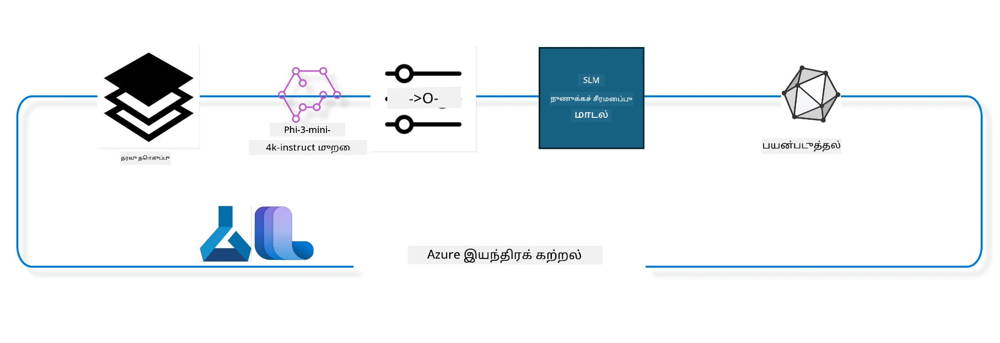

## Azure ML கணினி பதிவகத்திலிருந்து chat-completion கூறுகளை பயன்படுத்தி ஒரு மாதிரியை நுட்பமாக சரிசெய்யும் முறை

இந்த எடுத்துக்காட்டில், ultrachat_200k தரவுத்தொகையைப் பயன்படுத்தி 2 நபர்களுக்கிடையேயான உரையாடலை முடிக்கும் Phi-3-mini-4k-instruct மாதிரியை நுட்பமாக சரிசெய்யும் பணியை மேற்கொள்ள இருக்கிறோம்.



எடுத்துக்காட்டு Azure ML SDK மற்றும் Python பயன்படுத்தி நுட்பமாக சரிசெய்தல் மேற்கொண்டு, பிறகு நேரடி ஊடாட்டுக்கான ஆன்லைன் இறுதிக் கிளைக்கு அந்த நுட்பமாக சரிசெய்யப்பட்ட மாதிரியை பிரயோகிப்பதை காண்பிக்கும்.

### பயிற்சி தரவு

ultrachat_200k தரவுத்தொகையைப் பயன்படுத்துவோம். இது UltraChat தரவுத்தொகையின் மிகவும் வடிகட்டப்பட்ட பதிப்பாகும் மற்றும் Zephyr-7B-β என்ற முன்னணி 7b உரையாடல் மாதிரியை பயிற்றுவிக்க பயன்படுத்தப்பட்டது.

### மாதிரி

chat-completion பணிக்கொரு மாதிரியை தகுந்தவாறு நுட்பமாக சரிசெய்வது எப்படி என்பதை காட்ட Phi-3-mini-4k-instruct மாதிரியைப் பயன்படுத்தப்போகிறோம். நீங்கள் ஒரு குறிப்பிட்ட மாதிரி அட்டையைப் பயன்படுத்தி இந்த நோட்புக் திறந்திருந்தால், அந்த மாதிரியின் பெயரை மாற்ற நினைவில் வையுங்கள்.

### பணிகள்

- நுட்பமாக சரிசெய்ய ஒரு மாதிரியை தேர்வு செய்யவும்.
- பயிற்சி தரவுகளைத் தேர்வு செய்து ஆராயவும்.
- நுட்பம் வேலைத்திட்டத்தை வடிவமைக்கவும்.
- நுட்பம் வேலைத்திட்டத்தை இயக்கவும்.
- பயிற்சி மற்றும் மதிப்பீட்டைக் கவனிக்கவும்.
- நுட்பமாக சரிசெய்யப்பட்ட மாதிரியை பதிவுசெய்க.
- நேரடி ஊடாட்டுக்காக மாதிரியை பிரயோகிக்கவும்.
- வளங்களை சுத்தம் செய்யவும்.

## 1. தேவையான முன்னோடிகளை அமைக்கவும்

- சாராம்சங்களை நிறுவுக
- AzureML வேலை இடைவெளியில் இணைக்கவும். SDK அடையாளமிடலை அமைக்கும் முறையைப் பற்றி மேலதிகமாக அறியவும். கீழுள்ள <WORKSPACE_NAME>, <RESOURCE_GROUP> மற்றும் <SUBSCRIPTION_ID> யை மாற்றவும்.
- azureml கணினி பதிவகத்திற்கோடு இணைக்கவும்
- விருப்பமான பரிசோதனைப் பெயரை அமைக்கவும்
- கணினியைச் சரிபார்க்கவோ அல்லது உருவாக்கவோ செய்யவும்.

> [!NOTE]
> தேவைகள் ஒரு GPU மட்டமின்றி பல GPU கார்டுகளுடன் ஒரு GPU முனையில் இருக்கலாம். உதாரணமாக, Standard_NC24rs_v3 இன் ஒரு முனையில் 4 NVIDIA V100 GPUகள் உள்ளன, ஆனால் Standard_NC12s_v3 இல் 2 NVIDIA V100 GPUகள் உள்ளன. பின்வரும் ஆவணங்களை பாருங்கள். ஒவ்வொரு முனைக்கும் இருக்கும் GPU கார்ட்களின் எண்ணிக்கை param gpus_per_node இல் அமைக்கப்பட்டுள்ளது. இந்த மதிப்பை சரியாக அமைத்தால் முனைவில் உள்ள அனைத்து GPUகளும் பயன்பெறும். பரிந்துரைக்கப்படும் GPU கணினி SKUகளை இங்கு மற்றும் இங்கு காணலாம்.

### Python நூலகங்கள்

கீழ் செலாக்கத்தை இயக்கி சாராம்சங்களை நிறுவுக. புதிய சூழலில் இயக்கும்போது இது தவிர்க்கக்கூடிய படி அல்ல.

```bash
pip install azure-ai-ml
pip install azure-identity
pip install datasets==2.9.0
pip install mlflow
pip install azureml-mlflow
```

### Azure ML உடன் தொடர்பு கொள்வது

1. இந்த Python ஸ்கிரிப்ட் Azure Machine Learning (Azure ML) சேவையுடன் செயல்பட பயன்படுத்தப்படுகிறது. இது செய்கின்றவை:

    - azure.ai.ml, azure.identity மற்றும் azure.ai.ml.entities பெக்கேஜ்களில் இருந்து தேவையான முறைகளை இறக்குமதி செய்கிறது. time மொட்டையைவும் இறக்குமதி செய்கிறது.

    - DefaultAzureCredential() மூலம் அங்கீகாரம் பெற முயற்சிக்கிறது, இது Azure கிளவுடில் விரைவில் செயலிகள் உருவாக்க உதவும் எளிய அங்கீகாரம் முறையாகும். தோல்வியின்போது InteractiveBrowserCredential() மூலம் இடைநிலை உலாவி முறையான உள்நுழைவை வழங்கும்.

    - பிறகு from_config முறையால் MLClient ஐ உருவாக்க முயற்சிக்கிறது, இது இயல்புத் தளப்போது உள்ள config.json கோப்பில் உள்ள ஏற்பாடுகளைப் பயன்படுத்தும். தோல்வியின்போது subscription_id, resource_group_name மற்றும் workspace_name கள் வழங்கி MLClient ஐ உருவாக்குகிறது.

    - Azure ML பதிவு "azureml" க்கான மற்றொரு MLClient ஐ உருவாக்குகிறது. இந்த பதிவு மாதிரிகள், நுட்ப மாற்றும் துறைகள் மற்றும் சூழல்களை சேமிக்கிறது.

    - experiment_name ஐ "chat_completion_Phi-3-mini-4k-instruct" என அமைக்கிறது.

    - தற்போதைய நேரத்தைக் கொண்டு (epoch முதல் நொடிகளில்) ஆனி தனித்துவமான காலச்சோறு மாறியை உருவாக்குகிறது. இத எடுத்துக்காட்டு பெயர்கள் மற்றும் பதிப்புகள் உருவாக்க பயன்படுத்தலாம்.

    ```python
    # Azure ML மற்றும் Azure Identity இலிருந்து தேவையான மாட்யூல்கள் இறக்குமதி செய்க
    from azure.ai.ml import MLClient
    from azure.identity import (
        DefaultAzureCredential,
        InteractiveBrowserCredential,
    )
    from azure.ai.ml.entities import AmlCompute
    import time  # நேர மாட்யூல் இறக்குமதி செய்க
    
    # DefaultAzureCredential பயன்படுத்தி அங்கீகாரம் செய்ய முயற்சிக்க
    try:
        credential = DefaultAzureCredential()
        credential.get_token("https://management.azure.com/.default")
    except Exception as ex:  # DefaultAzureCredential தோல்வியடைந்தால், InteractiveBrowserCredential பயன்படுத்தவும்
        credential = InteractiveBrowserCredential()
    
    # இயல்புநிலை கட்டமைப்பு கோப்பைப் பயன்படுத்தி MLClient உதாரணம் உருவாக்க முயற்சிக்க
    try:
        workspace_ml_client = MLClient.from_config(credential=credential)
    except:  # அது தோல்வியடைந்தால், விவரங்களை கைமுறையாக வழங்கி MLClient உதாரணம் உருவாக்கவும்
        workspace_ml_client = MLClient(
            credential,
            subscription_id="<SUBSCRIPTION_ID>",
            resource_group_name="<RESOURCE_GROUP>",
            workspace_name="<WORKSPACE_NAME>",
        )
    
    # "azureml" எனும் Azure ML பதிவு நிலையுக்கான மற்றொரு MLClient உதாரணத்தை உருவாக்கவும்
    # இந்த பதிவு நிலையத்தில் மாதிரிகள், நுணுக்கப்பயிற்சி குழாய் மற்றும் சூழல்கள் சேமிக்கப்படுகின்றன
    registry_ml_client = MLClient(credential, registry_name="azureml")
    
    # பரிசோதனை பெயரை அமைக்கவும்
    experiment_name = "chat_completion_Phi-3-mini-4k-instruct"
    
    # தனிப்பட்ட பெயர்கள் மற்றும் பதிப்புகளுக்கு பயன்படுத்தக்கூடிய தனிச்சிறப்பு நேரமுத்திரையை உருவாக்கவும்
    timestamp = str(int(time.time()))
    ```

## 2. நுட்பமாகச் சரிசெய்ய அடிப்படையான மாதிரியை தேர்வு செய்யவும்

1. Phi-3-mini-4k-instruct என்பது Phi-2 பயன்பட்ட தரவுத்தொகைகளிலார்ந்த 3.8 பில்லியன் அளவிடப்பட்ட, இலகுரக, முன்னணி திறனுள்ள திறந்த மாதிரி ஆகும். இந்த மாதிரி Phi-3 குடும்பத்தின் ஒரு பகுதியாகும், மேலும் Mini பதிப்பு 4K மற்றும் 128K என்ற இரண்டு வகைகளில் வருகிறது, இது ஆதரிக்கும் பாதிப்பு நீளம் (tokens). நமக்கு தேவையானவாறு மாதிரியை நுட்பமாக மாற்ற வேண்டும். AzureML Studio இல் Model Catalog இல் இந்த மாதிரிகளை chat-completion பணிக்கான வடிகாட்டி இணைத்து ஆராயலாம். இந்த எடுத்துக்காட்டில் Phi-3-mini-4k-instruct மாதிரியை பயன்படுத்துவோம். நீங்கள் வேறு மாதிரிக்கான நோட்புக் திறந்திருந்தால், அதற்கு ஏற்ப பெயர் மற்றும் பதிப்பை மாற்றவும்.

> [!NOTE]
> மாதிரி அடையாளத்தை fine tuning பணிக்கு உள்ளீடாக வழங்கும். இது AzureML Studio Model Catalog இல் Asset ID புலமாகும்.

2. இந்த Python ஸ்கிரிப்ட் Azure ML சேவையைப் பயன்படுத்தி செயல்படுகிறது. செய்கின்றவை:

    - model_name ஐ "Phi-3-mini-4k-instruct" ஆக அமைக்கிறது.

    - registry_ml_client என்பதன் models உருப்படியின் get முறையைப் பயன்படுத்தி, Azure ML பதிவகத்திலிருந்து குறிக்கோள் மாதிரியின் புதிய பதிப்பை பெறுகிறது. get இரண்டு பராமETERS கொண்டது: மாதிரி பெயர் மற்றும் புதிய பதிப்பை தேர்ந்தெடுப்பதற்கான லேபல்.

    - fine-tuningக்கு பயன்படுத்தப் படும் மாதிரியின் பெயர், பதிப்பு மற்றும் அடையாளம் ஆகிய தகவல்களை console க்கு அச்சிடுகிறது.

    ```python
    # மாடல் பெயரை அமைக்கவும்
    model_name = "Phi-3-mini-4k-instruct"
    
    # Azure ML ரெஜிஸ்ட்ரீயிலிருந்து மாடலின் சமீபத்து பதிப்பை பெறுங்கள்
    foundation_model = registry_ml_client.models.get(model_name, label="latest")
    
    # மாடல் பெயர், பதிப்பு மற்றும் ஐடியை அச்சிடவும்
    # இந்தத் தகவல் கண்காணிப்பு மற்றும் பிழைத்திருத்தத்திற்கு பயனுள்ளது
    print(
        "\n\nUsing model name: {0}, version: {1}, id: {2} for fine tuning".format(
            foundation_model.name, foundation_model.version, foundation_model.id
        )
    )
    ```

## 3. வேலைத்திட்டத்துடன் பயன்படுத்த கணினியை உருவாக்கவும்

நுட்ப மாற்ற வேலைத் திட்டம் GPU கணினியுடனே மட்டுமே இயங்கும். கணினியின் அளவு மாதிரியின் பெருமையைப் பொறுத்தது, பதவியாக சரியான கணினியை அறிந்து எடுக்க கடினமாக இருக்கலாம். இக்கோப்பில் பயனருக்கு சரியான கணினியை தேர்ந்தெடுக்க வழிகாட்டுவோம்.

> [!NOTE]
> கீழே பட்டியலிடப்பட்ட கணினிகள் மிக அதிகபட்ச முறையில் வேலை செய்கின்றன. அமைப்பில் மாற்றங்கள் Cuda Out Of Memory பிழை உருவாக்கக்கூடும். அவ்வாறான சமயங்களில் பெரிய கணினிக்கு மேம்படுத்த முயற்சிக்கவும்.

> [!NOTE]
> கீழே compute_cluster_size தேர்ந்தெடுக்கும் போது, கணினி உங்கள் resource group இல் உள்ளது என்பதை உறுதி செய்யவும். குறைந்தது கணினி கிடைக்காதாவது, அணுகல் கோரிக்கை செய்யலாம்.

### நுட்ப மாற்றத்துக்கு மாதிரிக்கான ஆதரவைச் சரிபார்க்குதல்

1. இந்த Python ஸ்கிரிப்ட் Azure ML மாதிரியுடன் தொடர்பு கொண்டு செய்கிறது. செய்கின்றவை:

    - Python விரைவு சொற்றொடரான astத் தொகுதியை இறக்குமதி செய்கிறது.

    - foundation_model என்பது Azure ML இல் ஒரு மாதிரி ஆகும். அதில் finetune_compute_allow_list என்ற குறிச்சொல் உள்ளதா எனச் சரிபார்க்கிறது. Azure ML இல் குறிச்சொற்கள் என்பது செயலாக்கங்களைக் கொண்டு மாதிரிகளை வடிகட்டி ஒழுங்குபடுத்த பயன்படும் திறமையான key-value ஜோடிகளாகும்.

    - finetune_compute_allow_list குறிச்சொல் இருந்தால், ast.literal_eval மூலம் அதனை பம்பராகபடுத்தி Python பட்டியலாக மாறவைத்து computes_allow_list மாறியிலே பதிந்து, அந்த பட்டியலில் இருந்து கணினியை உருவாக்க அறிவுறுத்தும் செய்தியைக் காட்டுகிறது.

    - குறிச்சொல் இல்லாவிட்டால் computes_allow_list ஐ None ஆக அமைத்து, finetune_compute_allow_list குறிச்சொல் மாதிரியின் குறிச்சொற்களில் இல்லை என்று அச்சிடுகிறது.

    - சுருக்கமாகச் சொன்னால், மாதிரியின் மெட்டாடேட்டாவில் ஒரு குறித்த குறிச்சொல் இருப்பினைச் சரிபார்த்து அது இருந்தால் அந்த மதிப்பை பட்டியலாக மாற்றி பயனருக்கு தகவல் தருகிறது.

    ```python
    # Python அரைசார்பு இலக்கணம் மரங்களை செயலாக்கும் செயல்பாடுகளை வழங்கும் ast மொட்யூலை இறக்குமதி செய்க
    import ast
    
    # மாடலின் குறிச்சொற்களில் 'finetune_compute_allow_list' குறிச்சொல் உள்ளதா என சரிபார்க்கவும்
    if "finetune_compute_allow_list" in foundation_model.tags:
        # குறிச்சொல் இருந்தால், குறிச்சொலின் மதிப்பை (ஒரு ஸ்ட்ரிங்) பாதுகாப்பாக Python பட்டியலாக மாற்ற ast.literal_eval ஐ பயன்படுத்தவும்
        computes_allow_list = ast.literal_eval(
            foundation_model.tags["finetune_compute_allow_list"]
        )  # ஸ்ட்ரிங் ஐ Python பட்டியலாக மாற்றவும்
        # பட்டியலில் இருந்து ஒரு கணக்கீடு உருவாக்க வேண்டும் என்பதைக் காட்டும் செய்தியை அச்சிடுக
        print(f"Please create a compute from the above list - {computes_allow_list}")
    else:
        # குறிச்சொல் இல்லையெனில், computes_allow_list ஐ None ஆக அமைக்கவும்
        computes_allow_list = None
        # 'finetune_compute_allow_list' குறிச்சொல் மாடலின் குறிச்சொற்களில் இல்லை என்பதைக் காட்டும் செய்தியை அச்சிடுக
        print("`finetune_compute_allow_list` is not part of model tags")
    ```

### கணினி நிலையைச் சரிபார்க்குதல்

1. இந்த Python ஸ்கிரிப்ட் Azure ML சேவையுடன் தொடர்பு கொண்டு ஒரு கணினி முனைவின் பல சோதனைகளைச் செய்கிறது. செய்கின்றவை:

    - compute_cluster என்ற பெயரில் Azure ML வேலை இடைவெளியில் கணினி முனையை பெற முயற்சிக்கிறது. அதன் provisioning நிலை "failed" என்றால் ValueError எழுப்புகிறது.

    - computes_allow_list None அல்லாவிட்டால், பட்டியலில் உள்ள அனைத்து கணினி அளவுகளையும் lowercase ஆக மாற்றி தற்போது உள்ள கணினியின் அளவை அத்துடன் ஒப்பிடுகிறது. இல்லை என்றால் ValueError எழுப்புகிறது.

    - computes_allow_list None என்றால், கணினி அளவு ஆதரவு இல்லாத GPU VM அளவுகளின் பட்டியலில் இருக்கிறதா என சரிபார்க்கிறது. இருந்தால் ValueError எழுப்புகிறது.

    - வேலை இடைவெளியில் கிடைக்கும் அனைத்து கணினி அளவுகளின் பட்டியலைப் பெற்று, ஒவ்வொன்றையும் பார்க்கின்றது. தற்போதைய கணினியின் அளவு பொருந்தியால் அந்த கணினிக்கு உடைய GPUகளின் எண்ணிக்கையை பெறுகிறது மற்றும் gpu_count_found ஐ உண்மையாக அமைக்கிறது.

    - gpu_count_found உண்மையானால், கணினி GPUகளின் எண்ணிக்கையை அச்சிடுகிறது. இல்லையெனில் ValueError எழுப்புகிறது.

    - சுருக்கமாகச் சொன்னால், Azure ML வேலை இடைவெளியில் கணினி முனையின் provisioning, அளவு அனுமதி மற்றும் GPU எண்ணிக்கை போன்றவை சரிபார்க்கப்படுகின்றன.

    ```python
    # தவறான செய்தியை அச்சிடு
    print(e)
    # கணக்கிடும் அளவு வேலை இடத்தில் இல்லை என்றால் ValueError எழுப்பவும்
    raise ValueError(
        f"WARNING! Compute size {compute_cluster_size} not available in workspace"
    )
    
    # Azure ML வேலை இடத்தில் இருந்து கணக்கிடும் நிகழ்வை மீட்டெடு
    compute = workspace_ml_client.compute.get(compute_cluster)
    # கணக்கிடும் நிகழ்வின் provision நிலை "தோல்வியடைந்தது" என்பதை சரிபார்
    if compute.provisioning_state.lower() == "failed":
        # provision நிலை "தோல்வியடைந்தது" என்றால் ValueError எழுப்பவும்
        raise ValueError(
            f"Provisioning failed, Compute '{compute_cluster}' is in failed state. "
            f"please try creating a different compute"
        )
    
    # computes_allow_list None அல்லாததா என்பதை பரிசோதிக்கவும்
    if computes_allow_list is not None:
        # computes_allow_list இல் உள்ள அனைத்து கணக்கிடும் அளவுகளையும் கீழ்க்காணும் எழுத்துக்களில் மாற்றவும்
        computes_allow_list_lower_case = [x.lower() for x in computes_allow_list]
        # கணக்கிடும் நிகழ்வின் அளவு computes_allow_list_lower_case இல் உள்ளதா என்பதை சரிபார்
        if compute.size.lower() not in computes_allow_list_lower_case:
            # கணக்கிடும் நிகழ்வின் அளவு computes_allow_list_lower_case இல் இல்லையெனில் ValueError எழுப்பவும்
            raise ValueError(
                f"VM size {compute.size} is not in the allow-listed computes for finetuning"
            )
    else:
        # ஆதரிப்பற்ற GPU VM அளவுகளின் பட்டியலை வரையறுக்கவும்
        unsupported_gpu_vm_list = [
            "standard_nc6",
            "standard_nc12",
            "standard_nc24",
            "standard_nc24r",
        ]
        # கணக்கிடும் நிகழ்வின் அளவு unsupported_gpu_vm_list இல் உள்ளதா என்பதை சரிபார்
        if compute.size.lower() in unsupported_gpu_vm_list:
            # கணக்கிடும் நிகழ்வின் அளவு unsupported_gpu_vm_list இல் இருந்தால் ValueError எழுப்பவும்
            raise ValueError(
                f"VM size {compute.size} is currently not supported for finetuning"
            )
    
    # கணக்கிடும் நிகழ்வில் GPUகள் எத்தனை உள்ளன என்பதை கண்டுபிடிக்க ஒரு கொடி தொடங்கவும்
    gpu_count_found = False
    # வேலை இடத்தில் உள்ள அனைத்து கணக்கிடும் அளவுகளின் பட்டியலை மீட்டெடு
    workspace_compute_sku_list = workspace_ml_client.compute.list_sizes()
    available_sku_sizes = []
    # கிடைக்கும் கணக்கிடும் அளவுகளின் பட்டியலில் ஒவ்வொன்றையும் திரும்ப பார்க்கவும்
    for compute_sku in workspace_compute_sku_list:
        available_sku_sizes.append(compute_sku.name)
        # கணக்கிடும் அளவின் பெயர் கணக்கிடும் நிகழ்வின் அளவுக்கு பொருந்துகிறதா என்று சரிபார்
        if compute_sku.name.lower() == compute.size.lower():
            # பொருந்தினால், அந்த கணக்கிடும் அளவுக்கான GPU எண்ணிக்கையை மீட்டெடுத்து gpu_count_found ஐ True ஆக அமைக்கவும்
            gpus_per_node = compute_sku.gpus
            gpu_count_found = True
    # gpu_count_found True ஆனால், கணக்கிடும் நிகழ்வில் உள்ள GPU எண்ணிக்கையைக் காட்சி செய்யவும்
    if gpu_count_found:
        print(f"Number of GPU's in compute {compute.size}: {gpus_per_node}")
    else:
        # gpu_count_found False ஆனால், ValueError எழுப்பவும்
        raise ValueError(
            f"Number of GPU's in compute {compute.size} not found. Available skus are: {available_sku_sizes}."
            f"This should not happen. Please check the selected compute cluster: {compute_cluster} and try again."
        )
    ```

## 4. மாதிரியை நுட்பமாக மாற்ற தரவை தேர்ந்தெடுக்கவும்

1. ultrachat_200k தரவுத்தொகையைப் பயன்படுத்துகிறோம். தரவுத்தொகையில் நான்கு பிரிவுகள் உள்ளன, அவை ஒவ்வொன்றும் Supervised fine-tuning (sft)ற்கு பொருத்தமானவை.
generation ranking (gen). ஒவ்வொரு பிரிவிற்கான எடுத்துக்காட்டுகளின் எண்ணிக்கை கீழ் காண்பிக்கப்பட்டுள்ளது:

    ```bash
    train_sft test_sft  train_gen  test_gen
    207865  23110  256032  28304
    ```

1. அடுத்து வரும் சில செல்கள் நுட்ப மாற்றத்துக்கான அட்டவணை தரவு நுட்பத்தையும் செய்கின்றன:

### சில தரவு வரிசைகளை காட்சி படுத்துதல்

இம்மாதிரி விரைவாக இயங்க வேண்டும் என்பதால், train_sft, test_sft கோப்புகளில் முன்கூட்டி குறிக்கப்பட்ட வரிசைகளின் 5%யை சேமிக்கிறோம். அதனால் நுட்பமாகச் சரிசெய்யப்பட்ட மாதிரியின் கூற்று குறைந்திருக்கலாம், எனவே அதை நேரடி உலகத் தரவுக்கு பயன்படுத்த கூடாது.
download-dataset.py என்பது ultrachat_200k தரவுத்தொகையைப் பதிவிறக்கம் செய்து நுட்ப மாற்ற பொருத்தமான வடிவத்தில் மாற்ற பயன்படுத்தப்படும். மேலும் தரவுத்தொகை பெரியது என்பதால் இங்கே ஒரு பகுதியையேயே பெற்றுள்ளோம்.

1. கீழின் ஸ்கிரிப்ட் data இன் 5% மட்டுமே பதிவிறக்குகிறது. dataset_split_pc மதிப்பை விருப்பமான சதவிகிதமாக மாற்றி அதிகரிக்கலாம்.

> [!NOTE]
> சில மொழி மாதிரிகளுக்கு வேறு மொழிக்குறிகள் இருந்தால் அதன்படி தரவுத்தொகை நெறிகள் (columns) பெயரட்டையும் பொருந்த வேண்டும்.

1. தரவு எப்படி இருக்குமென்ற எளிய எடுத்துக்காட்டு
chat-completion தரவுத்தொகை parquet வடிவில் சேமிக்கப்பட்டுள்ளது; ஒவ்வொரு நுழைவு பின்வரும் வடிவமைப்பை பின்பற்றுகிறது:

    - இது JSON (JavaScript Object Notation) ஆவணம், இது பரவலாக பயன்படும் தரவு பரிமாற்ற வடிவமாகும். இது கைகூடிய குறியீடு அல்ல, தரவை சேமிக்க மற்றும் கொண்டு செல்ல ஒரு வழி.
    
    - "prompt": இந்த விசைத்தொகம் ஒரு டாஸ்க் அல்லது AI உதவியாளருக்கான கேள்வி ஆகும்.

    - "messages": இந்த விசைத்தொகம் ஒரு பொருட்களிலான வரிசையை வைத்துள்ளது. ஒவ்வொரு பொருளும் பயனர் மற்றும் AI உதவியாளர் இடையேயான உரையாடலைக் குறிக்கும். ஒவ்வொரு செய்தி பொருளுக்கு இரண்டு விசைத்தொகை உள்ளது:

    - "content": செய்தியின் உள்ளடக்கம்.
    - "role": செய்தியினை அனுப்பியவரின் பங்கு (user அல்லது assistant).
    - "prompt_id": குறிப்பிட்ட prompt க்கான தனித்துவ அடையாளம்.

1. இந்த குறிப்பிட்ட JSON ஆவணத்தில், பயனர் ஒரு தீபிர சாகசக் கதைக்குரிய முன்னணி கதாபாத்திரம் உருவாக்குமாறு AI உதவியாளருக்குப் கேட்கிறது. உதவியாளர் பதிலளிக்கிறது, பின்னர் பயனர் மேலும் விவரங்களை கேட்கிறார். உதவியாளர் கூடுதல் விவரங்கள் வழங்க ஒப்புகின்றார். இந்த உரையாடல் குறிப்பிட்ட prompt_id உடன் தொடர்புடையது.

    ```python
    {
        // The task or question posed to an AI assistant
        "prompt": "Create a fully-developed protagonist who is challenged to survive within a dystopian society under the rule of a tyrant. ...",
        
        // An array of objects, each representing a message in a conversation between a user and an AI assistant
        "messages":[
            {
                // The content of the user's message
                "content": "Create a fully-developed protagonist who is challenged to survive within a dystopian society under the rule of a tyrant. ...",
                // The role of the entity that sent the message
                "role": "user"
            },
            {
                // The content of the assistant's message
                "content": "Name: Ava\n\n Ava was just 16 years old when the world as she knew it came crashing down. The government had collapsed, leaving behind a chaotic and lawless society. ...",
                // The role of the entity that sent the message
                "role": "assistant"
            },
            {
                // The content of the user's message
                "content": "Wow, Ava's story is so intense and inspiring! Can you provide me with more details.  ...",
                // The role of the entity that sent the message
                "role": "user"
            }, 
            {
                // The content of the assistant's message
                "content": "Certainly! ....",
                // The role of the entity that sent the message
                "role": "assistant"
            }
        ],
        
        // A unique identifier for the prompt
        "prompt_id": "d938b65dfe31f05f80eb8572964c6673eddbd68eff3db6bd234d7f1e3b86c2af"
    }
    ```

### தரவைப் பதிவிறக்கல்

1. இந்த Python ஸ்கிரிப்ட் download-dataset.py என்ற உதவி ஸ்கிரிப்டை இயக்கி தரவுத்தொகையை பதிவிறக்க பயன்படுகிறது. செய்கின்றவை:

    - os மொட்டையை இறக்குமதி செய்கிறது, இது இயக்க முறைமையின் செயல்பாடுகளை அணுக வழிகாட்டுகிறது.

    - os.system மூலம் download-dataset.py ஸ்கிரிப்டை ஓரளவு கட்டளைகளுடன் இயக்கு, அதாவது HuggingFaceH4/ultrachat_200k தரவுத்தொகை, ultrachat_200k_dataset என்ற அடைவுக்கு, 5% என்ற பகுதியை பிரிக்கும். exit_status என்னும் மாறியில் இயக்க முடிவின் நிலைமை பதிவாகிறது.

    - exit_status 0 அல்லாத போது, தரவுத்தொகை பதிவிறக்கம் செய்ததில் பிழை ஏற்பட்டுள்ளதாக Exception எழுப்புகிறது.

    - சுருக்கமாக, இந்த ஸ்கிரிப்ட் உதவி ஸ்கிரிப்ட் ஓட்டியபின் தோல்வி ஏற்பட்டால் பிழை தரும்.

    ```python
    # இயக்க அமைப்பு சார்ந்த செயல்பாடுகளை பயன்படுத்த ஒரு வழியை வழங்கும் os மாடியூலை இறக்குமதி செய்க
    import os
    
    # குறிப்பிட்ட கட்டளை வரி аргументыனுடன் shell இல் download-dataset.py ஸ்கிரிப்ட்டைப் இயக்க os.system செயல்பாட்டைப் பயன்படுத்துக
    # аргументы தரவுத்தொகுப்பை பதிவிறக்க (HuggingFaceH4/ultrachat_200k), அதனை பதிவிறக்கம் செய்யும் அடைவை (ultrachat_200k_dataset), மற்றும் தரவுத்தொகுப்பின் பகுதியை பிரிக்க (5) குறிப்பிடுகின்றன
    # os.system செயல்பாடு இயக்கிய கட்டளையின் வெளியேற்ற நிலையைத் திருப்புகின்றது; இந்த நிலை exit_status மாறியில் சேமிக்கப்படுகிறது
    exit_status = os.system(
        "python ./download-dataset.py --dataset HuggingFaceH4/ultrachat_200k --download_dir ultrachat_200k_dataset --dataset_split_pc 5"
    )
    
    # exit_status 0 அல்ல என்பதை சரிபார்க்கவும்
    # Unix போன்ற இயக்க அமைப்புகளில், 0 வெளியேற்ற நிலை ஒரு கட்டளை வெற்றிகரமாக இயங்கியதை காட்டுகிறது; பிற எண்கள் பிழையை குறிக்கின்றன
    # exit_status 0 அல்ல என்றால், தரவுத்தொகுப்பை பதிவிறக்குவதில் பிழை ஏற்பட்டதைக் குறிக்கும் செய்தியுடன் ஒரு Exception எழுப்பவும்
    if exit_status != 0:
        raise Exception("Error downloading dataset")
    ```

### தரவை DataFrame ஆக ஏற்றுதல்
1. இந்த Python ஸ்கிரிப்டு ஒரு JSON Lines கோப்பை pandas DataFrame-இல் ஏற்றுகிறது மற்றும் முதல் 5 வரிசைகளை காட்சியிடுகிறது. இது என்ன செய்கிறது என்பதற்கான உட்பிரிவு கீழே உள்ளது:

    - இது pandas நூலகத்தை இறக்குமதி செய்கிறது, இது சக்திவாய்ந்த தரவு கையாளல் மற்றும் பகுப்பாய்வு நூலகமாக உள்ளது.

    - pandas காட்சியிடும் விருப்பங்களில் அதிகபட்ச நெடுவரிசை அகலத்தை 0 ஆக அமைக்கிறது. இதனால் DataFrame அச்சிடும் போது ஒவ்வொரு நெடுவரிசையின் முழு உரையும் துண்டிக்காமல் காட்சியிடப்படும்.

    - pd.read_json செயல்பாட்டை பயன்படுத்தி ultrachat_200k_dataset கோப்புறையில் உள்ள train_sft.jsonl கோப்பை DataFrame-ஆக ஏற்றுகிறது. lines=True என்ற வாதம் JSON Lines வடிவமைப்பில் கோப்பு உள்ளது என்பதைக் குறிக்கிறது, அதாவது ஒவ்வொரு வரியும் தனித்த JSON பொருள் ஆகும்.

    - head முறைமையை பயன்படுத்தி DataFrame-இன் முதல் 5 வரிசைகளை காட்சியிடுகிறது. DataFrame-இல் 5 வரிசைகள் கிட்டாத நிலையில் எல்லாவற்றையும் காட்சியிடும்.

    - சுருக்கமாக, இந்த ஸ்கிரிப்டு JSON Lines கோப்பை DataFrame-இல் ஏற்றுகிறது மற்றும் முழு நெடுவரிசை உரையுடன் முதல் 5 வரிசைகளை காட்சியிடுகிறது.
    
    ```python
    # சக்திவாய்ந்த தரவு பண்பாடு மற்றும் பகுப்பாய்வு நூலகமான pandas நூலகத்தை இறக்குமதி செய்க
    import pandas as pd
    
    # pandas க்கான காட்சிப்படுத்தல் விருப்பங்களில் அதிகபட்ச நெடுக்கு 0 ஆக அமைக்கவும்
    # இது DataFrame அச்சிடும்போது ஒவ்வொரு நெடுவரிசையின் முழு உரையும் குறைக்காமல் காட்சி பெறும் என்று பொருள்
    pd.set_option("display.max_colwidth", 0)
    
    # pd.read_json செயல்பாட்டைப் பயன்படுத்தி ultrachat_200k_dataset கோப்பகத்தில் உள்ள train_sft.jsonl கோப்பை DataFrame ஆக ஏற்றவும்
    # lines=True என்ற வாதம் அந்த கோப்பு JSON Lines வடிவத்தில் இருக்கிறது என்பதை குறிக்கிறது, அங்கு ஒவ்வொரு வரியும் தனித்த JSON பொருள் ஆகும்
    df = pd.read_json("./ultrachat_200k_dataset/train_sft.jsonl", lines=True)
    
    # head முறை மூலம் DataFrame இன் முதல் 5 வரிசைகளை காட்டு
    # DataFrame இல் 5 க்குமேல் வரிசைகள் குறைவாக இருந்தால், அனைத்தையும் காட்டு
    df.head()
    ```

## 5. மாடல் மற்றும் தரவுகளை உள்ளீடுகளாக கொண்டு நன்கு தொகு வேலை அனுப்புக

chat-completion पाइп்லைன் கூறலை பயன்படுத்தும் வேலை உருவாக்குக. நன்கு தொகு வேலைக்கு ஆதரவு அளிக்கும் அனைத்து பராமரிப்புகளையும் பற்றி மேலும் அறியவும்.

### நன்கு தொகு பராமரிப்புகளை வரையறு

1. நன்கு தொகு பராமரிப்புகள் 2 வகைகளில் குழுவாக்கப்படலாம் - பயிற்சி பராமரிப்புகள், மேம்படுத்தல் பராமரிப்புகள்

1. பயிற்சி பராமரிப்புகள் பயிற்சியின் அம்சங்களை வரையறுக்கின்றன -

    - பயன்படுத்த வேண்டிய முன்னெடுத்தவர், அட்டவணையாளர்
    - நன்கு தொகு மேம்படுத்த வேண்டிய அளவுகோல்
    - பயிற்சி படிகள் மற்றும் தொகுதி அளவு மற்றும் பிற
    - மேம்படுத்தல் பராமரிப்புகள் GPU நினைவகத்தை மேம்படுத்துவதற்கு மற்றும் கணக்கீட்டு வளங்களை பயனுள்ளதாக பயன்படுத்த உதவுகின்றன.

1. கீழே இந்த வகைக்கு சொந்தமான சில பராமரிப்புகள் உள்ளன. ஒவ்வொரு மாடலுக்கும் மேம்படுத்தல் பராமரிப்புகள் மாறுபடுகின்றன மற்றும் மாடலை பெட்டி செய்து இந்த மாறுபாடுகளை கையாள்கின்றன.

    - Deepspeed மற்றும் LoRA இயலுமைப்படுத்துக
    - கலந்த துல்லிய பயிற்சி இயலுமைப்படுத்துக
    - பன்முக நோட் பயிற்சி இயலுமைப்படுத்துக

> [!NOTE]
> மேற்பார்வை கொண்ட நன்கு தொகு வேலை alignment இழப்பு அல்லது பேரழிவு மறக்கலுக்கு வழிவகுக்கலாம். இந்த பிரச்சனை இருப்பதை பரிசோதித்து, நன்கு தொகு செய்த பின்alignment கட்டத்தை இயக்க பரிந்துரைக்கப்படுகிறது.

### நன்கு தொகு பராமரிப்புகள்

1. இந்த Python ஸ்கிரிப்ட் ஒரு இயந்திரக் கற்றல் மாடலை நன்கு தொகு செய்ய பராமரிப்புகளை அமைக்கிறது. இது என்ன செய்கிறது என்பதற்கான உட்பிரிவு கீழே உள்ளது:

    - பயிற்சி காலநெடுவீச்சு(epochs), பயிற்சி மற்றும் மதிப்பீடு தொகுதி அளவுகள், கற்றல் விகிதம், கற்றல் விகித அட்டவணையாளர் வகை போன்ற இயல்புநிலை பயிற்சி பராமரிப்புகளை அமைக்கிறது.

    - Layer-wise Relevance Propagation (LoRa) மற்றும் DeepSpeed மற்றும் DeepSpeed கட்டத்தை பயன்படுத்துவது பற்றிய இயல்புநிலை மேம்படுத்தல் பராமரிப்புகளை அமைக்கிறது.

    - பயிற்சி மற்றும் மேம்படுத்தல் பராமரிப்புகளை finetune_parameters என்ற ஒரு dict-ஆக இணைக்கிறது.

    - foundation_model மாடலில் எந்தவொரு மாடல்-குறிப்பிட்ட இயல்புநிலை பராமரிப்புகள் உள்ளதா என்று பார்கிறது. இருந்தால் ஒரு எச்சரிக்கை செய்தியை அச்சிட மற்றும் அந்த இயல்புநிலை மாடல்-குறிப்பிட்ட பராமரிப்புகளால் finetune_parameters dict-ஐ புதுப்பிக்கிறது. ast.literal_eval செயல்பாடு இந்த string வடிவில் உள்ள மாடல்-குறிப்பிட்ட இயல்புநிலைகளை Python dict-ஆக மாற்ற பயன்படுத்தப்படுகிறது.

    - இயக்குவதற்கு பயன்படும் இறுதி நன்கு தொகு பராமரிப்புகளை அச்சிடுகிறது.

    - சுருக்கமாக, இந்த ஸ்கிரிப்ட் இயந்திரக் கற்றல் மாடலை நன்கு தொகு செய்ய பராமரிப்புகளை அமைக்கிறது மற்றும் காண்பிக்கிறது, இயல்புநிலை பராமரிப்புகளை மாடல்-குறிப்பிட்டவைகளால் மாற்றும் திறனுடன்.

    ```python
    # பயிற்சி காலங்கள், பயிற்சி மற்றும் மதிப்பீடு தொகுதிகள், கற்றல் விகிதம், மற்றும் கற்றல் விகிதம் நிர்வாகி வகை போன்ற அத்தாட்சியான பயிற்சி பரிமாணங்களை அமைக்கவும்
    training_parameters = dict(
        num_train_epochs=3,
        per_device_train_batch_size=1,
        per_device_eval_batch_size=1,
        learning_rate=5e-6,
        lr_scheduler_type="cosine",
    )
    
    # Layer-wise Relevance Propagation (LoRa) மற்றும் DeepSpeed பயன்படுத்த வேண்டுமா, DeepSpeed நிலை ஆகியவற்றைப் போன்ற அத்தாட்சியான மேம்பாட்டு பரிமாணங்களை அமைக்கவும்
    optimization_parameters = dict(
        apply_lora="true",
        apply_deepspeed="true",
        deepspeed_stage=2,
    )
    
    # பயிற்சி மற்றும் மேம்பாட்டு பரிமாணங்களை finetune_parameters என்ற ஒரே அகராதியில் இணைக்கவும்
    finetune_parameters = {**training_parameters, **optimization_parameters}
    
    # foundation_model-ல் மூல மாதிரி-சார்ந்த அத்தாட்சியான பரிமாணங்கள் உள்ளனவா என்பதை சரிபார்க்கவும்
    # இருந்தால், ஒரு எச்சரிக்கை செய்தியை அச்சிடு மற்றும் finetune_parameters அகராதி அந்த மாதிரி-சார்ந்த அத்தாட்சிகளால் புதுப்பிக்கவும்
    # ast.literal_eval செயல்பாடு மாதிரி-சார்ந்த அத்தாட்சிகளை ஒரு சரம் இருந்து Python அகராதியாக மாற்ற பயன்படுத்தப்படுகிறது
    if "model_specific_defaults" in foundation_model.tags:
        print("Warning! Model specific defaults exist. The defaults could be overridden.")
        finetune_parameters.update(
            ast.literal_eval(  # சரத்தை Python அகராதியாக மாற்றவும்
                foundation_model.tags["model_specific_defaults"]
            )
        )
    
    # இயக்கத்திற்கு பயன்படுத்த வேண்டிய இறுதி துலக்கும் பரிமாணங்களை அச்சிடவும்
    print(
        f"The following finetune parameters are going to be set for the run: {finetune_parameters}"
    )
    ```

### பயிற்சி பைப்லைன்

1. இந்த Python ஸ்கிரிப்ட் ஒரு இயந்திரக் கற்றல் பயிற்சி பைப்லைனுக்கான காட்சிப்பெயரை உருவாக்கும் ஒரு செயல்பாட்டை வரையறுக்கிறது, பின்னர் அந்த செயல்பாட்டை அழைத்து காட்சிப்பெயரை உருவாக்கி அச்சிடுகிறது. இது என்ன செய்கிறது என்பதற்கான உட்பிரிவு கீழே உள்ளது:

1. get_pipeline_display_name என்ற செயல்பாடு வரையறுக்கப்படுகிறது. இந்த செயல்பாடு பயிற்சி பைப்லைனுடன் தொடர்புடைய பல பராமரிப்புகளை அடிப்படையாக கொண்டு ஒரு காட்சிப்பெயரை உருவாக்குகிறது.

1. செயல்பாட்டில், ஒரு மொத்த தொகுதி அளவைக் கணக்கிடுகிறது. இது சாதனத் தொகுதி அளவு, கம்பியண்ட் படி எண்ணிக்கை, ஒரு நோட்டிற்கான GPU-கள் மற்றும் நன்கு தொகு செய்ய பயன்படுத்தப்படும் நோட் எண்ணிக்கையை பெருக்குகின்றது.

1. கற்றல் விகித அட்டவணையாளர் வகை, DeepSpeed பயன்படுத்துகிறதா, DeepSpeed கட்டம், LoRa பயன்படுத்துகிறதா, பதிப்புக்களைக் காப்பாற்றும் அதிகபட்ச எண்ணிக்கை, மற்றும் அதிகபட்ச வரிசை நீளம் போன்ற மற்ற பல பராமரிப்புகளை பெற்றுக்கொள்கிறது.

1. இவை அனைத்தும் ஹைஃபன்களால் பிரிக்கப்பட்ட ஒரு எழுத்து தொடர்ச்சியை உருவாக்குகிறது. DeepSpeed அல்லது LoRa பயன்படுத்தப்படுகிறதெனில், "ds" மற்றும் DeepSpeed கட்டம், அல்லது "lora" என்ற சொற்கள் இடம் பெறுகின்றன. இல்லையெனில் "nods" அல்லது "nolora" ஆகிய சொற்கள் இடம் பெறும்.

1. இந்த string-ஐ காட்சிப்பெயராக திருப்பி விடுகிறது.

1. செயல்பாடு வரையறுக்கப்பட்ட பின், அது அழைக்கப்படுகிறது மற்றும் உருவாக்கப்பட்ட காட்சிப்பெயர் அச்சிடப்படுகிறது.

1. சுருக்கமாக, இந்த ஸ்கிரிப்ட் இயந்திரக் கற்றல் பயிற்சி பைப்லைனுக்கான காட்சிப்பெயரை பல பராமரிப்புகளுக்காக வழங்கி அச்சிடுகிறது.

    ```python
    # பயிற்சி குழாய்க்கான ஒரு காட்சி பெயரை உருவாக்கும் செயல்பாட்டை வரையறு
    def get_pipeline_display_name():
        # ஒரு சாதனத்துக்கு ஒதுக்கப்பட்ட தொகுப்பு அளவு, கிராடியன்ட் சேர்க்கை படிகள் எண்ணிக்கை, முன்னணிப் பகுதி GPU-களின் எண்ணிக்கை மற்றும் நளினாக்கப் பயன்படும் முனைகளின் எண்ணிக்கையை பெருக்கிவிட்டு மொத்த தொகுப்பு அளவை கணக்கிடு
        batch_size = (
            int(finetune_parameters.get("per_device_train_batch_size", 1))
            * int(finetune_parameters.get("gradient_accumulation_steps", 1))
            * int(gpus_per_node)
            * int(finetune_parameters.get("num_nodes_finetune", 1))
        )
        # கற்றல் வீதி திட்டக்கல அலகை மீட்டெடு
        scheduler = finetune_parameters.get("lr_scheduler_type", "linear")
        # டீப் ஸ்பீடு பயன்படுத்தப்படுகிறதா என்பதை மீட்டெடு
        deepspeed = finetune_parameters.get("apply_deepspeed", "false")
        # டீப் ஸ்பீடு நிலையை மீட்டெடு
        ds_stage = finetune_parameters.get("deepspeed_stage", "2")
        # டீப் ஸ்பீடு பயன்படுத்தப்பட்டால், காட்சி பெயரில் "ds" மற்றும் அதன் நிலையை சேர்க்கவும்; இல்லையெனில் "nods" சேர்க்கவும்
        if deepspeed == "true":
            ds_string = f"ds{ds_stage}"
        else:
            ds_string = "nods"
        # அடுக்குரு தொடர்புடைய தொடர்பீடு (LoRa) பயன்படுத்தப்படுகிறதா என்பதை மீட்டெடு
        lora = finetune_parameters.get("apply_lora", "false")
        # LoRa பயன்படுத்தப்பட்டால் காட்சி பெயரில் "lora" சேர்க்கவும்; இல்லையெனில் "nolora" சேர்க்கவும்
        if lora == "true":
            lora_string = "lora"
        else:
            lora_string = "nolora"
        # மாதிரி சேமிப்புக் குறியீடுகளின் அளவு வரம்பை மீட்டெடு
        save_limit = finetune_parameters.get("save_total_limit", -1)
        # அதிகபட்ச வரிசை நீளம் மீட்டெடு
        seq_len = finetune_parameters.get("max_seq_length", -1)
        # இந்த அனைத்து அளவுருக்களையும் குறுக்கெழுத்து அடிப்படையில் ஒன்றிணைத்து காட்சி பெயரை உருவாக்கு
        return (
            model_name
            + "-"
            + "ultrachat"
            + "-"
            + f"bs{batch_size}"
            + "-"
            + f"{scheduler}"
            + "-"
            + ds_string
            + "-"
            + lora_string
            + f"-save_limit{save_limit}"
            + f"-seqlen{seq_len}"
        )
    
    # காட்சி பெயரை உருவாக்கும் செயல்பாட்டை அழைக்கவும்
    pipeline_display_name = get_pipeline_display_name()
    # காட்சி பெயரை அச்சிடு
    print(f"Display name used for the run: {pipeline_display_name}")
    ```

### பைப்லைன் கட்டமைப்பது

இந்த Python ஸ்கிரிப்ட் Azure Machine Learning SDK-யை பயன்படுத்தி ஒரு இயந்திரக் கற்றல் பைப்லைனைக் வரையறுக்கிறது மற்றும் கட்டமைக்கிறது. இது என்ன செய்கிறது என்பதற்கான உட்பிரிவு கீழே உள்ளது:

1. முக்கியமான முறைகளை Azure AI ML SDK-யிலிருந்து இறக்குமதி செய்கிறது.

1. "chat_completion_pipeline" என்ற பெயரில் ஒரு பைப்லைன் கூறலை பதிவகத்திலிருந்து பெற்றுக்கொள்கிறது.

1. `@pipeline` அலங்காரியுடன் `create_pipeline` என்ற செயல்பாட்டை பயன்படுத்தி பைப்லைன் வேலைவை வரையறுக்கிறது. பைப்லைன் பெயர் `pipeline_display_name` ஆக அமைக்கப்பட்டுள்ளது.

1. `create_pipeline` செயல்பாட்டின் உள்ளே, பெற்றுக்கொண்ட பைப்லைன் கூறலை பல பராமரிப்புகளுடன் ஆரம்பிக்கிறது, அவற்றில் மாடல் பாதை, வேறுபட்ட கட்டங்களுக்கான கணினி தொகுதிகள், பயிற்சி மற்றும் சோதனை இடம் பிரிவுகள், நன்கு தொகு செய்ய GPU-கள் எண்ணிக்கை மற்றும் பிற நன்கு தொகு பராமரிப்புகள் உள்ளன.

1. நன்கு தொகு வேலைவிலிருந்து வெளியீட்டை பைப்லைன் வேலையின் வெளியீட்டுடன் இணைக்கிறது. இது நன்கு தொகு செய்யப்பட்ட மாடலை எளிதில் பதிவு செய்ய உதவுகிறது, மேலும் இந்த மாடலை ஆன்லைன் அல்லது தொகுப்பு நிறுத்தல் இடத்துக்கு கொண்டு செல்ல தேவையானது.

1. `create_pipeline` செயல்பாட்டை அழைத்து பைப்லைன் உதாரணத்தை உருவாக்குகிறது.

1. பைப்லைனில் `force_rerun` அமைப்பை `True` ஆக அமைக்கிறது, இதனால் முந்தைய வேலைகளின் சேமிக்கப்பட்ட முடிவுகள் பயன்படுத்தப்பட மாட்டா எனும் அர்த்தம்.

1. பைப்லைனில் `continue_on_step_failure` அமைப்பை `False` ஆக அமைக்கிறது, அதாவது எந்த ஒரு படியும் தோல்வியடைந்தால் பைப்லைன் நிறுத்தப்படும்.

1. சுருக்கமாக, இந்த ஸ்கிரிப்ட் Azure Machine Learning SDK-யைப் பயன்படுத்தி ஒரு உரையாடல் நிறைவு பணிக்கான இயந்திரக் கற்றல் பைப்லைனைக் வரையறுத்து கட்டமைக்கிறது.

    ```python
    # Azure AI ML SDK இலிருந்து தேவையான முறைமைகள் இறக்குமதி செய்யவும்
    from azure.ai.ml.dsl import pipeline
    from azure.ai.ml import Input
    
    # பதிவு நிலையத்திலிருந்து "chat_completion_pipeline" என்ற பெயருடைய குழாய் கூறைப் பெற்றுக்கொள்ளவும்
    pipeline_component_func = registry_ml_client.components.get(
        name="chat_completion_pipeline", label="latest"
    )
    
    # @pipeline அலங்காரம் மற்றும் create_pipeline செயல்பாட்டைப் பயன்படுத்தி குழாய் வேலைவாய்ப்பு வரையறுக்கவும்
    # குழாயின் பெயர் pipeline_display_name ஆக அமைக்கப்பட்டது
    @pipeline(name=pipeline_display_name)
    def create_pipeline():
        # பெறப்பட்ட குழாய் கூறை வித்தியாசமான அளவுருக்களுடன் ஆரம்பிக்கவும்
        # இதில் மாடல் பாதை, வெவ்வேறு கட்டங்களுக்கான கணிப்பு குழுக்கள், பயிற்சி மற்றும் சோதனைக்கான தரவுத்தொகுப்பு பிரிவுகள், நுட்பமயமாக்க பயன்படும் GPU-களின் எண்ணிக்கை மற்றும் பிற நுட்பமயமாக்க அளவுருக்கள் அடங்கும்
        chat_completion_pipeline = pipeline_component_func(
            mlflow_model_path=foundation_model.id,
            compute_model_import=compute_cluster,
            compute_preprocess=compute_cluster,
            compute_finetune=compute_cluster,
            compute_model_evaluation=compute_cluster,
            # தரவுத்தொகுப்பு பிரிவுகளை அளவுருக்களுடன் ஒத்திசைக்கவும்
            train_file_path=Input(
                type="uri_file", path="./ultrachat_200k_dataset/train_sft.jsonl"
            ),
            test_file_path=Input(
                type="uri_file", path="./ultrachat_200k_dataset/test_sft.jsonl"
            ),
            # பயிற்சி அமைப்புகள்
            number_of_gpu_to_use_finetuning=gpus_per_node,  # கணிப்பில் கிடைக்கும் GPU-களின் எண்ணிக்கையாக அமைக்கவும்
            **finetune_parameters
        )
        return {
            # நுட்பமாக்க வேலைவாய்ப்பின் வெளியீட்டினை குழாய் வேலைவாய்ப்பின் வெளியீட்டுடன் ஒத்திசைக்கவும்
            # இது நுட்பமாக்கப்பட்ட மாடலை எளிதாக பதிவு செய்ய செய்வதற்காக செய்யப்படுகிறது
            # மாடலை ஆன்லைன் அல்லது தொகுப்புக் குறிச்சியில் இயக்க பதிவு செய்ய வேண்டும்
            "trained_model": chat_completion_pipeline.outputs.mlflow_model_folder
        }
    
    # create_pipeline செயல்பாட்டை அழைத்து குழாயின் ஒரு உதாரணத்தை உருவாக்கவும்
    pipeline_object = create_pipeline()
    
    # முந்தைய வேலைவாய்ப்புகளின் சேமிக்கப்பட்ட முடிவுகளை பயன்படுத்தாதீர்கள்
    pipeline_object.settings.force_rerun = True
    
    # படி தோல்வியில் தொடர சீரமைப்பை False ஆக அமைக்கவும்
    # இதன் பொருள், எந்த ஒரு படியும் தோல்வியடைந்தால் குழாய் நிறுத்தப்படும் என்பது ஆகும்
    pipeline_object.settings.continue_on_step_failure = False
    ```

### வேலை அனுப்புக

1. இந்த Python ஸ்கிரிப்ட் ஒரு இயந்திரக் கற்றல் பைப்லைன் வேலைவை Azure Machine Learning பணிமனையில் அனுப்பி, பின்னர் அந்த வேலை முடிவதற்காக காத்திருக்கிறது. இது என்ன செய்கிறது என்பதற்கான உட்பிரிவு கீழே உள்ளது:

    - workspace_ml_client இன் jobs பொருளின் create_or_update முறையை அழைத்து பைப்லைன் வேலை அனுப்பப்படுகிறது. இயக்க வேண்டிய பைப்லைனுக்கு pipeline_object குறிப்பிடப்பட்டுள்ளது மற்றும் வேலையிட ஏற்பாடு செய்யும் பரீட்சை experiment_name மூலம் குறிப்பிடப்பட்டுள்ளது.

    - பின்னர் workspace_ml_client இன் jobs பொருளின் stream முறையை அழைத்து பைப்லைன் வேலை முடிவதற்காக காத்திருக்கிறது. காத்திருக்க வேண்டிய வேலை pipepline_job பொருளின் name பண்பின் மூலம் குறிப்பிடப்பட்டுள்ளது.

    - சுருக்கமாக, இந்த ஸ்கிரிப்ட் ஒரு இயந்திரக் கற்றல் பைப்லைன் வேலைவை Azure Machine Learning பணிமனையில் அனுப்பி, வேலை முடிவதற்காக காத்திருக்கிறது.

    ```python
    # Azure மெஷின் லெர்னிங் வேலைத் தளத்துக்கு பைப்லைன் வேலைத்தை சமர்ப்பிக்கவும்
    # இயக்கப்படவேண்டிய பைப்லைன் pipeline_object மூலம் குறிப்பிடப்பட்டுள்ளது
    # வேலை இயக்கப்படும் பயிற்சி experiment_name மூலம் குறிப்பிடப்பட்டுள்ளது
    pipeline_job = workspace_ml_client.jobs.create_or_update(
        pipeline_object, experiment_name=experiment_name
    )
    
    # பைப்லைன் வேலை முடிவடையும் வரை காத்திருக்கவும்
    # காத்திருக்க வேண்டிய வேலை pipeline_job பொருளின் name பண்பால் குறிப்பிடப்பட்டுள்ளது
    workspace_ml_client.jobs.stream(pipeline_job.name)
    ```

## 6. நன்கு தொகு செய்யப்பட்ட மாடலை பணிமனையில் பதிவு செய்க

நாங்கள் நன்கு தொகு வேலைவிலிருந்து வெளியீட்டைப் பயன்படுத்தி மாடலை பதிவு செய்யப்போகிறோம். இதன் மூலம் நன்கு தொகு செய்யப்பட்ட மாடலும் நன்கு தொகு வேலைவும் இடையேயான தொடர்பை கண்காணிக்கலாம். நன்கு தொகு வேலை, மேலும், அடிப்படை மாடல், தரவு மற்றும் பயிற்சி குறியீட்டை தொடர்பு கோடிடுகிறது.

### ML மாடல் பதிவுசெய்தல்

1. இந்த Python ஸ்கிரிப்ட் Azure Machine Learning பைப்லைனில் பயிற்சி பெற்ற இயந்திரக் கற்றல் மாடலை பதிவு செய்கிறது. இது என்ன செய்கிறது என்பதற்கான உட்பிரிவு கீழே உள்ளது:

    - Azure AI ML SDK-யிலிருந்து தேவையான முறைகளை இறக்குமதி செய்கிறது.

    - pipeline வேலைவிலிருந்து trained_model வெளியீடு கிடைக்கிறதா என்று workspace_ml_client இன் jobs பொருளின் get முறையைக் கால் செய்து அதன் outputs பண்பை அணுகி சரிபார்க்கிறது.

    - pipeline வேலை பெயர் மற்றும் வெளியீட்டின் பெயர் ("trained_model") பயன்படுத்தி பயிற்சி பெற்ற மாடல் பாதையை உருவாக்குகிறது.

    - முந்தைய மாடல் பெயருக்கு "-ultrachat-200k" தொடர் போர்த்துகிறது மற்றும் ஸ்லாஷ் கொண்ட பாடங்களை மினுஷண்களால் மாற்றி நன்கு தொகு செய்யப்பட்ட மாடலுக்கான பெயரை வரையறுக்கிறது.

    - Model பொருளை உருவாக்கி பின்வரும் பல பராமரிப்புகளுடன் - மாடல் பாதை, மாடல் வகை (MLflow மாடல்), பெயர், பதிப்பு மற்றும் விளக்கம் ஆகியவை உள்ளன - மாடலை பதிவு செய்ய தயாராக்குகிறது.

    - workspace_ml_client இன் models பொருளின் create_or_update முறையை அழைத்து Model பொருளை மூலமாகக் கொண்டு மாடலை பதிவு செய்கிறது.

    - பதிவு செய்யப்பட்ட மாடலை அச்சிடுகிறது.

1. சுருக்கமாக, இந்த ஸ்கிரிப்ட் Azure Machine Learning பைப்லைனில் பயிற்சி பெற்ற ஒரு இயந்திரக் கற்றல் மாடலை பதிவு செய்கிறது.
    
    ```python
    # Azure AI ML SDK இலிருந்து தேவையான மொடியூல்களை இறக்குமதி செய்க
    from azure.ai.ml.entities import Model
    from azure.ai.ml.constants import AssetTypes
    
    # पाइப்லைன் வேலைப்பாடில் `trained_model` আவுட்பুট் கிடைக்குமா என்பதைக் சோதிக்கவும்
    print("pipeline job outputs: ", workspace_ml_client.jobs.get(pipeline_job.name).outputs)
    
    # पाइपிளைன்ஜாப் பெயர் மற்றும் வெளியீடு பெயர் ("trained_model") கொண்ட சரத்தை வடிவமைத்து பயிற்சி பெற்ற மாதிரிக்கான பாதையை உருவாக்கவும்
    model_path_from_job = "azureml://jobs/{0}/outputs/{1}".format(
        pipeline_job.name, "trained_model"
    )
    
    # பழைய மாதிரி பெயரில் "-ultrachat-200k" சேர்த்து ஸ்லாஷ்களை ஹைபன்களில் மாற்றி நுட்பமாக செய்யப்பட்ட மாதிரிக்கான பெயரை வரையறுக்கவும்
    finetuned_model_name = model_name + "-ultrachat-200k"
    finetuned_model_name = finetuned_model_name.replace("/", "-")
    
    print("path to register model: ", model_path_from_job)
    
    # பல்வேறு அளவுருக்களுடன் Model பொருளை உருவாக்கி மாதிரியை பதிவு செய்ய தயாராகவும்
    # இதில் மாதிரி பாதை, மாதிரி வகை (MLflow மாதிரி), மாதிரி பெயர் மற்றும் பதிப்பு, மற்றும் மாதிரி விளக்கம் அடங்கும்
    prepare_to_register_model = Model(
        path=model_path_from_job,
        type=AssetTypes.MLFLOW_MODEL,
        name=finetuned_model_name,
        version=timestamp,  # பதிப்பு முரண்பாட்டை தவிர்க்க காலஅப்பத்தை பதிப்பாக பயன்படுத்தவும்
        description=model_name + " fine tuned model for ultrachat 200k chat-completion",
    )
    
    print("prepare to register model: \n", prepare_to_register_model)
    
    # Workspace_ml_client இல் உள்ள models பொருளின் create_or_update முறைமையை Model பொருளுடன் அழைத்து மாதிரியை பதிவு செய்க
    registered_model = workspace_ml_client.models.create_or_update(
        prepare_to_register_model
    )
    
    # பதிவு செய்யப்பட்ட மாதிரியை அச்சிடுக
    print("registered model: \n", registered_model)
    ```

## 7. நன்கு தொகு செய்யப்பட்ட மாடலை ஒரு ஆன்லைன் நிறுத்தலுக்கு நிலைநிறுத்துக

ஆன்லைன் நிறுத்தல்கள் நீடித்த REST API-களை வழங்கும், மாடலைப் பயன்படுத்த விரும்பும் பயன்பாடுகளுடன் ஒருங்கிணைக்க உதவும்.

### நிறுத்தல் நிர்வாகம்

1. இந்த Python ஸ்கிரிப்ட் Azure Machine Learning-இல் பதிவு செய்யப்பட்ட மாடலுக்கான மேலாண்மை ஆன்லைன் நிறுத்தலை உருவாக்குகிறது. இது என்ன செய்கிறது என்பதற்கான உட்பிரிவு கீழே உள்ளது:

    - Azure AI ML SDK-யிலிருந்து தேவையான முறைகளை இறக்குமதி செய்கிறது.

    - "ultrachat-completion-" என்ற சரங்களுக்கு நேரத்தொகை ஒன்றை தொடர்த்திக் கொண்டு தனித்துவமான நிறுத்தல் பெயரை வரையறுக்கிறது.

    - ManagedOnlineEndpoint பொருளை உருவாக்கி நிறுத்தல் பெயர், விளக்கம் மற்றும் அங்கீகார முறையை ("key") உட்பட பல பராமரிப்புகளுடன் நிறுத்தலை உருவாக்க தயாராகிறது.

    - workspace_ml_client இன் begin_create_or_update முறையை அழைத்து ManagedOnlineEndpoint பொருளை அனுப்புகிறது. ஆனபின் wait முறையை அழைத்து உருவாக்கல் செயல்பாட்டின் நிறைவைக் காத்திருக்கிறது.

1. சுருக்கமாக, இந்த ஸ்கிரிப்ட் Azure Machine Learning-இல் பதிவு செய்யப்பட்ட மாடலுக்கான மேலாண்மை ஆன்லைன் நிறுத்தலை உருவாக்குகிறது.

    ```python
    # Azure AI ML SDK இல் இருந்து தேவையான தொகுதிகளை இறக்குமதி செய்க
    from azure.ai.ml.entities import (
        ManagedOnlineEndpoint,
        ManagedOnlineDeployment,
        ProbeSettings,
        OnlineRequestSettings,
    )
    
    # "ultrachat-completion-" என்ற உரைக்குப் பின்னர் ஒரு காலஅடிப்படையிலான அட்டவணையை சேர்த்து ஆன்லைன் முடிவுப் புள்ளிக்கான தனித்துவமான பெயரை வரையறு
    online_endpoint_name = "ultrachat-completion-" + timestamp
    
    # பல்வேறு அளவுருக்களுடன் ManagedOnlineEndpoint பொருளை உருவாக்குவதன் மூலம் ஆன்லைன் முடிவுப் புள்ளியை உருவாக்க தயாராக வேண்டும்
    # இதில் முடிவுப் புள்ளியின் பெயர், முடிவுப் புள்ளியின் விளக்கம் மற்றும் அங்கீகார முறை ("key") அடங்கும்
    endpoint = ManagedOnlineEndpoint(
        name=online_endpoint_name,
        description="Online endpoint for "
        + registered_model.name
        + ", fine tuned model for ultrachat-200k-chat-completion",
        auth_mode="key",
    )
    
    # ManagedOnlineEndpoint பொருளை வாதமாகக் கொண்டு workspace_ml_client இன் begin_create_or_update முறை மூலம் ஆன்லைன் முடிவுப் புள்ளியை உருவாக்குக
    # பின்னர் wait முறையை அழைத்து உருவாக்கும் செயல்பாடு முடியும் வரை காத்திரு
    workspace_ml_client.begin_create_or_update(endpoint).wait()
    ```

> [!NOTE]
> நிறுத்தலுக்கு ஆதரவு அளிக்கும் SKU-க்களின் பட்டியலை இங்கே காணலாம் - [Managed online endpoints SKU list](https://learn.microsoft.com/azure/machine-learning/reference-managed-online-endpoints-vm-sku-list)

### ML மாடல் நிலைநிறுத்தல்

1. இந்த Python ஸ்கிரிப்ட் பதிவு செய்யப்பட்ட இயந்திரக் கற்றல் மாடலை Azure Machine Learning-இல் மேலாண்மை ஆன்லைன் நிறுத்தலுக்கு நிலைநிறுத்துகிறது. இது என்ன செய்கிறது என்பதற்கான உட்பிரிவு கீழே உள்ளது:

    - Python ஒழுங்கமைவு மரங்களை செயலாக்கும் ast மாட்யூலை இறக்குமதி செய்கிறது.

    - நிலைநிறுத்தல் அலகு வகையை "Standard_NC6s_v3" ஆக அமைக்கிறது.

    - foundation model-ல் inference_compute_allow_list குறிச்சொல் இருந்தால், அதன் மதிப்பை string-இல் இருந்து Python பட்டியலாக மாற்றி inference_computes_allow_list ஆக ஒதுக்குகிறது. இல்லையெனில் None ஆக வைக்கிறது.

    - குறிப்பிடப்பட்ட அலகு வகை அனுமதி பட்டியலில் இல்லையென்றால், பயனரை அனுமதி பட்டியலில் உள்ள அலகு வகையைத் தேர்ந்தெடுக்குமாறு வேண்டுகோள் அச்சிடுகிறது.

    - ManagedOnlineDeployment பொருளை உருவாக்கி நிலைநிறுத்தல் பெயர், நிறுத்தல் பெயர், மாடல் ID, அலகு வகை மற்றும் எண்ணிக்கை, liveness ப்ரோப் அமைப்புகள் மற்றும் கோரிக்கை அமைப்புகள் உட்பட பல பராமரிப்புகளுடன் நிலைநிறுத்தல் செய்ய தயாராகிறது.

    - workspace_ml_client இன் begin_create_or_update முறையை அழைத்து ManagedOnlineDeployment பொருளை அனுப்பி நிலைநிறுத்தலை உருவாக்குகிறது மற்றும் wait முறையை அழைத்து செயல்பாட்டு முடிவை காத்திருக்கிறது.

    - நிறுத்தலின் போக்குவரத்தை 100% "demo" நிலைநிறுத்தலுக்கு நேரடியாக அமைக்கிறது.

    - workspace_ml_client இன் begin_create_or_update முறையை அழைத்து நிறுத்தல் பொருளை புதுப்பிக்கிறது மற்றும் result முறையை அழைத்து புதுப்பிப்பு நிறைவினை காத்திருக்கிறது.

1. சுருக்கமாக, இந்த ஸ்கிரிப்ட் பதிவு செய்யப்பட்ட இயந்திரக் கற்றல் மாடலை Azure Machine Learning-இல் மேலாண்மை ஆன்லைன் நிறுத்தலுக்கு நிலைநிறுத்துகிறது.

    ```python
    # பைதான் 추상 பேச்சு புடவை மரங்களை செயலாக்கும் செயல்பாடுகளை வழங்கும் ast என்ற மொட்யூலை இறக்குமதி செய்க
    import ast
    
    # பிரசாரத்திற்கு நேரின் வகையை அமைக்க
    instance_type = "Standard_NC6s_v3"
    
    # அடித்தளம் மாதிரியில் `inference_compute_allow_list` குறிச்சொல் உள்ளதா என்று பரிசோதிக்க
    if "inference_compute_allow_list" in foundation_model.tags:
        # அது இருந்தால், குறிச்சொல் மதிப்பை ஒரு தொடரில் இருந்து பைதான் பட்டியலாக மாற்றி `inference_computes_allow_list` க்கு நியமிக்க
        inference_computes_allow_list = ast.literal_eval(
            foundation_model.tags["inference_compute_allow_list"]
        )
        print(f"Please create a compute from the above list - {computes_allow_list}")
    else:
        # இல்லையெனில், `inference_computes_allow_list` ஐ `None` ஆக அமைக்க
        inference_computes_allow_list = None
        print("`inference_compute_allow_list` is not part of model tags")
    
    # குறிப்பிடப்பட்ட நேரின் வகை அனுமதி பட்டியலில் உள்ளதா என பரிசோதிக்க
    if (
        inference_computes_allow_list is not None
        and instance_type not in inference_computes_allow_list
    ):
        print(
            f"`instance_type` is not in the allow listed compute. Please select a value from {inference_computes_allow_list}"
        )
    
    # பல்வேறு அளவுருக்களுடன் `ManagedOnlineDeployment` பொருளை உருவாக்கி பிரசாரத்தை தயாராக செய்க
    demo_deployment = ManagedOnlineDeployment(
        name="demo",
        endpoint_name=online_endpoint_name,
        model=registered_model.id,
        instance_type=instance_type,
        instance_count=1,
        liveness_probe=ProbeSettings(initial_delay=600),
        request_settings=OnlineRequestSettings(request_timeout_ms=90000),
    )
    
    # `workspace_ml_client` இன் `begin_create_or_update` முறையை `ManagedOnlineDeployment` பொருளுடன் அழைத்து பிரசாரத்தை உருவாக்குக
    # பின்னர் உருவாக்கும் செயல்முறையை முடிக்க `wait` முறையை அழைக்க காத்திரு
    workspace_ml_client.online_deployments.begin_create_or_update(demo_deployment).wait()
    
    # "demo" பிரசாரத்துக்கு 100% போக்குவரத்தை நேர்மாறுக் குடுக்க எண்ட்பாயின்ட் போக்குவரத்தை அமைக்க
    endpoint.traffic = {"demo": 100}
    
    # `workspace_ml_client` இன் `begin_create_or_update` முறையை `endpoint` பொருளுடன் அழைத்து எண்ட்பாயின்டை புதுப்பிக்க
    # பின்னர் புதுப்பிப்பு செயல்முறையை முடிக்க `result` முறையை அழைக்க காத்திரு
    workspace_ml_client.begin_create_or_update(endpoint).result()
    ```

## 8. மாதிரி தரவுடன் நிறுத்தலை பரிசோதிக்கவும்

நாம் சோதனை தரவுத்தொகுதியில் இருந்து சில மாதிரி தரவுகளை மீட்டெடுத்து ஆன்லைன் நிறுத்தலுக்கு பகுப்பாய்வுக்காக சமர்ப்பிப்போம். பின்னர் மதிப்பீட்டுச் சின்னங்களையும் நிலை உண்மை சின்னங்களையும் பக்கமறைதான் காட்டுவோம்.

### முடிவுகளை வாசித்தல்

1. இந்த Python ஸ்கிரிப்ட் JSON Lines கோப்பை pandas DataFrame-இல் வாசித்து, ஒரு சீரற்ற எடுத்துக்காட்டை எடுத்து, குறியீட்டை மீட்டமைக்கிறது. இது என்ன செய்கிறது என்பதற்கான உட்பிரிவு கீழே உள்ளது:

    - ./ultrachat_200k_dataset/test_gen.jsonl கோப்பை pandas DataFrame-இல் வாசிக்கிறது. read_json செயல்பாடு lines=True வாதத்துடன் பயன்படுத்த படுகிறது, ஏனெனில் கோப்பு JSON Lines வடிவில் உள்ளது, ஒவ்வொரு வரியும் தனித்த JSON பொருள் ஆகும்.

    - DataFrame-இல் இருந்து 1 வரிசையை சீரற்ற எடுத்துக்காட்டாக எடுக்கிறது. sample செயல்பாடு n=1 என கொடுத்து எத்தனை வரிசைகள் எடுத்துக்கொள்ளவேண்டுமென்பதை குறிப்பிடுகிறது.

    - DataFrame-இன் குறியீட்டை மீட்டமைக்கிறது. reset_index செயல்பாடு drop=True உடன் எழுதி, பழைய குறியீட்டை அகற்றும் மற்றும் இயல்புநிலை முழுமதிப்பொருள் குறியீடு நியமிக்கும்.

    - head செயல்பாட்டை 2 என்ற வாதத்துடன் கொண்டு DataFrame-இன் முதல் 2 வரிசைகளை காட்சியிடுகிறது. ஆனால் எடுத்துக்காட்டு 1 வரிசை மட்டுமே உள்ளதால் அந்த 1 வரிசை மட்டுமே காட்சியிடப்படும்.

1. சுருக்கமாக, இந்த ஸ்கிரிப்ட் JSON Lines கோப்பை pandas DataFrame-இல் வாசித்து, 1 வரிசையின் சீரற்ற எடுத்துக்காட்டை எடுத்து, குறியீட்டை மீட்டமைந்து முதல் வரிசையை காட்சியிடுகிறது.
    
    ```python
    # பாண்டாஸ் நூலகத்தை இறக்குமதி செய்
    import pandas as pd
    
    # JSON Lines கோப்பு './ultrachat_200k_dataset/test_gen.jsonl' -ஐ pandas DataFrame ஆகப் படிக்கவும்
    # 'lines=True' காரணி கோப்பு JSON Lines வடிவத்தில் உள்ளது என்பதை குறிக்கிறது, இதில் ஒவ்வொரு வரிசையும் தனித்த JSON பொருள் ஆகும்
    test_df = pd.read_json("./ultrachat_200k_dataset/test_gen.jsonl", lines=True)
    
    # DataFrame இல் இருந்து 1 வரிசை விருப்பமாக தேர்வு செய்
    # 'n=1' காரணி தேர்வு செய்ய வேண்டிய வரிசைகள் எண்ணிக்கையை குறிப்பிடுகிறது
    test_df = test_df.sample(n=1)
    
    # DataFrame இன் குறியீட்டை மீட்டமைக்கவும்
    # 'drop=True' காரணி, முந்தைய குறியீட்டை அகற்றி இயல்புநிலை முழு எண்கள் கொண்ட புதிய குறியீடு வழங்க வேண்டும் என்பதைக் குறிக்கிறது
    # 'inplace=True' காரணி, DataFrame ஐ இடத்திலேயே (புதிய பொருள் உருவாக்காமல்) மாற்ற வேண்டும் என்பதைக் குறிக்கிறது
    test_df.reset_index(drop=True, inplace=True)
    
    # DataFrame இன் முதல் 2 வரிசைகளைக் காட்சிப்படுத்து
    # இருப்பினும், மாதிரித்தலும் காரணமாக DataFrame இல் ஒரு வரிசை மட்டுமே உள்ளது, எனவே அது ஒரு வரிசை மட்டுமே காட்சியளிக்கும்
    test_df.head(2)
    ```

### JSON பொருள் உருவாக்குக
1. இந்த Python ஸ்கிரிப்ட் குறிப்பிட்ட அளவுருக்களுடன் JSON பொருளை உருவாக்கி அதனை ஒரு கோப்பில் சேமிக்கிறது. இது என்ன செய்கிறது என்பதற்கான உட்கட்டமைப்பு இதோ:

    - இது json மாட்யூலை இறக்குமதி செய்கிறது, இது JSON தரவுடன் வேலைசெய்யக் கூடிய செயல்பாடுகளை வழங்குகிறது.

    - இது ஒரு அகராதி parameters உருவாக்கிறது, இதில் சாவிகள் மற்றும் மதிப்புகள் இயந்திரக் கற்றல் மாதிரிக்கான அளவுருக்களை பிரதிபலிக்கின்றன. சாவிகள் "temperature", "top_p", "do_sample", மற்றும் "max_new_tokens" ஆகும், அவற்றின் சம்பந்தப்பட்ட மதிப்புகள் முறையே 0.6, 0.9, True, மற்றும் 200 ஆகும்.

    - இது மற்றொரு அகராதி test_json உருவாக்குகிறது, இதில் இரு சாவிகள் உள்ளன: "input_data" மற்றும் "params". "input_data" இன் மதிப்பு மற்றொரு அகராதி, அதில் சாவிகள் "input_string" மற்றும் "parameters". "input_string" இன் மதிப்பு test_df DataFrame இன் முதல் செய்தியை உள்ளடக்கும் பட்டியல். "parameters" இன் மதிப்பு மேல் உருவாக்கிய parameters அகராதி. "params" இன் மதிப்பு காலியான அகராதி.

    - இது sample_score.json என்ற கோப்பை திறக்கிறது
    
    ```python
    # JSON தரவுடன் பணியாற்றும் செயல்பாடுகளை வழங்கும் json மாட்யூலை இறக்குமதி செய்க
    import json
    
    # இயந்திர கற்றல் மாதிரிக்கு உரிய மாறிலிகள் represented செய்யும் விசை மற்றும் மதிப்புகளுடன் ஒரு அகராதி `parameters` உருவாக்குக
    # விசைகள் "temperature", "top_p", "do_sample", மற்றும் "max_new_tokens", அவற்றின் தொடர்புடைய மதிப்புகள் வெவ்வேறு 0.6, 0.9, True, மற்றும் 200 ஆகும்
    parameters = {
        "temperature": 0.6,
        "top_p": 0.9,
        "do_sample": True,
        "max_new_tokens": 200,
    }
    
    # "input_data" மற்றும் "params" என்ற இரண்டு விசைகள் கொண்ட மற்றொரு அகராதி `test_json` உருவாக்குக
    # "input_data" மதிப்பு "input_string" மற்றும் "parameters" விசைகளைக் கொண்ட வேறு ஒரு அகராதி ஆகும்
    # "input_string" மதிப்பு `test_df` தரவுத் தட்டிலிருந்து முதல் செய்தியை கொண்ட பட்டியல் ஆகும்
    # "parameters" மதிப்பு முன்பே உருவாக்கப்பட்ட `parameters` அகராதி ஆகும்
    # "params" மதிப்பு காலியான அகராதி ஆகும்
    test_json = {
        "input_data": {
            "input_string": [test_df["messages"][0]],
            "parameters": parameters,
        },
        "params": {},
    }
    
    # `./ultrachat_200k_dataset` அடைவை உள்ள `sample_score.json` என்ற பெயரில் ஒரு கோப்பை எழுதும் முறையில் திறக்கவும்
    with open("./ultrachat_200k_dataset/sample_score.json", "w") as f:
        # `json.dump` செயல்பாட்டைப் பயன்படுத்தி `test_json` அகராதியை JSON வடிவத்தில் கோப்புக்கு எழுதுக
        json.dump(test_json, f)
    ```

### இடைமுகத்தை அழுத்துதல்

1. இந்த Python ஸ்கிரிப்ட் Azure இயந்திரக் கற்றலில் ஆன்லைன் இடைமுகத்தை அழைத்து ஒரு JSON கோப்புக்கு மதிப்பீடு செய்யிறது. இது என்ன செய்கிறது என்பதற்கான உட்கட்டமைப்பு இதோ:

    - இது workspace_ml_client பொருளின் online_endpoints சொந்தத்தின் invoke முறைமையை அழைக்கிறது. இந்த முறை ஆன்லைன் இடைமுகத்துக்கு கோரிக்கை அனுப்பி பதிலை பெற பயன்படுத்தப்படுகிறது.

    - இது endpoint_name மற்றும் deployment_name காரணிகளுடன் இடைமுகத்தின் பெயரும் விநியோகிப்பையும் குறிப்பிடுகிறது. இந்தக் காட்சி இயற்கை, இடைமுகத்தின் பெயர் online_endpoint_name மாறிலில் சேமிக்கப்பட்டு உள்ளது, deployment பெயர் "demo".

    - இது request_file காரணியுடன் மதிப்பிட வேண்டிய JSON கோப்பின் பாதையை குறிப்பிடுகிறது. இந்த வழியில் கோப்பு ./ultrachat_200k_dataset/sample_score.json ஆகும்.

    - இது பெறப்பட்ட பதிலை response மாறிலில் சேமிக்கிறது.

    - இது புதிந்த பதிலை அச்சிடுகிறது.

1. சுருக்கமாக, இந்த ஸ்கிரிப்ட் Azure இயந்திரக் கற்றலில் ஆன்லைன் இடைமுகத்தை அழைத்து JSON கோப்புக்கு மதிப்பீடு செய்து பதிலை அச்சிடுகிறது.

    ```python
    # Azure இயந்திரக் கற்றலில் ஆன்லைன் முடிவுக்கு அழைக்க `sample_score.json` கோப்பை மதிப்பிட
    # `workspace_ml_client` பொருளின் `online_endpoints` சொத்தின் `invoke` முறை ஆன்லைன் முடிவுக்கு கோரிக்கையை அனுப்பவும் பதிலை பெறவும் பயன்படுகிறது
    # `endpoint_name` வாதம் அந்த முடிவின் பெயரை குறிப்பிடுகிறது, இது `online_endpoint_name` மாறியில் சேமிக்கப்பட்டிருக்கிறது
    # `deployment_name` வாதம் அமைப்பின் பெயரை குறிப்பிடுகிறது, அது "demo"
    # `request_file` வாதம் மதிப்பிடப்பட வேண்டிய JSON கோப்பின் பாதையை குறிப்பிடுகிறது, அது `./ultrachat_200k_dataset/sample_score.json`
    response = workspace_ml_client.online_endpoints.invoke(
        endpoint_name=online_endpoint_name,
        deployment_name="demo",
        request_file="./ultrachat_200k_dataset/sample_score.json",
    )
    
    # முடிவிலிருந்து அசல் பதிலை அச்சிடு
    print("raw response: \n", response, "\n")
    ```

## 9. ஆன்லைன் இடைமுகத்தை நீக்குதல்

1. ஆன்லைன் இடைமுகத்தை நீக்க மறக்க வேண்டாம், இல்லையெனில் அந்த இடைமுகம் பயன்படுத்தும் கணக்கீட்டில் கட்டணம் தொடரும். இந்த Python கோடு Azure இயந்திரக் கற்றலில் ஆன்லைன் இடைமுகத்தை நீக்குகிறது. இது என்ன செய்கிறது என்பதற்கான உட்கட்டமைப்பு இதோ:

    - இது workspace_ml_client பொருளின் online_endpoints சொந்தத்தின் begin_delete முறையை அழைக்கிறது. இந்த முறை ஆன்லைன் இடைமுகம் நீக்கத் தொடங்க பயன்படுகிறது.

    - இது name காரணியுடன் நீக்கவேண்டிய இடைமுகத்தின் பெயரை குறிப்பிடுகிறது. இந்த வழியில், இடைமுகத்தின் பெயர் online_endpoint_name மாறிலில் சேமிக்கப்பட்டு உள்ளது.

    - இது நீக்கும் செயல்பாடு முடியும் வரை காத்திருக்க wait முறையை அழைக்கிறது. இது மறுத்தல் செயல்பாடு, அதாவது நீக்கம் முடியும் வரை ஸ்கிரிப்ட் தொடராது.

    - சுருக்கமாக, இந்த கோடு Azure இயந்திரக் கற்றலில் ஆன்லைன் இடைமுகம் நீக்கும் செயல்பாட்டை தொடங்கி, முடியும் வரை காத்திருக்கிறது.

    ```python
    # Azure Machine Learning இல் ஆன்லைன் எண்ட் பாயின்டை நீக்கவும்
    # `workspace_ml_client` αντικ ஷன் இன் `online_endpoints` சொத்தின் `begin_delete` முறையை ஆன்லைன் எண்ட் பாயின்ட் நீக்குதல் தொடங்க பயன்படுத்தப்படுகிறது
    # `name` வேறு முறை நீக்கப்படவுள்ள எந்தொரு எண்ட் பாயின்டின் பெயர், இது `online_endpoint_name` மாறியில் சேமிக்கப்படுகிறது
    # நீக்கம் செயல்பாடு முடிவடைய 'wait' முறை அழைக்கப்படுகிறது. இது ஒரு தடுக்கும் செயல்பாடு, அதாவது நீக்கம் முடிவடையும் வரை ஸ்கிரிப்ட் தொடர முடியாது
    workspace_ml_client.online_endpoints.begin_delete(name=online_endpoint_name).wait()
    ```

---

<!-- CO-OP TRANSLATOR DISCLAIMER START -->
**தெளிவுரை**:  
இந்த ஆவணம் AI மொழிபெயர்ப்பு சேவை [Co-op Translator](https://github.com/Azure/co-op-translator) மூலம் மொழிபெயர்க்கப்பட்டது. நாங்கள் துல்லியத்துக்காக முயலினாலும், தானாக உருவான மொழிபெயர்ப்புகளில் பிழைகள் அல்லது தவறுகள் இருக்க வாய்ப்புள்ளது என்பதை தயவுசெய்து கவனிக்கவும். மூல ஆவணம் அதன் இயல்புப்பொறுத்த மொழியில் அதிகாரபூர்வமான ஆதாரமாக கருதப்பட வேண்டும். முக்கிய தகவல்களுக்கு ப்ரொபஷனல் மனித மொழிபெயர்ப்பை தேர்வுசெய்தல் பரிந்துரைக்கப்படுகிறது. இந்த மொழிபெயர்ப்பு பயன்படுத்துவதால் ஏற்பட்ட எந்த புரிதலும் தவறாக விளக்கப்படுவதற்கான பொறுப்போல் நாங்கள் உடையவராக இல்லை.
<!-- CO-OP TRANSLATOR DISCLAIMER END -->