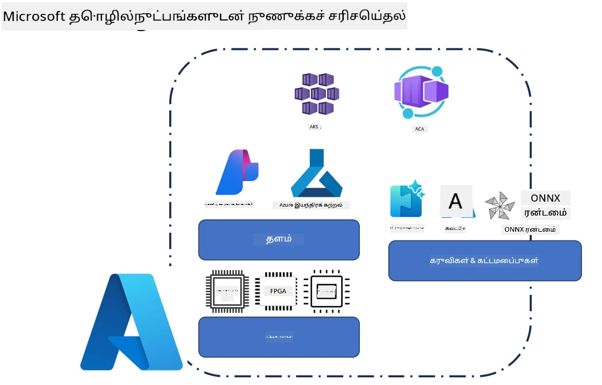
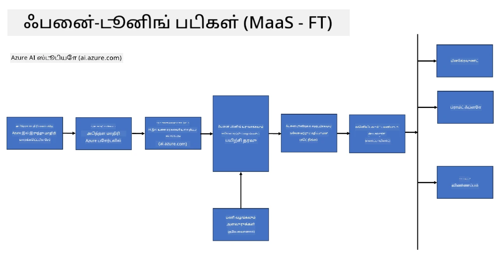
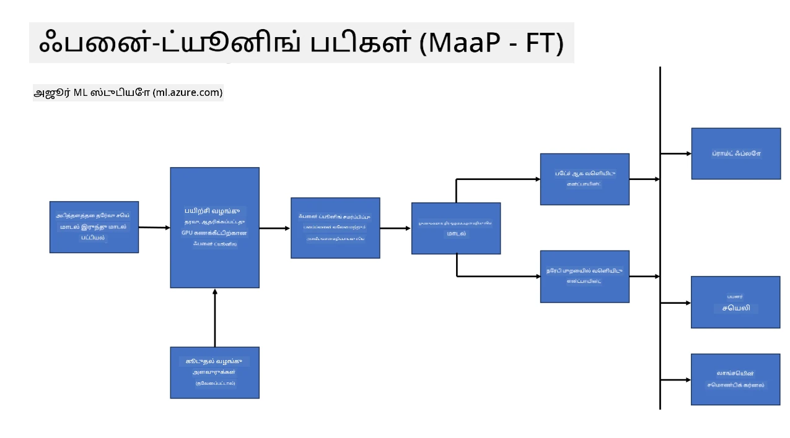
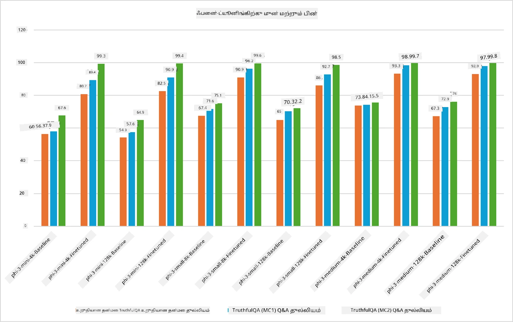

## நழுவல் அமைத்தல் சூழ்நிலைகள்

இந்த பிரிவு Microsoft Foundry மற்றும் Azure சூழல்களில் நழுவல் அமைத்தல் சூழ்நிலைகள், அதில் பிரசார மாதிரிகள், உள்கட்டமைப்பு அடுக்குகள், மற்றும் பொதுவாக பயன்படுத்தப்படும் சிறந்த செயலாக்க தொழில்நுட்பங்களை உள்ளடக்கிய ஒரு மேற்பார்வையை வழங்குகிறது.

**மேடைகள்**  
இதில் Microsoft Foundry (முந்தைய Azure AI Foundry) மற்றும் Azure Machine Learning போன்ற நிர்வகிக்கப்பட்ட சேவைகள் இடம்பெறுகின்றன, இவை மாதிரி மேலாண்மை, ஒழுங்கமைப்பு, பரிசோதனை கண்காணிப்பு மற்றும் பிரசார வேலைப்பாடுகளை வழங்குகின்றன.

**உள்கட்டமைப்பு**  
நழுவல் அமைத்தல் பள்ளியிடக்கூடிய கணினி வளங்களை தேவைப்படுத்துகிறது. Azure சூழல்களில், இது பொதுவாக GPU அடிப்படையிலான மெய்யியல் இயந்திரங்கள் மற்றும் CPU வளங்கள் போன்ற லைட்வெட்டான பணிகளைச் சுமக்க, துறைகளுக்கான அளவிடக்கூடிய சேமிப்பு மற்றும் நிலைசான்மைகள் ஆகியவற்றை உள்ளடக்குகிறது.

**கருவிகள் மற்றும் கட்டமைப்பு**  
நழுவல் அமைத்தல் வேலைப்பாடுகள் பொதுவாக Hugging Face Transformers, DeepSpeed மற்றும் PEFT (Parameter-Efficient Fine-Tuning) போன்ற கட்டமைப்புகள் மற்றும் சிறந்த செயலாக்க நூலகங்களை விரும்புகின்றன.

Microsoft தொழில்நுட்பங்களுடன் நழுவல் அமைத்தல் செயல்முறை மேடை சேவைகள், கணினி உள்கட்டமைப்பு மற்றும் பயிற்சி கட்டமைப்புகளை உள்ளடக்குகிறது. இந்த கூறுகள் ஒன்றாக எவ்வாறு வேலை செய்கிறன என்பதை புரிந்து கொள்ளும்போது, டெவலப்பர்கள் அடிப்படை மாதிரிகளை குறிப்பிட்ட பணிகளுக்கும் உற்பத்தி சூழல்களுக்கும் திறம்பட மாற்ற முடியும்.

## சேவை மாதிரி

கணினி உருவாக்குகிற தேவையின்றி ஹோஸ்ட் செய்யப்பட்ட நழுவல் அமைத்தலை பயன்படுத்தி மாதிரியை நழுவலமை.

Phi-3, Phi-3.5 மற்றும் Phi-4 மாதிரி குடும்பங்களுக்கு சாஃவர்லெஸ் நழுவல் அமைத்தல் இப்போது கிடைக்கிறது, இது டெவலப்பர்களுக்கு கணினியை ஏற்பாடு செய்யாமல் மேக மற்றும் எட்ஜ் சூழல்களுக்கு மாதிரிகளை விரைவாக மற்றும் எளிதாக தனிப்பயனாக்க உதவுகிறது.

## மேடையாக மாதிரி 

பயனர்கள் தங்களுக்கான கணினியை நிர்வகித்து தமக்கு தேவையான மாதிரிகளை நழுவல் அமைத்தல் செய்கிறார்கள்.

[Fine Tuning Sample](https://github.com/Azure/azureml-examples/blob/main/sdk/python/foundation-models/system/finetune/chat-completion/chat-completion.ipynb)

## நழுவல் அமைத்தல் தொழில்நுட்பங்களின் ஒப்பீடு

|சூழ்நிலை|LoRA|QLoRA|PEFT|DeepSpeed|ZeRO|DoRA|
|---|---|---|---|---|---|---|
|முன்னோக்கி பயிற்சி பெற்ற LLMகளை குறிப்பிட்ட பணிகள் அல்லது துறைகளுக்குத் தகுத்தல்|ஆம்|ஆம்|ஆம்|ஆம்|ஆம்|ஆம்|
|எழுத்து வகைப்பாடு, பெயரிடப்பட்ட இருப்பு கண்டறிதல் மற்றும் இயந்திர மொழிபெயர்ப்பு போன்ற இயற்கை மொழி செயல்களுக்கான நழுவல் அமைத்தல்|ஆம்|ஆம்|ஆம்|ஆம்|ஆம்|ஆம்|
|கேள்வி-பதில் பணிகளுக்கான நழுவல் அமைத்தல்|ஆம்|ஆம்|ஆம்|ஆம்|ஆம்|ஆம்|
|சாட்பாட்களில் மனிதர்களைப் போல பதிலளிக்கும் மாதிரிகளுக்கான நழுவல் அமைத்தல்|ஆம்|ஆம்|ஆம்|ஆம்|ஆம்|ஆம்|
|பாடல்கள், கலை அல்லது பிற படைப்பாற்றல் வடிவங்களை உருவாக்குவதற்கான நழுவல் அமைத்தல்|ஆம்|ஆம்|ஆம்|ஆம்|ஆம்|ஆம்|
|கணினி மற்றும் நிதி செலவுகளை குறைத்தல்|ஆம்|ஆம்|ஆம்|ஆம்|ஆம்|ஆம்|
|நினைவக பயன்பாட்டைக் குறைத்தல்|ஆம்|ஆம்|ஆம்|ஆம்|ஆம்|ஆம்|
|திறமையான நழுவல் அமைத்தலுக்காக குறைந்த அளவு அளவுருக்களைப் பயன்படுத்துதல்|ஆம்|ஆம்|ஆம்|இல்லை|இல்லை|ஆம்|
|எல்லா GPU கருவிகளுக்கும் கிடைக்கும் கூட்டு GPU நினைவகத்திற்கு அணுகலை வழங்கும் நினைவக-திறமையான தரவு பரிமாற்ற முறையான வடிவம்|இல்லை|இல்லை|இல்லை|ஆம்|ஆம்|இல்லை|

> [!NOTE]
> LoRA, QLoRA, PEFT மற்றும் DoRA என்பது அளவுரு-திறமையான நழுவல் அமைத்தல் முறைகள் ஆகும், அதே சமயம் DeepSpeed மற்றும் ZeRO விரிவாக்கப்பட்ட பயிற்சி மற்றும் நினைவக சிறப்பு செய்தல்களுக்கு கவனம் செலுத்துகின்றன.

## நழுவல் அமைத்தல் செயல்திறன் எடுத்துக்காட்டுக்கள்

---

<!-- CO-OP TRANSLATOR DISCLAIMER START -->
**மேலுறுப்பு**:  
இந்த ஆவணம் AI மொழிபெயர்ப்பு சேவை [Co-op Translator](https://github.com/Azure/co-op-translator) பயன்படுத்தி மொழிபெயர்க்கப்பட்டுள்ளது. நாம் துல்லியத்திற்காக முயற்சித்தாலும், தானாக இயங்கும் மொழிபெயர்ப்புகளில் பிழைகள் அல்லது தவறுகள் இருக்கக்கூடும் என்பதை தயவுசெய்து கருத்தில் கொள்ளவும். அசல் ஆவணம் தன் சொந்த மொழியில் அதிகாரப் பொருந்தும். முக்கியமான தகவல்களுக்காக, தொழில்முறை மனித மொழிபெயர்ப்பு பரிந்துரைக்கப்படுகிறது. இந்த மொழிபெயர்ப்பின் பயன்பாட்டால் நேரும் எந்த தவறான புரிதலுக்கும் அல்லது தவறான விளக்கங்களுக்கும் நாங்கள் பொறுப்பாளரல்ல.
<!-- CO-OP TRANSLATOR DISCLAIMER END -->