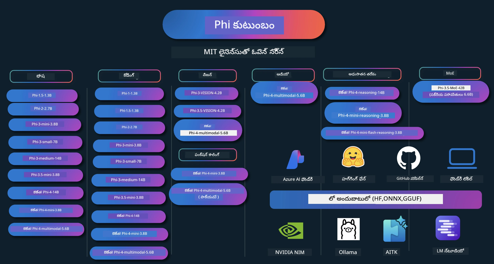

# Phi వంటక పుస్తకం: Microsoft యొక్క Phi నమూనాలతో హ్యాండ్స్-ఆన్ ఉదాహరణలు

[](https://codespaces.new/microsoft/phicookbook)
[](https://vscode.dev/redirect?url=vscode://ms-vscode-remote.remote-containers/cloneInVolume?url=https://github.com/microsoft/phicookbook)

[](https://GitHub.com/microsoft/phicookbook/graphs/contributors/?WT.mc_id=aiml-137032-kinfeylo)
[](https://GitHub.com/microsoft/phicookbook/issues/?WT.mc_id=aiml-137032-kinfeylo)
[](https://GitHub.com/microsoft/phicookbook/pulls/?WT.mc_id=aiml-137032-kinfeylo)
[](http://makeapullrequest.com?WT.mc_id=aiml-137032-kinfeylo)

[](https://GitHub.com/microsoft/phicookbook/watchers/?WT.mc_id=aiml-137032-kinfeylo)
[](https://GitHub.com/microsoft/phicookbook/network/?WT.mc_id=aiml-137032-kinfeylo)
[](https://GitHub.com/microsoft/phicookbook/stargazers/?WT.mc_id=aiml-137032-kinfeylo)

[](https://discord.com/invite/ByRwuEEgH4)

Phi అనేది Microsoft ద్వారా అభివృద్ధి చేయబడిన ఓపెన్ సోర్స్ AI నమూనాల సిరీస్.

Phi ప్రస్తుతం అత్యంత శక్తివంతమైన మరియు ధనసంరక్షణ కలిగిన చిన్న భాషా నమూనా (SLM), బహుభాషలు, తర్కం, టెక్స్ట్/చాట్ ఉత్పత్తి, కోడింగ్, ఇమేజెస్, ఆడియో మరియు ఇతర సందర్భాలలో మంచి బెంచ్‌మార్క్‌లతో ఉంది.

మీరు Phi ని క్లౌడ్ లేదా ఎడ్జ్ డివైజ్‌లకు సంస్థాపన చేసుకోవచ్చు, మరియు పరిమిత కంప్యూటింగ్ శక్తితో సులభంగా జనరేటివ్ AI అనువర్తనాలను నిర్మించవచ్చు.

ఈ వనరులను ఉపయోగించడం ప్రారంభించడానికి ఈ దశలను అనుసరించండి:
1. **రిపోజిటరీని ఫోర్క్ చేయండి**: క్లిక్ చేయండి [](https://GitHub.com/microsoft/phicookbook/network/?WT.mc_id=aiml-137032-kinfeylo)
2. **రిపోజిటరీని క్లోన్ చేయండి**: `git clone https://github.com/microsoft/PhiCookBook.git`
3. [**Microsoft AI Discord కమ్యూనిటీలో చేరండి, నిపుణులు మరియు ఇతర డెవలపర్లు కలుసుకోండి**](https://discord.com/invite/ByRwuEEgH4?WT.mc_id=aiml-137032-kinfeylo)



### 🌐 బహుభాషా మద్దతు

#### GitHub Action ద్వారా మద్దతు (ఆటోమేటెడ్ & ఎల్లప్పుడూ నవీకరించబడతుంది)

<!-- CO-OP TRANSLATOR LANGUAGES TABLE START -->
[అరబ్బీ](../ar/README.md) | [బెంగాలీ](../bn/README.md) | [బల్గేరియన్](../bg/README.md) | [బర్మీస్ (మయన్మార్)](../my/README.md) | [చైనీస్ (సాలిడ్)](../zh-CN/README.md) | [చైనీస్ (సాంప్రదాయక, హాంగ్‌కాంగ్)](../zh-HK/README.md) | [చైనీస్ (సాంప్రదాయక, మకావో)](../zh-MO/README.md) | [చైనీస్ (సాంప్రదాయక, తైవాన్)](../zh-TW/README.md) | [క్రొయాటియన్](../hr/README.md) | [చెక్](../cs/README.md) | [డానిష్](../da/README.md) | [డచ్](../nl/README.md) | [ఎస్టోనియన్](../et/README.md) | [ఫిన్నిష్](../fi/README.md) | [ఫ్రెంచ్](../fr/README.md) | [జర్మన్](../de/README.md) | [గ్రీక్](../el/README.md) | [హీబ్రూ](../he/README.md) | [హిందీ](../hi/README.md) | [హంగేరియన్](../hu/README.md) | [ఇండోనేశియన్](../id/README.md) | [ఇటాలియన్](../it/README.md) | [జాపనీస్](../ja/README.md) | [కన్నడ](../kn/README.md) | [కొరియన్](../ko/README.md) | [లిథూనియన్](../lt/README.md) | [మలయ్](../ms/README.md) | [మలయాళం](../ml/README.md) | [మరాఠీ](../mr/README.md) | [నేపాలీ](../ne/README.md) | [నైజీరియన్ పిడ్గిన్](../pcm/README.md) | [నార్వేజియన్](../no/README.md) | [పర్షియన్ (ఫార్సీ)](../fa/README.md) | [పోలిష్](../pl/README.md) | [పోర్చుగీస్ (బ్రెజిల్)](../pt-BR/README.md) | [పోర్చుగీస్ (పోర్టుగాల్)](../pt-PT/README.md) | [పంజాబీ (గుర్ముఖీ)](../pa/README.md) | [రోమేనియన్](../ro/README.md) | [రష్యన్](../ru/README.md) | [సెర్బియన్ (సిరిలిక్)](../sr/README.md) | [స్లోవాక్](../sk/README.md) | [స్లోవేనియన్](../sl/README.md) | [స్పానిష్](../es/README.md) | [స్వాహిలీ](../sw/README.md) | [స్వీడిష్](../sv/README.md) | [తగలోగ్ (ఫిలిపినో)](../tl/README.md) | [తమిళ్](../ta/README.md) | [తెలుగు](./README.md) | [థాయం](../th/README.md) | [టర్కిష్](../tr/README.md) | [ఉక్రెయిన్](../uk/README.md) | [اردو](../ur/README.md) | [వియత్నామీస్](../vi/README.md)

> **స్థానికంగా క్లోన్ చేయాలనుకుంటున్నారా?**

> ఈ రిపోజిటరీ 50+ భాషా అనువాదాలను కలిగి ఉండడం వల్ల డౌన్లోడ్ పరిమాణం పెరుగుతుంది. అనువాదాలు లేకుండా క్లోన్ చేయడానికి, స్పార్స్ చెకౌట్ ఉపయోగించండి:
> ```bash
> git clone --filter=blob:none --sparse https://github.com/microsoft/PhiCookBook.git
> cd PhiCookBook
> git sparse-checkout set --no-cone '/*' '!translations' '!translated_images'
> ```
> ఇది మీరు కోర్సును పూర్తి చేసుకోవడానికి అవసరమైన అన్ని విషయాలను మరియు చాలా వేగంగా డౌన్లోడ్ చేయడానికి అందిస్తుంది.
<!-- CO-OP TRANSLATOR LANGUAGES TABLE END -->

## కంటెంట్ పట్టిక

- పరిచయం
  - [Phi కుటుంబంలో స్వాగతం](./md/01.Introduction/01/01.PhiFamily.md)
  - [మీ పరిసరాన్ని సెట్ చేయడం](./md/01.Introduction/01/01.EnvironmentSetup.md)
  - [ముఖ్య సాంకేతికతలను అర్థం చేసుకోవడం](./md/01.Introduction/01/01.Understandingtech.md)
  - [Phi నమూనాల కోసం AI భద్రత](./md/01.Introduction/01/01.AISafety.md)
  - [Phi హార్డ్‌వేర్ మద్దతు](./md/01.Introduction/01/01.Hardwaresupport.md)
  - [ప్లాట్‌ఫారమ్‌లలో Phi నమూనాలు & ప్రాప్యత](./md/01.Introduction/01/01.Edgeandcloud.md)
  - [Guidance-ai మరియు Phi ఉపయోగించడం](./md/01.Introduction/01/01.Guidance.md)
  - [GitHub మార్కెట్‌ప్లేస్ నమూనాలు](https://github.com/marketplace/models)
  - [Azure AI నమూనా క్యాటలాగ్](https://ai.azure.com)

- వేరే వాతావరణాలలో Phi ఇన్ఫరెన్స్
    -  [Hugging face](./md/01.Introduction/02/01.HF.md)
    -  [GitHub నమూనాలు](./md/01.Introduction/02/02.GitHubModel.md)
    -  [Azure AI Foundry నమూనా క్యాటలాగ్](./md/01.Introduction/02/03.AzureAIFoundry.md)
    -  [Ollama](./md/01.Introduction/02/04.Ollama.md)
    -  [AI Toolkit VSCode (AITK)](./md/01.Introduction/02/05.AITK.md)
    -  [NVIDIA NIM](./md/01.Introduction/02/06.NVIDIA.md)
    -  [Foundry Local](./md/01.Introduction/02/07.FoundryLocal.md)

- Phi కుటుంబం ఇన్ఫరెన్స్
    - [iOSలో Phi ఇన్ఫరెన్స్](./md/01.Introduction/03/iOS_Inference.md)
    - [Androidలో Phi ఇన్ఫరెన్స్](./md/01.Introduction/03/Android_Inference.md)
    - [Jetsonలో Phi ఇన్ఫరెన్స్](./md/01.Introduction/03/Jetson_Inference.md)
    - [AI PCలో Phi ఇన్ఫరెన్స్](./md/01.Introduction/03/AIPC_Inference.md)
    - [Apple MLX ఫ్రేమ్‌వర్క్‌తో Phi ఇన్ఫరెన్స్](./md/01.Introduction/03/MLX_Inference.md)
    - [లోకల్ సర్వర్‌లో Phi ఇన్ఫరెన్స్](./md/01.Introduction/03/Local_Server_Inference.md)
    - [AI Toolkit ఉపయోగించి రిమోట్ సర్వర్‌లో Phi ఇన్ఫరెన్స్](./md/01.Introduction/03/Remote_Interence.md)
    - [Rustతో Phi ఇన్ఫరెన్స్](./md/01.Introduction/03/Rust_Inference.md)
    - [లోకల్‌లో Phi--విజన్ ఇన్ఫరెన్స్](./md/01.Introduction/03/Vision_Inference.md)
    - [Kaito AKS, Azure Containers (అధికార మద్దతుతో)‌తో Phi ఇన్ఫరెన్స్](./md/01.Introduction/03/Kaito_Inference.md)
-  [Phi కుటుంబాన్ని అర్ధం చేసుకోవడం](./md/01.Introduction/04/QuantifyingPhi.md)
    - [llama.cpp ఉపయోగించి Phi-3.5 / 4ని క్వాంటైజ్ చేయడం](./md/01.Introduction/04/UsingLlamacppQuantifyingPhi.md)
    - [onnxruntime కోసం జనరేటివ్ AI ఎక్స్‌టెన్షన్స్ ఉపయోగించి Phi-3.5 / 4ని క్వాంటైజ్ చేయడం](./md/01.Introduction/04/UsingORTGenAIQuantifyingPhi.md)
    - [Intel OpenVINO ఉపయోగించి Phi-3.5 / 4ని క్వాంటైజ్ చేయడం](./md/01.Introduction/04/UsingIntelOpenVINOQuantifyingPhi.md)
    - [Apple MLX ఫ్రేమ్‌వర్క్ ఉపయోగించి Phi-3.5 / 4ని క్వాంటైజ్ చేయడం](./md/01.Introduction/04/UsingAppleMLXQuantifyingPhi.md)

- Phi మూల్యాంకనం
    - [జవాబుదారీ AI](./md/01.Introduction/05/ResponsibleAI.md)
    - [Azure AI Foundry మూల్యాంకనానికి](./md/01.Introduction/05/AIFoundry.md)
    - [మూల్యాంకనానికి Promptflow ఉపయోగించడం](./md/01.Introduction/05/Promptflow.md)
 
- Azure AI Searchతో RAG
    - [Phi-4-mini మరియు Phi-4-multimodal(RAG)ను Azure AI Searchతో ఎలా ఉపయోగించాలి](https://github.com/microsoft/PhiCookBook/blob/main/code/06.E2E/E2E_Phi-4-RAG-Azure-AI-Search.ipynb)

- Phi అనువర్తన అభివృద్ధి నమూనాలు
  - టెక్స్ట్ & చాట్ అనువర్తనాలు
    - Phi-4 నమూనాలు 🆕
      - [📓] [Phi-4-mini ONNX మోడల్‌తో చాట్](./md/02.Application/01.TextAndChat/Phi4/ChatWithPhi4ONNX/README.md)
      - [Phi-4 స్థానిక ONNX మోడల్‌తో చాట్ .NET](../../md/04.HOL/dotnet/src/LabsPhi4-Chat-01OnnxRuntime)
      - [Sementic Kernel ఉపయోగించి Phi-4 ONNXతో చాట్ .NET కన్సోల్ యాప్](../../md/04.HOL/dotnet/src/LabsPhi4-Chat-02SK)
    - Phi-3 / 3.5 నమూనాలు
      - [Phi3, ONNX Runtime వెబ్ మరియు WebGPU ఉపయోగించి బ్రౌజర్‌లో స్థానిక చాట్‌బోట్](https://github.com/microsoft/onnxruntime-inference-examples/tree/main/js/chat)
      - [OpenVino చాట్](./md/02.Application/01.TextAndChat/Phi3/E2E_OpenVino_Chat.md)
      - [బహుళ మోడల్ - ఇంటరాక్టివ్ ఫై-3-మినీ మరియు ఓపెన్‌ఏఐ విస్పర్](./md/02.Application/01.TextAndChat/Phi3/E2E_Phi-3-mini_with_whisper.md)
      - [ఎం.ఎల్.ఫ్లో - ర్యాపర్‌ను నిర్మించడం మరియు ఎం.ఎల్.ఫ్లోతో ఫై-3 ఉపయోగించడం](./md//02.Application/01.TextAndChat/Phi3/E2E_Phi-3-MLflow.md)
      - [మోడల్ ఆప్టిమైజేషన్ - ఒలివ్‌తో ONNX రంటైమ్ వెబ్ కోసం ఫై-3-మిన్ మోడల్‌ను ఎలా ఆప్టిమైజ్ చేయాలి](https://github.com/microsoft/Olive/tree/main/examples/phi3)
      - [ఫై-3 మినీ-4కె-ఇన్‌స్ట్రక్ట్-ఒఎన్‌ఎన్ఎక్స్‌తో WinUI3 యాప్](https://github.com/microsoft/Phi3-Chat-WinUI3-Sample/)
      -[WinUI3 బహుళ మోడల్ AI పవర్డ్ నోట్స్ యాప్ నమూనా](https://github.com/microsoft/ai-powered-notes-winui3-sample)
      - [ప్రాంప్ట్ ఫ్లోతో కస్టమ్ ఫై-3 మోడల్స్‌ను ఫైన్-ట్యూన్ చేసి ఇంటిగ్రేట్ చేయడం](./md/02.Application/01.TextAndChat/Phi3/E2E_Phi-3-FineTuning_PromptFlow_Integration.md)
      - [Azure AI ఫౌండ్రీలో ప్రాంప్ట్ ఫ్లోతో కస్టమ్ ఫై-3 మోడల్స్‌ను ఫైన్-ట్యూన్ చేసి ఇంటిగ్రేట్ చేయడం](./md/02.Application/01.TextAndChat/Phi3/E2E_Phi-3-FineTuning_PromptFlow_Integration_AIFoundry.md)
      - [Microsoft యొక్క బాధ్యతాయుత AI సూత్రాలపై దృష్టి సారించి Azure AI ఫౌండ్రీలో ఫైన్-ట్యూన్ చేసిన ఫై-3 / ఫై-3.5 మోడల్‌ని மதிப்பிடுதல்](./md/02.Application/01.TextAndChat/Phi3/E2E_Phi-3-Evaluation_AIFoundry.md)
      - [📓] [ఫై-3.5-మిని-ఇన్‌స్ట్రక్ట్ భాషా ఊహాజననం నమూనా (చైనీస్/ఇంగ్లీష్)](./md/02.Application/01.TextAndChat/Phi3/phi3-instruct-demo.ipynb)
      - [ఫై-3.5-ఇన్‌స్ట్రక్ట్ వెబ్GPU RAG చాట్‌బాట్](./md/02.Application/01.TextAndChat/Phi3/WebGPUWithPhi35Readme.md)
      - [ఫై-3.5-ఇన్‌స్ట్రక్ట్ ONNXతో ప్రాంప్ట్ ఫ్లో పరిష్కారాన్ని సృష్టించడానికి Windows GPUని ఉపయోగించడం](./md/02.Application/01.TextAndChat/Phi3/UsingPromptFlowWithONNX.md)
      - [మైక్రోసాఫ్ట్ ఫై-3.5 tfliteని ఉపయోగించి ఆండ్రాయిడ్ యాప్ సృష్టించడం](./md/02.Application/01.TextAndChat/Phi3/UsingPhi35TFLiteCreateAndroidApp.md)
      - [స్థానిక ONNX Phi-3 మోడల్‌ను ఉపయోగించి Microsoft.ML.OnnxRuntimeతో Q&A .NET ఉదాహరణ](../../md/04.HOL/dotnet/src/LabsPhi301)
      - [సిమాంటిక్ కర్నల్ మరియు ఫై-3తో .NET కన్సోల్ చాట్ యాప్](../../md/04.HOL/dotnet/src/LabsPhi302)

  - Azure AI ఇన్ఫరెన్స్ SDK కోడ్ ఆధారిత నమూనాలు 
    - Phi-4 నమూనాలు 🆕
      - [📓] [ఫై-4-మల్టీమోడల్ ఉపయోగించి ప్రాజెక్ట్ కోడ్‌ను సృష్టించడం](./md/02.Application/02.Code/Phi4/GenProjectCode/README.md)
    - Phi-3 / 3.5 నమూనాలు
      - [Microsoft Phi-3 కుటుంబంతో మీ స్వంత Visual Studio Code GitHub Copilot చాట్‌ని నిర్మించండి](./md/02.Application/02.Code/Phi3/VSCodeExt/README.md)
      - [GitHub మోడల్స్‌తో Phi-3.5 ఉపయోగించి మీ స్వంత Visual Studio Code చాట్ కాపిలట్ ఏజెంట్ సృష్టించండి](/md/02.Application/02.Code/Phi3/CreateVSCodeChatAgentWithGitHubModels.md)

  - అభివృద్ధి చేసిన తర్కం నమూనాలు
    - Phi-4 నమూనాలు 🆕
      - [📓] [ఫై-4-మినీ-తర్కం లేదా ఫై-4-తర్కం నమూనాలు](./md/02.Application/03.AdvancedReasoning/Phi4/AdvancedResoningPhi4mini/README.md)
      - [📓] [Microsoft Olive తో ఫై-4-మినీ-తర్కం ఫైన్-ట్యూన్ చేయడం](./md/02.Application/03.AdvancedReasoning/Phi4/AdvancedResoningPhi4mini/olive_ft_phi_4_reasoning_with_medicaldata.ipynb)
      - [📓] [Apple MLXతో ఫై-4-మినీ-తర్కం ఫైన్-ట్యూన్ చేయడం](./md/02.Application/03.AdvancedReasoning/Phi4/AdvancedResoningPhi4mini/mlx_ft_phi_4_reasoning_with_medicaldata.ipynb)
      - [📓] [GitHub మోడల్స్ తో ఫై-4-మినీ-తర్కం](./md/02.Application/02.Code/Phi4r/github_models_inference.ipynb)
      - [📓] [Azure AI ఫౌండ్రీ మోడల్స్ తో ఫై-4-మినీ-తర్కం](./md/02.Application/02.Code/Phi4r/azure_models_inference.ipynb)
  - డెమోలు
      - [ఫై-4-మినీ డెమోలు Hugging Face స్పేసెస్‌పై హోస్ట్ చేయబడ్డాయి](https://huggingface.co/spaces/microsoft/phi-4-mini?WT.mc_id=aiml-137032-kinfeylo)
      - [ఫై-4-మల్టీమోడల్ డెమోలు Hugging Face స్పేసెస్‌పై హోస్ట్ చేయబడ్డాయి](https://huggingface.co/spaces/microsoft/phi-4-multimodal?WT.mc_id=aiml-137032-kinfeylo)
  - విజన్ నమూనాలు
    - Phi-4 నమూనాలు 🆕
      - [📓] [చిత్రాలను చదవడం మరియు కోడ్‌ను ఉత్పత్తి చేయడానికి ఫై-4-మల్టీమోడల్ ఉపయోగించండి](./md/02.Application/04.Vision/Phi4/CreateFrontend/README.md) 
    - Phi-3 / 3.5 నమూనాలు
      -  [📓][ఫై-3-విజన్-చిత్రం టెక్స్ట్ నుండి టెక్స్ట్](./md/02.Application/04.Vision/Phi3/E2E_Phi-3-vision-image-text-to-text-online-endpoint.ipynb)
      - [ఫై-3-విజన్-ఒఎన్‌ఎన్ఎక్స్](https://onnxruntime.ai/docs/genai/tutorials/phi3-v.html)
      - [📓][ఫై-3-విజెన్-క్లిప్ ఎంబెడ్డింగ్](./md/02.Application/04.Vision/Phi3/E2E_Phi-3-vision-image-text-to-text-online-endpoint.ipynb)
      - [డెమో: ఫై-3 రీసైక్లింగ్](https://github.com/jennifermarsman/PhiRecycling/)
      - [ఫై-3-విజన్ - విజువల్ భాషా అసిస్టెంట్ - Phi3-విజన్ మరియు ఓపెన్వైనోతో](https://docs.openvino.ai/nightly/notebooks/phi-3-vision-with-output.html)
      - [ఫై-3 విజన్ Nvidia NIM](./md/02.Application/04.Vision/Phi3/E2E_Nvidia_NIM_Vision.md)
      - [ఫై-3 విజన్ ఓపెన్వైనో](./md/02.Application/04.Vision/Phi3/E2E_OpenVino_Phi3Vision.md)
      - [📓][ఫై-3.5 విజన్ మల్టీ-ఫ్రేమ్ లేదా మల్టీ-ఇమేజ్ నమూనా](./md/02.Application/04.Vision/Phi3/phi3-vision-demo.ipynb)
      - [Microsoft.ML.OnnxRuntime .NET ఉపయోగించి స్థానిక ONNX మోడల్‌తో ఫై-3 విజన్](../../md/04.HOL/dotnet/src/LabsPhi303)
      - [మెను ఆధారిత ఫై-3 విజన్ స్థానిక ONNX మోడల్ Microsoft.ML.OnnxRuntime .NET ఉపయోగించి](../../md/04.HOL/dotnet/src/LabsPhi304)

  - గణితం నమూనాలు
    -  Phi-4-మినీ-ఫ్లాష్-తర్కం-ఇన్‌స్ట్రక్ట్ నమూనాలు 🆕 [గణితం డెమో Phi-4-మినీ-ఫ్లాష్-తర్కం-ఇన్‌స్ట్రక్ట్‌తో](./md/02.Application/09.Math/MathDemo.ipynb)

  - ఆడియో నమూనాలు
    - Phi-4 నమూనాలు 🆕
      - [📓] [ఫై-4-మల్టీమోడల్ ఉపయోగించి ఆడియో ట్రాన్స్‌క్రిప్ట్లను తీసుకోవడం](./md/02.Application/05.Audio/Phi4/Transciption/README.md)
      - [📓] [ఫై-4-మల్టీమోడల్ ఆడియో నమూనా](./md/02.Application/05.Audio/Phi4/Siri/demo.ipynb)
      - [📓] [ఫై-4-మల్టీమోడల్ స్పీచ్ అనువాద నమూనా](./md/02.Application/05.Audio/Phi4/Translate/demo.ipynb)
      - [.NET కన్సోల్ అప్లికేషన్ Phi-4-మల్టీమోడల్ ఆడియో ఉపయోగించి ఆడియో ఫైల్ విశ్లేషించి ట్రాన్స్‌క్రిప్ట్ సృష్టించడం](../../md/04.HOL/dotnet/src/LabsPhi4-MultiModal-02Audio)

  - MOE నమూనాలు
    - Phi-3 / 3.5 నమూనాలు
      - [📓] [Phi-3.5 మిశ్రమ నిపుణుల మోడల్స్ (MoEs) సోషల్ మీడియా నమూనా](./md/02.Application/06.MoE/Phi3/phi3_moe_demo.ipynb)
      - [📓] [NVIDIA NIM Phi-3 MOE, Azure AI సెర్చ్, మరియు LlamaIndexతో రిట్రీవల్-ఆగుమెంటెడ్ జనరేషన్ (RAG) పైప్‌లైన్ నిర్మాణం](./md/02.Application/06.MoE/Phi3/azure-ai-search-nvidia-rag.ipynb)
      - 
  - ఫంక్షన్ కాల్లింగ్ నమూనాలు
    - Phi-4 నమూనాలు 🆕
      -  [📓] [Phi-4-మినీతో ఫంక్షన్ కాల్లింగ్ ఉపయోగించడం](./md/02.Application/07.FunctionCalling/Phi4/FunctionCallingBasic/README.md)
      -  [📓] [Phi-4-మినీతో బహుళ ఏజెంట్లను సృష్టించడానికి ఫంక్షన్ కాల్లింగ్ ఉపయోగించడం](./md/02.Application/07.FunctionCalling/Phi4/Multiagents/Phi_4_mini_multiagent.ipynb)
      -  [📓] [ఒల్లామాతో ఫంక్షన్ కాల్లింగ్ ఉపయోగించడం](./md/02.Application/07.FunctionCalling/Phi4/Ollama/ollama_functioncalling.ipynb)
      -  [📓] [ONNXతో ఫంక్షన్ కాల్లింగ్ ఉపయోగించడం](./md/02.Application/07.FunctionCalling/Phi4/ONNX/onnx_parallel_functioncalling.ipynb)
  - బహుళ మోడల్ మిక్సింగ్ నమూనాలు
    - Phi-4 నమూనాలు 🆕
      -  [📓] [ఫై-4-మల్టీమోడల్ ని టెక్నాలజీ జర్నలిస్ట్ గా ఉపయోగించడం](./md/02.Application/08.Multimodel/Phi4/TechJournalist/phi_4_mm_audio_text_publish_news.ipynb)
      - [.NET కన్సోల్ అప్లికేషన్ Phi-4-మల్టీమోడల్ ఉపయోగించి చిత్రాలను విశ్లేషించడం](../../md/04.HOL/dotnet/src/LabsPhi4-MultiModal-01Images)

- ఫైన్-ట్యూనింగ్ ఫై నమూనాలు
  - [ఫైన్-ట్యూనింగ్ సన్నివేశాలు](./md/03.FineTuning/FineTuning_Scenarios.md)
  - [ఫైన్-ట్యూనింగ్ మరియు RAG](./md/03.FineTuning/FineTuning_vs_RAG.md)
  - [ఫైన్-ట్యూనింగ్ ఫై-3ను పరిశ్రమ నిపుణుడిగా మార్చండి](./md/03.FineTuning/LetPhi3gotoIndustriy.md)
  - [VS కోడ్ కోసం AI టూల్‌కిట్‌తో ఫై-3 ఫైన్-ట్యూనింగ్](./md/03.FineTuning/Finetuning_VSCodeaitoolkit.md)
  - [Azure మెషిన్ లెర్నింగ్ సర్వీస్‌తో ఫై-3 ఫైన్-ట్యూనింగ్](./md/03.FineTuning/Introduce_AzureML.md)
  - [లోరాతో ఫై-3 ఫైన్-ట్యూనింగ్](./md/03.FineTuning/FineTuning_Lora.md)
  - [QLora తో ఫై-3 ఫైన్-ట్యూనింగ్](./md/03.FineTuning/FineTuning_Qlora.md)
  - [Azure AI ఫౌండ్రీతో ఫై-3 ఫైన్-ట్యూనింగ్](./md/03.FineTuning/FineTuning_AIFoundry.md)
  - [Azure ML CLI/SDK తో ఫై-3 ఫైన్-ట్యూనింగ్](./md/03.FineTuning/FineTuning_MLSDK.md)
  - [Microsoft Olive తో ఫైన్-ట్యూనింగ్](./md/03.FineTuning/FineTuning_MicrosoftOlive.md)
  - [Microsoft Olive హ్యాండ్స్-ఆన్ ల్యాబ్‌తో ఫైన్-ట్యూనింగ్](./md/03.FineTuning/olive-lab/readme.md)
  - [Weights and Bias తో ఫై-3-విజన్ ఫైన్-ట్యూనింగ్](./md/03.FineTuning/FineTuning_Phi-3-visionWandB.md)
  - [Apple MLX ఫ్రేమ్‌వర్క్‌తో ఫై-3 ఫైన్-ట్యూనింగ్](./md/03.FineTuning/FineTuning_MLX.md)
  - [ఫై-3-విజన్ ఫైన్-ట్యూనింగ్ (అధికారిక మద్దతుతో)](./md/03.FineTuning/FineTuning_Vision.md)
  - [Kaito AKS, Azure కంటెయినర్స్ తో ఫై-3 ఫైన్-ట్యూనింగ్ (అధికారిక మద్దతు)](./md/03.FineTuning/FineTuning_Kaito.md)
  - [ఫై-3 మరియు 3.5 విజన్ ఫైన్-ట్యూనింగ్](https://github.com/2U1/Phi3-Vision-Finetune)

- హ్యాండ్స్ ఆన్ ల్యాబ్
  - [అధునాతన మోడల్స్ అన్వేషణ: LLMs, SLMs, స్థానిక అభివృద్ధి మరియు మరింత](https://github.com/microsoft/aitour-exploring-cutting-edge-models)
  - [NLP సామర్థ్యాన్ని విడుదల చేయడం: Microsoft Oliveతో ఫైన్-ట్యూనింగ్](https://github.com/azure/Ignite_FineTuning_workshop)

- అకడమిక్ రీసెర్చ్ పేపర్లు మరియు ప్రచురణలు
  - [పాఠ్య పుస్తకాలు అందైనవి మాత్రమే కావాలి II: phi-1.5 సాంకేతిక నివేదిక](https://arxiv.org/abs/2309.05463)
  - [Phi-3 సాంకేతిక నివేదిక: మీ ఫోన్‌లో స్థానికంగా ఉన్న అత్యంత సామర్థ్యం గల భాషా మోడల్](https://arxiv.org/abs/2404.14219)
  - [Phi-4 సాంకేతిక నివేదిక](https://arxiv.org/abs/2412.08905)
  - [Phi-4-మినీ సాంకేతిక నివేదిక: మిక్చర్-ఆఫ్-లోరాస్ ద్వారా కంపాక్ట్ అయినా శక్తివంతమైన బహుముఖ భాషా మోడల్స్](https://arxiv.org/abs/2503.01743)
  - [వాహనంలో ఫంక్షన్-కాల్ చేయడానికి చిన్న భాషా మోడల్స్‌ను ఆప్టిమైజ్ చేయడం](https://arxiv.org/abs/2501.02342)
  - [(ఎందుకంటేPHI) బహుళ-ఎంపిక ప్రశ్న సమాధానానికి PHI-3 ని ఫైన్-ట్యూన్ చేయడం: పద్ధతి, ఫలితాలు, మరియు సవాళ్లు](https://arxiv.org/abs/2501.01588)
  - [Phi-4-తర్క సాంకేతిక నివేదిక](https://www.microsoft.com/en-us/research/wp-content/uploads/2025/04/phi_4_reasoning.pdf)
  - [Phi-4-మినీ-తర్క సాంకేతిక నివేదిక](https://huggingface.co/microsoft/Phi-4-mini-reasoning/blob/main/Phi-4-Mini-Reasoning.pdf)

## Phi మోడల్స్ ఉపయోగం

### Azure AI Foundryలో Phi

Microsoft Phiని ఎలా ఉపయోగించుకోవాలో, మరియు మీ వివిధ హార్డ్‌వేర్ పరికరాల్లో E2E పరిష్కారాలను ఎలా నిర్మించాలో తెలుసుకోవచ్చు. Phiని మీరు స్వయంగా అనుభవించడానికి, ముందుగా మోడల్స్‌తో ఆడుకుంటూ, మీ పరిస్థితులకు అనుగుణంగా Phiని కస్టమైజ్ చేయడాన్ని ప్రారంభించండి [Azure AI Foundry Azure AI Model Catalog](https://aka.ms/phi3-azure-ai) ద్వారా మీరు మరింత తెలుసుకోవచ్చు [Azure AI Foundry పై ప్రారంభించడం](/md/02.QuickStart/AzureAIFoundry_QuickStart.md)

**ప్లేగ్రౌండ్**
ప్రతి మోడల్‌కు ప్రత్యేకమైన ప్లేగ్రౌండ్ ఉంటుంది మోడల్‌ను పరీక్షించేందుకు [Azure AI Playground](https://aka.ms/try-phi3).

### GitHub మోడల్స్‌లో Phi

Microsoft Phiని ఎలా ఉపయోగించుకోవాలో, మరియు మీ వివిధ హార్డ్‌వేర్ పరికరాలలో E2E పరిష్కారాలను ఎలా నిర్మించాలో తెలుసుకోవచ్చు. Phiని మీరు స్వయంగా అనుభవించడానికి, ముందుగా మోడల్‌తో ఆడుకుంటూ, మీ సందర్భాలకు అనుగుణంగా Phiని కస్టమైజ్ చేయండి [GitHub Model Catalog](https://github.com/marketplace/models?WT.mc_id=aiml-137032-kinfeylo) ద్వారా మీరు మరింత తెలుసుకోవచ్చు [GitHub Model Catalog పై ప్రారంభించడం](/md/02.QuickStart/GitHubModel_QuickStart.md)

**ప్లేగ్రౌండ్**
ప్రతి మోడల్‌కు ప్రత్యేకమైన [ప్లేగ్రౌండ్ అందుబాటులో ఉంది మోడల్‌ను పరీక్షించడానికి](/md/02.QuickStart/GitHubModel_QuickStart.md).

### Hugging Faceలో Phi

మీరు మోడల్‌ను కూడా [Hugging Face](https://huggingface.co/microsoft) లో కనుగొనవచ్చు

**ప్లేగ్రౌండ్**
[Hugging Chat ప్లేగ్రౌండ్](https://huggingface.co/chat/models/microsoft/Phi-3-mini-4k-instruct)

## 🎒 ఇతర కోర్సులు

మన బృందం మరిన్ని కోర్సులు అందిస్తుంది! జాగ్రత్తగా చూడండి:

<!-- CO-OP TRANSLATOR OTHER COURSES START -->
### LangChain
[](https://aka.ms/langchain4j-for-beginners)
[](https://aka.ms/langchainjs-for-beginners?WT.mc_id=m365-94501-dwahlin)
[](https://github.com/microsoft/langchain-for-beginners?WT.mc_id=m365-94501-dwahlin)
---

### Azure / Edge / MCP / ఏజెంట్లు
[](https://github.com/microsoft/AZD-for-beginners?WT.mc_id=academic-105485-koreyst)
[](https://github.com/microsoft/edgeai-for-beginners?WT.mc_id=academic-105485-koreyst)
[](https://github.com/microsoft/mcp-for-beginners?WT.mc_id=academic-105485-koreyst)
[](https://github.com/microsoft/ai-agents-for-beginners?WT.mc_id=academic-105485-koreyst)

---

### జనరేటివ్ AI సిరీస్
[](https://github.com/microsoft/generative-ai-for-beginners?WT.mc_id=academic-105485-koreyst)
[-9333EA?style=for-the-badge&labelColor=E5E7EB&color=9333EA)](https://github.com/microsoft/Generative-AI-for-beginners-dotnet?WT.mc_id=academic-105485-koreyst)
[-C084FC?style=for-the-badge&labelColor=E5E7EB&color=C084FC)](https://github.com/microsoft/generative-ai-for-beginners-java?WT.mc_id=academic-105485-koreyst)
[-E879F9?style=for-the-badge&labelColor=E5E7EB&color=E879F9)](https://github.com/microsoft/generative-ai-with-javascript?WT.mc_id=academic-105485-koreyst)

---

### కోర్ లెర్నింగ్
[](https://aka.ms/ml-beginners?WT.mc_id=academic-105485-koreyst)
[](https://aka.ms/datascience-beginners?WT.mc_id=academic-105485-koreyst)
[](https://aka.ms/ai-beginners?WT.mc_id=academic-105485-koreyst)
[](https://github.com/microsoft/Security-101?WT.mc_id=academic-96948-sayoung)
[](https://aka.ms/webdev-beginners?WT.mc_id=academic-105485-koreyst)
[](https://aka.ms/iot-beginners?WT.mc_id=academic-105485-koreyst)
[](https://github.com/microsoft/xr-development-for-beginners?WT.mc_id=academic-105485-koreyst)

---

### కోపైలట్ సిరీస్
[](https://aka.ms/GitHubCopilotAI?WT.mc_id=academic-105485-koreyst)
[](https://github.com/microsoft/mastering-github-copilot-for-dotnet-csharp-developers?WT.mc_id=academic-105485-koreyst)
[](https://github.com/microsoft/CopilotAdventures?WT.mc_id=academic-105485-koreyst)
<!-- CO-OP TRANSLATOR OTHER COURSES END -->

## బాధ్యతాయుతమైన AI

Microsoft మా కస్టమర్లను మా AI ఉత్పత్తులను బాధ్యతాయుతంగా ఉపయోగించడానికి సహాయం చేయడానికి, మా నేర్చుకున్న విషయాలను పంచుకునేందుకు, మరియు Transparency Notes మరియు Impact Assessments వంటి సాధనాల ద్వారా విశ్వాస ఆధారంగా భాగస్వామ్యాలు నిర్మించడంలో నిరంతరం కట్టుబడి ఉంది. ఈ వనరులు చాలా సంఖ్యలో ఈ [https://aka.ms/RAI](https://aka.ms/RAI) వద్ద లభ్యమవుతాయి.
Microsoft బాధ్యతాయుతమైన AI కి సంబంధించిన దృష్టికోణం న్యాయమే, నమ్మదగినదిక, భద్రత, గోప్యత, సమగ్రత, పారదర్శకత మరియు బాధ్యతాయుతమైనతనాన్ని కలిగి మాకు ఉన్న AI సూత్రాలపైన ఆధారపడి ఉంది.

ఈ నమూనాలో ఉపయోగించిన పెద్ద స్థాయిలో ప్రకృతిభాష, చిత్రం మరియు మాట మోడల్స్ - అవి అన్యాయంగా, నమ్మకంలో లోపం కలిగిన విధంగా, అసభ్యంగా లేదా హానికారకంగా వ్యవహరించవచ్చు, తద్వారా హానులని కలిగించవచ్చు. దయచేసి ప్రమాదాలు మరియు పరిమితులను తెలుసుకోవడానికి [Azure OpenAI సేవ Transparency note](https://learn.microsoft.com/legal/cognitive-services/openai/transparency-note?tabs=text) ను చూడండి.

ఈ ప్రమాదాలను నివారించడానికి సిఫార్సు చేయబడిన విధానం మీ ఆర్కిటెక్చర్‌లో ఒక భద్రతా వ్యవస్థను చేర్చడం, అది హానికారక ప్రవర్తనను గుర్తించి, అడ్డుకోవడంలో సహాయపడుతుంది. [Azure AI Content Safety](https://learn.microsoft.com/azure/ai-services/content-safety/overview) ఒక స్వతంత్ర రక్షణ పొరను అందిస్తుంది, ఇది అప్లికేషన్‌లు మరియు సేవలలో హానికరమైన వినియోగదారుడు ఉత్పత్తి చేసిన మరియు AI ఉత్పత్తి చేసిన కంటెంట్‌ను గుర్తించగలదు. Azure AI Foundryలో Content Safety సేవ మీరు వివిధ మాధ్యమాల్లో హానికరమైన కంటెంట్ తేలికగా చూడటానికి, అన్వేషించడానికి మరియు నమూనా కోడ్‌ను ప్రయత్నించడానికి అనుమతిస్తుంది. క్రింద ఇచ్చిన [త్వరిత ప్రారంభ డాక్యుమెంటేషన్](https://learn.microsoft.com/azure/ai-services/content-safety/quickstart-text?tabs=visual-studio%2Clinux&pivots=programming-language-rest) మీకు ఈ సేవకు అభ్యర్థనలు పంపడం ఎలా చేయాలో దల్చుతుంది.
మరొక అంశం మొత్తం అప్లికేషన్ పనితీరు. బహుళ-మోడ్ మరియు బహుళ-మోడల్స్ అప్లికేషన్లతో, పనితీరును అంటే మీరు మరియు మీ వినియోగదారులు ఊహించే విధంగా సిస్టమ్ పనిచేస్తుంది, హానికరమైన అవుట్‌పుట్లు ఉత్పత్తి చేయకుండా ఉండటం కూడా. మీ మొత్తం అప్లికేషన్ పనితీరును [పనితీరు మరియు గుణాత్మకత మరియు రిస్క్ మరియు భద్రత మూల్యాంకకులు](https://learn.microsoft.com/azure/ai-studio/concepts/evaluation-metrics-built-in) ఉపయోగించి మూల్యాంకనం చేయడం ముఖ్యం. మీరు ఇంకా [కస్టమ్ మూల్యాంకకులు](https://learn.microsoft.com/azure/ai-studio/how-to/develop/evaluate-sdk#custom-evaluators) సృష్టించడమూ మరియు మూల్యాంకనం చేయడమూ చేయగలరు.

మీరు మీ AI అప్లికేషన్‌ను అభివృద్ది పరిసరంలో [Azure AI Evaluation SDK](https://microsoft.github.io/promptflow/index.html) ఉపయోగించి మూల్యాంకనం చేయవచ్చు. పరీక్ష డేటాసెట్ లేదా లక్ష్యాన్ని ఇచ్చినప్పుడు, మీ సృష్టించు AI అప్లికేషన్ సృష్టులను అంతర్గత మూల్యాంకకులు లేదా మీ ఎంపికలో ఉన్న కస్టమ్ మూల్యాంకకులతో గణనీయంగా కొలవబడతాయి. మీ సిస్టమ్‌ను మూల్యాంకనం చేయడానికి azure ai evaluation sdkతో ప్రారంభించడానికి, మీరు [త్వరితప్రవేశ మార్గదర్శకాన్ని](https://learn.microsoft.com/azure/ai-studio/how-to/develop/flow-evaluate-sdk) అనుసరించవచ్చు. మీరు ఒక మూల్యాంకన రన్‌ని అమలు చేసిన తర్వాత, మీరు [Azure AI Foundryలో ఫలితాలను చూడవచ్చు](https://learn.microsoft.com/azure/ai-studio/how-to/evaluate-flow-results).

## ట్రేడ్మార్క్స్

ఈ ప్రాజెక్టు ప్రాజెక్టులు, ఉత్పత్తులు లేదా సేవలకు సంబంధించిన ట్రేడ్మార్కులు లేదా లోగోలను కలిగి ఉండవచ్చు. మైక్రోసాఫ్ట్ ట్రేడ్మార్కులు లేదా లోగోలకు అనుమతించిన వాడకం [Microsoft's Trademark & Brand Guidelines](https://www.microsoft.com/legal/intellectualproperty/trademarks/usage/general) ను అనుసరించి ఉండాలి.
ఈ ప్రాజెక్టు మోసగించిన సంస్కరణలలో మైక్రోసాఫ్ట్ ట్రేడ్మార్కులు లేదా లోగోలు వాడకం విమర్శ లేదా మైక్రోసాఫ్ట్ స్పాన్సర్షిప్ సూచించకూడదు. మూడవ పార్టీ ట్రేడ్మార్కులు లేదా లోగోల వాడకం ఆ మూడవ పార్టీ విధానాలకు లోబడి ఉంటుంది.

## సహాయం పొందడం

మీరు దశబద్ధంగా చిక్కుకున్నా లేదా AI యాప్స్ నిర్మాణంపై ఏవైనా ప్రశ్నలు ఉంటే, చేరండి:

[](https://aka.ms/foundry/discord)

ఉత్పత్తి అభిప్రాయం లేదా నిర్మాణంలో పొరపాట్లు ఉంటే సందర్శించండి:

[](https://aka.ms/foundry/forum)

---

<!-- CO-OP TRANSLATOR DISCLAIMER START -->
**స్పష్టీకరణ**:  
ఈ పత్రం [Co-op Translator](https://github.com/Azure/co-op-translator) అనే AI అనువాద సేవ ఉపయోగించి అనువదించబడింది. మేము ఖచ్చితత్వానికి ప్రయత్నిస్తున్నప్పటికీ, ఆటోమేటెడ్ అనువాదాల్లో పొరపాట్లు లేదా లోపాలు ఉండవచ్చు గానీ దయచేసి అవగాహనలో ఉంచండి. మూల పత్రం దాని స్థానిక భాషలోనే అధికారిక మూలం గా పరిగణించాలి. ముఖ్యమైన సమాచారం కోసం, వృత్తిపరమైన మానవ అనువాదం చేయించుకోవడం మంచిది. ఈ అనువాదం ఉపయోగంతో ఏనైనా తప్పుగల అర్థం పరివర్తనల కోసం మేము బాధ్యత వహించము.
<!-- CO-OP TRANSLATOR DISCLAIMER END -->