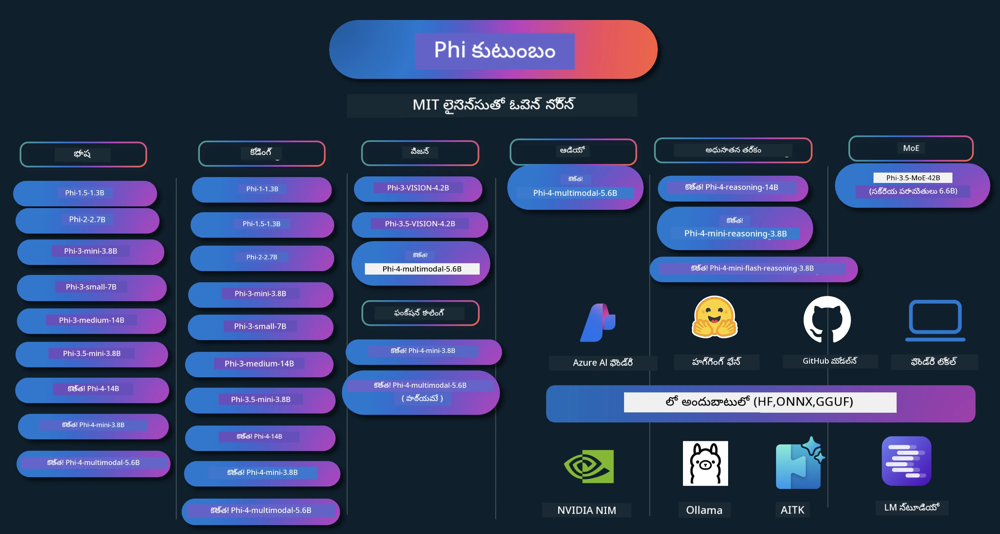

# ఫై కుక్‌బుక్: మైక్రోసాఫ్ట్ ఫై మోడల్స్‌తో హ్యాండ్స్-ఆన్ ఉదాహరణలు

[](https://codespaces.new/microsoft/phicookbook)
[](https://vscode.dev/redirect?url=vscode://ms-vscode-remote.remote-containers/cloneInVolume?url=https://github.com/microsoft/phicookbook)

[](https://GitHub.com/microsoft/phicookbook/graphs/contributors/?WT.mc_id=aiml-137032-kinfeylo)
[](https://GitHub.com/microsoft/phicookbook/issues/?WT.mc_id=aiml-137032-kinfeylo)
[](https://GitHub.com/microsoft/phicookbook/pulls/?WT.mc_id=aiml-137032-kinfeylo)
[](http://makeapullrequest.com?WT.mc_id=aiml-137032-kinfeylo)

[](https://GitHub.com/microsoft/phicookbook/watchers/?WT.mc_id=aiml-137032-kinfeylo)
[](https://GitHub.com/microsoft/phicookbook/network/?WT.mc_id=aiml-137032-kinfeylo)
[](https://GitHub.com/microsoft/phicookbook/stargazers/?WT.mc_id=aiml-137032-kinfeylo)

[](https://discord.com/invite/ByRwuEEgH4)

ఫై అనేది మైక్రోసాఫ్ట్ అభివృద్ధి చేసిన ఓపెన్ సోర్స్ AI మోడల్స్ సిరీస్.

ఫై ప్రస్తుతం అత్యంత శక్తివంతమైన మరియు ఖర్చు-ప్రభావవంతమైన చిన్న భాషా మోడల్ (SLM), ఇది బహుభాషా, తార్కికత, టెక్స్ట్/చాట్ జనరేషన్, కోడింగ్, చిత్రాలు, ఆడియో మరియు ఇతర సందర్భాలలో చాలా మంచి బెంచ్‌మార్క్‌లు కలిగి ఉంది.

మీరు ఫైని క్లౌడ్ లేదా ఎడ్జ్ డివైస్‌ల పై అమర్చవచ్చు, మరియు మీరు పరిమిత కంప్యూటింగ్ శక్తితో సులభంగా జనరేటివ్ AI అనువర్తనాలను సృష్టించవచ్చు.

ఈ వనరులను ఉపయోగించడం ప్రారంభించడానికి ఈ దశలను అనుసరించండి:
1. **రిపాజిటరీని ఫోర్క్ చేయండి**: క్లిక్ చేయండి [](https://GitHub.com/microsoft/phicookbook/network/?WT.mc_id=aiml-137032-kinfeylo)
2. **రిపాజిటరీని క్లోన్ చేయండి**: `git clone https://github.com/microsoft/PhiCookBook.git`
3. [**మైక్రోసాఫ్ట్ AI డిస్కార్డ్ కమ్యూనిటీకి చేరండి మరియు నిపుణులు, ఇతర డెవలపర్లను కలుసుకోండి**](https://discord.com/invite/ByRwuEEgH4?WT.mc_id=aiml-137032-kinfeylo)



### 🌐 బహుభాషా మద్దతు

#### గిత్‌హబ్ యాక్షన్ ద్వారా మద్దతు ఇవ్వబడినది (ఆటోమేటెడ్ & ఎల్లప్పుడూ తాజా)

<!-- CO-OP TRANSLATOR LANGUAGES TABLE START -->
[అరబిక్](../ar/README.md) | [బెంగాలి](../bn/README.md) | [బల్గేరియన్](../bg/README.md) | [బర్మీస్ (మయాన్మార్)](../my/README.md) | [చైనీస్ (సరళీకృత)](../zh-CN/README.md) | [చైనీస్ (సాంప్రదాయ, హాంకాంగ్)](../zh-HK/README.md) | [చైనీస్ (సాంప్రదాయ, మకావు)](../zh-MO/README.md) | [చీనీస్ (సాంప్రదాయ, తైవాన్)](../zh-TW/README.md) | [క్రోవేటియన్](../hr/README.md) | [చెక్](../cs/README.md) | [డెనిష్](../da/README.md) | [డచ్](../nl/README.md) | [ఎస్టోనియన్](../et/README.md) | [ఫిన్నిష్](../fi/README.md) | [ఫ్రెంచ్](../fr/README.md) | [జర్మన్](../de/README.md) | [గ్రీక్](../el/README.md) | [హీబ్రూ](../he/README.md) | [హిందీ](../hi/README.md) | [హంగేరియన్](../hu/README.md) | [ఇండోనేషియన్](../id/README.md) | [ఇటాలియన్](../it/README.md) | [జపనీస్](../ja/README.md) | [కన్నడ](../kn/README.md) | [కొరియన్](../ko/README.md) | [లిథువేనియన్](../lt/README.md) | [మలయ్](../ms/README.md) | [మలయాళం](../ml/README.md) | [మరాఠీ](../mr/README.md) | [నెపాలీ](../ne/README.md) | [నైజీరియన్ పిడ్జిన్](../pcm/README.md) | [నార్వేజియన్](../no/README.md) | [పర్షియన్ (ఫారీ)](../fa/README.md) | [పోలిష్](../pl/README.md) | [పొర్చుగీసు (బ్రెజిల్)](../pt-BR/README.md) | [పొర్చుగీసు (పార్ట్‌రగల్)](../pt-PT/README.md) | [పంజాబీ (గురుముఖీ)](../pa/README.md) | [రోమేనియన్](../ro/README.md) | [రష్యన్](../ru/README.md) | [సెర్బియన్ (సిరిలిక్)](../sr/README.md) | [స్లోവాక్](../sk/README.md) | [స్లోవేనియన్](../sl/README.md) | [స్పానిష్](../es/README.md) | [స్వాహిలి](../sw/README.md) | [స్వెడిష్](../sv/README.md) | [టాగాలోగ్ (ఫిలిపినో)](../tl/README.md) | [తమిళ్](../ta/README.md) | [తెలుగు](./README.md) | [థాయ్](../th/README.md) | [తుర్కిష్](../tr/README.md) | [యుక్రెయిన్](../uk/README.md) | [ఉర్దూ](../ur/README.md) | [వియత్నామీస్](../vi/README.md)

> **స్థానికంగా క్లోన్ చేయ விரும்பుకుంటున్నారా?**
>
> ఈ రిపాజిటరీ 50+ భాషా అనువాదాలను కలిగి ఉంది, ఇది డౌన్లోడ్ పరిమాణాన్ని గణనీయంగా పెంచుతుంది. అనువాదాలు లేకుండా క్లోన్ చేయడానికి, స్పార్స్ చెకౌట్ ఉపయోగించండి:
>
> **Bash / macOS / Linux:**
> ```bash
> git clone --filter=blob:none --sparse https://github.com/microsoft/PhiCookBook.git
> cd PhiCookBook
> git sparse-checkout set --no-cone '/*' '!translations' '!translated_images'
> ```
>
> **CMD (విండోస్):**
> ```cmd
> git clone --filter=blob:none --sparse https://github.com/microsoft/PhiCookBook.git
> cd PhiCookBook
> git sparse-checkout set --no-cone "/*" "!translations" "!translated_images"
> ```
>
> ఇది మీకు కోర్సు పూర్తి చేసుకోవడానికి కావలసిన అన్ని ఫైళ్లను చాలా వేగంగా డౌన్లోడ్ చేసే అవకాశం ఇస్తుంది.
<!-- CO-OP TRANSLATOR LANGUAGES TABLE END -->

## సూచిక

- పరిచయం
  - [ఫై కుటుంబానికి స్వాగతం](./md/01.Introduction/01/01.PhiFamily.md)
  - [మీ పర్యావరణాన్ని సెట్ చేయడం](./md/01.Introduction/01/01.EnvironmentSetup.md)
  - [ప్రధాన సాంకేతికతలను అర్థం చేసుకోవడం](./md/01.Introduction/01/01.Understandingtech.md)
  - [ఫై మోడల్స్ కోసం AI భద్రత](./md/01.Introduction/01/01.AISafety.md)
  - [ఫై హార్డ్‌వేర్ మద్దతు](./md/01.Introduction/01/01.Hardwaresupport.md)
  - [ఫై మోడల్స్ & ప్లాట్‌ఫారమ్‌లపై అందుబాటులో ఉన్ప డివైసెస్](./md/01.Introduction/01/01.Edgeandcloud.md)
  - [గైడన్స్-ai మరియు ఫై ఉపయోగించడం](./md/01.Introduction/01/01.Guidance.md)
  - [GitHub మార్కెట్‌ప్లేస్ మోడల్స్](https://github.com/marketplace/models)
  - [Azure AI మోడల్ క్యాటలాగ్](https://ai.azure.com)

- వివిధ పరిసరాలలో ఫై ఇన్ఫరెన్స్
    - [Hugging face](./md/01.Introduction/02/01.HF.md)
    - [GitHub మోడల్స్](./md/01.Introduction/02/02.GitHubModel.md)
    - [Microsoft Foundry మోడల్ క్యాటలాగ్](./md/01.Introduction/02/03.AzureAIFoundry.md)
    - [Ollama](./md/01.Introduction/02/04.Ollama.md)
    - [AI టూల్కిట్ VSCode (AITK)](./md/01.Introduction/02/05.AITK.md)
    - [NVIDIA NIM](./md/01.Introduction/02/06.NVIDIA.md)
    - [Foundry లోకల్](./md/01.Introduction/02/07.FoundryLocal.md)

- ఫై కుటుంబంలో ఇన్ఫరెన్స్
    - [iOSలో ఫై ఇన్ఫరెన్స్](./md/01.Introduction/03/iOS_Inference.md)
    - [ఆండ్రాయిడ్‌లో ఫై ఇన్ఫరెన్స్](./md/01.Introduction/03/Android_Inference.md)
    - [జెట్సన్‌లో ఫై ఇన్ఫరెన్స్](./md/01.Introduction/03/Jetson_Inference.md)
    - [AI PCలో ఫై ఇన్ఫరెన్స్](./md/01.Introduction/03/AIPC_Inference.md)
    - [ఆపిల్ MLX ఫ్రేమ్‌వర్క్‌తో ఫై ఇన్ఫరెన్స్](./md/01.Introduction/03/MLX_Inference.md)
    - [లోకల్ సర్వర్‌లో ఫై ఇన్ఫరెన్స్](./md/01.Introduction/03/Local_Server_Inference.md)
    - [AI టూల్కిట్ ఉపయోగించి రిమోట్ సర్వర్‌లో ఫై ఇన్ఫరెన్స్](./md/01.Introduction/03/Remote_Interence.md)
    - [రస్ట్‌తో ఫై ఇన్ఫరెన్స్](./md/01.Introduction/03/Rust_Inference.md)
    - [లోకల్‌లో ఫై--విజన్ ఇన్ఫరెన్స్](./md/01.Introduction/03/Vision_Inference.md)
    - [కైటో AKS, Azure కంటైనర్స್(అధికారిక మద్దతు)తో ఫై ఇన్ఫరెన్స్](./md/01.Introduction/03/Kaito_Inference.md)
-  [ఫై కుటుంబాన్ని ప్రమాణీకరించడం](./md/01.Introduction/04/QuantifyingPhi.md)
    - [llama.cpp ఉపయోగించి ఫై-3.5 / 4 ప్రమాణీకరణ](./md/01.Introduction/04/UsingLlamacppQuantifyingPhi.md)
    - [onnxruntime కోసం జనరేటివ్ AI ఎక్స్టెన్షన్స్ ఉపయోగించి ఫై-3.5 / 4 ప్రమాణీకరణ](./md/01.Introduction/04/UsingORTGenAIQuantifyingPhi.md)
    - [Intel OpenVINO ఉపయోగించి ఫై-3.5 / 4 ప్రమాణీకరణ](./md/01.Introduction/04/UsingIntelOpenVINOQuantifyingPhi.md)
    - [ఆపిల్ MLX ఫ్రేమ్‌వర్క్ ఉపయోగించి ఫై-3.5 / 4 ప్రమాణీకరణ](./md/01.Introduction/04/UsingAppleMLXQuantifyingPhi.md)

- ఫై మూల్యాంకనం
    - [ప్రతిస్పందన AI](./md/01.Introduction/05/ResponsibleAI.md)
    - [మూల్యాంకన కోసం Microsoft Foundry](./md/01.Introduction/05/AIFoundry.md)
    - [ప్రాంప్ట్‌ఫ్లో ఉపయోగించి మూల్యాంకనం](./md/01.Introduction/05/Promptflow.md)
 
- Azure AI Search తో RAG
    - [Azure AI Search తో Phi-4-mini మరియు Phi-4-multimodal(RAG) ఎలా ఉపయోగించాలి](https://github.com/microsoft/PhiCookBook/blob/main/code/06.E2E/E2E_Phi-4-RAG-Azure-AI-Search.ipynb)

- ఫై అనువర్తన అభివృద్ధి నమూనాలు
  - టెక్స్ట్ & చాట్ అనువర్తనాలు
    - ఫై-4 నమూనాలు 🆕
      - [📓] [Phi-4-mini ONNX మోడల్‌తో చాట్](./md/02.Application/01.TextAndChat/Phi4/ChatWithPhi4ONNX/README.md)
      - [Phi-4 స్థానిక ONNX మోడల్ .NET తో చాట్](../../md/04.HOL/dotnet/src/LabsPhi4-Chat-01OnnxRuntime)
      - [Sementic Kernel ఉపయోగించి Phi-4 ONNX తో .NET కన్సోల్ యాప్ చాట్](../../md/04.HOL/dotnet/src/LabsPhi4-Chat-02SK)
    - ఫై-3 / 3.5 నమూనాలు
      - [Phi3, ONNX రన్టైమ్ వెబ్ మరియు WebGPU ఉపయోగించి బ్రౌజర్ లో స్థానిక చాట్‌బాట్](https://github.com/microsoft/onnxruntime-inference-examples/tree/main/js/chat)
      - [OpenVino चैट](./md/02.Application/01.TextAndChat/Phi3/E2E_OpenVino_Chat.md)
      - [మల్టీ మోడల్ - ఇంటరాక్టివ్ Phi-3-మినీ మరియు OpenAI విస్పర్](./md/02.Application/01.TextAndChat/Phi3/E2E_Phi-3-mini_with_whisper.md)
      - [MLFlow - ఒక రాపర్ నిర్మించడం మరియు Phi-3ని MLFlowతో వినియోగించడం](./md//02.Application/01.TextAndChat/Phi3/E2E_Phi-3-MLflow.md)
      - [మోడల్ ఆప్టిమైజేషన్ - ONNX_Runtime_Web కోసం Phi-3-min మోడల్ ను Olive తో ఎలా ఆప్టిమైజ్ చేయాలి](https://github.com/microsoft/Olive/tree/main/examples/phi3)
      - [Phi-3 mini-4k-instruct-onnx తో WinUI3 యాప్](https://github.com/microsoft/Phi3-Chat-WinUI3-Sample/)
      -[WinUI3 మల్టీ మోడల్ AI పవర్డ్ నోట్స్ యాప్ నమూనా](https://github.com/microsoft/ai-powered-notes-winui3-sample)
      - [Fine-tune చేసి Prompt flow తో కస్టమ్ Phi-3 మోడల్స్ ను ఇంటిగ్రేట్ చేయడం](./md/02.Application/01.TextAndChat/Phi3/E2E_Phi-3-FineTuning_PromptFlow_Integration.md)
      - [Microsoft Foundryలో Prompt flow తో కస్టమ్ Phi-3 మోడల్స్ ను Fine-tune చేసి ఇంటిగ్రేట్ చేయడం](./md/02.Application/01.TextAndChat/Phi3/E2E_Phi-3-FineTuning_PromptFlow_Integration_AIFoundry.md)
      - [Microsoft యొక్క జవాబుదారీతనం AI స 원ుసారంగా Microsoft Foundryలో Fine-tuned Phi-3 / Phi-3.5 మోడల్ ని అంచనా వేయడం](./md/02.Application/01.TextAndChat/Phi3/E2E_Phi-3-Evaluation_AIFoundry.md)
      - [📓] [Phi-3.5-mini-instruct భాషా అంచనా నమూనా (చైనీస్/ఇంగ్లీష్)](./md/02.Application/01.TextAndChat/Phi3/phi3-instruct-demo.ipynb)
      - [Phi-3.5-Instruct WebGPU RAG చాట్‌బాట్](./md/02.Application/01.TextAndChat/Phi3/WebGPUWithPhi35Readme.md)
      - [Windows GPU ఉపయోగించి Phi-3.5-Instruct ONNX తో Prompt flow పరిష్కారం సృష్టించడం](./md/02.Application/01.TextAndChat/Phi3/UsingPromptFlowWithONNX.md)
      - [Microsoft Phi-3.5 tflite ను ఉపయోగించి ఆండ్రాయిడ్ యాప్ సృష్టించడం](./md/02.Application/01.TextAndChat/Phi3/UsingPhi35TFLiteCreateAndroidApp.md)
      - [Microsoft.ML.OnnxRuntime ఉపయోగించి స్థానిక ONNX Phi-3 మోడల్ తో Q&A .NET ఉదాహరణ](../../md/04.HOL/dotnet/src/LabsPhi301)
      - [Semantic Kernel మరియు Phi-3 తో కన్సోల్ చాట్ .NET యాప్](../../md/04.HOL/dotnet/src/LabsPhi302)

  - Azure AI Inference SDK కోడ్ ఆధారిత నమూనాలు 
    - Phi-4 నమూనాలు 🆕
      - [📓] [Phi-4-multimodal ఉపయోగించి ప్రాజెక్ట్ కోడ్ ఉత్పత్తి చేయడం](./md/02.Application/02.Code/Phi4/GenProjectCode/README.md)
    - Phi-3 / 3.5 నమూనాలు
      - [Microsoft Phi-3 Family తో మీ స్వంత Visual Studio Code GitHub Copilot చాట్ నిర్మించు](./md/02.Application/02.Code/Phi3/VSCodeExt/README.md)
      - [GitHub మోడల్స్ తో Phi-3.5 ఉపయోగించి మీ స్వంత Visual Studio Code చాట్ కాపిలట్ ఏజెంట్ సృష్టించండి](/md/02.Application/02.Code/Phi3/CreateVSCodeChatAgentWithGitHubModels.md)

  - అభివృద్ధి చెందిన తరువాతి శ్రద్ధ నమూనాలు
    - Phi-4 నమూనాలు 🆕
      - [📓] [Phi-4-mini-reasoning లేదా Phi-4-reasoning నమూనాలు](./md/02.Application/03.AdvancedReasoning/Phi4/AdvancedResoningPhi4mini/README.md)
      - [📓] [Microsoft Olive తో Phi-4-mini-reasoning ను Fine-tune చేయడం](./md/02.Application/03.AdvancedReasoning/Phi4/AdvancedResoningPhi4mini/olive_ft_phi_4_reasoning_with_medicaldata.ipynb)
      - [📓] [Apple MLX తో Phi-4-mini-reasoning ను Fine-tune చేయడం](./md/02.Application/03.AdvancedReasoning/Phi4/AdvancedResoningPhi4mini/mlx_ft_phi_4_reasoning_with_medicaldata.ipynb)
      - [📓] [GitHub మోడల్స్ తో Phi-4-mini-reasoning](./md/02.Application/02.Code/Phi4r/github_models_inference.ipynb)
      - [📓] [Microsoft Foundry మోడల్స్ తో Phi-4-mini-reasoning](./md/02.Application/02.Code/Phi4r/azure_models_inference.ipynb)
  - డెమోస్
      - [Hugging Face స్పేసెస్ లో హోస్ట్ చేయబడిన Phi-4-mini డెమోస్](https://huggingface.co/spaces/microsoft/phi-4-mini?WT.mc_id=aiml-137032-kinfeylo)
      - [Hugginge Face స్పేసెస్ లో హోస్ట్ చేయబడిన Phi-4-multimodal డెమోస్](https://huggingface.co/spaces/microsoft/phi-4-multimodal?WT.mc_id=aiml-137032-kinfeylo)
  - విజన్ నమూనాలు
    - Phi-4 నమూనాలు 🆕
      - [📓] [Phi-4-multimodal ఉపయోగించి చిత్రాలు చదవడం మరియు కోడ్ ఉత్పత్తి చేయడం](./md/02.Application/04.Vision/Phi4/CreateFrontend/README.md) 
    - Phi-3 / 3.5 నమూనాలు
      -  [📓][Phi-3-vision-చిత్రం గా టెక్ట్స్ నుండి టెక్ట్స్ కు](./md/02.Application/04.Vision/Phi3/E2E_Phi-3-vision-image-text-to-text-online-endpoint.ipynb)
      - [Phi-3-vision-ONNX](https://onnxruntime.ai/docs/genai/tutorials/phi3-v.html)
      - [📓][Phi-3-vision CLIP ఎంబెడ్డింగ్](./md/02.Application/04.Vision/Phi3/E2E_Phi-3-vision-image-text-to-text-online-endpoint.ipynb)
      - [డెమో: Phi-3 రీసైక్లింగ్](https://github.com/jennifermarsman/PhiRecycling/)
      - [Phi-3-vision - విజువల్ భాష సహాయకుడు - Phi3-విజన్ మరియు OpenVINO తో](https://docs.openvino.ai/nightly/notebooks/phi-3-vision-with-output.html)
      - [Phi-3 విజన్ Nvidia NIM](./md/02.Application/04.Vision/Phi3/E2E_Nvidia_NIM_Vision.md)
      - [Phi-3 విజన్ OpenVino](./md/02.Application/04.Vision/Phi3/E2E_OpenVino_Phi3Vision.md)
      - [📓][Phi-3.5 విజన్ మల్టీ-ఫ్రేమ్ లేదా మల్టీ-ఇమేజ్ నమూనా](./md/02.Application/04.Vision/Phi3/phi3-vision-demo.ipynb)
      - [Microsoft.ML.OnnxRuntime .NET ఉపయోగించి Phi-3 విజన్ స్థానిక ONNX మోడల్](../../md/04.HOL/dotnet/src/LabsPhi303)
      - [మెను ఆధారిత Phi-3 విజన్ స్థానిక ONNX మోడల్ Microsoft.ML.OnnxRuntime .NET ఉపయోగించి](../../md/04.HOL/dotnet/src/LabsPhi304)

  - గణితం నమూనాలు
    -  Phi-4-মినీ-ఫ్లాష్-రీజనింగ్-ఇన్‌స్ట్రక్ట్ నమూనాలు 🆕 [Phi-4-মినీ-ఫ్లాష్-రీజనింగ్-ఇన్‌స్ట్రక్ట్ తో గణితం డెమో](./md/02.Application/09.Math/MathDemo.ipynb)

  - ఆడియో నమూనాలు
    - Phi-4 నమూనాలు 🆕
      - [📓] [Phi-4-multimodal ఉపయోగించి ఆడియో ట్రాన్స్క్రిప్ట్స్ తీయడం](./md/02.Application/05.Audio/Phi4/Transciption/README.md)
      - [📓] [Phi-4-multimodal ఆడియో నమూనా](./md/02.Application/05.Audio/Phi4/Siri/demo.ipynb)
      - [📓] [Phi-4-multimodal స్పీచ్ అనువాద నమూనా](./md/02.Application/05.Audio/Phi4/Translate/demo.ipynb)
      - [.NET కన్సోల్ అప్లికేషన్ Phi-4-multimodal ఆడియో ఉపయోగించి ఆడియో ఫైల్‌ను విశ్లేషించి ట్రాన్స్క్రిప్ట్ ఉత్పత్తి చేయడం](../../md/04.HOL/dotnet/src/LabsPhi4-MultiModal-02Audio)

  - MOE నమూనాలు
    - Phi-3 / 3.5 నమూనాలు
      - [📓] [Phi-3.5 వివిధ నిపుణుల మోడల్స్ (MoEs) సోషల్ మీడియా నమూనా](./md/02.Application/06.MoE/Phi3/phi3_moe_demo.ipynb)
      - [📓] [NVIDIA NIM Phi-3 MOE, Azure AI Search, మరియు LlamaIndex తో రిట్రీవల్-ఆగ్మెంటెడ్ జనరేషన్ (RAG) పైప్‌లైన్ నిర్మించడం](./md/02.Application/06.MoE/Phi3/azure-ai-search-nvidia-rag.ipynb)
      - 
  - ఫంక్షన్ కాల్లింగ్ నమూనాలు
    - Phi-4 నమూనాలు 🆕
      -  [📓] [Phi-4-mini తో ఫంక్షన్ కాల్లింగ్ ఉపయోగించడం](./md/02.Application/07.FunctionCalling/Phi4/FunctionCallingBasic/README.md)
      -  [📓] [Phi-4-mini తో బహు ఏజెంట్ల సృష్టించడానికి ఫంక్షన్ కాల్లింగ్ ఉపయోగించడం](./md/02.Application/07.FunctionCalling/Phi4/Multiagents/Phi_4_mini_multiagent.ipynb)
      -  [📓] [Ollama తో ఫంక్షన్ కాల్లింగ్ ఉపయోగించడం](./md/02.Application/07.FunctionCalling/Phi4/Ollama/ollama_functioncalling.ipynb)
      -  [📓] [ONNX తో ఫంక్షన్ కాల్లింగ్ ఉపయోగించడం](./md/02.Application/07.FunctionCalling/Phi4/ONNX/onnx_parallel_functioncalling.ipynb)
  - మల్టిమోడల్ మిక్సింగ్ నమూనాలు
    - Phi-4 నమూనాలు 🆕
      -  [📓] [సాంకేతిక జర్నలిస్ట్ గా Phi-4-multimodal ఉపయోగించడం](./md/02.Application/08.Multimodel/Phi4/TechJournalist/phi_4_mm_audio_text_publish_news.ipynb)
      - [.NET కన్సోల్ అప్లికేషన్ Phi-4-multimodal ఉపయోగించి చిత్రాలను విశ్లేషించడం](../../md/04.HOL/dotnet/src/LabsPhi4-MultiModal-01Images)

- ఫైన్-ట్యూనింగ్ Phi నమూనాలు
  - [ఫైన్-ట్యూనింగ్ పరిస్థితులు](./md/03.FineTuning/FineTuning_Scenarios.md)
  - [ఫైన్-ట్యూనింగ్ వర్సెస్ RAG](./md/03.FineTuning/FineTuning_vs_RAG.md)
  - [Phi-3ని పరిశ్రమ నిపుణుడిగా మార్చడానికి ఫైన్-ట్యూనింగ్](./md/03.FineTuning/LetPhi3gotoIndustriy.md)
  - [VS కోడ్ కై AI టూల్‌కిట్ తో Phi-3ని ఫైన్-ట్యూన్ చేయడం](./md/03.FineTuning/Finetuning_VSCodeaitoolkit.md)
  - [Azure మెషీన్ లెర్నింగ్ సర్వీస్ తో Phi-3ని ఫైన్-ట్యూన్ చేయడం](./md/03.FineTuning/Introduce_AzureML.md)
  - [Lora తో Phi-3ని ఫైన్-ట్యూన్ చేయడం](./md/03.FineTuning/FineTuning_Lora.md)
  - [QLora తో Phi-3ని ఫైన్-ట్యూన్ చేయడం](./md/03.FineTuning/FineTuning_Qlora.md)
  - [Microsoft Foundry తో Phi-3ని ఫైన్-ట్యూన్ చేయడం](./md/03.FineTuning/FineTuning_AIFoundry.md)
  - [Azure ML CLI/SDK తో Phi-3ని ఫైన్-ట్యూన్ చేయడం](./md/03.FineTuning/FineTuning_MLSDK.md)
  - [Microsoft Olive తో ఫైన్-ట్యూనింగ్](./md/03.FineTuning/FineTuning_MicrosoftOlive.md)
  - [Microsoft Olive Hands-On Lab తో ఫైన్-ట్యూనింగ్](./md/03.FineTuning/olive-lab/readme.md)
  - [Weights మరియు Bias తో Phi-3-vision ను ఫైన్-ట్యూన్ చేయడం](./md/03.FineTuning/FineTuning_Phi-3-visionWandB.md)
  - [Apple MLX Framework తో Phi-3ని ఫైన్-ట్యూన్ చేయడం](./md/03.FineTuning/FineTuning_MLX.md)
  - [Phi-3-vision (అధికారిక మద్దతు)](./md/03.FineTuning/FineTuning_Vision.md)
  - [Kaito AKS, Azure కంటైనర్లతో Phi-3 ని ఫైన్-ట్యూన్ చేయడం (అధికారిక మద్దతు)](./md/03.FineTuning/FineTuning_Kaito.md)
  - [Phi-3 మరియు 3.5 విజన్ ఫైన్-ట్యూన్](https://github.com/2U1/Phi3-Vision-Finetune)

- హ్యాండ్స్ ఆన్ లాబ్
  - [అత్యాధునిక మోడల్స్ అన్వేషణ: LLMs, SLMs, స్థానిక అభివృద్ధి మరియు మరిన్ని](https://github.com/microsoft/aitour-exploring-cutting-edge-models)
  - [NLP సామర్థ్యాన్ని వదిలి ఇవ్వడం: Microsoft Olive తో ఫైన్-ట్యూనింగ్](https://github.com/azure/Ignite_FineTuning_workshop)
- అకాడమిక్ రీసెర్చ్ పేపర్లు మరియు పబ్లికేషన్లు  
  - [Textbooks Are All You Need II: phi-1.5 సాంకేతిక నివేదిక](https://arxiv.org/abs/2309.05463)  
  - [Phi-3 సాంకేతిక నివేదిక: మీ ఫోన్‌లో స్థానికంగా ఉన్న అత్యంత సామర్థ్యం ఉన్న భాషా మోడల్](https://arxiv.org/abs/2404.14219)  
  - [Phi-4 సాంకేతిక నివేదిక](https://arxiv.org/abs/2412.08905)  
  - [Phi-4-Mini సాంకేతిక నివేదిక: మిక్చర్-ఆఫ్-లోరాస్ ద్వారా సాంద్రత ఉన్న శక్తివంతమైన బహుళమాధ్యమ భాషా మోడల్స్](https://arxiv.org/abs/2503.01743)  
  - [ఇన్-వాహిక ఫంక్షన్-కాలింగ్ కోసం చిన్న భాషా మోడల్స్ ఆప్టిమైజింగ్](https://arxiv.org/abs/2501.02342)  
  - [(WhyPHI) బహుళ-ఎంపిక ప్రశ్నల సమాధానానికి PHI-3 ఫైన్-ట్యూనింగ్: విధానం, ఫలితాలు, మరియు సవాళ్ళు](https://arxiv.org/abs/2501.01588)  
  - [Phi-4-రిజనింగ్ సాంకేతిక నివేదిక](https://www.microsoft.com/en-us/research/wp-content/uploads/2025/04/phi_4_reasoning.pdf)  
  - [Phi-4-mini-రిజనింగ్ సాంకేతిక నివేదిక](https://huggingface.co/microsoft/Phi-4-mini-reasoning/blob/main/Phi-4-Mini-Reasoning.pdf)  

## Phi మోడల్స్ ఉపయోగించడం  

### Microsoft Foundryలో Phi  

మీ వివిధ హార్డ్వేర్ పరికరాలలో Microsoft Phi ఎలా ఉపయోగించాలో, ఎలా E2E పరిష్కారాలు నిర్మించాలో మీరు తెలుసుకోవచ్చు. Phiను మీ కోసం అనుభవించడానికి, మొదట మోడల్స్‌తో ఆడుకొని మరియు మీ సందర్భాలకు అనుగుణంగా Phiను సవరించుట ప్రారంభించండి, [Microsoft Foundry Azure AI మోడల్ కాటలాగ్](https://aka.ms/phi3-azure-ai) ఉపయోగించండి. మీరు మరిన్ని వివరాలను [Microsoft Foundry](../../../../../../../md/02.QuickStart/AzureAIFoundry_QuickStart.md )తో ప్రారంభించడం ద్వారా తెలుసుకోవచ్చు.  

**ప్లేగ్రౌండ్**  
ప్రతి మోడల్‌కు ప్రత్యేకమైన పరీక్షా వేదిక ఉంది [Azure AI Playground](https://aka.ms/try-phi3).  

### GitHub Modelsలో Phi  

మీ వివిధ హార్డ్వేర్ పరికరాలలో Microsoft Phi ఎలా ఉపయోగించాలో, ఎలా E2E పరిష్కారాలు నిర్మించాలో మీరు తెలుసుకోవచ్చు. Phiను అనుభవించడానికి, మొదట మోడల్‌తో ఆడుకొని మరియు మీ సందర్భాలకు అనుగుణంగా Phiను సవరించండి, [GitHub Model Catalog](https://github.com/marketplace/models?WT.mc_id=aiml-137032-kinfeylo) ఉపయోగించండి. మీరు మరిన్ని వివరాలను [GitHub Model Catalog](../../../../../../../md/02.QuickStart/GitHubModel_QuickStart.md )తో ప్రారంభించడం ద్వారా తెలుసుకోవచ్చు.  

**ప్లేగ్రౌండ్**  
ప్రతి మోడల్‌కు ప్రత్యేకమైన [మోడల్‌ను పరీక్షించడానికి ప్లేగ్రౌండ్](../../../../../../../md/02.QuickStart/GitHubModel_QuickStart.md ).  

### Hugging Faceలో Phi  

మోడల్‌ను మీరు [Hugging Face](https://huggingface.co/microsoft)లో కూడా కనుగొనవచ్చు.  

**ప్లేగ్రౌండ్**  
[Hugging Chat ప్లేగ్రౌండ్](https://huggingface.co/chat/models/microsoft/Phi-3-mini-4k-instruct)  

## 🎒 ఇతర కోర్సులు  

మన బృందం ఇతర కోర్సులు కూడా ఉత్పత్తి చేస్తోంది! ఈ క్రింద చూడండి:  

<!-- CO-OP TRANSLATOR OTHER COURSES START -->  
### LangChain  
[](https://aka.ms/langchain4j-for-beginners)  
[](https://aka.ms/langchainjs-for-beginners?WT.mc_id=m365-94501-dwahlin)  
[](https://github.com/microsoft/langchain-for-beginners?WT.mc_id=m365-94501-dwahlin)  
---  

### Azure / Edge / MCP / ఏజెంట్లు  
[](https://github.com/microsoft/AZD-for-beginners?WT.mc_id=academic-105485-koreyst)  
[](https://github.com/microsoft/edgeai-for-beginners?WT.mc_id=academic-105485-koreyst)  
[](https://github.com/microsoft/mcp-for-beginners?WT.mc_id=academic-105485-koreyst)  
[](https://github.com/microsoft/ai-agents-for-beginners?WT.mc_id=academic-105485-koreyst)  

---  
   
### జనరేటివ్ AI సిరీస్  
[](https://github.com/microsoft/generative-ai-for-beginners?WT.mc_id=academic-105485-koreyst)  
[-9333EA?style=for-the-badge&labelColor=E5E7EB&color=9333EA)](https://github.com/microsoft/Generative-AI-for-beginners-dotnet?WT.mc_id=academic-105485-koreyst)  
[-C084FC?style=for-the-badge&labelColor=E5E7EB&color=C084FC)](https://github.com/microsoft/generative-ai-for-beginners-java?WT.mc_id=academic-105485-koreyst)  
[-E879F9?style=for-the-badge&labelColor=E5E7EB&color=E879F9)](https://github.com/microsoft/generative-ai-with-javascript?WT.mc_id=academic-105485-koreyst)  

---  
   
### కోర్ లెర్నింగ్  
[](https://aka.ms/ml-beginners?WT.mc_id=academic-105485-koreyst)  
[](https://aka.ms/datascience-beginners?WT.mc_id=academic-105485-koreyst)  
[](https://aka.ms/ai-beginners?WT.mc_id=academic-105485-koreyst)  
[](https://github.com/microsoft/Security-101?WT.mc_id=academic-96948-sayoung)  
[](https://aka.ms/webdev-beginners?WT.mc_id=academic-105485-koreyst)  
[](https://aka.ms/iot-beginners?WT.mc_id=academic-105485-koreyst)  
[](https://github.com/microsoft/xr-development-for-beginners?WT.mc_id=academic-105485-koreyst)  

---  
   
### కోపైలట్ సిరీస్  
[](https://aka.ms/GitHubCopilotAI?WT.mc_id=academic-105485-koreyst)  
[](https://github.com/microsoft/mastering-github-copilot-for-dotnet-csharp-developers?WT.mc_id=academic-105485-koreyst)  
[](https://github.com/microsoft/CopilotAdventures?WT.mc_id=academic-105485-koreyst)  
<!-- CO-OP TRANSLATOR OTHER COURSES END -->  

## బాధ్యతాయుతమైన AI  

Microsoft మా వినియోగదారులు మా AI ఉత్పత్తులను బాధ్యతగా ఉపయోగించేందుకు సహాయం చేయడానికి, మన అనుభవాలను పంచుకోవడంలో, మరియు పారదర్శకత గమనికలు మరియు ప్రభావ నివేదికల వంటి సాధనాలతో విశ్వసనీయత ఆధారిత భాగస్వామ్యాలు నిర్మించడంలో కట్టుబడి ఉంది. ఈ వనరులలో చాలా వాటిని మీరు [https://aka.ms/RAI](https://aka.ms/RAI) వద్ద కనుగొనవచ్చు.  
Microsoft బాధ్యతాయుతమైన AIకి దారితీసే దారితీసే దారితిన AI సూత్రాలు న్యాయం, నమ్మకత మరియు భద్రత, గోప్యత మరియు భద్రత, వ్యవహారపరమైనత, పారదర్శకత మరియు బాధ్యతాయుతతతో సమ్మిళితం.  

ఈ నమూనాలో ఉపయోగించిన పెద్ద స్థాయి సహజ భాషా, చిత్రం, మరియు గాత్ర మోడల్స్ అన్యాయ, అనిర్వచనీయ లేదా దౌర్జన్యంగా ప్రవర్తించవచ్చు, తద్వారా నష్టాలను కలిగించవచ్చు. దయచేసి [Azure OpenAI సర్వీస్ Transparency note](https://learn.microsoft.com/legal/cognitive-services/openai/transparency-note?tabs=text) ని సలహాలు మరియు పరిమితులు తెలుసుకోవడానికి సంప్రదించండి.  

ఈ ప్రమాదాలను తగ్గించడానికి సిఫారసు చేయబడిన విధానం మీ నిర్మాణంలో హానికారక ప్రవర్తనను గుర్తించి నిరోధించగల భద్రతా వ్యవస్థను చేర్చడం. [Azure AI Content Safety](https://learn.microsoft.com/azure/ai-services/content-safety/overview) స్వతంత్ర రక్షణ پرتంగా ఉండి, అనువర్తనాలు మరియు సేవలలో హానికరమైన వినియోగదారు-సృష్టించిన మరియు AI-సృష్టించిన కంటెంట్ను గుర్తించగలదు. Azure AI Content Safetyలో టెక్స్ట్ మరియు చిత్రం APIలు ఉన్నాయి, ఇవి హానికరమైన పదార్థాన్ని గుర్తించగలవు. Microsoft Foundryలో, Content Safety సేవ ద్వారా మీరు వివిధ శైలులలో హానికరమైన కంటెంట్ను గుర్తించడానికి నమూనా కోడ్‌ను వీక్షించవచ్చు, అన్వేషించవచ్చు మరియు ప్రయత్నించవచ్చు. ఈ క్రింది [క్విక్‌స్టార్ట్ డాక్యుమెంటేషన్](https://learn.microsoft.com/azure/ai-services/content-safety/quickstart-text?tabs=visual-studio%2Clinux&pivots=programming-language-rest) సేవకు అభ్యర్థనలు చేయడంలో మీకు మార్గనిర్దేశనం చేస్తుంది.
మరొక దృష్టికోణం అనేది మొత్తం అనువర్తన పనితీరు. బహుళ-మోడ్ మరియు బహుళ-మోడళ్ళు ఉన్న అనువర్తనాలలో, పనితీరు అంటే మీరు మరియు మీ వినియోగదారులు అనుకున్నట్లుగా వ్యవస్థ పనిచేయడం, హానికరమైన అవుట్పుట్లను ఉత్పత్తి చేయకపోవడం అని అర్థం. మీ మొత్తం అనువర్తనం పనితీరును [Performance and Quality and Risk and Safety evaluators](https://learn.microsoft.com/azure/ai-studio/concepts/evaluation-metrics-built-in) ఉపయోగించి అంచనా వెయ్యడం ముఖ్యము. మీరు కూడా [custom evaluators](https://learn.microsoft.com/azure/ai-studio/how-to/develop/evaluate-sdk#custom-evaluators) తో సృష్టించి అంచనా వేయగలరు.

మీ AI అనువర్తనాన్ని మీ అభివృద్ధి వాతావరణంలో [Azure AI Evaluation SDK](https://microsoft.github.io/promptflow/index.html) ఉపయోగించి అంచనా వేయవచ్చు. టెస్ట్ డేటాసెట్ లేదా లక్ష్యాన్ని తీసుకుని, మీ జనరేటివ్ AI అనువర్తనం జనరేషన్స్ ను నిర్మితమైన అంచనా వ్యవస్థలు లేదా మీ ఇష్టం తక్కువ చిత్తశుద్ధి అంచనా వ్యవస్థలతో అనే పరిమాణాత్మకంగా కొలవబడతాయి. Azure AI Evaluation SDK తో మీ వ్యవస్థను అంచనా వేసేందుకు ప్రారంభించడానికి మీరు [quickstart guide](https://learn.microsoft.com/azure/ai-studio/how-to/develop/flow-evaluate-sdk) అనుసరించవచ్చు. ఒకసారి మీరు అంచనా నడుపుతది, [Microsoft Foundry లో ఫలితాలను ప్రతిబింబించవచ్చు](https://learn.microsoft.com/azure/ai-studio/how-to/evaluate-flow-results).

## ట్రేడ్మార్కులు

ఈ ప్రాజెక్టులో ప్రాజెక్టులు, ఉత్పత్తులు లేదా సేవలకు సంబంధించిన ట్రేడ్మార్కులు లేదా లోగోలు ఉండవచ్చు. Microsoft ట్రేడ్మార్కులు లేదా లోగోల యొక్క అనుమతిచేయబడిన వాడకము [Microsoft's Trademark & Brand Guidelines](https://www.microsoft.com/legal/intellectualproperty/trademarks/usage/general) ను అనుసరించాలి.
ఈ ప్రాజెక్ట్ యొక్క మార్పీడిన సంస్కరణల్లో Microsoft ట్రేడ్మార్కులు లేదా లోగోల వాడకము Microsoft ప్రాయోజకత్వం కలిగినట్టు తప్పుదిద్దరించకూడదు. మూడవ పక్ష ట్రేడ్మార్కులు లేదా లోగోల వాడకము ఆ మూడవ పక్ష నిబంధనలకు లోబడి ఉంటుంది.

## సహాయం పొందడం

మీరు చిక్కుకున్నట్లయితే లేదా AI అనువర్తనాలు నిర్మించడంపై ఏవైనా ప్రశ్నలు ఉంటే, చేరండి:

[](https://aka.ms/foundry/discord)

ఉత్పత్తి అభిప్రాయం లేదా బిల్డింగ్ సమయంలో లోపాలు ఉంటే సందర్శించండి:

[](https://aka.ms/foundry/forum)

---

<!-- CO-OP TRANSLATOR DISCLAIMER START -->
**మన్నింపు**:  
ఈ డాక్యుమెంట్‌ను AI అనువాద సేవ [Co-op Translator](https://github.com/Azure/co-op-translator) ఉపయోగించి అనువదించబడి ఉంది. మేము ఖచ్చితత్వానికి ప్రయత్నించినప్పటికీ, ఆటోమెటెడ్ అనువాదాలలో పొరపాట్లు లేదా తప్పులు ఉండవచ్చు అని దయచేసి తెలుసుకోండి. మూల డాక్యుమెంట్ దాని స్వదేశీ భాషలో ఉన్న ఆటోరిటేటివ్ వనరు గా పరిగణించాలి. అత్యవసర సమాచారం కోసం ప్రొఫెషనల్ మానవ అనువాదం సూచించబడుతుంది. ఈ అనువాదం ఉపయోగం వల్ల జరిగే ఏవైనా పొరపాట్లు లేదా సమజంలో మార్పుకు మేము బాధ్యత వహించము.
<!-- CO-OP TRANSLATOR DISCLAIMER END -->