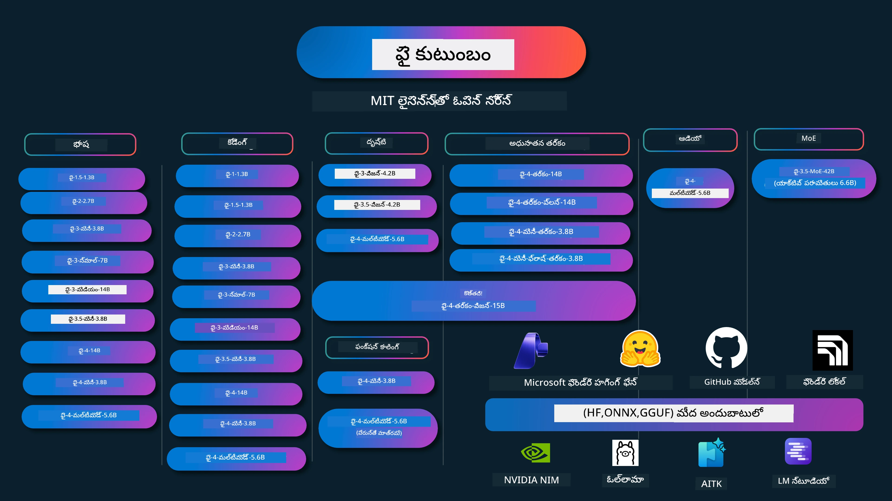

# Phi Cookbook: Microsoft యొక్క Phi మోడల్స్ తో టచ్ చేసి పరిశీలించు ఉదాహరణలు

[](https://codespaces.new/microsoft/phicookbook)
[](https://vscode.dev/redirect?url=vscode://ms-vscode-remote.remote-containers/cloneInVolume?url=https://github.com/microsoft/phicookbook)

[](https://GitHub.com/microsoft/phicookbook/graphs/contributors/?WT.mc_id=aiml-137032-kinfeylo)
[](https://GitHub.com/microsoft/phicookbook/issues/?WT.mc_id=aiml-137032-kinfeylo)
[](https://GitHub.com/microsoft/phicookbook/pulls/?WT.mc_id=aiml-137032-kinfeylo)
[](http://makeapullrequest.com?WT.mc_id=aiml-137032-kinfeylo)

[](https://GitHub.com/microsoft/phicookbook/watchers/?WT.mc_id=aiml-137032-kinfeylo)
[](https://GitHub.com/microsoft/phicookbook/network/?WT.mc_id=aiml-137032-kinfeylo)
[](https://GitHub.com/microsoft/phicookbook/stargazers/?WT.mc_id=aiml-137032-kinfeylo)

[](https://discord.com/invite/ByRwuEEgH4)

Phi అనేది Microsoft అభివృద్ధి చేసిన ఓపెన్ సోర్స్ AI మోడల్స్ సిరీస్.

Phi ప్రస్తుతం అత్యంత శక్తివంతమైన మరియు తక్కువ ఖర్చుతో కూడిన చిన్న భాషా మోడల్ (SLM), మరియు బహుభాషా, తునితనమైన దృష్టి, పాఠ్యం/చాట్ జనరేషన్, కోడింగ్, చిత్రాలు, ఆడియో మరియు ఇతర సందర్భాలలో చాలా మంచి బెంచ్‌మార్క్‌లను కలిగి ఉంది.

మీరు Phi ను క్లౌడ్ లేదా ఎడ్జ్ పరికరాలకు ఉపయోగించవచ్చు, మరియు మీకు పరిమిత కంప్యూటింగ్ శక్తి ఉన్నా సులభంగా జనరేటివ్ AI అనువర్తనాలను తయారుచేసుకోవచ్చు.

ఈ వనరులను ఉపయోగించడం ప్రారంభించడానికి ఈ దశలను అనుసరించండి:
1. **రిపాజిటరీని Fork చేయండి**: క్లిక్ చేయండి [](https://GitHub.com/microsoft/phicookbook/network/?WT.mc_id=aiml-137032-kinfeylo)
2. **రిపాజిటరీని క్లోన్ చేయండి**: `git clone https://github.com/microsoft/PhiCookBook.git`
3. [**Microsoft AI Discord కమ్యూనిటీలో జాయిన్ అయి నిపుణులు, సహవికాసకులతో కలుసుకోండి**](https://discord.com/invite/ByRwuEEgH4?WT.mc_id=aiml-137032-kinfeylo)



### 🌐 బహుభాషా మద్దతు

#### GitHub యాక్షన్ (ఆటోమేటిక్ & ఎల్లప్పుడూ తాజా) ద్వారా మద్దతు

<!-- CO-OP TRANSLATOR LANGUAGES TABLE START -->
[Arabic](../ar/README.md) | [Bengali](../bn/README.md) | [Bulgarian](../bg/README.md) | [Burmese (Myanmar)](../my/README.md) | [Chinese (Simplified)](../zh-CN/README.md) | [Chinese (Traditional, Hong Kong)](../zh-HK/README.md) | [Chinese (Traditional, Macau)](../zh-MO/README.md) | [Chinese (Traditional, Taiwan)](../zh-TW/README.md) | [Croatian](../hr/README.md) | [Czech](../cs/README.md) | [Danish](../da/README.md) | [Dutch](../nl/README.md) | [Estonian](../et/README.md) | [Finnish](../fi/README.md) | [French](../fr/README.md) | [German](../de/README.md) | [Greek](../el/README.md) | [Hebrew](../he/README.md) | [Hindi](../hi/README.md) | [Hungarian](../hu/README.md) | [Indonesian](../id/README.md) | [Italian](../it/README.md) | [Japanese](../ja/README.md) | [Kannada](../kn/README.md) | [Khmer](../km/README.md) | [Korean](../ko/README.md) | [Lithuanian](../lt/README.md) | [Malay](../ms/README.md) | [Malayalam](../ml/README.md) | [Marathi](../mr/README.md) | [Nepali](../ne/README.md) | [Nigerian Pidgin](../pcm/README.md) | [Norwegian](../no/README.md) | [Persian (Farsi)](../fa/README.md) | [Polish](../pl/README.md) | [Portuguese (Brazil)](../pt-BR/README.md) | [Portuguese (Portugal)](../pt-PT/README.md) | [Punjabi (Gurmukhi)](../pa/README.md) | [Romanian](../ro/README.md) | [Russian](../ru/README.md) | [Serbian (Cyrillic)](../sr/README.md) | [Slovak](../sk/README.md) | [Slovenian](../sl/README.md) | [Spanish](../es/README.md) | [Swahili](../sw/README.md) | [Swedish](../sv/README.md) | [Tagalog (Filipino)](../tl/README.md) | [Tamil](../ta/README.md) | [Telugu](./README.md) | [Thai](../th/README.md) | [Turkish](../tr/README.md) | [Ukrainian](../uk/README.md) | [Urdu](../ur/README.md) | [Vietnamese](../vi/README.md)

> **స్థానికంగా క్లోన్ చేయడం ఇష్టమా?**
>
> ఈ రిపాజిటరీ 50+ భాషల అనువాదాలను కలిగి ఉంది, ఇది డౌన్లోడ్ పరిమాణాన్ని గణనీయంగా పెంచుతుంది. అనువాదాలు లేకుండా క్లోన్ చేయడానికి, sparse checkout ఉపయోగించండి:
>
> **Bash / macOS / Linux:**
> ```bash
> git clone --filter=blob:none --sparse https://github.com/microsoft/PhiCookBook.git
> cd PhiCookBook
> git sparse-checkout set --no-cone '/*' '!translations' '!translated_images'
> ```
>
> **CMD (Windows):**
> ```cmd
> git clone --filter=blob:none --sparse https://github.com/microsoft/PhiCookBook.git
> cd PhiCookBook
> git sparse-checkout set --no-cone "/*" "!translations" "!translated_images"
> ```
>
> ఇది కోర్సును పూర్తిచేయడానికి అవసరమైనవన్నీ ఫాస్ట్ డౌన్లోడ్ తో ఇస్తుంది.
<!-- CO-OP TRANSLATOR LANGUAGES TABLE END -->

## Table of Contents
- పరిచయం - [ఫై ఫ్యామిలీకి స్వాగతం](./md/01.Introduction/01/01.PhiFamily.md) - [మీ పరిసరాలను సెటప్ చేయడం](./md/01.Introduction/01/01.EnvironmentSetup.md) - [ముఖ్య సాంకేతికతలను అర్థం చేసుకోవడం](./md/01.Introduction/01/01.Understandingtech.md) - [ఫై మోడల్స్ కోసం AI సురక్షితము](./md/01.Introduction/01/01.AISafety.md) - [ఫై హార్డ్‌వేర్ మద్దతు](./md/01.Introduction/01/01.Hardwaresupport.md) - [ఫై మోడల్స్ & వేదికలపై లభ్యత](./md/01.Introduction/01/01.Edgeandcloud.md) - [గైడన్స్ AI మరియు ఫై ఉపయోగించడం](./md/01.Introduction/01/01.Guidance.md) - [GitHub మార్కెట్ప్లేస్ మోడల్స్](https://github.com/marketplace/models) - [ఆజూర్ AI మోడల్ క్యాటలॉग](https://ai.azure.com) - వేరే వాతావరణాలలో ఫై ద్రుఢీకరణ - [హగ్గింగ్ ఫేస్](./md/01.Introduction/02/01.HF.md) - [GitHub మోడల్స్](./md/01.Introduction/02/02.GitHubModel.md) - [Microsoft Foundry మోడల్ క్యాటలాగ్](./md/01.Introduction/02/03.AzureAIFoundry.md) - [ఒల్లామా](./md/01.Introduction/02/04.Ollama.md) - [AI టూల్‌కిట్ VSCode (AITK)](./md/01.Introduction/02/05.AITK.md) - [NVIDIA NIM](./md/01.Introduction/02/06.NVIDIA.md) - [Foundry లోకల్](./md/01.Introduction/02/07.FoundryLocal.md) - ఫై ఫ్యామిలీలో ద్రుఢీకరణ - [iOSలో ఫై ద్రుఢీకరణ](./md/01.Introduction/03/iOS_Inference.md) - [ఆండ్రాయిడ్‌లో ఫై ద్రుఢీకరణ](./md/01.Introduction/03/Android_Inference.md) - [జెట్సన్‌లో ఫై ద్రుఢీకరణ](./md/01.Introduction/03/Jetson_Inference.md) - [AI PCలో ఫై ద్రుఢీకరణ](./md/01.Introduction/03/AIPC_Inference.md) - [ఆపిల్ MLX ఫ్రేమ్‌వర్క్‌తో ఫై ద్రుఢీకరణ](./md/01.Introduction/03/MLX_Inference.md) - [లోకల్ సర్వర్‌లో ఫై ద్రుఢీకరణ](./md/01.Introduction/03/Local_Server_Inference.md) - [AI టూల్‌కిట్ ఉపయోగించి రిమోట్ సర్వర్‌లో ఫై ద్రుఢీకరణ](./md/01.Introduction/03/Remote_Interence.md) - [రస్ట్‌తో ఫై ద్రుఢీకరణ](./md/01.Introduction/03/Rust_Inference.md) - [లోకల్‌లో ఫై విజన్ ద్రుఢీకరణ](./md/01.Introduction/03/Vision_Inference.md) - [కైతో AKS, ఆజూర్ కంటెయినర్స్ (అధికారిక మద్దతు)తో ఫై ద్రుఢీకరణ](./md/01.Introduction/03/Kaito_Inference.md) - [ఫై ఫ్యామిలీని పరిమాణీకరణ](./md/01.Introduction/04/QuantifyingPhi.md) - [llama.cpp ఉపయోగించి ఫై-3.5 / 4 పరిమాణీకరణ](./md/01.Introduction/04/UsingLlamacppQuantifyingPhi.md) - [onnxruntime కోసం జనరేటివ్ AI విస్తరణలతో ఫై-3.5 / 4 పరిమాణీకరణ](./md/01.Introduction/04/UsingORTGenAIQuantifyingPhi.md) - [Intel OpenVINO ఉపయోగించి ఫై-3.5 / 4 పరిమాణీకరణ](./md/01.Introduction/04/UsingIntelOpenVINOQuantifyingPhi.md) - [ఆపిల్ MLX ఫ్రేమ్‌వర్క్ ఉపయోగించి ఫై-3.5 / 4 పరిమాణీకరణ](./md/01.Introduction/04/UsingAppleMLXQuantifyingPhi.md) - ఫై మూల్యాంకనం - [సమాధాన AI](./md/01.Introduction/05/ResponsibleAI.md) - [Microsoft Foundryని మూల్యాంకనానికి ఉపయోగించడం](./md/01.Introduction/05/AIFoundry.md) - [మూల్యాంకనానికి ప్రాంప్ట్‌ఫ్లో ఉపయోగించడం](./md/01.Introduction/05/Promptflow.md) - ఆజూర్ AI సెర్చ్‌తో RAG - [ఫై-4-మినీ మరియు ఫై-4-మల్టీమోడల్(RAG) ను ఆజూర్ AI సెర్చ్‌తో ఎలా ఉపయోగించాలి](https://github.com/microsoft/PhiCookBook/blob/main/code/06.E2E/E2E_Phi-4-RAG-Azure-AI-Search.ipynb) - ఫై అనువర్తన అభివృద్ధి నమూనాలు - టెక్స్ట్ & చాట్ అనువర్తనాలు - ఫై-4 నమూనాలు - [📓] [ఫై-4-మినీ ONNX మోడల్‌తో చాట్](./md/02.Application/01.TextAndChat/Phi4/ChatWithPhi4ONNX/README.md) - [ఫై-4 లోకల్ ONNX మోడల్‌తో చాట్ .NET](../../md/04.HOL/dotnet/src/LabsPhi4-Chat-01OnnxRuntime) - [సెమెంటిక్ కర్నెల్ ఉపయోగించి ఫై-4 ONNX తో .NET కన్సోల్ చాట్ యాప్](../../md/04.HOL/dotnet/src/LabsPhi4-Chat-02SK) - ఫై-3 / 3.5 నమూనాలు - [బ్రౌజర్‌లో లోకల్ చాట్‌బాట్ ఫై3, ONNX రంట్ టైమ్ వెబ్ మరియు WebGPUతో](https://github.com/microsoft/onnxruntime-inference-examples/tree/main/js/chat) - [OpenVino చాట్](./md/02.Application/01.TextAndChat/Phi3/E2E_OpenVino_Chat.md) - [మల్టీ మోడల్ - ఇంటరాక్టివ్ ఫై-3-మినీ మరియు OpenAI విస్పర్](./md/02.Application/01.TextAndChat/Phi3/E2E_Phi-3-mini_with_whisper.md) - [MLFlow - ఒక రాపర్ నిర్మించడం మరియు MLFlowతో ఫై-3 ఉపయోగించడం](./md//02.Application/01.TextAndChat/Phi3/E2E_Phi-3-MLflow.md) - [మోడల్ ఆప్టిమైజేషన్ - ONNX Runtime వెబ్ కోసం ఫై-3-మిన్ మోడల్ ఎలా ఆప్టిమైజ్ చేయాలి Olive తో](https://github.com/microsoft/Olive/tree/main/examples/phi3) - [WinUI3 యాప్ ఫై-3 మినీ-4k-ఇన్‌స్ట్రక్ట్-onnx తో](https://github.com/microsoft/Phi3-Chat-WinUI3-Sample/) -[WinUI3 మల్టీ మోడల్ AI పవర్డ్ నోట్లు యాప్ నమూనా](https://github.com/microsoft/ai-powered-notes-winui3-sample) - [ప్రాంప్ట్ ఫ్లోతో అనుకూల ఫై-3 మోడల్స్ ఫైన్‌ట్యూన్ చేసి ఎంటిగ్రేట్ చేయడం](./md/02.Application/01.TextAndChat/Phi3/E2E_Phi-3-FineTuning_PromptFlow_Integration.md) - [Microsoft Foundryలో ప్రాంప్ట్ ఫ్లోతో అనుకూల ఫై-3 మోడల్స్‌ను ఫైన్‌ట్యూన్ చేసి ఎంటిగ్రేట్ చేయడం](./md/02.Application/01.TextAndChat/Phi3/E2E_Phi-3-FineTuning_PromptFlow_Integration_AIFoundry.md) - [Microsoft సమగ్ర AI నిబంధనలమీద కేంద్రీకృతం చేసుకుని Microsoft Foundryలో ఫైన్‌ట్యూన్ చేసిన ఫై-3 / ఫై-3.5 మోడల్‌ను మూల్యాంకనం చేయండి](./md/02.Application/01.TextAndChat/Phi3/E2E_Phi-3-Evaluation_AIFoundry.md) - [📓] [ఫై-3.5-మినీ-ఇన్‌స్ట్రక్ట్ భాషా అంచనాల నమూనా (చైనీస్/ఇంగ్లీష్)](./md/02.Application/01.TextAndChat/Phi3/phi3-instruct-demo.ipynb) - [ఫై-3.5-ఇన్‌స్ట్రక్ట్ WebGPU RAG చాట్‌బాట్](./md/02.Application/01.TextAndChat/Phi3/WebGPUWithPhi35Readme.md) - [విండోస్ GPU ఉపయోగించి ఫై-3.5-ఇన్‌స్ట్రక్ట్ ONNXతో ప్రాంప్ట్ ఫ్లో సొల్యూషన్ సృష్టించడం](./md/02.Application/01.TextAndChat/Phi3/UsingPromptFlowWithONNX.md) - [Android యాప్ సృష్టించడానికి Microsoft ఫై-3.5 tflite ఉపయోగించడం](./md/02.Application/01.TextAndChat/Phi3/UsingPhi35TFLiteCreateAndroidApp.md) - [స్థానిక ONNX ఫై-3 మోడల్ ఉపయోగించి Microsoft.ML.OnnxRuntime తో Q&A .NET ఉదాహరణ](../../md/04.HOL/dotnet/src/LabsPhi301) - [సెమెంటిక్ కర్నెల్ మరియు ఫై-3 తో .NET కన్సోల్ చాట్ యాప్](../../md/04.HOL/dotnet/src/LabsPhi302) - ఆజూర్ AI ఇన్ఫరెన్స్ SDK కోడ్ ఆధారిత నమూనాలు - ఫై-4 నమూనాలు - [📓] [ఫై-4-మల్టీమోడల్ ఉపయోగించి ప్రాజెక్ట్ కోడ్ని ఉత్పత్తి చేయండి](./md/02.Application/02.Code/Phi4/GenProjectCode/README.md) - ఫై-3 / 3.5 నమూనాలు - [Microsoft ఫై-3 ఫ్యామిలీతో మీ స్వంత Visual Studio Code GitHub కాపిలట్ చాట్ నిర్మించండి](./md/02.Application/02.Code/Phi3/VSCodeExt/README.md) - [GitHub మోడల్స్ ఉపయోగించి మీ స్వంత Visual Studio Code చాట్ కాపిలట్ ఏజెంట్‌ను ఫై-3.5 తో సృష్టించండి](/md/02.Application/02.Code/Phi3/CreateVSCodeChatAgentWithGitHubModels.md) - అధునాతన కారణం చూపించే నమూనాలు - ఫై-4 నమూనాలు - [📓] [ఫై-4-మినీ-రీజనింగ్ లేదా ఫై-4-రీజనింగ్ నమూనాలు](./md/02.Application/03.AdvancedReasoning/Phi4/AdvancedResoningPhi4mini/README.md) - [📓] [Microsoft Olive తో ఫై-4-మినీ-రీజనింగ్ ఫైన్‌ట్యూన్](./md/02.Application/03.AdvancedReasoning/Phi4/AdvancedResoningPhi4mini/olive_ft_phi_4_reasoning_with_medicaldata.ipynb) - [📓] [ఆపిల్ MLX తో ఫై-4-మినీ-రీజనింగ్ ఫైన్‌ట్యూన్](./md/02.Application/03.AdvancedReasoning/Phi4/AdvancedResoningPhi4mini/mlx_ft_phi_4_reasoning_with_medicaldata.ipynb) - [📓] [GitHub మోడల్స్‌తో ఫై-4-మినీ-రీజనింగ్](./md/02.Application/02.Code/Phi4r/github_models_inference.ipynb) - [📓] [Microsoft Foundry మోడల్స్‌తో ఫై-4-మినీ-రీజనింగ్](./md/02.Application/02.Code/Phi4r/azure_models_inference.ipynb) -
డెమోలు - [Phi-4-మినీ డెమోలు Hugging Face Spaces లో హోస్ట్ చేయబడి ఉన్నాయి](https://huggingface.co/spaces/microsoft/phi-4-mini?WT.mc_id=aiml-137032-kinfeylo) - [Phi-4-మల్టిమోడల్ డెమోలు Hugging Face Spaces లో హోస్ట్ చేయబడి ఉన్నాయి](https://huggingface.co/spaces/microsoft/phi-4-multimodal?WT.mc_id=aiml-137032-kinfeylo) - విజన్ నమూనాలు - Phi-4 నమూనాలు - [📓] [Phi-4-మల్టిమోడల్ ని ఉపయోగించి చిత్రాలను చదవడం మరియు కోడ్ సృష్టించడం](./md/02.Application/04.Vision/Phi4/CreateFrontend/README.md) - Phi-3 / 3.5 నమూనాలు - [📓][Phi-3-విజన్-చిత్రం టెక్ట్స్ నుండి టెక్ట్స్ కి](./md/02.Application/04.Vision/Phi3/E2E_Phi-3-vision-image-text-to-text-online-endpoint.ipynb) - [Phi-3-విజన్-ONNX](https://onnxruntime.ai/docs/genai/tutorials/phi3-v.html) - [📓][Phi-3-విజన్ CLIP ఎంబెడ్డింగ్](./md/02.Application/04.Vision/Phi3/E2E_Phi-3-vision-image-text-to-text-online-endpoint.ipynb) - [DEMO: Phi-3 రీసైక్లింగ్](https://github.com/jennifermarsman/PhiRecycling/) - [Phi-3-విజన్ - విజువల్ భాష సహాయకుడు - Phi3-విజన్ మరియు OpenVINO తో](https://docs.openvino.ai/nightly/notebooks/phi-3-vision-with-output.html) - [Phi-3 విజన్ Nvidia NIM](./md/02.Application/04.Vision/Phi3/E2E_Nvidia_NIM_Vision.md) - [Phi-3 విజన్ OpenVino](./md/02.Application/04.Vision/Phi3/E2E_OpenVino_Phi3Vision.md) - [📓][Phi-3.5 విజన్ మల్టీ-ఫ్రేమ్ లేదా మల్టీ-ఇమేజ్ నమూనా](./md/02.Application/04.Vision/Phi3/phi3-vision-demo.ipynb) - [Phi-3 విజన్ లోకల్ ONNX మోడల్ Microsoft.ML.OnnxRuntime .NET ఉపయోగించి](../../md/04.HOL/dotnet/src/LabsPhi303) - [మెనూ ఆధారిత Phi-3 విజన్ లోకల్ ONNX మోడల్ Microsoft.ML.OnnxRuntime .NET ఉపయోగించి](../../md/04.HOL/dotnet/src/LabsPhi304) - రీజనింగ్-విజన్ నమూనాలు - Phi-4-రీజనింగ్-విజన్-15B - [📓] [Phi-4-రీజనింగ్-విజన్-15B ఉపయోగించి జే వాకింగ్ గుర్తించడం](./md/02.Application/10.ReasoningVision/Phi_4_reasoning_vision_15b_Jaywalking.ipynb) - [📓] [Phi-4-రీజనింగ్-విజన్-15B ఉపయోగించి గణితం](./md/02.Application/10.ReasoningVision/Phi_4_reasoning_vision_15b_Math.ipynb) - [📓] [Phi-4-రీజనింగ్-విజన్-15B ఉపయోగించి UI గుర్తించడం](./md/02.Application/10.ReasoningVision/Phi_4_reasoning_vision_15b_ui.ipynb) - గణితం నమూనాలు - Phi-4-మినీ-ఫ్లాష్-రీజనింగ్-ఇన్‌స్ట్రక్చ్ నమూనాలు [Phi-4-మినీ-ఫ్లాష్-రీజనింగ్-ఇన్‌స్ట్రక్చ్ తో గణితం డెమో](./md/02.Application/09.Math/MathDemo.ipynb) - ఆడియో నమూనాలు - Phi-4 నమూనాలు - [📓] [Phi-4-మల్టిం‌మోడల్ ఉపయోగించి ఆడియో ట్రాన్స్క్రిప్షన్లు తీసుకోవడం](./md/02.Application/05.Audio/Phi4/Transciption/README.md) - [📓] [Phi-4-మల్టిమోడల్ ఆడియో నమూనా](./md/02.Application/05.Audio/Phi4/Siri/demo.ipynb) - [📓] [Phi-4-మల్టిమోడల్ స్పీచ్ అనువాద నమూనా](./md/02.Application/05.Audio/Phi4/Translate/demo.ipynb) - [.NET కన్సోల్ అప్లికేషన్ Phi-4-మల్టిమోడల్ ఆడియో ఉపయోగించి ఆడియో ఫైల్‌ని విశ్లేషించి ట్రాన్స్క్రిప్ట్ రూపొందించడం](../../md/04.HOL/dotnet/src/LabsPhi4-MultiModal-02Audio) - MOE నమూనాలు - Phi-3 / 3.5 నమూనాలు - [📓] [Phi-3.5 మిశ్రమం ఆఫ్ ఎక్స్పర్ట్స్ మోడల్స్ (MoEs) సోషల్ మీడియా నమూనా](./md/02.Application/06.MoE/Phi3/phi3_moe_demo.ipynb) - [📓] [NVIDIA NIM Phi-3 MOE, Azure AI సెర్చ్, మరియు LlamaIndex తో Retrieval-Augmented Generation (RAG) పైప్‌లైన్ నిర్మాణం](./md/02.Application/06.MoE/Phi3/azure-ai-search-nvidia-rag.ipynb) - - ఫంక్షన్ కాలింగ్ నమూనాలు - Phi-4 నమూనాలు 🆕 - [📓] [Phi-4-మినీతో ఫంక్షన్ కాలింగ్ ఉపయోగించడం](./md/02.Application/07.FunctionCalling/Phi4/FunctionCallingBasic/README.md) - [📓] [Phi-4-మినీతో బహు ఏజెంట్లను సృష్టించడానికి ఫంక్షన్ కాలింగ్ ఉపయోగించడం](./md/02.Application/07.FunctionCalling/Phi4/Multiagents/Phi_4_mini_multiagent.ipynb) - [📓] [Ollama తో ఫంక్షన్ కాలింగ్ ఉపయోగించడం](./md/02.Application/07.FunctionCalling/Phi4/Ollama/ollama_functioncalling.ipynb) - [📓] [ONNX తో ఫంక్షన్ కాలింగ్ ఉపయోగించడం](./md/02.Application/07.FunctionCalling/Phi4/ONNX/onnx_parallel_functioncalling.ipynb) - మల్టిమోడల్ మిక్సింగ్ నమూనాలు - Phi-4 నమూనాలు 🆕 - [📓] [టెక్నాలజీ జర్నలిస్ట్ గా Phi-4-మల్టిమోడల్ ఉపయోగించడం](./md/02.Application/08.Multimodel/Phi4/TechJournalist/phi_4_mm_audio_text_publish_news.ipynb) - [.NET కన్సోల్ అప్లికేషన్ Phi-4-మల్టిమోడల్ ఉపయోగించి చిత్రాలను విశ్లేషించడం](../../md/04.HOL/dotnet/src/LabsPhi4-MultiModal-01Images) - ఫైన్-ట్యూనింగ్ Phi నమూనాలు - [ఫైన్-ట్యూనింగ్ సన్నివేశాలు](./md/03.FineTuning/FineTuning_Scenarios.md) - [ఫైన్-ట్యూనింగ్ vs RAG](./md/03.FineTuning/FineTuning_vs_RAG.md) - [Phi-3ని పరిశ్రమ నిపుణుడిగా మారుస్తూ ఫైన్-ట్యూనింగ్](./md/03.FineTuning/LetPhi3gotoIndustriy.md) - [VS Code కోసం AI టూల్‌కిట్ తో Phi-3 ను ఫైన్-ట్యూన్ చేయడం](./md/03.FineTuning/Finetuning_VSCodeaitoolkit.md) - [Azure మెషీన్ లెర్నింగ్ సర్వీస్ తో Phi-3 ను ఫైన్-ట్యూన్ చేయడం](./md/03.FineTuning/Introduce_AzureML.md) - [Lora తో Phi-3 ను ఫైన్-ట్యూన్ చేయడం](./md/03.FineTuning/FineTuning_Lora.md) - [QLora తో Phi-3 ను ఫైన్-ట్యూన్ చేయడం](./md/03.FineTuning/FineTuning_Qlora.md) - [Microsoft Foundry తో Phi-3 ను ఫైన్-ట్యూన్ చేయడం](./md/03.FineTuning/FineTuning_AIFoundry.md) - [Azure ML CLI/SDK తో Phi-3 ను ఫైన్-ట్యూన్ చేయడం](./md/03.FineTuning/FineTuning_MLSDK.md) - [Microsoft Olive తో ఫైన్-ట్యూనింగ్](./md/03.FineTuning/FineTuning_MicrosoftOlive.md) - [Microsoft Olive Hands-On Lab తో ఫైన్-ట్యూనింగ్](./md/03.FineTuning/olive-lab/readme.md) - [Weights and Bias తో Phi-3-విజన్ ను ఫైన్-ట్యూన్ చేయడం](./md/03.FineTuning/FineTuning_Phi-3-visionWandB.md) - [Apple MLX Framework తో Phi-3 ను ఫైన్-ట్యూన్ చేయడం](./md/03.FineTuning/FineTuning_MLX.md) - [Phi-3-విజన్ (అధికారిక మద్దతు) ఫైన్-ట్యూనింగ్](./md/03.FineTuning/FineTuning_Vision.md) - [Kaito AKS, Azure Containers తో Phi-3 ను ఫైన్-ట్యూన్ చేయడం (అధికారిక మద్దతు)](./md/03.FineTuning/FineTuning_Kaito.md) - [Phi-3 మరియు 3.5 విజన్ ను ఫైన్-ట్యూన్ చేయడం](https://github.com/2U1/Phi3-Vision-Finetune) - హాండ్స్ ఆన్ ల్యాబ్ - [కటింగ్-ఎడ్జ్ మోడల్స్: LLMs, SLMs, లోకల్ డెవలప్‌మెంట్ మరియు మరిన్ని అన్వేషించడం](https://github.com/microsoft/aitour-exploring-cutting-edge-models) - [NLP సామర్ధ్యాన్ని ఆ Fach ఐక్కించుకోవడం: Microsoft Olive తో ఫైన్-ట్యూనింగ్](https://github.com/azure/Ignite_FineTuning_workshop) - అకాడమిక్ పరిశోధన పత్రాలు మరియు ప్రచురణలు - [Textbooks Are All You Need II: phi-1.5 సాంకేతిక నివేదిక](https://arxiv.org/abs/2309.05463) - [Phi-3 సాంకేతిక నివేదిక: మీ ఫోన్‌లో స్థానికంగా ఉన్న అత్యంత సామర్థ్యవంతమైన భాషా మోడల్](https://arxiv.org/abs/2404.14219) - [Phi-4 సాంకేతిక నివేదిక](https://arxiv.org/abs/2412.08905) - [Phi-4-మినీ సాంకేతిక నివేదిక: మిశ్రమ ఆఫ్ లోరాస్ల ద్వారా చురుకైన కానీ శక్తివంతమైన మల్టిమోడల్ భాషా మోడల్స్](https://arxiv.org/abs/2503.01743) - [వాహన ఫంక్షన్-కాల్ కోసం చిన్న భాషా మోడల్స్ అప్టిమైజ్ చేయడం](https://arxiv.org/abs/2501.02342) - [(WhyPHI) బహుముఖ ఎంపిక ప్రశ్నలకు సమాధానం కోసం PHI-3 ఫైన్-ట్యూనింగ్: విధానం, ఫలితాలు, మరియు సవాళ్లు](https://arxiv.org/abs/2501.01588) - [Phi-4-రీజనింగ్ సాంకేతిక నివేదిక](https://www.microsoft.com/en-us/research/wp-content/uploads/2025/04/phi_4_reasoning.pdf)
- [Phi-4-mini-తార్కిక నివేదిక](https://huggingface.co/microsoft/Phi-4-mini-reasoning/blob/main/Phi-4-Mini-Reasoning.pdf)
# ఫై కుక్బుక్: మైక్రోసాఫ్ట్ ఫై మోడల్స్‌తో హ్యాండ్స్-ఆన్ ఉదాహరణలు

[](https://codespaces.new/microsoft/phicookbook)
[](https://vscode.dev/redirect?url=vscode://ms-vscode-remote.remote-containers/cloneInVolume?url=https://github.com/microsoft/phicookbook)

[](https://GitHub.com/microsoft/phicookbook/graphs/contributors/?WT.mc_id=aiml-137032-kinfeylo)
[](https://GitHub.com/microsoft/phicookbook/issues/?WT.mc_id=aiml-137032-kinfeylo)
[](https://GitHub.com/microsoft/phicookbook/pulls/?WT.mc_id=aiml-137032-kinfeylo)
[](http://makeapullrequest.com?WT.mc_id=aiml-137032-kinfeylo)

[](https://GitHub.com/microsoft/phicookbook/watchers/?WT.mc_id=aiml-137032-kinfeylo)
[](https://GitHub.com/microsoft/phicookbook/network/?WT.mc_id=aiml-137032-kinfeylo)
[](https://GitHub.com/microsoft/phicookbook/stargazers/?WT.mc_id=aiml-137032-kinfeylo)

[](https://discord.com/invite/ByRwuEEgH4)

ఫై అనేది మైక్రోసాఫ్ట్ అభివృద్ధి చేసిన ఓపెన్ సోర్స్ AI మోడల్స్ సిరీస్.

ఫై ప్రస్తుతం చాలా శక్తివంతమైన మరియు ధరానుకూలమైన చిన్న భాషా మోడల్ (SLM), ఇది బహుభాషా, తర్కం, టెక్స్ట్/చాట్ జెనరేషన్, కోడింగ్, చిత్రాలు, ఆడియో మరియు ఇతర సందర్భాలలో మంచి బెంచ్‌మార్క్‌లను కలిగి ఉంది.

మీరు ఫైని క్లౌడ్ లేదా ఎడ్జ్ డివైసులకు అమలు చేయవచ్చు, మరియు పరిమిత కంప్యూటింగ్ శక్తితో సులభంగా జనరేటివ్ AI అప్లికేషన్లు రూపొందించవచ్చు.

ఈ వనరును ఉపయోగించడం ప్రారంభించేందుకు ఈ దశలను అనుసరించండి:
1. **రెపాజిటరీని ఫోర్క్ చేయండి**: క్లోక్ [](https://GitHub.com/microsoft/phicookbook/network/?WT.mc_id=aiml-137032-kinfeylo)
2. **రెపాజిటరీని క్లోన్ చేయండి**: `git clone https://github.com/microsoft/PhiCookBook.git`
3. [**Microsoft AI Discord కమ్యూనిటీ చేరండి మరియు నిపుణులు మరియు డెవలపర్లను చూసుకోండి**](https://discord.com/invite/ByRwuEEgH4?WT.mc_id=aiml-137032-kinfeylo)


### 🌐 బహుభాషా మద్దతు

#### GitHub యాక్షన్ ద్వారా మద్దతు (ఆటోమేటెడ్ & ఎప్పుడూ తాజా)

<!-- CO-OP TRANSLATOR LANGUAGES TABLE START -->
[Arabic](../ar/README.md) | [Bengali](../bn/README.md) | [Bulgarian](../bg/README.md) | [Burmese (Myanmar)](../my/README.md) | [Chinese (Simplified)](../zh-CN/README.md) | [Chinese (Traditional, Hong Kong)](../zh-HK/README.md) | [Chinese (Traditional, Macau)](../zh-MO/README.md) | [Chinese (Traditional, Taiwan)](../zh-TW/README.md) | [Croatian](../hr/README.md) | [Czech](../cs/README.md) | [Danish](../da/README.md) | [Dutch](../nl/README.md) | [Estonian](../et/README.md) | [Finnish](../fi/README.md) | [French](../fr/README.md) | [German](../de/README.md) | [Greek](../el/README.md) | [Hebrew](../he/README.md) | [Hindi](../hi/README.md) | [Hungarian](../hu/README.md) | [Indonesian](../id/README.md) | [Italian](../it/README.md) | [Japanese](../ja/README.md) | [Kannada](../kn/README.md) | [Khmer](../km/README.md) | [Korean](../ko/README.md) | [Lithuanian](../lt/README.md) | [Malay](../ms/README.md) | [Malayalam](../ml/README.md) | [Marathi](../mr/README.md) | [Nepali](../ne/README.md) | [Nigerian Pidgin](../pcm/README.md) | [Norwegian](../no/README.md) | [Persian (Farsi)](../fa/README.md) | [Polish](../pl/README.md) | [Portuguese (Brazil)](../pt-BR/README.md) | [Portuguese (Portugal)](../pt-PT/README.md) | [Punjabi (Gurmukhi)](../pa/README.md) | [Romanian](../ro/README.md) | [Russian](../ru/README.md) | [Serbian (Cyrillic)](../sr/README.md) | [Slovak](../sk/README.md) | [Slovenian](../sl/README.md) | [Spanish](../es/README.md) | [Swahili](../sw/README.md) | [Swedish](../sv/README.md) | [Tagalog (Filipino)](../tl/README.md) | [Tamil](../ta/README.md) | [Telugu](./README.md) | [Thai](../th/README.md) | [Turkish](../tr/README.md) | [Ukrainian](../uk/README.md) | [Urdu](../ur/README.md) | [Vietnamese](../vi/README.md)

> **స్థానికంగా క్లోన్ చేయాలనుకుందా?**
>
> ఈ రెపాజిటరీ 50+ భాషా అనువాదాలను కలిగి ఉంది, ఇది డౌన్లోడ్ పరిమాణాన్ని గణనీయంగా పెంచుతుంది. అనువాదాలు లేకుండా క్లోన్ చేయడానికి స్పార్స్ చెకౌట్ ఉపయోగించండి:
>
> **బాష్ / మాక్ఒఎస్ / లినక్స్:**
> ```bash
> git clone --filter=blob:none --sparse https://github.com/microsoft/PhiCookBook.git
> cd PhiCookBook
> git sparse-checkout set --no-cone '/*' '!translations' '!translated_images'
> ```
>
> **CMD (విండోస్):**
> ```cmd
> git clone --filter=blob:none --sparse https://github.com/microsoft/PhiCookBook.git
> cd PhiCookBook
> git sparse-checkout set --no-cone "/*" "!translations" "!translated_images"
> ```
>
> దీని ద్వారా మీరు చాలా వేగంగా డౌన్లోడ్‌తో కోర్సును పూర్తి చేయడానికి అవసరమైన అన్ని విషయాలను పొందవచ్చు.
<!-- CO-OP TRANSLATOR LANGUAGES TABLE END -->

## విషయ సూచిక

## ఫై మోడల్స్ ఉపయోగించడం

### మైక్రోసాఫ్ట్ ఫౌండ్రీలో ఫై

మీరు Microsoft Phi ని ఉపయోగించడం మరియు వివిధ హార్డ్‌వేర్ డివైసుల్లో E2E పరిష్కారాలను ఎలా నిర్మించాలో నేర్చుకోగలరు. మీరు సొంతంగా ఫై అనుభవించాలనుకుంటే, ముందుగా మోడల్స్‌తో ఆడుతూ మీ సందర్భాలకు ఫైని అనుకూలీకరించడం ప్రారంభించండి [Microsoft Foundry Azure AI Model Catalog](https://aka.ms/phi3-azure-ai) ద్వారా. మీరు [Microsoft Foundry](/md/02.QuickStart/AzureAIFoundry_QuickStart.md) సేకరణతో ప్రారంభించవచ్చు.

**ప్లేగ్రౌండ్**  
ప్రతి మోడల్‌కు పరీక్షించుకునేందుకు ప్రత్యేక ప్లేగ్రౌండ్ లభ్యం [Azure AI Playground](https://aka.ms/try-phi3).

### GitHub మోడల్స్‌లో ఫై

మీరు Microsoft Phi ఉపయోగించాలని మరియు వివిధ హార్డ్‌వేర్ డివైసుల్లో E2E పరిష్కారాలు ఎలా నిర్మించాలో నేర్చుకోవచ్చు. మీరు సొంతంగా ఫై అనుభవించాలనుకుంటే, ముందుగా మోడల్‌తో ఆడుతూ మీ సందర్భాలకు ఫైని అనుకూలీకరించడం ప్రారంభించండి [GitHub Model Catalog](https://github.com/marketplace/models?WT.mc_id=aiml-137032-kinfeylo) ద్వారా. మీరు [GitHub Model Catalog](/md/02.QuickStart/GitHubModel_QuickStart.md) తో ప్రారంభించవచ్చు.

**ప్లేగ్రౌండ్**  
ప్రతి మోడల్‌కు పరీక్షించడానికి ప్రత్యేక [ప్లేగ్రౌండ్ లభ్యం](/md/02.QuickStart/GitHubModel_QuickStart.md) ఉంది.

### Hugging Face పై ఫై

మీరు మోడల్‌ను [Hugging Face](https://huggingface.co/microsoft) లో కూడా కనుగొనవచ్చు

**ప్లేగ్రౌండ్**  
[Hugging Chat ప్లేగ్రౌండ్](https://huggingface.co/chat/models/microsoft/Phi-3-mini-4k-instruct)

## 🎒 ఇతర కోర్సులు

మన బృందం ఇతర కోర్సులను కూడా రూపొందిస్తుంది! వీటిని పరిశీలించండి:

<!-- CO-OP TRANSLATOR OTHER COURSES START -->
### లాంగ్‌చెయిన్  
[](https://aka.ms/langchain4j-for-beginners)  
[](https://aka.ms/langchainjs-for-beginners?WT.mc_id=m365-94501-dwahlin)  
[](https://github.com/microsoft/langchain-for-beginners?WT.mc_id=m365-94501-dwahlin)  
---

### Azure / Edge / MCP / ఏజెంట్లు  
[](https://github.com/microsoft/AZD-for-beginners?WT.mc_id=academic-105485-koreyst)  
[](https://github.com/microsoft/edgeai-for-beginners?WT.mc_id=academic-105485-koreyst)  
[](https://github.com/microsoft/mcp-for-beginners?WT.mc_id=academic-105485-koreyst)  
[](https://github.com/microsoft/ai-agents-for-beginners?WT.mc_id=academic-105485-koreyst)  

---

### జనరేటివ్ AI సిరీస్  
[](https://github.com/microsoft/generative-ai-for-beginners?WT.mc_id=academic-105485-koreyst)  
[-9333EA?style=for-the-badge&labelColor=E5E7EB&color=9333EA)](https://github.com/microsoft/Generative-AI-for-beginners-dotnet?WT.mc_id=academic-105485-koreyst)  

[-C084FC?style=for-the-badge&labelColor=E5E7EB&color=C084FC)](https://github.com/microsoft/generative-ai-for-beginners-java?WT.mc_id=academic-105485-koreyst)
[-E879F9?style=for-the-badge&labelColor=E5E7EB&color=E879F9)](https://github.com/microsoft/generative-ai-with-javascript?WT.mc_id=academic-105485-koreyst)

---
 
### ప్రాథమిక అభ్యసనం
[](https://aka.ms/ml-beginners?WT.mc_id=academic-105485-koreyst)
[](https://aka.ms/datascience-beginners?WT.mc_id=academic-105485-koreyst)
[](https://aka.ms/ai-beginners?WT.mc_id=academic-105485-koreyst)
[](https://github.com/microsoft/Security-101?WT.mc_id=academic-96948-sayoung)
[](https://aka.ms/webdev-beginners?WT.mc_id=academic-105485-koreyst)
[](https://aka.ms/iot-beginners?WT.mc_id=academic-105485-koreyst)
[](https://github.com/microsoft/xr-development-for-beginners?WT.mc_id=academic-105485-koreyst)

---
 
### కోపైలట్ శ్రేణి
[](https://aka.ms/GitHubCopilotAI?WT.mc_id=academic-105485-koreyst)
[](https://github.com/microsoft/mastering-github-copilot-for-dotnet-csharp-developers?WT.mc_id=academic-105485-koreyst)
[](https://github.com/microsoft/CopilotAdventures?WT.mc_id=academic-105485-koreyst)
<!-- CO-OP TRANSLATOR OTHER COURSES END -->

## బాధ్యతాయుతమైన AI

మైక్రోసాఫ్ట్ మా కస్టమర్లకు మా AI ఉత్పత్తులను బాధ్యతాయుతంగా ఉపయోగించడంలో సహాయం చేయడం, మా అభ్యసనాలను పంచుకోవడం, మరియు Transparency Notes మరియు Impact Assessments వంటి సాధనాల ద్వారా విశ్వసనీయ భాగస్వామ్యాలను నిర్మించడం కోసం కట్టుబడి ఉంది. ఈ వనరుల చాలాకాలం [https://aka.ms/RAI](https://aka.ms/RAI) వద్ద అందుబాటులో ఉన్నాయి.
బాధ్యతాయుతమైన AI కోసం మైక్రోసాఫ్ట్ యొక్క దృష్టికోణం సామరస్యం, విశ్వసనీయత మరియు భద్రత, గోప్యత మరియు సెక్యూరిటీ, సమానత్వం, పారదర్శకత మరియు బాధ్యతాదాయకత వంటి మా AI సిద్దాంతాలపై ఆధారపడి ఉంటుంది.

ఈ నమూనాలో ఉపయోగించిన పెద్దస్థాయి సహజ భాష, చిత్రం, మరియు స్వరం మోడల్స్ - వాటి ప్రవర్తన అన్యాయమైన, అననుకూలమైన లేదా అపవన్మూలకంగా ఉండే అవకాశం ఉంది, ఇది నష్టాలను కలిగించవచ్చు. ప్రమాదాలు మరియు పరిమితుల గురించి మాట్లాడుకునేందుకు దయచేసి [Azure OpenAI service Transparency note](https://learn.microsoft.com/legal/cognitive-services/openai/transparency-note?tabs=text) ను సంప్రదించండి.

ఈ ప్రమాదాలను తగ్గించడానికి సిఫార్సు చేయబడిన విధానం మీ ఆర్కిటెక్చర్‌లో హానికర ప్రవర్తనను గుర్తించి నివారించగల భద్రతా వ్యవస్థను చేర్చడం. [Azure AI Content Safety](https://learn.microsoft.com/azure/ai-services/content-safety/overview) ఒక స్వతంత్ర రక్షణ పొరని అందిస్తుంది, ఇది అప్లికేషన్లు మరియు సేవల్లో హానికరమైన వినియోగదారు మరియు AI-సృష్టించబడిన కంటెంట్‌ను గుర్తించగలదు. Azure AI Content Safety టెక్స్ట్ మరియు చిత్రం APIs కలిగి ఉంది, ఇవి హానికరమైన పదార్థాన్ని గుర్తించడానికి అనుమతిస్తాయి. Microsoft Foundry లో Content Safety సర్వీస్ వివిధ రకాల హానికర కంటెంట్ గుర్తించడానికి నమూనా కోడ్ పరిశీలించడానికి, ప్రతిపాదించే అవకాశం కల్పిస్తుంది. క్రింది [త్వరితారంభ వివరణ](https://learn.microsoft.com/azure/ai-services/content-safety/quickstart-text?tabs=visual-studio%2Clinux&pivots=programming-language-rest) సర్వీస్‌కు అభ్యర్థనలు చేయడంలో మీకు మార్గనిర్దేశం చేస్తుంది.

మరో అంశం మాత్రం మొత్తం అప్లికేషన్ పనితీరు. మల్టీ-మోడల్ మరియు మల్టీ-మోడల్స్ అప్లికేషన్లతో, పనితీరు అంటే మీరు మరియు మీ వినియోగదారులు ఆశించే విధంగా వ్యవస్థ పని చేయడం, హానికర ఫలితాలు సృష్టించకూడదు అని అర్థం. మీరు మొత్తం అప్లికేషన్ పనితీరు అయిడెంటిఫై చేసేందుకు [Performance and Quality and Risk and Safety evaluators](https://learn.microsoft.com/azure/ai-studio/concepts/evaluation-metrics-built-in) ఉపయోగించవచ్చు. మీరు మీకు ఇష్టమైన [custom evaluators](https://learn.microsoft.com/azure/ai-studio/how-to/develop/evaluate-sdk#custom-evaluators)ను సృష్టించి, అంచనా వేయవచ్చు.

మీరు అభివృద్ధి వాతావరణంలో మీ AI అప్లికేషన్‌ను [Azure AI Evaluation SDK](https://microsoft.github.io/promptflow/index.html) ఉపయోగించి అంచనా వేయవచ్చు. పరీక్షా డేటాసెట్ లేదా లక్ష్యాన్ని ఇచ్చిన తర్వాత, మీ జనరేటివ్ AI అప్లికేషన్ ఉత్పత్తులను నిర్మిత ఎన్నికారులతో లేదా మీ ఇష్టమైన కస్టమ్ ఎన్నికారులతో పరిమాణాత్మకంగా కొలిచవచ్చు. సిస్టమ్ అంచనా కోసం azure ai evaluation sdk ప్రారంభించడానికి మీరు [త్వరితారంభ మార్గదర్శకాన్ని](https://learn.microsoft.com/azure/ai-studio/how-to/develop/flow-evaluate-sdk) అనుసరించవచ్చు. ఒకసారి మీరు అంచనా రన్‌ను అమలు చేసిన తర్వాత, [Microsoft Foundryలో ఫలితాలను విజువలైజ్](https://learn.microsoft.com/azure/ai-studio/how-to/evaluate-flow-results) చేయవచ్చు.

## ట్రేడ్‌మార్కులు

ఈ ప్రాజెక్ట్‌లో ప్రాజెక్టులు, ఉత్పత్తులు లేదా సేవల ట్రేడ్‌మార్కులు లేదా లోగోలు ఉండవచ్చు. మైక్రోసాఫ్ట్ ట్రేడ్‌మార్కులు లేదా లోగోల అధికారింగా ఉపయోగించడం [Microsoft's Trademark & Brand Guidelines](https://www.microsoft.com/legal/intellectualproperty/trademarks/usage/general) అనుసరించాలి మరియు వాటిని పాటించాలి.
ఈ ప్రాజెక్ట్ యొక్క మార్చబడిన సంస్కరణలలో మైక్రోసాఫ్ట్ ట్రేడ్‌మార్కులు లేదా లోగోల ఉపయోగం సంఉత్పన్న కలుగజేయకూడదు లేదా మైక్రోసాఫ్ట్ స్పాన్సర్‌షిప్ అని భావింపజేయకూడదు. మూడవ పక్ష ట్రేడ్‌మార్కులు లేదా లోగోలు వాడకం ఆ మూడవ పక్ష విధానాలకు చెందుతుంది.

## సహాయం పొందడం

మీరు అడ్డుకోకపోతే లేదా AI ఆప్లికేషన్లు నిర్మాణం పై ఏవైనా ప్రశ్నలు ఉంటే చేరండి:

[](https://aka.ms/foundry/discord)

ఉత్పత్తి అభిప్రాయం లేదా లోపాలు ఉంటే సృష్టించే సమయం లో సందర్శించండి:

[](https://aka.ms/foundry/forum)

---

<!-- CO-OP TRANSLATOR DISCLAIMER START -->
**డిస్క్లెయిమర్**:  
ఈ పత్రం AI అనువాద సేవ [Co-op Translator](https://github.com/Azure/co-op-translator) ఉపయోగించి అనువదించబడింది. మేము సరిగ్గా అనువదించడానికి ప్రయత్నించినప్పటికీ, ఆటోమేటిక్ అనువాదాలలో పొరపాట్లు లేదా తప్పులు ఉండవచ్చు. అసలు పత్రాన్ని దాని స్థానిక భాషలోనే అధికారిక మూలంగా పరిగణించాలి. ముఖ్యమైన సమాచారానికి, నిపుణుల చేతి అనువాదం సూచించబడుతుంది. ఈ అనువాదం వలన సంభవించే ఏవైనా విరుద్ధ అవగాహనలకు లేదా తప్పు అర్థాలకైనా మేము బాధ్యతగల వారు కాదు.
<!-- CO-OP TRANSLATOR DISCLAIMER END -->