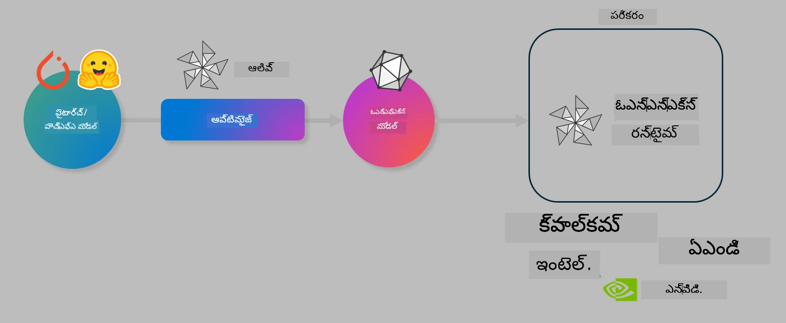

<!--
CO_OP_TRANSLATOR_METADATA:
{
  "original_hash": "6bbe47de3b974df7eea29dfeccf6032b",
  "translation_date": "2025-12-21T15:29:12+00:00",
  "source_file": "code/04.Finetuning/olive-lab/readme.md",
  "language_code": "te"
}
-->
# ల్యాబ్. డివైస్-ఆన్‌ ఇన్ఫరెన్స్ కోసం AI మోడళ్లను ఆప్టిమైజ్ చేయండి

## పరిచయం 

> [!IMPORTANT]
> ఈ ల్యాబ్ కు సంబంధిత డ్రైవర్లు మరియు CUDA టూల్‌కిట్ (సంస్కరణ 12+) ఇన్‌స్టాల్ చేయబడిన **Nvidia A10 లేదా A100 GPU** అవసరం.

> [!NOTE]
> ఇది OLIVE ఉపయోగించి డివైస్‌లో ఇన్ఫరెన్స్ కోసం మోడళ్లను ఆప్టిమైజ్ చేయడంపై ప్రాథమిక అభ్యాసాన్ని మీకు ప్రాక్టికల్‌గా అందించే **35 నిమిషాల** ల్యాబ్.

## నేర్చుకోవాల్సిన లక్ష్యాలు

ఈ ల్యాబ్ ముగిసే ముందు, మీరు OLIVE ఉపయోగించి చేయగలుగుతారు:

- AWQ పరిమాణీకరణ విధిని ఉపయోగించి AI మోడల్‌ను క్వాంటైజ్ చేయడం.
- ఒక నిర్దిష్ట పనికి AI మోడల్‌ను ఫైన్-ట్యూన్ చేయడం.
- ONNX Runtimeలో సమర్థవంతమైన డివైస్-ఆన్ ఇన్ఫరెన్స్ కోసం LoRA అడాప్టర్లను (ఫైన్-ట్యూన్ చేసిన మోడల్) ఉత్పత్తి చేయడం.

### Olive అంటే ఏమిటి

Olive (*O*NNX *live*) ఒక మోడల్ ఆప్టిమైజేషన్ టూల్‌కిట్ మరియు CLIతో కూడిన ప్యాకేజ్, ఇది మీకు ONNX runtime +++https://onnxruntime.ai+++ కోసం నాణ్యత మరియు పనితనంతో మోడళ్లను షిప్ చేయడానికి వీలైనంత చేయిస్తుంది.



Oliveకి ఇన్‌పుట్ సాధారణంగా ఒక PyTorch లేదా Hugging Face మోడల్ ఉంటుంది మరియు ఔట్‌పుట్ ఒక ఆప్టిమైజ్డ్ ONNX మోడల్‌గా ఉంటుంది, ఇది ONNX runtime నడిచే ఒక డివైస్ (డిప్లాయ్‌మెంట్ లక్ష్యం)పై అమలు చేయబడుతుంది. Olive ఆ డిప్లాయ్‌మెంట్ లక్ష్యానికి చెందిన AI ఆక్సలరేటర్ (NPU, GPU, CPU) కోసం మోడల్‌ను ఆప్టిమైజ్ చేస్తుంది — ఈ ఆక్సలరేటర్లు Qualcomm, AMD, Nvidia లేదా Intel వంటి హార్డ్‌వేర్ వినియోగదారులచే అందించబడతాయి.

Olive ఒక *workflow*ని అమలు చేస్తుంది, ఇది వ్యక్తిగత మోడల్ ఆప్టిమైజేషన్ పనులుగా పిలవబడే *passes* అనే ఆదేశబద్ధమైన క్రమం — ఉదాహరణగా passes లో ఉంటాయి: మోడల్ కంప్రెషన్, గ్రాఫ్ క్యాప్చర్, క్వాంటైజేషన్, గ్రాఫ్ ఆప్టిమైజేషన్. ప్రతి pass కు ఉత్తమ మెట్రిక్స్ (ఉదాహరణకు ఖచ్చితత్వం మరియు లేటెన్సీ) సాధించడానికి ట్యూన్ చేయగల రకమైన పరామితుల సమూహం ఉంటుంది, ఇవి సంబంధిత అయ్వాల్యుయేటర్ ద్వారా సమీక్షించబడతాయి. Olive ప్రతి pass ను ఒకదాని తర్వాత ఒకటి లేదా పాస్‌ల సెట్‌ను కలిసి ఆటో-ట్యూన్ చేయడానికి శోధన అల్గోరిథాన్ని ఉపయోగించే శోధన వ్యూహాన్ని ఉపయోగిస్తుంది.

#### Olive ప్రయోజనాలు

- **నిరాశను మరియు సమయాన్ని తగ్గించండి** వివిధ గ్రాఫ్ ఆప్టిమైజేషన్, కంప్రెషన్ మరియు క్వాంటైజేషన్ సాంకేతికతలతో ట్రయల్-అండ్-ఎరర్ మాన్యువల్ ప్రయోగాలపై పడే సమస్యలను తగ్గిస్తుంది. మీ నాణ్యత మరియు పనితీరునిర్ధారణలను నిర్వచించండి మరియు Olive మీకు ఉత్తమ మోడల్‌ను ఆటోమేటిగ్గా కనుగొననివ్వండి.
- **40+ బిల్ట్-ఇన్ మోడల్ ఆప్టిమైజేషన్ కంపోనెంట్లు** క్వాంటైజేషన్, కంప్రెషన్, గ్రాఫ్ ఆప్టిమైజేషన్ మరియు ఫైన్‌ట్యూనింగ్‌లో ఆధునిక సాంకేతికతలను కవర్ చేస్తాయి.
- **సులభంగా ఉపయోగించుకునే CLI** సాధారణ మోడల్ ఆప్టిమైజేషన్ పనుల కోసం. ఉదాహరణకు, olive quantize, olive auto-opt, olive finetune.
- మోడల్ ప్యాకేజింగ్ మరియు డిప్లాయ్‌మెంట్ బిల్ట్-ఇన్.
- **Multi LoRA serving** కోసం మోడల్స్ ఉత్పత్తి చేయడాన్ని మద్దతు చేస్తుంది.
- మోడల్ ఆప్టిమైజేషన్ మరియు డిప్లాయ్‌మెంట్ పనులను సమన్వయించడానికి YAML/JSON ఉపయోగించి వర్క్‌ఫ్లోలు నిర్మించవచ్చు.
- **Hugging Face** మరియు **Azure AI** సమగ్రీకరణ.
- ఖర్చులను **తగ్గించడానికి** బిల్ట్-ఇన్ **caching** యాంత్రికత.

## ల్యాబ్ సూచనలు
> [!NOTE]
> దయచేసి మీరు మీ Azure AI Hub మరియు Projectని ప్రొవిజన్ చేసి, Lab 1 ప్రకారం మీ A100 compute ను సెటప్ చేసినట్లు నిర్ధారించుకోండి.

### స్టెప్ 0: మీ Azure AI Compute కు కనెక్ట్ అవ్వండి

మీరు **VS Code** లోని రిమోట్ ఫీచర్ ఉపయోగించి Azure AI compute కు కనెక్ట్ అవుతారు। 

1. మీ **VS Code** డెస్క్‌టాప్ అప్లికేషన్‌ను ఓపెన్ చేయండి:
1. **Shift+Ctrl+P** ఉపయోగించి **command palette** ని ఓపెన్ చేయండి
1. command paletteలో **AzureML - remote: Connect to compute instance in New Window** కోసం శోధించండి.
1. Compute కి కనెక్ట్ కావడం కోసం స్క్రీన్‌పై ఇచ్చిన సూచనలను అనుసరించండి. ఇందులో మీ Azure Subscription, Resource Group, Project మరియు Lab 1లో మీరు సెటప్ చేసిన Compute పేరు ఎంచుకోవడం ఉంటుంది.
1. ఒకవేళ మీరు Azure ML Compute నోడ్‌కు కనెక్ట్ అయిన తర్వాత ఇది **Visual Code** లోని దిగువ ఎడమ మూలలో `><Azure ML: Compute Name` గా చూపబడుతుంది

### స్టెప్ 1: ఈ రిపోను క్లోన్ చేయండి

VS Codeలో, **Ctrl+J** తో కొత్త టెర్మినల్ తెరిచి ఈ రిపోను క్లోన్ చేయవచ్చు:

In the terminal you should see the prompt

```
azureuser@computername:~/cloudfiles/code$ 
```
సొల్యూషన్‌ను క్లోన్ చేయండి

```bash
cd ~/localfiles
git clone https://github.com/microsoft/phi-3cookbook.git
```

### స్టెప్ 2: VS Codeలో ఫోల్డర్ ఓపెన్ చేయండి

సంబంధిత ఫోల్డర్‌లో VS Code ను ఓపెన్ చేయడానికి టెర్మినల్‌లో దిగువ కమాండ్‌ను అమలు చేయండి, ఇది ఒక కొత్త విండోని తెరుస్తుంది:

```bash
code phi-3cookbook/code/04.Finetuning/Olive-lab
```

వికल्पంగా, **File** > **Open Folder** ఎంచుకుని ఫోల్డర్‌ను ఓపెన్ చేయవచ్చు। 

### స్టెప్ 3: డిపెండెన్సీలు

మీ Azure AI Compute ఇన్‌స్టాన్స్‌లో VS Codeలో ఒక టెర్మినల్ విండో (సూచన: **Ctrl+J**) తెరచి డిపెండెన్సీలు ఇన్‌స్టాల్ చేయడానికి దిగువ కమాండ్లను అమలు చేయండి:

```bash
conda create -n olive-ai python=3.11 -y
conda activate olive-ai
pip install -r requirements.txt
az extension remove -n azure-cli-ml
az extension add -n ml
```

> [!NOTE]
> అన్ని డిపెండెన్సీలు ఇన్‌స్టాల్ చేయడానికి సుమారు ~5 నిమిషాలు పడతాయి.

ఈ ల్యాబ్‌లో మీరు Azure AI మోడల్ క్యాటలాగ్‌కు మోడల్స్‌ను డౌన్లోడ్ మరియు అప్లోడ్ చేస్తారు. మోడల్ క్యాటలాగ్‌ను యాక్సెస్ చేయడానికి, మీరు Azureలో లాగిన్ చేయాలి ఈ విధంగా:

```bash
az login
```

> [!NOTE]
> లాగిన్ సమయంలో మీకు మీ సబ్‌స్క్రిప్షన్ ఎంచుకోవడానికి అడుగుతారు. దయచేసి ల్యాబ్ కోసం అందించిన సబ్‌స్క్రిప్షన్‌ను సెట్ చేయండి.

### స్టెఫ్ 4: Olive కమాండ్లను అమలు చేయండి 

మీ Azure AI Compute ఇన్‌స్టాన్స్‌లో VS Codeలో ఒక టెర్మినల్ విండో (సూచన: **Ctrl+J**) తెరిచి మరియు `olive-ai` conda ఎన్విరాన్‌మెంట్ చురుకుగా ఉన్నదని నిర్ధారించండి:

```bash
conda activate olive-ai
```

తరువాత, కమాండ్ లైన్‌లో దిగువ Olive కమాండ్లను అమలు చేయండి.

1. **డేటాను పరిశీలించండి:** ఈ ఉదాహరణలో, మీరు Phi-3.5-Mini మోడల్‌ను ప్రత్యేకంగా ప్రయాణ సంబంధిత ప్రశ్నలకు సమాధానమిచ్చేలా ఫైన్-ట్యూన్ చేయబోతున్నారు. కింది కోడ్ డేటాసెట్‌లోని మొదటి కొన్ని రికార్డులను (JSON lines ఫార్మాట్‌లో) ప్రదర్శిస్తుంది:
   
    ```bash
    head data/data_sample_travel.jsonl
    ```
1. **మోడల్‌ను క్వాంటైజ్ చేయండి:** మోడల్‌ను ట్రెయిన్ చేయడానికి ముందు, క్రింది కమాండ్‌తో మీరు మొదట క్వాంటైజ్ చేస్తారు; ఇది Active Aware Quantization (AWQ) +++https://arxiv.org/abs/2306.00978+++ అని పిలవబడే పద్ధతిని ఉపయోగిస్తుంది. AWQ ఇన్ఫరెన్స్ సమయంలో ఉత్పత్తి అయ్యే యాక్టివేషన్లను పరిగణలోకి తీసుకుని మోడల్ వెయిట్స్‌ను క్వాంటైజ్ చేస్తుంది. అంటే క్వాంటైజేషన్ ప్రక్రియ యాక్టివేషన్లలో ఉన్న వాస్తవ డేటా పంపిణీని పరిగణలోకి తెస్తుంది, తద్వారా సంప్రదాయ వెయిట్ క్వాంటైజేషన్ పద్ధతులతో పోలిస్తే మోడల్ ఖచ్చితత్వాన్ని బాగా సంరక్షిస్తాయి.
    
    ```bash
    olive quantize \
       --model_name_or_path microsoft/Phi-3.5-mini-instruct \
       --trust_remote_code \
       --algorithm awq \
       --output_path models/phi/awq \
       --log_level 1
    ```
    
    AWQ క్వాంటైజేషన్ పూర్తి చేసుకోవడానికి **సుమారు ~8 నిమిషాలు** పడతాయి, ఇది **మోడల్ పరిమాణాన్ని సుమారు ~7.5GB నుండి ~2.5GB**కి తగ్గిస్తాయి.
   
   ఈ ల్యాబ్‌లో, మేము Hugging Face నుండి మోడల్స్‌ను ఎలా ఇన్‌పుట్ చేయాలో చూపిస్తున్నాము (ఉదాహరణకి: `microsoft/Phi-3.5-mini-instruct`). అయితే, Olive ద్వారా మీరు Azure AI క్యాటలాగ్ నుండి మోడల్స్‌ను ఇన్‌పుట్ చేయవచ్చు; దీని కోసం `model_name_or_path` ఆర్గ్యుమెంట్‌ను Azure AI asset ID (ఉదాహరణకి:  `azureml://registries/azureml/models/Phi-3.5-mini-instruct/versions/4`) గా నవీకరించండి। 

1. **మోడల్‌ను ట్రెయిన్ చేయండి:** తరువాత, `olive finetune` కమాండ్ క్వాంటైజ్ చేసిన మోడల్‌ను ఫైన్-ట్యూన్ చేస్తుంది. ఫైన్-ట్యూనింగ్ ముందు మోడల్‌ను క్వాంటైజ్ చేయడం తరువాత క్వాంటైజ్ చేయడం కన్నా మెరుగైన ఖచ్చితత్వాన్ని ఇస్తుంది, ఎందుకంటే ఫైన్-ట్యూనింగ్ ప్రక్రియ క్వాంటైజేషన్ వల్ల జరిగిన కొంత నష్టం పరిష్కరిస్తుంది.
    
    ```bash
    olive finetune \
        --method lora \
        --model_name_or_path models/phi/awq \
        --data_files "data/data_sample_travel.jsonl" \
        --data_name "json" \
        --text_template "<|user|>\n{prompt}<|end|>\n<|assistant|>\n{response}<|end|>" \
        --max_steps 100 \
        --output_path ./models/phi/ft \
        --log_level 1
    ```
    
    ఫైన్-ట్యూనింగ్ (100 స్టెప్స్‌తో) పూర్తి చేయడానికి **సుమారు ~6 నిమిషాలు** పడతాయి।

1. **ఆప్టిమైజ్ చేయండి:** మోడల్ ట్రెయిన్ అయిన తర్వాత, Olive యొక్క `auto-opt` కమాండ్ ఉపయోగించి మోడల్‌ను ఆప్టిమైజ్ చేయండి; ఇది ONNX గ్రాఫ్‌ను క్యాప్చర్ చేసి మోడల్‌ను కంప్రెస్ చేయడం మరియు ఫ్యూజన్లు చేయడం ద్వారా CPU కోసం మోడల్ పనితీరును మెరుగుపరచడానికి అనేక ఆప్టిమైజేషన్లను ఆటోమేటిగ్గా అమలు చేస్తుంది. గమనించవలసినది ఏమంటే, మీరు కేవలం `--device` మరియు `--provider` ఆర్గ్యుమెంట్లను నవీకరించడం ద్వారా ఇతర డివైస్‌ల (ఉదాహరణకు NPU లేదా GPU) కోసం కూడా ఆప్టిమైజ్ చేయవచ్చు — కానీ ఈ ల్యాబ్ సందర్భంలో మనం CPU ను ఉపయోగిస్తాము.

    ```bash
    olive auto-opt \
       --model_name_or_path models/phi/ft/model \
       --adapter_path models/phi/ft/adapter \
       --device cpu \
       --provider CPUExecutionProvider \
       --use_ort_genai \
       --output_path models/phi/onnx-ao \
       --log_level 1
    ```
    
    ఆప్టిమైజేషన్ పూర్తి చేయడానికి **సుమారు ~5 నిమిషాలు** పడతాయి.

### స్టెప్ 5: మోడల్ ఇన్ఫరెన్స్ వేగవంతమైన పరీక్ష

మోడల్ ఇన్ఫరెన్సింగ్‌ను పరీక్షించడానికి, మీ ఫోల్డర్‌లో **app.py** అనే Python ఫైల్‌ను సృష్టించి క్రింది కోడ్‌ను కాపీ-పేస్ట్ చేయండి:

```python
import onnxruntime_genai as og
import numpy as np

print("loading model and adapters...", end="", flush=True)
model = og.Model("models/phi/onnx-ao/model")
adapters = og.Adapters(model)
adapters.load("models/phi/onnx-ao/model/adapter_weights.onnx_adapter", "travel")
print("DONE!")

tokenizer = og.Tokenizer(model)
tokenizer_stream = tokenizer.create_stream()

params = og.GeneratorParams(model)
params.set_search_options(max_length=100, past_present_share_buffer=False)
user_input = "what is the best thing to see in chicago"
params.input_ids = tokenizer.encode(f"<|user|>\n{user_input}<|end|>\n<|assistant|>\n")

generator = og.Generator(model, params)

generator.set_active_adapter(adapters, "travel")

print(f"{user_input}")

while not generator.is_done():
    generator.compute_logits()
    generator.generate_next_token()

    new_token = generator.get_next_tokens()[0]
    print(tokenizer_stream.decode(new_token), end='', flush=True)

print("\n")
```

కోడ్‌ను అమలు చేయడానికి:

```bash
python app.py
```

### స్టెప్ 6: మోడల్‌ను Azure AI కు అప్లోడ్ చేయండి

మోడల్‌ను Azure AI మోడల్ రిపోజిటరీలో అప్లోడ్ చేయడం ద్వారా ఆ మోడల్‌ను మీ డెవలప్‌మెంట్ బృందంలోని ఇతర సభ్యులతో షేర్ చేయవచ్చును మరియు మోడల్ యొక్క వెర్షన్ కంట్రోల్‌ను నిర్వహించవచ్చు. మోడల్‌ను అప్లోడ్ చేయడానికి క్రిందని కమాండ్ అమలు చేయండి:

> [!NOTE]
> `{}` ప్లేస్‌హోల్డర్‌లను మీ resource group పేరు మరియు Azure AI Project పేరు తో నవీకరించండి। 

To find your resource group `"resourceGroup"and Azure AI Project name, run the following command 

```
az ml workspace show
```

లేదా +++ai.azure.com+++కి వెళ్లి **management center** **project** **overview** ను ఎంచుకోండి

మీ resource group మరియు Azure AI Project పేరు తో `{}` ప్లేస్‌హోల్డర్‌లను అప్డేట్ చేయండి.

```bash
az ml model create \
    --name ft-for-travel \
    --version 1 \
    --path ./models/phi/onnx-ao \
    --resource-group {RESOURCE_GROUP_NAME} \
    --workspace-name {PROJECT_NAME}
```
మీరు తర్వాత మీ అప్లోడ్ చేసిన మోడల్‌ను చూడవచ్చు మరియు మీ మోడల్‌ను https://ml.azure.com/model/list వద్ద డిప్లాయ్ చేయవచ్చు

---

<!-- CO-OP TRANSLATOR DISCLAIMER START -->
డిస్క్లెయిమర్:
ఈ పత్రాన్ని AI అనువాద సేవ అయిన [Co-op Translator](https://github.com/Azure/co-op-translator) ఉపయోగించి అనువదించబడింది. మేము ఖచ్చితత్వానికి ప్రయత్నించినప్పటికీ, స్వయంచాలక అనువాదాలలో పొరపాట్లు లేదా లోపాలు ఉండవచ్చని దయచేసి గమనించండి. స్థానిక భాషలోని మౌలిక పత్రాన్ని అధికారిక మూలంగా పరిగణించాలి. అత్యవసరమైన లేదా కీలకమైన సమాచారం కోసం నిపుణులైన మానవ అనువాదాన్ని మేము సిఫార్సు చేస్తున్నాము. ఈ అనువాదం వలన ఏర్పడిన ఏవైనా అపార్థాలు లేదా తప్పుగా అర్థం చేసుకోవడంపై మేము బాధ్యత వహించము.
<!-- CO-OP TRANSLATOR DISCLAIMER END -->