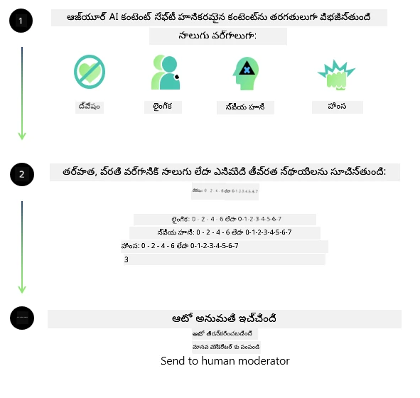
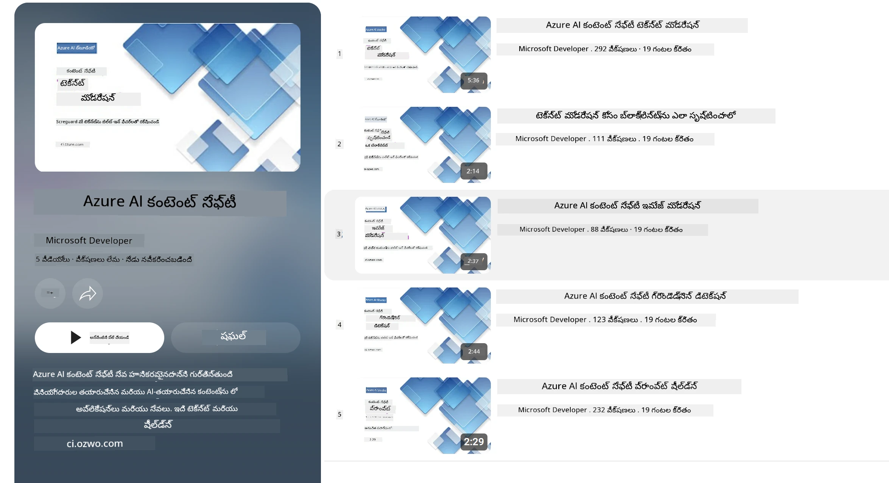

<!--
CO_OP_TRANSLATOR_METADATA:
{
  "original_hash": "839ccc4b3886ef10cfd4e64977f5792d",
  "translation_date": "2026-01-05T14:59:33+00:00",
  "source_file": "md/01.Introduction/01/01.AISafety.md",
  "language_code": "te"
}
-->
# Phi మోడళ్ల కోసం AI భద్రత
Phi కుటుంబ మోడళ్లు [Microsoft Responsible AI Standard](https://www.microsoft.com/ai/principles-and-approach#responsible-ai-standard) ప్రకారం అభివృద్ధి చేయబడ్డాయి, ఇది దిగువ ఆరు సూత్రాలపై ఆధారపడి ఉన్న సంస్థ-విపుల అవసరాల సెట్: బాధ్యత, పారదర్శకత, న్యాయం, నమ్మదగిన మరియు భద్రత, గోప్యత మరియు భద్రత, మరియు సమానత్వం, ఇవి [Microsoft యొక్క బాధ్యతాయుత AI సూత్రాలు](https://www.microsoft.com/ai/responsible-ai)ని రూపొందిస్తాయి.

మొన్నటి Phi మోడళ్లాగా, బహుముఖ భద్రతా మూల్యాంకనం మరియు భద్రతా పోస్ట్-ట్రైనింగ్ దృష్టికోణం తీసుకోబడింది, ఈ విడుదల యొక్క బహుభాషా సామర్థ్యాలను పరిగణలోకి తీసుకునే అదనపు చర్యలతో. భద్రతా శిక్షణ మరియు మూల్యాంకనాలకు సంబంధించిన మా దృష్టీకరణను బహుళ భాషలు మరియు రిస్క్ వర్గాలపై పరీక్షలను సహా [Phi Safety Post-Training Paper](https://arxiv.org/abs/2407.13833)లో వివరించాము. Phi మోడళ్లు ఈ దృష్టికోణం నుంచి లాభపడినప్పటికీ, అభివృద్ధికర్తలు వారి నిర్దిష్ట ఉపయోగ సంఘటన మరియు సాంస్కృతిక, భాషా సందర్భానికి సంబంధించి సంభావ్య ప్రమాదాలు మ్యాపింగ్, మాపింగ్, మరియు తగ్గించడం సహా బాధ్యతాయుత AI ఉత్తమ ప్రథమాలను అన్వయించాలి.

## ఉత్తమ ప్రథమాలు

ఇతర మోడళ్లుగా, Phi కుటుంబ మోడళ్లు కూడా అన్యాయం, నమ్మకానీయత లేకపోవడం, లేదా అవమానకరంగా ప్రవర్తించగలవు.

SLM మరియు LLM యొక్క కొన్ని పరిమిత ప్రవర్తనలు మీరు తెలుసుకోవాల్సినవి:

- **సేవ యొక్క నాణ్యత:** Phi మోడళ్లు ప్రధానంగా ఆంగ్ల టెక్స్‌ట్తో శిక్షణ పొందాయి. ఆంగ్లం కాకుండా ఉన్న భాషలు ఖరీదైన ప్రదర్శనకి గురవుతాయి. శిక్షణ డేటాలో తక్కువ ప్రాతినిధ్యం ఉన్న ఆంగ్ల భాషా వేరియంట్లు సాధారణ అమెరికన్ ఆంగ్లంతో పోలిస్తే తక్కువ ప్రదర్శన చూపవచ్చు.
- **నష్టాల ప్రాతినిధ్యం మరియు సాంప్రదాయాల నిరంతరత:** ఈ మోడళ్లు ప్రజల సమూహాలను అధికంగా లేదా తక్కువగా ప్రాతినిధ్యం చేయవచ్చు, కొన్నీ గుంపుల ప్రాతినిధ్యాన్ని తొలగించవచ్చు, లేదా హీన పరిణామాల లేదా ప్రతికూల సాంప్రదాయాలను బలపరుస్తాయి. భద్రతా పోస్ట్-ట్రైనింగ్ అయినప్పటికీ, ఈ పరిమితులు ఇంకా ఉండవచ్చు, ఎందుకంటే వివిధ గుంపుల ప్రాతినిధ్యం స్థాయిలు లేదా శిక్షణ డేటాలోని ప్రతికూల సాంప్రదాయాల ఉదాహరణలు వాస్తవ ప్రపంచ నమూనాలు మరియు సామాజిక పక్షపాతాలను ప్రతిబింబిస్తాయి.
- **అసహ్యకరమైన లేదా అవమానకర కంటెంట్:** ఈ మోడళ్లు ఇతర రకాల అసహ్యకరమైన లేదా అవమానకర కంటెంట్ ఉత్పత్తి చేయవచ్చు, ఇది ఉపయోగ సంఘటనకు ప్రత్యేకమైన అదనపు నివారణ లేకపోతే సున్నితమైన పరిసరాల్లో ఉపయోగకరంగా లేకపోవచ్చు.
సమాచార నమ్మదగినత: భాషా మోడళ్లు అనర్ధమైన కంటెంట్ను ఉత్పత్తి చేయవచ్చు లేదా వాస్తవానికి సరిపోయే కానీ తప్పు లేదా მოძలిగిన కంటెంట్ తయారుచేయవచ్చు.
- **కోడ్ పరిమిత పరిధి:** Phi-3 శిక్షణ డేటా పెద్ద భాగం Python ఆధారంగా ఉంటుంది మరియు "typing, math, random, collections, datetime, itertools" వంటి సాధారణ ప్యాకేజీలను ఉపయోగిస్తుంది. వేరే ప్యాకేజీలు లేదా ఇతర భాషల స్క్రిప్టులను ఉపయోగించే Python స్క్రిప్ట్స్ మోడల్ ఉత్పత్తి చేస్తే, API వాడుకలను మనవలయుగా తనిఖీ చేయాలి అని మేము recommend చేస్తున్నాము.

అభివృద్ధికర్తలు బాధ్యతాయుత AI ఉత్తమ ప్రథమాలను అనుసరించాలి మరియు నిర్దిష్ట ఉపయోగ సంఘటన సంబంధిత చట్టాలు మరియు నియమాలను (ఉదా: గోప్యత, వాణిజ్యం మొదలైనవి) పాటించడం వారికి బాధ్యత.

## బాధ్యతాయుత AI పరిక్షల

ఇతర భాషా మోడళ్లాగా, Phi సిరీస్ మోడళ్లు ఎటువంటి అన్యాయం, నమ్మకానీయత లేకపోవడం లేదా అవమానకర ప్రవర్తన చూపవచ్చు. తెలుసుకోవలసిన కొన్ని పరిమిత ప్రవర్తనలు:

**సేవ యొక్క నాణ్యత:** Phi మోడళ్లు ప్రధానంగా ఆంగ్ల టెక్స్‌ట్తో శిక్షణ పొందాయి. ఆంగ్లం కాకుండా భాషలు తక్కువ ప్రదర్శన చూపవచ్చు. శిక్షణ డేటాలో తక్కువ ప్రాతినిధ్యం ఉన్న ఆంగ్ల భాషా వేరియంట్లు సాధారణ అమెరికన్ ఆంగ్లంతో పోలిస్తే తక్కువ ప్రదర్శన చూపవచ్చు.

**నష్టాల ప్రాతినిధ్యం మరియు సాంప్రదాయాల నిరంతరత:** ఈ మోడళ్లు ప్రజల సమూహాలను అధికంగా లేదా తక్కువగా ప్రాతినిధ్యం చేయవచ్చు, కొన్నీ గుంపుల ప్రాతినిధ్యాన్ని తొలగించవచ్చు, లేదా హీన పరిణామాల లేదా ప్రతికూల సాంప్రదాయాలను బలపరుస్తాయి. భద్రతా పోస్ట్-ట్రైనింగ్ అయినప్పటికీ, ఈ పరిమితులు ఇంకా ఉండవచ్చు, ఎందుకంటే వివిధ గుంపుల ప్రాతినిధ్యం స్థాయిలు లేదా శిక్షణ డేటాలోని ప్రతికూల సాంప్రదాయాల ఉదాహరణలు వాస్తవ ప్రపంచ నమూనాలు మరియు సామాజిక పక్షపాతాలను ప్రతిబింబిస్తాయి.

**అసహ్యకరమైన లేదా అవమానకర కంటెంట్:** ఈ మోడళ్లు ఇతర రకాల అసహ్యకరమైన లేదా అవమానకర కంటెంట్ ఉత్పత్తి చేయవచ్చు, ఇది ఉపయోగ సంఘటనకు ప్రత్యేకమైన అదనపు నివారణ లేకపోతే సున్నితమైన పరిసరాల్లో ఉపయోగకరంగా లేకపోవచ్చు.
సమాచార నమ్మదగినత: భాషా మోడళ్లు అనర్ధమైన కంటెంట్ను ఉత్పత్తి చేయవచ్చు లేదా వాస్తవానికి సరిపోయే కానీ తప్పు లేదా მოძలిగిన కంటెంట్ తయారుచేయవచ్చు.

**కోడ్ పరిమిత పరిధి:** Phi-3 శిక్షణ డేటా పెద్ద భాగం Python ఆధారంగా ఉంటుంది మరియు "typing, math, random, collections, datetime, itertools" వంటి సాధారణ ప్యాకేజీలను ఉపయోగిస్తుంది. వేరే ప్యాకేజీలు లేదా ఇతర భాషల స్క్రిప్టులను ఉపయోగించే Python స్క్రిప్ట్స్ మోడల్ ఉత్పత్తి చేస్తే, API వాడుకలను మనవలయుగా తనిఖీ చేయాలి అని మేము recommend చేస్తున్నాము.

అభివృద్ధికర్తలు బాధ్యతాయుత AI ఉత్తమ ప్రథమాలను అనుసరించాలి మరియు నిర్దిష్ట ఉపయోగ ఘటన సంబంధిత చట్టాలు మరియు నియమాలను (ఉదా: గోప్యత, వాణిజ్యం మొదలైనవి) పాటించటం వారి బాధ్యత. ముఖ్యంగా ಪರಿಗಣించవలసిన అంశాలు:

**ఆవేటకం:** మోడళ్లు చట్టబద్ధమైన స్థితి లేదా వనరుల కేటాయింపు లేదా జీవన అవకాశాలపై ప్రభావం కలిగించే సందర్భాలకు (ఉదా: ఇల్లు, ఉద్యోగం, క్రెడిట్ మొదలైనవి) అనుకూలంగా ఉండకపోవచ్చు, అదనపు మూల్యాంకనాలు మరియు పక్షపాతతలను తగ్గించే సాంకేతికతలు అవసరం.

**హైవ్-రిస్క్ పరిస్థితేలు:** అభివృద్ధికర్తలు మోడళ్లు అన్యాయం, నమ్మకాని, లేదా అవమానకర ఫలితాలతో తీవ్రమైన ఖర్చులు లేదా హానిని కలిగించగల సంభావ్య హైవ్-రిస్క్ పరిస్థితేలు కోసం అనుకూలతని అంచనా వేసుకోవాలి. ఇందులో నిపుణుల సలహాలు ఇస్తున్న సున్నిత లేదా నిపుణుల రంగాలు ఉంటాయి, అక్కడ ఖచ్చితత్వం మరియు నమ్మకీయత చాలా ముఖ్యం (ఉదా: చట్ట లేదా ఆరోగ్య సలహా). వినియోగ సందర్భాన్ని అనుసరించి అప్లికేషన్ స్థాయిలో అదనపు భద్రతా చర్యలు అమలు చేయాలి.

**ప్రమాద సమాచారం:** మోడళ్లు తప్పు సమాచారం ఉత్పత్తి చేసేవి కావచ్చు. అభివృద్ధికర్తలు పారదర్శకత ఉత్తమ పద్ధతులు పాటించి అందరి దృష్టికి AI వ్యవస్థతో మాట్లాడుతున్నట్లు తెలియచేయాలి. అప్లికేషన్ స్థాయిలో అభివృద్ధికర్తలు ఫీడ్బ్యాక్ మెకానిజాలను మరియు పాయ్ప్లైన్లను నిర్మించి వినియోగ సందర్భానికి సార్వత్రిక సమాచారంతో జవాబులను బేస్ చేయవచ్చు, దీనికే Retrieval Augmented Generation (RAG) అంటారు.

**హానికర కంటెంట్ ఉత్పత్తి:** అభివృద్ధికర్తలు వారి పరిసరాలను పరిగణలోకి తీసుకొని ఫలితాలను మూల్యాంకనం చేయాలి మరియు తప్పనిసరిగా భద్రతా క్లాసిఫైయర్లు లేదా వారి ఉపయోగానికి తగిన ప్రత్యేక పరిష్కారాలను ఉపయోగించాలి.

**తప్పుడు ఉపయోగం:** మోసం, స్పామ్, లేదా మాల్వేర్ ఉత్పత్తి వంటి ఇతర దుర్వినియోగ రూపాలు ఉండవచ్చు, అభివృద్ధికర్తలు వారి అప్లికేషన్లు సంబంధించిన చట్టాలు మరియు నియమాలను ఉల్లంఘించవద్దని నిర్ధారించాలి.

### ఫైన్‌ట్యూనింగ్ మరియు AI కంటెంట్ భద్రత

ఫైన్‌ట్యూన్ చేసిన తర్వాత, మోడళ్ల చుట్టూ పుట్టే కంటెంట్‌ని పర్యవేక్షించడానికి, సంభావ్య ప్రమాదాలు, ముప్పులు, మరియు నాణ్యత సమస్యలను గుర్తించి అడ్డుకోవడానికి [Azure AI Content Safety](https://learn.microsoft.com/azure/ai-services/content-safety/overview) చర్యలను ఉపయోగించమని మేము బలంగా సిఫార్సు చేస్తున్నాము.

[Azure AI Content Safety](https://learn.microsoft.com/azure/ai-services/content-safety/overview) టెక్స్ట్ మరియు చిత్ర కంటెంట్ రెండింటినీ మద్దతు ఇస్తుంది. దాన్ని క్లౌడ్, డిస్కనెక్టెడ్ కంటెయినర్లు, మరియు ఎడ్జ్/ఎంబెడెడ్ పరికరాలపై అమలు చేయవచ్చు.

## Azure AI Content Safety అవలోకనం

Azure AI Content Safety ఒక్కసారి సరిపోయే పరిష్కారం కాదు; దాన్ని వ్యాపార ప్రత్యేక విధానాలతో సర్దుబాటు చేయవచ్చు. అదనంగా, దాని బహుభాషా మోడళ్లు ఒకేసారి అనేక భాషలను అర్థం చేసుకోవడానికి సహాయపడతాయి.

- **Azure AI Content Safety**
- **Microsoft Developer**
- **5 వీడియోలు**

Azure AI Content Safety సేవ అప్లికేషన్లు మరియు సేవలలో హానికరమైన వినియోగదారు-సృష్టించిన మరియు AI-సృష్టించిన కంటెంట్‌ను గుర్తిస్తుంది. ఇది టెక్స్ట్ మరియు చిత్ర APIలను కలిగి ఉండి, హానికరమైన లేదా అసహ్యకరమైన పదార్థాలను గుర్తించగలదు.

[AI Content Safety Playlist](https://www.youtube.com/playlist?list=PLlrxD0HtieHjaQ9bJjyp1T7FeCbmVcPkQ)

---

<!-- CO-OP TRANSLATOR DISCLAIMER START -->
**అస్పష్టత**:  
ఈ పత్రికను AI అనువాద సేవ [Co-op Translator](https://github.com/Azure/co-op-translator) ఉపయోగించి అనువదించబడింది. ఖచ్చితత్వాన్ని కోరినప్పటికీ, ఆటోమేటిక్ అనువాదాల్లో పొరపాట్లు లేదా అపసరాలు ఉండవచ్చు. మూల పత్రిక దాని స్థానిక భాషలో ఆధారవంతమైన మూలాన్ని భావించాలి. ముఖ్యమైన సమాచారానికి, ప్రొఫెషనల్ మానవ అనువాద సేవలను సూచించబడింది. ఈ అనువాదాన్ని ఉపయోగించడం వలన జరిగే ఏదైనా తప్పుబడులు లేదా అపార్థాలకాకు మేము బాధ్యత వహించము.
<!-- CO-OP TRANSLATOR DISCLAIMER END -->