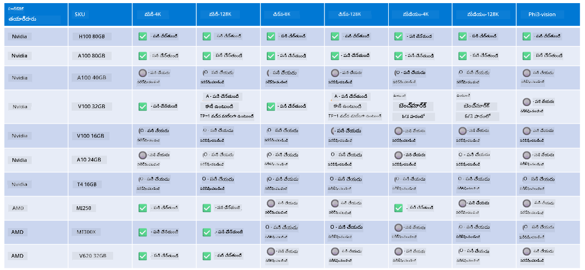

<!--
CO_OP_TRANSLATOR_METADATA:
{
  "original_hash": "8cdc17ce0f10535da30b53d23fe1a795",
  "translation_date": "2025-12-21T23:12:19+00:00",
  "source_file": "md/01.Introduction/01/01.Hardwaresupport.md",
  "language_code": "te"
}
-->
# Phi హార్డ్‌వేర్ మద్దతు

Microsoft Phi ONNX Runtime కోసం ఆప్టిమైజ్ చేయబడింది మరియు Windows DirectML ను మద్దతు చేస్తుంది. ఇది GPUs, CPUs మరియు మొబైల్ పరికరాలు సహా వివిధ హార్డ్‌వేర్ రకాలపై బాగా పనిచేస్తుంది. 

## డివైస్ హార్డ్‌వేర్ 
స్పష్టంగా, మద్దతు ఉన్న హార్డ్‌వేర్‌లో క్రింది అంశాలు ఉన్నాయి:

- GPU SKU: RTX 4090 (DirectML)
- GPU SKU: 1 A100 80GB (CUDA)
- CPU SKU: Standard F64s v2 (64 vCPUs, 128 GiB memory)

## మొబైల్ SKU

- Android - Samsung Galaxy S21
- Apple iPhone 14 లేదా పై A16/A17 ప్రాసెసర్

## Phi హార్డ్‌వేర్ వివరాలు

- కనీస కాన్ఫిగరేషన్ అవసరం.
- Windows: DirectX 12-సమర్ధ GPU మరియు కనీసం 4GB మొత్తం RAM

CUDA: Compute Capability >= 7.02 కలిగిన NVIDIA GPU



## బహుళ GPUs పై onnxruntime నడపడం

ప్రస్తుతం అందుబాటులో ఉన్న Phi ONNX మోడళ్లు కేవలం 1 GPU కోసం మాత్రమే ఉన్నాయి. Phi మోడల్ కోసం multi-gpu ని మద్దతు ఇవ్వడం సాధ్యమే, కానీ 2 gpuతో ఉన్న ORT అది 2 instance of ort తో పోలిస్తే ఎక్కువ throughput ఇస్తుందని హామీ ఇవ్వదు. తాజా అప్‌డేట్స్ కోసం దయచేసి [ONNX Runtime](https://onnxruntime.ai/) ను చూడండి.

Build 2024లో [GenAI ONNX టీమ్](https://youtu.be/WLW4SE8M9i8?si=EtG04UwDvcjunyfC) ప్రకటించింది వారు Phi మోడళ్ల కోసం multi-gpu బదులు multi-instance ను ఎనేబుల్ చేయారనని. 

ప్రస్తుతం ఇది మీకు ఒక onnnxruntime లేదా onnxruntime-genai ఇన్స్టాన్స్‌ను CUDA_VISIBLE_DEVICES environment variable తో ఈ విధంగా నడపడానికి అనుమతిస్తుంది.

```Python
CUDA_VISIBLE_DEVICES=0 python infer.py
CUDA_VISIBLE_DEVICES=1 python infer.py
```

స్వేచ్ఛగా Phi ని మరింతగా అన్వేషించడానికి [Azure AI Foundry](https://ai.azure.com) ను చూడండి

---

<!-- CO-OP TRANSLATOR DISCLAIMER START -->
నిరాకరణ:
ఈ పత్రాన్ని AI అనువాద సేవ [Co-op Translator](https://github.com/Azure/co-op-translator) ఉపయోగించి అనువదించబడింది. మేము ఖచ్చితత్వానికి ప్రయత్నించినప్పట్లోనూ, ఆటోమేటెడ్ అనువాదాల్లో పొరపాట్లు లేదా అసత్యతలు ఉండవచ్చునని దయచేసి గమనించండి. మూల పత్రాన్ని దాని మాతృభాషలో ఉన్న రూపాన్ని అధికారిక మూలంగా పరిగణించాలి. కీలకమైన సమాచారానికి వృత్తిపరులైన మానవ అనువాదాన్ని సూచిస్తాము. ఈ అనువాదం వాడకంతో ఏర్పడిన ఏవైనా అపార్థాలు లేదా తప్పుతెలివికలకు మేము బాధ్యత వహించము.
<!-- CO-OP TRANSLATOR DISCLAIMER END -->