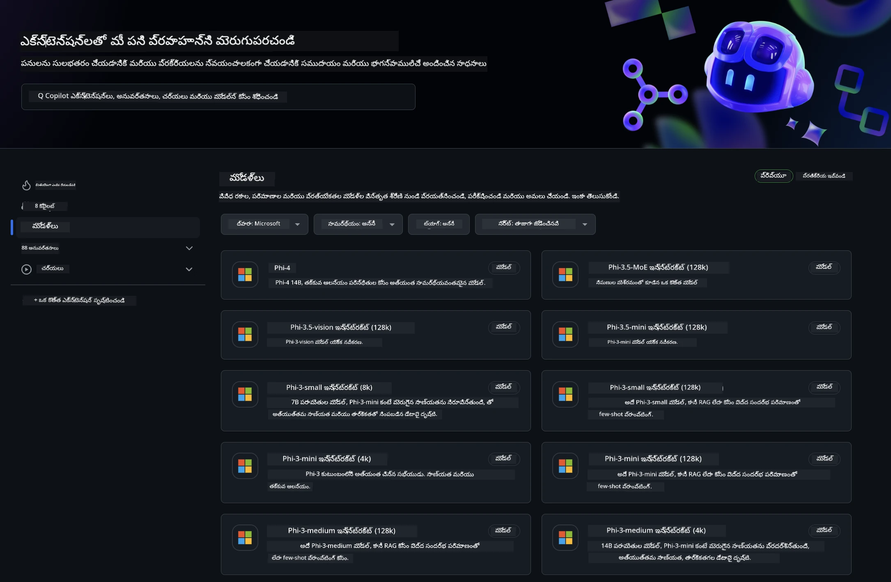
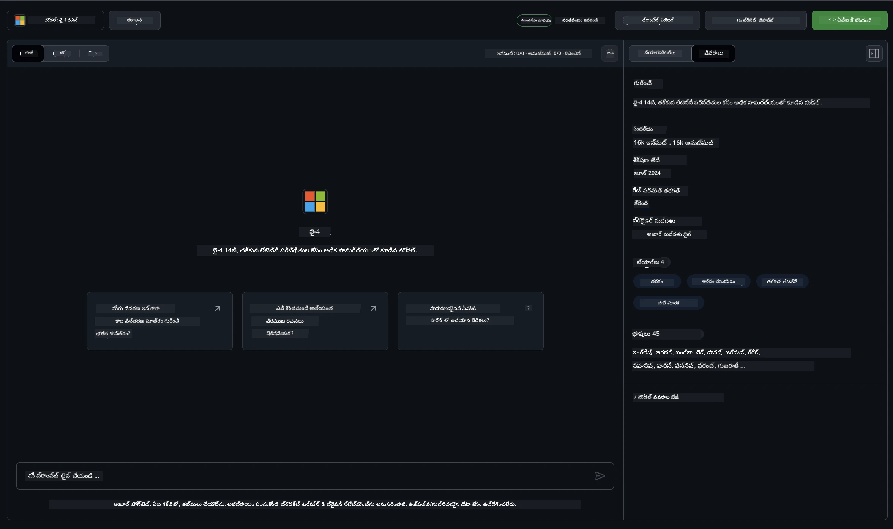
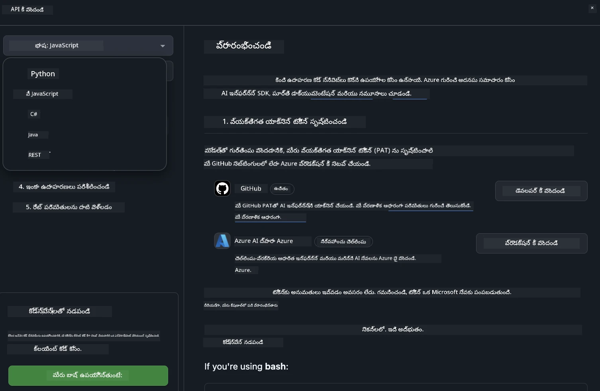
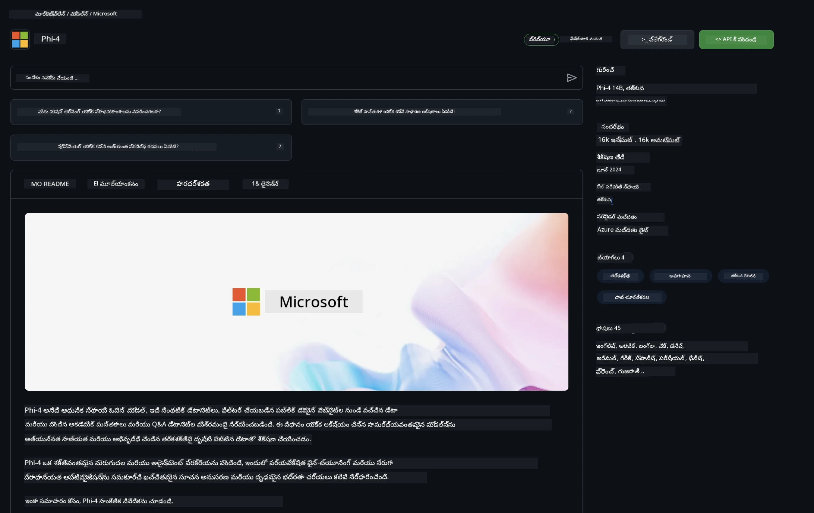

## GitHub Modelsలో Phi కుటుంబం

మీరు [GitHub Models](https://github.com/marketplace/models) కి స్వాగతం ! మేము Azure AIలో హోస్ట్ చేసిన AI మోడల్స్‌ను మీరు అన్వేషించడానికి అన్ని సిద్ధంగా ఉంచాము.



GitHub Modelsలో అందుబాటులో ఉన్న మోడల్స్ గురించి మరిన్ని వివరాలకు, [GitHub Model Marketplace](https://github.com/marketplace/models) చూడండి

## అందుబాటులో ఉన్న మోడల్స్

ప్రతి మోడల్‌కు ఒక కేటాయించిన ప్లేగ్రౌండ్ మరియు నమూనా కోడ్ ఉంది 



### GitHub Model క్యాటలాగ్‌లో Phi కుటుంబం

- [Phi-4](https://github.com/marketplace/models/azureml/Phi-4)

- [Phi-3.5-MoE instruct (128k)](https://github.com/marketplace/models/azureml/Phi-3-5-MoE-instruct)

- [Phi-3.5-vision instruct (128k)](https://github.com/marketplace/models/azureml/Phi-3-5-vision-instruct)

- [Phi-3.5-mini instruct (128k)](https://github.com/marketplace/models/azureml/Phi-3-5-mini-instruct)

- [Phi-3-Medium-128k-Instruct](https://github.com/marketplace/models/azureml/Phi-3-medium-128k-instruct)

- [Phi-3-medium-4k-instruct](https://github.com/marketplace/models/azureml/Phi-3-medium-4k-instruct)

- [Phi-3-mini-128k-instruct](https://github.com/marketplace/models/azureml/Phi-3-mini-128k-instruct)

- [Phi-3-mini-4k-instruct](https://github.com/marketplace/models/azureml/Phi-3-mini-4k-instruct)

- [Phi-3-small-128k-instruct](https://github.com/marketplace/models/azureml/Phi-3-small-128k-instruct)

- [Phi-3-small-8k-instruct](https://github.com/marketplace/models/azureml/Phi-3-small-8k-instruct)

## ప్రారంభించండి

మీరు వెంటనే నడపడానికి కొన్ని బేసిక్ ఉదాహరణలు సిద్ధంగా ఉన్నాయి. అవన్నీ samples డైరెక్టరీలో లభిస్తాయి. మీ ప్రియమైన భాషకు నేరుగా వెళ్లాలనుకుంటే, ఉదాహరణలను క్రింది Languages లో కనుగొనవచ్చు:

- Python
- JavaScript
- C#
- Java
- cURL

నమూనాలు మరియు మోడల్స్‌ను నడపడానికి ఒక ప్రత్యేక Codespaces పర్యావరణం కూడా ఉంది। 




## నమూనా కోడ్ 

కింద కొన్ని వినియోగాల కోసం ఉదాహరణ కోడ్ స్నిపెట్లు ఉన్నాయి. Azure AI Inference SDK గురించి అదనపు సమాచారం కోసం పూర్తి డాక్యుమెంటేషన్ మరియు నమూనాలను చూడండి.

## సెటప్ 

1. వ్యక్తిగత యాక్సెస్ టోకెన్ సృష్టించండి
మీరు టోకెన్‌కు ఏ అనుమతులు ఇచ్చాల్సిన అవసరం లేదు. టోకెన్ Microsoft సేవకు పంపబడుతుందని గమనించండి.

కింద ఇచ్చిన కోడ్ స్నిపెట్లను ఉపయోగించడానికి, మీ టోకెన్‌ను క్లయింట్ కోడ్ కోసం కీగా సెట్చేయడానికి ఒక పర్యావరణ వేరియబుల్ సృష్టించండి.

If you're using bash:
```
export GITHUB_TOKEN="<your-github-token-goes-here>"
```
మీరు powershellలో ఉన్నట్లయితే:

```
$Env:GITHUB_TOKEN="<your-github-token-goes-here>"
```

మీరు Windows command prompt ఉపయోగిస్తుంటే:

```
set GITHUB_TOKEN=<your-github-token-goes-here>
```

## Python ఉదాహరణ

### డిపెండెన్సీలు ఇన్‌స్టాల్ చేయండి
pip ద్వారా Azure AI Inference SDK ఇన్‌స్టాల్ చేయండి (అవసరం: Python >=3.8):

```
pip install azure-ai-inference
```
### ఒక ప్రాథమిక కోడ్ నమూనా నడపండి

ఈ ఉదాహరణ చాట్ కంప్లీషన్ APIకి ఒక ప్రాథమిక కాల్‌ను చూపిస్తుంది. ఇది GitHub AI మోడల్ ఇన్ఫెరెన్స్ ఎండ్‌పాయింట్ మరియు మీ GitHub టోకెన్‌ను ఉపయోగిస్తుంది. ఈ కాల్ సింక్రోనస్ గా జరుగుతుంది.

```python
import os
from azure.ai.inference import ChatCompletionsClient
from azure.ai.inference.models import SystemMessage, UserMessage
from azure.core.credentials import AzureKeyCredential

endpoint = "https://models.inference.ai.azure.com"
model_name = "Phi-4"
token = os.environ["GITHUB_TOKEN"]

client = ChatCompletionsClient(
    endpoint=endpoint,
    credential=AzureKeyCredential(token),
)

response = client.complete(
    messages=[
        UserMessage(content="I have $20,000 in my savings account, where I receive a 4% profit per year and payments twice a year. Can you please tell me how long it will take for me to become a millionaire? Also, can you please explain the math step by step as if you were explaining it to an uneducated person?"),
    ],
    temperature=0.4,
    top_p=1.0,
    max_tokens=2048,
    model=model_name
)

print(response.choices[0].message.content)
```

### మల్టీ-టర్న్ సంభాషణ నడపండి

ఈ ఉదాహరణ చాట్ కంప్లీషన్ APIతో ఒక బహుళ-టర్న్ సంభాషణను చూపిస్తుంది. చాట్ యాప్లికేషన్ కోసం మోడల్‌ను ఉపయోగించినప్పుడు, మీరు ఆ సంభాషణ యొక్క చరిత్రను నిర్వహించాలి మరియు తాజా సందేశాలను మోడల్‌కు పంపించాలి.

```
import os
from azure.ai.inference import ChatCompletionsClient
from azure.ai.inference.models import AssistantMessage, SystemMessage, UserMessage
from azure.core.credentials import AzureKeyCredential

token = os.environ["GITHUB_TOKEN"]
endpoint = "https://models.inference.ai.azure.com"
# Replace Model_Name
model_name = "Phi-4"

client = ChatCompletionsClient(
    endpoint=endpoint,
    credential=AzureKeyCredential(token),
)

messages = [
    SystemMessage(content="You are a helpful assistant."),
    UserMessage(content="What is the capital of France?"),
    AssistantMessage(content="The capital of France is Paris."),
    UserMessage(content="What about Spain?"),
]

response = client.complete(messages=messages, model=model_name)

print(response.choices[0].message.content)
```

### అవుట్‌పుట్‌ను స్ట్రీమ్ చేయండి

ఉత్తమ యూజర్ అనుభవం కోసం, మొదటి టోకెన్ త్వరగా కనపడాలంటే మరియు దీర్ఘ ప్రతిస్పందనలు కోసం వేచిచూడకుండా ఉండేందుకు మీరు మోడల్ ప్రతిస్పందనను స్ట్రీమ్ చేయాలనుకుంటారు.

```
import os
from azure.ai.inference import ChatCompletionsClient
from azure.ai.inference.models import SystemMessage, UserMessage
from azure.core.credentials import AzureKeyCredential

token = os.environ["GITHUB_TOKEN"]
endpoint = "https://models.inference.ai.azure.com"
# Replace Model_Name
model_name = "Phi-4"

client = ChatCompletionsClient(
    endpoint=endpoint,
    credential=AzureKeyCredential(token),
)

response = client.complete(
    stream=True,
    messages=[
        SystemMessage(content="You are a helpful assistant."),
        UserMessage(content="Give me 5 good reasons why I should exercise every day."),
    ],
    model=model_name,
)

for update in response:
    if update.choices:
        print(update.choices[0].delta.content or "", end="")

client.close()
```

## GitHub Models కోసం ఉచిత ఉపయోగం మరియు రేట్ పరిమితులు



[playground మరియు ఉచిత API ఉపయోగానికి రేట్ పరిమితులు](https://docs.github.com/en/github-models/prototyping-with-ai-models#rate-limits) మోడల్స్‌తో ప్రయోగాలు చేయడానికి మరియు మీ AI అప్లికేషన్‌ను ప్రోటోటైప్ చేయడానికి మీకు సహాయపడేలా ఉద్దేశించబడ్డాయి. ఆ పరిమితులను మించిపోయే వినియోగానికి, మరియు మీ అప్లికేషన్‌ను స్కేల్ చేయడానికి, మీరు Azure ఖాతా నుంచి వనరులు provision చేసి, అక్కడి నుండి authenticate చేయాలి మీ GitHub వ్యక్తిగత యాక్సెస్ టోకెన్ బదులు. మీ కోడ్‌లో ఇంకేంటి మార్చాల్సిన ఏవైనా అవసరం లేదు. Azure AIలో ఉచిత టియర్ పరిమితులను మించిపోడానికి ఎలా చేయాలో తెలుసుకోవడానికి ఈ లింక్‌ను ఉపయోగించండి.


### వెల్లడనలు

మోడల్‌తో పరస్పర చర్య చేస్తున్నప్పుడు మీరు AIతో ప్రయోగాలు చేస్తున్నారని గుర్తుంచుకోండి, కాబట్టి కంటెంట్ లోపాలు సంభవించవచ్చు.

ఈ ఫీచర్ వివిధ పరిమితులకు ఆదీనంగా ఉంటుంది (ప్రతి నిమిషానికి అభ్యర్థనలు, ప్రతిరోజూ అభ్యర్థనలు, ఒక్కో అభ్యర్థనకు టోకెన్లు, మరియు సమకాలీన అభ్యర్థనలు సహా) మరియు ఇది ఉత్పత్తి వినియోగాలకు రూపొందించబడలేదు.

GitHub Models Azure AI Content Safety ను ఉపయోగిస్తుంది. GitHub Models అనుభవంలో భాగంగా వీటిని ఆఫ్ చేయలేరు. మీరు పరিশ్రమ ఇచ్చిన సేవ ద్వారా మోడల్స్‌ను ఉపయోగించాలని నిర్ణయించుకుంటే, దయచేసి మీ అవసరాలను తీరుస్తున్నట్లు మీ కంటెంట్ ఫిల్టర్లు కాన్ఫిగర్ చేయండి.

ఈ సేవ GitHub యొక్క ప్రీ-రీలీజ్ నిబంధనల పరిధిలోకి వస్తుంది.

---

<!-- CO-OP TRANSLATOR DISCLAIMER START -->
**నిరాకరణ**:
ఈ డాక్యుమెంట్‌ను AI అనువాద సేవ [Co-op Translator](https://github.com/Azure/co-op-translator) ఉపయోగించి అనువదించబడింది. మేము ఖచ్చితత్వానికి ప్రయత్నించినప్పటికీ, స్వయంచాలక అనువాదాలలో తప్పులు లేదా లోపాలు ఉండొచ్చు అని దయచేసి గమనించండి. అసలైన భాషలోని మూల డాక్యుమెంట్‌నే అధికారిక మూలంగా పరిగణించాలి. కీలక సమాచారం కోసం వృత్తిపరమైన మానవ అనువాదాన్ని సూచించబడుతుంది. ఈ అనువాదాన్ని ఉపయోగించడం వల్ల సంభవించే ఏవైనా అపార్థాలు లేదా అవగాహనా లోపాల కోసం మేము బాధ్యత వహించము.
<!-- CO-OP TRANSLATOR DISCLAIMER END -->