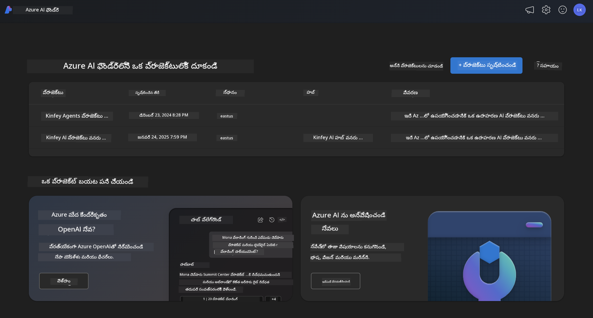
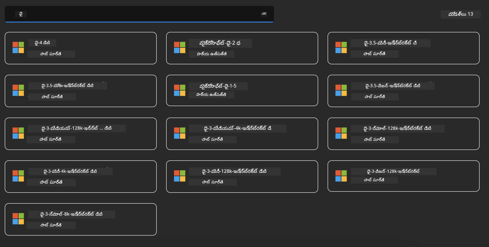
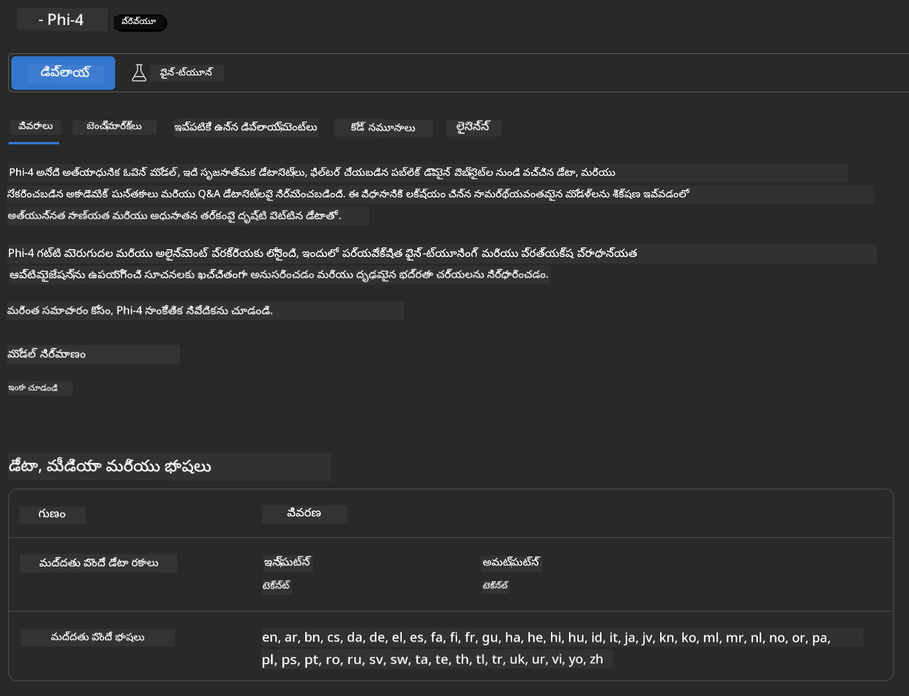

<!--
CO_OP_TRANSLATOR_METADATA:
{
  "original_hash": "3ae21dc5554e888defbe57946ee995ee",
  "translation_date": "2025-12-22T00:00:02+00:00",
  "source_file": "md/01.Introduction/02/03.AzureAIFoundry.md",
  "language_code": "te"
}
-->
## Azure AI Foundry లో Phi కుటుంబం

[Azure AI Foundry](https://ai.azure.com) అనేది అభివృద్ధిదారులకు AI తో సురక్షితంగా, భద్రతాత్మకంగా మరియు బాధ్యతాయుతంగా ఆవిష్కరణను నడిపి భవిష్యత్తును తీర్చిదిద్దడానికి శక్తివంతం చేసే ఒక విశ్వసనీయ వేదిక.

[Azure AI Foundry](https://ai.azure.com) అభివృద్ధిదారుల కోసం రూపొందించబడింది:

- ఎంటర్‌ప్రైజ్-గ్రేడ్ ప్లాట్‌ఫారమ్‌పై జనరేటివ్ AI అప్లికేషన్లు నిర్మించండి.
- ఆధునిక AI సాధనాలు మరియు ML మోడల్స్‌ను ఉపయోగించి అన్వేషించండి, నిర్మించండి, పరీక్షించండి, మరియు డిప్లాయ్ చేయండి — ఇవన్నీ బాధ్యతాయుత AI ఆచారాలతో స్థిరంగా ఉండాలి.
- అప్లికేషన్ అభివృద్ధి యొక్క పూర్తి జీవిత చక్రానికి ఒక బృందంతో కలిసి పనిచేయండి.

Azure AI Foundry తో, మీరు విస్తృత రకం మోడల్స్, సేవలు మరియు సామర్థ్యాలను అన్వేషించి, మీ లక్ష్యాలకు అత్యుత్తమంగా సేవ చేసే AI అప్లికేషన్లను నిర్మించవచ్చు. Azure AI Foundry ప్లాట్‌ఫారమ్ ప్రతిపాదనలను పూర్తి స్థాయిలో ప్రొడక్షన్ అప్లికేషన్లుగా మార్చేందుకు స్కేలబిలిటీని సులభతరం చేస్తుంది. నిరంతర మానిటరింగ్ మరియు మెరుగుదల దీర్ఘకాల విజయాన్ని మద్దతు చేస్తాయి.



Azure AI Foundryలో Azure AOAI Serviceను ఉపయోగించటం علاوه از، మీరు Azure AI Foundry Model Catalogలో ఉన్న తృతీయ-పార్టీ మోడల్స్‌ను కూడా ఉపయోగించవచ్చు. మీరు Azure AI Foundryని మీ AI పరిష్కార వేదికగా ఉపయోగించాలనుకుంటే ఇది మంచి ఎంపిక.

మేము Azure AI Foundryలోని Model Catalog ద్వారా Phi కుటుంబ మోడల్స్‌ను త్వరగా డిప్లాయ్ చేయగలం

[Azure AI Foundry Models లో Microsoft Phi మోడల్స్](https://ai.azure.com/explore/models/?selectedCollection=phi)



### **Azure AI Foundryలో Phi-4 ను డిప్లాయ్ చేయండి**




### **Azure AI Foundry Playgroundలో Phi-4 ను పరీక్షించండి**


### **Azure AI Foundry Phi-4 ను పిలవడానికి Python కోడ్ నడపడం**


```python

import os  
import base64
from openai import AzureOpenAI  
from azure.identity import DefaultAzureCredential, get_bearer_token_provider  
        
endpoint = os.getenv("ENDPOINT_URL", "Your Azure AOAI Service Endpoint")  
deployment = os.getenv("DEPLOYMENT_NAME", "Phi-4")  
      
token_provider = get_bearer_token_provider(  
    DefaultAzureCredential(),  
    "https://cognitiveservices.azure.com/.default"  
)  
  
client = AzureOpenAI(  
    azure_endpoint=endpoint,  
    azure_ad_token_provider=token_provider,  
    api_version="2024-05-01-preview",  
)  
  

chat_prompt = [
    {
        "role": "system",
        "content": "You are an AI assistant that helps people find information."
    },
    {
        "role": "user",
        "content": "can you introduce yourself"
    }
] 
    
# స్పీచ్ సక్రియమైతే స్పీచ్ ఫలితాన్ని చేర్చండి
messages = chat_prompt 

completion = client.chat.completions.create(  
    model=deployment,  
    messages=messages,
    max_tokens=800,  
    temperature=0.7,  
    top_p=0.95,  
    frequency_penalty=0,  
    presence_penalty=0,
    stop=None,  
    stream=False  
)  
  
print(completion.to_json())  

```

---

<!-- CO-OP TRANSLATOR DISCLAIMER START -->
నిరాకరణ:
ఈ డాక్యుమెంట్‌ను AI అనువాద సేవ Co-op Translator (https://github.com/Azure/co-op-translator) ఉపయోగించి అనువదించబడింది. మేము ఖచ్చితత్వాన్ని ఆశిస్తామ కానీ, ఆటోమేటెడ్ అనువాదాల్లో పొరపాట్లు లేదా అసత్యతలు ఉండవచ్చు అని దయచేసి గమనించండి. అసలైన పత్రాన్ని దాని స్థానిక భాషలో ఉన్న వెర్షన్‌ను అధికారిక మూలంగా పరిగణించాలి. కీలకమైన సమాచారం కోసం వృత్తిపరమైన మానవ అనువాదాన్ని సూచిస్తాం. ఈ అనువాదం వాడుక వల్ల ఏర్పడిన ఏవైనా అపార్థాలు లేదా తప్పుగా అర్థం చేసుకోవడాల కోసం మేము బాధ్యులు కాదు.
<!-- CO-OP TRANSLATOR DISCLAIMER END -->