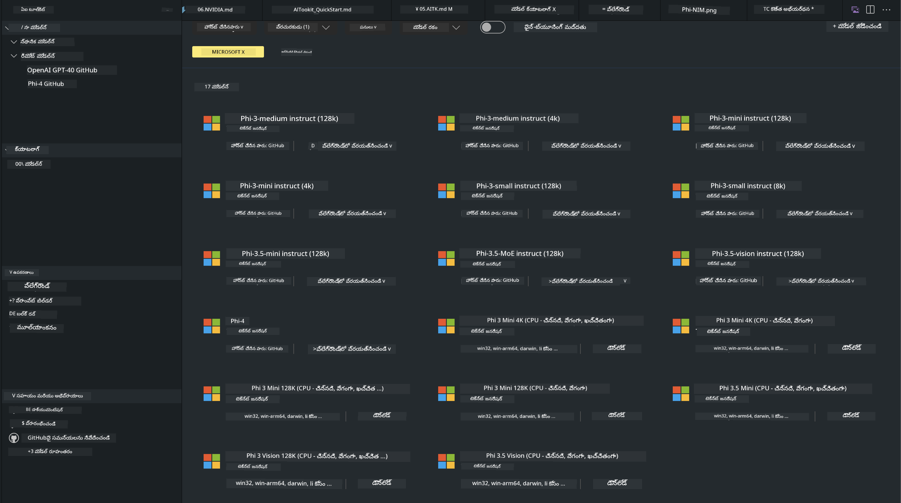

<!--
CO_OP_TRANSLATOR_METADATA:
{
  "original_hash": "4951d458c0b60c02cd1e751b40903877",
  "translation_date": "2025-12-21T23:46:11+00:00",
  "source_file": "md/01.Introduction/02/05.AITK.md",
  "language_code": "te"
}
-->
# AITK‌లో Phi కుటుంబం

[VS Code కోసం AI Toolkit](https://marketplace.visualstudio.com/items?itemName=ms-windows-ai-studio.windows-ai-studio) Azure AI Foundry Catalog వంటి ఆధునిక AI అభివృద్ధి టూల్స్ మరియు Hugging Face వంటి ఇతర క్యాటలాగ్‌ల నుండి మోడల్స్‌ను కలిపి జనరేటివ్ AI యాప్ అభివృద్ధిని సరళీకృతం చేస్తుంది. మీరు GitHub Models మరియు Azure AI Foundry Model Catalogs ద్వారా శక్తివంతంగా నడుపబడే AI మోడల్స్ క్యాటలాగ్‌ను బ్రౌజ్ చేసి, వాటిని లోకల్ లేదా రిమోట్‌గా డౌన్‌లోడ్ చేయగలరని, ఫైన్-ట్యూన్ చేయగలరని, పరీక్షించాగలరని మరియు మీ అప్లికేషన్‌లో ఉపయోగించగలరని వీలవుతుంది.

AI Toolkit Preview స్థానికంగా నడుస్తుంది. స్థానిక ఇన్ఫరెన్స్ లేదా ఫైన్-ట్యూన్ ఎంచుకున్న మోడల్‌పై ఆధారపడి ఉంటుంది, మీరు NVIDIA CUDA GPU వంటి GPU అవసరం పెట్టుకోవాల్సి ఉంటుంది. మీరు GitHub Models‌ను కూడా AITK ద్వారా నేరుగా నడపవచ్చు.

## Getting Started

[Windows subsystem for Linux ను ఎలా ఇన్‌స్టాల్ చేయాలో మరింత తెలుసుకోండి](https://learn.microsoft.com/windows/wsl/install?WT.mc_id=aiml-137032-kinfeylo)

మరియు [డిఫాల్ట్ distribution మార్చడం గురించి](https://learn.microsoft.com/windows/wsl/install#change-the-default-linux-distribution-installed).

[AI Tooklit GitHub రిపోజిటరీ](https://github.com/microsoft/vscode-ai-toolkit/)

- Windows,Linux,macOS
  
- Windows మరియు Linux రెండింటిలో ఫైన్‌ట్యూనింగ్ కోసం, మీకు Nvidia GPU అవసరం. ఇలాగే, **Windows**కి Ubuntu distro 18.4 లేదా అంతకంటే పెద్దదైన subsystem for Linux అవసరం. [Windows subsystem for Linux ను ఎలా ఇన్‌స్టాల్ చేయాలో మరింత తెలుసుకోండి](https://learn.microsoft.com/windows/wsl/install) మరియు [డిఫాల్ట్ distribution మార్చడం గురించి](https://learn.microsoft.com/windows/wsl/install#change-the-default-linux-distribution-installed).

### Install AI Toolkit

AI Toolkit [Visual Studio Code Extension](https://code.visualstudio.com/docs/setup/additional-components#_vs-code-extensions) గా బహిర్గతమవుతుంది, కాబట్టి ముందుగా [VS Code](https://code.visualstudio.com/docs/setup/windows?WT.mc_id=aiml-137032-kinfeylo) ను ఇన్‌స్టాల్ చేయాలి, మరియు AI Toolkitను [VS Marketplace](https://marketplace.visualstudio.com/items?itemName=ms-windows-ai-studio.windows-ai-studio) నుండి డౌన్లోడ్ చేయండి.
[AI Toolkit Visual Studio Marketplaceలో అందుబాటులో ఉంది](https://marketplace.visualstudio.com/items?itemName=ms-windows-ai-studio.windows-ai-studio) మరియు దీనిని ఇతర VS Code ఎక్స్‌టెన్షన్‌ల తరహాలో ఇన్‌స్టాల్ చేయవచ్చు। 

మీకు VS Code ఎక్స్‌టెన్షన్‌లను ఇన్‌స్టాల్ చేయడం గురించి అనుభవం లేని వేరైతే, ఈ దశలను అనుసరించండి:

### Sign In

1. VS Codeలో Activity Barలో **ఎక్స్‌టెన్షన్లు** ఎంచుకోండి
1. Extensions Search బార్‌లో "AI Toolkit" టైప్ చేయండి
1. "AI Toolkit for Visual Studio code"ని ఎంచుకోండి
1. **Install** ఎంచుకోండి

ఇప్పుడు, మీరు ఎక్స్‌టెన్షన్ ఉపయోగించడానికి సిద్ధంగా ఉన్నారు!

మీరు GitHub కి సైన్ ఇన్ చేయమని ప్రాంప్ట్ చేయబడతారు, కొనసాగడానికి దయచేసి "Allow" క్లిక్ చేయండి. మీరు GitHub సైన్-ఇన్ పేజీకి రీడైరెక్ట్ చేయబడతారు.

దయచేసి సైన్ఇన్ చేసి ప్రక్రియ దశలను అనుసరించండి. విజయవంతంగా పూర్తయ్యాక, మీరు VS Code కి రీడైరెక్ట్ చేయబడుతారు.

ఎక్స్‌టెన్షన్ ఇన్‌స్టాల్ అయిపోయిన తరువాత మీ Activity Barలో AI Toolkit ఐకాన్ కనిపిస్తుందీని మీరు చూడగలరు.

ఇప్పుడు అందుబాటులో ఉన్న చర్యలను పరిశీలిద్దాం!

### Available Actions

AI Toolkit యొక్క ప్రధాన సైడ్బార్ ఈ విధంగా ఏర్పాటు చేయబడింది

- **Models**
- **Resources**
- **Playground**  
- **Fine-tuning**
- **Evaluation**

అవి Resources సెక్షన్‌లో అందుబాటులో ఉంటాయి. ప్రారంభించడానికి **Model Catalog**ను ఎంచుకోండి.

### Download a model from the catalog

VS Code సైడ్బార్ నుండి AI Toolkit ను లాంచ్ చేసిన తర్వాత, మీరు క్రింది ఎంపికలలో ఒకదాన్ని ఎంచుకోవచ్చు:



- **Model Catalog** నుండి మద్దతు పొందే మోడల్‌ను కనుగొని స్థానికంగా డౌన్‌లోడ్ చేయండి
- **Model Playground** లో మోడల్ ఇన్ఫరెన్స్‌ను పరీక్షించండి
- **Model Fine-tuning** లో మోడల్‌ను స్థానికంగా లేదా రిమోట్‌గా ఫైన్-ట్యూన్ చేయండి
- AI Toolkit కోసం కమాండ్ పలెట్ ద్వారా ఫైన్-ట్యూన్ చేసిన మోడల్స్‌ను క్లౌడ్‌కు దిప్లాయ్ చేయండి
- మోడల్స్‌ను మూల్యాంకనం చేయండి

> [!NOTE]
>
> **GPU Vs CPU**
>
> మోడల్ కార్డులు మోడల్ పరిమాణం, ప్లాట్‌ఫారమ్ మరియు యాక్సిలరేటర్ రకం (CPU, GPU) చూపిస్తాయని మీరు గమనిస్తారు. **కనీసం ఒక GPU ఉన్న Windows పరికరాలపై** మెరుగైన పనితీరును పొందడానికి, కేవలం Windows లక్ష్యంగా ఉన్న మోడల్ వెర్షన్లను ఎంచుకోండి.
>
> ఇదివలన DirectML యాక్సిలరేటర్ కోసం ఆప్టిమైజ్డ్ మోడల్ లభిస్తుంది.
>
> మోడల్ పేర్లు ఈ ఫార్మాట్‌లో ఉంటాయి
>
> - `{model_name}-{accelerator}-{quantization}-{format}`.
>
>వల్లి మీ Windows పరికరంలో GPU ఉందా లేదా చెక్ చేయడానికి, **Task Manager** తెరిచి, తర్వాత **Performance** టాబ్‌ను ఎంచుకోండి. మీ వద్ద GPU(లు) ఉంటే, అవి "GPU 0" లేదా "GPU 1" వంటి పేర్లతో జాబితాలో కనిపిస్తాయి.

### Run the model in the playground

అన్ని పారామీటర్లు సెట్ చేయబడిన తర్వాత, **Generate Project** క్లిక్ చేయండి.

మీ మోడల్ డౌన్లోడ్ అయిన తర్వాత, క్యాటలాగ్‌లోని మోడల్ కార్డులో **Load in Playground** ఎంచుకోండి:

- మోడల్ డౌన్లోడ్‌ను ప్రారంభించండి
- అన్ని తొలి అవసరాలు మరియు డిపెండెన్సీలను ఇన్‌స్టాల్ చేయండి
- VS Code వర్క్‌ స్పేస్ రూపొందించండి


### Use the REST API in your application 

AI Toolkit స్థానిక REST API వెబ్ సర్వర్‌తో వస్తుంది **పోర్ట్ 5272 పై** ఇది [OpenAI chat completions format](https://platform.openai.com/docs/api-reference/chat/create) ను ఉపయోగిస్తుంది। 

ఇది మీ అప్లికేషన్‌ను స్థానికంగా పరీక్షించడానికి క్లౌడ్ AI మోడల్ సర్వీస్‌పై ఆధారపడకుండా వీలు కలిగిస్తుంది. ఉదాహరణకు, క్రింది JSON ఫైల్ రిక్వెస్ట్ బాడీని ఎలా కాన్ఫిగర్ చేయాలో చూపిస్తుంది:

```json
{
    "model": "Phi-4",
    "messages": [
        {
            "role": "user",
            "content": "what is the golden ratio?"
        }
    ],
    "temperature": 0.7,
    "top_p": 1,
    "top_k": 10,
    "max_tokens": 100,
    "stream": true
}
```

మీరు REST APIని (ఉదాహరణకు) [Postman](https://www.postman.com/) లేదా CURL (Client URL) యుటిలిటీ ఉపయోగించి పరీక్షించవచ్చు:

```bash
curl -vX POST http://127.0.0.1:5272/v1/chat/completions -H 'Content-Type: application/json' -d @body.json
```

### Using the OpenAI client library for Python

```python
from openai import OpenAI

client = OpenAI(
    base_url="http://127.0.0.1:5272/v1/", 
    api_key="x" # API కోసం అవసరమైనది కానీ ఉపయోగించబడలేదు
)

chat_completion = client.chat.completions.create(
    messages=[
        {
            "role": "user",
            "content": "what is the golden ratio?",
        }
    ],
    model="Phi-4",
)

print(chat_completion.choices[0].message.content)
```

### Using Azure OpenAI client library for .NET

మీ ప్రాజెక్ట్‌కి [Azure OpenAI client library for .NET](https://www.nuget.org/packages/Azure.AI.OpenAI/) ను NuGet ఉపయోగించి జోడించండి:

```bash
dotnet add {project_name} package Azure.AI.OpenAI --version 1.0.0-beta.17
```

మీ ప్రాజెక్ట్‌లో **OverridePolicy.cs** అనే C# ఫైల్‌ను చేర్చి క్రింది కోడ్‌ను పేస్ట్ చేయండి:

```csharp
// OverridePolicy.cs
using Azure.Core.Pipeline;
using Azure.Core;

internal partial class OverrideRequestUriPolicy(Uri overrideUri)
    : HttpPipelineSynchronousPolicy
{
    private readonly Uri _overrideUri = overrideUri;

    public override void OnSendingRequest(HttpMessage message)
    {
        message.Request.Uri.Reset(_overrideUri);
    }
}
```

తర్వాత, క్రింది కోడ్‌ను మీ **Program.cs** ఫైల్‌లో పేస్ట్ చేయండి:

```csharp
// Program.cs
using Azure.AI.OpenAI;

Uri localhostUri = new("http://localhost:5272/v1/chat/completions");

OpenAIClientOptions clientOptions = new();
clientOptions.AddPolicy(
    new OverrideRequestUriPolicy(localhostUri),
    Azure.Core.HttpPipelinePosition.BeforeTransport);
OpenAIClient client = new(openAIApiKey: "unused", clientOptions);

ChatCompletionsOptions options = new()
{
    DeploymentName = "Phi-4",
    Messages =
    {
        new ChatRequestSystemMessage("You are a helpful assistant. Be brief and succinct."),
        new ChatRequestUserMessage("What is the golden ratio?"),
    }
};

StreamingResponse<StreamingChatCompletionsUpdate> streamingChatResponse
    = await client.GetChatCompletionsStreamingAsync(options);

await foreach (StreamingChatCompletionsUpdate chatChunk in streamingChatResponse)
{
    Console.Write(chatChunk.ContentUpdate);
}
```


## AI Toolkitతో ఫైన్ ట్యూనింగ్

- మోడల్ డిస్కవరీ మరియు ప్లేగ్రౌండ్‌తో ప్రారంభించండి.
- స్థానిక కంప్యూటింగ్ వనరులను ఉపయోగించి మోడల్ ఫైన్-ట్యూనింగ్ మరియు ఇన్ఫరెన్స్.
- Azure వనరులను ఉపయోగించి రిమోట్ ఫైన్-ట్యూనింగ్ మరియు ఇన్ఫరెన్స్

[AI Toolkitతో ఫైన్ ట్యూనింగ్](../../03.FineTuning/Finetuning_VSCodeaitoolkit.md)

## AI Toolkit Q&A వనరులు

దయచేసి సాధారణ సమస్యలు మరియు పరిష్కారాల కోసం మా [Q&A పేజీ](https://github.com/microsoft/vscode-ai-toolkit/blob/main/archive/QA.md)ని చూడండి

---

<!-- CO-OP TRANSLATOR DISCLAIMER START -->
నిరాకరణ:
ఈ పత్రం AI అనువాద సేవ Co‑op Translator (https://github.com/Azure/co-op-translator) ఉపయోగించి అనువదించబడింది. మేము ఖచ్చితత్వానికి శ్రద్ధ వహించినప్పటికీ, స్వయంచాలిత అనువాదాల్లో తప్పులు లేదా అస‌మర్థతలు ఉండవచ్చు అని దయచేసి గమనించండి. మూల భాషలోని అసలైన పత్రాన్ని ప్రామాణిక మూలంగా పరిగణించాలి. ముఖ్యమైన సమాచారానికి వృత్తిపరమైన మానవ అనువాదం చేయించుకోవాలని సిఫార్సు చేయబడుతుంది. ఈ అనువాదాన్ని ఉపయోగించడం వల్ల ఏర్పడే ఏ అపార్థాలు లేదా తప్పుగా అర్థం చేసుకోవడాలకు మేము బాధ్యులం కాం డు.
<!-- CO-OP TRANSLATOR DISCLAIMER END -->