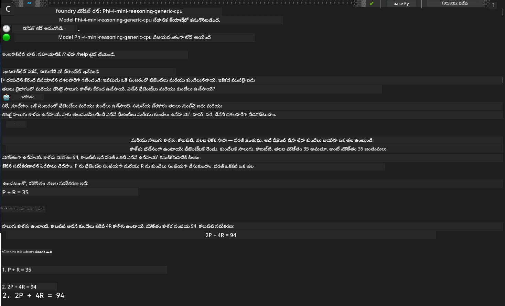

<!--
CO_OP_TRANSLATOR_METADATA:
{
  "original_hash": "52973a5680a65a810aa80b7036afd31f",
  "translation_date": "2025-12-21T23:38:21+00:00",
  "source_file": "md/01.Introduction/02/07.FoundryLocal.md",
  "language_code": "te"
}
-->
## Foundry Localలో Phi-కుటుంబ మోడల్స్‌తో ప్రారంభించడం

### Foundry Local కి పరిచయం

Foundry Local ఒక శక్తివంతమైన ఆన్‑డివైస్ AI నిర్ధారణ (inference) పరిష్కారం, ఇది ఎంటర్ప్రైజ్-స్థాయి AI సామర్థ్యాలను నేరుగా మీ స్థానిక హార్డ్‌వేర్‌కు తీసుకువస్తుంది. ఈ పాఠం Foundry Localతో Phi-కుటుంబ మోడల్స్‌ను సెట్టప్ చేయడం మరియు ఉపయోగించడం ద్వారా మీ AI పనభారం మీద పూర్తిగా నియంత్రణ పొందడంలో, గోప్యతను కాపాడడంలో మరియు ఖర్చులను తగ్గించడంలో మీకు మార్గనిర్దేశం చేస్తుంది.

Foundry Local మీ డివైస్‌పై స్థానికంగా AI మోడళ్ళను నడపడం ద్వారా పనితీరు, గోప్యత, అనుకూలీకరణ మరియు ఖర్చు లాభాలను అందిస్తుంది. ఇది అనుకూలమైన CLI, SDK, మరియు REST API ద్వారా మీ ఉన్న వర్క్‌ఫ్లోలు మరియు అనువర్తనాల్లో సులభంగా ఇంటిగ్రేట్ అవుతుంది。


### Foundry Localని ఎందుకు ఎంచుకోవాలి?

Foundry Local యొక్క లాభాలను అర్థం చేసుకోవడం మీ AI డిప్లాయ్‌మెంట్ వ్యూహం గురించి తెలివైన నిర్ణయాలు తీసుకోవడంలో మీకు సహాయపడుతుంది:

- **ఆన్-డివైస్ నిర్ధారణ (Inference):** మీ హార్డ్‌వేర్‌పై స్థానికంగా మోడళ్ళను నడపండి, అందడంతో మీ ఖర్చులు తగ్గుతాయ్ మరియు మీ అన్నీ డేటా మీ డివైస్‌లోనే ఉంటుంది.

- **మోడల్ అనుకూలీకరణ:** నిర్దిష్ట అవసరాలు మరియు వినియోగానికి తగినట్టు ప్రీసెట్ మోడల్స్ నుండి ఎంచుకోండి లేదా మీ స్వంత మోడల్‌ని ఉపయోగించండి.

- **ఖర్చు సామర్థ్యం:** మీ ఇప్పటికే ఉన్న హార్డ్‌వేర్ ఉపయోగించటం ద్వారా పదేపదే క్లౌడ్ సేవా ఖర్చులను తొలగించండి, ఇది AIని మరింత అందుబాటులోకి తీయవచ్చు.

- **సులభమైన సమీకరణ:** SDK, API ఎండ్పాయింట్లు లేదా CLI ద్వారా మీ అనువర్తనాలతో కనెక్ట్ చేసుకోండి, అవసరం పెరిగినప్పుడు Azure AI Foundryకి సులభంగా స్కేల్ చేయగల సామర్థ్యాన్ని పొందండి.

> **ప్రారంభ సూచన:** ఈ ట్యూటోరియల్ Foundry Localని CLI మరియు SDK ఇంటర్‌ఫేస్‌ల ద్వారా ఉపయోగించడం మీద కోరుకెత్తిస్తుంది. మీ వినియోగ కేసుకు ఉత్తమమైన పద్ధతిని ఎంచుకోవడానికి మీరు రెండింటికీ నేర్చుకుంటారు.

## భాగం 1: Foundry Local CLIని సెటప్ చేయడం

### దశ 1: ఇన్‌స్టాలేషన్

Foundry Local CLI మీ స్థానికంగా AI మోడల్స్‌ను నిర్వహించడానికి మరియు నడిపించడానికి ద్వారం. మీ సిస్టమ్‌లో దీన్ని సంస్థాపించడంనుంచి ప్రారంభిద్దాం.

**మద్దతు పొందే ప్లాట్‌ఫారమ్‌లు:** Windows మరియు macOS

విస్తృత ఇన్‌స్టాలేషన్ సూచనల కోసం, దయచేసి [Foundry Local అధికారిక డాక్యుమెంటేషన్](https://github.com/microsoft/Foundry-Local/blob/main/README.md) ను చూడండి.

### దశ 2: అందుబాటులో ఉన్న మోడళ్లను అన్వేషించడం

Once you have Foundry Local CLI installed, you can discover what models are available for your use case. This command will show you all supported models:


```bash
foundry model list
```

### దశ 3: Phi ఫ్యామిలీ మోడల్స్‌ని అర్థం చేసుకోవడం

The Phi Family offers a range of models optimized for different use cases and hardware configurations. Here are the Phi models available in Foundry Local:

**అందుబాటులో ఉన్న Phi మోడల్స్:** 

- **phi-3.5-mini** - ప్రాథమిక పనులకు కంపాక్ట్ మోడల్
- **phi-3-mini-128k** - పొడవైన సంభాషణల కోసం విస్తరించిన కాంటెక్ట్ వెర్షన్
- **phi-3-mini-4k** - సాధారణ వినియోగానికి ప్రామాణిక కాంటెక్ట్ మోడల్
- **phi-4** - మెరుగైన సామర్థ్యాలతో అభివృద్ధి చేసిన అధునాతన మోడల్
- **phi-4-mini** - Phi-4 యొక్క తేలికపాటి వెర్షన్
- **phi-4-mini-reasoning** - సంక్లిష్ట కారణపరమైన (reasoning) పనులకు ప్రత్యేకీకరించబడినది

> **హార్డ్‌వేర్ అనుకూలత:** ప్రతి మోడల్ మీ సిస్టమ్ సామర్థ్యాల ఆధారంగా వివిధ హార్డ్‌వేర్ యాక్సలరేషన్ (CPU, GPU) కోసం కాన్ఫిగర్ చేయగలదు.

### దశ 4: మీ మొదటి Phi మోడల్ నడపడం

Let's start with a practical example. We'll run the `phi-4-mini-reasoning` model, which excels at solving complex problems step-by-step.


**మోడల్ నడపడానికి కమాండ్:**

```bash
foundry model run Phi-4-mini-reasoning-generic-cpu
```

> **మొద్దటి సెటప్:** ఒక మోడల్‌ను మొదటిసారిగా నడిపించే సమయంలో, Foundry Local దాన్ని ఆటోమేటిగ్గా మీ స్థానిక డివైస్‌కు డౌన్‌లోడ్ చేస్తుంది. డౌన్లోడ్ సమయం మీ నెట్‌వర్క్ వేగంపై ఆధారపడి మారుతుంది, కాబట్టి ప్రారంభ సెటప్ సమయంలో సహనం వెయ్యండి.

### దశ 5: వాస్తవ సమస్యతో మోడల్ ను పరీక్షించడం

ఇప్పుడు దశలు వారీగా కారణపరమైన తర్కాన్ని ఎలా నిర్వహిస్తుందో చూడటానికి మనం ఒక క్లాసిక్ లోజిక్ సమస్యతో మా మోడల్‌ను పరీక్షిద్దాం:

**ఉదాహరణ సమస్య:**

```txt
Please calculate the following step by step: Now there are pheasants and rabbits in the same cage, there are thirty-five heads on top and ninety-four legs on the bottom, how many pheasants and rabbits are there?
```

**అంచనా నడవరు స్వభావం:** మోడల్ ఈ సమస్యను తర్కశాస్త్రీయ దశలుగా విభజించాలి, pheasants కు 2 కాళ్లు మరియు rabbits కు 4 కాళ్లు ఉన్నమంటూ సమీకరణ సిద్ధాంతాన్ని ఉపయోగించి వ్యవస్థను పరిష్కరించాలి.

**ఫలితాలు:**



## భాగం 2: Foundry Local SDKతో అనువర్తనాలు అభివృద్ధి చేయడం

### SDKని ఎందుకు ఉపయోగించాలి?

CLI పరీక్షలు మరియు వేగవంతమైన పరస్పర చర్యల కోసం సబ్యంగా ఉండగా, SDK Foundry Localను ప్రోగ్రామాటిక్గా మీ అనువర్తనాల్లో సమీకరించడానికి ఉపయోగపడుతుంది. ఇది క్రింది అవకాశాలను తెరుస్తుంది:

- అనుకూలమైన AI-శక్తిగల అనువర్తనాలు నిర్మించడం
- ఆటోమేటెడ్ వర్క్‌ఫ్లోలను సృష్టించడం
- ఉన్న వ్యవస్థల్లో AI సామర్థ్యాలను సమీకరించడం
- చాట్‌బాట్స్ మరియు ఇంటరాక్టివ్ టూల్స్ అభివృద్ధి చేయడం

### మద్దతు పొందే ప్రోగ్రామింగ్ భాషలు

Foundry Local మీ అభివృద్ధి ప్రాధాన్యతలకు అనుగుణంగా బహుళ ప్రోగ్రామింగ్ భాషల కోసం SDK మద్దతును అందిస్తుంది:

**📦 అందుబాటులో ఉన్న SDKలు:**

- **C# (.NET):** [SDK డాక్యుమెంటేషన్ మరియు ఉదాహరణలు](https://github.com/microsoft/Foundry-Local/tree/main/sdk/cs)
- **Python:** [SDK డాక్యుమెంటేషన్ మరియు ఉదాహరణలు](https://github.com/microsoft/Foundry-Local/tree/main/sdk/python)
- **JavaScript:** [SDK డాక్యుమెంటేషన్ మరియు ఉదాహరణలు](https://github.com/microsoft/Foundry-Local/tree/main/sdk/js)
- **Rust:** [SDK డాక్యుమెంటేషన్ మరియు ఉదాహరణలు](https://github.com/microsoft/Foundry-Local/tree/main/sdk/rust)

### తదుపరి దశలు

1. మీ అభివృద్ధి వాతావరణాన్ని ఆధారంగా మీ ఇష్టమైన SDKను ఎంచుకోండి
2. వివరమైన అమలు మార్గదర్శకాలకు SDK-స్పెసిఫిక్ డాక్యుమెంటేషన్‌ను అనుసరించండి
3. క్లిష్టమైన అనువర్తనాలు నిర్మించే ముందు సరళమైన ఉదాహరణలతో ప్రారంభించండి
4. ప్రతి SDK రిపోజిటరీలో అందించిన నమూనా కోడ్ను పరిశీలించండి

## సారాంశం

ఇప్పుడు మీరు ఈ విషయాలు నేర్చుకున్నారు:
- ✅ Foundry Local CLIని ఇన్‌స్టాల్ చేసి సెటప్ చేయడం
- ✅ Phi ఫ్యామిలీ మోడల్స్‌ను కనుగొని నడపడం
- ✅ మోడల్స్‌ను వాస్తవ ప్రపంచ సమస్యలతో పరీక్షించడం
- ✅ అనువర్తన అభివృద్ధి కోసం SDK ఎంపికలను అర్థం చేసుకోవడం

Foundry Local మీ స్థానిక వాతావరణానికి నేరుగా AI సామర్థ్యాలను తీసుకువచ్చేందుకు ఒక శక్తివంతమైన ఆధారం అందిస్తుంది, పనితీరు, గోప్యత మరియు ఖర్చులపై నియంత్రణను ఇస్తూ అవసరమైతే క్లౌడ్ పరిష్కారాలకు స్కేల్ చేయగల తగిన అనుకూలతను నిర్వహిస్తుంది.

---

<!-- CO-OP TRANSLATOR DISCLAIMER START -->
అస్పష్టీకరణ:
ఈ పత్రం AI అనువాద సేవ Co‑op Translator (https://github.com/Azure/co-op-translator) ఉపయోగించి అనువదించబడింది. మేము ఖచ్చితత్వానికి యత్నిస్తున్నప్పటికీ, ఆటోమెటెడ్ అనువాదాల్లో తప్పులు లేదా పొరపాట్లు ఉండొచ్చు అని దయచేసి గుర్తుంచుకోండి. మూల పత్రాన్ని దాని స్థానిక (సమస్యా) భాషలోని ఫైల్‌ను అధికారిక మూలంగా పరిగణించాలి. కీలకమైన సమాచారానికి వృత్తిపరమైన మానవ అనువాదం చేయించుకోవాలని సిఫార్సు చేయబడుతుంది. ఈ అనువాదం వినియోగించడంవల్ల ఏర్పడిన ఏవైనా అపార్థాలు లేదా తప్పుగా అర్థం చేసుకోవడాలపై మేము బాధ్యత వహించము.
<!-- CO-OP TRANSLATOR DISCLAIMER END -->