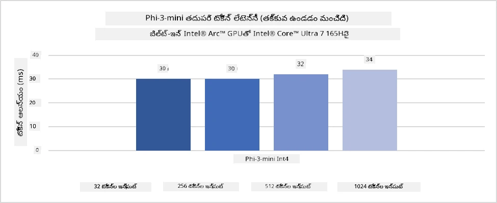
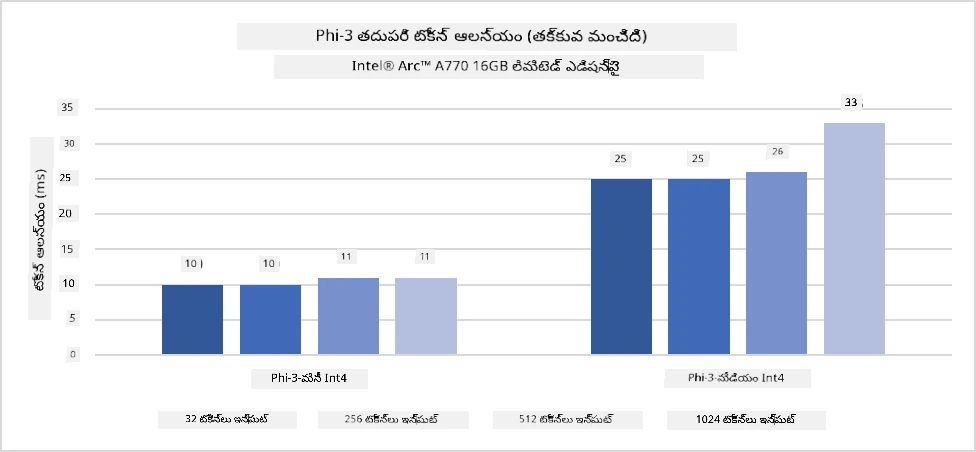
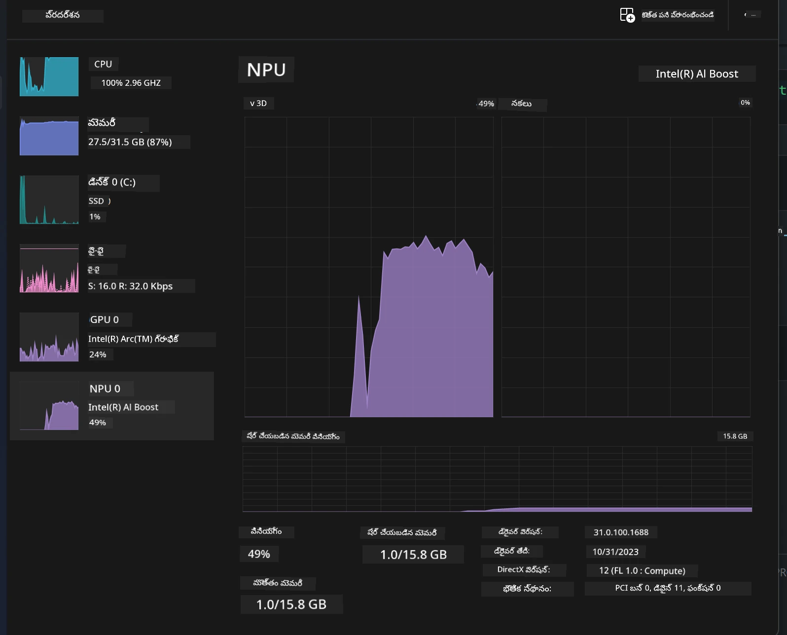
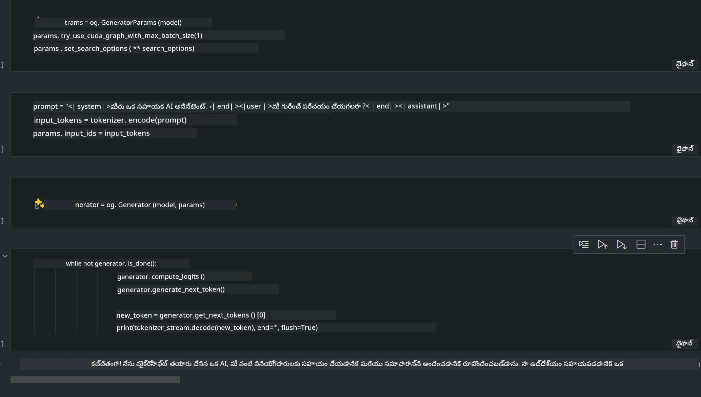
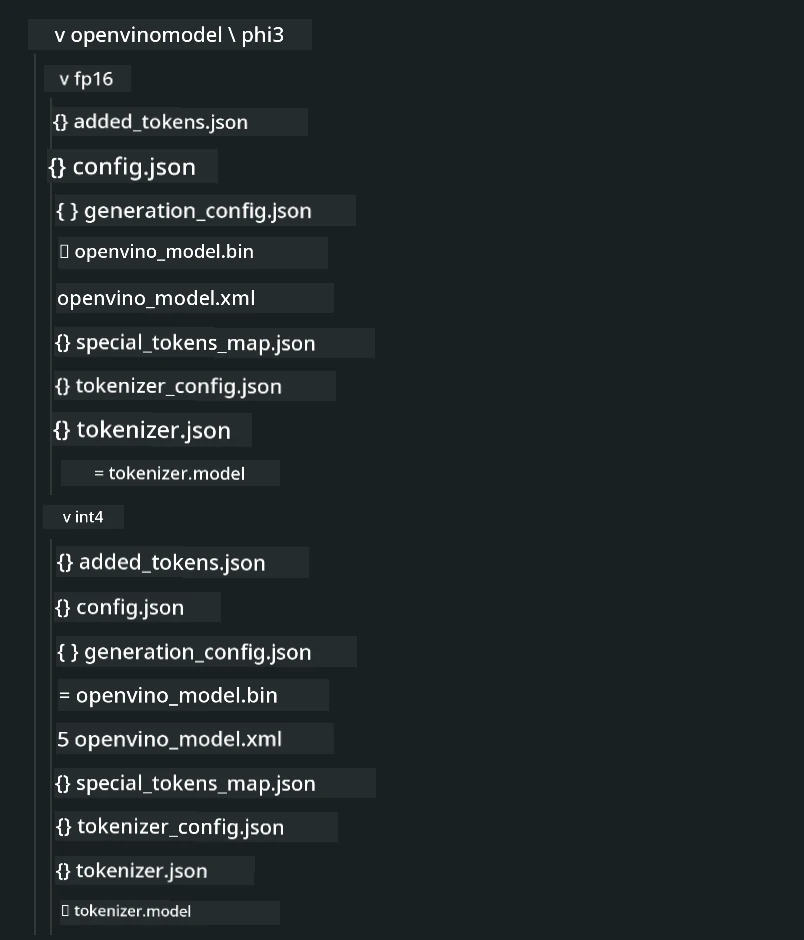
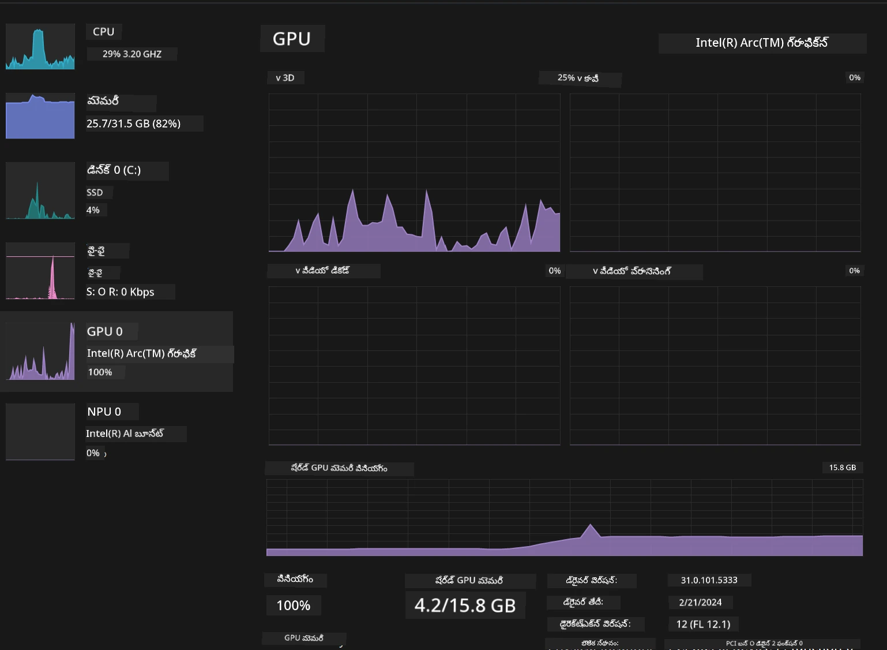

<!--
CO_OP_TRANSLATOR_METADATA:
{
  "original_hash": "e08ce816e23ad813244a09ca34ebb8ac",
  "translation_date": "2025-12-22T00:26:08+00:00",
  "source_file": "md/01.Introduction/03/AIPC_Inference.md",
  "language_code": "te"
}
-->
# **AI PCలో Phi-3 ఇన్‌ఫరెన్స్**

సృజనాత్మక AIలో పురోగతి మరియు ఎడ్జ్ డివైస్ హార్డ్‌వేర్ సామర్థ్యాల మెరుగుదలతో, మరిన్ని సృజనాత్మక AI మోడళ్ళను వినియోగదారుల Bring Your Own Device (BYOD) డివైస్లలో ఏకీకృతం చేయవచ్చని పెరుగుతున్న సంఖ్య ఉంది. AI PCలు ఈ మోడళ్లలో ఒకటి. 2024 నుండి, Intel, AMD, మరియు Qualcomm PC తయారీదారులతో కలిసి రహదారుల మార్పుల ద్వారా స్థానిక సృష్టించబడిన AI మోడళ్ళను పంపిణీ చేయడానికి సులభతరం చేసే AI PCలను పరిచయం చేశారు. ఈ చర్చలో, మేము Intel AI PCలపై దృష్టి సారించి, Intel AI PCపై Phi-3ని ఎలా نشر చేయాలో (deploy) పరిశీలించబోతున్నాము.

### NPU అంటే ఏమిటి

NPU (న్యూరల్ ప్రాసెసింగ్ యూనిట్) అనేది పెద్ద SoCలో ఒక అంకిత ప్రాసెసర్ లేదా ప్రాసెసింగ్ యూనిట్, ఇది న్యూరల్ నెట్‌వర్క్ ఆపరేషన్ల మరియు AI పనులను వేగవంతం చేయడానికి ప్రత్యేకంగా రూపకల్పన చేయబడింది. సాధారణ ఉద్దేశ్య CPU మరియు GPUలతో పోలిస్తే, NPUs డేటా-సరితమైన పాటల కంప్యూటింగ్ కోసం ఆప్టిమైజ్ చేయబడ్డాయి, వీడియోలు మరియు చిత్రాలు వంటి భారీ మల్టీమీడియా డేటాను మరియు న్యూరల్ నెట్‌వర్క్‌లకు సంబంధించిన డేటాను ప్రాసెస్ చేయడంలో అత్యంత సమర్థవంతమవుతాయి. ఇవి స్పచ్ గుర్తింపు, వీడియో కాల్‌లలో నేపథ్య బ్లరింగ్, మరియు ఆబ్జెక్ట్ డిటక్షన్ వంటి ఫొటో లేదా వీడియో ఎడిటింగ్ ప్రక్రియలు వంటి AI సంబంధిత పనులలో ప్రత్యేకంగా నైపుణ్యం పొందాయి.

## NPU vs GPU

బహుశా AI మరియు మెషిన్ లెర్నింగ్ పనులు GPUs మీద జరుగుతున్నప్పటికీ, GPUs మరియు NPUs మధ్య ఒక కీలక భేదం ఉంది.
GPUs తమ సమాంతర కంప్యూటింగ్ సామర్ధ్యాల కోసం ప్రసిద్ధి గాంచినప్పటికీ, అన్ని GPUs గ్రాఫిక్స్ ప్రాసెసింగ్ తప్ప మరింత సమర్థవంతంగా ఉండవు. NPUs, మర另一方面, న్యూరల్ నెట్‌వర్క్ ఆపరేషన్లకి అవసరమైన సంక్లిష్ట గణనల కోసం ప్రత్యేకంగా నిర్మించబడ్డాయి, అవి AI పనులకు అత్యంత ప్రభావవంతంగా ఉంటాయి.

సారాంశంగా, NPUs AI గణనలను వేగవంతం చేసే గణిత నిపుణుల్లా ఉంటాయి, మరియు అవి ఉద్భవిస్తున్న AI PC యుగంలో కీలక పాత్ర పోషిస్తాయి!

***This example is based on Intel's latest Intel Core Ultra Processor***

## **1. Use NPU to run Phi-3 model**

Intel® NPU డివైస్ అనేది Intel క్లయింట్ CPUలతో ఏకీకృతమైన AI ఇన్ఫరెన్స్ ఆక్సిలెరేటర్, Intel® Core™ Ultra తరం CPUలతో మొదలైనది (మునుపటి పేరు Meteor Lake). ఇది ఆర్టిఫిషియల్ న్యూరల్ నెట్‌వర్క్ పనులను ఎనర్జీ-ఎఫిషియెంట్‌గా నిర్వహించడానికి సహాయపడుతుంది.





**Intel NPU Acceleration Library**

The Intel NPU Acceleration Library [https://github.com/intel/intel-npu-acceleration-library](https://github.com/intel/intel-npu-acceleration-library) ఒక Python లైబ్రరీ, ఇది సुसంగతమైన హార్డ్వేర్‌పై Intel Neural Processing Unit (NPU) శక్తిని వినియోగించి మీ అప్లికేషన్ల సామర్థ్యాన్ని పెంచడానికి రూపకల్పన చేయబడింది.

Example of Phi-3-mini on AI PC powered by Intel® Core™ Ultra processors.


Install the Python Library with pip

```bash

   pip install intel-npu-acceleration-library

```

***గమనిక*** ప్రాజెక్టు ఇంకా అభివృద్ధిలో ఉంది, కానీ రిఫరెన్స్ మోడల్ ఇప్పటికే చాలా పూర్తి స్థాయిలో ఉంది.

### **Intel NPU Acceleration Library తో Phi-3 నడపడం**

Intel NPU ఆక్సిలెరేషన్ ఉపయోగిస్తున్నప్పుడు, ఈ లైబ్రరీ సంప్రదాయ ఎంకోడింగ్ ప్రక్రియను ప్రభావితం చేయదు. మీకు అవసరం ఉన్నది ఈ లైబ్రరీని ఉపయోగించి ఆరిజినల్ Phi-3 మోడల్‌ను క్వాంటైజ్ చేయడం మాత్రమే, ఉదాహరణకు FP16, INT8, INT4 వంటి ఫార్మాట్లలో.

```python
from transformers import AutoTokenizer, pipeline,TextStreamer
from intel_npu_acceleration_library import NPUModelForCausalLM, int4
from intel_npu_acceleration_library.compiler import CompilerConfig
import warnings

model_id = "microsoft/Phi-3-mini-4k-instruct"

compiler_conf = CompilerConfig(dtype=int4)
model = NPUModelForCausalLM.from_pretrained(
    model_id, use_cache=True, config=compiler_conf, attn_implementation="sdpa"
).eval()

tokenizer = AutoTokenizer.from_pretrained(model_id)

text_streamer = TextStreamer(tokenizer, skip_prompt=True)
```

క్వాంటైజేషన్ విజయవంతమైతే, Phi-3 మోడల్‌ను నడపడానికి NPUని కాల్ చేయడానికి ఎగ్జిక్యూషన్‌ను కొనసాగించండి.

```python
generation_args = {
   "max_new_tokens": 1024,
   "return_full_text": False,
   "temperature": 0.3,
   "do_sample": False,
   "streamer": text_streamer,
}

pipe = pipeline(
   "text-generation",
   model=model,
   tokenizer=tokenizer,
)

query = "<|system|>You are a helpful AI assistant.<|end|><|user|>Can you introduce yourself?<|end|><|assistant|>"

with warnings.catch_warnings():
    warnings.simplefilter("ignore")
    pipe(query, **generation_args)
```

కోడ్ అమలుపరచేటప్పుడు, Task Manager ద్వారా NPU యొక్క రన్ స్థితిని చూడవచ్చు



***నమూనాలు*** : [AIPC_NPU_DEMO.ipynb](../../../code/03.Inference/AIPC/AIPC_NPU_DEMO.ipynb)

## **2. Use DirectML + ONNX Runtime to run Phi-3 Model**

### **DirectML అంటే ఏమిటి**

[DirectML](https://github.com/microsoft/DirectML) ఒక హై-పర్ఫార్మెన్స్, హార్డ్వేర్-అక్సిలెరేటెడ్ DirectX 12 లైబ్రరీ ఫర్ మెషిన్ లర్నింగ్. DirectML సాధారణ మెషిన్ లర్నింగ్ టాస్కులకు GPU ఆక్పతని వివిధ అన్నిగోపనమైన హార్డ్‌వేర్ మరియు డ్రైవర్లపై అందిస్తుంది, ఇందులో AMD, Intel, NVIDIA, మరియు Qualcomm వంటి తయారీదారుల అన్ని DirectX 12 సామర్ధ్య గల GPUs కూడా ఉన్నాయి.

స్టాండ్‌లోన్‌గా ఉపయోగించినప్పుడు, DirectML API తక్కువ-స్థాయి DirectX 12 లైబ్రరీగా ఉంటుంది మరియు ఫ్రేమ్‌వర్క్స్, గేమ్స్, మరియు ఇతర రియల్-టైమ్ అప్లికేషన్ల వంటి హై-పర్ఫార్మెన్స్, తక్కువ-లేటెన్సీ అప్లికేషన్లకు అనువైనది. DirectML యొక్క Direct3D 12 తో సులభంగా ఇంటర్‌ఆపరబిలిటి, తక్కువ ఓవర్‌హెడ్ మరియు హార్డ్‌వేర్ అంతర్జాతీయ సౌకర్యం దీన్ని నిలకడైన మరియు ఊహించదగిన ఫలితాల కోసం అనుకూలంగా చేస్తుంది.

***గమనిక*** : తాజా DirectML ఇప్పటికే NPUని మద్దతు ఇస్తుంది(https://devblogs.microsoft.com/directx/introducing-neural-processor-unit-npu-support-in-directml-developer-preview/)

###  DirectML మరియు CUDA వీలైన సామర్థ్యాలు మరియు పనితీరుల పరంగా:

**DirectML** Microsoft ద్వారా అభివృద్ధి చేసిన మెషిన్ లర్నింగ్ లైబ్రరీ. ఇది Windows పరికరాలపై, డెస్క్‌టాప్‌లు, ల్యాప్‌టాప్‌లు మరియు ఎడ్జ్ డివైస్‌లలో మెషిన్ లర్నింగ్ పనులను వేగవంతం చేయడానికి రూపకల్పన చేయబడింది.
- DX12-ఆధారిత: DirectML DirectX 12 (DX12) పై నిర్మించబడింది, ఇది GPUsలో విస్తృత హార్డ్‌వేర్ మద్దతును అందిస్తుంది, NVIDIA మరియు AMD రెండింటినీ కలిగిస్తుంది.
- విస్తృత మద్దతు: ఇది DX12ని వినియోగించుకోవడం వల్ల, ఏ డివైస్ DX12కు మద్దతు ఇచ్చిన GPUతో DirectML పనిచేయగలదు, ఇన్టిగ్రేటెడ్ GPUs కూడా చేర్చుకుని.
- ఇమేజ్ ప్రాసెసింగ్: DirectML ఇమేజెస్ మరియు ఇతర డేటాను న్యూరల్ నెట్వర్క్‌ల ద్వారా ప్రాసెస్ చేస్తుంది, ఇది ఇమేజ్ గుర్తింపు, ఆబ్జెక్ట్ డిటక్షన్ వంటి పనులకు అనుకూలం.
- సెట్‌ప్ సౌలభ్యం: DirectML సెటప్ చేయడం సులభం, మరియు ఇది GPU తయారీదారుల నుండి ప్రత్యేక SDKs లేదా లైబ్రరీలను అవసరం చేయదు.
- పనితీరు: కొన్ని సందర్భాల్లో, DirectML మంచి పనితీరును చూపుతుంది మరియు ప్రత్యేక పనులు కోసం CUDA కంటే వేగంగా ఉండవచ్చు.
- పరిమితులు: అయితే, float16 పెద్ద బాచ్ సైజుల విషయంలో DirectML కొంత మందగించే అవకాశముంది.

**CUDA** NVIDIA యొక్క పారలల్ కంప్యూటింగ్ ప్లాట్‌ఫారమ్ మరియు ప్రోగ్రామింగ్ మోడల్. ఇది డెవలపర్లకు NVIDIA GPUs శక్తిని జనరల్-పర్పస్ కంప్యూటింగ్ కోసం వినియోగించుకునేలా అనుమతిస్తుంది, దీనిలో మెషిన్ లర్నింగ్ మరియు శాస్త్రీయ సిమ్యులేషన్లు ఉన్నాయి.
- NVIDIA-నిర్దిష్టం: CUDA NVIDIA GPUsతో బలంగా సమన్వయంగా ఉంటుంది మరియు ప్రత్యేకంగా వారికే రూపొందించబడింది.
- అత్యంత ఆప్టిమైజ్డ్: GPU-ఆక్సిలరేటెడ్ టాస్కుల కోసం ఇది అద్భుతమైన పనితీరును అందిస్తుంది, ముఖ్యంగా NVIDIA GPUs ఉపయోగించినప్పుడు.
- విస్తృతంగా ఉపయోగించబడుతుంది: TensorFlow మరియు PyTorch వంటి చాలా మెషిన్ లర్నింగ్ ఫ్రేమ్‌వర్క్స్ మరియు లైబ్రరీలు CUDA మద్దతు కలిగి ఉంటాయి.
- అనుకూలీకరణ: డెవలపర్లు నిర్దిష్ట పనుల కోసం CUDA సెట్టింగులను ఫైన్-ట్యూన్ చేయవచ్చు, ఇది ఆప్టిమల్ పనితీరుకు దారితీస్తుంది.
- పరిమితులు: అయితే, CUDA యొక్క ఆధారపాటు NVIDIA హార్డ్‌వేర్‌పై ఉండటం విభిన్న GPUsపై విస్తృత అనుకూలతను కోరుకునే సందర్భాలలో పరిమితంగా ఉండవచ్చు.

### DirectML మరియు CUDA మధ్య ఎంచుకోవడం

DirectML మరియు CUDA మధ్య ఎంపిక మీ ప్రత్యేక వాడుక కేసు, హార్డ్‌వేర్ లభ్యత మరియు అభిరుచులపై ఆధారపడి ఉంటుంది.
విస్తృత అనుకూలత మరియు సెట్‌ప్ సౌలభ్యం కావాలనుకుంటే, DirectML మంచి ఎంపిక అయి ఉండవచ్చు. అయితే, మీకు NVIDIA GPUs ఉంటే మరియు అత్యంత ఆప్టిమైజ్ చేయబడిన పనితీరు అవసరమైతే, CUDA ఇంకా బలమైన ప్రత్యామ్నాయంగా ఉంటుంది. సంక్షిప్తంగా, DirectML మరియు CUDA రెండింటికీ తమ బలాలు మరియు బలహీనతలు ఉన్నాయి, కాబట్టి మీ అవసరాలు మరియు లభ్యమయ్యే హార్డ్‌వేర్‌ను పరిగణలోకి తీసుకొని నిర్ణయించండి.

### **ONNX Runtime తో Generative AI**

AI యుగంలో, AI మోడళ్ల పోర్టబిలిటీ చాలా ముఖ్యమైనది. ONNX Runtime శిక్షణ పొందిన మోడళ్లను వివిధ పరికరాలపై సులభంగా డిప్లాయ్ చేయగలదు. డెవలపర్లు ఇన్ఫరెన్స్ ఫ్రేమ్‌వర్క్ గురించి ఆలోచించాల్సిన అవసరం లేకుండా ఒకే API ద్వారా మోడల్ ఇన్ఫరెన్స్ పూర్తి చేయచ్చు. జనరేటివ్ AI యుగంలో, ONNX Runtime కూడా కోడ్ ఆప్టిమైజేషన్ నిర్వహించింది (https: //onnxruntime.ai/docs/genai/). ఆప్టిమైజ్ చేయబడిన ONNX Runtime ద్వారా, క్వాంటైజ్ చేసిన జనరేటివ్ AI మోడల్ వివిధ టర్మినల్స్‌పై ఇన్ఫరెన్స్ చేయవచ్చు. ONNX Runtime తో Generative AIలో, మీరు Python, C#, C / C++ ద్వారా AI మోడల్ APIని ఇన్ఫర్ చేయవచ్చు. ఖచ్చితంగా, iPhoneపై డిప్లాయ్ చేయడము C++ యొక్క ONNX Runtime Generative AI APIని ఉపయోగించుకోవచ్చు.

[Sample Code](https://github.com/Azure-Samples/Phi-3MiniSamples/tree/main/onnx)

***ONNX Runtime లైబ్రరీతో జనరేటివ్ AIని కాంపైల్ చేయడం***

```bash

winget install --id=Kitware.CMake  -e

git clone https://github.com/microsoft/onnxruntime.git

cd .\onnxruntime\

./build.bat --build_shared_lib --skip_tests --parallel --use_dml --config Release

cd ../

git clone https://github.com/microsoft/onnxruntime-genai.git

cd .\onnxruntime-genai\

mkdir ort

cd ort

mkdir include

mkdir lib

copy ..\onnxruntime\include\onnxruntime\core\providers\dml\dml_provider_factory.h ort\include

copy ..\onnxruntime\include\onnxruntime\core\session\onnxruntime_c_api.h ort\include

copy ..\onnxruntime\build\Windows\Release\Release\*.dll ort\lib

copy ..\onnxruntime\build\Windows\Release\Release\onnxruntime.lib ort\lib

python build.py --use_dml


```

**లైబ్రరీ ఇన్‌స్టాల్ చేయండి**

```bash

pip install .\onnxruntime_genai_directml-0.3.0.dev0-cp310-cp310-win_amd64.whl

```

ఇది అమలులో ఉన్న ఫలితం



***నమూనాలు*** : [AIPC_DirectML_DEMO.ipynb](../../../code/03.Inference/AIPC/AIPC_DirectML_DEMO.ipynb)

## **3. Use Intel OpenVino to run Phi-3 Model**

### **OpenVINO అంటే ఏమిటి**

[OpenVINO](https://github.com/openvinotoolkit/openvino) ఒక ఓపెన్-సోర్స్ టూల్‌కిట్, ఇది డీప్ లెర్నింగ్ మోడల్స్‌ను ఆప్టిమైజ్ చేసి డిప్లాయ్ చేయడానికి ఉపయోగపడుతుంది. ఇది TensorFlow, PyTorch వంటి ప్రముఖ ఫ్రేమ్‌వర్క్స్ నుండి విజన్, ఆడియో మరియు భాషా మోడల్స్‌కు వేగవంతమైన డీప్ లెర్నింగ్ పనితీరును అందిస్తుంది. OpenVINO ప్రారంభించడానికి గైడ్ పొందండి. OpenVINO ను CPU మరియు GPU తో కలిసి Phi-3 మోడల్ నడపడానికి కూడా ఉపయోగించవచ్చు.

***గమనిక***: ప్రస్తుతం, OpenVINO ప్రస్తుతం NPUని మద్దతు ఇవ్వదు.

### **OpenVINO లైబ్రరీ ఇన్‌స్టాల్ చేయడం**

```bash

 pip install git+https://github.com/huggingface/optimum-intel.git

 pip install git+https://github.com/openvinotoolkit/nncf.git

 pip install openvino-nightly

```

### **OpenVINO తో Phi-3 నడపడం**

NPU లాగే, OpenVINO కూడా జనరేటివ్ AI మోడళ్ల కాల్‌ను క్వాంటైజ్ చేయబడిన మోడళ్లను నడుపుతూ పూర్తి చేస్తుంది. ముందుగా Phi-3 మోడల్‌ను క్వాంటైజ్ చేయవలసింది మరియు optimum-cli ద్వారా కమాండ్ లైన్‌లో మోడల్ క్వాంటైజేషన్‌ను పూర్తి చేయాలి

**INT4**

```bash

optimum-cli export openvino --model "microsoft/Phi-3-mini-4k-instruct" --task text-generation-with-past --weight-format int4 --group-size 128 --ratio 0.6  --sym  --trust-remote-code ./openvinomodel/phi3/int4

```

**FP16**

```bash

optimum-cli export openvino --model "microsoft/Phi-3-mini-4k-instruct" --task text-generation-with-past --weight-format fp16 --trust-remote-code ./openvinomodel/phi3/fp16

```

కన్వర్ట్ చేయబడిన ఫార్మాట్ ఇలా ఉంటాయి



Load model paths(model_dir), related configurations(ov_config = {"PERFORMANCE_HINT": "LATENCY", "NUM_STREAMS": "1", "CACHE_DIR": ""}), and hardware-accelerated devices(GPU.0) through OVModelForCausalLM

```python

ov_model = OVModelForCausalLM.from_pretrained(
     model_dir,
     device='GPU.0',
     ov_config=ov_config,
     config=AutoConfig.from_pretrained(model_dir, trust_remote_code=True),
     trust_remote_code=True,
)

```

కోడ్ అమలు చేసినప్పుడు, Task Manager ద్వారా GPU యొక్క రన్ స్థితిని చూడవచ్చు



***నమూనాలు*** : [AIPC_OpenVino_Demo.ipynb](../../../code/03.Inference/AIPC/AIPC_OpenVino_Demo.ipynb)

### ***గమనిక*** : పై మూడు పద్ధతుల প্রত্যేకమైన తమ స్వంత లాభలున్నాయి, కానీ AI PC ఇన్ఫరెన్స్ కోసం NPU ఆక్సిలెరేషన్ వాడకాన్ని సూచిస్తారు.

---

<!-- CO-OP TRANSLATOR DISCLAIMER START -->
స్పష్టం:
ఈ పత్రం AI అనువాద సేవ Co-op Translator (https://github.com/Azure/co-op-translator) ద్వారా అనువదించబడినది. మేము ఖచ్చితత్వానికి శ్రమిస్తే కూడ, స్వయంచాలక అనువాదాల్లో పొరపాట్లు లేదా తప్పులు ఉండొచ్చు అని దయచేసి గమనించండి. మూల భాషలో ఉన్న పత్రాన్ని ప్రామాణిక మూలంగా పరిగణించాలి. ముఖ్యమైన సమాచారానికి నిపుణులైన మానవ అనువాదం సూచించబడుతుంది. ఈ అనువాదాన్ని ఉపయోగించడం వల్ల ఏర్పడిన ఏవైనా అపార్థాలు లేదా తప్పర్ వ్యాఖ్యానాల గురించి మేము బాధ్యత వహించము.
<!-- CO-OP TRANSLATOR DISCLAIMER END -->