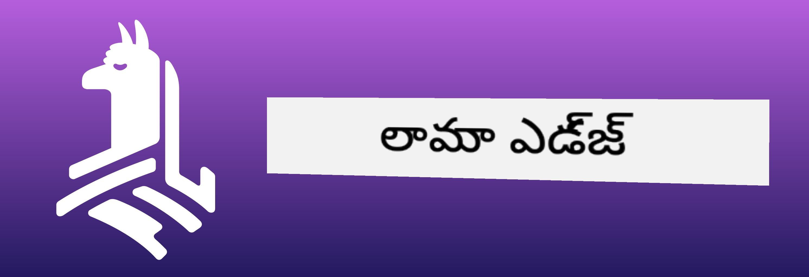
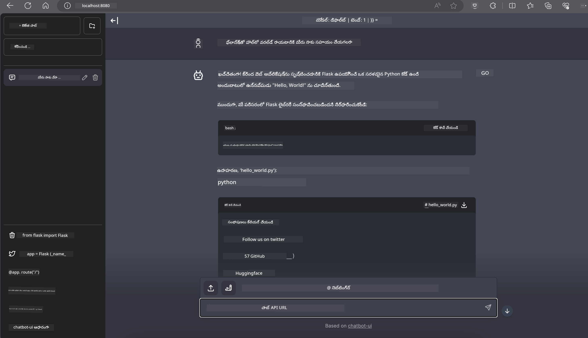

<!--
CO_OP_TRANSLATOR_METADATA:
{
  "original_hash": "be4101a30d98e95a71d42c276e8bcd37",
  "translation_date": "2025-12-22T01:06:50+00:00",
  "source_file": "md/01.Introduction/03/Jetson_Inference.md",
  "language_code": "te"
}
-->
# **Phi-3 ను Nvidia Jetson లో ఇన్ఫరెన్స్ చేయడం**

Nvidia Jetson అనేది Nvidia నుండి వచ్చిన ఎంబెడ్డెడ్ కంప్యూటింగ్ బోర్డుల శ్రేణి. Jetson TK1, TX1 మరియు TX2 మోడెల్స్ అన్ని Nvidia నుండి Tegra ప్రాసెసర్ (లేదా SoC) కలిగి ఉంటాయి, ఇది ARM ఆర్కిటెక్చర్ സെంట్రల్ ప్రాసెసింగ్ యూనిట్ (CPU) ను సమీకరిస్తుంది. Jetson తక్కువ శక్తి వినియోగ వ్యవస్థగా ఉంటుంది మరియు మిషన్ లెర్నింగ్ అప్లికేషన్లకు వేగవంతీకరణ కోసం రూపొందించబడింది. Nvidia Jetson ప్రొఫెషనల్ డెవలపర్లతో అన్ని పరిశ్రమలలో ఆవిర్భావక AI ఉత్పత్తులను సృష్టించడానికి ఉపయోగించబడుతుంది, మరియు విద్యార్థులకు మరియు ఆసక్తి ఉన్న వ్యక్తులకు ప్రత్యక్ష AI అభ్యాసం మరియు అద్భుతమైన ప్రాజెక్టుల కోసం ఉపకరించుతుంది. SLM Jetson వంటి ఎడ్జ్ పరికరాల్లో అమలు చేయబడుతుంది, ఇది పరిశ్రామిక జనరేటివ్ AI అప్లికేషన్ పరిస్థితులను మెరుగ్గా అమలు చేయడానికి సహాయపడుతుంది.

## NVIDIA Jetson లో డిప్లాయ్‌మెంట్:
ఆటోనోమస్ రోబోటిక్స్ మరియు ఎంబెడ్డెడ్ పరికరాలపై ప‌ని చేస్తున్న డెవలపర్లు Phi-3 Mini ను వినియోగించుకోవచ్చు. Phi-3 యొక్క相對ంగా చిన్న పరిమాణం దాన్ని ఎడ్జ్ డిప్లాయ్‌మెంట్‌కి సరైనది చేస్తుంది. శిక్షణ సమయంలో పారామితులను మన్మథంగా ట్యూన్ చేసి, ప్రతిస్పందనల్లో అధిక ఖచ్చితత్వాన్ని నిర్ధారించారు.

### TensorRT-LLM స్మర్తీకరణ:
NVIDIA యొక్క [TensorRT-LLM లైబ్రరీ](https://github.com/NVIDIA/TensorRT-LLM?WT.mc_id=aiml-138114-kinfeylo) పెద్ద భాషా మోడల్ ఇన్ఫరెన్స్‌ను ఆప్టిమైజ్ చేస్తుంది. ఇది Phi-3 Mini యొక్క పెద్ద context విండోను మద్దతు ఇస్తుంది, throughput మరియు latency రెండింటినీ మెరుగుపరుస్తుంది. ఆప్టిమైజేషన్లలో LongRoPE, FP8, మరియు inflight batching లాంటి టెక్నిక్స్ ఉన్నాయి.

### అందుబాటులో ఉండడంఓ మరియు డిప్లాయ్‌మెంట్:
డెవలపర్లు 128K context విండోతో Phi-3 Mini ను [NVIDIA's AI](https://www.nvidia.com/en-us/ai-data-science/generative-ai/) వద్ద అన్వేషించవచ్చు. ఇది NVIDIA NIM గా ప్యాకేజ్ చేయబడింది, ఒక స్టాండర్డ్ API కలిగిన మైక్రోసర్వీస్ ఇది ఎక్కడైనా డిప్లాయ్ చేయవచ్చు. అదనంగా, [GitHubపై TensorRT-LLM అమలు](https://github.com/NVIDIA/TensorRT-LLM).

 ## **1. సిద్ధత**


a. Jetson Orin NX / Jetson NX

b. JetPack 5.1.2+
   
c. Cuda 11.8
   
d. Python 3.8+

 ## **2. Jetsonలో Phi-3 ను నడపడం**

 మనం [Ollama](https://ollama.com) లేదా [LlamaEdge](https://llamaedge.com) ను ఎంచుకోవచ్చు

 మీరు gguf ను క్లౌడ్ మరియు ఎడ్జ్ పరికరాల్లో ఒకేసారి ఉపయోగించాలనుకుంటే, LlamaEdge ను WasmEdge గా భావించవచ్చు (WasmEdge ఒక లైట్‌వెయిట్, హై-పర్ఫార్మెన్స్, స్కేలబుల్ WebAssembly రన్‌టైమ్, ఇది క్లౌడ్ నేటివ్, ఎడ్జ్ మరియు decentralized అప్లికేషన్లకు తగినది. ఇది serverless అప్లికేషన్లు, ఎంబెడెడ్ ఫంక్షన్లు, మైక్రోసర్వీసులు, స్మార్ట్ కాంట్రాక్టులు మరియు IoT పరికరాలను మద్దతు ఇస్తుంది. మీరు gguf యొక్క క్వాంటిటేటివ్ మోడల్‌ను LlamaEdge ద్వారా ఎడ్జ్ పరికరాలకు మరియు క్లౌడ్‌కు డిప్లాయ్ చేయవచ్చు.)



ఇక్కడ ఉపయోగించడానికి స్టెప్పులు ఉన్నాయి 

1. సంబంధిత లైబ్రరీస్ మరియు ఫైళ్ళను ఇన్‌స్టాల్ చేసి డౌన్‌లోడ్ చేయండి

```bash

curl -sSf https://raw.githubusercontent.com/WasmEdge/WasmEdge/master/utils/install.sh | bash -s -- --plugin wasi_nn-ggml

curl -LO https://github.com/LlamaEdge/LlamaEdge/releases/latest/download/llama-api-server.wasm

curl -LO https://github.com/LlamaEdge/chatbot-ui/releases/latest/download/chatbot-ui.tar.gz

tar xzf chatbot-ui.tar.gz

```

**గమనిక**: llama-api-server.wasm మరియు chatbot-ui ఒకే డైరెక్టరీలో ఉండాలి

2. టెర్మినల్‌లో స్క్రిప్ట్స్‌ను నడపండి


```bash

wasmedge --dir .:. --nn-preload default:GGML:AUTO:{Your gguf path} llama-api-server.wasm -p phi-3-chat

```

ఇది నడిచే ఫలితం




***నమూనా కోడ్*** [Phi-3 mini WASM Notebook Sample](https://github.com/Azure-Samples/Phi-3MiniSamples/tree/main/wasm)

సారాంశంగా, Phi-3 Mini భాషా మోడలింగ్‌లో ఒక పెద్ద ప్రగతి్ని సూచిస్తుంది, ఇది కార్యదక్షత, సందర్భ అవగాహన మరియు NVIDIA యొక్క ఆప్టిమైజేషన్ సామర్థ్యాలను కలిపి ఉంటుంది. మీరు రోబోట్లు లేదా ఎడ్జ్ అప్లికేషన్లు నిర్మిస్తున్నారా, Phi-3 Mini ఒక శక్తివంతమైన సాధనం గా ఉండి ఉంటుంది.

---

<!-- CO-OP TRANSLATOR DISCLAIMER START -->
నిరాకరణ:
ఈ పత్రం AI అనువాద సేవ [Co-op Translator](https://github.com/Azure/co-op-translator) ఉపయోగించి అనువదించబడింది. మేము ఖచ్చితత్వానికి ప్రయత్నించినప్పటికీ, ఆటోమేటెడ్ అనువాదాల్లో తప్పులు లేదా లోపాలు ఉండవచ్చు అని దయచేసి గమనించండి. మూల పత్రాన్ని దాని స్వదేశీ (మూల) భాషలో ఉన్న అసలైన పత్రాన్నే అధికారిక మూలంగా పరిగణించాలి. కీలకమైన సమాచారానికి వృత్తిపరమైన మానవ అనువాదాన్ని చేయించుకోవాలని సూచిస్తాము. ఈ అనువాదం ఉపయోగించడంవల్ల కలిగే ఏవైనా అవగాహనా లోపాలు లేదా తప్పుగా అర్థం చేసుకోవడాలకు మేము బాధ్యులేరను.
<!-- CO-OP TRANSLATOR DISCLAIMER END -->